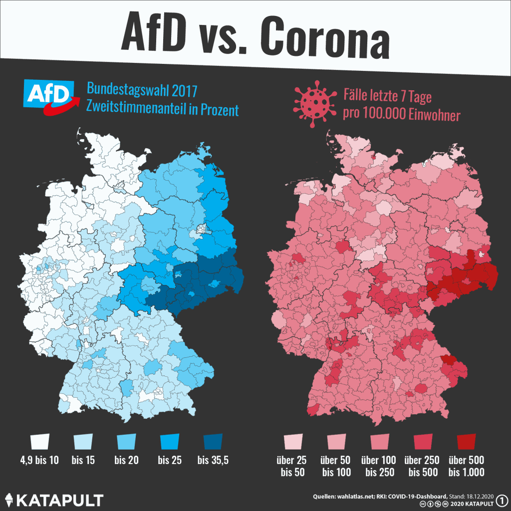

<script src="index_files/htmlwidgets/htmlwidgets.js"></script>
<link href="index_files/htmltools-fill/fill.css" rel="stylesheet" />
<link href="index_files/ggiraphjs/girafe.css" rel="stylesheet" />
<script src="index_files/ggiraphjs/girafe.js"></script>
<script src="index_files/girafe-binding/girafe.js"></script>
<script src="index_files/htmlwidgets/htmlwidgets.js"></script>
<script src="index_files/jquery/jquery.min.js"></script>
<link href="index_files/dygraphs/dygraph.css" rel="stylesheet" />
<script src="index_files/dygraphs/dygraph-combined.js"></script>
<script src="index_files/dygraphs/shapes.js"></script>
<script src="index_files/moment/moment.js"></script>
<script src="index_files/moment-timezone/moment-timezone-with-data.js"></script>
<script src="index_files/moment-fquarter/moment-fquarter.min.js"></script>
<script src="index_files/dygraphs-binding/dygraphs.js"></script>
<script src="index_files/Dygraph.Plotters.BarChart/barchart.js"></script>
<script src="index_files/Dygraph.Plugins.Crosshair/crosshair.js"></script>

Recently, I stumbled across this graphic from great [KATAPULT magazin](https://katapult-magazin.de/de):



The left map shows the final 2017 parliamentary election (second vote) results
(Zweitstimmenergebnis Bundestagswahl 2017)
by election region (Wahlkreis) for the German party *“Alternative für Deutschland” (AfD)*.
On the right, the 7-day COVID-19 incidence per 100,000 people is shown
by administrative region (Landkreis) as of 18.12.2020. Note that Wahlkreise and
Landkreise are generally similar but do differ on many occasions.

What the graphic suggests is a correlation (visually quite a pronounced one!)
between the 2017 election results and the 7-day incidence: the more people voted
for the AfD in 2017, the higher the incidence.
I found this visualization pretty telling, although, to be fair, I suspect the
date (18.12.2020) was most likely chosen
such that the correlation is most striking and, as usual, causation cannot be inferred
from correlation without context.
Of course, the authors of the visualization know about the difference between
correlation and causation. They [write on their website](https://katapult-magazin.de/de/artikel/afd-und-corona):

> “Ob der Zusammenhang kausal ist, also ein Ursache-Wirkungs-Zusammenhang besteht, ist unklar” (“Whether the relationship is causal, i.e. there is a cause-effect relationship, is unclear”).

No matter the question of correlation vs. causation or the political implications
a truly causal relationship would have, I took this graphic as an opportunity to
learn more about COVID-19 data and to keep practicing my data analysis skills general.
Most notably, I am interested in:

1.  the relationship between election results and commonly used SARS-COV-2/COVID-19
    indicators such as the 7-day incidence or the vaccination rate.
    I’m particularly interested to see if there is a similar relationship
    between election results (for the AfD or other parties) and
    vaccination rates by Landkreis or if there is a
    similar relationship between incidence and election results for other parties
    as well.
2.  data processing in general: in particular making maps in R,
    pulling data from different sources, cleaning,
    merging and everything else needed to create meaningful visualizations –
    quite in the spirit of my [TidyTuesday Series](https://www.manuelrademaker.com/blog/tidy_tuesday/).

## Setup

To follow along, download the file xxx containing the R script. Make sure you
have the following packages installed and load them.

``` r
require(tidyverse)  # tidyverse packages
require(scales)     # formating numbers
require(sf)         # working with shape files
require(readr)      # fast reading of csv files
require(gt)         # create nice-looking tables
require(patchwork)  # combine plots
require(glue)       # Glue strings to data in R
require(ggiraph)    # Create interactive graphs
require(zoo)        # to compute the rolling 7-day sum
require(xts)        # for working with time series
require(dygraphs)   # interactive time series
```

### A note for those wondering

I know about the [COVDID-19 Data Hub](https://github.com/covid19datahub)
which contains a ton of COVID-19 related info across countries and administrative areas.
Moreover, there are numerous projects that provide COVID-19 related data or APIs
to that data in a clean, curated way (e.g., [here](https://github.com/marlon360/rki-covid-api)
and [here](https://github.com/jgehrcke/covid-19-germany-gae)).
The reason I do not use any of those sources is twofold. First, I consider writing
this blog post more as an exercise. Taking a curated data
set would be like taking a shortcut when you are going for a hike – it simply
misses the point. Second, the R package `COVID19` – an interface to the COVID-19 Data Hub –
does not provide vaccination data on the Landkreis level, so I decided to use the raw RKI data. While the package does provide infection
data, it does not contain the AGS (“Amtlicher Gemeindeschlüssel”). The AGS is essentially a
unique Id for each Landkreis and kreisfreie Stadt that is used by all official/administrative data
providers. Since I need to match different data sets by Landkreis later, its nice
to have an Id since matching by Id is a lot – backed by (bad) experiences – less error-prone
than by name. Moreover, the AGS has the added benefit of a clear
hierarchical structure that allows easy identification of adherence of e.g. a
Landkreis or Gemeinde to other administrative areas such as its corresponding Bundesland.
Hence, I decided I go with the official data.

That being said, still do check out the [COVID19 package website](https://covid19datahub.io/) as
it can be super helpful for other COVID-19/SARS-COV-2 related questions.

## Data

### Getting the data

I use different data throughout this post. For clarity, I list all data including
their source and a direct link that will automatically start a download in a table here.
If you want to follow along, download the first three datasets/zip-files,
unzip (if necessary) and put the raw data or folders containing the data in the same folder as the
R script and rename (if necessary) the files according to the `Name` column.
For the RKI data, it is easiest to just provide the data link to `read_csv()` directly without
downloading the `.csv` file first (see below).

Note:

1.  Wahlkreise can change from election to election. The shapefile below is the
    version relevant for the 2017 election. To get the version relevant for the
    2021 election click [here](https://www.bundeswahlleiter.de/bundestagswahlen/2021/wahlkreiseinteilung/downloads.html).
2.  The data from RKIs GitHub page is updated on a daily basis. If you want  
    to reproduce the exact numbers of this post, only use dates smaller than 2021-08-31.
3.  As I mentioned in my note above: learning about data processing is part of
    the exercise. Hence, I deliberately only use raw data from the original sources.

| File name                     | Source / Direct link                                                                                                                                                                                                                                                                                                     | Description                                                                                                                                                                                                                                                                |
|:------------------------------|:-------------------------------------------------------------------------------------------------------------------------------------------------------------------------------------------------------------------------------------------------------------------------------------------------------------------------|:---------------------------------------------------------------------------------------------------------------------------------------------------------------------------------------------------------------------------------------------------------------------------|
| `election_results_2017.csv`   | [Bundeswahlleiter](https://www.bundeswahlleiter.de/bundestagswahlen/2017/ergebnisse.html), [Direct-link-to-data](https://www.bundeswahlleiter.de/dam/jcr/72f186bb-aa56-47d3-b24c-6a46f5de22d0/btw17_kerg.csv)                                                                                                            | Final results of the 2017 general election by Wahlkreis.                                                                                                                                                                                                                   |
| `wahlkreise_shp_2017.zip`     | [Bundeswahlleiter](https://www.bundeswahlleiter.de/bundestagswahlen/2017/wahlkreiseinteilung.html), [Direct-link-to-data](https://www.bundeswahlleiter.de/dam/jcr/4238f883-5a9b-4da6-a4d5-ac86f3752b88/btw21_geometrie_wahlkreise_vg250_geo_shp.zip)                                                                     | `.zip` file containing the geometry for all 299 Wahlkreise in different formats. In the following, I only use the shapefile format (`.shp`). The file needed is called: `Geometrie_Wahlkreise_20DBT_VG250_geo.shp`.                                                        |
| `vg250_ew_2020.zip`           | [BfKG](https://gdz.bkg.bund.de/index.php/default/digitale-geodaten/verwaltungsgebiete/verwaltungsgebiete-1-250-000-mit-einwohnerzahlen-ebenen-stand-31-12-vg250-ew-ebenen-31-12.html), [Direct-link-to-data](https://daten.gdz.bkg.bund.de/produkte/vg/vg250-ew_ebenen_1231/aktuell/vg250-ew_12-31.gk3.shape.ebenen.zip) | `.zip` file containing the geometry of German administrative areas including population from the “Bundesamt für Kartografie und Geodäsie” as of 01.01.2020. Only the geometry of the Kreise and kreisfreie Städte is needed. The relevant file is called: `VG250_KRS.shp`. |
| `Aktuell_...-Impfungen.csv`   | [RKI GitHub](https://github.com/robert-koch-institut/COVID-19-Impfungen_in_Deutschland), [Direct-link-to-data](https://raw.githubusercontent.com/robert-koch-institut/COVID-19-Impfungen_in_Deutschland/master/Aktuell_Deutschland_Landkreise_COVID-19-Impfungen.csv)                                                    | Absolute number of people vaccinated against COVID-19 by Landkreis, date, age group, and vaccination number (first or second) starting 27.12.2020.                                                                                                                         |
| `Aktuell_..._Infektionen.csv` | [RKI Github](https://github.com/robert-koch-institut/SARS-CoV-2_Infektionen_in_Deutschland), [Direct-link-to-data](https://media.githubusercontent.com/media/robert-koch-institut/SARS-CoV-2_Infektionen_in_Deutschland/master/Aktuell_Deutschland_SarsCov2_Infektionen.csv)                                             | Absolute number of infections with the SARS-COV-2 virus by Landkreis, date, age group and other characteristics.                                                                                                                                                           |

### Reading the data

Once you have downloaded and unzipped the data, run the following to read the data into R.
Ignore all the warnings and messages. We will have to do some processing anyway.

``` r
# 2017 German parliamentary election results
election_results_2017 <- read_csv2("election_results_2017.csv", skip = 5)
# Shapefile with the geometry of the 299 german Wahlkreise 
wahlkreise_shp_2017   <- st_read("wahlkreise_shp_2017/Geometrie_Wahlkreise_20DBT_VG250_geo.shp")
# Shapefile with the geometry (including population) of the 401 Landkreise and kreisfreie Städte
vg250_ew_2020         <- st_read("vg250_ew_2020/vg250-ew_12-31.gk3.shape.ebenen/vg250-ew_ebenen_1231/VG250_KRS.shp")
# Absolute number of people vaccinated by characteristics
vaccinated_raw <- read_csv("https://raw.githubusercontent.com/robert-koch-institut/COVID-19-Impfungen_in_Deutschland/master/Aktuell_Deutschland_Landkreise_COVID-19-Impfungen.csv")
# Absolute number SARS-COV-2 infections by characteristics
infections_raw <- read_csv("https://media.githubusercontent.com/media/robert-koch-institut/SARS-CoV-2_Infektionen_in_Deutschland/master/Aktuell_Deutschland_SarsCov2_Infektionen.csv")
```

If you prefer the more programmatic approach, you can also skip downloading manually and
use R to download, unzip and read the files directly without leaving your R session.

``` r
# 2017 german parliamentary election results
election_results_2017_url <- "https://www.bundeswahlleiter.de/dam/jcr/72f186bb-aa56-47d3-b24c-6a46f5de22d0/btw17_kerg.csv"
download.file(election_results_2017_url, destfile = "election_results_2017.csv")
election_results_2017 <- read_csv2("election_results_2017.csv", skip = 5)

# Shapefile with the geometry of the 299 german Wahlkreise 
wahl_shp_url <- "https://www.bundeswahlleiter.de/dam/jcr/4238f883-5a9b-4da6-a4d5-ac86f3752b88/btw21_geometrie_wahlkreise_vg250_geo_shp.zip"
download.file(wahl_shp_url, destfile = "wahlkreise_shp_2017.zip")
unzip("wahlkreise_shp_2017.zip", exdir = "wahlkreise_shp_2017")
wahlkreise_shp_2017 <- st_read("wahlkreise_shp_2017/Geometrie_Wahlkreise_20DBT_VG250_geo.shp")
```

    ## Reading layer `Geometrie_Wahlkreise_20DBT_VG250_geo' from data source 
    ##   `C:\Users\manue\Dropbox\Desk\R-Projekte\personal-website\content\blog\2021-08-31_election_results_and_covid_data\wahlkreise_shp_2017\Geometrie_Wahlkreise_20DBT_VG250_geo.shp' 
    ##   using driver `ESRI Shapefile'
    ## Simple feature collection with 299 features and 4 fields
    ## Geometry type: MULTIPOLYGON
    ## Dimension:     XY
    ## Bounding box:  xmin: 5.86625 ymin: 47.27012 xmax: 15.04182 ymax: 55.05838
    ## Geodetic CRS:  WGS 84

``` r
# Shapefile with the geometry (including population) of the 401 Landkreise and kreisfreie Städte
vg250_ew_2020_url <- "https://daten.gdz.bkg.bund.de/produkte/vg/vg250-ew_ebenen_1231/aktuell/vg250-ew_12-31.gk3.shape.ebenen.zip"
download.file(vg250_ew_2020_url, destfile = "vg250_ew_2020.zip")
unzip("vg250_ew_2020.zip", exdir = "vg250_ew_2020")
vg250_ew_2020 <- st_read("vg250_ew_2020/vg250-ew_12-31.gk3.shape.ebenen/vg250-ew_ebenen_1231/VG250_KRS.shp")
```

    ## Reading layer `VG250_KRS' from data source 
    ##   `C:\Users\manue\Dropbox\Desk\R-Projekte\personal-website\content\blog\2021-08-31_election_results_and_covid_data\vg250_ew_2020\vg250-ew_12-31.gk3.shape.ebenen\vg250-ew_ebenen_1231\VG250_KRS.shp' 
    ##   using driver `ESRI Shapefile'
    ## Simple feature collection with 431 features and 28 fields
    ## Geometry type: MULTIPOLYGON
    ## Dimension:     XY
    ## Bounding box:  xmin: 3280359 ymin: 5237511 xmax: 3921536 ymax: 6103443
    ## Projected CRS: DHDN / 3-degree Gauss-Kruger zone 3

``` r
# Absolute number of people vaccinated by characteristics
vaccinated_raw <- read_csv("https://raw.githubusercontent.com/robert-koch-institut/COVID-19-Impfungen_in_Deutschland/master/Aktuell_Deutschland_Landkreise_COVID-19-Impfungen.csv")

# Absolute number SARS-COV-2 infections by characteristics
infections_raw <- read_csv("https://media.githubusercontent.com/media/robert-koch-institut/SARS-CoV-2_Infektionen_in_Deutschland/master/Aktuell_Deutschland_SarsCov2_Infektionen.csv")
```

# Analysis

## Election results by Wahlkreis

Lets start by reproducing the map of the 2017 election results by Wahlkreis for the
AfD and then create the same map for other major parties as well. Lets clean the
election results data first and subsequently match the cleaned data set to the
geometry information using the Wahlkreis number.

Here is a look at the first 16 rows of the raw election results data as
provided on the Bundeswahlleiter webpage.[^1]

``` r
election_results_2017 %>% head(16) %>% gt()
```

<div id="aoliekkzmy" style="overflow-x:auto;overflow-y:auto;width:auto;height:auto;">
<style>html {
  font-family: -apple-system, BlinkMacSystemFont, 'Segoe UI', Roboto, Oxygen, Ubuntu, Cantarell, 'Helvetica Neue', 'Fira Sans', 'Droid Sans', Arial, sans-serif;
}

#aoliekkzmy .gt_table {
  display: table;
  border-collapse: collapse;
  margin-left: auto;
  margin-right: auto;
  color: #333333;
  font-size: 16px;
  font-weight: normal;
  font-style: normal;
  background-color: #FFFFFF;
  width: auto;
  border-top-style: solid;
  border-top-width: 2px;
  border-top-color: #A8A8A8;
  border-right-style: none;
  border-right-width: 2px;
  border-right-color: #D3D3D3;
  border-bottom-style: solid;
  border-bottom-width: 2px;
  border-bottom-color: #A8A8A8;
  border-left-style: none;
  border-left-width: 2px;
  border-left-color: #D3D3D3;
}

#aoliekkzmy .gt_heading {
  background-color: #FFFFFF;
  text-align: center;
  border-bottom-color: #FFFFFF;
  border-left-style: none;
  border-left-width: 1px;
  border-left-color: #D3D3D3;
  border-right-style: none;
  border-right-width: 1px;
  border-right-color: #D3D3D3;
}

#aoliekkzmy .gt_title {
  color: #333333;
  font-size: 125%;
  font-weight: initial;
  padding-top: 4px;
  padding-bottom: 4px;
  border-bottom-color: #FFFFFF;
  border-bottom-width: 0;
}

#aoliekkzmy .gt_subtitle {
  color: #333333;
  font-size: 85%;
  font-weight: initial;
  padding-top: 0;
  padding-bottom: 4px;
  border-top-color: #FFFFFF;
  border-top-width: 0;
}

#aoliekkzmy .gt_bottom_border {
  border-bottom-style: solid;
  border-bottom-width: 2px;
  border-bottom-color: #D3D3D3;
}

#aoliekkzmy .gt_col_headings {
  border-top-style: solid;
  border-top-width: 2px;
  border-top-color: #D3D3D3;
  border-bottom-style: solid;
  border-bottom-width: 2px;
  border-bottom-color: #D3D3D3;
  border-left-style: none;
  border-left-width: 1px;
  border-left-color: #D3D3D3;
  border-right-style: none;
  border-right-width: 1px;
  border-right-color: #D3D3D3;
}

#aoliekkzmy .gt_col_heading {
  color: #333333;
  background-color: #FFFFFF;
  font-size: 100%;
  font-weight: normal;
  text-transform: inherit;
  border-left-style: none;
  border-left-width: 1px;
  border-left-color: #D3D3D3;
  border-right-style: none;
  border-right-width: 1px;
  border-right-color: #D3D3D3;
  vertical-align: bottom;
  padding-top: 5px;
  padding-bottom: 6px;
  padding-left: 5px;
  padding-right: 5px;
  overflow-x: hidden;
}

#aoliekkzmy .gt_column_spanner_outer {
  color: #333333;
  background-color: #FFFFFF;
  font-size: 100%;
  font-weight: normal;
  text-transform: inherit;
  padding-top: 0;
  padding-bottom: 0;
  padding-left: 4px;
  padding-right: 4px;
}

#aoliekkzmy .gt_column_spanner_outer:first-child {
  padding-left: 0;
}

#aoliekkzmy .gt_column_spanner_outer:last-child {
  padding-right: 0;
}

#aoliekkzmy .gt_column_spanner {
  border-bottom-style: solid;
  border-bottom-width: 2px;
  border-bottom-color: #D3D3D3;
  vertical-align: bottom;
  padding-top: 5px;
  padding-bottom: 6px;
  overflow-x: hidden;
  display: inline-block;
  width: 100%;
}

#aoliekkzmy .gt_group_heading {
  padding: 8px;
  color: #333333;
  background-color: #FFFFFF;
  font-size: 100%;
  font-weight: initial;
  text-transform: inherit;
  border-top-style: solid;
  border-top-width: 2px;
  border-top-color: #D3D3D3;
  border-bottom-style: solid;
  border-bottom-width: 2px;
  border-bottom-color: #D3D3D3;
  border-left-style: none;
  border-left-width: 1px;
  border-left-color: #D3D3D3;
  border-right-style: none;
  border-right-width: 1px;
  border-right-color: #D3D3D3;
  vertical-align: middle;
}

#aoliekkzmy .gt_empty_group_heading {
  padding: 0.5px;
  color: #333333;
  background-color: #FFFFFF;
  font-size: 100%;
  font-weight: initial;
  border-top-style: solid;
  border-top-width: 2px;
  border-top-color: #D3D3D3;
  border-bottom-style: solid;
  border-bottom-width: 2px;
  border-bottom-color: #D3D3D3;
  vertical-align: middle;
}

#aoliekkzmy .gt_from_md > :first-child {
  margin-top: 0;
}

#aoliekkzmy .gt_from_md > :last-child {
  margin-bottom: 0;
}

#aoliekkzmy .gt_row {
  padding-top: 8px;
  padding-bottom: 8px;
  padding-left: 5px;
  padding-right: 5px;
  margin: 10px;
  border-top-style: solid;
  border-top-width: 1px;
  border-top-color: #D3D3D3;
  border-left-style: none;
  border-left-width: 1px;
  border-left-color: #D3D3D3;
  border-right-style: none;
  border-right-width: 1px;
  border-right-color: #D3D3D3;
  vertical-align: middle;
  overflow-x: hidden;
}

#aoliekkzmy .gt_stub {
  color: #333333;
  background-color: #FFFFFF;
  font-size: 100%;
  font-weight: initial;
  text-transform: inherit;
  border-right-style: solid;
  border-right-width: 2px;
  border-right-color: #D3D3D3;
  padding-left: 12px;
}

#aoliekkzmy .gt_summary_row {
  color: #333333;
  background-color: #FFFFFF;
  text-transform: inherit;
  padding-top: 8px;
  padding-bottom: 8px;
  padding-left: 5px;
  padding-right: 5px;
}

#aoliekkzmy .gt_first_summary_row {
  padding-top: 8px;
  padding-bottom: 8px;
  padding-left: 5px;
  padding-right: 5px;
  border-top-style: solid;
  border-top-width: 2px;
  border-top-color: #D3D3D3;
}

#aoliekkzmy .gt_grand_summary_row {
  color: #333333;
  background-color: #FFFFFF;
  text-transform: inherit;
  padding-top: 8px;
  padding-bottom: 8px;
  padding-left: 5px;
  padding-right: 5px;
}

#aoliekkzmy .gt_first_grand_summary_row {
  padding-top: 8px;
  padding-bottom: 8px;
  padding-left: 5px;
  padding-right: 5px;
  border-top-style: double;
  border-top-width: 6px;
  border-top-color: #D3D3D3;
}

#aoliekkzmy .gt_striped {
  background-color: rgba(128, 128, 128, 0.05);
}

#aoliekkzmy .gt_table_body {
  border-top-style: solid;
  border-top-width: 2px;
  border-top-color: #D3D3D3;
  border-bottom-style: solid;
  border-bottom-width: 2px;
  border-bottom-color: #D3D3D3;
}

#aoliekkzmy .gt_footnotes {
  color: #333333;
  background-color: #FFFFFF;
  border-bottom-style: none;
  border-bottom-width: 2px;
  border-bottom-color: #D3D3D3;
  border-left-style: none;
  border-left-width: 2px;
  border-left-color: #D3D3D3;
  border-right-style: none;
  border-right-width: 2px;
  border-right-color: #D3D3D3;
}

#aoliekkzmy .gt_footnote {
  margin: 0px;
  font-size: 90%;
  padding: 4px;
}

#aoliekkzmy .gt_sourcenotes {
  color: #333333;
  background-color: #FFFFFF;
  border-bottom-style: none;
  border-bottom-width: 2px;
  border-bottom-color: #D3D3D3;
  border-left-style: none;
  border-left-width: 2px;
  border-left-color: #D3D3D3;
  border-right-style: none;
  border-right-width: 2px;
  border-right-color: #D3D3D3;
}

#aoliekkzmy .gt_sourcenote {
  font-size: 90%;
  padding: 4px;
}

#aoliekkzmy .gt_left {
  text-align: left;
}

#aoliekkzmy .gt_center {
  text-align: center;
}

#aoliekkzmy .gt_right {
  text-align: right;
  font-variant-numeric: tabular-nums;
}

#aoliekkzmy .gt_font_normal {
  font-weight: normal;
}

#aoliekkzmy .gt_font_bold {
  font-weight: bold;
}

#aoliekkzmy .gt_font_italic {
  font-style: italic;
}

#aoliekkzmy .gt_super {
  font-size: 65%;
}

#aoliekkzmy .gt_footnote_marks {
  font-style: italic;
  font-weight: normal;
  font-size: 65%;
}
</style>
<table class="gt_table">
  
  <thead class="gt_col_headings">
    <tr>
      <th class="gt_col_heading gt_columns_bottom_border gt_right" rowspan="1" colspan="1">Nr</th>
      <th class="gt_col_heading gt_columns_bottom_border gt_left" rowspan="1" colspan="1">Gebiet</th>
      <th class="gt_col_heading gt_columns_bottom_border gt_right" rowspan="1" colspan="1">gehört zu</th>
      <th class="gt_col_heading gt_columns_bottom_border gt_left" rowspan="1" colspan="1">Wahlberechtigte</th>
      <th class="gt_col_heading gt_columns_bottom_border gt_left" rowspan="1" colspan="1">X5</th>
      <th class="gt_col_heading gt_columns_bottom_border gt_left" rowspan="1" colspan="1">X6</th>
      <th class="gt_col_heading gt_columns_bottom_border gt_left" rowspan="1" colspan="1">X7</th>
      <th class="gt_col_heading gt_columns_bottom_border gt_left" rowspan="1" colspan="1">Wähler</th>
      <th class="gt_col_heading gt_columns_bottom_border gt_left" rowspan="1" colspan="1">X9</th>
      <th class="gt_col_heading gt_columns_bottom_border gt_left" rowspan="1" colspan="1">X10</th>
      <th class="gt_col_heading gt_columns_bottom_border gt_left" rowspan="1" colspan="1">X11</th>
      <th class="gt_col_heading gt_columns_bottom_border gt_left" rowspan="1" colspan="1">Ungültige</th>
      <th class="gt_col_heading gt_columns_bottom_border gt_left" rowspan="1" colspan="1">X13</th>
      <th class="gt_col_heading gt_columns_bottom_border gt_left" rowspan="1" colspan="1">X14</th>
      <th class="gt_col_heading gt_columns_bottom_border gt_left" rowspan="1" colspan="1">X15</th>
      <th class="gt_col_heading gt_columns_bottom_border gt_left" rowspan="1" colspan="1">Gültige</th>
      <th class="gt_col_heading gt_columns_bottom_border gt_left" rowspan="1" colspan="1">X17</th>
      <th class="gt_col_heading gt_columns_bottom_border gt_left" rowspan="1" colspan="1">X18</th>
      <th class="gt_col_heading gt_columns_bottom_border gt_left" rowspan="1" colspan="1">X19</th>
      <th class="gt_col_heading gt_columns_bottom_border gt_left" rowspan="1" colspan="1">Christlich Demokratische Union Deutschlands</th>
      <th class="gt_col_heading gt_columns_bottom_border gt_left" rowspan="1" colspan="1">X21</th>
      <th class="gt_col_heading gt_columns_bottom_border gt_left" rowspan="1" colspan="1">X22</th>
      <th class="gt_col_heading gt_columns_bottom_border gt_left" rowspan="1" colspan="1">X23</th>
      <th class="gt_col_heading gt_columns_bottom_border gt_left" rowspan="1" colspan="1">Sozialdemokratische Partei Deutschlands</th>
      <th class="gt_col_heading gt_columns_bottom_border gt_left" rowspan="1" colspan="1">X25</th>
      <th class="gt_col_heading gt_columns_bottom_border gt_left" rowspan="1" colspan="1">X26</th>
      <th class="gt_col_heading gt_columns_bottom_border gt_left" rowspan="1" colspan="1">X27</th>
      <th class="gt_col_heading gt_columns_bottom_border gt_left" rowspan="1" colspan="1">DIE LINKE</th>
      <th class="gt_col_heading gt_columns_bottom_border gt_left" rowspan="1" colspan="1">X29</th>
      <th class="gt_col_heading gt_columns_bottom_border gt_left" rowspan="1" colspan="1">X30</th>
      <th class="gt_col_heading gt_columns_bottom_border gt_left" rowspan="1" colspan="1">X31</th>
      <th class="gt_col_heading gt_columns_bottom_border gt_left" rowspan="1" colspan="1">BÜNDNIS 90/DIE GRÜNEN</th>
      <th class="gt_col_heading gt_columns_bottom_border gt_left" rowspan="1" colspan="1">X33</th>
      <th class="gt_col_heading gt_columns_bottom_border gt_left" rowspan="1" colspan="1">X34</th>
      <th class="gt_col_heading gt_columns_bottom_border gt_left" rowspan="1" colspan="1">X35</th>
      <th class="gt_col_heading gt_columns_bottom_border gt_left" rowspan="1" colspan="1">Christlich-Soziale Union in Bayern e.V.</th>
      <th class="gt_col_heading gt_columns_bottom_border gt_left" rowspan="1" colspan="1">X37</th>
      <th class="gt_col_heading gt_columns_bottom_border gt_left" rowspan="1" colspan="1">X38</th>
      <th class="gt_col_heading gt_columns_bottom_border gt_left" rowspan="1" colspan="1">X39</th>
      <th class="gt_col_heading gt_columns_bottom_border gt_left" rowspan="1" colspan="1">Freie Demokratische Partei</th>
      <th class="gt_col_heading gt_columns_bottom_border gt_left" rowspan="1" colspan="1">X41</th>
      <th class="gt_col_heading gt_columns_bottom_border gt_left" rowspan="1" colspan="1">X42</th>
      <th class="gt_col_heading gt_columns_bottom_border gt_left" rowspan="1" colspan="1">X43</th>
      <th class="gt_col_heading gt_columns_bottom_border gt_left" rowspan="1" colspan="1">Alternative für Deutschland</th>
      <th class="gt_col_heading gt_columns_bottom_border gt_left" rowspan="1" colspan="1">X45</th>
      <th class="gt_col_heading gt_columns_bottom_border gt_left" rowspan="1" colspan="1">X46</th>
      <th class="gt_col_heading gt_columns_bottom_border gt_left" rowspan="1" colspan="1">X47</th>
      <th class="gt_col_heading gt_columns_bottom_border gt_left" rowspan="1" colspan="1">Piratenpartei Deutschland</th>
      <th class="gt_col_heading gt_columns_bottom_border gt_left" rowspan="1" colspan="1">X49</th>
      <th class="gt_col_heading gt_columns_bottom_border gt_left" rowspan="1" colspan="1">X50</th>
      <th class="gt_col_heading gt_columns_bottom_border gt_left" rowspan="1" colspan="1">X51</th>
      <th class="gt_col_heading gt_columns_bottom_border gt_left" rowspan="1" colspan="1">Nationaldemokratische Partei Deutschlands</th>
      <th class="gt_col_heading gt_columns_bottom_border gt_left" rowspan="1" colspan="1">X53</th>
      <th class="gt_col_heading gt_columns_bottom_border gt_left" rowspan="1" colspan="1">X54</th>
      <th class="gt_col_heading gt_columns_bottom_border gt_left" rowspan="1" colspan="1">X55</th>
      <th class="gt_col_heading gt_columns_bottom_border gt_left" rowspan="1" colspan="1">FREIE WÄHLER</th>
      <th class="gt_col_heading gt_columns_bottom_border gt_left" rowspan="1" colspan="1">X57</th>
      <th class="gt_col_heading gt_columns_bottom_border gt_left" rowspan="1" colspan="1">X58</th>
      <th class="gt_col_heading gt_columns_bottom_border gt_left" rowspan="1" colspan="1">X59</th>
      <th class="gt_col_heading gt_columns_bottom_border gt_left" rowspan="1" colspan="1">PARTEI MENSCH UMWELT TIERSCHUTZ</th>
      <th class="gt_col_heading gt_columns_bottom_border gt_left" rowspan="1" colspan="1">X61</th>
      <th class="gt_col_heading gt_columns_bottom_border gt_left" rowspan="1" colspan="1">X62</th>
      <th class="gt_col_heading gt_columns_bottom_border gt_left" rowspan="1" colspan="1">X63</th>
      <th class="gt_col_heading gt_columns_bottom_border gt_left" rowspan="1" colspan="1">Ökologisch-Demokratische Partei</th>
      <th class="gt_col_heading gt_columns_bottom_border gt_left" rowspan="1" colspan="1">X65</th>
      <th class="gt_col_heading gt_columns_bottom_border gt_left" rowspan="1" colspan="1">X66</th>
      <th class="gt_col_heading gt_columns_bottom_border gt_left" rowspan="1" colspan="1">X67</th>
      <th class="gt_col_heading gt_columns_bottom_border gt_left" rowspan="1" colspan="1">Partei für Arbeit, Rechtsstaat, Tierschutz, Elitenförderung und basisdemokratische Initiative</th>
      <th class="gt_col_heading gt_columns_bottom_border gt_left" rowspan="1" colspan="1">X69</th>
      <th class="gt_col_heading gt_columns_bottom_border gt_left" rowspan="1" colspan="1">X70</th>
      <th class="gt_col_heading gt_columns_bottom_border gt_left" rowspan="1" colspan="1">X71</th>
      <th class="gt_col_heading gt_columns_bottom_border gt_left" rowspan="1" colspan="1">Bayernpartei</th>
      <th class="gt_col_heading gt_columns_bottom_border gt_left" rowspan="1" colspan="1">X73</th>
      <th class="gt_col_heading gt_columns_bottom_border gt_left" rowspan="1" colspan="1">X74</th>
      <th class="gt_col_heading gt_columns_bottom_border gt_left" rowspan="1" colspan="1">X75</th>
      <th class="gt_col_heading gt_columns_bottom_border gt_left" rowspan="1" colspan="1">Ab jetzt...Demokratie durch Volksabstimmung</th>
      <th class="gt_col_heading gt_columns_bottom_border gt_left" rowspan="1" colspan="1">X77</th>
      <th class="gt_col_heading gt_columns_bottom_border gt_left" rowspan="1" colspan="1">X78</th>
      <th class="gt_col_heading gt_columns_bottom_border gt_left" rowspan="1" colspan="1">X79</th>
      <th class="gt_col_heading gt_columns_bottom_border gt_left" rowspan="1" colspan="1">Partei der Vernunft</th>
      <th class="gt_col_heading gt_columns_bottom_border gt_left" rowspan="1" colspan="1">X81</th>
      <th class="gt_col_heading gt_columns_bottom_border gt_left" rowspan="1" colspan="1">X82</th>
      <th class="gt_col_heading gt_columns_bottom_border gt_left" rowspan="1" colspan="1">X83</th>
      <th class="gt_col_heading gt_columns_bottom_border gt_left" rowspan="1" colspan="1">Marxistisch-Leninistische Partei Deutschlands</th>
      <th class="gt_col_heading gt_columns_bottom_border gt_left" rowspan="1" colspan="1">X85</th>
      <th class="gt_col_heading gt_columns_bottom_border gt_left" rowspan="1" colspan="1">X86</th>
      <th class="gt_col_heading gt_columns_bottom_border gt_left" rowspan="1" colspan="1">X87</th>
      <th class="gt_col_heading gt_columns_bottom_border gt_left" rowspan="1" colspan="1">Bürgerrechtsbewegung Solidarität</th>
      <th class="gt_col_heading gt_columns_bottom_border gt_left" rowspan="1" colspan="1">X89</th>
      <th class="gt_col_heading gt_columns_bottom_border gt_left" rowspan="1" colspan="1">X90</th>
      <th class="gt_col_heading gt_columns_bottom_border gt_left" rowspan="1" colspan="1">X91</th>
      <th class="gt_col_heading gt_columns_bottom_border gt_left" rowspan="1" colspan="1">Sozialistische Gleichheitspartei, Vierte Internationale</th>
      <th class="gt_col_heading gt_columns_bottom_border gt_left" rowspan="1" colspan="1">X93</th>
      <th class="gt_col_heading gt_columns_bottom_border gt_left" rowspan="1" colspan="1">X94</th>
      <th class="gt_col_heading gt_columns_bottom_border gt_left" rowspan="1" colspan="1">X95</th>
      <th class="gt_col_heading gt_columns_bottom_border gt_left" rowspan="1" colspan="1">DIE RECHTE</th>
      <th class="gt_col_heading gt_columns_bottom_border gt_left" rowspan="1" colspan="1">X97</th>
      <th class="gt_col_heading gt_columns_bottom_border gt_left" rowspan="1" colspan="1">X98</th>
      <th class="gt_col_heading gt_columns_bottom_border gt_left" rowspan="1" colspan="1">X99</th>
      <th class="gt_col_heading gt_columns_bottom_border gt_left" rowspan="1" colspan="1">Allianz Deutscher Demokraten</th>
      <th class="gt_col_heading gt_columns_bottom_border gt_left" rowspan="1" colspan="1">X101</th>
      <th class="gt_col_heading gt_columns_bottom_border gt_left" rowspan="1" colspan="1">X102</th>
      <th class="gt_col_heading gt_columns_bottom_border gt_left" rowspan="1" colspan="1">X103</th>
      <th class="gt_col_heading gt_columns_bottom_border gt_left" rowspan="1" colspan="1">Allianz für Menschenrechte, Tier- und Naturschutz</th>
      <th class="gt_col_heading gt_columns_bottom_border gt_left" rowspan="1" colspan="1">X105</th>
      <th class="gt_col_heading gt_columns_bottom_border gt_left" rowspan="1" colspan="1">X106</th>
      <th class="gt_col_heading gt_columns_bottom_border gt_left" rowspan="1" colspan="1">X107</th>
      <th class="gt_col_heading gt_columns_bottom_border gt_left" rowspan="1" colspan="1">bergpartei, die überpartei</th>
      <th class="gt_col_heading gt_columns_bottom_border gt_left" rowspan="1" colspan="1">X109</th>
      <th class="gt_col_heading gt_columns_bottom_border gt_left" rowspan="1" colspan="1">X110</th>
      <th class="gt_col_heading gt_columns_bottom_border gt_left" rowspan="1" colspan="1">X111</th>
      <th class="gt_col_heading gt_columns_bottom_border gt_left" rowspan="1" colspan="1">Bündnis Grundeinkommen</th>
      <th class="gt_col_heading gt_columns_bottom_border gt_left" rowspan="1" colspan="1">X113</th>
      <th class="gt_col_heading gt_columns_bottom_border gt_left" rowspan="1" colspan="1">X114</th>
      <th class="gt_col_heading gt_columns_bottom_border gt_left" rowspan="1" colspan="1">X115</th>
      <th class="gt_col_heading gt_columns_bottom_border gt_left" rowspan="1" colspan="1">DEMOKRATIE IN BEWEGUNG</th>
      <th class="gt_col_heading gt_columns_bottom_border gt_left" rowspan="1" colspan="1">X117</th>
      <th class="gt_col_heading gt_columns_bottom_border gt_left" rowspan="1" colspan="1">X118</th>
      <th class="gt_col_heading gt_columns_bottom_border gt_left" rowspan="1" colspan="1">X119</th>
      <th class="gt_col_heading gt_columns_bottom_border gt_left" rowspan="1" colspan="1">Deutsche Kommunistische Partei</th>
      <th class="gt_col_heading gt_columns_bottom_border gt_left" rowspan="1" colspan="1">X121</th>
      <th class="gt_col_heading gt_columns_bottom_border gt_left" rowspan="1" colspan="1">X122</th>
      <th class="gt_col_heading gt_columns_bottom_border gt_left" rowspan="1" colspan="1">X123</th>
      <th class="gt_col_heading gt_columns_bottom_border gt_left" rowspan="1" colspan="1">Deutsche Mitte</th>
      <th class="gt_col_heading gt_columns_bottom_border gt_left" rowspan="1" colspan="1">X125</th>
      <th class="gt_col_heading gt_columns_bottom_border gt_left" rowspan="1" colspan="1">X126</th>
      <th class="gt_col_heading gt_columns_bottom_border gt_left" rowspan="1" colspan="1">X127</th>
      <th class="gt_col_heading gt_columns_bottom_border gt_left" rowspan="1" colspan="1">Die Grauen – Für alle Generationen</th>
      <th class="gt_col_heading gt_columns_bottom_border gt_left" rowspan="1" colspan="1">X129</th>
      <th class="gt_col_heading gt_columns_bottom_border gt_left" rowspan="1" colspan="1">X130</th>
      <th class="gt_col_heading gt_columns_bottom_border gt_left" rowspan="1" colspan="1">X131</th>
      <th class="gt_col_heading gt_columns_bottom_border gt_left" rowspan="1" colspan="1">Die Urbane. Eine HipHop Partei</th>
      <th class="gt_col_heading gt_columns_bottom_border gt_left" rowspan="1" colspan="1">X133</th>
      <th class="gt_col_heading gt_columns_bottom_border gt_left" rowspan="1" colspan="1">X134</th>
      <th class="gt_col_heading gt_columns_bottom_border gt_left" rowspan="1" colspan="1">X135</th>
      <th class="gt_col_heading gt_columns_bottom_border gt_left" rowspan="1" colspan="1">Magdeburger Gartenpartei</th>
      <th class="gt_col_heading gt_columns_bottom_border gt_left" rowspan="1" colspan="1">X137</th>
      <th class="gt_col_heading gt_columns_bottom_border gt_left" rowspan="1" colspan="1">X138</th>
      <th class="gt_col_heading gt_columns_bottom_border gt_left" rowspan="1" colspan="1">X139</th>
      <th class="gt_col_heading gt_columns_bottom_border gt_left" rowspan="1" colspan="1">Menschliche Welt</th>
      <th class="gt_col_heading gt_columns_bottom_border gt_left" rowspan="1" colspan="1">X141</th>
      <th class="gt_col_heading gt_columns_bottom_border gt_left" rowspan="1" colspan="1">X142</th>
      <th class="gt_col_heading gt_columns_bottom_border gt_left" rowspan="1" colspan="1">X143</th>
      <th class="gt_col_heading gt_columns_bottom_border gt_left" rowspan="1" colspan="1">Partei der Humanisten</th>
      <th class="gt_col_heading gt_columns_bottom_border gt_left" rowspan="1" colspan="1">X145</th>
      <th class="gt_col_heading gt_columns_bottom_border gt_left" rowspan="1" colspan="1">X146</th>
      <th class="gt_col_heading gt_columns_bottom_border gt_left" rowspan="1" colspan="1">X147</th>
      <th class="gt_col_heading gt_columns_bottom_border gt_left" rowspan="1" colspan="1">Partei für Gesundheitsforschung</th>
      <th class="gt_col_heading gt_columns_bottom_border gt_left" rowspan="1" colspan="1">X149</th>
      <th class="gt_col_heading gt_columns_bottom_border gt_left" rowspan="1" colspan="1">X150</th>
      <th class="gt_col_heading gt_columns_bottom_border gt_left" rowspan="1" colspan="1">X151</th>
      <th class="gt_col_heading gt_columns_bottom_border gt_left" rowspan="1" colspan="1">V-Partei³ - Partei für Veränderung, Vegetarier und Veganer</th>
      <th class="gt_col_heading gt_columns_bottom_border gt_left" rowspan="1" colspan="1">X153</th>
      <th class="gt_col_heading gt_columns_bottom_border gt_left" rowspan="1" colspan="1">X154</th>
      <th class="gt_col_heading gt_columns_bottom_border gt_left" rowspan="1" colspan="1">X155</th>
      <th class="gt_col_heading gt_columns_bottom_border gt_left" rowspan="1" colspan="1">Bündnis C - Christen für Deutschland</th>
      <th class="gt_col_heading gt_columns_bottom_border gt_left" rowspan="1" colspan="1">X157</th>
      <th class="gt_col_heading gt_columns_bottom_border gt_left" rowspan="1" colspan="1">X158</th>
      <th class="gt_col_heading gt_columns_bottom_border gt_left" rowspan="1" colspan="1">X159</th>
      <th class="gt_col_heading gt_columns_bottom_border gt_left" rowspan="1" colspan="1">DIE EINHEIT</th>
      <th class="gt_col_heading gt_columns_bottom_border gt_left" rowspan="1" colspan="1">X161</th>
      <th class="gt_col_heading gt_columns_bottom_border gt_left" rowspan="1" colspan="1">X162</th>
      <th class="gt_col_heading gt_columns_bottom_border gt_left" rowspan="1" colspan="1">X163</th>
      <th class="gt_col_heading gt_columns_bottom_border gt_left" rowspan="1" colspan="1">Die Violetten</th>
      <th class="gt_col_heading gt_columns_bottom_border gt_left" rowspan="1" colspan="1">X165</th>
      <th class="gt_col_heading gt_columns_bottom_border gt_left" rowspan="1" colspan="1">X166</th>
      <th class="gt_col_heading gt_columns_bottom_border gt_left" rowspan="1" colspan="1">X167</th>
      <th class="gt_col_heading gt_columns_bottom_border gt_left" rowspan="1" colspan="1">Familien-Partei Deutschlands</th>
      <th class="gt_col_heading gt_columns_bottom_border gt_left" rowspan="1" colspan="1">X169</th>
      <th class="gt_col_heading gt_columns_bottom_border gt_left" rowspan="1" colspan="1">X170</th>
      <th class="gt_col_heading gt_columns_bottom_border gt_left" rowspan="1" colspan="1">X171</th>
      <th class="gt_col_heading gt_columns_bottom_border gt_left" rowspan="1" colspan="1">Feministische Partei DIE FRAUEN</th>
      <th class="gt_col_heading gt_columns_bottom_border gt_left" rowspan="1" colspan="1">X173</th>
      <th class="gt_col_heading gt_columns_bottom_border gt_left" rowspan="1" colspan="1">X174</th>
      <th class="gt_col_heading gt_columns_bottom_border gt_left" rowspan="1" colspan="1">X175</th>
      <th class="gt_col_heading gt_columns_bottom_border gt_left" rowspan="1" colspan="1">Mieterpartei</th>
      <th class="gt_col_heading gt_columns_bottom_border gt_left" rowspan="1" colspan="1">X177</th>
      <th class="gt_col_heading gt_columns_bottom_border gt_left" rowspan="1" colspan="1">X178</th>
      <th class="gt_col_heading gt_columns_bottom_border gt_left" rowspan="1" colspan="1">X179</th>
      <th class="gt_col_heading gt_columns_bottom_border gt_left" rowspan="1" colspan="1">Neue Liberale – Die Sozialliberalen</th>
      <th class="gt_col_heading gt_columns_bottom_border gt_left" rowspan="1" colspan="1">X181</th>
      <th class="gt_col_heading gt_columns_bottom_border gt_left" rowspan="1" colspan="1">X182</th>
      <th class="gt_col_heading gt_columns_bottom_border gt_left" rowspan="1" colspan="1">X183</th>
      <th class="gt_col_heading gt_columns_bottom_border gt_left" rowspan="1" colspan="1">UNABHÄNGIGE für bürgernahe Demokratie</th>
      <th class="gt_col_heading gt_columns_bottom_border gt_left" rowspan="1" colspan="1">X185</th>
      <th class="gt_col_heading gt_columns_bottom_border gt_left" rowspan="1" colspan="1">X186</th>
      <th class="gt_col_heading gt_columns_bottom_border gt_left" rowspan="1" colspan="1">X187</th>
      <th class="gt_col_heading gt_columns_bottom_border gt_left" rowspan="1" colspan="1">Übrige</th>
      <th class="gt_col_heading gt_columns_bottom_border gt_left" rowspan="1" colspan="1">X189</th>
      <th class="gt_col_heading gt_columns_bottom_border gt_left" rowspan="1" colspan="1">X190</th>
      <th class="gt_col_heading gt_columns_bottom_border gt_left" rowspan="1" colspan="1">X191</th>
      <th class="gt_col_heading gt_columns_bottom_border gt_center" rowspan="1" colspan="1">X192</th>
    </tr>
  </thead>
  <tbody class="gt_table_body">
    <tr><td class="gt_row gt_right">NA</td>
<td class="gt_row gt_left">NA</td>
<td class="gt_row gt_right">NA</td>
<td class="gt_row gt_left">Erststimmen</td>
<td class="gt_row gt_left">NA</td>
<td class="gt_row gt_left">Zweitstimmen</td>
<td class="gt_row gt_left">NA</td>
<td class="gt_row gt_left">Erststimmen</td>
<td class="gt_row gt_left">NA</td>
<td class="gt_row gt_left">Zweitstimmen</td>
<td class="gt_row gt_left">NA</td>
<td class="gt_row gt_left">Erststimmen</td>
<td class="gt_row gt_left">NA</td>
<td class="gt_row gt_left">Zweitstimmen</td>
<td class="gt_row gt_left">NA</td>
<td class="gt_row gt_left">Erststimmen</td>
<td class="gt_row gt_left">NA</td>
<td class="gt_row gt_left">Zweitstimmen</td>
<td class="gt_row gt_left">NA</td>
<td class="gt_row gt_left">Erststimmen</td>
<td class="gt_row gt_left">NA</td>
<td class="gt_row gt_left">Zweitstimmen</td>
<td class="gt_row gt_left">NA</td>
<td class="gt_row gt_left">Erststimmen</td>
<td class="gt_row gt_left">NA</td>
<td class="gt_row gt_left">Zweitstimmen</td>
<td class="gt_row gt_left">NA</td>
<td class="gt_row gt_left">Erststimmen</td>
<td class="gt_row gt_left">NA</td>
<td class="gt_row gt_left">Zweitstimmen</td>
<td class="gt_row gt_left">NA</td>
<td class="gt_row gt_left">Erststimmen</td>
<td class="gt_row gt_left">NA</td>
<td class="gt_row gt_left">Zweitstimmen</td>
<td class="gt_row gt_left">NA</td>
<td class="gt_row gt_left">Erststimmen</td>
<td class="gt_row gt_left">NA</td>
<td class="gt_row gt_left">Zweitstimmen</td>
<td class="gt_row gt_left">NA</td>
<td class="gt_row gt_left">Erststimmen</td>
<td class="gt_row gt_left">NA</td>
<td class="gt_row gt_left">Zweitstimmen</td>
<td class="gt_row gt_left">NA</td>
<td class="gt_row gt_left">Erststimmen</td>
<td class="gt_row gt_left">NA</td>
<td class="gt_row gt_left">Zweitstimmen</td>
<td class="gt_row gt_left">NA</td>
<td class="gt_row gt_left">Erststimmen</td>
<td class="gt_row gt_left">NA</td>
<td class="gt_row gt_left">Zweitstimmen</td>
<td class="gt_row gt_left">NA</td>
<td class="gt_row gt_left">Erststimmen</td>
<td class="gt_row gt_left">NA</td>
<td class="gt_row gt_left">Zweitstimmen</td>
<td class="gt_row gt_left">NA</td>
<td class="gt_row gt_left">Erststimmen</td>
<td class="gt_row gt_left">NA</td>
<td class="gt_row gt_left">Zweitstimmen</td>
<td class="gt_row gt_left">NA</td>
<td class="gt_row gt_left">Erststimmen</td>
<td class="gt_row gt_left">NA</td>
<td class="gt_row gt_left">Zweitstimmen</td>
<td class="gt_row gt_left">NA</td>
<td class="gt_row gt_left">Erststimmen</td>
<td class="gt_row gt_left">NA</td>
<td class="gt_row gt_left">Zweitstimmen</td>
<td class="gt_row gt_left">NA</td>
<td class="gt_row gt_left">Erststimmen</td>
<td class="gt_row gt_left">NA</td>
<td class="gt_row gt_left">Zweitstimmen</td>
<td class="gt_row gt_left">NA</td>
<td class="gt_row gt_left">Erststimmen</td>
<td class="gt_row gt_left">NA</td>
<td class="gt_row gt_left">Zweitstimmen</td>
<td class="gt_row gt_left">NA</td>
<td class="gt_row gt_left">Erststimmen</td>
<td class="gt_row gt_left">NA</td>
<td class="gt_row gt_left">Zweitstimmen</td>
<td class="gt_row gt_left">NA</td>
<td class="gt_row gt_left">Erststimmen</td>
<td class="gt_row gt_left">NA</td>
<td class="gt_row gt_left">Zweitstimmen</td>
<td class="gt_row gt_left">NA</td>
<td class="gt_row gt_left">Erststimmen</td>
<td class="gt_row gt_left">NA</td>
<td class="gt_row gt_left">Zweitstimmen</td>
<td class="gt_row gt_left">NA</td>
<td class="gt_row gt_left">Erststimmen</td>
<td class="gt_row gt_left">NA</td>
<td class="gt_row gt_left">Zweitstimmen</td>
<td class="gt_row gt_left">NA</td>
<td class="gt_row gt_left">Erststimmen</td>
<td class="gt_row gt_left">NA</td>
<td class="gt_row gt_left">Zweitstimmen</td>
<td class="gt_row gt_left">NA</td>
<td class="gt_row gt_left">Erststimmen</td>
<td class="gt_row gt_left">NA</td>
<td class="gt_row gt_left">Zweitstimmen</td>
<td class="gt_row gt_left">NA</td>
<td class="gt_row gt_left">Erststimmen</td>
<td class="gt_row gt_left">NA</td>
<td class="gt_row gt_left">Zweitstimmen</td>
<td class="gt_row gt_left">NA</td>
<td class="gt_row gt_left">Erststimmen</td>
<td class="gt_row gt_left">NA</td>
<td class="gt_row gt_left">Zweitstimmen</td>
<td class="gt_row gt_left">NA</td>
<td class="gt_row gt_left">Erststimmen</td>
<td class="gt_row gt_left">NA</td>
<td class="gt_row gt_left">Zweitstimmen</td>
<td class="gt_row gt_left">NA</td>
<td class="gt_row gt_left">Erststimmen</td>
<td class="gt_row gt_left">NA</td>
<td class="gt_row gt_left">Zweitstimmen</td>
<td class="gt_row gt_left">NA</td>
<td class="gt_row gt_left">Erststimmen</td>
<td class="gt_row gt_left">NA</td>
<td class="gt_row gt_left">Zweitstimmen</td>
<td class="gt_row gt_left">NA</td>
<td class="gt_row gt_left">Erststimmen</td>
<td class="gt_row gt_left">NA</td>
<td class="gt_row gt_left">Zweitstimmen</td>
<td class="gt_row gt_left">NA</td>
<td class="gt_row gt_left">Erststimmen</td>
<td class="gt_row gt_left">NA</td>
<td class="gt_row gt_left">Zweitstimmen</td>
<td class="gt_row gt_left">NA</td>
<td class="gt_row gt_left">Erststimmen</td>
<td class="gt_row gt_left">NA</td>
<td class="gt_row gt_left">Zweitstimmen</td>
<td class="gt_row gt_left">NA</td>
<td class="gt_row gt_left">Erststimmen</td>
<td class="gt_row gt_left">NA</td>
<td class="gt_row gt_left">Zweitstimmen</td>
<td class="gt_row gt_left">NA</td>
<td class="gt_row gt_left">Erststimmen</td>
<td class="gt_row gt_left">NA</td>
<td class="gt_row gt_left">Zweitstimmen</td>
<td class="gt_row gt_left">NA</td>
<td class="gt_row gt_left">Erststimmen</td>
<td class="gt_row gt_left">NA</td>
<td class="gt_row gt_left">Zweitstimmen</td>
<td class="gt_row gt_left">NA</td>
<td class="gt_row gt_left">Erststimmen</td>
<td class="gt_row gt_left">NA</td>
<td class="gt_row gt_left">Zweitstimmen</td>
<td class="gt_row gt_left">NA</td>
<td class="gt_row gt_left">Erststimmen</td>
<td class="gt_row gt_left">NA</td>
<td class="gt_row gt_left">Zweitstimmen</td>
<td class="gt_row gt_left">NA</td>
<td class="gt_row gt_left">Erststimmen</td>
<td class="gt_row gt_left">NA</td>
<td class="gt_row gt_left">Zweitstimmen</td>
<td class="gt_row gt_left">NA</td>
<td class="gt_row gt_left">Erststimmen</td>
<td class="gt_row gt_left">NA</td>
<td class="gt_row gt_left">Zweitstimmen</td>
<td class="gt_row gt_left">NA</td>
<td class="gt_row gt_left">Erststimmen</td>
<td class="gt_row gt_left">NA</td>
<td class="gt_row gt_left">Zweitstimmen</td>
<td class="gt_row gt_left">NA</td>
<td class="gt_row gt_left">Erststimmen</td>
<td class="gt_row gt_left">NA</td>
<td class="gt_row gt_left">Zweitstimmen</td>
<td class="gt_row gt_left">NA</td>
<td class="gt_row gt_left">Erststimmen</td>
<td class="gt_row gt_left">NA</td>
<td class="gt_row gt_left">Zweitstimmen</td>
<td class="gt_row gt_left">NA</td>
<td class="gt_row gt_left">Erststimmen</td>
<td class="gt_row gt_left">NA</td>
<td class="gt_row gt_left">Zweitstimmen</td>
<td class="gt_row gt_left">NA</td>
<td class="gt_row gt_left">Erststimmen</td>
<td class="gt_row gt_left">NA</td>
<td class="gt_row gt_left">Zweitstimmen</td>
<td class="gt_row gt_left">NA</td>
<td class="gt_row gt_left">Erststimmen</td>
<td class="gt_row gt_left">NA</td>
<td class="gt_row gt_left">Zweitstimmen</td>
<td class="gt_row gt_left">NA</td>
<td class="gt_row gt_left">Erststimmen</td>
<td class="gt_row gt_left">NA</td>
<td class="gt_row gt_left">Zweitstimmen</td>
<td class="gt_row gt_left">NA</td>
<td class="gt_row gt_left">Erststimmen</td>
<td class="gt_row gt_left">NA</td>
<td class="gt_row gt_left">Zweitstimmen</td>
<td class="gt_row gt_left">NA</td>
<td class="gt_row gt_center">NA</td></tr>
    <tr><td class="gt_row gt_right">NA</td>
<td class="gt_row gt_left">NA</td>
<td class="gt_row gt_right">NA</td>
<td class="gt_row gt_left">Endgültig</td>
<td class="gt_row gt_left">Vorperiode</td>
<td class="gt_row gt_left">Endgültig</td>
<td class="gt_row gt_left">Vorperiode</td>
<td class="gt_row gt_left">Endgültig</td>
<td class="gt_row gt_left">Vorperiode</td>
<td class="gt_row gt_left">Endgültig</td>
<td class="gt_row gt_left">Vorperiode</td>
<td class="gt_row gt_left">Endgültig</td>
<td class="gt_row gt_left">Vorperiode</td>
<td class="gt_row gt_left">Endgültig</td>
<td class="gt_row gt_left">Vorperiode</td>
<td class="gt_row gt_left">Endgültig</td>
<td class="gt_row gt_left">Vorperiode</td>
<td class="gt_row gt_left">Endgültig</td>
<td class="gt_row gt_left">Vorperiode</td>
<td class="gt_row gt_left">Endgültig</td>
<td class="gt_row gt_left">Vorperiode</td>
<td class="gt_row gt_left">Endgültig</td>
<td class="gt_row gt_left">Vorperiode</td>
<td class="gt_row gt_left">Endgültig</td>
<td class="gt_row gt_left">Vorperiode</td>
<td class="gt_row gt_left">Endgültig</td>
<td class="gt_row gt_left">Vorperiode</td>
<td class="gt_row gt_left">Endgültig</td>
<td class="gt_row gt_left">Vorperiode</td>
<td class="gt_row gt_left">Endgültig</td>
<td class="gt_row gt_left">Vorperiode</td>
<td class="gt_row gt_left">Endgültig</td>
<td class="gt_row gt_left">Vorperiode</td>
<td class="gt_row gt_left">Endgültig</td>
<td class="gt_row gt_left">Vorperiode</td>
<td class="gt_row gt_left">Endgültig</td>
<td class="gt_row gt_left">Vorperiode</td>
<td class="gt_row gt_left">Endgültig</td>
<td class="gt_row gt_left">Vorperiode</td>
<td class="gt_row gt_left">Endgültig</td>
<td class="gt_row gt_left">Vorperiode</td>
<td class="gt_row gt_left">Endgültig</td>
<td class="gt_row gt_left">Vorperiode</td>
<td class="gt_row gt_left">Endgültig</td>
<td class="gt_row gt_left">Vorperiode</td>
<td class="gt_row gt_left">Endgültig</td>
<td class="gt_row gt_left">Vorperiode</td>
<td class="gt_row gt_left">Endgültig</td>
<td class="gt_row gt_left">Vorperiode</td>
<td class="gt_row gt_left">Endgültig</td>
<td class="gt_row gt_left">Vorperiode</td>
<td class="gt_row gt_left">Endgültig</td>
<td class="gt_row gt_left">Vorperiode</td>
<td class="gt_row gt_left">Endgültig</td>
<td class="gt_row gt_left">Vorperiode</td>
<td class="gt_row gt_left">Endgültig</td>
<td class="gt_row gt_left">Vorperiode</td>
<td class="gt_row gt_left">Endgültig</td>
<td class="gt_row gt_left">Vorperiode</td>
<td class="gt_row gt_left">Endgültig</td>
<td class="gt_row gt_left">Vorperiode</td>
<td class="gt_row gt_left">Endgültig</td>
<td class="gt_row gt_left">Vorperiode</td>
<td class="gt_row gt_left">Endgültig</td>
<td class="gt_row gt_left">Vorperiode</td>
<td class="gt_row gt_left">Endgültig</td>
<td class="gt_row gt_left">Vorperiode</td>
<td class="gt_row gt_left">Endgültig</td>
<td class="gt_row gt_left">Vorperiode</td>
<td class="gt_row gt_left">Endgültig</td>
<td class="gt_row gt_left">Vorperiode</td>
<td class="gt_row gt_left">Endgültig</td>
<td class="gt_row gt_left">Vorperiode</td>
<td class="gt_row gt_left">Endgültig</td>
<td class="gt_row gt_left">Vorperiode</td>
<td class="gt_row gt_left">Endgültig</td>
<td class="gt_row gt_left">Vorperiode</td>
<td class="gt_row gt_left">Endgültig</td>
<td class="gt_row gt_left">Vorperiode</td>
<td class="gt_row gt_left">Endgültig</td>
<td class="gt_row gt_left">Vorperiode</td>
<td class="gt_row gt_left">Endgültig</td>
<td class="gt_row gt_left">Vorperiode</td>
<td class="gt_row gt_left">Endgültig</td>
<td class="gt_row gt_left">Vorperiode</td>
<td class="gt_row gt_left">Endgültig</td>
<td class="gt_row gt_left">Vorperiode</td>
<td class="gt_row gt_left">Endgültig</td>
<td class="gt_row gt_left">Vorperiode</td>
<td class="gt_row gt_left">Endgültig</td>
<td class="gt_row gt_left">Vorperiode</td>
<td class="gt_row gt_left">Endgültig</td>
<td class="gt_row gt_left">Vorperiode</td>
<td class="gt_row gt_left">Endgültig</td>
<td class="gt_row gt_left">Vorperiode</td>
<td class="gt_row gt_left">Endgültig</td>
<td class="gt_row gt_left">Vorperiode</td>
<td class="gt_row gt_left">Endgültig</td>
<td class="gt_row gt_left">Vorperiode</td>
<td class="gt_row gt_left">Endgültig</td>
<td class="gt_row gt_left">Vorperiode</td>
<td class="gt_row gt_left">Endgültig</td>
<td class="gt_row gt_left">Vorperiode</td>
<td class="gt_row gt_left">Endgültig</td>
<td class="gt_row gt_left">Vorperiode</td>
<td class="gt_row gt_left">Endgültig</td>
<td class="gt_row gt_left">Vorperiode</td>
<td class="gt_row gt_left">Endgültig</td>
<td class="gt_row gt_left">Vorperiode</td>
<td class="gt_row gt_left">Endgültig</td>
<td class="gt_row gt_left">Vorperiode</td>
<td class="gt_row gt_left">Endgültig</td>
<td class="gt_row gt_left">Vorperiode</td>
<td class="gt_row gt_left">Endgültig</td>
<td class="gt_row gt_left">Vorperiode</td>
<td class="gt_row gt_left">Endgültig</td>
<td class="gt_row gt_left">Vorperiode</td>
<td class="gt_row gt_left">Endgültig</td>
<td class="gt_row gt_left">Vorperiode</td>
<td class="gt_row gt_left">Endgültig</td>
<td class="gt_row gt_left">Vorperiode</td>
<td class="gt_row gt_left">Endgültig</td>
<td class="gt_row gt_left">Vorperiode</td>
<td class="gt_row gt_left">Endgültig</td>
<td class="gt_row gt_left">Vorperiode</td>
<td class="gt_row gt_left">Endgültig</td>
<td class="gt_row gt_left">Vorperiode</td>
<td class="gt_row gt_left">Endgültig</td>
<td class="gt_row gt_left">Vorperiode</td>
<td class="gt_row gt_left">Endgültig</td>
<td class="gt_row gt_left">Vorperiode</td>
<td class="gt_row gt_left">Endgültig</td>
<td class="gt_row gt_left">Vorperiode</td>
<td class="gt_row gt_left">Endgültig</td>
<td class="gt_row gt_left">Vorperiode</td>
<td class="gt_row gt_left">Endgültig</td>
<td class="gt_row gt_left">Vorperiode</td>
<td class="gt_row gt_left">Endgültig</td>
<td class="gt_row gt_left">Vorperiode</td>
<td class="gt_row gt_left">Endgültig</td>
<td class="gt_row gt_left">Vorperiode</td>
<td class="gt_row gt_left">Endgültig</td>
<td class="gt_row gt_left">Vorperiode</td>
<td class="gt_row gt_left">Endgültig</td>
<td class="gt_row gt_left">Vorperiode</td>
<td class="gt_row gt_left">Endgültig</td>
<td class="gt_row gt_left">Vorperiode</td>
<td class="gt_row gt_left">Endgültig</td>
<td class="gt_row gt_left">Vorperiode</td>
<td class="gt_row gt_left">Endgültig</td>
<td class="gt_row gt_left">Vorperiode</td>
<td class="gt_row gt_left">Endgültig</td>
<td class="gt_row gt_left">Vorperiode</td>
<td class="gt_row gt_left">Endgültig</td>
<td class="gt_row gt_left">Vorperiode</td>
<td class="gt_row gt_left">Endgültig</td>
<td class="gt_row gt_left">Vorperiode</td>
<td class="gt_row gt_left">Endgültig</td>
<td class="gt_row gt_left">Vorperiode</td>
<td class="gt_row gt_left">Endgültig</td>
<td class="gt_row gt_left">Vorperiode</td>
<td class="gt_row gt_left">Endgültig</td>
<td class="gt_row gt_left">Vorperiode</td>
<td class="gt_row gt_left">Endgültig</td>
<td class="gt_row gt_left">Vorperiode</td>
<td class="gt_row gt_left">Endgültig</td>
<td class="gt_row gt_left">Vorperiode</td>
<td class="gt_row gt_left">Endgültig</td>
<td class="gt_row gt_left">Vorperiode</td>
<td class="gt_row gt_left">Endgültig</td>
<td class="gt_row gt_left">Vorperiode</td>
<td class="gt_row gt_left">Endgültig</td>
<td class="gt_row gt_left">Vorperiode</td>
<td class="gt_row gt_left">Endgültig</td>
<td class="gt_row gt_left">Vorperiode</td>
<td class="gt_row gt_left">Endgültig</td>
<td class="gt_row gt_left">Vorperiode</td>
<td class="gt_row gt_left">Endgültig</td>
<td class="gt_row gt_left">Vorperiode</td>
<td class="gt_row gt_left">Endgültig</td>
<td class="gt_row gt_left">Vorperiode</td>
<td class="gt_row gt_left">Endgültig</td>
<td class="gt_row gt_left">Vorperiode</td>
<td class="gt_row gt_left">Endgültig</td>
<td class="gt_row gt_left">Vorperiode</td>
<td class="gt_row gt_left">Endgültig</td>
<td class="gt_row gt_left">Vorperiode</td>
<td class="gt_row gt_left">Endgültig</td>
<td class="gt_row gt_left">Vorperiode</td>
<td class="gt_row gt_left">Endgültig</td>
<td class="gt_row gt_left">Vorperiode</td>
<td class="gt_row gt_center">NA</td></tr>
    <tr><td class="gt_row gt_right">1</td>
<td class="gt_row gt_left">Flensburg – Schleswig</td>
<td class="gt_row gt_right">1</td>
<td class="gt_row gt_left">228471</td>
<td class="gt_row gt_left">226944</td>
<td class="gt_row gt_left">228471</td>
<td class="gt_row gt_left">226944</td>
<td class="gt_row gt_left">171914</td>
<td class="gt_row gt_left">162749</td>
<td class="gt_row gt_left">171914</td>
<td class="gt_row gt_left">162749</td>
<td class="gt_row gt_left">1596</td>
<td class="gt_row gt_left">2223</td>
<td class="gt_row gt_left">1449</td>
<td class="gt_row gt_left">2113</td>
<td class="gt_row gt_left">170318</td>
<td class="gt_row gt_left">160526</td>
<td class="gt_row gt_left">170465</td>
<td class="gt_row gt_left">160636</td>
<td class="gt_row gt_left">68120</td>
<td class="gt_row gt_left">68235</td>
<td class="gt_row gt_left">58320</td>
<td class="gt_row gt_left">61347</td>
<td class="gt_row gt_left">47711</td>
<td class="gt_row gt_left">59718</td>
<td class="gt_row gt_left">40388</td>
<td class="gt_row gt_left">52396</td>
<td class="gt_row gt_left">12144</td>
<td class="gt_row gt_left">7436</td>
<td class="gt_row gt_left">14002</td>
<td class="gt_row gt_left">9084</td>
<td class="gt_row gt_left">17911</td>
<td class="gt_row gt_left">12491</td>
<td class="gt_row gt_left">22304</td>
<td class="gt_row gt_left">15734</td>
<td class="gt_row gt_left">NA</td>
<td class="gt_row gt_left">NA</td>
<td class="gt_row gt_left">NA</td>
<td class="gt_row gt_left">NA</td>
<td class="gt_row gt_left">11147</td>
<td class="gt_row gt_left">3039</td>
<td class="gt_row gt_left">18955</td>
<td class="gt_row gt_left">8065</td>
<td class="gt_row gt_left">10583</td>
<td class="gt_row gt_left">5234</td>
<td class="gt_row gt_left">11653</td>
<td class="gt_row gt_left">6563</td>
<td class="gt_row gt_left">NA</td>
<td class="gt_row gt_left">3418</td>
<td class="gt_row gt_left">NA</td>
<td class="gt_row gt_left">3183</td>
<td class="gt_row gt_left">NA</td>
<td class="gt_row gt_left">955</td>
<td class="gt_row gt_left">349</td>
<td class="gt_row gt_left">929</td>
<td class="gt_row gt_left">1947</td>
<td class="gt_row gt_left">NA</td>
<td class="gt_row gt_left">1195</td>
<td class="gt_row gt_left">1042</td>
<td class="gt_row gt_left">NA</td>
<td class="gt_row gt_left">NA</td>
<td class="gt_row gt_left">NA</td>
<td class="gt_row gt_left">1459</td>
<td class="gt_row gt_left">NA</td>
<td class="gt_row gt_left">NA</td>
<td class="gt_row gt_left">297</td>
<td class="gt_row gt_left">NA</td>
<td class="gt_row gt_left">NA</td>
<td class="gt_row gt_left">NA</td>
<td class="gt_row gt_left">2100</td>
<td class="gt_row gt_left">NA</td>
<td class="gt_row gt_left">NA</td>
<td class="gt_row gt_left">NA</td>
<td class="gt_row gt_left">NA</td>
<td class="gt_row gt_left">NA</td>
<td class="gt_row gt_left">NA</td>
<td class="gt_row gt_left">NA</td>
<td class="gt_row gt_left">NA</td>
<td class="gt_row gt_left">NA</td>
<td class="gt_row gt_left">NA</td>
<td class="gt_row gt_left">NA</td>
<td class="gt_row gt_left">NA</td>
<td class="gt_row gt_left">NA</td>
<td class="gt_row gt_left">NA</td>
<td class="gt_row gt_left">NA</td>
<td class="gt_row gt_left">59</td>
<td class="gt_row gt_left">44</td>
<td class="gt_row gt_left">NA</td>
<td class="gt_row gt_left">NA</td>
<td class="gt_row gt_left">NA</td>
<td class="gt_row gt_left">NA</td>
<td class="gt_row gt_left">NA</td>
<td class="gt_row gt_left">NA</td>
<td class="gt_row gt_left">NA</td>
<td class="gt_row gt_left">NA</td>
<td class="gt_row gt_left">NA</td>
<td class="gt_row gt_left">NA</td>
<td class="gt_row gt_left">NA</td>
<td class="gt_row gt_left">NA</td>
<td class="gt_row gt_left">NA</td>
<td class="gt_row gt_left">NA</td>
<td class="gt_row gt_left">NA</td>
<td class="gt_row gt_left">NA</td>
<td class="gt_row gt_left">NA</td>
<td class="gt_row gt_left">NA</td>
<td class="gt_row gt_left">NA</td>
<td class="gt_row gt_left">NA</td>
<td class="gt_row gt_left">NA</td>
<td class="gt_row gt_left">NA</td>
<td class="gt_row gt_left">NA</td>
<td class="gt_row gt_left">NA</td>
<td class="gt_row gt_left">NA</td>
<td class="gt_row gt_left">NA</td>
<td class="gt_row gt_left">843</td>
<td class="gt_row gt_left">NA</td>
<td class="gt_row gt_left">NA</td>
<td class="gt_row gt_left">NA</td>
<td class="gt_row gt_left">NA</td>
<td class="gt_row gt_left">NA</td>
<td class="gt_row gt_left">NA</td>
<td class="gt_row gt_left">NA</td>
<td class="gt_row gt_left">NA</td>
<td class="gt_row gt_left">NA</td>
<td class="gt_row gt_left">NA</td>
<td class="gt_row gt_left">NA</td>
<td class="gt_row gt_left">NA</td>
<td class="gt_row gt_left">NA</td>
<td class="gt_row gt_left">NA</td>
<td class="gt_row gt_left">NA</td>
<td class="gt_row gt_left">NA</td>
<td class="gt_row gt_left">NA</td>
<td class="gt_row gt_left">NA</td>
<td class="gt_row gt_left">NA</td>
<td class="gt_row gt_left">NA</td>
<td class="gt_row gt_left">NA</td>
<td class="gt_row gt_left">NA</td>
<td class="gt_row gt_left">NA</td>
<td class="gt_row gt_left">NA</td>
<td class="gt_row gt_left">NA</td>
<td class="gt_row gt_left">NA</td>
<td class="gt_row gt_left">NA</td>
<td class="gt_row gt_left">NA</td>
<td class="gt_row gt_left">NA</td>
<td class="gt_row gt_left">NA</td>
<td class="gt_row gt_left">NA</td>
<td class="gt_row gt_left">NA</td>
<td class="gt_row gt_left">NA</td>
<td class="gt_row gt_left">NA</td>
<td class="gt_row gt_left">NA</td>
<td class="gt_row gt_left">NA</td>
<td class="gt_row gt_left">NA</td>
<td class="gt_row gt_left">NA</td>
<td class="gt_row gt_left">NA</td>
<td class="gt_row gt_left">NA</td>
<td class="gt_row gt_left">NA</td>
<td class="gt_row gt_left">NA</td>
<td class="gt_row gt_left">NA</td>
<td class="gt_row gt_left">NA</td>
<td class="gt_row gt_left">NA</td>
<td class="gt_row gt_left">NA</td>
<td class="gt_row gt_left">NA</td>
<td class="gt_row gt_left">NA</td>
<td class="gt_row gt_left">NA</td>
<td class="gt_row gt_left">NA</td>
<td class="gt_row gt_left">NA</td>
<td class="gt_row gt_left">NA</td>
<td class="gt_row gt_left">NA</td>
<td class="gt_row gt_left">NA</td>
<td class="gt_row gt_left">NA</td>
<td class="gt_row gt_left">NA</td>
<td class="gt_row gt_left">NA</td>
<td class="gt_row gt_left">NA</td>
<td class="gt_row gt_left">NA</td>
<td class="gt_row gt_left">NA</td>
<td class="gt_row gt_left">NA</td>
<td class="gt_row gt_left">NA</td>
<td class="gt_row gt_left">NA</td>
<td class="gt_row gt_left">NA</td>
<td class="gt_row gt_left">NA</td>
<td class="gt_row gt_left">NA</td>
<td class="gt_row gt_left">NA</td>
<td class="gt_row gt_left">NA</td>
<td class="gt_row gt_left">NA</td>
<td class="gt_row gt_left">NA</td>
<td class="gt_row gt_left">NA</td>
<td class="gt_row gt_left">NA</td>
<td class="gt_row gt_left">NA</td>
<td class="gt_row gt_left">755</td>
<td class="gt_row gt_left">NA</td>
<td class="gt_row gt_left">NA</td>
<td class="gt_row gt_left">790</td>
<td class="gt_row gt_center">NA</td></tr>
    <tr><td class="gt_row gt_right">2</td>
<td class="gt_row gt_left">Nordfriesland – Dithmarschen Nord</td>
<td class="gt_row gt_right">1</td>
<td class="gt_row gt_left">186568</td>
<td class="gt_row gt_left">186177</td>
<td class="gt_row gt_left">186568</td>
<td class="gt_row gt_left">186177</td>
<td class="gt_row gt_left">139194</td>
<td class="gt_row gt_left">131527</td>
<td class="gt_row gt_left">139194</td>
<td class="gt_row gt_left">131527</td>
<td class="gt_row gt_left">1297</td>
<td class="gt_row gt_left">1648</td>
<td class="gt_row gt_left">1123</td>
<td class="gt_row gt_left">1483</td>
<td class="gt_row gt_left">137897</td>
<td class="gt_row gt_left">129879</td>
<td class="gt_row gt_left">138071</td>
<td class="gt_row gt_left">130044</td>
<td class="gt_row gt_left">62256</td>
<td class="gt_row gt_left">64678</td>
<td class="gt_row gt_left">52928</td>
<td class="gt_row gt_left">56383</td>
<td class="gt_row gt_left">34685</td>
<td class="gt_row gt_left">41714</td>
<td class="gt_row gt_left">31120</td>
<td class="gt_row gt_left">38590</td>
<td class="gt_row gt_left">7102</td>
<td class="gt_row gt_left">4653</td>
<td class="gt_row gt_left">8589</td>
<td class="gt_row gt_left">5733</td>
<td class="gt_row gt_left">13026</td>
<td class="gt_row gt_left">8465</td>
<td class="gt_row gt_left">15144</td>
<td class="gt_row gt_left">10547</td>
<td class="gt_row gt_left">NA</td>
<td class="gt_row gt_left">NA</td>
<td class="gt_row gt_left">NA</td>
<td class="gt_row gt_left">NA</td>
<td class="gt_row gt_left">11105</td>
<td class="gt_row gt_left">3172</td>
<td class="gt_row gt_left">18050</td>
<td class="gt_row gt_left">8321</td>
<td class="gt_row gt_left">8117</td>
<td class="gt_row gt_left">3973</td>
<td class="gt_row gt_left">9030</td>
<td class="gt_row gt_left">4994</td>
<td class="gt_row gt_left">NA</td>
<td class="gt_row gt_left">2467</td>
<td class="gt_row gt_left">NA</td>
<td class="gt_row gt_left">2413</td>
<td class="gt_row gt_left">NA</td>
<td class="gt_row gt_left">757</td>
<td class="gt_row gt_left">301</td>
<td class="gt_row gt_left">733</td>
<td class="gt_row gt_left">1606</td>
<td class="gt_row gt_left">NA</td>
<td class="gt_row gt_left">867</td>
<td class="gt_row gt_left">755</td>
<td class="gt_row gt_left">NA</td>
<td class="gt_row gt_left">NA</td>
<td class="gt_row gt_left">NA</td>
<td class="gt_row gt_left">969</td>
<td class="gt_row gt_left">NA</td>
<td class="gt_row gt_left">NA</td>
<td class="gt_row gt_left">173</td>
<td class="gt_row gt_left">NA</td>
<td class="gt_row gt_left">NA</td>
<td class="gt_row gt_left">NA</td>
<td class="gt_row gt_left">1376</td>
<td class="gt_row gt_left">NA</td>
<td class="gt_row gt_left">NA</td>
<td class="gt_row gt_left">NA</td>
<td class="gt_row gt_left">NA</td>
<td class="gt_row gt_left">NA</td>
<td class="gt_row gt_left">NA</td>
<td class="gt_row gt_left">NA</td>
<td class="gt_row gt_left">NA</td>
<td class="gt_row gt_left">NA</td>
<td class="gt_row gt_left">NA</td>
<td class="gt_row gt_left">NA</td>
<td class="gt_row gt_left">NA</td>
<td class="gt_row gt_left">NA</td>
<td class="gt_row gt_left">NA</td>
<td class="gt_row gt_left">NA</td>
<td class="gt_row gt_left">63</td>
<td class="gt_row gt_left">45</td>
<td class="gt_row gt_left">NA</td>
<td class="gt_row gt_left">NA</td>
<td class="gt_row gt_left">NA</td>
<td class="gt_row gt_left">NA</td>
<td class="gt_row gt_left">NA</td>
<td class="gt_row gt_left">NA</td>
<td class="gt_row gt_left">NA</td>
<td class="gt_row gt_left">NA</td>
<td class="gt_row gt_left">NA</td>
<td class="gt_row gt_left">NA</td>
<td class="gt_row gt_left">NA</td>
<td class="gt_row gt_left">NA</td>
<td class="gt_row gt_left">NA</td>
<td class="gt_row gt_left">NA</td>
<td class="gt_row gt_left">NA</td>
<td class="gt_row gt_left">NA</td>
<td class="gt_row gt_left">NA</td>
<td class="gt_row gt_left">NA</td>
<td class="gt_row gt_left">NA</td>
<td class="gt_row gt_left">NA</td>
<td class="gt_row gt_left">NA</td>
<td class="gt_row gt_left">NA</td>
<td class="gt_row gt_left">NA</td>
<td class="gt_row gt_left">NA</td>
<td class="gt_row gt_left">NA</td>
<td class="gt_row gt_left">NA</td>
<td class="gt_row gt_left">430</td>
<td class="gt_row gt_left">NA</td>
<td class="gt_row gt_left">NA</td>
<td class="gt_row gt_left">NA</td>
<td class="gt_row gt_left">NA</td>
<td class="gt_row gt_left">NA</td>
<td class="gt_row gt_left">NA</td>
<td class="gt_row gt_left">NA</td>
<td class="gt_row gt_left">NA</td>
<td class="gt_row gt_left">NA</td>
<td class="gt_row gt_left">NA</td>
<td class="gt_row gt_left">NA</td>
<td class="gt_row gt_left">NA</td>
<td class="gt_row gt_left">NA</td>
<td class="gt_row gt_left">NA</td>
<td class="gt_row gt_left">NA</td>
<td class="gt_row gt_left">NA</td>
<td class="gt_row gt_left">NA</td>
<td class="gt_row gt_left">NA</td>
<td class="gt_row gt_left">NA</td>
<td class="gt_row gt_left">NA</td>
<td class="gt_row gt_left">NA</td>
<td class="gt_row gt_left">NA</td>
<td class="gt_row gt_left">NA</td>
<td class="gt_row gt_left">NA</td>
<td class="gt_row gt_left">NA</td>
<td class="gt_row gt_left">NA</td>
<td class="gt_row gt_left">NA</td>
<td class="gt_row gt_left">NA</td>
<td class="gt_row gt_left">NA</td>
<td class="gt_row gt_left">NA</td>
<td class="gt_row gt_left">NA</td>
<td class="gt_row gt_left">NA</td>
<td class="gt_row gt_left">NA</td>
<td class="gt_row gt_left">NA</td>
<td class="gt_row gt_left">NA</td>
<td class="gt_row gt_left">NA</td>
<td class="gt_row gt_left">NA</td>
<td class="gt_row gt_left">NA</td>
<td class="gt_row gt_left">NA</td>
<td class="gt_row gt_left">NA</td>
<td class="gt_row gt_left">NA</td>
<td class="gt_row gt_left">NA</td>
<td class="gt_row gt_left">NA</td>
<td class="gt_row gt_left">NA</td>
<td class="gt_row gt_left">NA</td>
<td class="gt_row gt_left">NA</td>
<td class="gt_row gt_left">NA</td>
<td class="gt_row gt_left">NA</td>
<td class="gt_row gt_left">NA</td>
<td class="gt_row gt_left">NA</td>
<td class="gt_row gt_left">NA</td>
<td class="gt_row gt_left">NA</td>
<td class="gt_row gt_left">NA</td>
<td class="gt_row gt_left">NA</td>
<td class="gt_row gt_left">NA</td>
<td class="gt_row gt_left">NA</td>
<td class="gt_row gt_left">NA</td>
<td class="gt_row gt_left">NA</td>
<td class="gt_row gt_left">NA</td>
<td class="gt_row gt_left">NA</td>
<td class="gt_row gt_left">NA</td>
<td class="gt_row gt_left">NA</td>
<td class="gt_row gt_left">NA</td>
<td class="gt_row gt_left">NA</td>
<td class="gt_row gt_left">NA</td>
<td class="gt_row gt_left">NA</td>
<td class="gt_row gt_left">NA</td>
<td class="gt_row gt_left">NA</td>
<td class="gt_row gt_left">NA</td>
<td class="gt_row gt_left">NA</td>
<td class="gt_row gt_left">NA</td>
<td class="gt_row gt_left">NA</td>
<td class="gt_row gt_left">NA</td>
<td class="gt_row gt_left">NA</td>
<td class="gt_row gt_left">NA</td>
<td class="gt_row gt_left">NA</td>
<td class="gt_row gt_left">561</td>
<td class="gt_row gt_center">NA</td></tr>
    <tr><td class="gt_row gt_right">3</td>
<td class="gt_row gt_left">Steinburg – Dithmarschen Süd</td>
<td class="gt_row gt_right">1</td>
<td class="gt_row gt_left">176636</td>
<td class="gt_row gt_left">176731</td>
<td class="gt_row gt_left">176636</td>
<td class="gt_row gt_left">176731</td>
<td class="gt_row gt_left">132017</td>
<td class="gt_row gt_left">126409</td>
<td class="gt_row gt_left">132017</td>
<td class="gt_row gt_left">126409</td>
<td class="gt_row gt_left">1134</td>
<td class="gt_row gt_left">1523</td>
<td class="gt_row gt_left">1139</td>
<td class="gt_row gt_left">1451</td>
<td class="gt_row gt_left">130883</td>
<td class="gt_row gt_left">124886</td>
<td class="gt_row gt_left">130878</td>
<td class="gt_row gt_left">124958</td>
<td class="gt_row gt_left">54812</td>
<td class="gt_row gt_left">56669</td>
<td class="gt_row gt_left">47366</td>
<td class="gt_row gt_left">52408</td>
<td class="gt_row gt_left">34219</td>
<td class="gt_row gt_left">42476</td>
<td class="gt_row gt_left">29756</td>
<td class="gt_row gt_left">37502</td>
<td class="gt_row gt_left">7176</td>
<td class="gt_row gt_left">4909</td>
<td class="gt_row gt_left">8732</td>
<td class="gt_row gt_left">6286</td>
<td class="gt_row gt_left">8791</td>
<td class="gt_row gt_left">6386</td>
<td class="gt_row gt_left">12960</td>
<td class="gt_row gt_left">9485</td>
<td class="gt_row gt_left">NA</td>
<td class="gt_row gt_left">NA</td>
<td class="gt_row gt_left">NA</td>
<td class="gt_row gt_left">NA</td>
<td class="gt_row gt_left">14440</td>
<td class="gt_row gt_left">6324</td>
<td class="gt_row gt_left">17298</td>
<td class="gt_row gt_left">7689</td>
<td class="gt_row gt_left">10006</td>
<td class="gt_row gt_left">4468</td>
<td class="gt_row gt_left">11180</td>
<td class="gt_row gt_left">5492</td>
<td class="gt_row gt_left">NA</td>
<td class="gt_row gt_left">2674</td>
<td class="gt_row gt_left">NA</td>
<td class="gt_row gt_left">2709</td>
<td class="gt_row gt_left">NA</td>
<td class="gt_row gt_left">980</td>
<td class="gt_row gt_left">471</td>
<td class="gt_row gt_left">1038</td>
<td class="gt_row gt_left">1278</td>
<td class="gt_row gt_left">NA</td>
<td class="gt_row gt_left">1002</td>
<td class="gt_row gt_left">869</td>
<td class="gt_row gt_left">NA</td>
<td class="gt_row gt_left">NA</td>
<td class="gt_row gt_left">NA</td>
<td class="gt_row gt_left">930</td>
<td class="gt_row gt_left">NA</td>
<td class="gt_row gt_left">NA</td>
<td class="gt_row gt_left">191</td>
<td class="gt_row gt_left">NA</td>
<td class="gt_row gt_left">NA</td>
<td class="gt_row gt_left">NA</td>
<td class="gt_row gt_left">1445</td>
<td class="gt_row gt_left">NA</td>
<td class="gt_row gt_left">NA</td>
<td class="gt_row gt_left">NA</td>
<td class="gt_row gt_left">NA</td>
<td class="gt_row gt_left">NA</td>
<td class="gt_row gt_left">NA</td>
<td class="gt_row gt_left">NA</td>
<td class="gt_row gt_left">NA</td>
<td class="gt_row gt_left">NA</td>
<td class="gt_row gt_left">NA</td>
<td class="gt_row gt_left">NA</td>
<td class="gt_row gt_left">NA</td>
<td class="gt_row gt_left">NA</td>
<td class="gt_row gt_left">161</td>
<td class="gt_row gt_left">NA</td>
<td class="gt_row gt_left">62</td>
<td class="gt_row gt_left">34</td>
<td class="gt_row gt_left">NA</td>
<td class="gt_row gt_left">NA</td>
<td class="gt_row gt_left">NA</td>
<td class="gt_row gt_left">NA</td>
<td class="gt_row gt_left">NA</td>
<td class="gt_row gt_left">NA</td>
<td class="gt_row gt_left">NA</td>
<td class="gt_row gt_left">NA</td>
<td class="gt_row gt_left">NA</td>
<td class="gt_row gt_left">NA</td>
<td class="gt_row gt_left">NA</td>
<td class="gt_row gt_left">NA</td>
<td class="gt_row gt_left">NA</td>
<td class="gt_row gt_left">NA</td>
<td class="gt_row gt_left">NA</td>
<td class="gt_row gt_left">NA</td>
<td class="gt_row gt_left">NA</td>
<td class="gt_row gt_left">NA</td>
<td class="gt_row gt_left">NA</td>
<td class="gt_row gt_left">NA</td>
<td class="gt_row gt_left">NA</td>
<td class="gt_row gt_left">NA</td>
<td class="gt_row gt_left">NA</td>
<td class="gt_row gt_left">NA</td>
<td class="gt_row gt_left">NA</td>
<td class="gt_row gt_left">NA</td>
<td class="gt_row gt_left">415</td>
<td class="gt_row gt_left">NA</td>
<td class="gt_row gt_left">NA</td>
<td class="gt_row gt_left">NA</td>
<td class="gt_row gt_left">NA</td>
<td class="gt_row gt_left">NA</td>
<td class="gt_row gt_left">NA</td>
<td class="gt_row gt_left">NA</td>
<td class="gt_row gt_left">NA</td>
<td class="gt_row gt_left">NA</td>
<td class="gt_row gt_left">NA</td>
<td class="gt_row gt_left">NA</td>
<td class="gt_row gt_left">NA</td>
<td class="gt_row gt_left">NA</td>
<td class="gt_row gt_left">NA</td>
<td class="gt_row gt_left">NA</td>
<td class="gt_row gt_left">NA</td>
<td class="gt_row gt_left">NA</td>
<td class="gt_row gt_left">NA</td>
<td class="gt_row gt_left">NA</td>
<td class="gt_row gt_left">NA</td>
<td class="gt_row gt_left">NA</td>
<td class="gt_row gt_left">NA</td>
<td class="gt_row gt_left">NA</td>
<td class="gt_row gt_left">NA</td>
<td class="gt_row gt_left">NA</td>
<td class="gt_row gt_left">NA</td>
<td class="gt_row gt_left">NA</td>
<td class="gt_row gt_left">NA</td>
<td class="gt_row gt_left">NA</td>
<td class="gt_row gt_left">NA</td>
<td class="gt_row gt_left">NA</td>
<td class="gt_row gt_left">NA</td>
<td class="gt_row gt_left">NA</td>
<td class="gt_row gt_left">NA</td>
<td class="gt_row gt_left">NA</td>
<td class="gt_row gt_left">NA</td>
<td class="gt_row gt_left">NA</td>
<td class="gt_row gt_left">NA</td>
<td class="gt_row gt_left">NA</td>
<td class="gt_row gt_left">NA</td>
<td class="gt_row gt_left">NA</td>
<td class="gt_row gt_left">NA</td>
<td class="gt_row gt_left">NA</td>
<td class="gt_row gt_left">NA</td>
<td class="gt_row gt_left">NA</td>
<td class="gt_row gt_left">NA</td>
<td class="gt_row gt_left">NA</td>
<td class="gt_row gt_left">NA</td>
<td class="gt_row gt_left">NA</td>
<td class="gt_row gt_left">NA</td>
<td class="gt_row gt_left">NA</td>
<td class="gt_row gt_left">NA</td>
<td class="gt_row gt_left">NA</td>
<td class="gt_row gt_left">NA</td>
<td class="gt_row gt_left">NA</td>
<td class="gt_row gt_left">NA</td>
<td class="gt_row gt_left">NA</td>
<td class="gt_row gt_left">NA</td>
<td class="gt_row gt_left">NA</td>
<td class="gt_row gt_left">NA</td>
<td class="gt_row gt_left">NA</td>
<td class="gt_row gt_left">NA</td>
<td class="gt_row gt_left">NA</td>
<td class="gt_row gt_left">NA</td>
<td class="gt_row gt_left">NA</td>
<td class="gt_row gt_left">NA</td>
<td class="gt_row gt_left">NA</td>
<td class="gt_row gt_left">NA</td>
<td class="gt_row gt_left">NA</td>
<td class="gt_row gt_left">NA</td>
<td class="gt_row gt_left">NA</td>
<td class="gt_row gt_left">NA</td>
<td class="gt_row gt_left">NA</td>
<td class="gt_row gt_left">NA</td>
<td class="gt_row gt_left">NA</td>
<td class="gt_row gt_left">NA</td>
<td class="gt_row gt_left">516</td>
<td class="gt_row gt_center">NA</td></tr>
    <tr><td class="gt_row gt_right">4</td>
<td class="gt_row gt_left">Rendsburg-Eckernförde</td>
<td class="gt_row gt_right">1</td>
<td class="gt_row gt_left">200831</td>
<td class="gt_row gt_left">198903</td>
<td class="gt_row gt_left">200831</td>
<td class="gt_row gt_left">198903</td>
<td class="gt_row gt_left">157354</td>
<td class="gt_row gt_left">149583</td>
<td class="gt_row gt_left">157354</td>
<td class="gt_row gt_left">149583</td>
<td class="gt_row gt_left">1252</td>
<td class="gt_row gt_left">1743</td>
<td class="gt_row gt_left">1087</td>
<td class="gt_row gt_left">1616</td>
<td class="gt_row gt_left">156102</td>
<td class="gt_row gt_left">147840</td>
<td class="gt_row gt_left">156267</td>
<td class="gt_row gt_left">147967</td>
<td class="gt_row gt_left">66625</td>
<td class="gt_row gt_left">66775</td>
<td class="gt_row gt_left">56585</td>
<td class="gt_row gt_left">60349</td>
<td class="gt_row gt_left">45070</td>
<td class="gt_row gt_left">54397</td>
<td class="gt_row gt_left">35766</td>
<td class="gt_row gt_left">46658</td>
<td class="gt_row gt_left">8074</td>
<td class="gt_row gt_left">4902</td>
<td class="gt_row gt_left">9962</td>
<td class="gt_row gt_left">6447</td>
<td class="gt_row gt_left">13978</td>
<td class="gt_row gt_left">10306</td>
<td class="gt_row gt_left">19337</td>
<td class="gt_row gt_left">13707</td>
<td class="gt_row gt_left">NA</td>
<td class="gt_row gt_left">NA</td>
<td class="gt_row gt_left">NA</td>
<td class="gt_row gt_left">NA</td>
<td class="gt_row gt_left">10077</td>
<td class="gt_row gt_left">2754</td>
<td class="gt_row gt_left">19071</td>
<td class="gt_row gt_left">8126</td>
<td class="gt_row gt_left">10656</td>
<td class="gt_row gt_left">5084</td>
<td class="gt_row gt_left">11578</td>
<td class="gt_row gt_left">6500</td>
<td class="gt_row gt_left">NA</td>
<td class="gt_row gt_left">2756</td>
<td class="gt_row gt_left">NA</td>
<td class="gt_row gt_left">2620</td>
<td class="gt_row gt_left">NA</td>
<td class="gt_row gt_left">866</td>
<td class="gt_row gt_left">307</td>
<td class="gt_row gt_left">854</td>
<td class="gt_row gt_left">1622</td>
<td class="gt_row gt_left">NA</td>
<td class="gt_row gt_left">1031</td>
<td class="gt_row gt_left">716</td>
<td class="gt_row gt_left">NA</td>
<td class="gt_row gt_left">NA</td>
<td class="gt_row gt_left">NA</td>
<td class="gt_row gt_left">1290</td>
<td class="gt_row gt_left">NA</td>
<td class="gt_row gt_left">NA</td>
<td class="gt_row gt_left">237</td>
<td class="gt_row gt_left">NA</td>
<td class="gt_row gt_left">NA</td>
<td class="gt_row gt_left">NA</td>
<td class="gt_row gt_left">1754</td>
<td class="gt_row gt_left">NA</td>
<td class="gt_row gt_left">NA</td>
<td class="gt_row gt_left">NA</td>
<td class="gt_row gt_left">NA</td>
<td class="gt_row gt_left">NA</td>
<td class="gt_row gt_left">NA</td>
<td class="gt_row gt_left">NA</td>
<td class="gt_row gt_left">NA</td>
<td class="gt_row gt_left">NA</td>
<td class="gt_row gt_left">NA</td>
<td class="gt_row gt_left">NA</td>
<td class="gt_row gt_left">NA</td>
<td class="gt_row gt_left">NA</td>
<td class="gt_row gt_left">NA</td>
<td class="gt_row gt_left">NA</td>
<td class="gt_row gt_left">55</td>
<td class="gt_row gt_left">32</td>
<td class="gt_row gt_left">NA</td>
<td class="gt_row gt_left">NA</td>
<td class="gt_row gt_left">NA</td>
<td class="gt_row gt_left">NA</td>
<td class="gt_row gt_left">NA</td>
<td class="gt_row gt_left">NA</td>
<td class="gt_row gt_left">NA</td>
<td class="gt_row gt_left">NA</td>
<td class="gt_row gt_left">NA</td>
<td class="gt_row gt_left">NA</td>
<td class="gt_row gt_left">NA</td>
<td class="gt_row gt_left">NA</td>
<td class="gt_row gt_left">NA</td>
<td class="gt_row gt_left">NA</td>
<td class="gt_row gt_left">NA</td>
<td class="gt_row gt_left">NA</td>
<td class="gt_row gt_left">NA</td>
<td class="gt_row gt_left">NA</td>
<td class="gt_row gt_left">NA</td>
<td class="gt_row gt_left">NA</td>
<td class="gt_row gt_left">NA</td>
<td class="gt_row gt_left">NA</td>
<td class="gt_row gt_left">NA</td>
<td class="gt_row gt_left">NA</td>
<td class="gt_row gt_left">NA</td>
<td class="gt_row gt_left">NA</td>
<td class="gt_row gt_left">584</td>
<td class="gt_row gt_left">NA</td>
<td class="gt_row gt_left">NA</td>
<td class="gt_row gt_left">NA</td>
<td class="gt_row gt_left">NA</td>
<td class="gt_row gt_left">NA</td>
<td class="gt_row gt_left">NA</td>
<td class="gt_row gt_left">NA</td>
<td class="gt_row gt_left">NA</td>
<td class="gt_row gt_left">NA</td>
<td class="gt_row gt_left">NA</td>
<td class="gt_row gt_left">NA</td>
<td class="gt_row gt_left">NA</td>
<td class="gt_row gt_left">NA</td>
<td class="gt_row gt_left">NA</td>
<td class="gt_row gt_left">NA</td>
<td class="gt_row gt_left">NA</td>
<td class="gt_row gt_left">NA</td>
<td class="gt_row gt_left">NA</td>
<td class="gt_row gt_left">NA</td>
<td class="gt_row gt_left">NA</td>
<td class="gt_row gt_left">NA</td>
<td class="gt_row gt_left">NA</td>
<td class="gt_row gt_left">NA</td>
<td class="gt_row gt_left">NA</td>
<td class="gt_row gt_left">NA</td>
<td class="gt_row gt_left">NA</td>
<td class="gt_row gt_left">NA</td>
<td class="gt_row gt_left">NA</td>
<td class="gt_row gt_left">NA</td>
<td class="gt_row gt_left">NA</td>
<td class="gt_row gt_left">NA</td>
<td class="gt_row gt_left">NA</td>
<td class="gt_row gt_left">NA</td>
<td class="gt_row gt_left">NA</td>
<td class="gt_row gt_left">NA</td>
<td class="gt_row gt_left">NA</td>
<td class="gt_row gt_left">NA</td>
<td class="gt_row gt_left">NA</td>
<td class="gt_row gt_left">NA</td>
<td class="gt_row gt_left">NA</td>
<td class="gt_row gt_left">NA</td>
<td class="gt_row gt_left">NA</td>
<td class="gt_row gt_left">NA</td>
<td class="gt_row gt_left">NA</td>
<td class="gt_row gt_left">NA</td>
<td class="gt_row gt_left">NA</td>
<td class="gt_row gt_left">NA</td>
<td class="gt_row gt_left">NA</td>
<td class="gt_row gt_left">NA</td>
<td class="gt_row gt_left">NA</td>
<td class="gt_row gt_left">NA</td>
<td class="gt_row gt_left">NA</td>
<td class="gt_row gt_left">NA</td>
<td class="gt_row gt_left">NA</td>
<td class="gt_row gt_left">NA</td>
<td class="gt_row gt_left">NA</td>
<td class="gt_row gt_left">NA</td>
<td class="gt_row gt_left">NA</td>
<td class="gt_row gt_left">NA</td>
<td class="gt_row gt_left">NA</td>
<td class="gt_row gt_left">NA</td>
<td class="gt_row gt_left">NA</td>
<td class="gt_row gt_left">NA</td>
<td class="gt_row gt_left">NA</td>
<td class="gt_row gt_left">NA</td>
<td class="gt_row gt_left">NA</td>
<td class="gt_row gt_left">NA</td>
<td class="gt_row gt_left">NA</td>
<td class="gt_row gt_left">NA</td>
<td class="gt_row gt_left">NA</td>
<td class="gt_row gt_left">NA</td>
<td class="gt_row gt_left">NA</td>
<td class="gt_row gt_left">NA</td>
<td class="gt_row gt_left">NA</td>
<td class="gt_row gt_left">NA</td>
<td class="gt_row gt_left">NA</td>
<td class="gt_row gt_left">668</td>
<td class="gt_row gt_center">NA</td></tr>
    <tr><td class="gt_row gt_right">5</td>
<td class="gt_row gt_left">Kiel</td>
<td class="gt_row gt_right">1</td>
<td class="gt_row gt_left">204650</td>
<td class="gt_row gt_left">205243</td>
<td class="gt_row gt_left">204650</td>
<td class="gt_row gt_left">205243</td>
<td class="gt_row gt_left">153273</td>
<td class="gt_row gt_left">146452</td>
<td class="gt_row gt_left">153273</td>
<td class="gt_row gt_left">146452</td>
<td class="gt_row gt_left">1594</td>
<td class="gt_row gt_left">1674</td>
<td class="gt_row gt_left">1204</td>
<td class="gt_row gt_left">1483</td>
<td class="gt_row gt_left">151679</td>
<td class="gt_row gt_left">144778</td>
<td class="gt_row gt_left">152069</td>
<td class="gt_row gt_left">144969</td>
<td class="gt_row gt_left">46560</td>
<td class="gt_row gt_left">47925</td>
<td class="gt_row gt_left">40736</td>
<td class="gt_row gt_left">43893</td>
<td class="gt_row gt_left">46991</td>
<td class="gt_row gt_left">62271</td>
<td class="gt_row gt_left">36208</td>
<td class="gt_row gt_left">50262</td>
<td class="gt_row gt_left">11114</td>
<td class="gt_row gt_left">7622</td>
<td class="gt_row gt_left">15546</td>
<td class="gt_row gt_left">10023</td>
<td class="gt_row gt_left">21743</td>
<td class="gt_row gt_left">14435</td>
<td class="gt_row gt_left">26143</td>
<td class="gt_row gt_left">20394</td>
<td class="gt_row gt_left">NA</td>
<td class="gt_row gt_left">NA</td>
<td class="gt_row gt_left">NA</td>
<td class="gt_row gt_left">NA</td>
<td class="gt_row gt_left">11363</td>
<td class="gt_row gt_left">3069</td>
<td class="gt_row gt_left">17804</td>
<td class="gt_row gt_left">7708</td>
<td class="gt_row gt_left">9283</td>
<td class="gt_row gt_left">4040</td>
<td class="gt_row gt_left">10504</td>
<td class="gt_row gt_left">5379</td>
<td class="gt_row gt_left">NA</td>
<td class="gt_row gt_left">3575</td>
<td class="gt_row gt_left">NA</td>
<td class="gt_row gt_left">3946</td>
<td class="gt_row gt_left">NA</td>
<td class="gt_row gt_left">834</td>
<td class="gt_row gt_left">250</td>
<td class="gt_row gt_left">802</td>
<td class="gt_row gt_left">NA</td>
<td class="gt_row gt_left">NA</td>
<td class="gt_row gt_left">540</td>
<td class="gt_row gt_left">473</td>
<td class="gt_row gt_left">NA</td>
<td class="gt_row gt_left">NA</td>
<td class="gt_row gt_left">NA</td>
<td class="gt_row gt_left">1201</td>
<td class="gt_row gt_left">NA</td>
<td class="gt_row gt_left">NA</td>
<td class="gt_row gt_left">345</td>
<td class="gt_row gt_left">NA</td>
<td class="gt_row gt_left">4017</td>
<td class="gt_row gt_left">NA</td>
<td class="gt_row gt_left">3214</td>
<td class="gt_row gt_left">NA</td>
<td class="gt_row gt_left">NA</td>
<td class="gt_row gt_left">NA</td>
<td class="gt_row gt_left">NA</td>
<td class="gt_row gt_left">NA</td>
<td class="gt_row gt_left">NA</td>
<td class="gt_row gt_left">NA</td>
<td class="gt_row gt_left">NA</td>
<td class="gt_row gt_left">NA</td>
<td class="gt_row gt_left">NA</td>
<td class="gt_row gt_left">NA</td>
<td class="gt_row gt_left">NA</td>
<td class="gt_row gt_left">NA</td>
<td class="gt_row gt_left">266</td>
<td class="gt_row gt_left">NA</td>
<td class="gt_row gt_left">147</td>
<td class="gt_row gt_left">71</td>
<td class="gt_row gt_left">NA</td>
<td class="gt_row gt_left">NA</td>
<td class="gt_row gt_left">NA</td>
<td class="gt_row gt_left">NA</td>
<td class="gt_row gt_left">NA</td>
<td class="gt_row gt_left">NA</td>
<td class="gt_row gt_left">NA</td>
<td class="gt_row gt_left">NA</td>
<td class="gt_row gt_left">NA</td>
<td class="gt_row gt_left">NA</td>
<td class="gt_row gt_left">NA</td>
<td class="gt_row gt_left">NA</td>
<td class="gt_row gt_left">NA</td>
<td class="gt_row gt_left">NA</td>
<td class="gt_row gt_left">NA</td>
<td class="gt_row gt_left">NA</td>
<td class="gt_row gt_left">NA</td>
<td class="gt_row gt_left">NA</td>
<td class="gt_row gt_left">NA</td>
<td class="gt_row gt_left">NA</td>
<td class="gt_row gt_left">NA</td>
<td class="gt_row gt_left">NA</td>
<td class="gt_row gt_left">NA</td>
<td class="gt_row gt_left">NA</td>
<td class="gt_row gt_left">NA</td>
<td class="gt_row gt_left">NA</td>
<td class="gt_row gt_left">632</td>
<td class="gt_row gt_left">NA</td>
<td class="gt_row gt_left">NA</td>
<td class="gt_row gt_left">NA</td>
<td class="gt_row gt_left">NA</td>
<td class="gt_row gt_left">NA</td>
<td class="gt_row gt_left">NA</td>
<td class="gt_row gt_left">NA</td>
<td class="gt_row gt_left">NA</td>
<td class="gt_row gt_left">NA</td>
<td class="gt_row gt_left">NA</td>
<td class="gt_row gt_left">NA</td>
<td class="gt_row gt_left">NA</td>
<td class="gt_row gt_left">NA</td>
<td class="gt_row gt_left">NA</td>
<td class="gt_row gt_left">NA</td>
<td class="gt_row gt_left">NA</td>
<td class="gt_row gt_left">NA</td>
<td class="gt_row gt_left">NA</td>
<td class="gt_row gt_left">NA</td>
<td class="gt_row gt_left">NA</td>
<td class="gt_row gt_left">NA</td>
<td class="gt_row gt_left">NA</td>
<td class="gt_row gt_left">NA</td>
<td class="gt_row gt_left">NA</td>
<td class="gt_row gt_left">NA</td>
<td class="gt_row gt_left">NA</td>
<td class="gt_row gt_left">NA</td>
<td class="gt_row gt_left">NA</td>
<td class="gt_row gt_left">NA</td>
<td class="gt_row gt_left">NA</td>
<td class="gt_row gt_left">NA</td>
<td class="gt_row gt_left">NA</td>
<td class="gt_row gt_left">NA</td>
<td class="gt_row gt_left">NA</td>
<td class="gt_row gt_left">NA</td>
<td class="gt_row gt_left">NA</td>
<td class="gt_row gt_left">NA</td>
<td class="gt_row gt_left">NA</td>
<td class="gt_row gt_left">NA</td>
<td class="gt_row gt_left">NA</td>
<td class="gt_row gt_left">NA</td>
<td class="gt_row gt_left">NA</td>
<td class="gt_row gt_left">NA</td>
<td class="gt_row gt_left">NA</td>
<td class="gt_row gt_left">NA</td>
<td class="gt_row gt_left">NA</td>
<td class="gt_row gt_left">NA</td>
<td class="gt_row gt_left">NA</td>
<td class="gt_row gt_left">NA</td>
<td class="gt_row gt_left">NA</td>
<td class="gt_row gt_left">NA</td>
<td class="gt_row gt_left">NA</td>
<td class="gt_row gt_left">NA</td>
<td class="gt_row gt_left">NA</td>
<td class="gt_row gt_left">NA</td>
<td class="gt_row gt_left">NA</td>
<td class="gt_row gt_left">NA</td>
<td class="gt_row gt_left">NA</td>
<td class="gt_row gt_left">NA</td>
<td class="gt_row gt_left">NA</td>
<td class="gt_row gt_left">NA</td>
<td class="gt_row gt_left">NA</td>
<td class="gt_row gt_left">NA</td>
<td class="gt_row gt_left">NA</td>
<td class="gt_row gt_left">NA</td>
<td class="gt_row gt_left">342</td>
<td class="gt_row gt_left">NA</td>
<td class="gt_row gt_left">NA</td>
<td class="gt_row gt_left">NA</td>
<td class="gt_row gt_left">NA</td>
<td class="gt_row gt_left">NA</td>
<td class="gt_row gt_left">NA</td>
<td class="gt_row gt_left">NA</td>
<td class="gt_row gt_left">NA</td>
<td class="gt_row gt_left">1007</td>
<td class="gt_row gt_left">NA</td>
<td class="gt_row gt_left">817</td>
<td class="gt_row gt_center">NA</td></tr>
    <tr><td class="gt_row gt_right">6</td>
<td class="gt_row gt_left">Plön – Neumünster</td>
<td class="gt_row gt_right">1</td>
<td class="gt_row gt_left">174937</td>
<td class="gt_row gt_left">174746</td>
<td class="gt_row gt_left">174937</td>
<td class="gt_row gt_left">174746</td>
<td class="gt_row gt_left">131713</td>
<td class="gt_row gt_left">127093</td>
<td class="gt_row gt_left">131713</td>
<td class="gt_row gt_left">127093</td>
<td class="gt_row gt_left">1224</td>
<td class="gt_row gt_left">1681</td>
<td class="gt_row gt_left">1199</td>
<td class="gt_row gt_left">1520</td>
<td class="gt_row gt_left">130489</td>
<td class="gt_row gt_left">125412</td>
<td class="gt_row gt_left">130514</td>
<td class="gt_row gt_left">125573</td>
<td class="gt_row gt_left">53109</td>
<td class="gt_row gt_left">54833</td>
<td class="gt_row gt_left">43778</td>
<td class="gt_row gt_left">48683</td>
<td class="gt_row gt_left">37728</td>
<td class="gt_row gt_left">47085</td>
<td class="gt_row gt_left">31013</td>
<td class="gt_row gt_left">41094</td>
<td class="gt_row gt_left">7009</td>
<td class="gt_row gt_left">4708</td>
<td class="gt_row gt_left">8503</td>
<td class="gt_row gt_left">5987</td>
<td class="gt_row gt_left">11736</td>
<td class="gt_row gt_left">7979</td>
<td class="gt_row gt_left">16350</td>
<td class="gt_row gt_left">11577</td>
<td class="gt_row gt_left">NA</td>
<td class="gt_row gt_left">NA</td>
<td class="gt_row gt_left">NA</td>
<td class="gt_row gt_left">NA</td>
<td class="gt_row gt_left">9379</td>
<td class="gt_row gt_left">2322</td>
<td class="gt_row gt_left">16481</td>
<td class="gt_row gt_left">6722</td>
<td class="gt_row gt_left">10223</td>
<td class="gt_row gt_left">4837</td>
<td class="gt_row gt_left">11161</td>
<td class="gt_row gt_left">5901</td>
<td class="gt_row gt_left">NA</td>
<td class="gt_row gt_left">2167</td>
<td class="gt_row gt_left">NA</td>
<td class="gt_row gt_left">2154</td>
<td class="gt_row gt_left">NA</td>
<td class="gt_row gt_left">1162</td>
<td class="gt_row gt_left">479</td>
<td class="gt_row gt_left">1159</td>
<td class="gt_row gt_left">1305</td>
<td class="gt_row gt_left">NA</td>
<td class="gt_row gt_left">749</td>
<td class="gt_row gt_left">711</td>
<td class="gt_row gt_left">NA</td>
<td class="gt_row gt_left">NA</td>
<td class="gt_row gt_left">NA</td>
<td class="gt_row gt_left">1004</td>
<td class="gt_row gt_left">NA</td>
<td class="gt_row gt_left">NA</td>
<td class="gt_row gt_left">186</td>
<td class="gt_row gt_left">NA</td>
<td class="gt_row gt_left">NA</td>
<td class="gt_row gt_left">NA</td>
<td class="gt_row gt_left">1342</td>
<td class="gt_row gt_left">NA</td>
<td class="gt_row gt_left">NA</td>
<td class="gt_row gt_left">NA</td>
<td class="gt_row gt_left">NA</td>
<td class="gt_row gt_left">NA</td>
<td class="gt_row gt_left">NA</td>
<td class="gt_row gt_left">NA</td>
<td class="gt_row gt_left">NA</td>
<td class="gt_row gt_left">NA</td>
<td class="gt_row gt_left">NA</td>
<td class="gt_row gt_left">NA</td>
<td class="gt_row gt_left">NA</td>
<td class="gt_row gt_left">NA</td>
<td class="gt_row gt_left">NA</td>
<td class="gt_row gt_left">NA</td>
<td class="gt_row gt_left">61</td>
<td class="gt_row gt_left">46</td>
<td class="gt_row gt_left">NA</td>
<td class="gt_row gt_left">NA</td>
<td class="gt_row gt_left">NA</td>
<td class="gt_row gt_left">NA</td>
<td class="gt_row gt_left">NA</td>
<td class="gt_row gt_left">NA</td>
<td class="gt_row gt_left">NA</td>
<td class="gt_row gt_left">NA</td>
<td class="gt_row gt_left">NA</td>
<td class="gt_row gt_left">NA</td>
<td class="gt_row gt_left">NA</td>
<td class="gt_row gt_left">NA</td>
<td class="gt_row gt_left">NA</td>
<td class="gt_row gt_left">NA</td>
<td class="gt_row gt_left">NA</td>
<td class="gt_row gt_left">NA</td>
<td class="gt_row gt_left">NA</td>
<td class="gt_row gt_left">NA</td>
<td class="gt_row gt_left">NA</td>
<td class="gt_row gt_left">NA</td>
<td class="gt_row gt_left">NA</td>
<td class="gt_row gt_left">NA</td>
<td class="gt_row gt_left">NA</td>
<td class="gt_row gt_left">NA</td>
<td class="gt_row gt_left">NA</td>
<td class="gt_row gt_left">NA</td>
<td class="gt_row gt_left">411</td>
<td class="gt_row gt_left">NA</td>
<td class="gt_row gt_left">NA</td>
<td class="gt_row gt_left">NA</td>
<td class="gt_row gt_left">NA</td>
<td class="gt_row gt_left">NA</td>
<td class="gt_row gt_left">NA</td>
<td class="gt_row gt_left">NA</td>
<td class="gt_row gt_left">NA</td>
<td class="gt_row gt_left">NA</td>
<td class="gt_row gt_left">NA</td>
<td class="gt_row gt_left">NA</td>
<td class="gt_row gt_left">NA</td>
<td class="gt_row gt_left">NA</td>
<td class="gt_row gt_left">NA</td>
<td class="gt_row gt_left">NA</td>
<td class="gt_row gt_left">NA</td>
<td class="gt_row gt_left">NA</td>
<td class="gt_row gt_left">NA</td>
<td class="gt_row gt_left">NA</td>
<td class="gt_row gt_left">NA</td>
<td class="gt_row gt_left">NA</td>
<td class="gt_row gt_left">NA</td>
<td class="gt_row gt_left">NA</td>
<td class="gt_row gt_left">NA</td>
<td class="gt_row gt_left">NA</td>
<td class="gt_row gt_left">NA</td>
<td class="gt_row gt_left">NA</td>
<td class="gt_row gt_left">NA</td>
<td class="gt_row gt_left">NA</td>
<td class="gt_row gt_left">NA</td>
<td class="gt_row gt_left">NA</td>
<td class="gt_row gt_left">NA</td>
<td class="gt_row gt_left">NA</td>
<td class="gt_row gt_left">NA</td>
<td class="gt_row gt_left">NA</td>
<td class="gt_row gt_left">NA</td>
<td class="gt_row gt_left">NA</td>
<td class="gt_row gt_left">NA</td>
<td class="gt_row gt_left">NA</td>
<td class="gt_row gt_left">NA</td>
<td class="gt_row gt_left">NA</td>
<td class="gt_row gt_left">NA</td>
<td class="gt_row gt_left">NA</td>
<td class="gt_row gt_left">NA</td>
<td class="gt_row gt_left">NA</td>
<td class="gt_row gt_left">NA</td>
<td class="gt_row gt_left">NA</td>
<td class="gt_row gt_left">NA</td>
<td class="gt_row gt_left">NA</td>
<td class="gt_row gt_left">NA</td>
<td class="gt_row gt_left">NA</td>
<td class="gt_row gt_left">NA</td>
<td class="gt_row gt_left">NA</td>
<td class="gt_row gt_left">NA</td>
<td class="gt_row gt_left">NA</td>
<td class="gt_row gt_left">NA</td>
<td class="gt_row gt_left">NA</td>
<td class="gt_row gt_left">NA</td>
<td class="gt_row gt_left">NA</td>
<td class="gt_row gt_left">NA</td>
<td class="gt_row gt_left">NA</td>
<td class="gt_row gt_left">NA</td>
<td class="gt_row gt_left">NA</td>
<td class="gt_row gt_left">NA</td>
<td class="gt_row gt_left">NA</td>
<td class="gt_row gt_left">NA</td>
<td class="gt_row gt_left">NA</td>
<td class="gt_row gt_left">NA</td>
<td class="gt_row gt_left">NA</td>
<td class="gt_row gt_left">NA</td>
<td class="gt_row gt_left">NA</td>
<td class="gt_row gt_left">NA</td>
<td class="gt_row gt_left">NA</td>
<td class="gt_row gt_left">NA</td>
<td class="gt_row gt_left">319</td>
<td class="gt_row gt_left">NA</td>
<td class="gt_row gt_left">535</td>
<td class="gt_row gt_center">NA</td></tr>
    <tr><td class="gt_row gt_right">7</td>
<td class="gt_row gt_left">Pinneberg</td>
<td class="gt_row gt_right">1</td>
<td class="gt_row gt_left">238533</td>
<td class="gt_row gt_left">235610</td>
<td class="gt_row gt_left">238533</td>
<td class="gt_row gt_left">235610</td>
<td class="gt_row gt_left">187715</td>
<td class="gt_row gt_left">179055</td>
<td class="gt_row gt_left">187715</td>
<td class="gt_row gt_left">179055</td>
<td class="gt_row gt_left">1620</td>
<td class="gt_row gt_left">1703</td>
<td class="gt_row gt_left">1343</td>
<td class="gt_row gt_left">1682</td>
<td class="gt_row gt_left">186095</td>
<td class="gt_row gt_left">177352</td>
<td class="gt_row gt_left">186372</td>
<td class="gt_row gt_left">177373</td>
<td class="gt_row gt_left">73816</td>
<td class="gt_row gt_left">80483</td>
<td class="gt_row gt_left">63863</td>
<td class="gt_row gt_left">72006</td>
<td class="gt_row gt_left">56460</td>
<td class="gt_row gt_left">64006</td>
<td class="gt_row gt_left">42729</td>
<td class="gt_row gt_left">55371</td>
<td class="gt_row gt_left">11270</td>
<td class="gt_row gt_left">6985</td>
<td class="gt_row gt_left">13111</td>
<td class="gt_row gt_left">8910</td>
<td class="gt_row gt_left">15379</td>
<td class="gt_row gt_left">11324</td>
<td class="gt_row gt_left">21336</td>
<td class="gt_row gt_left">15291</td>
<td class="gt_row gt_left">NA</td>
<td class="gt_row gt_left">NA</td>
<td class="gt_row gt_left">NA</td>
<td class="gt_row gt_left">NA</td>
<td class="gt_row gt_left">14441</td>
<td class="gt_row gt_left">3303</td>
<td class="gt_row gt_left">24735</td>
<td class="gt_row gt_left">9863</td>
<td class="gt_row gt_left">14729</td>
<td class="gt_row gt_left">6766</td>
<td class="gt_row gt_left">15977</td>
<td class="gt_row gt_left">8479</td>
<td class="gt_row gt_left">NA</td>
<td class="gt_row gt_left">3225</td>
<td class="gt_row gt_left">NA</td>
<td class="gt_row gt_left">3370</td>
<td class="gt_row gt_left">NA</td>
<td class="gt_row gt_left">1260</td>
<td class="gt_row gt_left">446</td>
<td class="gt_row gt_left">1319</td>
<td class="gt_row gt_left">NA</td>
<td class="gt_row gt_left">NA</td>
<td class="gt_row gt_left">954</td>
<td class="gt_row gt_left">786</td>
<td class="gt_row gt_left">NA</td>
<td class="gt_row gt_left">NA</td>
<td class="gt_row gt_left">NA</td>
<td class="gt_row gt_left">1271</td>
<td class="gt_row gt_left">NA</td>
<td class="gt_row gt_left">NA</td>
<td class="gt_row gt_left">428</td>
<td class="gt_row gt_left">NA</td>
<td class="gt_row gt_left">NA</td>
<td class="gt_row gt_left">NA</td>
<td class="gt_row gt_left">2200</td>
<td class="gt_row gt_left">NA</td>
<td class="gt_row gt_left">NA</td>
<td class="gt_row gt_left">NA</td>
<td class="gt_row gt_left">NA</td>
<td class="gt_row gt_left">NA</td>
<td class="gt_row gt_left">NA</td>
<td class="gt_row gt_left">NA</td>
<td class="gt_row gt_left">NA</td>
<td class="gt_row gt_left">NA</td>
<td class="gt_row gt_left">NA</td>
<td class="gt_row gt_left">NA</td>
<td class="gt_row gt_left">NA</td>
<td class="gt_row gt_left">NA</td>
<td class="gt_row gt_left">NA</td>
<td class="gt_row gt_left">NA</td>
<td class="gt_row gt_left">52</td>
<td class="gt_row gt_left">42</td>
<td class="gt_row gt_left">NA</td>
<td class="gt_row gt_left">NA</td>
<td class="gt_row gt_left">NA</td>
<td class="gt_row gt_left">NA</td>
<td class="gt_row gt_left">NA</td>
<td class="gt_row gt_left">NA</td>
<td class="gt_row gt_left">NA</td>
<td class="gt_row gt_left">NA</td>
<td class="gt_row gt_left">NA</td>
<td class="gt_row gt_left">NA</td>
<td class="gt_row gt_left">NA</td>
<td class="gt_row gt_left">NA</td>
<td class="gt_row gt_left">NA</td>
<td class="gt_row gt_left">NA</td>
<td class="gt_row gt_left">NA</td>
<td class="gt_row gt_left">NA</td>
<td class="gt_row gt_left">NA</td>
<td class="gt_row gt_left">NA</td>
<td class="gt_row gt_left">NA</td>
<td class="gt_row gt_left">NA</td>
<td class="gt_row gt_left">NA</td>
<td class="gt_row gt_left">NA</td>
<td class="gt_row gt_left">NA</td>
<td class="gt_row gt_left">NA</td>
<td class="gt_row gt_left">NA</td>
<td class="gt_row gt_left">NA</td>
<td class="gt_row gt_left">541</td>
<td class="gt_row gt_left">NA</td>
<td class="gt_row gt_left">NA</td>
<td class="gt_row gt_left">NA</td>
<td class="gt_row gt_left">NA</td>
<td class="gt_row gt_left">NA</td>
<td class="gt_row gt_left">NA</td>
<td class="gt_row gt_left">NA</td>
<td class="gt_row gt_left">NA</td>
<td class="gt_row gt_left">NA</td>
<td class="gt_row gt_left">NA</td>
<td class="gt_row gt_left">NA</td>
<td class="gt_row gt_left">NA</td>
<td class="gt_row gt_left">NA</td>
<td class="gt_row gt_left">NA</td>
<td class="gt_row gt_left">NA</td>
<td class="gt_row gt_left">NA</td>
<td class="gt_row gt_left">NA</td>
<td class="gt_row gt_left">NA</td>
<td class="gt_row gt_left">NA</td>
<td class="gt_row gt_left">NA</td>
<td class="gt_row gt_left">NA</td>
<td class="gt_row gt_left">NA</td>
<td class="gt_row gt_left">NA</td>
<td class="gt_row gt_left">NA</td>
<td class="gt_row gt_left">NA</td>
<td class="gt_row gt_left">NA</td>
<td class="gt_row gt_left">NA</td>
<td class="gt_row gt_left">NA</td>
<td class="gt_row gt_left">NA</td>
<td class="gt_row gt_left">NA</td>
<td class="gt_row gt_left">NA</td>
<td class="gt_row gt_left">NA</td>
<td class="gt_row gt_left">NA</td>
<td class="gt_row gt_left">NA</td>
<td class="gt_row gt_left">NA</td>
<td class="gt_row gt_left">NA</td>
<td class="gt_row gt_left">NA</td>
<td class="gt_row gt_left">NA</td>
<td class="gt_row gt_left">NA</td>
<td class="gt_row gt_left">NA</td>
<td class="gt_row gt_left">NA</td>
<td class="gt_row gt_left">NA</td>
<td class="gt_row gt_left">NA</td>
<td class="gt_row gt_left">NA</td>
<td class="gt_row gt_left">NA</td>
<td class="gt_row gt_left">NA</td>
<td class="gt_row gt_left">NA</td>
<td class="gt_row gt_left">NA</td>
<td class="gt_row gt_left">NA</td>
<td class="gt_row gt_left">NA</td>
<td class="gt_row gt_left">NA</td>
<td class="gt_row gt_left">NA</td>
<td class="gt_row gt_left">NA</td>
<td class="gt_row gt_left">NA</td>
<td class="gt_row gt_left">NA</td>
<td class="gt_row gt_left">NA</td>
<td class="gt_row gt_left">NA</td>
<td class="gt_row gt_left">NA</td>
<td class="gt_row gt_left">NA</td>
<td class="gt_row gt_left">NA</td>
<td class="gt_row gt_left">NA</td>
<td class="gt_row gt_left">NA</td>
<td class="gt_row gt_left">NA</td>
<td class="gt_row gt_left">NA</td>
<td class="gt_row gt_left">NA</td>
<td class="gt_row gt_left">NA</td>
<td class="gt_row gt_left">NA</td>
<td class="gt_row gt_left">NA</td>
<td class="gt_row gt_left">NA</td>
<td class="gt_row gt_left">NA</td>
<td class="gt_row gt_left">NA</td>
<td class="gt_row gt_left">NA</td>
<td class="gt_row gt_left">NA</td>
<td class="gt_row gt_left">NA</td>
<td class="gt_row gt_left">NA</td>
<td class="gt_row gt_left">NA</td>
<td class="gt_row gt_left">665</td>
<td class="gt_row gt_center">NA</td></tr>
    <tr><td class="gt_row gt_right">8</td>
<td class="gt_row gt_left">Segeberg – Stormarn-Mitte</td>
<td class="gt_row gt_right">1</td>
<td class="gt_row gt_left">247296</td>
<td class="gt_row gt_left">244240</td>
<td class="gt_row gt_left">247296</td>
<td class="gt_row gt_left">244240</td>
<td class="gt_row gt_left">193280</td>
<td class="gt_row gt_left">183250</td>
<td class="gt_row gt_left">193280</td>
<td class="gt_row gt_left">183250</td>
<td class="gt_row gt_left">1508</td>
<td class="gt_row gt_left">1735</td>
<td class="gt_row gt_left">1335</td>
<td class="gt_row gt_left">1660</td>
<td class="gt_row gt_left">191772</td>
<td class="gt_row gt_left">181515</td>
<td class="gt_row gt_left">191945</td>
<td class="gt_row gt_left">181590</td>
<td class="gt_row gt_left">78824</td>
<td class="gt_row gt_left">82471</td>
<td class="gt_row gt_left">66367</td>
<td class="gt_row gt_left">74161</td>
<td class="gt_row gt_left">52434</td>
<td class="gt_row gt_left">63998</td>
<td class="gt_row gt_left">43027</td>
<td class="gt_row gt_left">54691</td>
<td class="gt_row gt_left">10838</td>
<td class="gt_row gt_left">7003</td>
<td class="gt_row gt_left">13237</td>
<td class="gt_row gt_left">9112</td>
<td class="gt_row gt_left">16004</td>
<td class="gt_row gt_left">11141</td>
<td class="gt_row gt_left">21010</td>
<td class="gt_row gt_left">15695</td>
<td class="gt_row gt_left">NA</td>
<td class="gt_row gt_left">NA</td>
<td class="gt_row gt_left">NA</td>
<td class="gt_row gt_left">NA</td>
<td class="gt_row gt_left">15617</td>
<td class="gt_row gt_left">3722</td>
<td class="gt_row gt_left">26043</td>
<td class="gt_row gt_left">10449</td>
<td class="gt_row gt_left">15682</td>
<td class="gt_row gt_left">6879</td>
<td class="gt_row gt_left">17166</td>
<td class="gt_row gt_left">9034</td>
<td class="gt_row gt_left">NA</td>
<td class="gt_row gt_left">3546</td>
<td class="gt_row gt_left">NA</td>
<td class="gt_row gt_left">3686</td>
<td class="gt_row gt_left">NA</td>
<td class="gt_row gt_left">1190</td>
<td class="gt_row gt_left">463</td>
<td class="gt_row gt_left">1307</td>
<td class="gt_row gt_left">2373</td>
<td class="gt_row gt_left">1565</td>
<td class="gt_row gt_left">1532</td>
<td class="gt_row gt_left">1129</td>
<td class="gt_row gt_left">NA</td>
<td class="gt_row gt_left">NA</td>
<td class="gt_row gt_left">NA</td>
<td class="gt_row gt_left">1534</td>
<td class="gt_row gt_left">NA</td>
<td class="gt_row gt_left">NA</td>
<td class="gt_row gt_left">392</td>
<td class="gt_row gt_left">NA</td>
<td class="gt_row gt_left">NA</td>
<td class="gt_row gt_left">NA</td>
<td class="gt_row gt_left">2136</td>
<td class="gt_row gt_left">NA</td>
<td class="gt_row gt_left">NA</td>
<td class="gt_row gt_left">NA</td>
<td class="gt_row gt_left">NA</td>
<td class="gt_row gt_left">NA</td>
<td class="gt_row gt_left">NA</td>
<td class="gt_row gt_left">NA</td>
<td class="gt_row gt_left">NA</td>
<td class="gt_row gt_left">NA</td>
<td class="gt_row gt_left">NA</td>
<td class="gt_row gt_left">NA</td>
<td class="gt_row gt_left">NA</td>
<td class="gt_row gt_left">NA</td>
<td class="gt_row gt_left">NA</td>
<td class="gt_row gt_left">NA</td>
<td class="gt_row gt_left">69</td>
<td class="gt_row gt_left">46</td>
<td class="gt_row gt_left">NA</td>
<td class="gt_row gt_left">NA</td>
<td class="gt_row gt_left">NA</td>
<td class="gt_row gt_left">NA</td>
<td class="gt_row gt_left">NA</td>
<td class="gt_row gt_left">NA</td>
<td class="gt_row gt_left">NA</td>
<td class="gt_row gt_left">NA</td>
<td class="gt_row gt_left">NA</td>
<td class="gt_row gt_left">NA</td>
<td class="gt_row gt_left">NA</td>
<td class="gt_row gt_left">NA</td>
<td class="gt_row gt_left">NA</td>
<td class="gt_row gt_left">NA</td>
<td class="gt_row gt_left">NA</td>
<td class="gt_row gt_left">NA</td>
<td class="gt_row gt_left">NA</td>
<td class="gt_row gt_left">NA</td>
<td class="gt_row gt_left">NA</td>
<td class="gt_row gt_left">NA</td>
<td class="gt_row gt_left">NA</td>
<td class="gt_row gt_left">NA</td>
<td class="gt_row gt_left">NA</td>
<td class="gt_row gt_left">NA</td>
<td class="gt_row gt_left">NA</td>
<td class="gt_row gt_left">NA</td>
<td class="gt_row gt_left">503</td>
<td class="gt_row gt_left">NA</td>
<td class="gt_row gt_left">NA</td>
<td class="gt_row gt_left">NA</td>
<td class="gt_row gt_left">NA</td>
<td class="gt_row gt_left">NA</td>
<td class="gt_row gt_left">NA</td>
<td class="gt_row gt_left">NA</td>
<td class="gt_row gt_left">NA</td>
<td class="gt_row gt_left">NA</td>
<td class="gt_row gt_left">NA</td>
<td class="gt_row gt_left">NA</td>
<td class="gt_row gt_left">NA</td>
<td class="gt_row gt_left">NA</td>
<td class="gt_row gt_left">NA</td>
<td class="gt_row gt_left">NA</td>
<td class="gt_row gt_left">NA</td>
<td class="gt_row gt_left">NA</td>
<td class="gt_row gt_left">NA</td>
<td class="gt_row gt_left">NA</td>
<td class="gt_row gt_left">NA</td>
<td class="gt_row gt_left">NA</td>
<td class="gt_row gt_left">NA</td>
<td class="gt_row gt_left">NA</td>
<td class="gt_row gt_left">NA</td>
<td class="gt_row gt_left">NA</td>
<td class="gt_row gt_left">NA</td>
<td class="gt_row gt_left">NA</td>
<td class="gt_row gt_left">NA</td>
<td class="gt_row gt_left">NA</td>
<td class="gt_row gt_left">NA</td>
<td class="gt_row gt_left">NA</td>
<td class="gt_row gt_left">NA</td>
<td class="gt_row gt_left">NA</td>
<td class="gt_row gt_left">NA</td>
<td class="gt_row gt_left">NA</td>
<td class="gt_row gt_left">NA</td>
<td class="gt_row gt_left">NA</td>
<td class="gt_row gt_left">NA</td>
<td class="gt_row gt_left">NA</td>
<td class="gt_row gt_left">NA</td>
<td class="gt_row gt_left">NA</td>
<td class="gt_row gt_left">NA</td>
<td class="gt_row gt_left">NA</td>
<td class="gt_row gt_left">NA</td>
<td class="gt_row gt_left">NA</td>
<td class="gt_row gt_left">NA</td>
<td class="gt_row gt_left">NA</td>
<td class="gt_row gt_left">NA</td>
<td class="gt_row gt_left">NA</td>
<td class="gt_row gt_left">NA</td>
<td class="gt_row gt_left">NA</td>
<td class="gt_row gt_left">NA</td>
<td class="gt_row gt_left">NA</td>
<td class="gt_row gt_left">NA</td>
<td class="gt_row gt_left">NA</td>
<td class="gt_row gt_left">NA</td>
<td class="gt_row gt_left">NA</td>
<td class="gt_row gt_left">NA</td>
<td class="gt_row gt_left">NA</td>
<td class="gt_row gt_left">NA</td>
<td class="gt_row gt_left">NA</td>
<td class="gt_row gt_left">NA</td>
<td class="gt_row gt_left">NA</td>
<td class="gt_row gt_left">NA</td>
<td class="gt_row gt_left">NA</td>
<td class="gt_row gt_left">NA</td>
<td class="gt_row gt_left">NA</td>
<td class="gt_row gt_left">NA</td>
<td class="gt_row gt_left">NA</td>
<td class="gt_row gt_left">NA</td>
<td class="gt_row gt_left">NA</td>
<td class="gt_row gt_left">NA</td>
<td class="gt_row gt_left">NA</td>
<td class="gt_row gt_left">NA</td>
<td class="gt_row gt_left">NA</td>
<td class="gt_row gt_left">NA</td>
<td class="gt_row gt_left">746</td>
<td class="gt_row gt_center">NA</td></tr>
    <tr><td class="gt_row gt_right">9</td>
<td class="gt_row gt_left">Ostholstein – Stormarn-Nord</td>
<td class="gt_row gt_right">1</td>
<td class="gt_row gt_left">181522</td>
<td class="gt_row gt_left">180022</td>
<td class="gt_row gt_left">181522</td>
<td class="gt_row gt_left">180022</td>
<td class="gt_row gt_left">138439</td>
<td class="gt_row gt_left">131939</td>
<td class="gt_row gt_left">138439</td>
<td class="gt_row gt_left">131939</td>
<td class="gt_row gt_left">1150</td>
<td class="gt_row gt_left">1551</td>
<td class="gt_row gt_left">1144</td>
<td class="gt_row gt_left">1452</td>
<td class="gt_row gt_left">137289</td>
<td class="gt_row gt_left">130388</td>
<td class="gt_row gt_left">137295</td>
<td class="gt_row gt_left">130487</td>
<td class="gt_row gt_left">56996</td>
<td class="gt_row gt_left">59783</td>
<td class="gt_row gt_left">48898</td>
<td class="gt_row gt_left">53705</td>
<td class="gt_row gt_left">42232</td>
<td class="gt_row gt_left">48349</td>
<td class="gt_row gt_left">33764</td>
<td class="gt_row gt_left">41134</td>
<td class="gt_row gt_left">6062</td>
<td class="gt_row gt_left">4469</td>
<td class="gt_row gt_left">8303</td>
<td class="gt_row gt_left">5663</td>
<td class="gt_row gt_left">9539</td>
<td class="gt_row gt_left">7145</td>
<td class="gt_row gt_left">13493</td>
<td class="gt_row gt_left">10490</td>
<td class="gt_row gt_left">NA</td>
<td class="gt_row gt_left">NA</td>
<td class="gt_row gt_left">NA</td>
<td class="gt_row gt_left">NA</td>
<td class="gt_row gt_left">10047</td>
<td class="gt_row gt_left">2962</td>
<td class="gt_row gt_left">18147</td>
<td class="gt_row gt_left">8036</td>
<td class="gt_row gt_left">10790</td>
<td class="gt_row gt_left">4897</td>
<td class="gt_row gt_left">11782</td>
<td class="gt_row gt_left">6471</td>
<td class="gt_row gt_left">NA</td>
<td class="gt_row gt_left">2060</td>
<td class="gt_row gt_left">NA</td>
<td class="gt_row gt_left">2111</td>
<td class="gt_row gt_left">NA</td>
<td class="gt_row gt_left">723</td>
<td class="gt_row gt_left">301</td>
<td class="gt_row gt_left">737</td>
<td class="gt_row gt_left">1117</td>
<td class="gt_row gt_left">NA</td>
<td class="gt_row gt_left">870</td>
<td class="gt_row gt_left">709</td>
<td class="gt_row gt_left">NA</td>
<td class="gt_row gt_left">NA</td>
<td class="gt_row gt_left">NA</td>
<td class="gt_row gt_left">917</td>
<td class="gt_row gt_left">NA</td>
<td class="gt_row gt_left">NA</td>
<td class="gt_row gt_left">179</td>
<td class="gt_row gt_left">NA</td>
<td class="gt_row gt_left">NA</td>
<td class="gt_row gt_left">NA</td>
<td class="gt_row gt_left">1205</td>
<td class="gt_row gt_left">NA</td>
<td class="gt_row gt_left">NA</td>
<td class="gt_row gt_left">NA</td>
<td class="gt_row gt_left">NA</td>
<td class="gt_row gt_left">NA</td>
<td class="gt_row gt_left">NA</td>
<td class="gt_row gt_left">NA</td>
<td class="gt_row gt_left">NA</td>
<td class="gt_row gt_left">NA</td>
<td class="gt_row gt_left">NA</td>
<td class="gt_row gt_left">NA</td>
<td class="gt_row gt_left">NA</td>
<td class="gt_row gt_left">NA</td>
<td class="gt_row gt_left">NA</td>
<td class="gt_row gt_left">NA</td>
<td class="gt_row gt_left">42</td>
<td class="gt_row gt_left">25</td>
<td class="gt_row gt_left">NA</td>
<td class="gt_row gt_left">NA</td>
<td class="gt_row gt_left">NA</td>
<td class="gt_row gt_left">NA</td>
<td class="gt_row gt_left">NA</td>
<td class="gt_row gt_left">NA</td>
<td class="gt_row gt_left">NA</td>
<td class="gt_row gt_left">NA</td>
<td class="gt_row gt_left">NA</td>
<td class="gt_row gt_left">NA</td>
<td class="gt_row gt_left">NA</td>
<td class="gt_row gt_left">NA</td>
<td class="gt_row gt_left">NA</td>
<td class="gt_row gt_left">NA</td>
<td class="gt_row gt_left">NA</td>
<td class="gt_row gt_left">NA</td>
<td class="gt_row gt_left">NA</td>
<td class="gt_row gt_left">NA</td>
<td class="gt_row gt_left">NA</td>
<td class="gt_row gt_left">NA</td>
<td class="gt_row gt_left">NA</td>
<td class="gt_row gt_left">NA</td>
<td class="gt_row gt_left">NA</td>
<td class="gt_row gt_left">NA</td>
<td class="gt_row gt_left">NA</td>
<td class="gt_row gt_left">NA</td>
<td class="gt_row gt_left">311</td>
<td class="gt_row gt_left">NA</td>
<td class="gt_row gt_left">NA</td>
<td class="gt_row gt_left">NA</td>
<td class="gt_row gt_left">NA</td>
<td class="gt_row gt_left">NA</td>
<td class="gt_row gt_left">NA</td>
<td class="gt_row gt_left">NA</td>
<td class="gt_row gt_left">NA</td>
<td class="gt_row gt_left">NA</td>
<td class="gt_row gt_left">NA</td>
<td class="gt_row gt_left">NA</td>
<td class="gt_row gt_left">NA</td>
<td class="gt_row gt_left">NA</td>
<td class="gt_row gt_left">NA</td>
<td class="gt_row gt_left">NA</td>
<td class="gt_row gt_left">NA</td>
<td class="gt_row gt_left">NA</td>
<td class="gt_row gt_left">NA</td>
<td class="gt_row gt_left">NA</td>
<td class="gt_row gt_left">NA</td>
<td class="gt_row gt_left">NA</td>
<td class="gt_row gt_left">NA</td>
<td class="gt_row gt_left">NA</td>
<td class="gt_row gt_left">NA</td>
<td class="gt_row gt_left">NA</td>
<td class="gt_row gt_left">NA</td>
<td class="gt_row gt_left">NA</td>
<td class="gt_row gt_left">NA</td>
<td class="gt_row gt_left">NA</td>
<td class="gt_row gt_left">NA</td>
<td class="gt_row gt_left">NA</td>
<td class="gt_row gt_left">NA</td>
<td class="gt_row gt_left">NA</td>
<td class="gt_row gt_left">NA</td>
<td class="gt_row gt_left">NA</td>
<td class="gt_row gt_left">NA</td>
<td class="gt_row gt_left">NA</td>
<td class="gt_row gt_left">NA</td>
<td class="gt_row gt_left">NA</td>
<td class="gt_row gt_left">NA</td>
<td class="gt_row gt_left">NA</td>
<td class="gt_row gt_left">NA</td>
<td class="gt_row gt_left">NA</td>
<td class="gt_row gt_left">NA</td>
<td class="gt_row gt_left">NA</td>
<td class="gt_row gt_left">NA</td>
<td class="gt_row gt_left">NA</td>
<td class="gt_row gt_left">NA</td>
<td class="gt_row gt_left">NA</td>
<td class="gt_row gt_left">NA</td>
<td class="gt_row gt_left">NA</td>
<td class="gt_row gt_left">NA</td>
<td class="gt_row gt_left">NA</td>
<td class="gt_row gt_left">506</td>
<td class="gt_row gt_left">NA</td>
<td class="gt_row gt_left">NA</td>
<td class="gt_row gt_left">NA</td>
<td class="gt_row gt_left">NA</td>
<td class="gt_row gt_left">NA</td>
<td class="gt_row gt_left">NA</td>
<td class="gt_row gt_left">NA</td>
<td class="gt_row gt_left">NA</td>
<td class="gt_row gt_left">NA</td>
<td class="gt_row gt_left">NA</td>
<td class="gt_row gt_left">NA</td>
<td class="gt_row gt_left">NA</td>
<td class="gt_row gt_left">NA</td>
<td class="gt_row gt_left">NA</td>
<td class="gt_row gt_left">NA</td>
<td class="gt_row gt_left">NA</td>
<td class="gt_row gt_left">NA</td>
<td class="gt_row gt_left">NA</td>
<td class="gt_row gt_left">NA</td>
<td class="gt_row gt_left">NA</td>
<td class="gt_row gt_left">NA</td>
<td class="gt_row gt_left">NA</td>
<td class="gt_row gt_left">489</td>
<td class="gt_row gt_center">NA</td></tr>
    <tr><td class="gt_row gt_right">10</td>
<td class="gt_row gt_left">Herzogtum Lauenburg – Stormarn-Süd</td>
<td class="gt_row gt_right">1</td>
<td class="gt_row gt_left">244930</td>
<td class="gt_row gt_left">241257</td>
<td class="gt_row gt_left">244930</td>
<td class="gt_row gt_left">241257</td>
<td class="gt_row gt_left">193334</td>
<td class="gt_row gt_left">182982</td>
<td class="gt_row gt_left">193334</td>
<td class="gt_row gt_left">182982</td>
<td class="gt_row gt_left">1569</td>
<td class="gt_row gt_left">1708</td>
<td class="gt_row gt_left">1363</td>
<td class="gt_row gt_left">1560</td>
<td class="gt_row gt_left">191765</td>
<td class="gt_row gt_left">181274</td>
<td class="gt_row gt_left">191971</td>
<td class="gt_row gt_left">181422</td>
<td class="gt_row gt_left">75737</td>
<td class="gt_row gt_left">81954</td>
<td class="gt_row gt_left">66031</td>
<td class="gt_row gt_left">73603</td>
<td class="gt_row gt_left">52171</td>
<td class="gt_row gt_left">62749</td>
<td class="gt_row gt_left">42815</td>
<td class="gt_row gt_left">53944</td>
<td class="gt_row gt_left">9785</td>
<td class="gt_row gt_left">6834</td>
<td class="gt_row gt_left">12480</td>
<td class="gt_row gt_left">8962</td>
<td class="gt_row gt_left">18688</td>
<td class="gt_row gt_left">12774</td>
<td class="gt_row gt_left">20826</td>
<td class="gt_row gt_left">16579</td>
<td class="gt_row gt_left">NA</td>
<td class="gt_row gt_left">NA</td>
<td class="gt_row gt_left">NA</td>
<td class="gt_row gt_left">NA</td>
<td class="gt_row gt_left">15775</td>
<td class="gt_row gt_left">3901</td>
<td class="gt_row gt_left">26163</td>
<td class="gt_row gt_left">10878</td>
<td class="gt_row gt_left">17435</td>
<td class="gt_row gt_left">8351</td>
<td class="gt_row gt_left">18792</td>
<td class="gt_row gt_left">10210</td>
<td class="gt_row gt_left">NA</td>
<td class="gt_row gt_left">2908</td>
<td class="gt_row gt_left">NA</td>
<td class="gt_row gt_left">3031</td>
<td class="gt_row gt_left">NA</td>
<td class="gt_row gt_left">1356</td>
<td class="gt_row gt_left">492</td>
<td class="gt_row gt_left">1377</td>
<td class="gt_row gt_left">2174</td>
<td class="gt_row gt_left">NA</td>
<td class="gt_row gt_left">1264</td>
<td class="gt_row gt_left">776</td>
<td class="gt_row gt_left">NA</td>
<td class="gt_row gt_left">NA</td>
<td class="gt_row gt_left">NA</td>
<td class="gt_row gt_left">1385</td>
<td class="gt_row gt_left">NA</td>
<td class="gt_row gt_left">NA</td>
<td class="gt_row gt_left">422</td>
<td class="gt_row gt_left">NA</td>
<td class="gt_row gt_left">NA</td>
<td class="gt_row gt_left">NA</td>
<td class="gt_row gt_left">2110</td>
<td class="gt_row gt_left">NA</td>
<td class="gt_row gt_left">NA</td>
<td class="gt_row gt_left">NA</td>
<td class="gt_row gt_left">NA</td>
<td class="gt_row gt_left">NA</td>
<td class="gt_row gt_left">NA</td>
<td class="gt_row gt_left">NA</td>
<td class="gt_row gt_left">NA</td>
<td class="gt_row gt_left">NA</td>
<td class="gt_row gt_left">NA</td>
<td class="gt_row gt_left">NA</td>
<td class="gt_row gt_left">NA</td>
<td class="gt_row gt_left">NA</td>
<td class="gt_row gt_left">NA</td>
<td class="gt_row gt_left">NA</td>
<td class="gt_row gt_left">51</td>
<td class="gt_row gt_left">43</td>
<td class="gt_row gt_left">NA</td>
<td class="gt_row gt_left">NA</td>
<td class="gt_row gt_left">NA</td>
<td class="gt_row gt_left">NA</td>
<td class="gt_row gt_left">NA</td>
<td class="gt_row gt_left">NA</td>
<td class="gt_row gt_left">NA</td>
<td class="gt_row gt_left">NA</td>
<td class="gt_row gt_left">NA</td>
<td class="gt_row gt_left">NA</td>
<td class="gt_row gt_left">NA</td>
<td class="gt_row gt_left">NA</td>
<td class="gt_row gt_left">NA</td>
<td class="gt_row gt_left">NA</td>
<td class="gt_row gt_left">NA</td>
<td class="gt_row gt_left">NA</td>
<td class="gt_row gt_left">NA</td>
<td class="gt_row gt_left">NA</td>
<td class="gt_row gt_left">NA</td>
<td class="gt_row gt_left">NA</td>
<td class="gt_row gt_left">NA</td>
<td class="gt_row gt_left">NA</td>
<td class="gt_row gt_left">NA</td>
<td class="gt_row gt_left">NA</td>
<td class="gt_row gt_left">NA</td>
<td class="gt_row gt_left">NA</td>
<td class="gt_row gt_left">525</td>
<td class="gt_row gt_left">NA</td>
<td class="gt_row gt_left">NA</td>
<td class="gt_row gt_left">NA</td>
<td class="gt_row gt_left">NA</td>
<td class="gt_row gt_left">NA</td>
<td class="gt_row gt_left">NA</td>
<td class="gt_row gt_left">NA</td>
<td class="gt_row gt_left">NA</td>
<td class="gt_row gt_left">NA</td>
<td class="gt_row gt_left">NA</td>
<td class="gt_row gt_left">NA</td>
<td class="gt_row gt_left">NA</td>
<td class="gt_row gt_left">NA</td>
<td class="gt_row gt_left">NA</td>
<td class="gt_row gt_left">NA</td>
<td class="gt_row gt_left">NA</td>
<td class="gt_row gt_left">NA</td>
<td class="gt_row gt_left">NA</td>
<td class="gt_row gt_left">NA</td>
<td class="gt_row gt_left">NA</td>
<td class="gt_row gt_left">NA</td>
<td class="gt_row gt_left">NA</td>
<td class="gt_row gt_left">NA</td>
<td class="gt_row gt_left">NA</td>
<td class="gt_row gt_left">NA</td>
<td class="gt_row gt_left">NA</td>
<td class="gt_row gt_left">NA</td>
<td class="gt_row gt_left">NA</td>
<td class="gt_row gt_left">NA</td>
<td class="gt_row gt_left">NA</td>
<td class="gt_row gt_left">NA</td>
<td class="gt_row gt_left">NA</td>
<td class="gt_row gt_left">NA</td>
<td class="gt_row gt_left">NA</td>
<td class="gt_row gt_left">NA</td>
<td class="gt_row gt_left">NA</td>
<td class="gt_row gt_left">NA</td>
<td class="gt_row gt_left">NA</td>
<td class="gt_row gt_left">NA</td>
<td class="gt_row gt_left">NA</td>
<td class="gt_row gt_left">NA</td>
<td class="gt_row gt_left">NA</td>
<td class="gt_row gt_left">NA</td>
<td class="gt_row gt_left">NA</td>
<td class="gt_row gt_left">NA</td>
<td class="gt_row gt_left">NA</td>
<td class="gt_row gt_left">NA</td>
<td class="gt_row gt_left">NA</td>
<td class="gt_row gt_left">NA</td>
<td class="gt_row gt_left">NA</td>
<td class="gt_row gt_left">NA</td>
<td class="gt_row gt_left">NA</td>
<td class="gt_row gt_left">NA</td>
<td class="gt_row gt_left">NA</td>
<td class="gt_row gt_left">NA</td>
<td class="gt_row gt_left">NA</td>
<td class="gt_row gt_left">NA</td>
<td class="gt_row gt_left">NA</td>
<td class="gt_row gt_left">NA</td>
<td class="gt_row gt_left">NA</td>
<td class="gt_row gt_left">NA</td>
<td class="gt_row gt_left">NA</td>
<td class="gt_row gt_left">NA</td>
<td class="gt_row gt_left">NA</td>
<td class="gt_row gt_left">NA</td>
<td class="gt_row gt_left">NA</td>
<td class="gt_row gt_left">NA</td>
<td class="gt_row gt_left">NA</td>
<td class="gt_row gt_left">NA</td>
<td class="gt_row gt_left">NA</td>
<td class="gt_row gt_left">NA</td>
<td class="gt_row gt_left">NA</td>
<td class="gt_row gt_left">NA</td>
<td class="gt_row gt_left">NA</td>
<td class="gt_row gt_left">447</td>
<td class="gt_row gt_left">NA</td>
<td class="gt_row gt_left">634</td>
<td class="gt_row gt_center">NA</td></tr>
    <tr><td class="gt_row gt_right">11</td>
<td class="gt_row gt_left">Lübeck</td>
<td class="gt_row gt_right">1</td>
<td class="gt_row gt_left">181638</td>
<td class="gt_row gt_left">181923</td>
<td class="gt_row gt_left">181638</td>
<td class="gt_row gt_left">181923</td>
<td class="gt_row gt_left">130961</td>
<td class="gt_row gt_left">124711</td>
<td class="gt_row gt_left">130961</td>
<td class="gt_row gt_left">124711</td>
<td class="gt_row gt_left">2228</td>
<td class="gt_row gt_left">1563</td>
<td class="gt_row gt_left">1167</td>
<td class="gt_row gt_left">1440</td>
<td class="gt_row gt_left">128733</td>
<td class="gt_row gt_left">123148</td>
<td class="gt_row gt_left">129794</td>
<td class="gt_row gt_left">123271</td>
<td class="gt_row gt_left">45432</td>
<td class="gt_row gt_left">44896</td>
<td class="gt_row gt_left">38263</td>
<td class="gt_row gt_left">42218</td>
<td class="gt_row gt_left">43578</td>
<td class="gt_row gt_left">50119</td>
<td class="gt_row gt_left">32919</td>
<td class="gt_row gt_left">42083</td>
<td class="gt_row gt_left">NA</td>
<td class="gt_row gt_left">6662</td>
<td class="gt_row gt_left">12213</td>
<td class="gt_row gt_left">7970</td>
<td class="gt_row gt_left">16785</td>
<td class="gt_row gt_left">9475</td>
<td class="gt_row gt_left">16568</td>
<td class="gt_row gt_left">13638</td>
<td class="gt_row gt_left">NA</td>
<td class="gt_row gt_left">NA</td>
<td class="gt_row gt_left">NA</td>
<td class="gt_row gt_left">NA</td>
<td class="gt_row gt_left">8312</td>
<td class="gt_row gt_left">2958</td>
<td class="gt_row gt_left">14097</td>
<td class="gt_row gt_left">5857</td>
<td class="gt_row gt_left">11137</td>
<td class="gt_row gt_left">4152</td>
<td class="gt_row gt_left">11539</td>
<td class="gt_row gt_left">5323</td>
<td class="gt_row gt_left">NA</td>
<td class="gt_row gt_left">2825</td>
<td class="gt_row gt_left">NA</td>
<td class="gt_row gt_left">2994</td>
<td class="gt_row gt_left">NA</td>
<td class="gt_row gt_left">948</td>
<td class="gt_row gt_left">351</td>
<td class="gt_row gt_left">974</td>
<td class="gt_row gt_left">2535</td>
<td class="gt_row gt_left">1113</td>
<td class="gt_row gt_left">1091</td>
<td class="gt_row gt_left">781</td>
<td class="gt_row gt_left">NA</td>
<td class="gt_row gt_left">NA</td>
<td class="gt_row gt_left">NA</td>
<td class="gt_row gt_left">918</td>
<td class="gt_row gt_left">NA</td>
<td class="gt_row gt_left">NA</td>
<td class="gt_row gt_left">266</td>
<td class="gt_row gt_left">NA</td>
<td class="gt_row gt_left">NA</td>
<td class="gt_row gt_left">NA</td>
<td class="gt_row gt_left">1850</td>
<td class="gt_row gt_left">NA</td>
<td class="gt_row gt_left">NA</td>
<td class="gt_row gt_left">NA</td>
<td class="gt_row gt_left">NA</td>
<td class="gt_row gt_left">NA</td>
<td class="gt_row gt_left">NA</td>
<td class="gt_row gt_left">NA</td>
<td class="gt_row gt_left">NA</td>
<td class="gt_row gt_left">NA</td>
<td class="gt_row gt_left">NA</td>
<td class="gt_row gt_left">NA</td>
<td class="gt_row gt_left">NA</td>
<td class="gt_row gt_left">NA</td>
<td class="gt_row gt_left">954</td>
<td class="gt_row gt_left">NA</td>
<td class="gt_row gt_left">162</td>
<td class="gt_row gt_left">93</td>
<td class="gt_row gt_left">NA</td>
<td class="gt_row gt_left">NA</td>
<td class="gt_row gt_left">NA</td>
<td class="gt_row gt_left">NA</td>
<td class="gt_row gt_left">NA</td>
<td class="gt_row gt_left">NA</td>
<td class="gt_row gt_left">NA</td>
<td class="gt_row gt_left">NA</td>
<td class="gt_row gt_left">NA</td>
<td class="gt_row gt_left">NA</td>
<td class="gt_row gt_left">NA</td>
<td class="gt_row gt_left">NA</td>
<td class="gt_row gt_left">NA</td>
<td class="gt_row gt_left">NA</td>
<td class="gt_row gt_left">NA</td>
<td class="gt_row gt_left">NA</td>
<td class="gt_row gt_left">NA</td>
<td class="gt_row gt_left">NA</td>
<td class="gt_row gt_left">NA</td>
<td class="gt_row gt_left">NA</td>
<td class="gt_row gt_left">NA</td>
<td class="gt_row gt_left">NA</td>
<td class="gt_row gt_left">NA</td>
<td class="gt_row gt_left">NA</td>
<td class="gt_row gt_left">NA</td>
<td class="gt_row gt_left">NA</td>
<td class="gt_row gt_left">475</td>
<td class="gt_row gt_left">NA</td>
<td class="gt_row gt_left">NA</td>
<td class="gt_row gt_left">NA</td>
<td class="gt_row gt_left">NA</td>
<td class="gt_row gt_left">NA</td>
<td class="gt_row gt_left">NA</td>
<td class="gt_row gt_left">NA</td>
<td class="gt_row gt_left">NA</td>
<td class="gt_row gt_left">NA</td>
<td class="gt_row gt_left">NA</td>
<td class="gt_row gt_left">NA</td>
<td class="gt_row gt_left">NA</td>
<td class="gt_row gt_left">NA</td>
<td class="gt_row gt_left">NA</td>
<td class="gt_row gt_left">NA</td>
<td class="gt_row gt_left">NA</td>
<td class="gt_row gt_left">NA</td>
<td class="gt_row gt_left">NA</td>
<td class="gt_row gt_left">NA</td>
<td class="gt_row gt_left">NA</td>
<td class="gt_row gt_left">NA</td>
<td class="gt_row gt_left">NA</td>
<td class="gt_row gt_left">NA</td>
<td class="gt_row gt_left">NA</td>
<td class="gt_row gt_left">NA</td>
<td class="gt_row gt_left">NA</td>
<td class="gt_row gt_left">NA</td>
<td class="gt_row gt_left">NA</td>
<td class="gt_row gt_left">NA</td>
<td class="gt_row gt_left">NA</td>
<td class="gt_row gt_left">NA</td>
<td class="gt_row gt_left">NA</td>
<td class="gt_row gt_left">NA</td>
<td class="gt_row gt_left">NA</td>
<td class="gt_row gt_left">NA</td>
<td class="gt_row gt_left">NA</td>
<td class="gt_row gt_left">NA</td>
<td class="gt_row gt_left">NA</td>
<td class="gt_row gt_left">NA</td>
<td class="gt_row gt_left">NA</td>
<td class="gt_row gt_left">NA</td>
<td class="gt_row gt_left">NA</td>
<td class="gt_row gt_left">NA</td>
<td class="gt_row gt_left">NA</td>
<td class="gt_row gt_left">NA</td>
<td class="gt_row gt_left">NA</td>
<td class="gt_row gt_left">NA</td>
<td class="gt_row gt_left">NA</td>
<td class="gt_row gt_left">NA</td>
<td class="gt_row gt_left">NA</td>
<td class="gt_row gt_left">NA</td>
<td class="gt_row gt_left">NA</td>
<td class="gt_row gt_left">NA</td>
<td class="gt_row gt_left">NA</td>
<td class="gt_row gt_left">NA</td>
<td class="gt_row gt_left">NA</td>
<td class="gt_row gt_left">NA</td>
<td class="gt_row gt_left">NA</td>
<td class="gt_row gt_left">NA</td>
<td class="gt_row gt_left">NA</td>
<td class="gt_row gt_left">NA</td>
<td class="gt_row gt_left">NA</td>
<td class="gt_row gt_left">NA</td>
<td class="gt_row gt_left">NA</td>
<td class="gt_row gt_left">NA</td>
<td class="gt_row gt_left">NA</td>
<td class="gt_row gt_left">NA</td>
<td class="gt_row gt_left">NA</td>
<td class="gt_row gt_left">NA</td>
<td class="gt_row gt_left">NA</td>
<td class="gt_row gt_left">NA</td>
<td class="gt_row gt_left">NA</td>
<td class="gt_row gt_left">NA</td>
<td class="gt_row gt_left">NA</td>
<td class="gt_row gt_left">NA</td>
<td class="gt_row gt_left">NA</td>
<td class="gt_row gt_left">422</td>
<td class="gt_row gt_center">NA</td></tr>
    <tr><td class="gt_row gt_right">1</td>
<td class="gt_row gt_left">Schleswig-Holstein</td>
<td class="gt_row gt_right">99</td>
<td class="gt_row gt_left">2266012</td>
<td class="gt_row gt_left">2251796</td>
<td class="gt_row gt_left">2266012</td>
<td class="gt_row gt_left">2251796</td>
<td class="gt_row gt_left">1729194</td>
<td class="gt_row gt_left">1645750</td>
<td class="gt_row gt_left">1729194</td>
<td class="gt_row gt_left">1645750</td>
<td class="gt_row gt_left">16172</td>
<td class="gt_row gt_left">18752</td>
<td class="gt_row gt_left">13553</td>
<td class="gt_row gt_left">17460</td>
<td class="gt_row gt_left">1713022</td>
<td class="gt_row gt_left">1626998</td>
<td class="gt_row gt_left">1715641</td>
<td class="gt_row gt_left">1628290</td>
<td class="gt_row gt_left">682287</td>
<td class="gt_row gt_left">708702</td>
<td class="gt_row gt_left">583135</td>
<td class="gt_row gt_left">638756</td>
<td class="gt_row gt_left">493279</td>
<td class="gt_row gt_left">596882</td>
<td class="gt_row gt_left">399505</td>
<td class="gt_row gt_left">513725</td>
<td class="gt_row gt_left">90574</td>
<td class="gt_row gt_left">66183</td>
<td class="gt_row gt_left">124678</td>
<td class="gt_row gt_left">84177</td>
<td class="gt_row gt_left">163580</td>
<td class="gt_row gt_left">111921</td>
<td class="gt_row gt_left">205471</td>
<td class="gt_row gt_left">153137</td>
<td class="gt_row gt_left">NA</td>
<td class="gt_row gt_left">NA</td>
<td class="gt_row gt_left">NA</td>
<td class="gt_row gt_left">NA</td>
<td class="gt_row gt_left">131703</td>
<td class="gt_row gt_left">37526</td>
<td class="gt_row gt_left">216844</td>
<td class="gt_row gt_left">91714</td>
<td class="gt_row gt_left">128641</td>
<td class="gt_row gt_left">58681</td>
<td class="gt_row gt_left">140362</td>
<td class="gt_row gt_left">74346</td>
<td class="gt_row gt_left">NA</td>
<td class="gt_row gt_left">31621</td>
<td class="gt_row gt_left">NA</td>
<td class="gt_row gt_left">32217</td>
<td class="gt_row gt_left">NA</td>
<td class="gt_row gt_left">11031</td>
<td class="gt_row gt_left">4210</td>
<td class="gt_row gt_left">11229</td>
<td class="gt_row gt_left">15957</td>
<td class="gt_row gt_left">2678</td>
<td class="gt_row gt_left">11095</td>
<td class="gt_row gt_left">8747</td>
<td class="gt_row gt_left">NA</td>
<td class="gt_row gt_left">NA</td>
<td class="gt_row gt_left">NA</td>
<td class="gt_row gt_left">12878</td>
<td class="gt_row gt_left">NA</td>
<td class="gt_row gt_left">NA</td>
<td class="gt_row gt_left">3116</td>
<td class="gt_row gt_left">NA</td>
<td class="gt_row gt_left">4017</td>
<td class="gt_row gt_left">NA</td>
<td class="gt_row gt_left">20732</td>
<td class="gt_row gt_left">NA</td>
<td class="gt_row gt_left">NA</td>
<td class="gt_row gt_left">NA</td>
<td class="gt_row gt_left">NA</td>
<td class="gt_row gt_left">NA</td>
<td class="gt_row gt_left">NA</td>
<td class="gt_row gt_left">NA</td>
<td class="gt_row gt_left">NA</td>
<td class="gt_row gt_left">NA</td>
<td class="gt_row gt_left">NA</td>
<td class="gt_row gt_left">NA</td>
<td class="gt_row gt_left">NA</td>
<td class="gt_row gt_left">NA</td>
<td class="gt_row gt_left">1381</td>
<td class="gt_row gt_left">NA</td>
<td class="gt_row gt_left">823</td>
<td class="gt_row gt_left">521</td>
<td class="gt_row gt_left">NA</td>
<td class="gt_row gt_left">NA</td>
<td class="gt_row gt_left">NA</td>
<td class="gt_row gt_left">NA</td>
<td class="gt_row gt_left">NA</td>
<td class="gt_row gt_left">NA</td>
<td class="gt_row gt_left">NA</td>
<td class="gt_row gt_left">NA</td>
<td class="gt_row gt_left">NA</td>
<td class="gt_row gt_left">NA</td>
<td class="gt_row gt_left">NA</td>
<td class="gt_row gt_left">NA</td>
<td class="gt_row gt_left">NA</td>
<td class="gt_row gt_left">NA</td>
<td class="gt_row gt_left">NA</td>
<td class="gt_row gt_left">NA</td>
<td class="gt_row gt_left">NA</td>
<td class="gt_row gt_left">NA</td>
<td class="gt_row gt_left">NA</td>
<td class="gt_row gt_left">NA</td>
<td class="gt_row gt_left">NA</td>
<td class="gt_row gt_left">NA</td>
<td class="gt_row gt_left">NA</td>
<td class="gt_row gt_left">NA</td>
<td class="gt_row gt_left">NA</td>
<td class="gt_row gt_left">NA</td>
<td class="gt_row gt_left">5670</td>
<td class="gt_row gt_left">NA</td>
<td class="gt_row gt_left">NA</td>
<td class="gt_row gt_left">NA</td>
<td class="gt_row gt_left">NA</td>
<td class="gt_row gt_left">NA</td>
<td class="gt_row gt_left">NA</td>
<td class="gt_row gt_left">NA</td>
<td class="gt_row gt_left">NA</td>
<td class="gt_row gt_left">NA</td>
<td class="gt_row gt_left">NA</td>
<td class="gt_row gt_left">NA</td>
<td class="gt_row gt_left">NA</td>
<td class="gt_row gt_left">NA</td>
<td class="gt_row gt_left">NA</td>
<td class="gt_row gt_left">NA</td>
<td class="gt_row gt_left">NA</td>
<td class="gt_row gt_left">NA</td>
<td class="gt_row gt_left">NA</td>
<td class="gt_row gt_left">NA</td>
<td class="gt_row gt_left">NA</td>
<td class="gt_row gt_left">NA</td>
<td class="gt_row gt_left">NA</td>
<td class="gt_row gt_left">NA</td>
<td class="gt_row gt_left">NA</td>
<td class="gt_row gt_left">NA</td>
<td class="gt_row gt_left">NA</td>
<td class="gt_row gt_left">NA</td>
<td class="gt_row gt_left">NA</td>
<td class="gt_row gt_left">NA</td>
<td class="gt_row gt_left">NA</td>
<td class="gt_row gt_left">NA</td>
<td class="gt_row gt_left">NA</td>
<td class="gt_row gt_left">NA</td>
<td class="gt_row gt_left">NA</td>
<td class="gt_row gt_left">NA</td>
<td class="gt_row gt_left">NA</td>
<td class="gt_row gt_left">NA</td>
<td class="gt_row gt_left">NA</td>
<td class="gt_row gt_left">NA</td>
<td class="gt_row gt_left">NA</td>
<td class="gt_row gt_left">NA</td>
<td class="gt_row gt_left">NA</td>
<td class="gt_row gt_left">NA</td>
<td class="gt_row gt_left">NA</td>
<td class="gt_row gt_left">NA</td>
<td class="gt_row gt_left">NA</td>
<td class="gt_row gt_left">NA</td>
<td class="gt_row gt_left">NA</td>
<td class="gt_row gt_left">NA</td>
<td class="gt_row gt_left">NA</td>
<td class="gt_row gt_left">NA</td>
<td class="gt_row gt_left">NA</td>
<td class="gt_row gt_left">NA</td>
<td class="gt_row gt_left">506</td>
<td class="gt_row gt_left">NA</td>
<td class="gt_row gt_left">NA</td>
<td class="gt_row gt_left">NA</td>
<td class="gt_row gt_left">NA</td>
<td class="gt_row gt_left">NA</td>
<td class="gt_row gt_left">NA</td>
<td class="gt_row gt_left">NA</td>
<td class="gt_row gt_left">NA</td>
<td class="gt_row gt_left">NA</td>
<td class="gt_row gt_left">NA</td>
<td class="gt_row gt_left">NA</td>
<td class="gt_row gt_left">342</td>
<td class="gt_row gt_left">NA</td>
<td class="gt_row gt_left">NA</td>
<td class="gt_row gt_left">NA</td>
<td class="gt_row gt_left">NA</td>
<td class="gt_row gt_left">NA</td>
<td class="gt_row gt_left">NA</td>
<td class="gt_row gt_left">NA</td>
<td class="gt_row gt_left">755</td>
<td class="gt_row gt_left">1773</td>
<td class="gt_row gt_left">NA</td>
<td class="gt_row gt_left">6843</td>
<td class="gt_row gt_center">NA</td></tr>
    <tr><td class="gt_row gt_right">NA</td>
<td class="gt_row gt_left">NA</td>
<td class="gt_row gt_right">NA</td>
<td class="gt_row gt_left">NA</td>
<td class="gt_row gt_left">NA</td>
<td class="gt_row gt_left">NA</td>
<td class="gt_row gt_left">NA</td>
<td class="gt_row gt_left">NA</td>
<td class="gt_row gt_left">NA</td>
<td class="gt_row gt_left">NA</td>
<td class="gt_row gt_left">NA</td>
<td class="gt_row gt_left">NA</td>
<td class="gt_row gt_left">NA</td>
<td class="gt_row gt_left">NA</td>
<td class="gt_row gt_left">NA</td>
<td class="gt_row gt_left">NA</td>
<td class="gt_row gt_left">NA</td>
<td class="gt_row gt_left">NA</td>
<td class="gt_row gt_left">NA</td>
<td class="gt_row gt_left">NA</td>
<td class="gt_row gt_left">NA</td>
<td class="gt_row gt_left">NA</td>
<td class="gt_row gt_left">NA</td>
<td class="gt_row gt_left">NA</td>
<td class="gt_row gt_left">NA</td>
<td class="gt_row gt_left">NA</td>
<td class="gt_row gt_left">NA</td>
<td class="gt_row gt_left">NA</td>
<td class="gt_row gt_left">NA</td>
<td class="gt_row gt_left">NA</td>
<td class="gt_row gt_left">NA</td>
<td class="gt_row gt_left">NA</td>
<td class="gt_row gt_left">NA</td>
<td class="gt_row gt_left">NA</td>
<td class="gt_row gt_left">NA</td>
<td class="gt_row gt_left">NA</td>
<td class="gt_row gt_left">NA</td>
<td class="gt_row gt_left">NA</td>
<td class="gt_row gt_left">NA</td>
<td class="gt_row gt_left">NA</td>
<td class="gt_row gt_left">NA</td>
<td class="gt_row gt_left">NA</td>
<td class="gt_row gt_left">NA</td>
<td class="gt_row gt_left">NA</td>
<td class="gt_row gt_left">NA</td>
<td class="gt_row gt_left">NA</td>
<td class="gt_row gt_left">NA</td>
<td class="gt_row gt_left">NA</td>
<td class="gt_row gt_left">NA</td>
<td class="gt_row gt_left">NA</td>
<td class="gt_row gt_left">NA</td>
<td class="gt_row gt_left">NA</td>
<td class="gt_row gt_left">NA</td>
<td class="gt_row gt_left">NA</td>
<td class="gt_row gt_left">NA</td>
<td class="gt_row gt_left">NA</td>
<td class="gt_row gt_left">NA</td>
<td class="gt_row gt_left">NA</td>
<td class="gt_row gt_left">NA</td>
<td class="gt_row gt_left">NA</td>
<td class="gt_row gt_left">NA</td>
<td class="gt_row gt_left">NA</td>
<td class="gt_row gt_left">NA</td>
<td class="gt_row gt_left">NA</td>
<td class="gt_row gt_left">NA</td>
<td class="gt_row gt_left">NA</td>
<td class="gt_row gt_left">NA</td>
<td class="gt_row gt_left">NA</td>
<td class="gt_row gt_left">NA</td>
<td class="gt_row gt_left">NA</td>
<td class="gt_row gt_left">NA</td>
<td class="gt_row gt_left">NA</td>
<td class="gt_row gt_left">NA</td>
<td class="gt_row gt_left">NA</td>
<td class="gt_row gt_left">NA</td>
<td class="gt_row gt_left">NA</td>
<td class="gt_row gt_left">NA</td>
<td class="gt_row gt_left">NA</td>
<td class="gt_row gt_left">NA</td>
<td class="gt_row gt_left">NA</td>
<td class="gt_row gt_left">NA</td>
<td class="gt_row gt_left">NA</td>
<td class="gt_row gt_left">NA</td>
<td class="gt_row gt_left">NA</td>
<td class="gt_row gt_left">NA</td>
<td class="gt_row gt_left">NA</td>
<td class="gt_row gt_left">NA</td>
<td class="gt_row gt_left">NA</td>
<td class="gt_row gt_left">NA</td>
<td class="gt_row gt_left">NA</td>
<td class="gt_row gt_left">NA</td>
<td class="gt_row gt_left">NA</td>
<td class="gt_row gt_left">NA</td>
<td class="gt_row gt_left">NA</td>
<td class="gt_row gt_left">NA</td>
<td class="gt_row gt_left">NA</td>
<td class="gt_row gt_left">NA</td>
<td class="gt_row gt_left">NA</td>
<td class="gt_row gt_left">NA</td>
<td class="gt_row gt_left">NA</td>
<td class="gt_row gt_left">NA</td>
<td class="gt_row gt_left">NA</td>
<td class="gt_row gt_left">NA</td>
<td class="gt_row gt_left">NA</td>
<td class="gt_row gt_left">NA</td>
<td class="gt_row gt_left">NA</td>
<td class="gt_row gt_left">NA</td>
<td class="gt_row gt_left">NA</td>
<td class="gt_row gt_left">NA</td>
<td class="gt_row gt_left">NA</td>
<td class="gt_row gt_left">NA</td>
<td class="gt_row gt_left">NA</td>
<td class="gt_row gt_left">NA</td>
<td class="gt_row gt_left">NA</td>
<td class="gt_row gt_left">NA</td>
<td class="gt_row gt_left">NA</td>
<td class="gt_row gt_left">NA</td>
<td class="gt_row gt_left">NA</td>
<td class="gt_row gt_left">NA</td>
<td class="gt_row gt_left">NA</td>
<td class="gt_row gt_left">NA</td>
<td class="gt_row gt_left">NA</td>
<td class="gt_row gt_left">NA</td>
<td class="gt_row gt_left">NA</td>
<td class="gt_row gt_left">NA</td>
<td class="gt_row gt_left">NA</td>
<td class="gt_row gt_left">NA</td>
<td class="gt_row gt_left">NA</td>
<td class="gt_row gt_left">NA</td>
<td class="gt_row gt_left">NA</td>
<td class="gt_row gt_left">NA</td>
<td class="gt_row gt_left">NA</td>
<td class="gt_row gt_left">NA</td>
<td class="gt_row gt_left">NA</td>
<td class="gt_row gt_left">NA</td>
<td class="gt_row gt_left">NA</td>
<td class="gt_row gt_left">NA</td>
<td class="gt_row gt_left">NA</td>
<td class="gt_row gt_left">NA</td>
<td class="gt_row gt_left">NA</td>
<td class="gt_row gt_left">NA</td>
<td class="gt_row gt_left">NA</td>
<td class="gt_row gt_left">NA</td>
<td class="gt_row gt_left">NA</td>
<td class="gt_row gt_left">NA</td>
<td class="gt_row gt_left">NA</td>
<td class="gt_row gt_left">NA</td>
<td class="gt_row gt_left">NA</td>
<td class="gt_row gt_left">NA</td>
<td class="gt_row gt_left">NA</td>
<td class="gt_row gt_left">NA</td>
<td class="gt_row gt_left">NA</td>
<td class="gt_row gt_left">NA</td>
<td class="gt_row gt_left">NA</td>
<td class="gt_row gt_left">NA</td>
<td class="gt_row gt_left">NA</td>
<td class="gt_row gt_left">NA</td>
<td class="gt_row gt_left">NA</td>
<td class="gt_row gt_left">NA</td>
<td class="gt_row gt_left">NA</td>
<td class="gt_row gt_left">NA</td>
<td class="gt_row gt_left">NA</td>
<td class="gt_row gt_left">NA</td>
<td class="gt_row gt_left">NA</td>
<td class="gt_row gt_left">NA</td>
<td class="gt_row gt_left">NA</td>
<td class="gt_row gt_left">NA</td>
<td class="gt_row gt_left">NA</td>
<td class="gt_row gt_left">NA</td>
<td class="gt_row gt_left">NA</td>
<td class="gt_row gt_left">NA</td>
<td class="gt_row gt_left">NA</td>
<td class="gt_row gt_left">NA</td>
<td class="gt_row gt_left">NA</td>
<td class="gt_row gt_left">NA</td>
<td class="gt_row gt_left">NA</td>
<td class="gt_row gt_left">NA</td>
<td class="gt_row gt_left">NA</td>
<td class="gt_row gt_left">NA</td>
<td class="gt_row gt_left">NA</td>
<td class="gt_row gt_left">NA</td>
<td class="gt_row gt_left">NA</td>
<td class="gt_row gt_left">NA</td>
<td class="gt_row gt_left">NA</td>
<td class="gt_row gt_left">NA</td>
<td class="gt_row gt_left">NA</td>
<td class="gt_row gt_left">NA</td>
<td class="gt_row gt_left">NA</td>
<td class="gt_row gt_left">NA</td>
<td class="gt_row gt_left">NA</td>
<td class="gt_row gt_left">NA</td>
<td class="gt_row gt_center">NA</td></tr>
    <tr><td class="gt_row gt_right">12</td>
<td class="gt_row gt_left">Schwerin – Ludwigslust-Parchim I – Nordwestmecklenburg I</td>
<td class="gt_row gt_right">13</td>
<td class="gt_row gt_left">216800</td>
<td class="gt_row gt_left">219903</td>
<td class="gt_row gt_left">216800</td>
<td class="gt_row gt_left">219903</td>
<td class="gt_row gt_left">157071</td>
<td class="gt_row gt_left">148470</td>
<td class="gt_row gt_left">157071</td>
<td class="gt_row gt_left">148470</td>
<td class="gt_row gt_left">1969</td>
<td class="gt_row gt_left">2505</td>
<td class="gt_row gt_left">1660</td>
<td class="gt_row gt_left">2133</td>
<td class="gt_row gt_left">155102</td>
<td class="gt_row gt_left">145965</td>
<td class="gt_row gt_left">155411</td>
<td class="gt_row gt_left">146337</td>
<td class="gt_row gt_left">49733</td>
<td class="gt_row gt_left">56912</td>
<td class="gt_row gt_left">51083</td>
<td class="gt_row gt_left">59028</td>
<td class="gt_row gt_left">34267</td>
<td class="gt_row gt_left">37832</td>
<td class="gt_row gt_left">28947</td>
<td class="gt_row gt_left">31543</td>
<td class="gt_row gt_left">26655</td>
<td class="gt_row gt_left">32373</td>
<td class="gt_row gt_left">25929</td>
<td class="gt_row gt_left">29838</td>
<td class="gt_row gt_left">5837</td>
<td class="gt_row gt_left">5194</td>
<td class="gt_row gt_left">6606</td>
<td class="gt_row gt_left">6526</td>
<td class="gt_row gt_left">NA</td>
<td class="gt_row gt_left">NA</td>
<td class="gt_row gt_left">NA</td>
<td class="gt_row gt_left">NA</td>
<td class="gt_row gt_left">7470</td>
<td class="gt_row gt_left">2253</td>
<td class="gt_row gt_left">9879</td>
<td class="gt_row gt_left">3298</td>
<td class="gt_row gt_left">24764</td>
<td class="gt_row gt_left">NA</td>
<td class="gt_row gt_left">25692</td>
<td class="gt_row gt_left">7729</td>
<td class="gt_row gt_left">NA</td>
<td class="gt_row gt_left">3335</td>
<td class="gt_row gt_left">NA</td>
<td class="gt_row gt_left">2576</td>
<td class="gt_row gt_left">1515</td>
<td class="gt_row gt_left">4923</td>
<td class="gt_row gt_left">1700</td>
<td class="gt_row gt_left">3918</td>
<td class="gt_row gt_left">3874</td>
<td class="gt_row gt_left">2917</td>
<td class="gt_row gt_left">1625</td>
<td class="gt_row gt_left">1396</td>
<td class="gt_row gt_left">NA</td>
<td class="gt_row gt_left">NA</td>
<td class="gt_row gt_left">1793</td>
<td class="gt_row gt_left">NA</td>
<td class="gt_row gt_left">NA</td>
<td class="gt_row gt_left">NA</td>
<td class="gt_row gt_left">147</td>
<td class="gt_row gt_left">NA</td>
<td class="gt_row gt_left">NA</td>
<td class="gt_row gt_left">NA</td>
<td class="gt_row gt_left">1363</td>
<td class="gt_row gt_left">NA</td>
<td class="gt_row gt_left">NA</td>
<td class="gt_row gt_left">NA</td>
<td class="gt_row gt_left">NA</td>
<td class="gt_row gt_left">NA</td>
<td class="gt_row gt_left">NA</td>
<td class="gt_row gt_left">NA</td>
<td class="gt_row gt_left">NA</td>
<td class="gt_row gt_left">NA</td>
<td class="gt_row gt_left">NA</td>
<td class="gt_row gt_left">NA</td>
<td class="gt_row gt_left">NA</td>
<td class="gt_row gt_left">NA</td>
<td class="gt_row gt_left">440</td>
<td class="gt_row gt_left">NA</td>
<td class="gt_row gt_left">231</td>
<td class="gt_row gt_left">164</td>
<td class="gt_row gt_left">NA</td>
<td class="gt_row gt_left">NA</td>
<td class="gt_row gt_left">NA</td>
<td class="gt_row gt_left">NA</td>
<td class="gt_row gt_left">NA</td>
<td class="gt_row gt_left">NA</td>
<td class="gt_row gt_left">NA</td>
<td class="gt_row gt_left">NA</td>
<td class="gt_row gt_left">NA</td>
<td class="gt_row gt_left">NA</td>
<td class="gt_row gt_left">NA</td>
<td class="gt_row gt_left">NA</td>
<td class="gt_row gt_left">NA</td>
<td class="gt_row gt_left">NA</td>
<td class="gt_row gt_left">NA</td>
<td class="gt_row gt_left">NA</td>
<td class="gt_row gt_left">NA</td>
<td class="gt_row gt_left">NA</td>
<td class="gt_row gt_left">NA</td>
<td class="gt_row gt_left">NA</td>
<td class="gt_row gt_left">NA</td>
<td class="gt_row gt_left">NA</td>
<td class="gt_row gt_left">NA</td>
<td class="gt_row gt_left">NA</td>
<td class="gt_row gt_left">NA</td>
<td class="gt_row gt_left">NA</td>
<td class="gt_row gt_left">416</td>
<td class="gt_row gt_left">NA</td>
<td class="gt_row gt_left">NA</td>
<td class="gt_row gt_left">NA</td>
<td class="gt_row gt_left">NA</td>
<td class="gt_row gt_left">NA</td>
<td class="gt_row gt_left">NA</td>
<td class="gt_row gt_left">NA</td>
<td class="gt_row gt_left">NA</td>
<td class="gt_row gt_left">NA</td>
<td class="gt_row gt_left">NA</td>
<td class="gt_row gt_left">NA</td>
<td class="gt_row gt_left">NA</td>
<td class="gt_row gt_left">NA</td>
<td class="gt_row gt_left">NA</td>
<td class="gt_row gt_left">NA</td>
<td class="gt_row gt_left">NA</td>
<td class="gt_row gt_left">NA</td>
<td class="gt_row gt_left">NA</td>
<td class="gt_row gt_left">NA</td>
<td class="gt_row gt_left">NA</td>
<td class="gt_row gt_left">NA</td>
<td class="gt_row gt_left">NA</td>
<td class="gt_row gt_left">NA</td>
<td class="gt_row gt_left">NA</td>
<td class="gt_row gt_left">NA</td>
<td class="gt_row gt_left">NA</td>
<td class="gt_row gt_left">NA</td>
<td class="gt_row gt_left">NA</td>
<td class="gt_row gt_left">NA</td>
<td class="gt_row gt_left">NA</td>
<td class="gt_row gt_left">NA</td>
<td class="gt_row gt_left">NA</td>
<td class="gt_row gt_left">NA</td>
<td class="gt_row gt_left">NA</td>
<td class="gt_row gt_left">NA</td>
<td class="gt_row gt_left">NA</td>
<td class="gt_row gt_left">NA</td>
<td class="gt_row gt_left">NA</td>
<td class="gt_row gt_left">NA</td>
<td class="gt_row gt_left">NA</td>
<td class="gt_row gt_left">NA</td>
<td class="gt_row gt_left">NA</td>
<td class="gt_row gt_left">NA</td>
<td class="gt_row gt_left">NA</td>
<td class="gt_row gt_left">NA</td>
<td class="gt_row gt_left">NA</td>
<td class="gt_row gt_left">NA</td>
<td class="gt_row gt_left">NA</td>
<td class="gt_row gt_left">NA</td>
<td class="gt_row gt_left">NA</td>
<td class="gt_row gt_left">NA</td>
<td class="gt_row gt_left">NA</td>
<td class="gt_row gt_left">NA</td>
<td class="gt_row gt_left">NA</td>
<td class="gt_row gt_left">NA</td>
<td class="gt_row gt_left">NA</td>
<td class="gt_row gt_left">NA</td>
<td class="gt_row gt_left">NA</td>
<td class="gt_row gt_left">NA</td>
<td class="gt_row gt_left">NA</td>
<td class="gt_row gt_left">NA</td>
<td class="gt_row gt_left">NA</td>
<td class="gt_row gt_left">NA</td>
<td class="gt_row gt_left">NA</td>
<td class="gt_row gt_left">NA</td>
<td class="gt_row gt_left">NA</td>
<td class="gt_row gt_left">NA</td>
<td class="gt_row gt_left">NA</td>
<td class="gt_row gt_left">NA</td>
<td class="gt_row gt_left">NA</td>
<td class="gt_row gt_left">NA</td>
<td class="gt_row gt_left">NA</td>
<td class="gt_row gt_left">NA</td>
<td class="gt_row gt_left">547</td>
<td class="gt_row gt_left">226</td>
<td class="gt_row gt_left">NA</td>
<td class="gt_row gt_left">321</td>
<td class="gt_row gt_center">NA</td></tr>
  </tbody>
  
  
</table>
</div>

As you can see, the file is messy from a data analysis perspective. Most notably,
there are 192 columns many of which are not needed because they contain the “Erststimmen” results
or results from the previous election (2013). Moreover, the aggregated results for
each Bundesland are given as separate rows with empty rows in between (identified by the 99 of the `gehört zu` column, e.g. the row
containing *Schleswig-Holstein*). To get a better understanding of
the structure open the .csv on your computer or use Rs build in `View()` function.

What we want is a clean file with variables `Bundesland`, `Wahlkreis_nr`,
`Wahlkreis` (i.e. the name of the Wahlkreis), `Party`, and `Result` in the columns.
The rows should be uniquely identified by the two variables `Wahlkreis_nr` and `Party`.

Here is what we are going to do:

1.  Select relevant columns:
    1.  In terms of the results, only columns containing *“Endgültige Zweitstimmen”*
        are needed (`X22`, `X26`, etc). Columns containing *“Erststimmen”* or *“Vorperiode”* can be discarded.
    2.  The original data contains the final results for all parties – many of which
        I had never heard of in my life. I only look at the common ones:
        CDU (CSU), SPD, BÜNDNIS 90/DIE GRÜNEN,
        FDP, DIE LINKE, and AFD. Note: CSU has `NA`s everywhere but Bayern. CDU has
        `NA`s in Bayern. As it is common, I combine them into CDU/CSU.
2.  The results are in absolute terms. Its much more common and meaningful to look
    at percentages/shares. To be precise: the share of votes for a given party with respect to
    the total number of **valid** votes for each Wahlkreis (which is given in column `X18`).
3.  The Wahlkreis names are in column `Wahlkreis` but grouped by Bundesland. Hence,
    the Bundesland appears as a row. A transformation is done to pivot these rows into
    a column called `Bundesland`.

``` r
election_results <- election_results_2017 %>% 
   # select and rename relevant variables
   select(Wahlkreis_nr = Nr, Wahlkreis = Gebiet, `gehört zu`, Gültig = X18, 
          CDU = X22, SPD = X26, `DIE LINKE` = X30, `DIE GRÜNEN` = X34,
          CSU = X38, FDP = X42, AFD = X46) %>%
   # remove line 1 and 2 (headers)
   slice(-c(1:2)) %>% 
   # convert all columns but the "Wahlkreis" column to numeric
   mutate(across(-Wahlkreis, as.numeric)) %>% 
   # combine CDU and CSU votes across columns (hence rowwise()). 
   # Without rowwise(), computation would be across rows not columns.
   rowwise() %>% 
   mutate("CDU/CSU" = sum(CDU, CSU, na.rm = TRUE)) %>% 
   # ungroup to remove rowwise flag
   ungroup() %>% 
   # remove CDU and CSU columns
   select(-CDU, -CSU)

election_results %>% head(14) %>% gt()
```

<div id="ovjjyhpber" style="overflow-x:auto;overflow-y:auto;width:auto;height:auto;">
<style>html {
  font-family: -apple-system, BlinkMacSystemFont, 'Segoe UI', Roboto, Oxygen, Ubuntu, Cantarell, 'Helvetica Neue', 'Fira Sans', 'Droid Sans', Arial, sans-serif;
}

#ovjjyhpber .gt_table {
  display: table;
  border-collapse: collapse;
  margin-left: auto;
  margin-right: auto;
  color: #333333;
  font-size: 16px;
  font-weight: normal;
  font-style: normal;
  background-color: #FFFFFF;
  width: auto;
  border-top-style: solid;
  border-top-width: 2px;
  border-top-color: #A8A8A8;
  border-right-style: none;
  border-right-width: 2px;
  border-right-color: #D3D3D3;
  border-bottom-style: solid;
  border-bottom-width: 2px;
  border-bottom-color: #A8A8A8;
  border-left-style: none;
  border-left-width: 2px;
  border-left-color: #D3D3D3;
}

#ovjjyhpber .gt_heading {
  background-color: #FFFFFF;
  text-align: center;
  border-bottom-color: #FFFFFF;
  border-left-style: none;
  border-left-width: 1px;
  border-left-color: #D3D3D3;
  border-right-style: none;
  border-right-width: 1px;
  border-right-color: #D3D3D3;
}

#ovjjyhpber .gt_title {
  color: #333333;
  font-size: 125%;
  font-weight: initial;
  padding-top: 4px;
  padding-bottom: 4px;
  border-bottom-color: #FFFFFF;
  border-bottom-width: 0;
}

#ovjjyhpber .gt_subtitle {
  color: #333333;
  font-size: 85%;
  font-weight: initial;
  padding-top: 0;
  padding-bottom: 4px;
  border-top-color: #FFFFFF;
  border-top-width: 0;
}

#ovjjyhpber .gt_bottom_border {
  border-bottom-style: solid;
  border-bottom-width: 2px;
  border-bottom-color: #D3D3D3;
}

#ovjjyhpber .gt_col_headings {
  border-top-style: solid;
  border-top-width: 2px;
  border-top-color: #D3D3D3;
  border-bottom-style: solid;
  border-bottom-width: 2px;
  border-bottom-color: #D3D3D3;
  border-left-style: none;
  border-left-width: 1px;
  border-left-color: #D3D3D3;
  border-right-style: none;
  border-right-width: 1px;
  border-right-color: #D3D3D3;
}

#ovjjyhpber .gt_col_heading {
  color: #333333;
  background-color: #FFFFFF;
  font-size: 100%;
  font-weight: normal;
  text-transform: inherit;
  border-left-style: none;
  border-left-width: 1px;
  border-left-color: #D3D3D3;
  border-right-style: none;
  border-right-width: 1px;
  border-right-color: #D3D3D3;
  vertical-align: bottom;
  padding-top: 5px;
  padding-bottom: 6px;
  padding-left: 5px;
  padding-right: 5px;
  overflow-x: hidden;
}

#ovjjyhpber .gt_column_spanner_outer {
  color: #333333;
  background-color: #FFFFFF;
  font-size: 100%;
  font-weight: normal;
  text-transform: inherit;
  padding-top: 0;
  padding-bottom: 0;
  padding-left: 4px;
  padding-right: 4px;
}

#ovjjyhpber .gt_column_spanner_outer:first-child {
  padding-left: 0;
}

#ovjjyhpber .gt_column_spanner_outer:last-child {
  padding-right: 0;
}

#ovjjyhpber .gt_column_spanner {
  border-bottom-style: solid;
  border-bottom-width: 2px;
  border-bottom-color: #D3D3D3;
  vertical-align: bottom;
  padding-top: 5px;
  padding-bottom: 6px;
  overflow-x: hidden;
  display: inline-block;
  width: 100%;
}

#ovjjyhpber .gt_group_heading {
  padding: 8px;
  color: #333333;
  background-color: #FFFFFF;
  font-size: 100%;
  font-weight: initial;
  text-transform: inherit;
  border-top-style: solid;
  border-top-width: 2px;
  border-top-color: #D3D3D3;
  border-bottom-style: solid;
  border-bottom-width: 2px;
  border-bottom-color: #D3D3D3;
  border-left-style: none;
  border-left-width: 1px;
  border-left-color: #D3D3D3;
  border-right-style: none;
  border-right-width: 1px;
  border-right-color: #D3D3D3;
  vertical-align: middle;
}

#ovjjyhpber .gt_empty_group_heading {
  padding: 0.5px;
  color: #333333;
  background-color: #FFFFFF;
  font-size: 100%;
  font-weight: initial;
  border-top-style: solid;
  border-top-width: 2px;
  border-top-color: #D3D3D3;
  border-bottom-style: solid;
  border-bottom-width: 2px;
  border-bottom-color: #D3D3D3;
  vertical-align: middle;
}

#ovjjyhpber .gt_from_md > :first-child {
  margin-top: 0;
}

#ovjjyhpber .gt_from_md > :last-child {
  margin-bottom: 0;
}

#ovjjyhpber .gt_row {
  padding-top: 8px;
  padding-bottom: 8px;
  padding-left: 5px;
  padding-right: 5px;
  margin: 10px;
  border-top-style: solid;
  border-top-width: 1px;
  border-top-color: #D3D3D3;
  border-left-style: none;
  border-left-width: 1px;
  border-left-color: #D3D3D3;
  border-right-style: none;
  border-right-width: 1px;
  border-right-color: #D3D3D3;
  vertical-align: middle;
  overflow-x: hidden;
}

#ovjjyhpber .gt_stub {
  color: #333333;
  background-color: #FFFFFF;
  font-size: 100%;
  font-weight: initial;
  text-transform: inherit;
  border-right-style: solid;
  border-right-width: 2px;
  border-right-color: #D3D3D3;
  padding-left: 12px;
}

#ovjjyhpber .gt_summary_row {
  color: #333333;
  background-color: #FFFFFF;
  text-transform: inherit;
  padding-top: 8px;
  padding-bottom: 8px;
  padding-left: 5px;
  padding-right: 5px;
}

#ovjjyhpber .gt_first_summary_row {
  padding-top: 8px;
  padding-bottom: 8px;
  padding-left: 5px;
  padding-right: 5px;
  border-top-style: solid;
  border-top-width: 2px;
  border-top-color: #D3D3D3;
}

#ovjjyhpber .gt_grand_summary_row {
  color: #333333;
  background-color: #FFFFFF;
  text-transform: inherit;
  padding-top: 8px;
  padding-bottom: 8px;
  padding-left: 5px;
  padding-right: 5px;
}

#ovjjyhpber .gt_first_grand_summary_row {
  padding-top: 8px;
  padding-bottom: 8px;
  padding-left: 5px;
  padding-right: 5px;
  border-top-style: double;
  border-top-width: 6px;
  border-top-color: #D3D3D3;
}

#ovjjyhpber .gt_striped {
  background-color: rgba(128, 128, 128, 0.05);
}

#ovjjyhpber .gt_table_body {
  border-top-style: solid;
  border-top-width: 2px;
  border-top-color: #D3D3D3;
  border-bottom-style: solid;
  border-bottom-width: 2px;
  border-bottom-color: #D3D3D3;
}

#ovjjyhpber .gt_footnotes {
  color: #333333;
  background-color: #FFFFFF;
  border-bottom-style: none;
  border-bottom-width: 2px;
  border-bottom-color: #D3D3D3;
  border-left-style: none;
  border-left-width: 2px;
  border-left-color: #D3D3D3;
  border-right-style: none;
  border-right-width: 2px;
  border-right-color: #D3D3D3;
}

#ovjjyhpber .gt_footnote {
  margin: 0px;
  font-size: 90%;
  padding: 4px;
}

#ovjjyhpber .gt_sourcenotes {
  color: #333333;
  background-color: #FFFFFF;
  border-bottom-style: none;
  border-bottom-width: 2px;
  border-bottom-color: #D3D3D3;
  border-left-style: none;
  border-left-width: 2px;
  border-left-color: #D3D3D3;
  border-right-style: none;
  border-right-width: 2px;
  border-right-color: #D3D3D3;
}

#ovjjyhpber .gt_sourcenote {
  font-size: 90%;
  padding: 4px;
}

#ovjjyhpber .gt_left {
  text-align: left;
}

#ovjjyhpber .gt_center {
  text-align: center;
}

#ovjjyhpber .gt_right {
  text-align: right;
  font-variant-numeric: tabular-nums;
}

#ovjjyhpber .gt_font_normal {
  font-weight: normal;
}

#ovjjyhpber .gt_font_bold {
  font-weight: bold;
}

#ovjjyhpber .gt_font_italic {
  font-style: italic;
}

#ovjjyhpber .gt_super {
  font-size: 65%;
}

#ovjjyhpber .gt_footnote_marks {
  font-style: italic;
  font-weight: normal;
  font-size: 65%;
}
</style>
<table class="gt_table">
  
  <thead class="gt_col_headings">
    <tr>
      <th class="gt_col_heading gt_columns_bottom_border gt_right" rowspan="1" colspan="1">Wahlkreis_nr</th>
      <th class="gt_col_heading gt_columns_bottom_border gt_left" rowspan="1" colspan="1">Wahlkreis</th>
      <th class="gt_col_heading gt_columns_bottom_border gt_right" rowspan="1" colspan="1">gehört zu</th>
      <th class="gt_col_heading gt_columns_bottom_border gt_right" rowspan="1" colspan="1">Gültig</th>
      <th class="gt_col_heading gt_columns_bottom_border gt_right" rowspan="1" colspan="1">SPD</th>
      <th class="gt_col_heading gt_columns_bottom_border gt_right" rowspan="1" colspan="1">DIE LINKE</th>
      <th class="gt_col_heading gt_columns_bottom_border gt_right" rowspan="1" colspan="1">DIE GRÜNEN</th>
      <th class="gt_col_heading gt_columns_bottom_border gt_right" rowspan="1" colspan="1">FDP</th>
      <th class="gt_col_heading gt_columns_bottom_border gt_right" rowspan="1" colspan="1">AFD</th>
      <th class="gt_col_heading gt_columns_bottom_border gt_right" rowspan="1" colspan="1">CDU/CSU</th>
    </tr>
  </thead>
  <tbody class="gt_table_body">
    <tr><td class="gt_row gt_right">1</td>
<td class="gt_row gt_left">Flensburg – Schleswig</td>
<td class="gt_row gt_right">1</td>
<td class="gt_row gt_right">170465</td>
<td class="gt_row gt_right">40388</td>
<td class="gt_row gt_right">14002</td>
<td class="gt_row gt_right">22304</td>
<td class="gt_row gt_right">18955</td>
<td class="gt_row gt_right">11653</td>
<td class="gt_row gt_right">58320</td></tr>
    <tr><td class="gt_row gt_right">2</td>
<td class="gt_row gt_left">Nordfriesland – Dithmarschen Nord</td>
<td class="gt_row gt_right">1</td>
<td class="gt_row gt_right">138071</td>
<td class="gt_row gt_right">31120</td>
<td class="gt_row gt_right">8589</td>
<td class="gt_row gt_right">15144</td>
<td class="gt_row gt_right">18050</td>
<td class="gt_row gt_right">9030</td>
<td class="gt_row gt_right">52928</td></tr>
    <tr><td class="gt_row gt_right">3</td>
<td class="gt_row gt_left">Steinburg – Dithmarschen Süd</td>
<td class="gt_row gt_right">1</td>
<td class="gt_row gt_right">130878</td>
<td class="gt_row gt_right">29756</td>
<td class="gt_row gt_right">8732</td>
<td class="gt_row gt_right">12960</td>
<td class="gt_row gt_right">17298</td>
<td class="gt_row gt_right">11180</td>
<td class="gt_row gt_right">47366</td></tr>
    <tr><td class="gt_row gt_right">4</td>
<td class="gt_row gt_left">Rendsburg-Eckernförde</td>
<td class="gt_row gt_right">1</td>
<td class="gt_row gt_right">156267</td>
<td class="gt_row gt_right">35766</td>
<td class="gt_row gt_right">9962</td>
<td class="gt_row gt_right">19337</td>
<td class="gt_row gt_right">19071</td>
<td class="gt_row gt_right">11578</td>
<td class="gt_row gt_right">56585</td></tr>
    <tr><td class="gt_row gt_right">5</td>
<td class="gt_row gt_left">Kiel</td>
<td class="gt_row gt_right">1</td>
<td class="gt_row gt_right">152069</td>
<td class="gt_row gt_right">36208</td>
<td class="gt_row gt_right">15546</td>
<td class="gt_row gt_right">26143</td>
<td class="gt_row gt_right">17804</td>
<td class="gt_row gt_right">10504</td>
<td class="gt_row gt_right">40736</td></tr>
    <tr><td class="gt_row gt_right">6</td>
<td class="gt_row gt_left">Plön – Neumünster</td>
<td class="gt_row gt_right">1</td>
<td class="gt_row gt_right">130514</td>
<td class="gt_row gt_right">31013</td>
<td class="gt_row gt_right">8503</td>
<td class="gt_row gt_right">16350</td>
<td class="gt_row gt_right">16481</td>
<td class="gt_row gt_right">11161</td>
<td class="gt_row gt_right">43778</td></tr>
    <tr><td class="gt_row gt_right">7</td>
<td class="gt_row gt_left">Pinneberg</td>
<td class="gt_row gt_right">1</td>
<td class="gt_row gt_right">186372</td>
<td class="gt_row gt_right">42729</td>
<td class="gt_row gt_right">13111</td>
<td class="gt_row gt_right">21336</td>
<td class="gt_row gt_right">24735</td>
<td class="gt_row gt_right">15977</td>
<td class="gt_row gt_right">63863</td></tr>
    <tr><td class="gt_row gt_right">8</td>
<td class="gt_row gt_left">Segeberg – Stormarn-Mitte</td>
<td class="gt_row gt_right">1</td>
<td class="gt_row gt_right">191945</td>
<td class="gt_row gt_right">43027</td>
<td class="gt_row gt_right">13237</td>
<td class="gt_row gt_right">21010</td>
<td class="gt_row gt_right">26043</td>
<td class="gt_row gt_right">17166</td>
<td class="gt_row gt_right">66367</td></tr>
    <tr><td class="gt_row gt_right">9</td>
<td class="gt_row gt_left">Ostholstein – Stormarn-Nord</td>
<td class="gt_row gt_right">1</td>
<td class="gt_row gt_right">137295</td>
<td class="gt_row gt_right">33764</td>
<td class="gt_row gt_right">8303</td>
<td class="gt_row gt_right">13493</td>
<td class="gt_row gt_right">18147</td>
<td class="gt_row gt_right">11782</td>
<td class="gt_row gt_right">48898</td></tr>
    <tr><td class="gt_row gt_right">10</td>
<td class="gt_row gt_left">Herzogtum Lauenburg – Stormarn-Süd</td>
<td class="gt_row gt_right">1</td>
<td class="gt_row gt_right">191971</td>
<td class="gt_row gt_right">42815</td>
<td class="gt_row gt_right">12480</td>
<td class="gt_row gt_right">20826</td>
<td class="gt_row gt_right">26163</td>
<td class="gt_row gt_right">18792</td>
<td class="gt_row gt_right">66031</td></tr>
    <tr><td class="gt_row gt_right">11</td>
<td class="gt_row gt_left">Lübeck</td>
<td class="gt_row gt_right">1</td>
<td class="gt_row gt_right">129794</td>
<td class="gt_row gt_right">32919</td>
<td class="gt_row gt_right">12213</td>
<td class="gt_row gt_right">16568</td>
<td class="gt_row gt_right">14097</td>
<td class="gt_row gt_right">11539</td>
<td class="gt_row gt_right">38263</td></tr>
    <tr><td class="gt_row gt_right">1</td>
<td class="gt_row gt_left">Schleswig-Holstein</td>
<td class="gt_row gt_right">99</td>
<td class="gt_row gt_right">1715641</td>
<td class="gt_row gt_right">399505</td>
<td class="gt_row gt_right">124678</td>
<td class="gt_row gt_right">205471</td>
<td class="gt_row gt_right">216844</td>
<td class="gt_row gt_right">140362</td>
<td class="gt_row gt_right">583135</td></tr>
    <tr><td class="gt_row gt_right">NA</td>
<td class="gt_row gt_left">NA</td>
<td class="gt_row gt_right">NA</td>
<td class="gt_row gt_right">NA</td>
<td class="gt_row gt_right">NA</td>
<td class="gt_row gt_right">NA</td>
<td class="gt_row gt_right">NA</td>
<td class="gt_row gt_right">NA</td>
<td class="gt_row gt_right">NA</td>
<td class="gt_row gt_right">0</td></tr>
    <tr><td class="gt_row gt_right">12</td>
<td class="gt_row gt_left">Schwerin – Ludwigslust-Parchim I – Nordwestmecklenburg I</td>
<td class="gt_row gt_right">13</td>
<td class="gt_row gt_right">155411</td>
<td class="gt_row gt_right">28947</td>
<td class="gt_row gt_right">25929</td>
<td class="gt_row gt_right">6606</td>
<td class="gt_row gt_right">9879</td>
<td class="gt_row gt_right">25692</td>
<td class="gt_row gt_right">51083</td></tr>
  </tbody>
  
  
</table>
</div>

That looks a lot better already. Next, we remove the rows containing the aggregated
results for each Bundesland and
convert the remaining individual Wahlkreis results to percent of total valid votes
and pivot the results into long format into a `Party` and a `Results` column.

``` r
election_results_percent <- election_results %>% 
   # remove rows containing the aggreagted results by Bundesland
   filter(`gehört zu` != 99) %>% 
   # compute percent of valid votes for each party
   mutate(across(-c(Wahlkreis_nr, Wahlkreis, `gehört zu`, Gültig), .fns = ~ (.x / Gültig)*100)) %>%
   # pivot into long format
   pivot_longer(SPD:`CDU/CSU`, names_to = "Party", values_to = "Results")

election_results_percent %>% head(8) %>% gt()
```

<div id="niofuicqzf" style="overflow-x:auto;overflow-y:auto;width:auto;height:auto;">
<style>html {
  font-family: -apple-system, BlinkMacSystemFont, 'Segoe UI', Roboto, Oxygen, Ubuntu, Cantarell, 'Helvetica Neue', 'Fira Sans', 'Droid Sans', Arial, sans-serif;
}

#niofuicqzf .gt_table {
  display: table;
  border-collapse: collapse;
  margin-left: auto;
  margin-right: auto;
  color: #333333;
  font-size: 16px;
  font-weight: normal;
  font-style: normal;
  background-color: #FFFFFF;
  width: auto;
  border-top-style: solid;
  border-top-width: 2px;
  border-top-color: #A8A8A8;
  border-right-style: none;
  border-right-width: 2px;
  border-right-color: #D3D3D3;
  border-bottom-style: solid;
  border-bottom-width: 2px;
  border-bottom-color: #A8A8A8;
  border-left-style: none;
  border-left-width: 2px;
  border-left-color: #D3D3D3;
}

#niofuicqzf .gt_heading {
  background-color: #FFFFFF;
  text-align: center;
  border-bottom-color: #FFFFFF;
  border-left-style: none;
  border-left-width: 1px;
  border-left-color: #D3D3D3;
  border-right-style: none;
  border-right-width: 1px;
  border-right-color: #D3D3D3;
}

#niofuicqzf .gt_title {
  color: #333333;
  font-size: 125%;
  font-weight: initial;
  padding-top: 4px;
  padding-bottom: 4px;
  border-bottom-color: #FFFFFF;
  border-bottom-width: 0;
}

#niofuicqzf .gt_subtitle {
  color: #333333;
  font-size: 85%;
  font-weight: initial;
  padding-top: 0;
  padding-bottom: 4px;
  border-top-color: #FFFFFF;
  border-top-width: 0;
}

#niofuicqzf .gt_bottom_border {
  border-bottom-style: solid;
  border-bottom-width: 2px;
  border-bottom-color: #D3D3D3;
}

#niofuicqzf .gt_col_headings {
  border-top-style: solid;
  border-top-width: 2px;
  border-top-color: #D3D3D3;
  border-bottom-style: solid;
  border-bottom-width: 2px;
  border-bottom-color: #D3D3D3;
  border-left-style: none;
  border-left-width: 1px;
  border-left-color: #D3D3D3;
  border-right-style: none;
  border-right-width: 1px;
  border-right-color: #D3D3D3;
}

#niofuicqzf .gt_col_heading {
  color: #333333;
  background-color: #FFFFFF;
  font-size: 100%;
  font-weight: normal;
  text-transform: inherit;
  border-left-style: none;
  border-left-width: 1px;
  border-left-color: #D3D3D3;
  border-right-style: none;
  border-right-width: 1px;
  border-right-color: #D3D3D3;
  vertical-align: bottom;
  padding-top: 5px;
  padding-bottom: 6px;
  padding-left: 5px;
  padding-right: 5px;
  overflow-x: hidden;
}

#niofuicqzf .gt_column_spanner_outer {
  color: #333333;
  background-color: #FFFFFF;
  font-size: 100%;
  font-weight: normal;
  text-transform: inherit;
  padding-top: 0;
  padding-bottom: 0;
  padding-left: 4px;
  padding-right: 4px;
}

#niofuicqzf .gt_column_spanner_outer:first-child {
  padding-left: 0;
}

#niofuicqzf .gt_column_spanner_outer:last-child {
  padding-right: 0;
}

#niofuicqzf .gt_column_spanner {
  border-bottom-style: solid;
  border-bottom-width: 2px;
  border-bottom-color: #D3D3D3;
  vertical-align: bottom;
  padding-top: 5px;
  padding-bottom: 6px;
  overflow-x: hidden;
  display: inline-block;
  width: 100%;
}

#niofuicqzf .gt_group_heading {
  padding: 8px;
  color: #333333;
  background-color: #FFFFFF;
  font-size: 100%;
  font-weight: initial;
  text-transform: inherit;
  border-top-style: solid;
  border-top-width: 2px;
  border-top-color: #D3D3D3;
  border-bottom-style: solid;
  border-bottom-width: 2px;
  border-bottom-color: #D3D3D3;
  border-left-style: none;
  border-left-width: 1px;
  border-left-color: #D3D3D3;
  border-right-style: none;
  border-right-width: 1px;
  border-right-color: #D3D3D3;
  vertical-align: middle;
}

#niofuicqzf .gt_empty_group_heading {
  padding: 0.5px;
  color: #333333;
  background-color: #FFFFFF;
  font-size: 100%;
  font-weight: initial;
  border-top-style: solid;
  border-top-width: 2px;
  border-top-color: #D3D3D3;
  border-bottom-style: solid;
  border-bottom-width: 2px;
  border-bottom-color: #D3D3D3;
  vertical-align: middle;
}

#niofuicqzf .gt_from_md > :first-child {
  margin-top: 0;
}

#niofuicqzf .gt_from_md > :last-child {
  margin-bottom: 0;
}

#niofuicqzf .gt_row {
  padding-top: 8px;
  padding-bottom: 8px;
  padding-left: 5px;
  padding-right: 5px;
  margin: 10px;
  border-top-style: solid;
  border-top-width: 1px;
  border-top-color: #D3D3D3;
  border-left-style: none;
  border-left-width: 1px;
  border-left-color: #D3D3D3;
  border-right-style: none;
  border-right-width: 1px;
  border-right-color: #D3D3D3;
  vertical-align: middle;
  overflow-x: hidden;
}

#niofuicqzf .gt_stub {
  color: #333333;
  background-color: #FFFFFF;
  font-size: 100%;
  font-weight: initial;
  text-transform: inherit;
  border-right-style: solid;
  border-right-width: 2px;
  border-right-color: #D3D3D3;
  padding-left: 12px;
}

#niofuicqzf .gt_summary_row {
  color: #333333;
  background-color: #FFFFFF;
  text-transform: inherit;
  padding-top: 8px;
  padding-bottom: 8px;
  padding-left: 5px;
  padding-right: 5px;
}

#niofuicqzf .gt_first_summary_row {
  padding-top: 8px;
  padding-bottom: 8px;
  padding-left: 5px;
  padding-right: 5px;
  border-top-style: solid;
  border-top-width: 2px;
  border-top-color: #D3D3D3;
}

#niofuicqzf .gt_grand_summary_row {
  color: #333333;
  background-color: #FFFFFF;
  text-transform: inherit;
  padding-top: 8px;
  padding-bottom: 8px;
  padding-left: 5px;
  padding-right: 5px;
}

#niofuicqzf .gt_first_grand_summary_row {
  padding-top: 8px;
  padding-bottom: 8px;
  padding-left: 5px;
  padding-right: 5px;
  border-top-style: double;
  border-top-width: 6px;
  border-top-color: #D3D3D3;
}

#niofuicqzf .gt_striped {
  background-color: rgba(128, 128, 128, 0.05);
}

#niofuicqzf .gt_table_body {
  border-top-style: solid;
  border-top-width: 2px;
  border-top-color: #D3D3D3;
  border-bottom-style: solid;
  border-bottom-width: 2px;
  border-bottom-color: #D3D3D3;
}

#niofuicqzf .gt_footnotes {
  color: #333333;
  background-color: #FFFFFF;
  border-bottom-style: none;
  border-bottom-width: 2px;
  border-bottom-color: #D3D3D3;
  border-left-style: none;
  border-left-width: 2px;
  border-left-color: #D3D3D3;
  border-right-style: none;
  border-right-width: 2px;
  border-right-color: #D3D3D3;
}

#niofuicqzf .gt_footnote {
  margin: 0px;
  font-size: 90%;
  padding: 4px;
}

#niofuicqzf .gt_sourcenotes {
  color: #333333;
  background-color: #FFFFFF;
  border-bottom-style: none;
  border-bottom-width: 2px;
  border-bottom-color: #D3D3D3;
  border-left-style: none;
  border-left-width: 2px;
  border-left-color: #D3D3D3;
  border-right-style: none;
  border-right-width: 2px;
  border-right-color: #D3D3D3;
}

#niofuicqzf .gt_sourcenote {
  font-size: 90%;
  padding: 4px;
}

#niofuicqzf .gt_left {
  text-align: left;
}

#niofuicqzf .gt_center {
  text-align: center;
}

#niofuicqzf .gt_right {
  text-align: right;
  font-variant-numeric: tabular-nums;
}

#niofuicqzf .gt_font_normal {
  font-weight: normal;
}

#niofuicqzf .gt_font_bold {
  font-weight: bold;
}

#niofuicqzf .gt_font_italic {
  font-style: italic;
}

#niofuicqzf .gt_super {
  font-size: 65%;
}

#niofuicqzf .gt_footnote_marks {
  font-style: italic;
  font-weight: normal;
  font-size: 65%;
}
</style>
<table class="gt_table">
  
  <thead class="gt_col_headings">
    <tr>
      <th class="gt_col_heading gt_columns_bottom_border gt_right" rowspan="1" colspan="1">Wahlkreis_nr</th>
      <th class="gt_col_heading gt_columns_bottom_border gt_left" rowspan="1" colspan="1">Wahlkreis</th>
      <th class="gt_col_heading gt_columns_bottom_border gt_right" rowspan="1" colspan="1">gehört zu</th>
      <th class="gt_col_heading gt_columns_bottom_border gt_right" rowspan="1" colspan="1">Gültig</th>
      <th class="gt_col_heading gt_columns_bottom_border gt_left" rowspan="1" colspan="1">Party</th>
      <th class="gt_col_heading gt_columns_bottom_border gt_right" rowspan="1" colspan="1">Results</th>
    </tr>
  </thead>
  <tbody class="gt_table_body">
    <tr><td class="gt_row gt_right">1</td>
<td class="gt_row gt_left">Flensburg – Schleswig</td>
<td class="gt_row gt_right">1</td>
<td class="gt_row gt_right">170465</td>
<td class="gt_row gt_left">SPD</td>
<td class="gt_row gt_right">23.692840</td></tr>
    <tr><td class="gt_row gt_right">1</td>
<td class="gt_row gt_left">Flensburg – Schleswig</td>
<td class="gt_row gt_right">1</td>
<td class="gt_row gt_right">170465</td>
<td class="gt_row gt_left">DIE LINKE</td>
<td class="gt_row gt_right">8.214003</td></tr>
    <tr><td class="gt_row gt_right">1</td>
<td class="gt_row gt_left">Flensburg – Schleswig</td>
<td class="gt_row gt_right">1</td>
<td class="gt_row gt_right">170465</td>
<td class="gt_row gt_left">DIE GRÜNEN</td>
<td class="gt_row gt_right">13.084211</td></tr>
    <tr><td class="gt_row gt_right">1</td>
<td class="gt_row gt_left">Flensburg – Schleswig</td>
<td class="gt_row gt_right">1</td>
<td class="gt_row gt_right">170465</td>
<td class="gt_row gt_left">FDP</td>
<td class="gt_row gt_right">11.119585</td></tr>
    <tr><td class="gt_row gt_right">1</td>
<td class="gt_row gt_left">Flensburg – Schleswig</td>
<td class="gt_row gt_right">1</td>
<td class="gt_row gt_right">170465</td>
<td class="gt_row gt_left">AFD</td>
<td class="gt_row gt_right">6.836007</td></tr>
    <tr><td class="gt_row gt_right">1</td>
<td class="gt_row gt_left">Flensburg – Schleswig</td>
<td class="gt_row gt_right">1</td>
<td class="gt_row gt_right">170465</td>
<td class="gt_row gt_left">CDU/CSU</td>
<td class="gt_row gt_right">34.212302</td></tr>
    <tr><td class="gt_row gt_right">2</td>
<td class="gt_row gt_left">Nordfriesland – Dithmarschen Nord</td>
<td class="gt_row gt_right">1</td>
<td class="gt_row gt_right">138071</td>
<td class="gt_row gt_left">SPD</td>
<td class="gt_row gt_right">22.539128</td></tr>
    <tr><td class="gt_row gt_right">2</td>
<td class="gt_row gt_left">Nordfriesland – Dithmarschen Nord</td>
<td class="gt_row gt_right">1</td>
<td class="gt_row gt_right">138071</td>
<td class="gt_row gt_left">DIE LINKE</td>
<td class="gt_row gt_right">6.220713</td></tr>
  </tbody>
  
  
</table>
</div>

In the last step we filter only the 16 Bundesländer, select columns “`Wahlkreis_nr`” (which is
the Bundesland id)
and “`Wahlkreis`” (which is the name of the Bundesland in this case) and subsequently
match `Wahlkreis_nr` and `gehört zu` (which tells us which Bundesland a Wahlkreis belongs to).

``` r
election_cleaned <- election_results %>% 
   # filter only the 16 Bundesländer
   filter(`gehört zu` == 99) %>% 
   select(Bundesland_id = Wahlkreis_nr, Bundesland = Wahlkreis) %>% 
   # join by Wahlkreis_nr and corresponding `gehört zu` column
   right_join(election_results_percent, by = c("Bundesland_id" = "gehört zu")) %>%
   relocate(Bundesland) %>% 
   arrange(Bundesland, Wahlkreis_nr) %>% 
   select(-`Bundesland_id`, -Gültig)

election_cleaned %>% head(8) %>% gt()
```

<div id="chcxsphpkx" style="overflow-x:auto;overflow-y:auto;width:auto;height:auto;">
<style>html {
  font-family: -apple-system, BlinkMacSystemFont, 'Segoe UI', Roboto, Oxygen, Ubuntu, Cantarell, 'Helvetica Neue', 'Fira Sans', 'Droid Sans', Arial, sans-serif;
}

#chcxsphpkx .gt_table {
  display: table;
  border-collapse: collapse;
  margin-left: auto;
  margin-right: auto;
  color: #333333;
  font-size: 16px;
  font-weight: normal;
  font-style: normal;
  background-color: #FFFFFF;
  width: auto;
  border-top-style: solid;
  border-top-width: 2px;
  border-top-color: #A8A8A8;
  border-right-style: none;
  border-right-width: 2px;
  border-right-color: #D3D3D3;
  border-bottom-style: solid;
  border-bottom-width: 2px;
  border-bottom-color: #A8A8A8;
  border-left-style: none;
  border-left-width: 2px;
  border-left-color: #D3D3D3;
}

#chcxsphpkx .gt_heading {
  background-color: #FFFFFF;
  text-align: center;
  border-bottom-color: #FFFFFF;
  border-left-style: none;
  border-left-width: 1px;
  border-left-color: #D3D3D3;
  border-right-style: none;
  border-right-width: 1px;
  border-right-color: #D3D3D3;
}

#chcxsphpkx .gt_title {
  color: #333333;
  font-size: 125%;
  font-weight: initial;
  padding-top: 4px;
  padding-bottom: 4px;
  border-bottom-color: #FFFFFF;
  border-bottom-width: 0;
}

#chcxsphpkx .gt_subtitle {
  color: #333333;
  font-size: 85%;
  font-weight: initial;
  padding-top: 0;
  padding-bottom: 4px;
  border-top-color: #FFFFFF;
  border-top-width: 0;
}

#chcxsphpkx .gt_bottom_border {
  border-bottom-style: solid;
  border-bottom-width: 2px;
  border-bottom-color: #D3D3D3;
}

#chcxsphpkx .gt_col_headings {
  border-top-style: solid;
  border-top-width: 2px;
  border-top-color: #D3D3D3;
  border-bottom-style: solid;
  border-bottom-width: 2px;
  border-bottom-color: #D3D3D3;
  border-left-style: none;
  border-left-width: 1px;
  border-left-color: #D3D3D3;
  border-right-style: none;
  border-right-width: 1px;
  border-right-color: #D3D3D3;
}

#chcxsphpkx .gt_col_heading {
  color: #333333;
  background-color: #FFFFFF;
  font-size: 100%;
  font-weight: normal;
  text-transform: inherit;
  border-left-style: none;
  border-left-width: 1px;
  border-left-color: #D3D3D3;
  border-right-style: none;
  border-right-width: 1px;
  border-right-color: #D3D3D3;
  vertical-align: bottom;
  padding-top: 5px;
  padding-bottom: 6px;
  padding-left: 5px;
  padding-right: 5px;
  overflow-x: hidden;
}

#chcxsphpkx .gt_column_spanner_outer {
  color: #333333;
  background-color: #FFFFFF;
  font-size: 100%;
  font-weight: normal;
  text-transform: inherit;
  padding-top: 0;
  padding-bottom: 0;
  padding-left: 4px;
  padding-right: 4px;
}

#chcxsphpkx .gt_column_spanner_outer:first-child {
  padding-left: 0;
}

#chcxsphpkx .gt_column_spanner_outer:last-child {
  padding-right: 0;
}

#chcxsphpkx .gt_column_spanner {
  border-bottom-style: solid;
  border-bottom-width: 2px;
  border-bottom-color: #D3D3D3;
  vertical-align: bottom;
  padding-top: 5px;
  padding-bottom: 6px;
  overflow-x: hidden;
  display: inline-block;
  width: 100%;
}

#chcxsphpkx .gt_group_heading {
  padding: 8px;
  color: #333333;
  background-color: #FFFFFF;
  font-size: 100%;
  font-weight: initial;
  text-transform: inherit;
  border-top-style: solid;
  border-top-width: 2px;
  border-top-color: #D3D3D3;
  border-bottom-style: solid;
  border-bottom-width: 2px;
  border-bottom-color: #D3D3D3;
  border-left-style: none;
  border-left-width: 1px;
  border-left-color: #D3D3D3;
  border-right-style: none;
  border-right-width: 1px;
  border-right-color: #D3D3D3;
  vertical-align: middle;
}

#chcxsphpkx .gt_empty_group_heading {
  padding: 0.5px;
  color: #333333;
  background-color: #FFFFFF;
  font-size: 100%;
  font-weight: initial;
  border-top-style: solid;
  border-top-width: 2px;
  border-top-color: #D3D3D3;
  border-bottom-style: solid;
  border-bottom-width: 2px;
  border-bottom-color: #D3D3D3;
  vertical-align: middle;
}

#chcxsphpkx .gt_from_md > :first-child {
  margin-top: 0;
}

#chcxsphpkx .gt_from_md > :last-child {
  margin-bottom: 0;
}

#chcxsphpkx .gt_row {
  padding-top: 8px;
  padding-bottom: 8px;
  padding-left: 5px;
  padding-right: 5px;
  margin: 10px;
  border-top-style: solid;
  border-top-width: 1px;
  border-top-color: #D3D3D3;
  border-left-style: none;
  border-left-width: 1px;
  border-left-color: #D3D3D3;
  border-right-style: none;
  border-right-width: 1px;
  border-right-color: #D3D3D3;
  vertical-align: middle;
  overflow-x: hidden;
}

#chcxsphpkx .gt_stub {
  color: #333333;
  background-color: #FFFFFF;
  font-size: 100%;
  font-weight: initial;
  text-transform: inherit;
  border-right-style: solid;
  border-right-width: 2px;
  border-right-color: #D3D3D3;
  padding-left: 12px;
}

#chcxsphpkx .gt_summary_row {
  color: #333333;
  background-color: #FFFFFF;
  text-transform: inherit;
  padding-top: 8px;
  padding-bottom: 8px;
  padding-left: 5px;
  padding-right: 5px;
}

#chcxsphpkx .gt_first_summary_row {
  padding-top: 8px;
  padding-bottom: 8px;
  padding-left: 5px;
  padding-right: 5px;
  border-top-style: solid;
  border-top-width: 2px;
  border-top-color: #D3D3D3;
}

#chcxsphpkx .gt_grand_summary_row {
  color: #333333;
  background-color: #FFFFFF;
  text-transform: inherit;
  padding-top: 8px;
  padding-bottom: 8px;
  padding-left: 5px;
  padding-right: 5px;
}

#chcxsphpkx .gt_first_grand_summary_row {
  padding-top: 8px;
  padding-bottom: 8px;
  padding-left: 5px;
  padding-right: 5px;
  border-top-style: double;
  border-top-width: 6px;
  border-top-color: #D3D3D3;
}

#chcxsphpkx .gt_striped {
  background-color: rgba(128, 128, 128, 0.05);
}

#chcxsphpkx .gt_table_body {
  border-top-style: solid;
  border-top-width: 2px;
  border-top-color: #D3D3D3;
  border-bottom-style: solid;
  border-bottom-width: 2px;
  border-bottom-color: #D3D3D3;
}

#chcxsphpkx .gt_footnotes {
  color: #333333;
  background-color: #FFFFFF;
  border-bottom-style: none;
  border-bottom-width: 2px;
  border-bottom-color: #D3D3D3;
  border-left-style: none;
  border-left-width: 2px;
  border-left-color: #D3D3D3;
  border-right-style: none;
  border-right-width: 2px;
  border-right-color: #D3D3D3;
}

#chcxsphpkx .gt_footnote {
  margin: 0px;
  font-size: 90%;
  padding: 4px;
}

#chcxsphpkx .gt_sourcenotes {
  color: #333333;
  background-color: #FFFFFF;
  border-bottom-style: none;
  border-bottom-width: 2px;
  border-bottom-color: #D3D3D3;
  border-left-style: none;
  border-left-width: 2px;
  border-left-color: #D3D3D3;
  border-right-style: none;
  border-right-width: 2px;
  border-right-color: #D3D3D3;
}

#chcxsphpkx .gt_sourcenote {
  font-size: 90%;
  padding: 4px;
}

#chcxsphpkx .gt_left {
  text-align: left;
}

#chcxsphpkx .gt_center {
  text-align: center;
}

#chcxsphpkx .gt_right {
  text-align: right;
  font-variant-numeric: tabular-nums;
}

#chcxsphpkx .gt_font_normal {
  font-weight: normal;
}

#chcxsphpkx .gt_font_bold {
  font-weight: bold;
}

#chcxsphpkx .gt_font_italic {
  font-style: italic;
}

#chcxsphpkx .gt_super {
  font-size: 65%;
}

#chcxsphpkx .gt_footnote_marks {
  font-style: italic;
  font-weight: normal;
  font-size: 65%;
}
</style>
<table class="gt_table">
  
  <thead class="gt_col_headings">
    <tr>
      <th class="gt_col_heading gt_columns_bottom_border gt_left" rowspan="1" colspan="1">Bundesland</th>
      <th class="gt_col_heading gt_columns_bottom_border gt_right" rowspan="1" colspan="1">Wahlkreis_nr</th>
      <th class="gt_col_heading gt_columns_bottom_border gt_left" rowspan="1" colspan="1">Wahlkreis</th>
      <th class="gt_col_heading gt_columns_bottom_border gt_left" rowspan="1" colspan="1">Party</th>
      <th class="gt_col_heading gt_columns_bottom_border gt_right" rowspan="1" colspan="1">Results</th>
    </tr>
  </thead>
  <tbody class="gt_table_body">
    <tr><td class="gt_row gt_left">Baden-Württemberg</td>
<td class="gt_row gt_right">258</td>
<td class="gt_row gt_left">Stuttgart I</td>
<td class="gt_row gt_left">SPD</td>
<td class="gt_row gt_right">14.595118</td></tr>
    <tr><td class="gt_row gt_left">Baden-Württemberg</td>
<td class="gt_row gt_right">258</td>
<td class="gt_row gt_left">Stuttgart I</td>
<td class="gt_row gt_left">DIE LINKE</td>
<td class="gt_row gt_right">9.269619</td></tr>
    <tr><td class="gt_row gt_left">Baden-Württemberg</td>
<td class="gt_row gt_right">258</td>
<td class="gt_row gt_left">Stuttgart I</td>
<td class="gt_row gt_left">DIE GRÜNEN</td>
<td class="gt_row gt_right">19.553708</td></tr>
    <tr><td class="gt_row gt_left">Baden-Württemberg</td>
<td class="gt_row gt_right">258</td>
<td class="gt_row gt_left">Stuttgart I</td>
<td class="gt_row gt_left">FDP</td>
<td class="gt_row gt_right">16.378410</td></tr>
    <tr><td class="gt_row gt_left">Baden-Württemberg</td>
<td class="gt_row gt_right">258</td>
<td class="gt_row gt_left">Stuttgart I</td>
<td class="gt_row gt_left">AFD</td>
<td class="gt_row gt_right">7.160046</td></tr>
    <tr><td class="gt_row gt_left">Baden-Württemberg</td>
<td class="gt_row gt_right">258</td>
<td class="gt_row gt_left">Stuttgart I</td>
<td class="gt_row gt_left">CDU/CSU</td>
<td class="gt_row gt_right">28.904585</td></tr>
    <tr><td class="gt_row gt_left">Baden-Württemberg</td>
<td class="gt_row gt_right">259</td>
<td class="gt_row gt_left">Stuttgart II</td>
<td class="gt_row gt_left">SPD</td>
<td class="gt_row gt_right">16.995226</td></tr>
    <tr><td class="gt_row gt_left">Baden-Württemberg</td>
<td class="gt_row gt_right">259</td>
<td class="gt_row gt_left">Stuttgart II</td>
<td class="gt_row gt_left">DIE LINKE</td>
<td class="gt_row gt_right">9.094597</td></tr>
  </tbody>
  
  
</table>
</div>

That looks much better. Its always good to check your results. A simple check in this case
is to pick a random Wahlkreis, plot the results and see if they match the official
results on the Bundeswahlleiter website.

I live in Würzburg so lets try that. Würzburg has Wahlkreis number 251. The official
results for the 2017 parliamentary election for Wahlkreis 251 are available [here](https://www.bundeswahlleiter.de/bundestagswahlen/2017/ergebnisse/bund-99/land-9/wahlkreis-251.html).

We are going to reproduce the barplot showing the “Zweitstimmenanteil.”
In terms of styling, we deviate from the original plot and plot the bars in the
official colors of the parties. Color codes can be obtained e.g. [here](https://gist.github.com/Pepo/1bf1b2d47a728e6c69d8b611a4063075).

``` r
party_colors = c(
  "CDU/CSU" = "#000000", 
  "SPD" = "#E3000F", 
  "DIE GRÜNEN" = "#1AA037",
  "DIE LINKE" =     "#A6006B",
  "FDP" = "#FFEF00",
  "AFD" =  "#0489DB")

election_cleaned %>% 
   filter(Wahlkreis_nr == 251) %>%
   # convert Party to factor and reorder levels by party results (decending) 
   # to ensure bars are ordered in decending order as well
   mutate(Party = fct_reorder(Party, -Results)) %>% 
   ggplot(aes(x = Party, y = Results, fill = Party)) + 
   geom_col(show.legend = FALSE, alpha = 0.7) + 
   geom_text(aes(label = scales::percent(Results/100)), nudge_y = +1, color = "black") + 
   expand_limits(y = c(0, 40)) + 
   scale_y_continuous(labels = scales::label_percent(scale = 1)) + 
   scale_fill_manual(values = party_colors) +
   labs(
     title = "Zweitstimmenergebnis: Wahlkreis Würzburg",
     subtitle = "Amtliches Endergebnis Bundestagswahl 2017",
     x = "",
     y = "",
     caption = "Source: Bundeswahlleiter"
   ) +
   theme(
     panel.border = element_blank(),
     panel.grid.major.x = element_blank()
   )
```

}}index_files/figure-html/unnamed-chunk-11-1.png" width="672" style="display: block; margin: auto;" />

A quick look at website confirms: the numbers match!

Next we join the election results for each Wahlkreis with the corresponding
geometry information of that Wahlkreis. Once this is done, we can plot a map all
299 German Wahlkreise and color each according to a given party’s share of valid
votes. Since we have done all the work already, joining is easy now.

``` r
election_matched <- wahlkreise_shp_2017 %>% 
  left_join(election_cleaned, by = c("WKR_NR" = "Wahlkreis_nr"))
```

To check if there are any mismatches, I always simply do an anti-join which returns
everything that didnt get matched.

``` r
# Check if everything got matched
wahlkreise_shp_2017 %>% 
  anti_join(election_cleaned, by = c("WKR_NR" = "Wahlkreis_nr")) 
## Simple feature collection with 0 features and 4 fields
## Bounding box:  xmin: NA ymin: NA xmax: NA ymax: NA
## Geodetic CRS:  WGS 84
## [1] WKR_NR    WKR_NAME  LAND_NR   LAND_NAME geometry 
## <0 rows> (or 0-length row.names)
```

Perfect! No mismatches. To be able to plot the map + election results for each
party without repeating code a little function is handy:

``` r
plot_election_results <- function(party, color_high) {
  election_matched %>% 
      filter(Party == party) %>% 
      ggplot(aes(fill = Results)) +
      geom_sf() +
      scale_fill_gradient(high = color_high, low = "white", 
                          labels = scales::label_percent(scale = 1)) + 
      labs(
         title = "Bundestagswahl 2017",
         # the term inside the {} is evaluated an inserted when exectued. See ?glue
         subtitle = glue::glue("Zweitstimmen der {party} in %"),
         fill = ""
         # caption = "Source election results: Bundeswahlleiter\nSource map: Bundesamt für Kartographie und Geodäsie"
      ) + 
      theme(
         panel.background = element_rect(fill = "white", colour = "white"),
         plot.background = element_rect(fill = "white", colour = "white"),
         legend.background = element_rect(fill = "white", colour = "white"),
         axis.title = element_blank(),
         axis.text = element_blank(),
         axis.ticks = element_blank(),
         panel.grid.major = element_blank(),
         legend.position = "bottom"
      )
}
```

Now, we are finally ready to reproduce the figure on the left side of the KATAPULT
graphic as well as those for the other parties.

``` r
a <- plot_election_results("CDU/CSU", color_high = party_colors["CDU/CSU"])
b <- plot_election_results("SPD", color_high = party_colors["SPD"])
a + b  +
   plot_annotation(
      caption = "Source election results: Bundeswahlleiter\nSource map: Bundesamt für Kartographie und Geodäsie"
      ) &
   theme(plot.background = element_rect(fill = "white", colour = "white"))
```

}}index_files/figure-html/unnamed-chunk-15-1.png" width="672" style="display: block; margin: auto;" />

``` r
a <- plot_election_results("DIE GRÜNEN", color_high = party_colors["DIE GRÜNEN"])
b <- plot_election_results("FDP", color_high = party_colors["FDP"])
a + b +
   plot_annotation(
      caption = "Source election results: Bundeswahlleiter\nSource map: Bundesamt für Kartographie und Geodäsie"
      ) &
   theme(plot.background = element_rect(fill = "white", colour = "white"))
```

}}index_files/figure-html/unnamed-chunk-16-1.png" width="672" style="display: block; margin: auto;" />

``` r
a <- plot_election_results("AFD", color_high = party_colors["AFD"])
b <- plot_election_results("DIE LINKE", color_high = party_colors["DIE LINKE"])
a + b +
   plot_annotation(
      caption = "Source election results: Bundeswahlleiter\nSource map: Bundesamt für Kartographie und Geodäsie"
      ) &
   theme(plot.background = element_rect(fill = "white", colour = "white"))
```

}}index_files/figure-html/unnamed-chunk-17-1.png" width="672" style="display: block; margin: auto;" />

While there are many things to notice, its particularly striking to see how well
AfD and DIE LINKE are doing in the new Bundesländer – and how bad the other
parties perform there – compared to the rest of Germany. If you ever need a
visualization to stress that the Wiedervereinigung has still not been finished… here you go!

### Adding interactivity

Static maps are fine, but who does not like interactivity? There are many ways to achieve
interactivity. If you are comfortable around ggplot and are fine with some basic
interactivity tools like a tooltip, the [ggiraph package](https://davidgohel.github.io/ggiraph/) is
probably most easiest to pick up. You simply switch the regular `geom_*` or `scale_*`
objects from ggplot with their interactive counterpart from ggiraph and subsequently
wrap the whole plot in the `girafe()` function. That’s basically it.
For illustration, lets make the AfD map interactive. To make it even more like
the original figure, I also added binned results.

``` r
afd_plot <- election_matched %>% 
   filter(Party == "AFD") %>% 
   # simplify the geometry: the interactive map embeds every vertex in the page,
   # at full resolution the page would be ~11 MB
   rmapshaper::ms_simplify(keep = 0.02, keep_shapes = TRUE) %>% 
   # Add binned election results according to the bins of the original figure
   mutate(
      Results_binned = cut(Results, 
                           breaks = c(4.9, 10, 15, 20, 25, 35.5),
                           labels = c("4,9 bis 10", "bis 15", "bis 20", "bis 25", "bis 35,5"))
   ) %>% 
   ggplot() +
   # use the interactive version and add a tooltip; glue comes in very handy here!
   geom_sf_interactive(aes(fill = Results_binned, 
                           tooltip = glue("Wahlkreis: {Wahlkreis}\nResult: {scales::percent((Results/100), accuracy = 0.01)}"))) + 
   scale_fill_brewer(palette = "Blues") + 
   labs(
      title = "Bundestagswahl 2017",
      # the term inside the {} is evaluated an inserted when executed. See ?glue
      subtitle ="Zweitstimmen in Prozent (AfD)",
      fill = "",
      caption = "Sources: Bundeswahlleiter; Bundesamt für Kartographie und Geodäsie"
      ) + 
   theme(
      panel.background = element_rect(fill = "white", colour = "white"),
      plot.background = element_rect(fill = "white", colour = "white"),
      legend.background = element_rect(fill = "white", colour = "white"),
      axis.title = element_blank(),
      axis.text = element_blank(),
      axis.ticks = element_blank(),
      panel.grid.major = element_blank(),
      legend.position = "bottom"
      )

girafe(ggobj = afd_plot)
```

<div id="htmlwidget-1" style="width:672px;height:480px;" class="girafe html-widget html-fill-item"></div>
<script type="application/json" data-for="htmlwidget-1">{"x":{"html":"<?xml version=\"1.0\" encoding=\"UTF-8\"?>\n<svg xmlns='http://www.w3.org/2000/svg' xmlns:xlink='http://www.w3.org/1999/xlink' class='ggiraph-svg' role='graphics-document' id='svg_90bfb13a9da0ea03' viewBox='0 0 432 360'>\n <defs id='svg_90bfb13a9da0ea03_defs'>\n  <clipPath id='svg_90bfb13a9da0ea03_c1'>\n   <rect x='0' y='0' width='432' height='360'/>\n  <\/clipPath>\n  <clipPath id='svg_90bfb13a9da0ea03_c2'>\n   <rect x='113.33' y='0' width='205.35' height='360'/>\n  <\/clipPath>\n  <clipPath id='svg_90bfb13a9da0ea03_c3'>\n   <rect x='118.81' y='39' width='194.39' height='262.78'/>\n  <\/clipPath>\n <\/defs>\n <g id='svg_90bfb13a9da0ea03_rootg' class='ggiraph-svg-rootg'>\n  <g clip-path='url(#svg_90bfb13a9da0ea03_c1)'>\n   <rect x='0' y='0' width='432' height='360' fill='#FFFFFF' fill-opacity='1' stroke='#FFFFFF' stroke-opacity='1' stroke-width='0.75' stroke-linejoin='round' stroke-linecap='round' class='ggiraph-svg-bg'/>\n  <\/g>\n  <g clip-path='url(#svg_90bfb13a9da0ea03_c2)'>\n   <rect x='113.33' y='0' width='205.35' height='360' fill='#FFFFFF' fill-opacity='1' stroke='#FFFFFF' stroke-opacity='1' stroke-width='1.07' stroke-linejoin='round' stroke-linecap='round'/>\n  <\/g>\n  <g clip-path='url(#svg_90bfb13a9da0ea03_c3)'>\n   <rect x='118.81' y='39' width='194.39' height='262.78' fill='#FFFFFF' fill-opacity='1' stroke='#FFFFFF' stroke-opacity='1' stroke-width='1.07' stroke-linejoin='round' stroke-linecap='round'/>\n   <path id='svg_90bfb13a9da0ea03_e1' d='M 207.758936 63.218363 L 207.824055 61.559946 L 206.956904 60.725178 L 206.332279 58.810630 L 205.345763 58.275114 L 204.796012 59.604658 L 203.996795 59.458100 L 203.122351 58.253232 L 202.139486 57.473875 L 199.528549 56.511470 L 199.979759 55.737645 L 199.138381 55.541107 L 197.463014 56.927248 L 196.134164 57.356951 L 195.245790 56.984984 L 194.462749 58.079273 L 193.069807 57.816689 L 192.410741 57.234101 L 192.495318 56.653288 L 190.853678 56.017192 L 190.048964 55.928515 L 189.773321 57.725913 L 190.162043 58.583045 L 189.371675 59.533485 L 189.316265 61.371260 L 190.705405 61.272477 L 191.963332 63.265486 L 192.759905 64.222634 L 192.687171 65.006139 L 193.866971 65.782822 L 193.278720 66.950593 L 193.999277 68.255996 L 194.010023 69.306785 L 193.173359 70.070258 L 192.824595 71.392472 L 191.813134 71.057076 L 191.256843 72.497788 L 191.773026 72.871269 L 192.857359 72.217355 L 192.925764 73.278453 L 193.414696 74.333342 L 195.454766 73.911877 L 195.403269 72.833859 L 195.863575 72.157862 L 196.763790 72.439661 L 198.593789 71.792410 L 198.638747 69.517845 L 200.236669 68.817477 L 200.276330 67.989282 L 200.849388 66.947883 L 201.640750 66.843728 L 202.543199 65.658637 L 206.549816 62.955886 L 207.758936 63.218363 Z ' fill='#EFF3FF' fill-opacity='1' fill-rule='evenodd' stroke='#595959' stroke-opacity='1' stroke-width='0.43' stroke-linejoin='round' stroke-linecap='butt' title='Wahlkreis: Flensburg – Schleswig&amp;lt;br/&amp;gt;Result: 6.84%'/>\n   <path id='svg_90bfb13a9da0ea03_e2' d='M 182.170153 65.649069 L 179.902988 66.563729 L 180.542786 67.728074 L 181.491105 67.588195 L 182.189483 66.263258 L 182.170153 65.649069 Z ' fill='#EFF3FF' fill-opacity='1' fill-rule='evenodd' stroke='#595959' stroke-opacity='1' stroke-width='0.43' stroke-linejoin='round' stroke-linecap='butt' title='Wahlkreis: Nordfriesland – Dithmarschen Nord&amp;lt;br/&amp;gt;Result: 6.54%'/>\n   <path id='svg_90bfb13a9da0ea03_e3' d='M 175.128637 61.634029 L 174.531625 61.751460 L 174.375414 62.586883 L 175.617260 64.062598 L 176.196407 63.938851 L 175.128637 61.634029 Z ' fill='#EFF3FF' fill-opacity='1' fill-rule='evenodd' stroke='#595959' stroke-opacity='1' stroke-width='0.43' stroke-linejoin='round' stroke-linecap='butt' title='Wahlkreis: Nordfriesland – Dithmarschen Nord&amp;lt;br/&amp;gt;Result: 6.54%'/>\n   <path id='svg_90bfb13a9da0ea03_e4' d='M 179.485444 59.671824 L 176.810567 59.846465 L 176.216742 61.138438 L 177.921821 61.873131 L 179.492918 61.892266 L 179.925127 60.006463 L 179.485444 59.671824 Z ' fill='#EFF3FF' fill-opacity='1' fill-rule='evenodd' stroke='#595959' stroke-opacity='1' stroke-width='0.43' stroke-linejoin='round' stroke-linecap='butt' title='Wahlkreis: Nordfriesland – Dithmarschen Nord&amp;lt;br/&amp;gt;Result: 6.54%'/>\n   <path id='svg_90bfb13a9da0ea03_e5' d='M 190.048964 55.928515 L 188.792474 55.979802 L 186.857076 55.035785 L 184.942065 55.198371 L 183.982404 54.973865 L 182.613095 55.339005 L 181.819952 54.842716 L 180.876614 54.768502 L 180.189606 55.514233 L 176.671132 55.766252 L 175.552602 54.800573 L 175.378719 53.046752 L 176.786628 50.999939 L 175.935089 50.940326 L 174.314089 54.786814 L 174.119687 55.899827 L 174.995719 55.950801 L 176.598944 56.730781 L 178.474939 55.668303 L 180.208315 55.554312 L 180.305348 56.948220 L 181.801289 58.444227 L 182.448069 60.475850 L 182.884976 60.786486 L 183.158230 61.909278 L 184.594978 62.712086 L 184.900322 63.560189 L 185.796366 64.442677 L 185.326350 65.518380 L 185.381223 66.549441 L 184.245969 67.310039 L 184.146016 68.345214 L 185.786149 68.638512 L 187.537014 66.660524 L 188.024632 67.522839 L 187.891672 68.597980 L 187.136166 68.840055 L 186.195347 69.955913 L 185.083796 70.413050 L 184.164315 70.208243 L 182.878709 70.534383 L 181.567369 70.496711 L 181.212981 71.270083 L 181.840322 71.920433 L 180.171029 73.081988 L 181.253159 74.069252 L 181.862791 74.230158 L 182.798608 73.766859 L 183.842406 74.130825 L 184.696399 74.027023 L 184.849362 74.907010 L 184.653330 76.203797 L 184.144797 77.399043 L 184.525198 78.383188 L 185.183238 79.119715 L 185.796482 78.702569 L 186.553214 78.993741 L 187.940516 78.214088 L 189.586833 78.760071 L 191.152820 78.031474 L 192.304794 78.085364 L 192.592282 77.011751 L 194.248278 76.996727 L 195.057887 76.543409 L 196.159626 76.414751 L 196.199722 74.848049 L 195.454766 73.911877 L 193.414696 74.333342 L 192.925764 73.278453 L 192.857359 72.217355 L 191.773026 72.871269 L 191.256843 72.497788 L 191.813134 71.057076 L 192.824595 71.392472 L 193.173359 70.070258 L 194.010023 69.306785 L 193.999277 68.255996 L 193.278720 66.950593 L 193.866971 65.782822 L 192.687171 65.006139 L 192.759905 64.222634 L 191.963332 63.265486 L 190.705405 61.272477 L 189.316265 61.371260 L 189.371675 59.533485 L 190.162043 58.583045 L 189.773321 57.725913 L 190.048964 55.928515 Z ' fill='#EFF3FF' fill-opacity='1' fill-rule='evenodd' stroke='#595959' stroke-opacity='1' stroke-width='0.43' stroke-linejoin='round' stroke-linecap='butt' title='Wahlkreis: Nordfriesland – Dithmarschen Nord&amp;lt;br/&amp;gt;Result: 6.54%'/>\n   <path id='svg_90bfb13a9da0ea03_e6' d='M 196.159626 76.414751 L 195.057887 76.543409 L 194.248278 76.996727 L 192.592282 77.011751 L 192.304794 78.085364 L 191.152820 78.031474 L 189.586833 78.760071 L 187.940516 78.214088 L 186.553214 78.993741 L 186.938855 80.070954 L 187.581664 80.951595 L 187.226752 81.692899 L 185.573991 81.384586 L 184.631361 82.065149 L 185.556136 83.601206 L 186.221535 85.109282 L 187.287793 86.117649 L 188.294260 86.507682 L 191.716012 86.489630 L 193.124252 86.872374 L 194.025949 87.391252 L 194.782029 88.402449 L 196.016497 90.779838 L 197.237300 91.794382 L 199.119219 91.347465 L 198.807939 90.391771 L 200.261649 89.763393 L 200.891158 87.372833 L 200.356037 86.509972 L 200.792760 86.206798 L 202.361412 86.091731 L 202.595939 86.703561 L 204.526787 88.319876 L 204.757172 88.006824 L 204.345700 86.743062 L 204.534523 86.064174 L 205.398370 86.257738 L 206.238737 85.628728 L 207.847644 84.961732 L 207.208788 82.949952 L 206.083847 82.131814 L 204.775601 82.527947 L 203.619186 82.137493 L 203.385334 81.245966 L 201.728194 81.495890 L 201.269086 81.216766 L 199.535045 81.301613 L 198.872201 79.956242 L 197.839896 79.823763 L 196.611053 80.103807 L 196.333207 80.649666 L 195.166117 80.839162 L 193.928001 80.545962 L 194.142164 78.620712 L 196.405904 77.454100 L 196.159626 76.414751 Z ' fill='#EFF3FF' fill-opacity='1' fill-rule='evenodd' stroke='#595959' stroke-opacity='1' stroke-width='0.43' stroke-linejoin='round' stroke-linecap='butt' title='Wahlkreis: Steinburg – Dithmarschen Süd&amp;lt;br/&amp;gt;Result: 8.54%'/>\n   <path id='svg_90bfb13a9da0ea03_e7' d='M 207.758936 63.218363 L 206.549816 62.955886 L 202.543199 65.658637 L 201.640750 66.843728 L 200.849388 66.947883 L 200.276330 67.989282 L 200.236669 68.817477 L 198.638747 69.517845 L 198.593789 71.792410 L 196.763790 72.439661 L 195.863575 72.157862 L 195.403269 72.833859 L 195.454766 73.911877 L 196.199722 74.848049 L 196.159626 76.414751 L 196.405904 77.454100 L 194.142164 78.620712 L 193.928001 80.545962 L 195.166117 80.839162 L 196.333207 80.649666 L 196.611053 80.103807 L 197.839896 79.823763 L 198.872201 79.956242 L 199.535045 81.301613 L 201.269086 81.216766 L 201.728194 81.495890 L 203.385334 81.245966 L 203.619186 82.137493 L 204.775601 82.527947 L 206.083847 82.131814 L 205.723438 79.885062 L 207.002569 78.190390 L 207.469279 78.694126 L 208.542296 78.944554 L 209.674984 78.352829 L 209.431881 77.894008 L 209.665100 75.691156 L 209.539136 74.940938 L 208.269628 73.930180 L 207.983340 72.877204 L 208.580718 70.378382 L 209.145973 69.742425 L 209.981485 70.164333 L 210.424323 69.487610 L 210.875406 68.771707 L 209.743660 67.901630 L 207.562408 68.176052 L 205.695926 68.579773 L 204.732092 69.002500 L 204.503429 68.353499 L 206.475652 67.343598 L 207.661904 65.890245 L 207.758936 63.218363 Z ' fill='#EFF3FF' fill-opacity='1' fill-rule='evenodd' stroke='#595959' stroke-opacity='1' stroke-width='0.43' stroke-linejoin='round' stroke-linecap='butt' title='Wahlkreis: Rendsburg-Eckernförde&amp;lt;br/&amp;gt;Result: 7.41%'/>\n   <path id='svg_90bfb13a9da0ea03_e8' d='M 210.518092 72.165143 L 210.131749 71.453480 L 210.834939 70.816249 L 210.424323 69.487610 L 209.981485 70.164333 L 209.145973 69.742425 L 208.580718 70.378382 L 207.983340 72.877204 L 208.269628 73.930180 L 209.539136 74.940938 L 210.705392 75.012603 L 211.195745 74.183959 L 210.518092 72.165143 Z ' fill='#EFF3FF' fill-opacity='1' fill-rule='evenodd' stroke='#595959' stroke-opacity='1' stroke-width='0.43' stroke-linejoin='round' stroke-linecap='butt' title='Wahlkreis: Kiel&amp;lt;br/&amp;gt;Result: 6.91%'/>\n   <path id='svg_90bfb13a9da0ea03_e9' d='M 220.929901 73.416361 L 220.357709 73.245640 L 219.494066 72.111979 L 217.612506 71.131171 L 216.297913 70.727667 L 214.759099 69.736766 L 213.715140 69.426361 L 211.323587 70.307231 L 210.518092 72.165143 L 211.195745 74.183959 L 210.705392 75.012603 L 209.539136 74.940938 L 209.665100 75.691156 L 209.431881 77.894008 L 209.674984 78.352829 L 208.542296 78.944554 L 207.469279 78.694126 L 207.002569 78.190390 L 205.723438 79.885062 L 206.083847 82.131814 L 207.208788 82.949952 L 207.847644 84.961732 L 208.491108 84.343213 L 209.953387 83.629031 L 211.078967 83.602512 L 211.557956 82.573994 L 212.567145 83.037512 L 212.641114 82.048405 L 211.939497 81.830565 L 210.146221 81.858124 L 210.528598 80.978138 L 212.622889 79.712694 L 214.004108 79.487657 L 214.371166 80.560654 L 215.212941 80.240424 L 215.307295 79.227767 L 217.383865 79.150056 L 216.466610 77.353992 L 217.306181 77.076402 L 218.224261 75.559569 L 220.786245 76.464674 L 220.974137 75.367117 L 220.929901 73.416361 Z ' fill='#EFF3FF' fill-opacity='1' fill-rule='evenodd' stroke='#595959' stroke-opacity='1' stroke-width='0.43' stroke-linejoin='round' stroke-linecap='butt' title='Wahlkreis: Plön – Neumünster&amp;lt;br/&amp;gt;Result: 8.55%'/>\n   <path id='svg_90bfb13a9da0ea03_e10' d='M 204.526787 88.319876 L 202.595939 86.703561 L 202.361412 86.091731 L 200.792760 86.206798 L 200.356037 86.509972 L 200.891158 87.372833 L 200.261649 89.763393 L 198.807939 90.391771 L 199.119219 91.347465 L 197.237300 91.794382 L 197.660154 92.301997 L 198.486709 94.613193 L 200.901002 96.192743 L 201.949617 96.411399 L 202.731667 94.607183 L 203.610088 95.530380 L 204.610899 94.818943 L 204.645117 94.701737 L 205.318428 93.820723 L 206.103475 93.478237 L 206.074809 91.898514 L 206.861822 90.184729 L 205.166301 90.337039 L 204.595411 89.515741 L 204.526787 88.319876 Z ' fill='#EFF3FF' fill-opacity='1' fill-rule='evenodd' stroke='#595959' stroke-opacity='1' stroke-width='0.43' stroke-linejoin='round' stroke-linecap='butt' title='Wahlkreis: Pinneberg&amp;lt;br/&amp;gt;Result: 8.57%'/>\n   <path id='svg_90bfb13a9da0ea03_e11' d='M 215.212941 80.240424 L 214.371166 80.560654 L 214.004108 79.487657 L 212.622889 79.712694 L 210.528598 80.978138 L 210.146221 81.858124 L 211.939497 81.830565 L 212.641114 82.048405 L 212.567145 83.037512 L 211.557956 82.573994 L 211.078967 83.602512 L 209.953387 83.629031 L 208.491108 84.343213 L 207.847644 84.961732 L 206.238737 85.628728 L 205.398370 86.257738 L 204.534523 86.064174 L 204.345700 86.743062 L 204.757172 88.006824 L 204.526787 88.319876 L 204.595411 89.515741 L 205.166301 90.337039 L 206.861822 90.184729 L 206.074809 91.898514 L 206.103475 93.478237 L 206.678835 93.574297 L 206.745661 93.613097 L 207.132316 92.600285 L 208.494022 92.662331 L 208.736700 91.401988 L 209.493367 91.618095 L 210.465294 90.878808 L 209.955903 92.763001 L 210.065253 92.791804 L 210.470272 92.984900 L 211.775809 92.274306 L 213.187805 92.057689 L 213.190983 92.586976 L 214.941745 92.836957 L 215.708962 92.013373 L 215.538762 91.216682 L 215.785675 90.312179 L 216.301555 89.967002 L 216.447356 89.195060 L 215.162176 88.056754 L 214.862225 86.913570 L 216.856186 85.815244 L 217.774592 84.977716 L 216.811291 83.266706 L 215.942166 83.032641 L 216.833962 81.957844 L 217.896389 81.848823 L 217.617670 80.783535 L 216.897934 80.567263 L 215.921672 80.956256 L 215.212941 80.240424 Z ' fill='#EFF3FF' fill-opacity='1' fill-rule='evenodd' stroke='#595959' stroke-opacity='1' stroke-width='0.43' stroke-linejoin='round' stroke-linecap='butt' title='Wahlkreis: Segeberg – Stormarn-Mitte&amp;lt;br/&amp;gt;Result: 8.94%'/>\n   <path id='svg_90bfb13a9da0ea03_e12' d='M 223.383092 83.050655 L 222.159896 82.657342 L 221.665002 81.660621 L 221.766417 81.058910 L 222.701458 79.886099 L 223.836980 80.190304 L 224.294952 79.950520 L 225.630465 78.429593 L 228.262956 76.677915 L 227.841052 72.272785 L 228.882475 71.296607 L 225.523126 70.971480 L 224.021422 71.751992 L 222.391612 73.199146 L 220.929901 73.416361 L 220.974137 75.367117 L 220.786245 76.464674 L 218.224261 75.559569 L 217.306181 77.076402 L 216.466610 77.353992 L 217.383865 79.150056 L 215.307295 79.227767 L 215.212941 80.240424 L 215.921672 80.956256 L 216.897934 80.567263 L 217.617670 80.783535 L 217.896389 81.848823 L 216.833962 81.957844 L 215.942166 83.032641 L 216.811291 83.266706 L 217.774592 84.977716 L 216.856186 85.815244 L 214.862225 86.913570 L 215.162176 88.056754 L 216.447356 89.195060 L 216.301555 89.967002 L 217.459302 90.099995 L 217.586358 89.218138 L 218.361195 88.924431 L 218.067298 87.885321 L 218.732676 87.783776 L 218.340886 85.950601 L 219.765822 86.303125 L 220.826834 85.498954 L 222.119422 85.213635 L 222.910804 84.568086 L 223.383092 83.050655 Z ' fill='#EFF3FF' fill-opacity='1' fill-rule='evenodd' stroke='#595959' stroke-opacity='1' stroke-width='0.43' stroke-linejoin='round' stroke-linecap='butt' title='Wahlkreis: Ostholstein – Stormarn-Nord&amp;lt;br/&amp;gt;Result: 8.58%'/>\n   <path id='svg_90bfb13a9da0ea03_e13' d='M 228.116170 66.479267 L 227.623958 66.395702 L 226.652424 67.956414 L 226.535471 68.988653 L 227.672643 68.871389 L 228.325255 69.165209 L 228.289232 70.202830 L 228.787466 70.432270 L 231.373698 70.147263 L 232.204977 69.549696 L 231.345141 68.307381 L 230.966794 67.251964 L 229.646464 66.728187 L 228.116170 66.479267 Z ' fill='#EFF3FF' fill-opacity='1' fill-rule='evenodd' stroke='#595959' stroke-opacity='1' stroke-width='0.43' stroke-linejoin='round' stroke-linecap='butt' title='Wahlkreis: Ostholstein – Stormarn-Nord&amp;lt;br/&amp;gt;Result: 8.58%'/>\n   <path id='svg_90bfb13a9da0ea03_e14' d='M 221.879528 88.610778 L 220.866644 89.206031 L 220.128952 90.472769 L 220.348669 92.664474 L 219.098406 92.246895 L 218.696151 91.439276 L 217.698007 91.904617 L 217.126943 93.760396 L 216.034166 94.113256 L 214.941745 92.836957 L 213.190983 92.586976 L 213.187805 92.057689 L 211.775809 92.274306 L 210.470272 92.984900 L 210.928170 93.415467 L 210.934849 95.576929 L 210.002512 96.142509 L 210.035512 96.275875 L 210.291185 97.474463 L 210.306620 97.537424 L 211.375695 98.211817 L 212.926231 99.704783 L 213.099723 100.237688 L 214.253463 100.451554 L 216.210786 101.694525 L 216.905741 102.092528 L 218.639418 102.368746 L 219.036546 101.773200 L 219.098624 100.463941 L 219.408508 99.535307 L 220.528987 99.562841 L 221.064703 98.919038 L 222.165437 98.330990 L 223.842811 96.185792 L 224.738074 95.950154 L 225.094190 94.223347 L 225.579297 93.304242 L 224.971812 92.083423 L 223.707651 91.990161 L 223.042594 91.663026 L 222.732216 90.845335 L 221.756377 90.231001 L 221.879528 88.610778 Z ' fill='#EFF3FF' fill-opacity='1' fill-rule='evenodd' stroke='#595959' stroke-opacity='1' stroke-width='0.43' stroke-linejoin='round' stroke-linecap='butt' title='Wahlkreis: Herzogtum Lauenburg – Stormarn-Süd&amp;lt;br/&amp;gt;Result: 9.79%'/>\n   <path id='svg_90bfb13a9da0ea03_e15' d='M 224.594404 84.129573 L 223.911507 83.054958 L 223.383092 83.050655 L 222.910804 84.568086 L 222.119422 85.213635 L 220.826834 85.498954 L 219.765822 86.303125 L 218.340886 85.950601 L 218.732676 87.783776 L 218.067298 87.885321 L 218.361195 88.924431 L 217.586358 89.218138 L 217.459302 90.099995 L 216.301555 89.967002 L 215.785675 90.312179 L 215.538762 91.216682 L 215.708962 92.013373 L 214.941745 92.836957 L 216.034166 94.113256 L 217.126943 93.760396 L 217.698007 91.904617 L 218.696151 91.439276 L 219.098406 92.246895 L 220.348669 92.664474 L 220.128952 90.472769 L 220.866644 89.206031 L 221.879528 88.610778 L 221.585206 87.369247 L 222.053471 86.677724 L 224.418145 85.095547 L 224.594404 84.129573 Z ' fill='#EFF3FF' fill-opacity='1' fill-rule='evenodd' stroke='#595959' stroke-opacity='1' stroke-width='0.43' stroke-linejoin='round' stroke-linecap='butt' title='Wahlkreis: Lübeck&amp;lt;br/&amp;gt;Result: 8.89%'/>\n   <path id='svg_90bfb13a9da0ea03_e16' d='M 242.137851 105.753467 L 241.552957 104.353178 L 240.288435 104.009943 L 239.559508 101.389153 L 238.537916 100.663017 L 238.823878 99.398129 L 237.604019 98.623341 L 236.968374 99.172266 L 236.983889 99.845153 L 235.509134 99.569900 L 235.925950 98.798292 L 235.166104 96.016419 L 236.205350 94.914639 L 235.793349 94.050190 L 235.561311 92.406129 L 236.147296 90.940371 L 235.465847 90.006824 L 233.890818 89.654201 L 231.564741 90.275192 L 230.917062 89.689935 L 229.284509 89.410440 L 228.708312 88.730305 L 227.865447 88.938333 L 228.008549 87.514448 L 226.970281 87.084252 L 226.775336 86.408099 L 227.506101 85.316027 L 227.232789 84.406906 L 226.222154 84.431208 L 225.983689 83.260493 L 224.594404 84.129573 L 224.418145 85.095547 L 222.053471 86.677724 L 221.585206 87.369247 L 221.879528 88.610778 L 221.756377 90.231001 L 222.732216 90.845335 L 223.042594 91.663026 L 223.707651 91.990161 L 224.971812 92.083423 L 225.579297 93.304242 L 225.094190 94.223347 L 224.738074 95.950154 L 223.842811 96.185792 L 222.165437 98.330990 L 221.064703 98.919038 L 220.528987 99.562841 L 219.408508 99.535307 L 219.098624 100.463941 L 219.036546 101.773200 L 218.639418 102.368746 L 219.327448 102.158147 L 220.766207 102.221849 L 221.399489 103.032727 L 222.554416 103.879470 L 223.574208 104.027816 L 224.710509 103.175761 L 226.221793 103.307048 L 227.654658 106.320995 L 229.091144 107.662595 L 230.222351 108.127230 L 229.769547 108.745391 L 231.580853 109.811828 L 234.053822 110.125365 L 234.620265 109.244923 L 236.768352 109.709066 L 237.424616 108.307881 L 237.303780 107.017516 L 239.216523 106.081181 L 241.293206 106.565932 L 242.447534 106.530126 L 242.137851 105.753467 Z ' fill='#6BAED6' fill-opacity='1' fill-rule='evenodd' stroke='#595959' stroke-opacity='1' stroke-width='0.43' stroke-linejoin='round' stroke-linecap='butt' title='Wahlkreis: Schwerin – Ludwigslust-Parchim I – Nordwestmecklenburg I&amp;lt;br/&amp;gt;Result: 16.53%'/>\n   <path id='svg_90bfb13a9da0ea03_e17' d='M 235.580379 82.049210 L 234.249299 82.530554 L 233.673492 83.036705 L 233.925103 83.718875 L 235.403928 83.832885 L 235.925353 82.748533 L 235.580379 82.049210 Z ' fill='#6BAED6' fill-opacity='1' fill-rule='evenodd' stroke='#595959' stroke-opacity='1' stroke-width='0.43' stroke-linejoin='round' stroke-linecap='butt' title='Wahlkreis: Ludwigslust-Parchim II – Nordwestmecklenburg II – Landkreis Rostock I&amp;lt;br/&amp;gt;Result: 17.70%'/>\n   <path id='svg_90bfb13a9da0ea03_e18' d='M 245.714884 83.944612 L 246.139321 83.215895 L 245.335492 81.467995 L 245.699399 80.483370 L 245.443901 80.070635 L 246.128842 78.839138 L 245.286125 78.283127 L 245.509167 77.491080 L 242.917857 78.331687 L 241.144901 78.048354 L 239.575399 78.113449 L 237.931154 79.688238 L 238.503000 80.439236 L 237.695255 80.842038 L 237.523932 81.767979 L 236.415906 82.333762 L 235.706527 83.863259 L 235.619168 84.985281 L 235.029906 85.547285 L 233.543942 84.811890 L 232.954873 84.085596 L 232.047525 84.891673 L 231.352765 84.734766 L 231.203727 83.617641 L 230.330911 83.059156 L 229.926288 82.334727 L 228.326004 82.370139 L 227.000337 82.700741 L 225.983689 83.260493 L 226.222154 84.431208 L 227.232789 84.406906 L 227.506101 85.316027 L 226.775336 86.408099 L 226.970281 87.084252 L 228.008549 87.514448 L 227.865447 88.938333 L 228.708312 88.730305 L 229.284509 89.410440 L 230.917062 89.689935 L 231.564741 90.275192 L 233.890818 89.654201 L 235.465847 90.006824 L 236.147296 90.940371 L 235.561311 92.406129 L 235.793349 94.050190 L 236.205350 94.914639 L 235.166104 96.016419 L 235.925950 98.798292 L 235.509134 99.569900 L 236.983889 99.845153 L 236.968374 99.172266 L 237.604019 98.623341 L 238.823878 99.398129 L 238.537916 100.663017 L 239.559508 101.389153 L 240.288435 104.009943 L 241.552957 104.353178 L 242.137851 105.753467 L 243.040735 105.897771 L 243.679496 105.173406 L 244.866367 105.141056 L 245.244742 104.361202 L 246.205320 104.207892 L 246.069121 103.327452 L 246.855587 102.817437 L 248.343508 102.845484 L 249.001692 103.131992 L 250.176324 102.546156 L 250.482329 103.319752 L 252.150601 103.781277 L 252.401875 103.292491 L 251.056618 101.905757 L 251.644253 101.470831 L 251.689642 99.813179 L 252.367217 99.382856 L 251.332284 97.631071 L 251.646292 96.100116 L 249.959665 95.154015 L 249.571628 93.860637 L 248.437440 94.003515 L 247.335528 93.648875 L 246.708612 93.084681 L 245.332349 90.686220 L 243.544724 90.900440 L 241.757051 89.814288 L 242.086605 89.100850 L 241.737996 88.258903 L 241.132289 87.922835 L 241.996865 85.310009 L 241.719423 84.755419 L 243.150869 84.377902 L 243.349526 83.787193 L 244.303260 83.218096 L 244.711854 84.073217 L 245.714884 83.944612 Z ' fill='#6BAED6' fill-opacity='1' fill-rule='evenodd' stroke='#595959' stroke-opacity='1' stroke-width='0.43' stroke-linejoin='round' stroke-linecap='butt' title='Wahlkreis: Ludwigslust-Parchim II – Nordwestmecklenburg II – Landkreis Rostock I&amp;lt;br/&amp;gt;Result: 17.70%'/>\n   <path id='svg_90bfb13a9da0ea03_e19' d='M 258.471685 81.379388 L 257.870553 80.724716 L 256.964184 80.598114 L 256.491517 79.931145 L 255.066912 79.803257 L 254.409436 79.190092 L 253.168819 79.292175 L 252.815962 77.832874 L 252.935334 76.464226 L 251.788346 75.593457 L 251.258727 74.342958 L 249.311382 75.532278 L 247.837142 77.311992 L 245.509167 77.491080 L 245.286125 78.283127 L 246.128842 78.839138 L 245.443901 80.070635 L 245.699399 80.483370 L 245.335492 81.467995 L 246.139321 83.215895 L 245.714884 83.944612 L 245.761704 85.453207 L 246.450757 85.824135 L 246.467298 86.454098 L 247.673472 87.107724 L 247.989418 86.086268 L 249.131836 86.097083 L 248.852053 84.937120 L 249.790197 83.839048 L 251.180802 83.650349 L 252.264043 82.814707 L 252.415138 83.888483 L 253.461350 83.426228 L 254.530641 83.328742 L 254.997247 84.065515 L 256.292330 83.350578 L 256.752478 82.317550 L 257.671936 82.632383 L 257.873160 81.804994 L 258.471685 81.379388 Z ' fill='#6BAED6' fill-opacity='1' fill-rule='evenodd' stroke='#595959' stroke-opacity='1' stroke-width='0.43' stroke-linejoin='round' stroke-linecap='butt' title='Wahlkreis: Rostock – Landkreis Rostock II&amp;lt;br/&amp;gt;Result: 15.51%'/>\n   <path id='svg_90bfb13a9da0ea03_e20' d='M 268.588025 67.605495 L 267.820551 68.088553 L 268.198576 68.960012 L 269.339546 67.915423 L 268.588025 67.605495 Z ' fill='#6BAED6' fill-opacity='1' fill-rule='evenodd' stroke='#595959' stroke-opacity='1' stroke-width='0.43' stroke-linejoin='round' stroke-linecap='butt' title='Wahlkreis: Vorpommern-Rügen – Vorpommern-Greifswald I&amp;lt;br/&amp;gt;Result: 19.64%'/>\n   <path id='svg_90bfb13a9da0ea03_e21' d='M 274.706370 80.087763 L 274.085398 80.121763 L 273.536236 79.024860 L 272.358200 77.352737 L 271.712194 77.722450 L 270.521011 75.532164 L 269.206612 75.380891 L 268.675391 74.642126 L 267.827802 74.146070 L 268.768642 73.661919 L 269.234359 74.402445 L 270.219644 74.995815 L 272.407819 75.746368 L 273.248317 75.443253 L 272.675224 74.429069 L 273.141599 73.486608 L 274.857993 72.299168 L 276.073082 71.980130 L 277.314998 72.218976 L 278.524817 73.079690 L 279.358641 72.110094 L 278.029912 70.459163 L 277.066473 70.520902 L 276.552297 69.998524 L 276.045389 68.654380 L 276.804095 67.454856 L 277.945599 66.790227 L 278.162500 65.497579 L 277.369274 64.824117 L 276.395979 64.823444 L 273.928549 65.247101 L 272.904258 64.732517 L 272.449204 63.974665 L 272.523806 62.820632 L 273.314048 62.493244 L 273.298259 61.728335 L 270.594922 62.073362 L 269.889546 62.478408 L 270.592661 63.564777 L 269.739662 65.587954 L 271.458891 64.899080 L 272.205389 63.904344 L 272.722967 65.196998 L 273.653493 65.832411 L 274.531113 65.809989 L 274.975429 67.011234 L 274.694356 67.648595 L 273.696931 68.207917 L 273.025012 67.618129 L 273.044723 66.808406 L 272.213727 66.736498 L 271.787588 65.830358 L 269.645411 65.749588 L 268.410084 66.013655 L 268.178577 66.993992 L 269.509621 67.084563 L 269.245353 68.675016 L 268.329944 68.850673 L 267.939635 69.580984 L 269.151824 69.601911 L 269.706020 70.964465 L 269.573491 71.435815 L 267.673486 71.313038 L 267.393216 72.009204 L 266.451774 71.017512 L 265.524571 70.575603 L 264.777279 69.726780 L 263.071368 70.444726 L 262.789484 71.451330 L 262.079514 72.001119 L 261.263178 71.406658 L 259.633315 71.323313 L 259.400781 70.130689 L 257.221928 71.784390 L 256.147617 71.957545 L 255.969339 72.501689 L 254.877869 72.661521 L 254.990152 73.439791 L 254.034256 73.770482 L 253.989191 71.295929 L 255.653072 71.235276 L 258.083440 69.782887 L 259.623360 69.507563 L 260.029197 70.027678 L 261.601788 69.850667 L 262.612675 70.068648 L 263.601561 69.703535 L 263.427606 69.104560 L 262.188655 69.251685 L 258.439341 69.161259 L 256.442922 68.778578 L 255.413434 68.190465 L 254.761837 69.866995 L 253.629839 71.186219 L 252.212854 73.692050 L 251.258727 74.342958 L 251.788346 75.593457 L 252.935334 76.464226 L 252.815962 77.832874 L 253.168819 79.292175 L 254.409436 79.190092 L 255.066912 79.803257 L 256.491517 79.931145 L 256.964184 80.598114 L 257.870553 80.724716 L 258.471685 81.379388 L 260.067781 81.791590 L 261.614422 82.814431 L 262.420741 83.599929 L 264.222471 82.664340 L 264.788595 82.679181 L 265.830816 82.019274 L 266.663368 81.832254 L 267.572499 82.108037 L 269.671214 81.656626 L 270.399478 81.809320 L 270.668326 82.564751 L 271.599089 83.250813 L 272.952789 83.804132 L 274.063624 81.866183 L 275.432904 81.340745 L 274.727187 80.781232 L 274.706370 80.087763 Z M 275.173168 68.023970 L 275.620297 68.192940 L 275.303661 69.998931 L 274.234712 69.739989 L 274.520886 68.113875 L 275.173168 68.023970 Z ' fill='#6BAED6' fill-opacity='1' fill-rule='evenodd' stroke='#595959' stroke-opacity='1' stroke-width='0.43' stroke-linejoin='round' stroke-linecap='butt' title='Wahlkreis: Vorpommern-Rügen – Vorpommern-Greifswald I&amp;lt;br/&amp;gt;Result: 19.64%'/>\n   <path id='svg_90bfb13a9da0ea03_e22' d='M 292.298103 103.424966 L 291.543679 100.983700 L 291.505053 99.522805 L 291.106910 98.305616 L 290.648345 98.065535 L 290.178962 96.539873 L 290.456645 94.550668 L 289.817987 94.046893 L 289.814733 92.568398 L 289.489158 92.070018 L 289.813085 89.805918 L 289.558941 89.263081 L 287.785463 88.744602 L 284.087315 88.578315 L 282.162469 88.094986 L 280.932072 87.500620 L 280.986354 86.565806 L 282.683471 85.205182 L 281.159764 83.310374 L 279.713809 82.311154 L 280.651649 79.722174 L 279.586564 78.775800 L 278.501733 78.219981 L 275.263879 78.769024 L 274.261748 79.134947 L 274.706370 80.087763 L 274.727187 80.781232 L 275.432904 81.340745 L 274.063624 81.866183 L 272.952789 83.804132 L 271.599089 83.250813 L 270.668326 82.564751 L 270.399478 81.809320 L 269.671214 81.656626 L 267.572499 82.108037 L 266.663368 81.832254 L 265.830816 82.019274 L 264.788595 82.679181 L 266.287660 84.197338 L 268.038620 84.513778 L 268.954637 85.161806 L 269.127965 85.717536 L 268.552867 87.215932 L 268.704033 87.971524 L 269.548044 88.705540 L 272.211620 87.487962 L 272.705208 88.010683 L 272.316938 88.964576 L 272.282913 89.955135 L 273.387591 90.499766 L 273.044731 91.715535 L 271.673344 92.655223 L 270.211084 93.212554 L 269.849674 94.590178 L 269.148859 94.468407 L 266.840145 95.806940 L 268.153706 97.220431 L 268.380614 98.124226 L 267.729371 99.378478 L 268.920904 100.288317 L 270.377714 100.085204 L 271.524760 100.365381 L 272.308555 100.121589 L 273.181830 101.173672 L 272.218321 101.434917 L 271.391156 102.419746 L 271.587168 103.539782 L 270.149822 103.793489 L 269.247645 105.154998 L 269.921354 105.494941 L 270.791356 104.923148 L 272.000218 105.012163 L 272.839211 105.997160 L 273.526676 104.345564 L 274.415880 104.579917 L 275.147000 103.717484 L 275.018160 102.732826 L 275.530854 102.365525 L 276.113476 101.010075 L 277.109108 100.972877 L 277.404012 99.805848 L 278.849262 98.728465 L 280.367652 98.914550 L 281.004658 98.222327 L 282.011240 98.055400 L 281.940302 98.999015 L 282.762723 99.536374 L 282.467112 100.273868 L 284.364345 100.182608 L 285.331223 100.847715 L 286.375149 100.569157 L 286.691942 99.976002 L 287.641280 100.496096 L 288.675895 100.205482 L 289.020043 101.587695 L 288.651683 102.533768 L 286.543355 104.768041 L 288.413402 105.725408 L 289.474491 105.578326 L 290.449338 103.955867 L 291.074302 104.028025 L 292.298103 103.424966 Z ' fill='#3182BD' fill-opacity='1' fill-rule='evenodd' stroke='#595959' stroke-opacity='1' stroke-width='0.43' stroke-linejoin='round' stroke-linecap='butt' title='Wahlkreis: Mecklenburgische Seenplatte I – Vorpommern-Greifswald II&amp;lt;br/&amp;gt;Result: 22.99%'/>\n   <path id='svg_90bfb13a9da0ea03_e23' d='M 280.434529 77.447779 L 279.510420 77.974726 L 279.673026 78.661917 L 280.730901 79.738139 L 279.901191 82.211128 L 282.385716 82.429899 L 282.875738 81.672816 L 282.768601 80.870411 L 283.737012 80.959522 L 285.139342 82.532887 L 285.283839 83.396662 L 285.023272 84.305342 L 284.248501 83.945509 L 283.666086 83.115075 L 282.625026 83.071066 L 282.345920 83.917835 L 282.849151 84.320079 L 283.149541 85.453102 L 282.250817 86.596868 L 281.140504 86.769448 L 281.354211 87.382604 L 282.671531 87.625311 L 283.604546 87.532254 L 285.176855 86.667396 L 285.552357 86.817147 L 288.023565 86.708152 L 288.496645 86.456572 L 288.347578 85.389452 L 288.703136 85.024923 L 285.305457 81.896649 L 284.702579 81.196106 L 283.149634 80.502020 L 281.923371 79.716147 L 280.434529 77.447779 Z ' fill='#3182BD' fill-opacity='1' fill-rule='evenodd' stroke='#595959' stroke-opacity='1' stroke-width='0.43' stroke-linejoin='round' stroke-linecap='butt' title='Wahlkreis: Mecklenburgische Seenplatte I – Vorpommern-Greifswald II&amp;lt;br/&amp;gt;Result: 22.99%'/>\n   <path id='svg_90bfb13a9da0ea03_e24' d='M 264.788595 82.679181 L 264.222471 82.664340 L 262.420741 83.599929 L 261.614422 82.814431 L 260.067781 81.791590 L 258.471685 81.379388 L 257.873160 81.804994 L 257.671936 82.632383 L 256.752478 82.317550 L 256.292330 83.350578 L 254.997247 84.065515 L 254.530641 83.328742 L 253.461350 83.426228 L 252.415138 83.888483 L 252.264043 82.814707 L 251.180802 83.650349 L 249.790197 83.839048 L 248.852053 84.937120 L 249.131836 86.097083 L 247.989418 86.086268 L 247.673472 87.107724 L 246.467298 86.454098 L 246.450757 85.824135 L 245.761704 85.453207 L 245.714884 83.944612 L 244.711854 84.073217 L 244.303260 83.218096 L 243.349526 83.787193 L 243.150869 84.377902 L 241.719423 84.755419 L 241.996865 85.310009 L 241.132289 87.922835 L 241.737996 88.258903 L 242.086605 89.100850 L 241.757051 89.814288 L 243.544724 90.900440 L 245.332349 90.686220 L 246.708612 93.084681 L 247.335528 93.648875 L 248.437440 94.003515 L 249.571628 93.860637 L 249.959665 95.154015 L 251.646292 96.100116 L 251.332284 97.631071 L 252.367217 99.382856 L 251.689642 99.813179 L 251.644253 101.470831 L 251.056618 101.905757 L 252.401875 103.292491 L 252.150601 103.781277 L 253.333725 104.265971 L 254.341850 105.875699 L 255.443419 105.499037 L 256.360218 105.504937 L 257.324251 105.944282 L 258.594251 105.772246 L 258.700142 106.503990 L 259.695019 106.745043 L 260.018317 107.423895 L 260.806508 107.793455 L 261.917389 107.495996 L 262.689821 108.025728 L 263.171424 107.617436 L 264.567800 107.465368 L 264.749470 108.488793 L 265.863443 107.519328 L 267.099104 106.941654 L 267.037550 106.318313 L 268.524779 105.844020 L 268.955921 106.731141 L 269.703104 106.414896 L 269.921354 105.494941 L 269.247645 105.154998 L 270.149822 103.793489 L 271.587168 103.539782 L 271.391156 102.419746 L 272.218321 101.434917 L 273.181830 101.173672 L 272.308555 100.121589 L 271.524760 100.365381 L 270.377714 100.085204 L 268.920904 100.288317 L 267.729371 99.378478 L 268.380614 98.124226 L 268.153706 97.220431 L 266.840145 95.806940 L 269.148859 94.468407 L 269.849674 94.590178 L 270.211084 93.212554 L 271.673344 92.655223 L 273.044731 91.715535 L 273.387591 90.499766 L 272.282913 89.955135 L 272.316938 88.964576 L 272.705208 88.010683 L 272.211620 87.487962 L 269.548044 88.705540 L 268.704033 87.971524 L 268.552867 87.215932 L 269.127965 85.717536 L 268.954637 85.161806 L 268.038620 84.513778 L 266.287660 84.197338 L 264.788595 82.679181 Z ' fill='#6BAED6' fill-opacity='1' fill-rule='evenodd' stroke='#595959' stroke-opacity='1' stroke-width='0.43' stroke-linejoin='round' stroke-linecap='butt' title='Wahlkreis: Mecklenburgische Seenplatte II – Landkreis Rostock III&amp;lt;br/&amp;gt;Result: 19.22%'/>\n   <path id='svg_90bfb13a9da0ea03_e25' d='M 207.992611 94.884241 L 207.230843 95.865632 L 206.709035 96.220913 L 206.708824 96.220915 L 206.706837 96.220927 L 206.380595 96.335555 L 206.204120 96.868844 L 204.892508 96.886874 L 202.804129 96.511620 L 202.777866 96.729676 L 202.763992 96.843415 L 202.770746 96.848986 L 202.785818 96.860251 L 202.791948 96.864217 L 202.803992 96.869109 L 202.841189 96.902995 L 202.877279 96.923563 L 202.945922 96.978592 L 203.426959 97.234886 L 203.807601 97.348591 L 204.112013 97.700834 L 207.648955 97.604249 L 208.885814 97.846132 L 209.267965 97.409516 L 209.785851 97.370162 L 210.133470 97.596436 L 210.172741 97.589228 L 210.231450 97.505999 L 210.224424 97.480951 L 210.248509 97.479102 L 210.277191 97.476604 L 210.289894 97.475777 L 210.290477 97.475569 L 210.291363 97.475186 L 210.291185 97.474463 L 210.035512 96.275875 L 210.020819 96.216494 L 210.014899 96.214139 L 210.013461 96.213607 L 210.007825 96.202354 L 209.798586 96.128503 L 209.577862 96.114196 L 208.570731 96.287006 L 207.992611 94.884241 Z ' fill='#EFF3FF' fill-opacity='1' fill-rule='evenodd' stroke='#595959' stroke-opacity='1' stroke-width='0.43' stroke-linejoin='round' stroke-linecap='butt' title='Wahlkreis: Hamburg-Mitte&amp;lt;br/&amp;gt;Result: 8.00%'/>\n   <path id='svg_90bfb13a9da0ea03_e26' d='M 204.643183 94.708361 L 204.610899 94.818943 L 203.610088 95.530380 L 202.731667 94.607183 L 201.949617 96.411399 L 202.804129 96.511620 L 204.892508 96.886874 L 206.204120 96.868844 L 206.380595 96.335555 L 206.706837 96.220927 L 206.708825 96.220915 L 206.709855 96.218855 L 206.712219 96.214127 L 206.711351 96.209898 L 206.702007 96.202445 L 206.580703 96.113028 L 206.386466 96.227006 L 205.885103 95.976783 L 205.270609 95.485081 L 205.184414 95.131488 L 204.826998 94.893198 L 204.753388 94.820467 L 204.674371 94.740084 L 204.649174 94.714454 L 204.643813 94.709002 L 204.643183 94.708361 Z ' fill='#EFF3FF' fill-opacity='1' fill-rule='evenodd' stroke='#595959' stroke-opacity='1' stroke-width='0.43' stroke-linejoin='round' stroke-linecap='butt' title='Wahlkreis: Hamburg-Altona&amp;lt;br/&amp;gt;Result: 5.53%'/>\n   <path id='svg_90bfb13a9da0ea03_e27' d='M 206.103475 93.478237 L 205.318428 93.820723 L 204.645117 94.701737 L 204.643183 94.708361 L 204.643813 94.709002 L 204.649174 94.714454 L 204.674371 94.740084 L 204.753388 94.820467 L 204.826998 94.893198 L 205.184414 95.131488 L 205.270609 95.485081 L 205.885103 95.976783 L 206.386466 96.227006 L 206.580703 96.113028 L 206.702007 96.202445 L 206.711351 96.209898 L 206.712219 96.214127 L 206.709855 96.218855 L 206.708825 96.220915 L 206.709035 96.220913 L 207.230843 95.865632 L 206.533530 95.387487 L 206.499162 94.617972 L 206.875995 93.904387 L 206.751967 93.676505 L 206.738415 93.645168 L 206.724181 93.625174 L 206.722240 93.620884 L 206.714993 93.606745 L 206.711231 93.599774 L 206.706442 93.590325 L 206.678835 93.574297 L 206.103475 93.478237 Z ' fill='#EFF3FF' fill-opacity='1' fill-rule='evenodd' stroke='#595959' stroke-opacity='1' stroke-width='0.43' stroke-linejoin='round' stroke-linecap='butt' title='Wahlkreis: Hamburg-Eimsbüttel&amp;lt;br/&amp;gt;Result: 5.89%'/>\n   <path id='svg_90bfb13a9da0ea03_e28' d='M 209.955903 92.763001 L 210.465294 90.878808 L 209.493367 91.618095 L 208.736700 91.401988 L 208.494022 92.662331 L 207.132316 92.600285 L 206.745661 93.613097 L 206.706442 93.590325 L 206.711231 93.599774 L 206.714993 93.606745 L 206.722240 93.620884 L 206.724181 93.625174 L 206.738415 93.645168 L 206.751967 93.676505 L 206.875995 93.904387 L 206.499162 94.617972 L 206.533530 95.387487 L 207.230843 95.865632 L 207.992611 94.884241 L 208.663008 94.119880 L 209.905397 93.947350 L 209.797292 93.565805 L 209.919555 93.270298 L 210.062183 93.278318 L 209.958363 92.985566 L 209.963656 92.829666 L 209.972866 92.801914 L 209.983421 92.770249 L 209.955903 92.763001 Z ' fill='#EFF3FF' fill-opacity='1' fill-rule='evenodd' stroke='#595959' stroke-opacity='1' stroke-width='0.43' stroke-linejoin='round' stroke-linecap='butt' title='Wahlkreis: Hamburg-Nord&amp;lt;br/&amp;gt;Result: 6.16%'/>\n   <path id='svg_90bfb13a9da0ea03_e29' d='M 207.992611 94.884241 L 208.570731 96.287006 L 209.577862 96.114196 L 209.798586 96.128503 L 210.007825 96.202354 L 210.013461 96.213607 L 210.014899 96.214139 L 210.020819 96.216494 L 210.002512 96.142509 L 210.934849 95.576929 L 210.928170 93.415467 L 210.470272 92.984900 L 210.065253 92.791804 L 209.983421 92.770249 L 209.972866 92.801914 L 209.963656 92.829666 L 209.958363 92.985566 L 210.062183 93.278318 L 209.919555 93.270298 L 209.797292 93.565805 L 209.905397 93.947350 L 208.663008 94.119880 L 207.992611 94.884241 Z ' fill='#EFF3FF' fill-opacity='1' fill-rule='evenodd' stroke='#595959' stroke-opacity='1' stroke-width='0.43' stroke-linejoin='round' stroke-linecap='butt' title='Wahlkreis: Hamburg-Wandsbek&amp;lt;br/&amp;gt;Result: 9.77%'/>\n   <path id='svg_90bfb13a9da0ea03_e30' d='M 210.291363 97.475186 L 210.290477 97.475569 L 210.289894 97.475777 L 210.277191 97.476604 L 210.248509 97.479102 L 210.224424 97.480951 L 210.231450 97.505999 L 210.172741 97.589228 L 210.133470 97.596436 L 209.785851 97.370162 L 209.267965 97.409516 L 208.885814 97.846132 L 207.648955 97.604249 L 204.112013 97.700834 L 203.807601 97.348591 L 203.426959 97.234886 L 202.945922 96.978592 L 202.877279 96.923563 L 202.841189 96.902995 L 202.803992 96.869109 L 202.791948 96.864217 L 202.785818 96.860251 L 202.770746 96.848986 L 202.763992 96.843415 L 202.763968 96.843606 L 202.697467 98.020363 L 203.345134 98.390360 L 203.294544 99.116798 L 204.388411 100.181154 L 205.213185 99.487212 L 205.642497 100.134661 L 206.857107 100.784878 L 207.574052 100.317181 L 208.157219 99.292717 L 210.547548 101.364184 L 211.848843 101.297631 L 212.080902 100.782650 L 213.099723 100.237688 L 212.926231 99.704783 L 211.375695 98.211817 L 210.306620 97.537424 L 210.291363 97.475186 Z ' fill='#BDD7E7' fill-opacity='1' fill-rule='evenodd' stroke='#595959' stroke-opacity='1' stroke-width='0.43' stroke-linejoin='round' stroke-linecap='butt' title='Wahlkreis: Hamburg-Bergedorf – Harburg&amp;lt;br/&amp;gt;Result: 11.48%'/>\n   <path id='svg_90bfb13a9da0ea03_e31' d='M 159.886009 92.798083 L 158.659159 92.581239 L 156.225953 92.435939 L 153.960095 92.997997 L 152.289898 94.206218 L 151.973303 94.885932 L 150.949948 95.984216 L 151.942773 97.091262 L 150.460464 97.426232 L 149.757443 98.663246 L 149.259278 102.493026 L 149.608867 103.087995 L 150.419531 103.268830 L 152.533241 103.237609 L 154.369848 103.550071 L 155.044943 103.698691 L 155.151962 102.796960 L 155.606599 102.412416 L 157.189383 102.838184 L 158.370730 102.151572 L 159.160156 102.656409 L 159.831465 102.588472 L 160.788843 103.255173 L 162.066895 103.103789 L 165.005418 102.014117 L 164.416063 100.419373 L 163.484103 99.030746 L 162.337762 99.322834 L 162.354059 98.105533 L 161.807543 97.479610 L 161.820849 96.314469 L 158.567588 96.730185 L 157.552472 97.174890 L 157.283641 95.672747 L 157.395399 94.564983 L 158.255074 94.287639 L 159.107054 93.123111 L 159.886009 92.798083 Z ' fill='#EFF3FF' fill-opacity='1' fill-rule='evenodd' stroke='#595959' stroke-opacity='1' stroke-width='0.43' stroke-linejoin='round' stroke-linecap='butt' title='Wahlkreis: Aurich – Emden&amp;lt;br/&amp;gt;Result: 9.13%'/>\n   <path id='svg_90bfb13a9da0ea03_e32' d='M 155.832637 91.221763 L 152.865049 91.331598 L 152.539667 91.993067 L 154.484432 91.916643 L 155.658734 91.604774 L 155.832637 91.221763 Z ' fill='#EFF3FF' fill-opacity='1' fill-rule='evenodd' stroke='#595959' stroke-opacity='1' stroke-width='0.43' stroke-linejoin='round' stroke-linecap='butt' title='Wahlkreis: Aurich – Emden&amp;lt;br/&amp;gt;Result: 9.13%'/>\n   <path id='svg_90bfb13a9da0ea03_e33' d='M 165.005418 102.014117 L 162.066895 103.103789 L 160.788843 103.255173 L 159.831465 102.588472 L 159.160156 102.656409 L 158.370730 102.151572 L 157.189383 102.838184 L 155.606599 102.412416 L 155.151962 102.796960 L 155.044943 103.698691 L 154.369848 103.550071 L 152.957695 103.793869 L 153.468803 107.443294 L 152.722722 109.314555 L 153.183044 110.079350 L 153.114746 111.071860 L 153.376159 113.227119 L 152.773499 115.369893 L 151.289378 117.742384 L 150.660121 119.382287 L 150.325415 124.503456 L 149.390162 124.676936 L 149.913416 125.303633 L 151.373016 126.199567 L 151.744925 124.648833 L 152.853786 123.789897 L 152.391875 123.014527 L 151.860014 123.000619 L 151.977469 121.882543 L 153.402400 121.721563 L 154.172307 120.755947 L 155.649930 120.936029 L 157.410698 120.760652 L 157.810538 121.515047 L 159.988472 120.791182 L 161.305978 119.916610 L 162.455429 119.751740 L 163.025852 118.161337 L 164.253740 117.574282 L 165.194080 116.347826 L 165.166231 115.792845 L 163.617775 115.207280 L 163.223953 114.421169 L 163.016876 113.083348 L 161.076696 111.788979 L 161.560733 110.053959 L 161.769359 107.944405 L 163.144113 108.061083 L 162.817931 106.709028 L 163.951363 106.137463 L 165.674149 104.519660 L 166.358501 102.736700 L 166.086729 102.001202 L 165.005418 102.014117 Z ' fill='#EFF3FF' fill-opacity='1' fill-rule='evenodd' stroke='#595959' stroke-opacity='1' stroke-width='0.43' stroke-linejoin='round' stroke-linecap='butt' title='Wahlkreis: Unterems&amp;lt;br/&amp;gt;Result: 8.36%'/>\n   <path id='svg_90bfb13a9da0ea03_e34' d='M 145.505246 94.923150 L 144.433341 94.575833 L 143.080590 94.997225 L 142.661520 95.602751 L 143.767256 96.349099 L 144.535325 95.222043 L 145.505246 94.923150 Z ' fill='#EFF3FF' fill-opacity='1' fill-rule='evenodd' stroke='#595959' stroke-opacity='1' stroke-width='0.43' stroke-linejoin='round' stroke-linecap='butt' title='Wahlkreis: Unterems&amp;lt;br/&amp;gt;Result: 8.36%'/>\n   <path id='svg_90bfb13a9da0ea03_e35' d='M 172.339198 100.976903 L 171.502835 99.783150 L 170.397059 99.790160 L 169.771214 98.813367 L 170.408000 98.115214 L 171.549950 97.735326 L 171.853951 97.106329 L 170.771065 94.610503 L 170.194671 93.756600 L 169.382488 93.833327 L 168.799688 91.670132 L 166.893364 91.481391 L 162.485222 92.005909 L 159.886009 92.798083 L 159.107054 93.123111 L 158.255074 94.287639 L 157.395399 94.564983 L 157.283641 95.672747 L 157.552472 97.174890 L 158.567588 96.730185 L 161.820849 96.314469 L 161.807543 97.479610 L 162.354059 98.105533 L 162.337762 99.322834 L 163.484103 99.030746 L 164.416063 100.419373 L 165.005418 102.014117 L 166.086729 102.001202 L 166.358501 102.736700 L 167.870698 103.498481 L 167.997052 104.190836 L 169.147664 104.016529 L 169.791151 103.042478 L 170.995266 103.410113 L 171.921790 102.672879 L 172.467352 102.300589 L 172.339198 100.976903 Z ' fill='#EFF3FF' fill-opacity='1' fill-rule='evenodd' stroke='#595959' stroke-opacity='1' stroke-width='0.43' stroke-linejoin='round' stroke-linecap='butt' title='Wahlkreis: Friesland – Wilhelmshaven – Wittmund&amp;lt;br/&amp;gt;Result: 9.08%'/>\n   <path id='svg_90bfb13a9da0ea03_e36' d='M 171.921790 102.672879 L 170.995266 103.410113 L 169.791151 103.042478 L 169.147664 104.016529 L 167.997052 104.190836 L 167.870698 103.498481 L 166.358501 102.736700 L 165.674149 104.519660 L 163.951363 106.137463 L 162.817931 106.709028 L 163.144113 108.061083 L 164.507547 108.071236 L 165.744458 108.529163 L 165.469163 109.215964 L 167.581784 110.620427 L 167.905479 111.235577 L 168.860414 111.288667 L 169.546612 111.730016 L 169.916990 110.798216 L 171.037424 110.246810 L 172.435828 110.052010 L 172.868878 111.030931 L 173.965446 110.543622 L 174.534029 108.846325 L 174.208779 108.019633 L 174.622146 107.509302 L 174.367181 106.423887 L 173.276071 104.079575 L 172.732221 104.252778 L 171.881530 103.640976 L 171.921790 102.672879 Z ' fill='#EFF3FF' fill-opacity='1' fill-rule='evenodd' stroke='#595959' stroke-opacity='1' stroke-width='0.43' stroke-linejoin='round' stroke-linecap='butt' title='Wahlkreis: Oldenburg – Ammerland&amp;lt;br/&amp;gt;Result: 7.23%'/>\n   <path id='svg_90bfb13a9da0ea03_e37' d='M 179.273030 97.409653 L 178.459183 96.531047 L 177.491189 96.558693 L 175.984484 95.909181 L 175.299638 94.916383 L 174.522755 94.604038 L 173.254162 95.647955 L 173.019792 97.543627 L 174.342051 97.397944 L 174.664788 97.746123 L 174.648191 99.358026 L 174.309202 100.316774 L 173.310083 101.332148 L 172.339198 100.976903 L 172.467352 102.300589 L 171.921790 102.672879 L 171.881530 103.640976 L 172.732221 104.252778 L 173.276071 104.079575 L 174.367181 106.423887 L 174.622146 107.509302 L 174.208779 108.019633 L 174.534029 108.846325 L 173.965446 110.543622 L 172.868878 111.030931 L 172.435828 110.052010 L 171.037424 110.246810 L 169.916990 110.798216 L 169.546612 111.730016 L 170.962818 113.596484 L 170.782816 114.579682 L 170.911992 115.776950 L 172.554188 117.302142 L 173.213884 117.459533 L 174.720067 117.308292 L 175.437070 118.108633 L 176.407337 118.223076 L 176.220237 118.936815 L 177.658561 119.009143 L 177.427946 119.684336 L 178.812289 119.378443 L 179.044706 118.769354 L 180.675388 118.157299 L 181.172114 116.098126 L 181.957635 116.020670 L 181.847726 114.587064 L 180.956771 113.928935 L 181.378345 112.955979 L 182.293324 112.191269 L 182.267696 111.361721 L 182.257882 111.292795 L 181.569127 110.895787 L 180.415164 108.338755 L 179.736080 108.203284 L 178.304642 107.387458 L 177.930662 106.577343 L 177.881981 105.575647 L 178.213479 102.278905 L 178.071934 99.031207 L 178.495613 98.139274 L 179.273030 97.409653 Z ' fill='#EFF3FF' fill-opacity='1' fill-rule='evenodd' stroke='#595959' stroke-opacity='1' stroke-width='0.43' stroke-linejoin='round' stroke-linecap='butt' title='Wahlkreis: Delmenhorst – Wesermarsch – Oldenburg-Land&amp;lt;br/&amp;gt;Result: 9.71%'/>\n   <path id='svg_90bfb13a9da0ea03_e38' d='M 193.124252 86.872374 L 189.427800 87.121147 L 188.218863 87.882057 L 187.432095 87.721824 L 185.988200 88.073676 L 183.752495 87.887752 L 183.106509 87.541895 L 181.664207 86.113856 L 180.431082 86.427678 L 179.023514 88.734230 L 178.969688 89.298089 L 177.892456 92.190627 L 177.900674 93.364563 L 178.607557 94.915583 L 180.027819 95.319737 L 180.988930 96.675377 L 181.118810 97.851082 L 180.257241 98.667772 L 179.556525 98.567321 L 178.071934 99.031207 L 178.213479 102.278905 L 178.553593 103.721333 L 178.279163 104.534129 L 179.155287 104.771098 L 181.194580 104.762550 L 182.621362 104.298672 L 183.328863 103.116851 L 183.082297 102.618435 L 183.901208 101.575589 L 185.316657 101.390665 L 186.138724 101.874305 L 186.936155 101.027764 L 186.247295 99.891259 L 186.915734 99.505839 L 187.159466 97.266269 L 187.459608 96.426171 L 188.357908 96.498381 L 189.289605 96.015346 L 190.092853 96.486820 L 190.928797 96.462158 L 191.437008 97.204627 L 192.639711 96.961017 L 193.319657 97.467135 L 194.203442 96.939005 L 195.071622 96.017419 L 195.958614 94.249731 L 195.645300 93.634575 L 196.327871 92.748756 L 197.110560 92.912967 L 197.660154 92.301997 L 197.237300 91.794382 L 196.016497 90.779838 L 194.782029 88.402449 L 194.025949 87.391252 L 193.124252 86.872374 Z ' fill='#EFF3FF' fill-opacity='1' fill-rule='evenodd' stroke='#595959' stroke-opacity='1' stroke-width='0.43' stroke-linejoin='round' stroke-linecap='butt' title='Wahlkreis: Cuxhaven – Stade II&amp;lt;br/&amp;gt;Result: 8.99%'/>\n   <path id='svg_90bfb13a9da0ea03_e39' d='M 201.949617 96.411399 L 200.901002 96.192743 L 198.486709 94.613193 L 197.660154 92.301997 L 197.110560 92.912967 L 196.327871 92.748756 L 195.645300 93.634575 L 195.958614 94.249731 L 195.071622 96.017419 L 194.203442 96.939005 L 193.319657 97.467135 L 192.639711 96.961017 L 191.437008 97.204627 L 190.928797 96.462158 L 190.092853 96.486820 L 189.289605 96.015346 L 188.357908 96.498381 L 187.459608 96.426171 L 187.159466 97.266269 L 186.915734 99.505839 L 186.247295 99.891259 L 186.936155 101.027764 L 186.138724 101.874305 L 186.734350 102.321197 L 186.716094 103.038908 L 187.391649 103.209842 L 188.103437 104.319241 L 187.714898 105.063252 L 188.358790 105.958699 L 188.423332 107.523081 L 189.240386 108.909864 L 189.970605 109.129928 L 190.658862 108.361969 L 191.089542 108.115754 L 191.252171 107.889201 L 191.575885 107.113165 L 192.587844 107.859850 L 193.760152 107.649103 L 194.809020 107.987278 L 195.108320 106.900731 L 196.227988 106.072310 L 197.113504 106.419780 L 198.015903 105.870995 L 199.463811 105.592671 L 199.525054 104.688596 L 198.719493 103.179033 L 200.439453 100.958273 L 201.884137 100.564016 L 202.978527 100.014338 L 202.697467 98.020363 L 202.763968 96.843606 L 202.777866 96.729676 L 202.804129 96.511620 L 201.949617 96.411399 Z ' fill='#EFF3FF' fill-opacity='1' fill-rule='evenodd' stroke='#595959' stroke-opacity='1' stroke-width='0.43' stroke-linejoin='round' stroke-linecap='butt' title='Wahlkreis: Stade I – Rotenburg II&amp;lt;br/&amp;gt;Result: 8.88%'/>\n   <path id='svg_90bfb13a9da0ea03_e40' d='M 162.576658 123.441584 L 161.527459 121.994229 L 163.056654 120.695724 L 162.455429 119.751740 L 161.305978 119.916610 L 159.988472 120.791182 L 157.810538 121.515047 L 157.410698 120.760652 L 155.649930 120.936029 L 154.172307 120.755947 L 153.402400 121.721563 L 151.977469 121.882543 L 151.860014 123.000619 L 152.391875 123.014527 L 152.853786 123.789897 L 151.744925 124.648833 L 151.373016 126.199567 L 149.913416 125.303633 L 149.390162 124.676936 L 148.112282 124.700732 L 147.305960 124.297542 L 144.291475 124.475101 L 143.756901 125.045733 L 143.986386 127.001110 L 143.437208 129.365758 L 144.921301 130.188153 L 146.458698 130.188558 L 148.144696 130.930225 L 149.153538 130.006566 L 149.961420 131.944278 L 150.404515 132.042553 L 150.662610 133.490418 L 149.784909 135.338229 L 150.088966 136.448674 L 150.540943 136.905331 L 151.309886 136.809087 L 152.274929 136.129423 L 155.017990 136.206516 L 156.246455 135.457830 L 156.727420 134.812061 L 157.513609 134.667219 L 158.221377 133.792292 L 160.277237 132.679653 L 160.899936 131.375025 L 160.287216 131.027409 L 161.002574 129.745049 L 161.213633 127.801481 L 161.070915 125.172891 L 162.673767 123.927382 L 162.576658 123.441584 Z ' fill='#EFF3FF' fill-opacity='1' fill-rule='evenodd' stroke='#595959' stroke-opacity='1' stroke-width='0.43' stroke-linejoin='round' stroke-linecap='butt' title='Wahlkreis: Mittelems&amp;lt;br/&amp;gt;Result: 5.42%'/>\n   <path id='svg_90bfb13a9da0ea03_e41' d='M 163.144113 108.061083 L 161.769359 107.944405 L 161.560733 110.053959 L 161.076696 111.788979 L 163.016876 113.083348 L 163.223953 114.421169 L 163.617775 115.207280 L 165.166231 115.792845 L 165.194080 116.347826 L 164.253740 117.574282 L 163.025852 118.161337 L 162.455429 119.751740 L 163.056654 120.695724 L 161.527459 121.994229 L 162.576658 123.441584 L 164.017972 123.487191 L 164.770011 122.782441 L 165.770568 122.505807 L 166.983693 123.411741 L 168.118048 122.904989 L 168.941723 123.302951 L 169.967281 124.485894 L 169.959153 125.956660 L 169.363834 126.191783 L 169.436738 126.938774 L 168.999981 128.270432 L 169.792641 128.853888 L 169.742635 130.674358 L 171.103631 130.652810 L 171.637646 131.008647 L 172.479883 129.564750 L 173.169800 129.604077 L 174.515170 128.973012 L 174.611706 127.878659 L 175.295887 127.257921 L 174.588794 126.377085 L 174.234826 124.316611 L 174.554410 123.190732 L 176.480450 122.072508 L 177.674449 121.698953 L 177.427946 119.684336 L 177.658561 119.009143 L 176.220237 118.936815 L 176.407337 118.223076 L 175.437070 118.108633 L 174.720067 117.308292 L 173.213884 117.459533 L 172.554188 117.302142 L 170.911992 115.776950 L 170.782816 114.579682 L 170.962818 113.596484 L 169.546612 111.730016 L 168.860414 111.288667 L 167.905479 111.235577 L 167.581784 110.620427 L 165.469163 109.215964 L 165.744458 108.529163 L 164.507547 108.071236 L 163.144113 108.061083 Z ' fill='#EFF3FF' fill-opacity='1' fill-rule='evenodd' stroke='#595959' stroke-opacity='1' stroke-width='0.43' stroke-linejoin='round' stroke-linecap='butt' title='Wahlkreis: Cloppenburg – Vechta&amp;lt;br/&amp;gt;Result: 8.09%'/>\n   <path id='svg_90bfb13a9da0ea03_e42' d='M 186.237455 113.225177 L 185.634516 112.848869 L 184.353997 112.861536 L 183.475688 112.176276 L 182.293324 112.191269 L 181.378345 112.955979 L 180.956771 113.928935 L 181.847726 114.587064 L 181.957635 116.020670 L 181.172114 116.098126 L 180.675388 118.157299 L 179.044706 118.769354 L 178.812289 119.378443 L 177.427946 119.684336 L 177.674449 121.698953 L 176.480450 122.072508 L 174.554410 123.190732 L 174.234826 124.316611 L 174.588794 126.377085 L 175.295887 127.257921 L 174.611706 127.878659 L 174.515170 128.973012 L 174.300788 130.283949 L 175.506270 130.667464 L 176.877713 130.524040 L 177.331710 130.145234 L 177.446977 129.243494 L 178.384461 128.493685 L 179.309392 128.972724 L 181.157305 127.978405 L 182.046895 128.674756 L 182.245026 129.637382 L 182.283255 131.769271 L 182.962174 132.395077 L 183.747461 132.061783 L 185.065698 132.353181 L 185.991967 131.881092 L 186.583255 131.978547 L 187.489889 131.147556 L 187.840799 130.251184 L 186.686151 128.633444 L 186.994978 127.681347 L 186.608606 126.707882 L 185.359653 125.532956 L 185.588602 124.925601 L 186.588152 124.798262 L 188.228069 123.837332 L 188.159603 122.292514 L 190.902691 121.866467 L 192.770897 121.459668 L 193.388786 120.651124 L 193.982703 120.977654 L 194.144415 120.710076 L 193.735209 120.500714 L 193.784755 119.359631 L 192.704069 119.622340 L 191.582663 119.221522 L 191.936934 117.517269 L 190.992523 116.825942 L 189.397487 116.575121 L 189.057699 115.937231 L 187.885283 115.886764 L 187.669381 116.722016 L 186.937962 116.981722 L 186.008301 114.555788 L 186.542615 113.792865 L 186.237455 113.225177 Z ' fill='#EFF3FF' fill-opacity='1' fill-rule='evenodd' stroke='#595959' stroke-opacity='1' stroke-width='0.43' stroke-linejoin='round' stroke-linecap='butt' title='Wahlkreis: Diepholz – Nienburg I&amp;lt;br/&amp;gt;Result: 8.44%'/>\n   <path id='svg_90bfb13a9da0ea03_e43' d='M 186.138724 101.874305 L 185.316657 101.390665 L 183.901208 101.575589 L 183.082297 102.618435 L 183.328863 103.116851 L 182.621362 104.298672 L 181.194580 104.762550 L 179.155287 104.771098 L 178.279163 104.534129 L 178.553593 103.721333 L 178.213479 102.278905 L 177.881981 105.575647 L 177.930662 106.577343 L 178.620754 106.597939 L 179.991916 107.882024 L 180.683474 107.461710 L 181.374928 108.142448 L 182.625760 108.019992 L 183.439675 108.647281 L 184.573870 108.540835 L 185.256245 109.508866 L 185.265080 109.504252 L 186.166374 109.484483 L 186.641514 108.913802 L 187.556485 109.685915 L 187.078015 110.175060 L 187.177884 111.835680 L 187.480881 112.126150 L 186.237455 113.225177 L 186.542615 113.792865 L 186.008301 114.555788 L 186.937962 116.981722 L 187.669381 116.722016 L 187.885283 115.886764 L 189.057699 115.937231 L 189.397487 116.575121 L 190.992523 116.825942 L 191.936934 117.517269 L 191.582663 119.221522 L 192.704069 119.622340 L 193.784755 119.359631 L 193.735209 120.500714 L 194.144415 120.710076 L 194.592785 120.398919 L 195.102025 118.180968 L 195.822449 117.301522 L 195.828247 116.701669 L 196.582946 116.230929 L 196.440452 115.142552 L 196.693295 113.899135 L 196.300075 113.477660 L 195.200726 114.051903 L 194.360747 113.961091 L 194.461189 113.146034 L 191.485162 112.085525 L 190.811848 110.391346 L 191.599036 109.027398 L 191.252171 107.889201 L 191.089542 108.115754 L 190.658862 108.361969 L 189.970605 109.129928 L 189.240386 108.909864 L 188.423332 107.523081 L 188.358790 105.958699 L 187.714898 105.063252 L 188.103437 104.319241 L 187.391649 103.209842 L 186.716094 103.038908 L 186.734350 102.321197 L 186.138724 101.874305 Z ' fill='#EFF3FF' fill-opacity='1' fill-rule='evenodd' stroke='#595959' stroke-opacity='1' stroke-width='0.43' stroke-linejoin='round' stroke-linecap='butt' title='Wahlkreis: Osterholz – Verden&amp;lt;br/&amp;gt;Result: 9.67%'/>\n   <path id='svg_90bfb13a9da0ea03_e44' d='M 208.612322 109.595640 L 208.097050 108.929205 L 207.097387 108.662279 L 206.313758 108.000141 L 205.482256 108.214271 L 204.989657 107.559086 L 203.917383 107.242500 L 203.280253 107.812972 L 201.863612 106.973346 L 199.884666 106.566423 L 199.463811 105.592671 L 198.015903 105.870995 L 197.113504 106.419780 L 196.227988 106.072310 L 195.108320 106.900731 L 194.809020 107.987278 L 193.760152 107.649103 L 192.587844 107.859850 L 191.575885 107.113165 L 191.252171 107.889201 L 191.599036 109.027398 L 190.811848 110.391346 L 191.485162 112.085525 L 194.461189 113.146034 L 194.360747 113.961091 L 195.200726 114.051903 L 196.300075 113.477660 L 196.693295 113.899135 L 196.440452 115.142552 L 196.582946 116.230929 L 195.828247 116.701669 L 195.822449 117.301522 L 195.102025 118.180968 L 194.592785 120.398919 L 194.144415 120.710076 L 193.982703 120.977654 L 194.621891 122.000917 L 195.621513 121.762649 L 197.141199 121.960641 L 197.146692 122.639479 L 198.178332 124.021583 L 199.150964 123.494151 L 199.441329 124.420840 L 200.233647 124.832039 L 200.331064 125.608028 L 201.462933 125.784934 L 202.036830 124.691103 L 201.933312 123.527593 L 202.543975 122.320795 L 202.365927 121.800002 L 203.906487 121.369885 L 203.728745 119.939451 L 203.915047 118.780225 L 204.414820 118.453691 L 204.069152 117.454549 L 205.053158 116.914205 L 206.091160 116.897307 L 206.796330 117.546586 L 208.510510 116.452276 L 210.180074 116.128747 L 210.303341 115.501260 L 211.455872 115.790616 L 211.485969 114.229850 L 210.984682 112.664505 L 211.244111 111.480538 L 211.053032 111.474259 L 211.001852 111.425511 L 210.121942 111.817756 L 209.969977 112.113821 L 208.490038 112.236180 L 207.979062 111.955407 L 209.426294 110.316980 L 208.612322 109.595640 Z ' fill='#EFF3FF' fill-opacity='1' fill-rule='evenodd' stroke='#595959' stroke-opacity='1' stroke-width='0.43' stroke-linejoin='round' stroke-linecap='butt' title='Wahlkreis: Rotenburg I – Heidekreis&amp;lt;br/&amp;gt;Result: 9.26%'/>\n   <path id='svg_90bfb13a9da0ea03_e45' d='M 213.099723 100.237688 L 212.080902 100.782650 L 211.848843 101.297631 L 210.547548 101.364184 L 208.157219 99.292717 L 207.574052 100.317181 L 206.857107 100.784878 L 205.642497 100.134661 L 205.213185 99.487212 L 204.388411 100.181154 L 203.294544 99.116798 L 203.345134 98.390360 L 202.697467 98.020363 L 202.978527 100.014338 L 201.884137 100.564016 L 200.439453 100.958273 L 198.719493 103.179033 L 199.525054 104.688596 L 199.463811 105.592671 L 199.884666 106.566423 L 201.863612 106.973346 L 203.280253 107.812972 L 203.917383 107.242500 L 204.989657 107.559086 L 205.482256 108.214271 L 206.313758 108.000141 L 207.097387 108.662279 L 208.097050 108.929205 L 208.612322 109.595640 L 209.312130 108.322674 L 210.317306 107.870100 L 211.123497 107.991164 L 211.669711 107.110392 L 210.985641 106.605972 L 212.127094 105.573937 L 211.981450 104.878183 L 211.242805 104.530028 L 211.703773 103.783136 L 213.383848 103.297201 L 213.396908 102.500634 L 214.968407 102.298248 L 215.652931 102.639868 L 216.210786 101.694525 L 214.253463 100.451554 L 213.099723 100.237688 Z ' fill='#EFF3FF' fill-opacity='1' fill-rule='evenodd' stroke='#595959' stroke-opacity='1' stroke-width='0.43' stroke-linejoin='round' stroke-linecap='butt' title='Wahlkreis: Harburg&amp;lt;br/&amp;gt;Result: 9.98%'/>\n   <path id='svg_90bfb13a9da0ea03_e46' d='M 218.639418 102.368746 L 216.905741 102.092528 L 216.210786 101.694525 L 215.652931 102.639868 L 214.968407 102.298248 L 213.396908 102.500634 L 213.383848 103.297201 L 211.703773 103.783136 L 211.242805 104.530028 L 211.981450 104.878183 L 212.127094 105.573937 L 210.985641 106.605972 L 211.669711 107.110392 L 211.123497 107.991164 L 210.317306 107.870100 L 209.312130 108.322674 L 208.612322 109.595640 L 209.426294 110.316980 L 207.979062 111.955407 L 208.490038 112.236180 L 209.969977 112.113821 L 210.121942 111.817756 L 211.001852 111.425511 L 211.053032 111.474259 L 211.244111 111.480538 L 212.485535 110.613813 L 213.215399 110.836679 L 213.509960 110.053590 L 214.670222 110.070659 L 214.817828 108.937730 L 215.259218 108.904574 L 216.667377 107.734102 L 217.534301 108.209605 L 218.577137 108.206526 L 221.197705 109.315945 L 221.973153 110.572242 L 223.235861 111.194706 L 223.365266 112.196088 L 223.963338 112.440305 L 224.382537 113.620328 L 223.386720 114.190970 L 223.758081 114.918930 L 222.682318 116.720254 L 223.396018 118.110840 L 225.288509 118.076058 L 226.173703 117.193235 L 226.415706 116.321645 L 228.357364 116.244396 L 230.710869 116.712311 L 231.072506 117.272483 L 232.153530 117.412459 L 234.346809 116.484138 L 235.953496 114.805115 L 236.225291 113.572066 L 236.938315 113.581072 L 237.988088 112.459026 L 237.102979 111.983885 L 236.067752 111.979976 L 235.347230 111.233157 L 234.221625 111.337829 L 233.272303 111.884488 L 232.792017 111.692534 L 231.619878 110.358949 L 231.580853 109.811828 L 229.769547 108.745391 L 230.222351 108.127230 L 229.091144 107.662595 L 227.654658 106.320995 L 226.221793 103.307048 L 224.710509 103.175761 L 223.574208 104.027816 L 222.554416 103.879470 L 221.399489 103.032727 L 220.766207 102.221849 L 219.327448 102.158147 L 218.639418 102.368746 Z ' fill='#EFF3FF' fill-opacity='1' fill-rule='evenodd' stroke='#595959' stroke-opacity='1' stroke-width='0.43' stroke-linejoin='round' stroke-linecap='butt' title='Wahlkreis: Lüchow-Dannenberg – Lüneburg&amp;lt;br/&amp;gt;Result: 8.92%'/>\n   <path id='svg_90bfb13a9da0ea03_e47' d='M 174.515170 128.973012 L 173.169800 129.604077 L 172.479883 129.564750 L 171.637646 131.008647 L 171.103631 130.652810 L 169.742635 130.674358 L 169.792641 128.853888 L 168.999981 128.270432 L 169.436738 126.938774 L 169.363834 126.191783 L 169.959153 125.956660 L 169.967281 124.485894 L 168.941723 123.302951 L 168.118048 122.904989 L 166.983693 123.411741 L 165.770568 122.505807 L 164.770011 122.782441 L 164.017972 123.487191 L 162.576658 123.441584 L 162.673767 123.927382 L 161.070915 125.172891 L 161.213633 127.801481 L 161.002574 129.745049 L 162.459552 130.281873 L 163.042898 131.991661 L 164.843414 132.900979 L 166.477417 132.621469 L 167.343794 133.099393 L 169.763581 133.241691 L 170.859588 132.905698 L 171.923432 133.610219 L 171.743248 134.379434 L 172.576763 135.267198 L 171.394899 136.261292 L 171.019746 136.237934 L 171.156334 138.781000 L 170.114438 139.146727 L 168.893405 139.034381 L 168.605291 139.406403 L 168.716232 140.779180 L 166.349849 141.764538 L 166.962725 142.738654 L 168.176299 143.208755 L 169.160794 142.238168 L 170.426848 142.569213 L 171.203901 142.082204 L 172.330371 142.048985 L 173.310573 140.592629 L 174.083078 140.285291 L 175.683530 140.796661 L 176.488410 140.785885 L 176.385043 140.295220 L 178.080487 139.195875 L 178.365958 138.532819 L 177.370786 138.234075 L 177.561259 136.094578 L 177.621094 134.686360 L 177.044593 133.169062 L 176.150095 132.494575 L 174.617498 131.836593 L 174.779780 131.217171 L 174.300788 130.283949 L 174.515170 128.973012 Z ' fill='#EFF3FF' fill-opacity='1' fill-rule='evenodd' stroke='#595959' stroke-opacity='1' stroke-width='0.43' stroke-linejoin='round' stroke-linecap='butt' title='Wahlkreis: Osnabrück-Land&amp;lt;br/&amp;gt;Result: 7.28%'/>\n   <path id='svg_90bfb13a9da0ea03_e48' d='M 168.893405 139.034381 L 170.114438 139.146727 L 171.156334 138.781000 L 171.019746 136.237934 L 171.394899 136.261292 L 172.576763 135.267198 L 171.743248 134.379434 L 171.923432 133.610219 L 170.859588 132.905698 L 169.763581 133.241691 L 167.343794 133.099393 L 167.592791 134.917548 L 167.256943 135.467713 L 167.148503 137.357874 L 166.792688 138.486409 L 167.385638 138.908691 L 168.893405 139.034381 Z ' fill='#EFF3FF' fill-opacity='1' fill-rule='evenodd' stroke='#595959' stroke-opacity='1' stroke-width='0.43' stroke-linejoin='round' stroke-linecap='butt' title='Wahlkreis: Stadt Osnabrück&amp;lt;br/&amp;gt;Result: 6.28%'/>\n   <path id='svg_90bfb13a9da0ea03_e49' d='M 193.982703 120.977654 L 193.388786 120.651124 L 192.770897 121.459668 L 190.902691 121.866467 L 188.159603 122.292514 L 188.228069 123.837332 L 186.588152 124.798262 L 185.588602 124.925601 L 185.359653 125.532956 L 186.608606 126.707882 L 186.994978 127.681347 L 186.686151 128.633444 L 187.840799 130.251184 L 188.870695 128.942196 L 189.697764 129.003783 L 190.499554 129.697985 L 189.685680 130.704601 L 190.249826 131.359121 L 190.127593 132.109742 L 189.475942 133.412818 L 188.389524 133.695158 L 187.829242 134.291839 L 187.335550 136.215330 L 189.336817 137.135763 L 188.746469 137.842785 L 188.640123 138.646296 L 187.588291 138.340742 L 188.101350 138.854199 L 188.204956 140.253333 L 188.891377 139.767231 L 189.929012 140.253469 L 190.678019 140.199060 L 190.864168 141.317632 L 191.533221 139.977966 L 190.854583 138.730544 L 191.384683 138.651350 L 193.595442 137.537812 L 194.971654 137.531639 L 195.454375 136.650858 L 196.512155 135.888280 L 195.752717 135.196544 L 195.849819 134.016666 L 196.258201 133.126512 L 195.792673 131.873941 L 194.447559 132.519042 L 194.030444 131.916536 L 194.985135 130.833856 L 193.358535 130.836175 L 192.917903 128.772054 L 192.484718 128.102157 L 193.218468 127.466736 L 194.972835 127.070684 L 194.484186 125.786323 L 196.323611 125.135751 L 196.754309 124.609463 L 197.708439 125.119559 L 198.178332 124.021583 L 197.146692 122.639479 L 197.141199 121.960641 L 195.621513 121.762649 L 194.621891 122.000917 L 193.982703 120.977654 Z ' fill='#BDD7E7' fill-opacity='1' fill-rule='evenodd' stroke='#595959' stroke-opacity='1' stroke-width='0.43' stroke-linejoin='round' stroke-linecap='butt' title='Wahlkreis: Nienburg II – Schaumburg&amp;lt;br/&amp;gt;Result: 10.26%'/>\n   <path id='svg_90bfb13a9da0ea03_e50' d='M 204.758837 133.690620 L 204.671134 133.545178 L 205.159744 133.256236 L 204.981473 131.522088 L 202.777624 130.422805 L 202.600003 131.147826 L 200.164892 131.012571 L 199.535502 132.084781 L 200.686254 132.106425 L 201.666108 132.146031 L 202.975068 133.230473 L 204.024447 132.892352 L 204.096477 133.516373 L 204.454741 133.782498 L 204.566676 133.644838 L 204.612903 133.663602 L 204.714987 133.684540 L 204.744200 133.688116 L 204.751008 133.689207 L 204.758837 133.690620 Z ' fill='#EFF3FF' fill-opacity='1' fill-rule='evenodd' stroke='#595959' stroke-opacity='1' stroke-width='0.43' stroke-linejoin='round' stroke-linecap='butt' title='Wahlkreis: Stadt Hannover I&amp;lt;br/&amp;gt;Result: 9.13%'/>\n   <path id='svg_90bfb13a9da0ea03_e51' d='M 204.758837 133.690620 L 204.751008 133.689207 L 204.744200 133.688116 L 204.714987 133.684540 L 204.612903 133.663602 L 204.566676 133.644838 L 204.454741 133.782498 L 204.096477 133.516373 L 204.024447 132.892352 L 202.975068 133.230473 L 201.666108 132.146031 L 200.686254 132.106425 L 200.324839 133.447689 L 200.981706 133.685531 L 200.971897 134.711594 L 201.991423 134.219953 L 203.189034 134.303135 L 204.468814 134.916450 L 204.767748 133.705400 L 204.758837 133.690620 Z ' fill='#EFF3FF' fill-opacity='1' fill-rule='evenodd' stroke='#595959' stroke-opacity='1' stroke-width='0.43' stroke-linejoin='round' stroke-linecap='butt' title='Wahlkreis: Stadt Hannover II&amp;lt;br/&amp;gt;Result: 7.59%'/>\n   <path id='svg_90bfb13a9da0ea03_e52' d='M 202.036830 124.691103 L 201.462933 125.784934 L 200.331064 125.608028 L 200.233647 124.832039 L 199.441329 124.420840 L 199.150964 123.494151 L 198.178332 124.021583 L 197.708439 125.119559 L 196.754309 124.609463 L 196.323611 125.135751 L 194.484186 125.786323 L 194.972835 127.070684 L 193.218468 127.466736 L 192.484718 128.102157 L 192.917903 128.772054 L 193.358535 130.836175 L 194.985135 130.833856 L 194.030444 131.916536 L 194.447559 132.519042 L 195.792673 131.873941 L 196.258201 133.126512 L 197.096119 132.401326 L 197.563024 131.527475 L 199.378867 131.789771 L 199.535502 132.084781 L 200.164892 131.012571 L 202.600003 131.147826 L 202.777624 130.422805 L 204.981473 131.522088 L 206.095208 131.053097 L 208.082818 131.780094 L 208.759192 131.615546 L 209.118161 130.539316 L 208.372715 129.566040 L 208.288673 128.732738 L 208.716305 128.155400 L 206.517465 127.402110 L 206.860335 127.027098 L 206.515665 126.169139 L 203.899132 126.000408 L 202.695390 124.961689 L 202.036830 124.691103 Z ' fill='#BDD7E7' fill-opacity='1' fill-rule='evenodd' stroke='#595959' stroke-opacity='1' stroke-width='0.43' stroke-linejoin='round' stroke-linecap='butt' title='Wahlkreis: Hannover-Land I&amp;lt;br/&amp;gt;Result: 10.18%'/>\n   <path id='svg_90bfb13a9da0ea03_e53' d='M 223.396018 118.110840 L 222.682318 116.720254 L 223.758081 114.918930 L 223.386720 114.190970 L 224.382537 113.620328 L 223.963338 112.440305 L 223.365266 112.196088 L 223.235861 111.194706 L 221.973153 110.572242 L 221.197705 109.315945 L 218.577137 108.206526 L 217.534301 108.209605 L 216.667377 107.734102 L 215.259218 108.904574 L 214.817828 108.937730 L 214.670222 110.070659 L 213.509960 110.053590 L 213.215399 110.836679 L 212.485535 110.613813 L 211.244111 111.480538 L 210.984682 112.664505 L 211.485969 114.229850 L 211.455872 115.790616 L 210.303341 115.501260 L 210.180074 116.128747 L 208.510510 116.452276 L 206.796330 117.546586 L 206.091160 116.897307 L 205.053158 116.914205 L 204.069152 117.454549 L 204.414820 118.453691 L 203.915047 118.780225 L 203.728745 119.939451 L 203.906487 121.369885 L 202.365927 121.800002 L 202.543975 122.320795 L 201.933312 123.527593 L 202.036830 124.691103 L 202.695390 124.961689 L 203.899132 126.000408 L 206.515665 126.169139 L 206.860335 127.027098 L 206.517465 127.402110 L 208.716305 128.155400 L 209.893604 129.006569 L 211.065323 128.601322 L 212.316391 129.305385 L 212.439577 128.618377 L 212.737286 128.098296 L 213.674654 127.706716 L 214.850038 126.325647 L 215.129420 125.557933 L 214.492632 124.863921 L 214.991186 124.099597 L 214.306510 122.719342 L 214.223529 121.878874 L 214.943648 120.971632 L 214.871441 120.466932 L 216.026372 119.434723 L 217.279207 118.717122 L 217.894189 118.772409 L 219.435808 120.571463 L 220.078376 120.787120 L 220.569691 120.279330 L 221.809100 119.845088 L 221.761644 119.120373 L 222.604833 118.169691 L 223.396018 118.110840 Z ' fill='#BDD7E7' fill-opacity='1' fill-rule='evenodd' stroke='#595959' stroke-opacity='1' stroke-width='0.43' stroke-linejoin='round' stroke-linecap='butt' title='Wahlkreis: Celle – Uelzen&amp;lt;br/&amp;gt;Result: 10.90%'/>\n   <path id='svg_90bfb13a9da0ea03_e54' d='M 221.809100 119.845088 L 220.569691 120.279330 L 220.078376 120.787120 L 219.435808 120.571463 L 217.894189 118.772409 L 217.279207 118.717122 L 216.026372 119.434723 L 214.871441 120.466932 L 214.943648 120.971632 L 214.223529 121.878874 L 214.306510 122.719342 L 214.991186 124.099597 L 214.492632 124.863921 L 215.129420 125.557933 L 214.850038 126.325647 L 213.674654 127.706716 L 212.737286 128.098296 L 212.439577 128.618377 L 212.749542 129.768608 L 212.577106 130.620908 L 211.058939 131.224743 L 210.628644 132.144513 L 209.679492 132.206675 L 210.017154 133.267735 L 209.579580 133.933300 L 208.770458 133.888025 L 208.662845 135.005287 L 207.822571 135.597685 L 207.151453 136.395754 L 207.128517 137.243680 L 209.925294 137.086041 L 211.082704 137.263068 L 211.955591 138.025754 L 212.125703 138.696842 L 213.848934 138.911870 L 214.373697 138.090785 L 215.446776 137.519961 L 215.345199 134.168388 L 216.516831 134.478383 L 216.335683 133.526869 L 218.917210 133.738692 L 219.196674 132.468565 L 220.109471 132.699820 L 219.633820 130.675891 L 220.160287 130.101849 L 220.175060 129.198750 L 221.178257 127.754450 L 220.646018 126.653322 L 220.794474 125.841255 L 223.210704 125.429094 L 224.580612 124.859577 L 223.233413 122.764225 L 222.526722 122.341486 L 222.435746 121.330858 L 221.809100 119.845088 Z ' fill='#BDD7E7' fill-opacity='1' fill-rule='evenodd' stroke='#595959' stroke-opacity='1' stroke-width='0.43' stroke-linejoin='round' stroke-linecap='butt' title='Wahlkreis: Gifhorn – Peine&amp;lt;br/&amp;gt;Result: 10.91%'/>\n   <path id='svg_90bfb13a9da0ea03_e55' d='M 200.011277 140.289121 L 198.747614 139.256699 L 197.442712 139.211586 L 197.826238 137.800245 L 196.512155 135.888280 L 195.454375 136.650858 L 194.971654 137.531639 L 193.595442 137.537812 L 191.384683 138.651350 L 190.854583 138.730544 L 191.533221 139.977966 L 190.864168 141.317632 L 191.536357 142.186050 L 191.205990 143.077750 L 191.670250 143.971142 L 191.232429 144.842156 L 191.633684 145.454202 L 192.911697 145.040828 L 193.111445 146.409688 L 194.438475 147.157286 L 194.863440 148.483887 L 196.301008 148.750211 L 196.286055 150.810355 L 195.104632 152.214353 L 195.603668 153.427175 L 195.238262 155.197366 L 196.360633 155.082074 L 197.376508 154.861997 L 197.442460 155.678971 L 199.625258 155.722486 L 201.085680 157.185567 L 201.977860 156.223940 L 202.610439 154.901711 L 202.024736 152.911493 L 202.429107 151.564808 L 200.352136 151.732982 L 200.137167 150.567557 L 200.326616 149.654580 L 201.033468 149.259473 L 201.724107 147.972671 L 202.990047 148.496826 L 203.362535 147.869801 L 205.116911 147.214110 L 203.762932 146.314800 L 202.630097 144.901390 L 201.592177 144.995269 L 201.120616 145.704611 L 200.100373 144.846303 L 200.329687 144.363256 L 200.439386 142.038609 L 201.052376 141.071577 L 200.011277 140.289121 Z ' fill='#BDD7E7' fill-opacity='1' fill-rule='evenodd' stroke='#595959' stroke-opacity='1' stroke-width='0.43' stroke-linejoin='round' stroke-linecap='butt' title='Wahlkreis: Hameln-Pyrmont – Holzminden&amp;lt;br/&amp;gt;Result: 10.13%'/>\n   <path id='svg_90bfb13a9da0ea03_e56' d='M 212.439577 128.618377 L 212.316391 129.305385 L 211.065323 128.601322 L 209.893604 129.006569 L 208.716305 128.155400 L 208.288673 128.732738 L 208.372715 129.566040 L 209.118161 130.539316 L 208.759192 131.615546 L 208.082818 131.780094 L 206.095208 131.053097 L 204.981473 131.522088 L 205.159744 133.256236 L 204.671134 133.545178 L 204.767748 133.705400 L 204.468814 134.916450 L 203.189034 134.303135 L 201.991423 134.219953 L 200.971897 134.711594 L 200.981706 133.685531 L 200.324839 133.447689 L 200.686254 132.106425 L 199.535502 132.084781 L 199.378867 131.789771 L 197.563024 131.527475 L 197.096119 132.401326 L 196.258201 133.126512 L 195.849819 134.016666 L 195.752717 135.196544 L 196.512155 135.888280 L 197.826238 137.800245 L 197.442712 139.211586 L 198.747614 139.256699 L 200.011277 140.289121 L 200.821269 140.263614 L 201.751492 139.487143 L 201.090415 138.497192 L 201.902609 138.183401 L 202.800467 139.017001 L 203.348652 138.548600 L 203.646037 137.299616 L 203.132338 136.595202 L 205.491361 135.705247 L 207.118007 135.412641 L 207.822571 135.597685 L 208.662845 135.005287 L 208.770458 133.888025 L 209.579580 133.933300 L 210.017154 133.267735 L 209.679492 132.206675 L 210.628644 132.144513 L 211.058939 131.224743 L 212.577106 130.620908 L 212.749542 129.768608 L 212.439577 128.618377 Z ' fill='#BDD7E7' fill-opacity='1' fill-rule='evenodd' stroke='#595959' stroke-opacity='1' stroke-width='0.43' stroke-linejoin='round' stroke-linecap='butt' title='Wahlkreis: Hannover-Land II&amp;lt;br/&amp;gt;Result: 10.37%'/>\n   <path id='svg_90bfb13a9da0ea03_e57' d='M 207.822571 135.597685 L 207.118007 135.412641 L 205.491361 135.705247 L 203.132338 136.595202 L 203.646037 137.299616 L 203.348652 138.548600 L 202.800467 139.017001 L 201.902609 138.183401 L 201.090415 138.497192 L 201.751492 139.487143 L 200.821269 140.263614 L 200.011277 140.289121 L 201.052376 141.071577 L 200.439386 142.038609 L 200.329687 144.363256 L 200.100373 144.846303 L 201.120616 145.704611 L 201.592177 144.995269 L 202.630097 144.901390 L 203.762932 146.314800 L 205.116911 147.214110 L 206.090297 147.016141 L 206.563105 147.498636 L 207.440349 147.023048 L 207.058113 146.196977 L 207.805461 145.933033 L 208.421871 146.561780 L 208.847403 145.552329 L 210.836026 145.695227 L 211.107127 144.112138 L 210.877744 142.946721 L 210.950437 141.756582 L 210.616127 141.523884 L 210.650368 139.962589 L 211.245920 138.797191 L 212.125703 138.696842 L 211.955591 138.025754 L 211.082704 137.263068 L 209.925294 137.086041 L 207.128517 137.243680 L 207.151453 136.395754 L 207.822571 135.597685 Z ' fill='#EFF3FF' fill-opacity='1' fill-rule='evenodd' stroke='#595959' stroke-opacity='1' stroke-width='0.43' stroke-linejoin='round' stroke-linecap='butt' title='Wahlkreis: Hildesheim&amp;lt;br/&amp;gt;Result: 9.33%'/>\n   <path id='svg_90bfb13a9da0ea03_e58' d='M 222.621728 142.850526 L 222.481174 142.041427 L 223.911142 140.403882 L 224.316850 139.310456 L 223.481462 138.962706 L 222.858217 137.979371 L 222.273743 137.981750 L 221.430634 136.760289 L 221.282081 135.306148 L 220.966012 134.998097 L 219.564508 135.239061 L 218.681499 137.478482 L 218.240064 138.059849 L 216.904236 138.589554 L 216.506472 137.919141 L 215.634535 138.073359 L 215.446776 137.519961 L 214.373697 138.090785 L 213.848934 138.911870 L 212.125703 138.696842 L 211.245920 138.797191 L 210.650368 139.962589 L 210.616127 141.523884 L 210.950437 141.756582 L 210.877744 142.946721 L 211.107127 144.112138 L 210.836026 145.695227 L 208.847403 145.552329 L 208.421871 146.561780 L 209.206334 147.329849 L 209.438641 148.256429 L 209.233487 149.354874 L 211.092823 149.413944 L 210.942877 148.042990 L 211.204080 146.476040 L 212.136010 145.873465 L 213.212527 146.516946 L 212.461433 147.395043 L 214.263193 147.168878 L 214.720106 146.770842 L 213.864184 145.651222 L 214.477528 145.254833 L 215.998288 145.164793 L 216.316315 144.672541 L 217.440790 145.234163 L 217.986836 144.202086 L 219.486995 143.855715 L 219.659007 143.043712 L 220.740576 142.790775 L 222.621728 142.850526 Z ' fill='#BDD7E7' fill-opacity='1' fill-rule='evenodd' stroke='#595959' stroke-opacity='1' stroke-width='0.43' stroke-linejoin='round' stroke-linecap='butt' title='Wahlkreis: Salzgitter – Wolfenbüttel&amp;lt;br/&amp;gt;Result: 12.28%'/>\n   <path id='svg_90bfb13a9da0ea03_e59' d='M 218.917210 133.738692 L 216.335683 133.526869 L 216.516831 134.478383 L 215.345199 134.168388 L 215.446776 137.519961 L 215.634535 138.073359 L 216.506472 137.919141 L 216.904236 138.589554 L 218.240064 138.059849 L 218.681499 137.478482 L 219.564508 135.239061 L 218.917210 133.738692 Z ' fill='#EFF3FF' fill-opacity='1' fill-rule='evenodd' stroke='#595959' stroke-opacity='1' stroke-width='0.43' stroke-linejoin='round' stroke-linecap='butt' title='Wahlkreis: Braunschweig&amp;lt;br/&amp;gt;Result: 8.37%'/>\n   <path id='svg_90bfb13a9da0ea03_e60' d='M 226.622783 129.045749 L 225.678992 127.873080 L 225.248803 126.872285 L 225.108862 125.518084 L 224.580612 124.859577 L 223.210704 125.429094 L 220.794474 125.841255 L 220.646018 126.653322 L 221.178257 127.754450 L 220.175060 129.198750 L 220.160287 130.101849 L 219.633820 130.675891 L 220.109471 132.699820 L 219.196674 132.468565 L 218.917210 133.738692 L 219.564508 135.239061 L 220.966012 134.998097 L 221.282081 135.306148 L 221.430634 136.760289 L 222.273743 137.981750 L 222.858217 137.979371 L 223.481462 138.962706 L 224.316850 139.310456 L 223.911142 140.403882 L 222.481174 142.041427 L 222.621728 142.850526 L 224.070397 142.513417 L 225.766681 142.584656 L 226.007164 141.074636 L 227.347439 140.114641 L 227.489629 139.011763 L 226.729442 138.731196 L 226.866158 138.021402 L 227.942679 137.600033 L 227.459951 136.102278 L 226.694655 135.365307 L 226.978379 134.654287 L 226.334190 133.805728 L 227.793649 133.316197 L 227.708238 132.734029 L 226.818114 132.263006 L 225.174899 130.146924 L 225.364195 129.181048 L 226.622783 129.045749 Z ' fill='#BDD7E7' fill-opacity='1' fill-rule='evenodd' stroke='#595959' stroke-opacity='1' stroke-width='0.43' stroke-linejoin='round' stroke-linecap='butt' title='Wahlkreis: Helmstedt – Wolfsburg&amp;lt;br/&amp;gt;Result: 10.93%'/>\n   <path id='svg_90bfb13a9da0ea03_e61' d='M 220.691052 155.334526 L 220.095489 154.573912 L 220.043021 153.234068 L 219.554078 152.785830 L 219.291915 151.830597 L 218.600399 151.474510 L 218.238354 150.129445 L 218.764140 148.813933 L 219.686706 147.738625 L 218.991895 146.741587 L 219.652446 145.753812 L 218.479880 144.858386 L 217.986836 144.202086 L 217.440790 145.234163 L 216.316315 144.672541 L 215.998288 145.164793 L 214.477528 145.254833 L 213.864184 145.651222 L 214.720106 146.770842 L 214.263193 147.168878 L 212.461433 147.395043 L 213.212527 146.516946 L 212.136010 145.873465 L 211.204080 146.476040 L 210.942877 148.042990 L 211.092823 149.413944 L 209.233487 149.354874 L 209.438641 148.256429 L 209.206334 147.329849 L 208.421871 146.561780 L 207.805461 145.933033 L 207.058113 146.196977 L 207.440349 147.023048 L 206.563105 147.498636 L 206.090297 147.016141 L 205.116911 147.214110 L 203.362535 147.869801 L 202.990047 148.496826 L 201.724107 147.972671 L 201.033468 149.259473 L 200.326616 149.654580 L 200.137167 150.567557 L 200.352136 151.732982 L 202.429107 151.564808 L 202.024736 152.911493 L 202.610439 154.901711 L 201.977860 156.223940 L 203.424370 156.656648 L 203.902809 156.241808 L 205.520600 156.533228 L 206.381904 156.082572 L 208.440739 156.288032 L 209.816387 155.383409 L 212.363836 155.910105 L 213.659569 154.487718 L 215.009355 155.451869 L 216.360522 155.706250 L 218.056416 156.310875 L 218.597450 157.449177 L 219.481255 157.120951 L 219.490982 155.981716 L 220.691052 155.334526 Z ' fill='#BDD7E7' fill-opacity='1' fill-rule='evenodd' stroke='#595959' stroke-opacity='1' stroke-width='0.43' stroke-linejoin='round' stroke-linecap='butt' title='Wahlkreis: Goslar – Northeim – Osterode&amp;lt;br/&amp;gt;Result: 10.10%'/>\n   <path id='svg_90bfb13a9da0ea03_e62' d='M 218.597450 157.449177 L 218.056416 156.310875 L 216.360522 155.706250 L 215.009355 155.451869 L 213.659569 154.487718 L 212.363836 155.910105 L 209.816387 155.383409 L 208.440739 156.288032 L 206.381904 156.082572 L 205.520600 156.533228 L 203.902809 156.241808 L 203.424370 156.656648 L 201.977860 156.223940 L 201.085680 157.185567 L 200.835738 157.604328 L 200.360631 158.093245 L 199.175445 159.207033 L 200.268202 160.754704 L 199.972111 161.424942 L 200.280097 162.223177 L 199.520836 162.689170 L 199.016771 162.755723 L 198.444278 164.047586 L 199.570888 165.066186 L 201.992075 166.007905 L 202.245428 165.277333 L 201.407929 163.981115 L 203.131421 163.119861 L 203.366053 162.464979 L 204.273507 162.742609 L 205.344086 162.134640 L 205.774724 163.544813 L 206.914288 162.848839 L 207.370957 162.145610 L 208.400750 162.163761 L 210.520870 161.361957 L 210.827432 160.303454 L 212.939870 159.896410 L 213.761982 159.108847 L 214.463364 157.779595 L 214.438370 156.979688 L 215.372913 156.876174 L 216.722357 157.469456 L 216.990292 157.961537 L 217.968351 157.953057 L 218.597450 157.449177 Z ' fill='#EFF3FF' fill-opacity='1' fill-rule='evenodd' stroke='#595959' stroke-opacity='1' stroke-width='0.43' stroke-linejoin='round' stroke-linecap='butt' title='Wahlkreis: Göttingen&amp;lt;br/&amp;gt;Result: 7.94%'/>\n   <path id='svg_90bfb13a9da0ea03_e63' d='M 182.265306 111.344935 L 182.267696 111.361721 L 182.293324 112.191269 L 183.475688 112.176276 L 184.353997 112.861536 L 185.634516 112.848869 L 186.237455 113.225177 L 187.480881 112.126150 L 187.177884 111.835680 L 187.078015 110.175060 L 187.556485 109.685915 L 186.641514 108.913802 L 186.166374 109.484483 L 185.265080 109.504252 L 185.257923 109.507990 L 185.257605 109.513342 L 185.256915 109.519039 L 185.251746 109.529414 L 185.250688 109.541440 L 185.257705 109.554834 L 185.246972 109.557618 L 184.972013 110.017283 L 183.660597 111.323985 L 182.265306 111.344935 Z ' fill='#EFF3FF' fill-opacity='1' fill-rule='evenodd' stroke='#595959' stroke-opacity='1' stroke-width='0.43' stroke-linejoin='round' stroke-linecap='butt' title='Wahlkreis: Bremen I&amp;lt;br/&amp;gt;Result: 8.34%'/>\n   <path id='svg_90bfb13a9da0ea03_e64' d='M 185.256245 109.508866 L 184.573870 108.540835 L 183.439675 108.647281 L 182.625760 108.019992 L 181.374928 108.142448 L 180.683474 107.461710 L 179.991916 107.882024 L 178.620754 106.597939 L 177.930662 106.577343 L 178.304642 107.387458 L 179.736080 108.203284 L 180.415164 108.338755 L 181.569127 110.895787 L 182.257882 111.292795 L 182.265306 111.344935 L 183.660597 111.323985 L 184.972013 110.017283 L 185.246972 109.557618 L 185.257705 109.554834 L 185.250688 109.541440 L 185.251746 109.529414 L 185.256915 109.519039 L 185.257605 109.513342 L 185.257923 109.507990 L 185.256245 109.508866 Z ' fill='#BDD7E7' fill-opacity='1' fill-rule='evenodd' stroke='#595959' stroke-opacity='1' stroke-width='0.43' stroke-linejoin='round' stroke-linecap='butt' title='Wahlkreis: Bremen II – Bremerhaven&amp;lt;br/&amp;gt;Result: 12.13%'/>\n   <path id='svg_90bfb13a9da0ea03_e65' d='M 178.071934 99.031207 L 179.556525 98.567321 L 180.257241 98.667772 L 181.118810 97.851082 L 180.988930 96.675377 L 180.027819 95.319737 L 178.607557 94.915583 L 177.889599 95.091113 L 179.273030 97.409653 L 178.495613 98.139274 L 178.071934 99.031207 Z ' fill='#BDD7E7' fill-opacity='1' fill-rule='evenodd' stroke='#595959' stroke-opacity='1' stroke-width='0.43' stroke-linejoin='round' stroke-linecap='butt' title='Wahlkreis: Bremen II – Bremerhaven&amp;lt;br/&amp;gt;Result: 12.13%'/>\n   <path id='svg_90bfb13a9da0ea03_e66' d='M 252.150601 103.781277 L 250.482329 103.319752 L 250.176324 102.546156 L 249.001692 103.131992 L 248.343508 102.845484 L 246.855587 102.817437 L 246.069121 103.327452 L 246.205320 104.207892 L 245.244742 104.361202 L 244.866367 105.141056 L 243.679496 105.173406 L 243.040735 105.897771 L 242.137851 105.753467 L 242.447534 106.530126 L 241.293206 106.565932 L 239.216523 106.081181 L 237.303780 107.017516 L 237.424616 108.307881 L 236.768352 109.709066 L 234.620265 109.244923 L 234.053822 110.125365 L 231.580853 109.811828 L 231.619878 110.358949 L 232.792017 111.692534 L 233.272303 111.884488 L 234.221625 111.337829 L 235.347230 111.233157 L 236.067752 111.979976 L 237.102979 111.983885 L 237.988088 112.459026 L 238.516977 113.114242 L 239.502554 113.303820 L 240.009999 114.246873 L 240.564077 113.921847 L 241.625729 114.765265 L 242.447681 114.878622 L 242.793739 115.413859 L 242.328817 116.010957 L 243.768175 116.844712 L 245.393172 117.377946 L 246.923639 117.004502 L 248.317768 117.693349 L 249.652671 117.609115 L 250.230481 117.845386 L 250.718559 119.565816 L 250.057919 120.097403 L 249.724907 120.936511 L 249.690237 122.060703 L 250.366658 123.844633 L 251.993677 123.694969 L 253.169479 123.907996 L 253.870041 126.273005 L 253.039868 126.194031 L 253.417570 127.338019 L 254.976958 127.182868 L 255.405191 127.796866 L 256.854300 128.117098 L 259.071111 127.405823 L 259.500385 127.586035 L 260.165245 128.718251 L 261.125569 128.069025 L 261.276342 127.145040 L 262.571621 127.331493 L 263.223888 126.729887 L 263.342416 125.557630 L 265.191194 125.471807 L 265.061757 124.819577 L 263.734311 124.669536 L 264.264372 123.127588 L 264.338417 122.168232 L 262.569535 122.511365 L 262.575333 121.962372 L 263.526284 121.417842 L 263.536060 119.988471 L 264.658237 119.168927 L 264.797691 118.369810 L 265.348606 117.701860 L 265.389026 116.458425 L 265.946413 116.108524 L 266.140500 114.919325 L 265.964914 114.231878 L 265.184807 113.597938 L 265.494713 112.588351 L 265.532086 111.357688 L 264.515236 111.323458 L 263.844269 110.357257 L 264.749470 108.488793 L 264.567800 107.465368 L 263.171424 107.617436 L 262.689821 108.025728 L 261.917389 107.495996 L 260.806508 107.793455 L 260.018317 107.423895 L 259.695019 106.745043 L 258.700142 106.503990 L 258.594251 105.772246 L 257.324251 105.944282 L 256.360218 105.504937 L 255.443419 105.499037 L 254.341850 105.875699 L 253.333725 104.265971 L 252.150601 103.781277 Z ' fill='#6BAED6' fill-opacity='1' fill-rule='evenodd' stroke='#595959' stroke-opacity='1' stroke-width='0.43' stroke-linejoin='round' stroke-linecap='butt' title='Wahlkreis: Prignitz – Ostprignitz-Ruppin – Havelland I&amp;lt;br/&amp;gt;Result: 18.73%'/>\n   <path id='svg_90bfb13a9da0ea03_e67' d='M 292.298103 103.424966 L 291.074302 104.028025 L 290.449338 103.955867 L 289.474491 105.578326 L 288.413402 105.725408 L 286.543355 104.768041 L 288.651683 102.533768 L 289.020043 101.587695 L 288.675895 100.205482 L 287.641280 100.496096 L 286.691942 99.976002 L 286.375149 100.569157 L 285.331223 100.847715 L 284.364345 100.182608 L 282.467112 100.273868 L 282.762723 99.536374 L 281.940302 98.999015 L 282.011240 98.055400 L 281.004658 98.222327 L 280.367652 98.914550 L 278.849262 98.728465 L 277.404012 99.805848 L 277.109108 100.972877 L 276.113476 101.010075 L 275.530854 102.365525 L 275.018160 102.732826 L 275.147000 103.717484 L 274.415880 104.579917 L 273.526676 104.345564 L 272.839211 105.997160 L 272.000218 105.012163 L 270.791356 104.923148 L 269.921354 105.494941 L 269.703104 106.414896 L 269.813039 107.228725 L 271.095421 108.117762 L 270.598140 109.257959 L 273.055003 111.936144 L 272.893785 112.786865 L 274.421112 113.287741 L 274.952081 114.336019 L 273.864663 114.617069 L 272.780130 115.470566 L 272.994025 116.342196 L 274.168258 116.069006 L 273.949060 117.093210 L 274.403522 118.092778 L 274.582415 119.292506 L 273.187174 119.588515 L 272.888928 120.316448 L 273.228725 121.717173 L 272.849055 122.496530 L 272.735182 124.386796 L 273.233504 124.773305 L 274.283676 123.609787 L 274.843427 123.309507 L 274.064274 121.820730 L 274.986990 121.457881 L 276.566805 121.843427 L 277.009929 122.599392 L 278.312575 122.987715 L 279.698718 122.286299 L 279.268701 121.730760 L 281.667603 120.983836 L 281.707464 120.099285 L 282.858816 119.884861 L 283.199697 118.958255 L 283.927010 118.392891 L 285.271528 118.038244 L 285.741452 116.680928 L 287.363267 116.774840 L 287.112862 114.752740 L 288.887011 113.773774 L 290.862657 112.131253 L 291.406176 111.122663 L 291.822581 109.164336 L 291.408062 108.273351 L 291.620664 107.357856 L 293.016242 105.582907 L 292.468593 105.069449 L 292.298103 103.424966 Z ' fill='#3182BD' fill-opacity='1' fill-rule='evenodd' stroke='#595959' stroke-opacity='1' stroke-width='0.43' stroke-linejoin='round' stroke-linecap='butt' title='Wahlkreis: Uckermark – Barnim I&amp;lt;br/&amp;gt;Result: 20.78%'/>\n   <path id='svg_90bfb13a9da0ea03_e68' d='M 269.703104 106.414896 L 268.955921 106.731141 L 268.524779 105.844020 L 267.037550 106.318313 L 267.099104 106.941654 L 265.863443 107.519328 L 264.749470 108.488793 L 263.844269 110.357257 L 264.515236 111.323458 L 265.532086 111.357688 L 265.494713 112.588351 L 265.184807 113.597938 L 265.964914 114.231878 L 266.140500 114.919325 L 265.946413 116.108524 L 265.389026 116.458425 L 265.348606 117.701860 L 264.797691 118.369810 L 264.658237 119.168927 L 263.536060 119.988471 L 263.526284 121.417842 L 262.575333 121.962372 L 262.569535 122.511365 L 264.338417 122.168232 L 264.264372 123.127588 L 263.734311 124.669536 L 265.061757 124.819577 L 265.191194 125.471807 L 263.342416 125.557630 L 263.223888 126.729887 L 262.571621 127.331493 L 261.276342 127.145040 L 261.125569 128.069025 L 260.165245 128.718251 L 260.473530 130.007823 L 261.535424 129.763147 L 262.680869 130.381531 L 262.990609 130.152722 L 263.990415 128.809076 L 265.258490 128.721127 L 265.613065 129.524627 L 266.378533 130.137046 L 268.010706 128.889664 L 267.310215 128.422871 L 267.565393 127.212083 L 268.214616 125.903232 L 269.238710 126.255306 L 268.944391 125.731277 L 269.303290 125.002543 L 270.494951 124.599036 L 271.537695 125.171974 L 272.104590 125.080917 L 272.116504 125.075555 L 272.735182 124.386796 L 272.849055 122.496530 L 273.228725 121.717173 L 272.888928 120.316448 L 273.187174 119.588515 L 274.582415 119.292506 L 274.403522 118.092778 L 273.949060 117.093210 L 274.168258 116.069006 L 272.994025 116.342196 L 272.780130 115.470566 L 273.864663 114.617069 L 274.952081 114.336019 L 274.421112 113.287741 L 272.893785 112.786865 L 273.055003 111.936144 L 270.598140 109.257959 L 271.095421 108.117762 L 269.813039 107.228725 L 269.703104 106.414896 Z ' fill='#6BAED6' fill-opacity='1' fill-rule='evenodd' stroke='#595959' stroke-opacity='1' stroke-width='0.43' stroke-linejoin='round' stroke-linecap='butt' title='Wahlkreis: Oberhavel – Havelland II&amp;lt;br/&amp;gt;Result: 18.61%'/>\n   <path id='svg_90bfb13a9da0ea03_e69' d='M 287.363267 116.774840 L 285.741452 116.680928 L 285.271528 118.038244 L 283.927010 118.392891 L 283.199697 118.958255 L 282.858816 119.884861 L 281.707464 120.099285 L 281.667603 120.983836 L 279.268701 121.730760 L 279.698718 122.286299 L 278.312575 122.987715 L 277.009929 122.599392 L 276.566805 121.843427 L 274.986990 121.457881 L 274.064274 121.820730 L 274.843427 123.309507 L 274.283676 123.609787 L 274.939572 124.467783 L 274.673721 125.710555 L 274.850272 126.109869 L 275.984779 126.657367 L 275.996752 126.677234 L 276.340558 127.454567 L 276.986399 127.624491 L 277.265441 128.581888 L 276.884685 129.793641 L 276.844762 129.849286 L 277.914966 129.740394 L 278.394807 128.860659 L 279.880572 129.955734 L 279.793893 130.583921 L 280.967227 130.789703 L 282.013459 130.262756 L 282.401821 129.742553 L 283.382075 129.655207 L 284.104349 130.006908 L 285.757440 129.541664 L 286.221443 130.076080 L 287.574902 129.974256 L 287.978130 128.984265 L 288.767166 129.242963 L 289.656582 130.096328 L 289.770399 131.737279 L 290.659094 131.925100 L 292.517754 132.822797 L 292.649562 132.210726 L 294.651737 132.175566 L 294.866593 131.137800 L 295.490204 130.761604 L 296.528347 129.302183 L 296.015149 128.095229 L 296.679431 126.825900 L 295.844184 125.541406 L 293.432021 124.090896 L 291.142090 121.233537 L 289.752225 120.524732 L 288.537519 119.197768 L 286.851019 118.845757 L 286.713963 118.362365 L 287.402345 117.375106 L 287.363267 116.774840 Z ' fill='#3182BD' fill-opacity='1' fill-rule='evenodd' stroke='#595959' stroke-opacity='1' stroke-width='0.43' stroke-linejoin='round' stroke-linecap='butt' title='Wahlkreis: Märkisch-Oderland – Barnim II&amp;lt;br/&amp;gt;Result: 20.69%'/>\n   <path id='svg_90bfb13a9da0ea03_e70' d='M 260.165245 128.718251 L 259.500385 127.586035 L 259.071111 127.405823 L 256.854300 128.117098 L 255.405191 127.796866 L 254.976958 127.182868 L 253.417570 127.338019 L 253.039868 126.194031 L 253.870041 126.273005 L 253.169479 123.907996 L 251.993677 123.694969 L 250.366658 123.844633 L 250.203542 124.954051 L 249.067553 125.071598 L 249.094780 126.415294 L 248.541030 128.041524 L 249.059476 128.750763 L 250.020585 128.929792 L 250.697229 128.361482 L 251.507311 129.064599 L 252.029600 130.026591 L 251.410654 131.299288 L 251.597497 132.073753 L 251.225556 133.121626 L 251.694757 133.723288 L 250.591359 135.941375 L 250.774279 137.667105 L 249.957722 138.995475 L 251.088804 141.127268 L 251.815700 141.460510 L 252.098091 142.185094 L 253.006776 142.939165 L 254.133868 143.797803 L 255.023054 143.301680 L 255.374454 144.052672 L 256.157249 144.792027 L 257.384946 144.908996 L 258.729536 143.962772 L 260.733412 145.047897 L 261.071172 145.486539 L 262.037833 145.319765 L 262.203324 146.326595 L 264.284145 146.329510 L 264.755419 147.276281 L 265.921203 147.387614 L 265.802175 148.298288 L 266.685267 148.202792 L 266.881434 146.174928 L 268.374958 145.707427 L 269.449459 144.697948 L 268.920094 143.618458 L 268.440619 143.421504 L 267.434890 141.706218 L 266.101626 141.822394 L 264.949297 141.423869 L 264.143389 139.892539 L 265.006178 139.568608 L 266.660091 138.260576 L 267.003696 137.393421 L 265.899590 136.445859 L 265.375901 135.400865 L 264.618704 134.916172 L 263.496579 135.810282 L 263.063781 135.207375 L 262.194177 134.996937 L 262.287101 134.077860 L 263.314704 133.822714 L 264.149911 134.140507 L 264.330636 133.298991 L 263.796617 132.294144 L 263.975921 130.423184 L 262.990609 130.152722 L 262.680869 130.381531 L 261.535424 129.763147 L 260.473530 130.007823 L 260.165245 128.718251 Z ' fill='#6BAED6' fill-opacity='1' fill-rule='evenodd' stroke='#595959' stroke-opacity='1' stroke-width='0.43' stroke-linejoin='round' stroke-linecap='butt' title='Wahlkreis: Brandenburg an der Havel – Potsdam-Mittelmark I – Havelland III – Teltow-Fläming I&amp;lt;br/&amp;gt;Result: 17.94%'/>\n   <path id='svg_90bfb13a9da0ea03_e71' d='M 268.010706 128.889664 L 266.378533 130.137046 L 265.613065 129.524627 L 265.258490 128.721127 L 263.990415 128.809076 L 262.990609 130.152722 L 263.975921 130.423184 L 263.796617 132.294144 L 264.330636 133.298991 L 264.149911 134.140507 L 263.314704 133.822714 L 262.287101 134.077860 L 262.194177 134.996937 L 263.063781 135.207375 L 263.496579 135.810282 L 264.618704 134.916172 L 265.375901 135.400865 L 265.899590 136.445859 L 267.003696 137.393421 L 267.328367 136.411592 L 268.170505 136.773175 L 268.958858 135.935010 L 269.735175 135.924383 L 270.787146 136.630999 L 272.029126 136.431083 L 272.583838 135.523474 L 271.691891 134.789922 L 271.791848 134.316286 L 270.272130 133.429838 L 271.063897 132.047048 L 270.773400 131.593398 L 269.787886 131.382086 L 267.454601 132.117984 L 266.793918 131.658561 L 267.421815 130.811022 L 267.365544 130.749271 L 267.312748 129.745051 L 268.010706 128.889664 Z ' fill='#BDD7E7' fill-opacity='1' fill-rule='evenodd' stroke='#595959' stroke-opacity='1' stroke-width='0.43' stroke-linejoin='round' stroke-linecap='butt' title='Wahlkreis: Potsdam – Potsdam-Mittelmark II – Teltow-Fläming II&amp;lt;br/&amp;gt;Result: 13.48%'/>\n   <path id='svg_90bfb13a9da0ea03_e72' d='M 274.985565 131.977849 L 274.081986 131.424206 L 273.148023 131.710018 L 273.125592 131.716902 L 272.516695 132.373175 L 271.668292 131.664527 L 271.537045 131.744580 L 271.063897 132.047048 L 270.272130 133.429838 L 271.791848 134.316286 L 271.691891 134.789922 L 272.583838 135.523474 L 272.029126 136.431083 L 270.787146 136.630999 L 269.735175 135.924383 L 268.958858 135.935010 L 268.170505 136.773175 L 267.328367 136.411592 L 267.003696 137.393421 L 266.660091 138.260576 L 265.006178 139.568608 L 264.143389 139.892539 L 264.949297 141.423869 L 266.101626 141.822394 L 267.434890 141.706218 L 268.440619 143.421504 L 268.920094 143.618458 L 269.449459 144.697948 L 268.374958 145.707427 L 266.881434 146.174928 L 266.685267 148.202792 L 267.598540 147.942174 L 267.957020 148.645965 L 268.179057 147.900420 L 268.948120 148.125551 L 269.830595 149.794729 L 271.884776 149.478553 L 273.585342 150.418317 L 274.829664 150.724852 L 275.648014 152.146116 L 276.215066 151.828274 L 276.800117 152.293886 L 278.467452 152.289338 L 279.115609 151.722651 L 281.078888 152.273927 L 280.906125 151.282761 L 281.527580 149.281777 L 282.839025 150.350452 L 282.858017 151.208197 L 284.125910 150.886791 L 284.133049 150.201437 L 284.643353 149.273262 L 285.627162 149.165217 L 285.884873 148.576380 L 286.938090 148.277768 L 287.688809 148.721360 L 288.487492 148.345385 L 288.650247 147.275397 L 290.508074 146.315938 L 291.927318 146.316691 L 291.458592 144.322724 L 293.089864 143.887781 L 292.946762 143.516367 L 292.164838 143.464742 L 292.077060 142.688237 L 291.170034 142.094695 L 290.721291 142.217381 L 289.555896 143.332650 L 288.087863 142.551159 L 286.826186 142.731852 L 286.501101 141.644289 L 283.164125 140.088381 L 281.855355 140.693062 L 281.570757 138.500424 L 280.956981 136.843677 L 281.682674 135.837197 L 281.244362 134.963940 L 280.065722 134.387531 L 278.547051 132.702380 L 277.508849 133.091048 L 276.482865 132.201348 L 275.381101 132.360061 L 275.047773 131.977293 L 274.985565 131.977849 Z ' fill='#3182BD' fill-opacity='1' fill-rule='evenodd' stroke='#595959' stroke-opacity='1' stroke-width='0.43' stroke-linejoin='round' stroke-linecap='butt' title='Wahlkreis: Dahme-Spreewald – Teltow-Fläming III – Oberspreewald-Lausitz I&amp;lt;br/&amp;gt;Result: 21.05%'/>\n   <path id='svg_90bfb13a9da0ea03_e73' d='M 294.651737 132.175566 L 292.649562 132.210726 L 292.517754 132.822797 L 290.659094 131.925100 L 289.770399 131.737279 L 289.656582 130.096328 L 288.767166 129.242963 L 287.978130 128.984265 L 287.574902 129.974256 L 286.221443 130.076080 L 285.757440 129.541664 L 284.104349 130.006908 L 283.382075 129.655207 L 282.401821 129.742553 L 282.013459 130.262756 L 280.967227 130.789703 L 279.793893 130.583921 L 279.880572 129.955734 L 278.394807 128.860659 L 277.914966 129.740394 L 279.579033 130.557747 L 278.547051 132.702380 L 280.065722 134.387531 L 281.244362 134.963940 L 281.682674 135.837197 L 280.956981 136.843677 L 281.570757 138.500424 L 281.855355 140.693062 L 283.164125 140.088381 L 286.501101 141.644289 L 286.826186 142.731852 L 288.087863 142.551159 L 289.555896 143.332650 L 290.721291 142.217381 L 291.170034 142.094695 L 292.077060 142.688237 L 292.164838 143.464742 L 292.946762 143.516367 L 293.612613 142.569884 L 294.005009 144.093097 L 295.191298 144.054894 L 295.727284 143.274635 L 296.901627 143.507645 L 297.097597 143.994978 L 298.170327 144.290760 L 298.635545 143.625295 L 298.973975 142.253704 L 298.644566 141.705315 L 297.574097 140.963214 L 297.445093 139.959390 L 297.951184 138.990274 L 297.618375 138.504654 L 298.128696 137.035032 L 297.659006 136.432018 L 295.776500 135.875661 L 295.164620 134.153826 L 294.971759 132.746076 L 294.651737 132.175566 Z ' fill='#3182BD' fill-opacity='1' fill-rule='evenodd' stroke='#595959' stroke-opacity='1' stroke-width='0.43' stroke-linejoin='round' stroke-linecap='butt' title='Wahlkreis: Frankfurt (Oder) – Oder-Spree&amp;lt;br/&amp;gt;Result: 22.09%'/>\n   <path id='svg_90bfb13a9da0ea03_e74' d='M 298.170327 144.290760 L 297.097597 143.994978 L 296.901627 143.507645 L 295.727284 143.274635 L 295.191298 144.054894 L 294.005009 144.093097 L 293.612613 142.569884 L 292.946762 143.516367 L 293.089864 143.887781 L 291.458592 144.322724 L 291.927318 146.316691 L 290.508074 146.315938 L 288.650247 147.275397 L 288.487492 148.345385 L 287.688809 148.721360 L 286.938090 148.277768 L 285.884873 148.576380 L 285.808525 149.498095 L 286.737290 150.508898 L 286.278074 151.890209 L 287.103685 152.541995 L 286.298985 154.152981 L 286.996495 155.518993 L 287.823023 155.512448 L 288.437709 156.007831 L 287.167250 157.420764 L 287.492348 158.446027 L 289.628031 158.720212 L 290.864986 159.526778 L 291.790467 158.454875 L 292.980979 158.414474 L 293.035168 157.996977 L 294.905091 157.751574 L 295.332454 157.210978 L 296.109147 158.165881 L 297.346509 158.150636 L 298.424236 157.192935 L 299.044474 156.527464 L 298.961588 154.781231 L 298.542497 153.901747 L 297.672648 153.301518 L 297.011443 152.310513 L 296.811854 150.654297 L 296.077232 150.372632 L 295.736070 149.290625 L 297.741284 147.325478 L 298.250175 145.773984 L 297.987599 145.383023 L 298.170327 144.290760 Z ' fill='#08519C' fill-opacity='1' fill-rule='evenodd' stroke='#595959' stroke-opacity='1' stroke-width='0.43' stroke-linejoin='round' stroke-linecap='butt' title='Wahlkreis: Cottbus – Spree-Neiße&amp;lt;br/&amp;gt;Result: 26.84%'/>\n   <path id='svg_90bfb13a9da0ea03_e75' d='M 287.492348 158.446027 L 287.167250 157.420764 L 288.437709 156.007831 L 287.823023 155.512448 L 286.996495 155.518993 L 286.298985 154.152981 L 287.103685 152.541995 L 286.278074 151.890209 L 286.737290 150.508898 L 285.808525 149.498095 L 285.884873 148.576380 L 285.627162 149.165217 L 284.643353 149.273262 L 284.133049 150.201437 L 284.125910 150.886791 L 282.858017 151.208197 L 282.839025 150.350452 L 281.527580 149.281777 L 280.906125 151.282761 L 281.078888 152.273927 L 279.115609 151.722651 L 278.467452 152.289338 L 276.800117 152.293886 L 276.215066 151.828274 L 275.648014 152.146116 L 274.829664 150.724852 L 273.585342 150.418317 L 271.884776 149.478553 L 269.830595 149.794729 L 268.948120 148.125551 L 268.179057 147.900420 L 267.957020 148.645965 L 267.427623 148.701022 L 268.190460 150.417675 L 267.890806 151.506051 L 268.516296 152.612352 L 268.020609 153.226205 L 268.026781 153.965013 L 266.029595 155.165653 L 266.855782 156.451354 L 267.380306 156.051306 L 268.166552 156.873884 L 267.766582 157.519323 L 268.625783 157.922071 L 269.066530 159.390723 L 268.604504 160.659494 L 269.100042 162.639234 L 269.986189 163.028237 L 271.051721 162.099618 L 272.536254 161.314188 L 273.984435 162.423355 L 275.102357 162.721639 L 275.172548 163.268827 L 276.384214 163.344029 L 276.598165 163.740600 L 279.306795 163.978470 L 281.163093 163.498938 L 282.604128 163.431932 L 283.496162 162.875013 L 283.766023 163.528134 L 285.201263 162.208010 L 286.420893 159.039217 L 287.492348 158.446027 Z ' fill='#08519C' fill-opacity='1' fill-rule='evenodd' stroke='#595959' stroke-opacity='1' stroke-width='0.43' stroke-linejoin='round' stroke-linecap='butt' title='Wahlkreis: Elbe-Elster – Oberspreewald-Lausitz II&amp;lt;br/&amp;gt;Result: 25.23%'/>\n   <path id='svg_90bfb13a9da0ea03_e76' d='M 250.366658 123.844633 L 249.690237 122.060703 L 249.724907 120.936511 L 250.057919 120.097403 L 250.718559 119.565816 L 250.230481 117.845386 L 249.652671 117.609115 L 248.317768 117.693349 L 246.923639 117.004502 L 245.393172 117.377946 L 243.768175 116.844712 L 242.328817 116.010957 L 242.793739 115.413859 L 242.447681 114.878622 L 241.625729 114.765265 L 240.564077 113.921847 L 240.009999 114.246873 L 239.502554 113.303820 L 238.516977 113.114242 L 237.988088 112.459026 L 236.938315 113.581072 L 236.225291 113.572066 L 235.953496 114.805115 L 234.346809 116.484138 L 232.153530 117.412459 L 231.072506 117.272483 L 230.710869 116.712311 L 228.357364 116.244396 L 226.415706 116.321645 L 226.173703 117.193235 L 225.288509 118.076058 L 223.396018 118.110840 L 222.604833 118.169691 L 221.761644 119.120373 L 221.809100 119.845088 L 222.435746 121.330858 L 222.526722 122.341486 L 223.233413 122.764225 L 224.580612 124.859577 L 225.108862 125.518084 L 225.248803 126.872285 L 225.678992 127.873080 L 226.622783 129.045749 L 227.640187 128.886963 L 227.958363 129.874252 L 229.395116 130.987627 L 231.103002 130.870596 L 232.631826 131.265451 L 233.824950 131.081089 L 235.164000 131.778821 L 235.078540 132.426567 L 237.304779 131.707564 L 237.783125 130.216370 L 238.776957 130.035405 L 239.961887 130.202061 L 240.306391 131.700110 L 241.390460 132.035619 L 242.221676 131.564844 L 242.673786 131.992189 L 242.454006 133.117922 L 242.891186 134.126853 L 244.547931 132.830682 L 245.555854 131.169901 L 245.780595 130.099204 L 244.994006 128.483777 L 246.747165 128.164925 L 247.313758 127.867309 L 247.951940 128.746886 L 249.059476 128.750763 L 248.541030 128.041524 L 249.094780 126.415294 L 249.067553 125.071598 L 250.203542 124.954051 L 250.366658 123.844633 Z ' fill='#6BAED6' fill-opacity='1' fill-rule='evenodd' stroke='#595959' stroke-opacity='1' stroke-width='0.43' stroke-linejoin='round' stroke-linecap='butt' title='Wahlkreis: Altmark&amp;lt;br/&amp;gt;Result: 16.77%'/>\n   <path id='svg_90bfb13a9da0ea03_e77' d='M 249.059476 128.750763 L 247.951940 128.746886 L 247.313758 127.867309 L 246.747165 128.164925 L 244.994006 128.483777 L 245.780595 130.099204 L 245.555854 131.169901 L 244.547931 132.830682 L 242.891186 134.126853 L 242.454006 133.117922 L 242.673786 131.992189 L 242.221676 131.564844 L 241.390460 132.035619 L 240.306391 131.700110 L 239.961887 130.202061 L 238.776957 130.035405 L 237.783125 130.216370 L 237.304779 131.707564 L 235.078540 132.426567 L 235.164000 131.778821 L 233.824950 131.081089 L 232.631826 131.265451 L 231.103002 130.870596 L 229.395116 130.987627 L 227.958363 129.874252 L 227.640187 128.886963 L 226.622783 129.045749 L 225.364195 129.181048 L 225.174899 130.146924 L 226.818114 132.263006 L 227.708238 132.734029 L 227.793649 133.316197 L 226.334190 133.805728 L 226.978379 134.654287 L 226.694655 135.365307 L 227.459951 136.102278 L 227.942679 137.600033 L 226.866158 138.021402 L 226.729442 138.731196 L 227.489629 139.011763 L 227.347439 140.114641 L 226.007164 141.074636 L 225.766681 142.584656 L 227.563637 143.198231 L 228.607844 144.319916 L 229.389601 144.321270 L 229.552058 146.178430 L 231.275966 147.361720 L 233.030273 147.365492 L 233.617513 146.372663 L 233.108883 145.483728 L 234.203144 144.889091 L 234.479706 144.182077 L 235.744914 144.897735 L 236.271816 145.475398 L 238.093025 145.268416 L 238.059310 143.734477 L 238.485467 142.744276 L 238.029469 142.181812 L 236.504623 142.256507 L 237.019014 139.898976 L 237.428714 138.943426 L 238.946689 138.220358 L 239.425091 137.344748 L 240.391300 139.898564 L 240.231799 140.775711 L 240.843134 141.229915 L 241.380852 142.257103 L 242.804706 142.556301 L 242.852978 143.424242 L 243.645095 144.263785 L 244.583446 144.190504 L 245.092430 143.572694 L 246.083880 143.128062 L 246.374946 142.517637 L 247.188858 142.000377 L 248.314977 142.198877 L 249.191479 141.974986 L 249.880757 141.174670 L 251.088804 141.127268 L 249.957722 138.995475 L 250.774279 137.667105 L 250.591359 135.941375 L 251.694757 133.723288 L 251.225556 133.121626 L 251.597497 132.073753 L 251.410654 131.299288 L 252.029600 130.026591 L 251.507311 129.064599 L 250.697229 128.361482 L 250.020585 128.929792 L 249.059476 128.750763 Z ' fill='#6BAED6' fill-opacity='1' fill-rule='evenodd' stroke='#595959' stroke-opacity='1' stroke-width='0.43' stroke-linejoin='round' stroke-linecap='butt' title='Wahlkreis: Börde – Jerichower Land&amp;lt;br/&amp;gt;Result: 18.84%'/>\n   <path id='svg_90bfb13a9da0ea03_e78' d='M 225.766681 142.584656 L 224.070397 142.513417 L 222.621728 142.850526 L 220.740576 142.790775 L 219.659007 143.043712 L 219.486995 143.855715 L 217.986836 144.202086 L 218.479880 144.858386 L 219.652446 145.753812 L 218.991895 146.741587 L 219.686706 147.738625 L 218.764140 148.813933 L 218.238354 150.129445 L 218.600399 151.474510 L 219.291915 151.830597 L 219.554078 152.785830 L 220.043021 153.234068 L 220.095489 154.573912 L 220.691052 155.334526 L 221.909377 155.124704 L 223.734382 155.623614 L 224.265194 156.259775 L 224.833621 156.128628 L 225.135229 155.722140 L 226.812989 155.800703 L 227.639965 156.635348 L 228.350441 156.642849 L 228.644132 157.352658 L 230.574771 156.939593 L 231.153443 156.355222 L 230.952645 155.361298 L 232.861384 154.551986 L 233.032275 154.064871 L 234.095019 153.578581 L 234.202802 152.635017 L 235.068714 153.163341 L 236.057954 153.043446 L 236.459368 153.916847 L 238.232143 153.826035 L 238.685717 153.542832 L 238.342140 152.143865 L 237.431650 151.955763 L 235.901146 150.700757 L 235.787673 149.239080 L 235.428704 148.942684 L 234.176671 149.323032 L 233.764912 148.545706 L 232.783189 147.796381 L 233.030273 147.365492 L 231.275966 147.361720 L 229.552058 146.178430 L 229.389601 144.321270 L 228.607844 144.319916 L 227.563637 143.198231 L 225.766681 142.584656 Z ' fill='#6BAED6' fill-opacity='1' fill-rule='evenodd' stroke='#595959' stroke-opacity='1' stroke-width='0.43' stroke-linejoin='round' stroke-linecap='butt' title='Wahlkreis: Harz&amp;lt;br/&amp;gt;Result: 16.86%'/>\n   <path id='svg_90bfb13a9da0ea03_e79' d='M 243.645095 144.263785 L 242.852978 143.424242 L 242.804706 142.556301 L 241.380852 142.257103 L 240.843134 141.229915 L 240.231799 140.775711 L 240.391300 139.898564 L 239.425091 137.344748 L 238.946689 138.220358 L 237.428714 138.943426 L 237.019014 139.898976 L 236.504623 142.256507 L 238.029469 142.181812 L 238.485467 142.744276 L 238.059310 143.734477 L 238.093025 145.268416 L 238.162257 145.795262 L 239.441590 146.423386 L 240.635174 147.289815 L 240.439582 148.401947 L 241.135132 148.541142 L 241.581169 147.974742 L 243.284169 148.819647 L 244.541273 147.995281 L 245.110077 148.417967 L 246.057318 147.830773 L 245.121538 146.922197 L 243.515806 144.979307 L 243.645095 144.263785 Z ' fill='#6BAED6' fill-opacity='1' fill-rule='evenodd' stroke='#595959' stroke-opacity='1' stroke-width='0.43' stroke-linejoin='round' stroke-linecap='butt' title='Wahlkreis: Magdeburg&amp;lt;br/&amp;gt;Result: 16.20%'/>\n   <path id='svg_90bfb13a9da0ea03_e80' d='M 266.685267 148.202792 L 265.802175 148.298288 L 265.921203 147.387614 L 264.755419 147.276281 L 264.284145 146.329510 L 262.203324 146.326595 L 262.037833 145.319765 L 261.071172 145.486539 L 260.733412 145.047897 L 258.729536 143.962772 L 257.384946 144.908996 L 256.157249 144.792027 L 255.374454 144.052672 L 255.023054 143.301680 L 254.133868 143.797803 L 253.006776 142.939165 L 251.957221 144.330129 L 251.113180 144.486665 L 251.176450 145.241058 L 249.824327 145.493143 L 249.798575 146.131391 L 248.114566 147.458908 L 248.524859 148.436957 L 248.025054 150.263118 L 248.505691 151.067249 L 250.148821 151.809823 L 250.357480 150.981202 L 251.452452 150.863838 L 252.048843 153.012402 L 252.490782 154.047895 L 253.189239 153.612576 L 254.925466 153.475863 L 254.902650 154.100923 L 255.719024 154.762688 L 256.826381 154.557910 L 256.945836 155.830496 L 258.274352 156.003353 L 259.045202 154.706419 L 260.659195 155.170824 L 261.041779 154.617345 L 262.324876 154.288364 L 263.195716 155.218777 L 264.508158 155.053172 L 265.273931 154.643342 L 266.029595 155.165653 L 268.026781 153.965013 L 268.020609 153.226205 L 268.516296 152.612352 L 267.890806 151.506051 L 268.190460 150.417675 L 267.427623 148.701022 L 267.957020 148.645965 L 267.598540 147.942174 L 266.685267 148.202792 Z ' fill='#6BAED6' fill-opacity='1' fill-rule='evenodd' stroke='#595959' stroke-opacity='1' stroke-width='0.43' stroke-linejoin='round' stroke-linecap='butt' title='Wahlkreis: Dessau – Wittenberg&amp;lt;br/&amp;gt;Result: 19.98%'/>\n   <path id='svg_90bfb13a9da0ea03_e81' d='M 253.006776 142.939165 L 252.098091 142.185094 L 251.815700 141.460510 L 251.088804 141.127268 L 249.880757 141.174670 L 249.191479 141.974986 L 248.314977 142.198877 L 247.188858 142.000377 L 246.374946 142.517637 L 246.083880 143.128062 L 245.092430 143.572694 L 244.583446 144.190504 L 243.645095 144.263785 L 243.515806 144.979307 L 245.121538 146.922197 L 246.057318 147.830773 L 245.110077 148.417967 L 244.541273 147.995281 L 243.284169 148.819647 L 241.581169 147.974742 L 241.135132 148.541142 L 240.439582 148.401947 L 240.635174 147.289815 L 239.441590 146.423386 L 238.162257 145.795262 L 238.093025 145.268416 L 236.271816 145.475398 L 235.744914 144.897735 L 234.479706 144.182077 L 234.203144 144.889091 L 233.108883 145.483728 L 233.617513 146.372663 L 233.030273 147.365492 L 232.783189 147.796381 L 233.764912 148.545706 L 234.176671 149.323032 L 235.428704 148.942684 L 235.787673 149.239080 L 235.901146 150.700757 L 237.431650 151.955763 L 238.342140 152.143865 L 238.685717 153.542832 L 238.232143 153.826035 L 238.117124 154.650774 L 240.065126 155.261531 L 241.040000 155.059054 L 241.872920 155.320028 L 242.989158 154.372908 L 244.074009 155.150488 L 245.723430 155.205305 L 246.511578 155.297303 L 246.642203 157.112590 L 248.919524 157.212914 L 249.015406 158.175661 L 249.587875 158.745126 L 250.243253 157.828239 L 251.406318 157.845712 L 251.911786 157.322094 L 253.994847 156.653911 L 256.050220 156.442280 L 256.945836 155.830496 L 256.826381 154.557910 L 255.719024 154.762688 L 254.902650 154.100923 L 254.925466 153.475863 L 253.189239 153.612576 L 252.490782 154.047895 L 252.048843 153.012402 L 251.452452 150.863838 L 250.357480 150.981202 L 250.148821 151.809823 L 248.505691 151.067249 L 248.025054 150.263118 L 248.524859 148.436957 L 248.114566 147.458908 L 249.798575 146.131391 L 249.824327 145.493143 L 251.176450 145.241058 L 251.113180 144.486665 L 251.957221 144.330129 L 253.006776 142.939165 Z ' fill='#3182BD' fill-opacity='1' fill-rule='evenodd' stroke='#595959' stroke-opacity='1' stroke-width='0.43' stroke-linejoin='round' stroke-linecap='butt' title='Wahlkreis: Anhalt&amp;lt;br/&amp;gt;Result: 22.23%'/>\n   <path id='svg_90bfb13a9da0ea03_e82' d='M 249.587875 158.745126 L 249.015406 158.175661 L 248.919524 157.212914 L 246.642203 157.112590 L 246.511578 155.297303 L 245.723430 155.205305 L 245.272999 155.866968 L 243.878056 156.211062 L 243.491072 157.957051 L 243.823641 158.363845 L 242.990893 159.258457 L 243.277669 160.481433 L 244.095061 160.799410 L 244.408430 161.591328 L 244.840672 162.560061 L 245.852349 162.547137 L 246.380079 162.018751 L 249.097637 162.469396 L 248.616212 160.843013 L 249.667810 160.165738 L 249.587875 158.745126 Z ' fill='#6BAED6' fill-opacity='1' fill-rule='evenodd' stroke='#595959' stroke-opacity='1' stroke-width='0.43' stroke-linejoin='round' stroke-linecap='butt' title='Wahlkreis: Halle&amp;lt;br/&amp;gt;Result: 17.78%'/>\n   <path id='svg_90bfb13a9da0ea03_e83' d='M 249.097637 162.469396 L 246.380079 162.018751 L 245.852349 162.547137 L 244.840672 162.560061 L 244.408430 161.591328 L 243.965925 162.716104 L 244.204018 164.153767 L 244.804266 163.501644 L 245.984106 163.198989 L 246.447796 163.785989 L 245.832274 164.729506 L 245.525107 165.824725 L 244.922035 165.995119 L 244.442096 164.913827 L 243.812204 164.501151 L 242.801715 164.875384 L 242.337105 166.710010 L 243.047330 166.803525 L 243.304200 167.618287 L 241.653059 167.471846 L 241.659152 166.839424 L 241.059033 166.405786 L 239.945774 166.897910 L 238.143738 165.373527 L 237.401271 166.000039 L 236.077367 166.461693 L 235.598941 166.013236 L 234.415420 167.674329 L 233.889461 167.525897 L 233.542586 168.064557 L 234.327330 168.823972 L 234.768849 168.553726 L 235.525600 169.233108 L 235.390333 171.611844 L 235.816040 171.935873 L 236.981970 171.938432 L 237.483992 171.418084 L 238.417598 171.870244 L 239.232950 171.670904 L 239.901353 172.398629 L 240.987934 173.336972 L 241.965136 173.637763 L 243.603620 173.372290 L 245.364808 174.648727 L 246.154742 176.039987 L 247.436839 175.816770 L 249.569355 176.419561 L 250.378094 175.838261 L 251.378697 174.514853 L 250.737009 173.055326 L 251.220455 172.262254 L 250.017388 171.708800 L 250.361567 171.009770 L 249.534874 170.724615 L 249.625483 168.532097 L 249.403602 167.164874 L 248.731526 165.547210 L 249.483781 164.860862 L 249.097637 162.469396 Z ' fill='#3182BD' fill-opacity='1' fill-rule='evenodd' stroke='#595959' stroke-opacity='1' stroke-width='0.43' stroke-linejoin='round' stroke-linecap='butt' title='Wahlkreis: Burgenland – Saalekreis&amp;lt;br/&amp;gt;Result: 24.60%'/>\n   <path id='svg_90bfb13a9da0ea03_e84' d='M 238.232143 153.826035 L 236.459368 153.916847 L 236.057954 153.043446 L 235.068714 153.163341 L 234.202802 152.635017 L 234.095019 153.578581 L 233.032275 154.064871 L 232.861384 154.551986 L 230.952645 155.361298 L 231.153443 156.355222 L 230.574771 156.939593 L 228.644132 157.352658 L 228.350441 156.642849 L 227.639965 156.635348 L 226.812989 155.800703 L 225.135229 155.722140 L 224.833621 156.128628 L 224.177418 157.231971 L 225.294545 158.437621 L 225.290199 159.686316 L 225.882845 160.281303 L 225.811435 161.789651 L 226.554943 162.268160 L 227.832522 161.904048 L 229.404326 162.734346 L 230.894605 162.608271 L 231.746544 162.761719 L 232.670302 162.489319 L 233.386199 163.246269 L 234.110931 163.359252 L 234.160810 164.481932 L 235.598941 166.013236 L 236.077367 166.461693 L 237.401271 166.000039 L 238.143738 165.373527 L 239.945774 166.897910 L 241.059033 166.405786 L 241.659152 166.839424 L 241.653059 167.471846 L 243.304200 167.618287 L 243.047330 166.803525 L 242.337105 166.710010 L 242.801715 164.875384 L 243.812204 164.501151 L 244.442096 164.913827 L 244.922035 165.995119 L 245.525107 165.824725 L 245.832274 164.729506 L 246.447796 163.785989 L 245.984106 163.198989 L 244.804266 163.501644 L 244.204018 164.153767 L 243.965925 162.716104 L 244.408430 161.591328 L 244.095061 160.799410 L 243.277669 160.481433 L 242.990893 159.258457 L 243.823641 158.363845 L 243.491072 157.957051 L 243.878056 156.211062 L 245.272999 155.866968 L 245.723430 155.205305 L 244.074009 155.150488 L 242.989158 154.372908 L 241.872920 155.320028 L 241.040000 155.059054 L 240.065126 155.261531 L 238.117124 154.650774 L 238.232143 153.826035 Z ' fill='#3182BD' fill-opacity='1' fill-rule='evenodd' stroke='#595959' stroke-opacity='1' stroke-width='0.43' stroke-linejoin='round' stroke-linecap='butt' title='Wahlkreis: Mansfeld&amp;lt;br/&amp;gt;Result: 23.91%'/>\n   <path id='svg_90bfb13a9da0ea03_e85' d='M 272.175367 128.980474 L 272.985651 128.795242 L 273.082385 128.116882 L 273.078924 128.114463 L 272.542640 126.859359 L 270.863261 127.444296 L 270.872855 127.444657 L 271.157261 128.302684 L 271.168413 128.311890 L 271.531031 128.503426 L 271.413464 128.635759 L 271.514999 128.763604 L 271.579338 128.763574 L 271.587599 128.789611 L 271.604242 128.787086 L 271.615903 128.789391 L 271.625095 128.792895 L 271.627713 128.793907 L 271.628424 128.794209 L 271.632969 128.796017 L 271.633007 128.795961 L 272.175367 128.980474 Z ' fill='#EFF3FF' fill-opacity='1' fill-rule='evenodd' stroke='#595959' stroke-opacity='1' stroke-width='0.43' stroke-linejoin='round' stroke-linecap='butt' title='Wahlkreis: Berlin-Mitte&amp;lt;br/&amp;gt;Result: 8.22%'/>\n   <path id='svg_90bfb13a9da0ea03_e86' d='M 274.792243 125.978595 L 274.673721 125.710555 L 274.939572 124.467783 L 274.283676 123.609787 L 273.233504 124.773305 L 272.735182 124.386796 L 272.116504 125.075555 L 272.116437 125.075585 L 272.129079 125.098672 L 272.140238 125.119190 L 272.144098 125.128878 L 272.175192 125.184723 L 272.204666 125.242868 L 272.285349 125.431770 L 272.304324 125.631355 L 272.004037 126.138026 L 272.542640 126.859359 L 273.078924 128.114463 L 273.082371 128.116872 L 273.371489 127.340347 L 274.067337 127.762691 L 274.590280 127.212655 L 274.301818 126.448788 L 274.479936 126.175509 L 274.728076 126.019459 L 274.782802 125.984591 L 274.789344 125.980461 L 274.792243 125.978595 Z ' fill='#BDD7E7' fill-opacity='1' fill-rule='evenodd' stroke='#595959' stroke-opacity='1' stroke-width='0.43' stroke-linejoin='round' stroke-linecap='butt' title='Wahlkreis: Berlin-Pankow&amp;lt;br/&amp;gt;Result: 12.49%'/>\n   <path id='svg_90bfb13a9da0ea03_e87' d='M 272.116437 125.075585 L 272.104590 125.080917 L 271.537695 125.171974 L 270.494951 124.599036 L 269.303290 125.002543 L 268.944391 125.731277 L 269.238710 126.255306 L 269.543938 127.100626 L 270.857151 127.444065 L 270.863261 127.444296 L 272.542640 126.859359 L 272.004037 126.138026 L 272.304324 125.631355 L 272.285349 125.431770 L 272.204666 125.242868 L 272.175192 125.184723 L 272.144098 125.128878 L 272.140238 125.119190 L 272.129079 125.098672 L 272.116437 125.075585 Z ' fill='#BDD7E7' fill-opacity='1' fill-rule='evenodd' stroke='#595959' stroke-opacity='1' stroke-width='0.43' stroke-linejoin='round' stroke-linecap='butt' title='Wahlkreis: Berlin-Reinickendorf&amp;lt;br/&amp;gt;Result: 13.70%'/>\n   <path id='svg_90bfb13a9da0ea03_e88' d='M 271.167153 128.310850 L 271.157261 128.302684 L 270.872855 127.444657 L 270.857151 127.444065 L 269.543938 127.100626 L 269.238710 126.255306 L 268.214616 125.903232 L 267.565393 127.212083 L 267.310215 128.422871 L 268.010706 128.889664 L 267.312748 129.745051 L 267.365544 130.749271 L 267.420856 130.809969 L 268.468314 130.301865 L 268.675916 129.812096 L 268.708121 129.021210 L 269.329061 128.140526 L 270.727448 127.998648 L 270.793657 128.256311 L 270.982745 128.315147 L 271.066237 128.309067 L 271.151052 128.326070 L 271.177205 128.319160 L 271.167153 128.310850 Z ' fill='#BDD7E7' fill-opacity='1' fill-rule='evenodd' stroke='#595959' stroke-opacity='1' stroke-width='0.43' stroke-linejoin='round' stroke-linecap='butt' title='Wahlkreis: Berlin-Spandau – Charlottenburg Nord&amp;lt;br/&amp;gt;Result: 14.13%'/>\n   <path id='svg_90bfb13a9da0ea03_e89' d='M 271.668226 131.664568 L 271.669181 131.663151 L 271.670171 131.661620 L 271.669692 131.661418 L 271.662239 131.661272 L 271.665361 131.612850 L 271.658506 131.586226 L 272.053334 131.363354 L 272.215253 131.126304 L 271.916613 130.311232 L 271.219337 129.961490 L 268.675916 129.812096 L 268.468314 130.301865 L 267.420856 130.809969 L 267.421815 130.811022 L 266.793918 131.658561 L 267.454601 132.117984 L 269.787886 131.382086 L 270.773400 131.593398 L 271.063897 132.047048 L 271.537045 131.744580 L 271.668226 131.664568 Z ' fill='#EFF3FF' fill-opacity='1' fill-rule='evenodd' stroke='#595959' stroke-opacity='1' stroke-width='0.43' stroke-linejoin='round' stroke-linecap='butt' title='Wahlkreis: Berlin-Steglitz-Zehlendorf&amp;lt;br/&amp;gt;Result: 8.84%'/>\n   <path id='svg_90bfb13a9da0ea03_e90' d='M 271.167153 128.310850 L 271.177205 128.319160 L 271.151052 128.326070 L 271.066237 128.309067 L 270.982745 128.315147 L 270.793657 128.256311 L 270.727448 127.998648 L 269.329061 128.140526 L 268.708121 129.021210 L 268.675916 129.812096 L 271.219337 129.961490 L 271.631539 128.798120 L 271.632969 128.796017 L 271.628424 128.794209 L 271.627713 128.793907 L 271.625095 128.792895 L 271.615903 128.789391 L 271.604242 128.787086 L 271.587599 128.789611 L 271.579338 128.763574 L 271.514999 128.763604 L 271.413464 128.635759 L 271.531031 128.503426 L 271.168413 128.311890 L 271.167153 128.310850 Z ' fill='#EFF3FF' fill-opacity='1' fill-rule='evenodd' stroke='#595959' stroke-opacity='1' stroke-width='0.43' stroke-linejoin='round' stroke-linecap='butt' title='Wahlkreis: Berlin-Charlottenburg-Wilmersdorf&amp;lt;br/&amp;gt;Result: 7.90%'/>\n   <path id='svg_90bfb13a9da0ea03_e91' d='M 272.886728 129.475785 L 272.175367 128.980474 L 271.633007 128.795961 L 271.631539 128.798120 L 271.219337 129.961490 L 271.916613 130.311232 L 272.215253 131.126304 L 272.053334 131.363354 L 271.658506 131.586226 L 271.665361 131.612850 L 271.662239 131.661272 L 271.669692 131.661418 L 271.670171 131.661620 L 271.669181 131.663151 L 271.668226 131.664568 L 271.668292 131.664527 L 272.516695 132.373175 L 273.125592 131.716902 L 273.141330 131.712072 L 272.753645 131.467696 L 273.172356 130.276158 L 272.885853 129.485346 L 272.886728 129.475785 Z ' fill='#EFF3FF' fill-opacity='1' fill-rule='evenodd' stroke='#595959' stroke-opacity='1' stroke-width='0.43' stroke-linejoin='round' stroke-linecap='butt' title='Wahlkreis: Berlin-Tempelhof-Schöneberg&amp;lt;br/&amp;gt;Result: 9.55%'/>\n   <path id='svg_90bfb13a9da0ea03_e92' d='M 273.528560 129.256142 L 272.907255 129.371799 L 272.902111 129.379470 L 272.886732 129.475749 L 272.885853 129.485346 L 273.172356 130.276158 L 272.753645 131.467696 L 273.141330 131.712072 L 273.148023 131.710018 L 274.081986 131.424206 L 274.985565 131.977849 L 275.002008 131.977701 L 275.157244 131.603901 L 274.039591 130.519872 L 274.274967 130.015319 L 273.528560 129.256142 Z ' fill='#BDD7E7' fill-opacity='1' fill-rule='evenodd' stroke='#595959' stroke-opacity='1' stroke-width='0.43' stroke-linejoin='round' stroke-linecap='butt' title='Wahlkreis: Berlin-Neukölln&amp;lt;br/&amp;gt;Result: 11.25%'/>\n   <path id='svg_90bfb13a9da0ea03_e93' d='M 274.067337 127.762691 L 273.371489 127.340347 L 273.082371 128.116872 L 273.082385 128.116882 L 272.985651 128.795242 L 272.175367 128.980474 L 272.886728 129.475785 L 272.886732 129.475749 L 272.902111 129.379470 L 272.907255 129.371799 L 273.528560 129.256142 L 274.512561 129.331591 L 274.512904 129.331958 L 273.886017 128.133691 L 274.067337 127.762691 Z ' fill='#EFF3FF' fill-opacity='1' fill-rule='evenodd' stroke='#595959' stroke-opacity='1' stroke-width='0.43' stroke-linejoin='round' stroke-linecap='butt' title='Wahlkreis: Berlin-Friedrichshain-Kreuzberg – Prenzlauer Berg Ost&amp;lt;br/&amp;gt;Result: 6.33%'/>\n   <path id='svg_90bfb13a9da0ea03_e94' d='M 275.002008 131.977701 L 275.047773 131.977293 L 275.381101 132.360061 L 276.482865 132.201348 L 277.508849 133.091048 L 278.547051 132.702380 L 279.579033 130.557747 L 277.914966 129.740394 L 276.844762 129.849286 L 276.844828 129.849194 L 275.706461 129.756325 L 275.687302 129.757119 L 274.531072 129.351413 L 274.512561 129.331591 L 273.528560 129.256142 L 274.274967 130.015319 L 274.039591 130.519872 L 275.157244 131.603901 L 275.002008 131.977701 Z ' fill='#6BAED6' fill-opacity='1' fill-rule='evenodd' stroke='#595959' stroke-opacity='1' stroke-width='0.43' stroke-linejoin='round' stroke-linecap='butt' title='Wahlkreis: Berlin-Treptow-Köpenick&amp;lt;br/&amp;gt;Result: 16.93%'/>\n   <path id='svg_90bfb13a9da0ea03_e95' d='M 275.706062 129.756342 L 275.706461 129.756325 L 276.844828 129.849194 L 276.884685 129.793641 L 277.265441 128.581888 L 276.986399 127.624491 L 276.340558 127.454567 L 275.996752 126.677234 L 275.991115 126.667881 L 275.989545 126.670099 L 275.983253 126.678809 L 275.980607 126.681383 L 275.975446 126.702175 L 275.862450 126.754020 L 275.486408 126.915821 L 275.182200 127.243961 L 275.054932 128.514154 L 275.372128 128.774978 L 275.660466 129.392058 L 275.627855 129.567833 L 275.674267 129.652797 L 275.697236 129.753321 L 275.706062 129.756342 Z ' fill='#3182BD' fill-opacity='1' fill-rule='evenodd' stroke='#595959' stroke-opacity='1' stroke-width='0.43' stroke-linejoin='round' stroke-linecap='butt' title='Wahlkreis: Berlin-Marzahn-Hellersdorf&amp;lt;br/&amp;gt;Result: 21.63%'/>\n   <path id='svg_90bfb13a9da0ea03_e96' d='M 275.991115 126.667881 L 275.984779 126.657367 L 274.850272 126.109869 L 274.792243 125.978595 L 274.789344 125.980461 L 274.782802 125.984591 L 274.728076 126.019459 L 274.479936 126.175509 L 274.301818 126.448788 L 274.590280 127.212655 L 274.067337 127.762691 L 273.886017 128.133691 L 274.512904 129.331958 L 274.531072 129.351413 L 275.687302 129.757119 L 275.706062 129.756342 L 275.697236 129.753321 L 275.674267 129.652797 L 275.627855 129.567833 L 275.660466 129.392058 L 275.372128 128.774978 L 275.054932 128.514154 L 275.182200 127.243961 L 275.486408 126.915821 L 275.862450 126.754020 L 275.975446 126.702175 L 275.980607 126.681383 L 275.983253 126.678809 L 275.989545 126.670099 L 275.991115 126.667881 Z ' fill='#6BAED6' fill-opacity='1' fill-rule='evenodd' stroke='#595959' stroke-opacity='1' stroke-width='0.43' stroke-linejoin='round' stroke-linecap='butt' title='Wahlkreis: Berlin-Lichtenberg&amp;lt;br/&amp;gt;Result: 16.72%'/>\n   <path id='svg_90bfb13a9da0ea03_e97' d='M 131.086731 179.673491 L 130.338321 179.819157 L 130.457485 180.806952 L 130.041343 181.202280 L 130.510511 182.050726 L 130.636625 183.289999 L 132.110563 183.615192 L 133.153147 185.448246 L 133.708859 185.408982 L 134.159622 184.365588 L 133.649008 183.166702 L 133.916088 182.477120 L 133.358436 181.559934 L 131.453401 180.974158 L 131.086731 179.673491 Z ' fill='#EFF3FF' fill-opacity='1' fill-rule='evenodd' stroke='#595959' stroke-opacity='1' stroke-width='0.43' stroke-linejoin='round' stroke-linecap='butt' title='Wahlkreis: Aachen I&amp;lt;br/&amp;gt;Result: 5.92%'/>\n   <path id='svg_90bfb13a9da0ea03_e98' d='M 134.565196 188.076555 L 133.339543 188.702265 L 133.768733 189.359004 L 134.565196 188.076555 Z ' fill='#EFF3FF' fill-opacity='1' fill-rule='evenodd' stroke='#595959' stroke-opacity='1' stroke-width='0.43' stroke-linejoin='round' stroke-linecap='butt' title='Wahlkreis: Aachen II&amp;lt;br/&amp;gt;Result: 8.66%'/>\n   <path id='svg_90bfb13a9da0ea03_e99' d='M 138.018675 187.109319 L 137.808816 186.136389 L 136.990108 185.470217 L 135.700166 185.249185 L 136.293611 183.167750 L 136.834678 182.406272 L 135.873965 181.658103 L 136.455866 180.627678 L 136.179354 179.148644 L 135.661461 178.674886 L 134.857974 179.327596 L 133.837572 178.094610 L 134.385360 177.526026 L 133.727037 176.624155 L 132.920308 177.363532 L 132.633774 178.221354 L 131.651841 177.762325 L 131.675809 179.014417 L 131.086731 179.673491 L 131.453401 180.974158 L 133.358436 181.559934 L 133.916088 182.477120 L 133.649008 183.166702 L 134.159622 184.365588 L 133.708859 185.408982 L 135.099050 186.081519 L 134.542608 188.433445 L 133.775305 189.516942 L 134.425885 190.549137 L 135.182856 190.332781 L 136.063028 190.562564 L 137.108163 189.904981 L 137.017407 188.566712 L 138.018675 187.109319 Z ' fill='#EFF3FF' fill-opacity='1' fill-rule='evenodd' stroke='#595959' stroke-opacity='1' stroke-width='0.43' stroke-linejoin='round' stroke-linecap='butt' title='Wahlkreis: Aachen II&amp;lt;br/&amp;gt;Result: 8.66%'/>\n   <path id='svg_90bfb13a9da0ea03_e100' d='M 135.591820 169.689632 L 134.811050 169.247612 L 133.976594 169.951682 L 133.347252 169.413933 L 132.652592 169.757870 L 133.061528 170.499314 L 131.746789 170.937910 L 130.667026 172.129754 L 129.931414 172.498042 L 129.159765 173.998308 L 128.298663 173.037260 L 127.789471 173.486529 L 127.642224 174.550112 L 128.151003 175.023668 L 128.134311 175.873579 L 129.108873 175.446771 L 130.309029 175.601455 L 130.324528 177.107024 L 131.651841 177.762325 L 132.633774 178.221354 L 132.920308 177.363532 L 133.727037 176.624155 L 134.414912 175.486894 L 135.761152 174.600636 L 136.953717 174.580801 L 137.152414 174.042003 L 138.834976 173.765054 L 138.541336 172.328033 L 137.780284 172.380257 L 136.748904 171.862026 L 136.436733 170.966297 L 135.591820 169.689632 Z ' fill='#EFF3FF' fill-opacity='1' fill-rule='evenodd' stroke='#595959' stroke-opacity='1' stroke-width='0.43' stroke-linejoin='round' stroke-linecap='butt' title='Wahlkreis: Heinsberg&amp;lt;br/&amp;gt;Result: 8.74%'/>\n   <path id='svg_90bfb13a9da0ea03_e101' d='M 138.834976 173.765054 L 137.152414 174.042003 L 136.953717 174.580801 L 135.761152 174.600636 L 134.414912 175.486894 L 133.727037 176.624155 L 134.385360 177.526026 L 133.837572 178.094610 L 134.857974 179.327596 L 135.661461 178.674886 L 136.179354 179.148644 L 136.455866 180.627678 L 135.873965 181.658103 L 136.834678 182.406272 L 136.293611 183.167750 L 135.700166 185.249185 L 136.990108 185.470217 L 137.808816 186.136389 L 138.018675 187.109319 L 139.051298 187.048421 L 139.448229 187.379442 L 140.583935 187.294943 L 141.578790 185.142819 L 141.362123 184.054079 L 142.127210 183.331152 L 143.058338 183.872173 L 143.489937 183.353392 L 143.064630 182.039220 L 143.722232 181.622591 L 143.602466 180.164324 L 143.221217 180.139075 L 142.015816 180.566001 L 141.502167 179.761231 L 140.646665 179.229424 L 140.085390 178.354090 L 140.008816 177.399732 L 139.224441 176.355308 L 138.844570 174.380696 L 139.245677 174.038667 L 138.834976 173.765054 Z ' fill='#EFF3FF' fill-opacity='1' fill-rule='evenodd' stroke='#595959' stroke-opacity='1' stroke-width='0.43' stroke-linejoin='round' stroke-linecap='butt' title='Wahlkreis: Düren&amp;lt;br/&amp;gt;Result: 9.61%'/>\n   <path id='svg_90bfb13a9da0ea03_e102' d='M 144.902003 173.109280 L 143.778041 174.625930 L 142.271788 174.266439 L 140.856091 174.393959 L 140.650797 173.373909 L 140.134468 173.293773 L 139.245677 174.038667 L 138.844570 174.380696 L 139.224441 176.355308 L 140.008816 177.399732 L 140.085390 178.354090 L 140.646665 179.229424 L 141.502167 179.761231 L 142.015816 180.566001 L 143.221217 180.139075 L 144.009717 179.341065 L 145.018568 180.040772 L 145.639265 179.416380 L 146.225142 180.107336 L 147.712635 179.577536 L 147.704795 178.414579 L 146.509806 178.034017 L 145.641932 176.682005 L 145.940393 175.876010 L 146.157287 175.657820 L 145.956873 174.023110 L 145.377816 173.953326 L 144.902003 173.109280 Z ' fill='#EFF3FF' fill-opacity='1' fill-rule='evenodd' stroke='#595959' stroke-opacity='1' stroke-width='0.43' stroke-linejoin='round' stroke-linecap='butt' title='Wahlkreis: Rhein-Erft-Kreis I&amp;lt;br/&amp;gt;Result: 9.53%'/>\n   <path id='svg_90bfb13a9da0ea03_e103' d='M 147.712635 179.577536 L 146.225142 180.107336 L 145.639265 179.416380 L 145.018568 180.040772 L 144.009717 179.341065 L 143.221217 180.139075 L 143.602466 180.164324 L 143.722232 181.622591 L 143.064630 182.039220 L 143.489937 183.353392 L 143.058338 183.872173 L 142.127210 183.331152 L 141.362123 184.054079 L 141.578790 185.142819 L 140.583935 187.294943 L 139.448229 187.379442 L 139.051298 187.048421 L 138.018675 187.109319 L 137.017407 188.566712 L 137.108163 189.904981 L 136.063028 190.562564 L 136.543648 191.634318 L 137.260674 192.336149 L 137.113582 193.247217 L 136.577511 194.162959 L 136.932260 194.426138 L 137.235421 194.924945 L 137.844309 195.543340 L 137.789474 195.907120 L 138.087102 195.906257 L 137.763399 195.226090 L 137.403124 194.034335 L 138.629478 194.429586 L 139.290722 195.443299 L 140.209602 194.490897 L 141.611159 193.910189 L 141.967424 194.897673 L 142.851209 194.410224 L 143.597642 195.307800 L 145.424515 194.723588 L 144.841192 193.617919 L 145.123722 192.913129 L 144.324410 192.288921 L 144.784846 191.014812 L 146.559562 191.893079 L 147.231523 191.486618 L 147.945680 189.377463 L 147.878746 188.668295 L 147.170067 188.154203 L 147.638284 186.492980 L 146.632714 185.811076 L 147.004157 183.973425 L 147.645861 183.269016 L 146.707354 182.425790 L 146.767727 181.529863 L 147.993080 181.080707 L 149.852331 181.222154 L 149.752264 180.680423 L 148.902105 179.984001 L 147.942662 180.089161 L 147.712635 179.577536 Z ' fill='#EFF3FF' fill-opacity='1' fill-rule='evenodd' stroke='#595959' stroke-opacity='1' stroke-width='0.43' stroke-linejoin='round' stroke-linecap='butt' title='Wahlkreis: Euskirchen – Rhein-Erft-Kreis II&amp;lt;br/&amp;gt;Result: 9.84%'/>\n   <path id='svg_90bfb13a9da0ea03_e104' d='M 150.934766 176.383676 L 150.358112 176.261303 L 149.315679 176.718917 L 148.805607 176.496635 L 148.805544 176.496569 L 147.816573 176.956705 L 148.622287 177.075701 L 148.972551 178.049904 L 150.045257 178.372498 L 150.181666 178.903522 L 149.780769 179.126263 L 149.333516 179.620121 L 148.991226 179.830001 L 148.943622 179.908050 L 148.962788 179.885168 L 149.235307 180.130840 L 150.254981 179.699758 L 151.018498 180.219079 L 152.382030 179.172524 L 151.924209 178.688193 L 152.070942 176.789269 L 150.934766 176.383676 Z ' fill='#EFF3FF' fill-opacity='1' fill-rule='evenodd' stroke='#595959' stroke-opacity='1' stroke-width='0.43' stroke-linejoin='round' stroke-linecap='butt' title='Wahlkreis: Köln I&amp;lt;br/&amp;gt;Result: 8.87%'/>\n   <path id='svg_90bfb13a9da0ea03_e105' d='M 148.943622 179.908050 L 148.991226 179.830001 L 149.333516 179.620121 L 149.780769 179.126263 L 150.181666 178.903522 L 150.045257 178.372498 L 148.972551 178.049904 L 148.622287 177.075701 L 147.816573 176.956705 L 146.862173 176.701033 L 146.413235 175.760461 L 146.197112 175.887605 L 146.124429 175.806517 L 146.090247 175.846254 L 146.044460 175.789968 L 146.036154 175.779664 L 145.940393 175.876010 L 145.641932 176.682005 L 146.509806 178.034017 L 147.704795 178.414579 L 147.712635 179.577536 L 147.942662 180.089161 L 148.902105 179.984001 L 148.940515 179.911759 L 148.943622 179.908050 Z ' fill='#EFF3FF' fill-opacity='1' fill-rule='evenodd' stroke='#595959' stroke-opacity='1' stroke-width='0.43' stroke-linejoin='round' stroke-linecap='butt' title='Wahlkreis: Köln II&amp;lt;br/&amp;gt;Result: 5.06%'/>\n   <path id='svg_90bfb13a9da0ea03_e106' d='M 148.805578 176.496605 L 149.242642 175.905486 L 148.552512 175.207902 L 148.761391 174.403099 L 147.302649 173.094034 L 146.442873 172.498146 L 144.902003 173.109280 L 145.377816 173.953326 L 145.956873 174.023110 L 146.157287 175.657820 L 146.036154 175.779664 L 146.044460 175.789968 L 146.090247 175.846254 L 146.124429 175.806517 L 146.197112 175.887605 L 146.413235 175.760461 L 146.862173 176.701033 L 147.816573 176.956705 L 148.805544 176.496569 L 148.805578 176.496605 Z ' fill='#EFF3FF' fill-opacity='1' fill-rule='evenodd' stroke='#595959' stroke-opacity='1' stroke-width='0.43' stroke-linejoin='round' stroke-linecap='butt' title='Wahlkreis: Köln III&amp;lt;br/&amp;gt;Result: 7.85%'/>\n   <path id='svg_90bfb13a9da0ea03_e107' d='M 153.338906 185.871174 L 152.516244 184.211636 L 153.063089 183.917337 L 153.199122 182.947502 L 151.687055 182.029134 L 150.536887 182.111272 L 150.048722 182.681971 L 149.723144 184.173634 L 150.124634 185.110314 L 149.788613 185.704809 L 150.599816 186.376754 L 151.319474 185.580218 L 153.036514 186.080990 L 153.338906 185.871174 Z ' fill='#EFF3FF' fill-opacity='1' fill-rule='evenodd' stroke='#595959' stroke-opacity='1' stroke-width='0.43' stroke-linejoin='round' stroke-linecap='butt' title='Wahlkreis: Bonn&amp;lt;br/&amp;gt;Result: 7.33%'/>\n   <path id='svg_90bfb13a9da0ea03_e108' d='M 162.024578 180.616228 L 159.851307 180.297150 L 158.741854 178.959408 L 158.168496 178.753276 L 158.518405 177.829537 L 157.749357 176.731334 L 156.958950 176.635890 L 155.941624 177.790166 L 154.577976 177.828491 L 154.073861 177.298933 L 153.227359 178.727847 L 152.382030 179.172524 L 151.018498 180.219079 L 150.254981 179.699758 L 149.235307 180.130840 L 148.962788 179.885168 L 148.940515 179.911759 L 148.902105 179.984001 L 149.752264 180.680423 L 149.852331 181.222154 L 150.536887 182.111272 L 151.687055 182.029134 L 152.646965 181.227928 L 153.432002 181.820647 L 153.738344 182.777124 L 154.719789 183.282165 L 155.691467 184.301107 L 156.161205 184.383470 L 156.426346 183.850341 L 157.439751 184.012867 L 158.528417 183.757444 L 159.919339 182.893337 L 160.525440 183.152809 L 160.867580 182.279007 L 161.917431 182.231121 L 162.426066 181.341963 L 162.024578 180.616228 Z ' fill='#EFF3FF' fill-opacity='1' fill-rule='evenodd' stroke='#595959' stroke-opacity='1' stroke-width='0.43' stroke-linejoin='round' stroke-linecap='butt' title='Wahlkreis: Rhein-Sieg-Kreis I&amp;lt;br/&amp;gt;Result: 9.98%'/>\n   <path id='svg_90bfb13a9da0ea03_e109' d='M 156.161205 184.383470 L 155.691467 184.301107 L 154.719789 183.282165 L 153.738344 182.777124 L 153.432002 181.820647 L 152.646965 181.227928 L 151.687055 182.029134 L 153.199122 182.947502 L 153.063089 183.917337 L 152.516244 184.211636 L 153.338906 185.871174 L 153.368386 186.675278 L 154.305073 186.617324 L 156.196710 185.872713 L 156.449221 184.869427 L 156.161205 184.383470 Z ' fill='#EFF3FF' fill-opacity='1' fill-rule='evenodd' stroke='#595959' stroke-opacity='1' stroke-width='0.43' stroke-linejoin='round' stroke-linecap='butt' title='Wahlkreis: Rhein-Sieg-Kreis II&amp;lt;br/&amp;gt;Result: 8.79%'/>\n   <path id='svg_90bfb13a9da0ea03_e110' d='M 149.852331 181.222154 L 147.993080 181.080707 L 146.767727 181.529863 L 146.707354 182.425790 L 147.645861 183.269016 L 147.004157 183.973425 L 146.632714 185.811076 L 147.638284 186.492980 L 147.170067 188.154203 L 147.878746 188.668295 L 149.233222 188.470450 L 150.215627 187.296571 L 151.022181 187.828742 L 151.573623 187.016670 L 152.933057 186.660188 L 153.036514 186.080990 L 151.319474 185.580218 L 150.599816 186.376754 L 149.788613 185.704809 L 150.124634 185.110314 L 149.723144 184.173634 L 150.048722 182.681971 L 150.536887 182.111272 L 149.852331 181.222154 Z ' fill='#EFF3FF' fill-opacity='1' fill-rule='evenodd' stroke='#595959' stroke-opacity='1' stroke-width='0.43' stroke-linejoin='round' stroke-linecap='butt' title='Wahlkreis: Rhein-Sieg-Kreis II&amp;lt;br/&amp;gt;Result: 8.79%'/>\n   <path id='svg_90bfb13a9da0ea03_e111' d='M 157.631678 168.494250 L 156.419275 167.536650 L 155.187866 167.741601 L 154.977790 168.771646 L 155.235860 169.434714 L 154.818401 170.658913 L 154.444704 170.609249 L 154.670171 171.730113 L 155.670163 173.005754 L 155.245887 174.267399 L 154.143662 175.502474 L 155.558549 175.771936 L 156.125179 176.597606 L 156.958950 176.635890 L 157.749357 176.731334 L 158.518405 177.829537 L 158.168496 178.753276 L 158.741854 178.959408 L 159.851307 180.297150 L 162.024578 180.616228 L 162.777369 180.460754 L 163.343227 179.688464 L 163.897042 179.905047 L 163.943041 178.154281 L 163.594480 177.558613 L 164.434522 176.938524 L 164.326447 175.706596 L 163.720418 175.773967 L 163.273534 175.150066 L 163.433825 174.066401 L 162.523655 172.530274 L 161.356422 172.982123 L 160.510319 171.851176 L 159.241981 171.993167 L 157.378615 169.287036 L 157.631678 168.494250 Z ' fill='#BDD7E7' fill-opacity='1' fill-rule='evenodd' stroke='#595959' stroke-opacity='1' stroke-width='0.43' stroke-linejoin='round' stroke-linecap='butt' title='Wahlkreis: Oberbergischer Kreis&amp;lt;br/&amp;gt;Result: 10.59%'/>\n   <path id='svg_90bfb13a9da0ea03_e112' d='M 154.444704 170.609249 L 153.475412 170.159889 L 152.479824 170.354432 L 152.583708 171.230835 L 152.090861 171.462789 L 150.880342 170.843266 L 150.414043 171.269808 L 149.226041 171.460821 L 149.088451 172.272288 L 150.031078 172.126651 L 150.389048 172.715988 L 151.304952 173.038385 L 151.106932 174.246799 L 150.463863 174.677022 L 151.106345 175.615341 L 150.934766 176.383676 L 152.070942 176.789269 L 151.924209 178.688193 L 152.382030 179.172524 L 153.227359 178.727847 L 154.073861 177.298933 L 154.577976 177.828491 L 155.941624 177.790166 L 156.958950 176.635890 L 156.125179 176.597606 L 155.558549 175.771936 L 154.143662 175.502474 L 155.245887 174.267399 L 155.670163 173.005754 L 154.670171 171.730113 L 154.444704 170.609249 Z ' fill='#EFF3FF' fill-opacity='1' fill-rule='evenodd' stroke='#595959' stroke-opacity='1' stroke-width='0.43' stroke-linejoin='round' stroke-linecap='butt' title='Wahlkreis: Rheinisch-Bergischer Kreis&amp;lt;br/&amp;gt;Result: 7.99%'/>\n   <path id='svg_90bfb13a9da0ea03_e113' d='M 150.934766 176.383676 L 151.106345 175.615341 L 150.463863 174.677022 L 151.106932 174.246799 L 151.304952 173.038385 L 150.389048 172.715988 L 150.031078 172.126651 L 149.088451 172.272288 L 148.770210 172.985390 L 147.712029 172.582611 L 147.302649 173.094034 L 148.761391 174.403099 L 148.552512 175.207902 L 149.242642 175.905486 L 148.805578 176.496605 L 148.805607 176.496635 L 149.315679 176.718917 L 150.358112 176.261303 L 150.934766 176.383676 Z ' fill='#EFF3FF' fill-opacity='1' fill-rule='evenodd' stroke='#595959' stroke-opacity='1' stroke-width='0.43' stroke-linejoin='round' stroke-linecap='butt' title='Wahlkreis: Leverkusen – Köln IV&amp;lt;br/&amp;gt;Result: 9.74%'/>\n   <path id='svg_90bfb13a9da0ea03_e114' d='M 150.175836 168.708004 L 151.433754 167.897958 L 152.434211 168.094356 L 152.854965 167.611977 L 153.844968 167.397545 L 154.394822 168.662027 L 154.977790 168.771646 L 155.187866 167.741601 L 154.427429 167.049023 L 154.332433 165.728666 L 152.942166 166.012485 L 152.497915 165.464311 L 151.197540 165.940550 L 150.088876 167.251871 L 149.787773 167.497167 L 150.175836 168.708004 Z ' fill='#BDD7E7' fill-opacity='1' fill-rule='evenodd' stroke='#595959' stroke-opacity='1' stroke-width='0.43' stroke-linejoin='round' stroke-linecap='butt' title='Wahlkreis: Wuppertal I&amp;lt;br/&amp;gt;Result: 11.06%'/>\n   <path id='svg_90bfb13a9da0ea03_e115' d='M 154.977790 168.771646 L 154.394822 168.662027 L 153.844968 167.397545 L 152.854965 167.611977 L 152.434211 168.094356 L 151.433754 167.897958 L 150.175836 168.708004 L 149.535308 169.496021 L 148.614107 169.963197 L 149.193852 170.653766 L 149.226041 171.460821 L 150.414043 171.269808 L 150.880342 170.843266 L 152.090861 171.462789 L 152.583708 171.230835 L 152.479824 170.354432 L 153.475412 170.159889 L 154.444704 170.609249 L 154.818401 170.658913 L 155.235860 169.434714 L 154.977790 168.771646 Z ' fill='#EFF3FF' fill-opacity='1' fill-rule='evenodd' stroke='#595959' stroke-opacity='1' stroke-width='0.43' stroke-linejoin='round' stroke-linecap='butt' title='Wahlkreis: Solingen – Remscheid – Wuppertal II&amp;lt;br/&amp;gt;Result: 9.98%'/>\n   <path id='svg_90bfb13a9da0ea03_e116' d='M 150.088876 167.251871 L 148.896565 166.020583 L 148.026473 166.599528 L 147.990997 167.450010 L 146.992569 167.781508 L 146.837100 168.368347 L 146.906790 168.462726 L 147.580395 169.631450 L 147.321067 171.260840 L 146.492308 171.208170 L 147.023116 171.856565 L 146.442873 172.498146 L 147.302649 173.094034 L 147.712029 172.582611 L 148.770210 172.985390 L 149.088451 172.272288 L 149.226041 171.460821 L 149.193852 170.653766 L 148.614107 169.963197 L 149.535308 169.496021 L 150.175836 168.708004 L 149.787773 167.497167 L 150.088876 167.251871 Z ' fill='#EFF3FF' fill-opacity='1' fill-rule='evenodd' stroke='#595959' stroke-opacity='1' stroke-width='0.43' stroke-linejoin='round' stroke-linecap='butt' title='Wahlkreis: Mettmann I&amp;lt;br/&amp;gt;Result: 9.46%'/>\n   <path id='svg_90bfb13a9da0ea03_e117' d='M 152.497915 165.464311 L 152.075140 164.638252 L 152.345297 163.858024 L 151.540598 163.391807 L 150.327325 163.915128 L 149.676002 163.845509 L 148.586085 164.396759 L 147.412609 163.786991 L 145.998538 164.253249 L 145.511180 164.359925 L 145.453679 166.522721 L 147.415715 166.933552 L 148.026473 166.599528 L 148.896565 166.020583 L 150.088876 167.251871 L 151.197540 165.940550 L 152.497915 165.464311 Z ' fill='#EFF3FF' fill-opacity='1' fill-rule='evenodd' stroke='#595959' stroke-opacity='1' stroke-width='0.43' stroke-linejoin='round' stroke-linecap='butt' title='Wahlkreis: Mettmann II&amp;lt;br/&amp;gt;Result: 9.58%'/>\n   <path id='svg_90bfb13a9da0ea03_e118' d='M 146.848166 168.383332 L 146.837100 168.368347 L 146.992569 167.781508 L 147.990997 167.450010 L 148.026473 166.599528 L 147.415715 166.933552 L 145.453679 166.522721 L 145.511180 164.359925 L 144.282919 164.322375 L 143.767855 164.839938 L 144.137516 165.323613 L 143.565705 166.544131 L 144.007906 167.189580 L 143.382100 167.869561 L 143.885768 168.111538 L 143.936507 168.138111 L 144.759600 168.339192 L 145.887987 168.198901 L 146.583460 168.452370 L 146.745462 168.396335 L 146.820863 168.397231 L 146.848166 168.383332 Z ' fill='#EFF3FF' fill-opacity='1' fill-rule='evenodd' stroke='#595959' stroke-opacity='1' stroke-width='0.43' stroke-linejoin='round' stroke-linecap='butt' title='Wahlkreis: Düsseldorf I&amp;lt;br/&amp;gt;Result: 7.00%'/>\n   <path id='svg_90bfb13a9da0ea03_e119' d='M 146.848166 168.383332 L 146.820863 168.397231 L 146.745462 168.396335 L 146.583460 168.452370 L 145.887987 168.198901 L 144.759600 168.339192 L 143.936507 168.138111 L 143.945514 168.142828 L 144.121513 169.373715 L 145.297038 169.554366 L 145.706011 170.652796 L 146.492308 171.208170 L 147.321067 171.260840 L 147.580395 169.631450 L 146.906790 168.462726 L 146.848166 168.383332 Z ' fill='#EFF3FF' fill-opacity='1' fill-rule='evenodd' stroke='#595959' stroke-opacity='1' stroke-width='0.43' stroke-linejoin='round' stroke-linecap='butt' title='Wahlkreis: Düsseldorf II&amp;lt;br/&amp;gt;Result: 9.10%'/>\n   <path id='svg_90bfb13a9da0ea03_e120' d='M 143.885768 168.111538 L 143.382100 167.869561 L 142.690436 168.029753 L 142.199793 168.709061 L 141.988819 170.177805 L 141.069822 170.826540 L 141.056085 171.564566 L 140.240806 172.326158 L 140.134468 173.293773 L 140.650797 173.373909 L 140.856091 174.393959 L 142.271788 174.266439 L 143.778041 174.625930 L 144.902003 173.109280 L 146.442873 172.498146 L 147.023116 171.856565 L 146.492308 171.208170 L 145.706011 170.652796 L 145.297038 169.554366 L 144.121513 169.373715 L 143.945514 168.142828 L 143.885768 168.111538 Z ' fill='#EFF3FF' fill-opacity='1' fill-rule='evenodd' stroke='#595959' stroke-opacity='1' stroke-width='0.43' stroke-linejoin='round' stroke-linecap='butt' title='Wahlkreis: Neuss I&amp;lt;br/&amp;gt;Result: 9.38%'/>\n   <path id='svg_90bfb13a9da0ea03_e121' d='M 140.049311 168.146062 L 138.811840 167.465537 L 137.891240 168.362502 L 136.351146 168.184225 L 136.048869 169.577869 L 135.591820 169.689632 L 136.436733 170.966297 L 136.748904 171.862026 L 137.780284 172.380257 L 138.541336 172.328033 L 139.094114 170.731173 L 140.250877 170.368130 L 139.498731 169.160315 L 139.411548 168.088752 L 140.049311 168.146062 Z ' fill='#EFF3FF' fill-opacity='1' fill-rule='evenodd' stroke='#595959' stroke-opacity='1' stroke-width='0.43' stroke-linejoin='round' stroke-linecap='butt' title='Wahlkreis: Mönchengladbach&amp;lt;br/&amp;gt;Result: 9.46%'/>\n   <path id='svg_90bfb13a9da0ea03_e122' d='M 143.767855 164.839938 L 142.693549 164.341532 L 142.251811 163.096690 L 142.249057 163.071882 L 142.147323 163.080430 L 142.051596 163.099332 L 142.027191 164.720910 L 139.817353 164.651748 L 139.906952 164.793795 L 139.624212 166.205311 L 141.268475 166.243428 L 141.482619 167.038309 L 140.049311 168.146062 L 139.411548 168.088752 L 139.498731 169.160315 L 140.250877 170.368130 L 139.094114 170.731173 L 138.541336 172.328033 L 138.834976 173.765054 L 139.245677 174.038667 L 140.134468 173.293773 L 140.240806 172.326158 L 141.056085 171.564566 L 141.069822 170.826540 L 141.988819 170.177805 L 142.199793 168.709061 L 142.690436 168.029753 L 143.382100 167.869561 L 144.007906 167.189580 L 143.565705 166.544131 L 144.137516 165.323613 L 143.767855 164.839938 Z ' fill='#EFF3FF' fill-opacity='1' fill-rule='evenodd' stroke='#595959' stroke-opacity='1' stroke-width='0.43' stroke-linejoin='round' stroke-linecap='butt' title='Wahlkreis: Krefeld I – Neuss II&amp;lt;br/&amp;gt;Result: 7.85%'/>\n   <path id='svg_90bfb13a9da0ea03_e123' d='M 139.797909 164.620927 L 139.369737 164.405289 L 139.267078 162.850908 L 140.163907 162.793672 L 139.943181 162.015926 L 138.882589 162.601959 L 137.657196 162.380464 L 137.453394 162.957950 L 136.154393 163.889898 L 135.085407 164.161709 L 134.304198 163.862283 L 133.227827 164.847609 L 132.376073 166.643068 L 131.376088 167.627408 L 131.389227 169.461512 L 132.095899 169.754884 L 133.347252 169.413933 L 133.976594 169.951682 L 134.811050 169.247612 L 135.591820 169.689632 L 136.048869 169.577869 L 136.351146 168.184225 L 137.891240 168.362502 L 138.811840 167.465537 L 140.049311 168.146062 L 141.482619 167.038309 L 141.268475 166.243428 L 139.624212 166.205311 L 139.906952 164.793795 L 139.797909 164.620927 Z ' fill='#EFF3FF' fill-opacity='1' fill-rule='evenodd' stroke='#595959' stroke-opacity='1' stroke-width='0.43' stroke-linejoin='round' stroke-linecap='butt' title='Wahlkreis: Viersen&amp;lt;br/&amp;gt;Result: 7.46%'/>\n   <path id='svg_90bfb13a9da0ea03_e124' d='M 137.842564 149.615564 L 136.666138 148.921698 L 135.889462 148.965743 L 135.679637 148.379075 L 134.131189 148.394151 L 133.006925 147.242815 L 132.396187 147.455469 L 133.185087 149.223559 L 131.041532 148.862604 L 130.023869 149.476876 L 128.913411 149.752016 L 129.552967 150.564913 L 129.791366 151.518163 L 129.036762 152.056594 L 130.535310 152.766081 L 130.685502 154.391871 L 132.086622 155.191723 L 131.734575 156.450555 L 133.003990 157.657415 L 134.066464 159.297077 L 134.284720 160.479484 L 133.934001 162.799749 L 134.304198 163.862283 L 135.085407 164.161709 L 136.154393 163.889898 L 137.453394 162.957950 L 137.657196 162.380464 L 138.882589 162.601959 L 139.943181 162.015926 L 139.575901 160.455654 L 138.637133 159.114056 L 139.373497 158.527552 L 139.513142 157.695807 L 138.112251 157.415101 L 135.780628 155.970193 L 136.808437 155.235036 L 137.296248 154.125969 L 136.823852 153.565788 L 137.851043 152.930769 L 138.862409 153.498372 L 139.421532 152.883869 L 139.289419 151.936223 L 140.212476 151.493029 L 139.433162 150.129761 L 138.331872 150.392853 L 137.842564 149.615564 Z ' fill='#EFF3FF' fill-opacity='1' fill-rule='evenodd' stroke='#595959' stroke-opacity='1' stroke-width='0.43' stroke-linejoin='round' stroke-linecap='butt' title='Wahlkreis: Kleve&amp;lt;br/&amp;gt;Result: 6.93%'/>\n   <path id='svg_90bfb13a9da0ea03_e125' d='M 147.549949 152.137922 L 146.530115 152.668019 L 144.889212 152.136585 L 144.815973 151.522342 L 142.872935 151.185375 L 142.172612 150.500606 L 140.948674 150.793185 L 140.046313 150.128479 L 139.433162 150.129761 L 140.212476 151.493029 L 139.289419 151.936223 L 139.421532 152.883869 L 138.862409 153.498372 L 137.851043 152.930769 L 136.823852 153.565788 L 137.296248 154.125969 L 136.808437 155.235036 L 135.780628 155.970193 L 138.112251 157.415101 L 139.513142 157.695807 L 139.373497 158.527552 L 138.637133 159.114056 L 139.575901 160.455654 L 141.145343 160.298727 L 141.350059 159.023267 L 142.111123 159.597327 L 143.476295 158.956717 L 143.221144 157.856092 L 144.015716 157.049552 L 146.402634 156.412220 L 147.340341 155.560822 L 147.229480 154.917568 L 148.070033 152.976819 L 147.549949 152.137922 Z ' fill='#EFF3FF' fill-opacity='1' fill-rule='evenodd' stroke='#595959' stroke-opacity='1' stroke-width='0.43' stroke-linejoin='round' stroke-linecap='butt' title='Wahlkreis: Wesel I&amp;lt;br/&amp;gt;Result: 9.00%'/>\n   <path id='svg_90bfb13a9da0ea03_e126' d='M 142.111123 159.597327 L 141.350059 159.023267 L 141.145343 160.298727 L 139.575901 160.455654 L 139.943181 162.015926 L 140.163907 162.793672 L 139.267078 162.850908 L 139.369737 164.405289 L 139.797909 164.620927 L 139.817353 164.651748 L 142.027191 164.720910 L 142.051596 163.099332 L 142.147323 163.080430 L 142.249057 163.071882 L 142.241226 163.001352 L 142.979754 161.760559 L 142.921307 161.759713 L 142.793565 160.266472 L 142.111123 159.597327 Z ' fill='#EFF3FF' fill-opacity='1' fill-rule='evenodd' stroke='#595959' stroke-opacity='1' stroke-width='0.43' stroke-linejoin='round' stroke-linecap='butt' title='Wahlkreis: Krefeld II – Wesel II&amp;lt;br/&amp;gt;Result: 9.19%'/>\n   <path id='svg_90bfb13a9da0ea03_e127' d='M 145.759440 161.786722 L 145.701977 161.785733 L 145.250194 161.780793 L 144.979965 161.759163 L 144.978440 161.287083 L 142.964605 161.760339 L 142.979754 161.760559 L 142.241226 163.001352 L 142.251811 163.096690 L 142.693549 164.341532 L 143.767855 164.839938 L 144.282919 164.322375 L 145.511180 164.359925 L 145.998538 164.253249 L 145.722537 163.743286 L 145.758787 161.998977 L 145.759440 161.786722 Z ' fill='#BDD7E7' fill-opacity='1' fill-rule='evenodd' stroke='#595959' stroke-opacity='1' stroke-width='0.43' stroke-linejoin='round' stroke-linecap='butt' title='Wahlkreis: Duisburg I&amp;lt;br/&amp;gt;Result: 11.33%'/>\n   <path id='svg_90bfb13a9da0ea03_e128' d='M 145.759440 161.786722 L 145.759508 161.764504 L 145.604560 161.085103 L 145.797835 159.495283 L 143.221144 157.856092 L 143.476295 158.956717 L 142.111123 159.597327 L 142.793565 160.266472 L 142.921307 161.759713 L 142.964605 161.760339 L 144.978440 161.287083 L 144.979965 161.759163 L 145.250194 161.780793 L 145.701977 161.785733 L 145.759440 161.786722 Z ' fill='#6BAED6' fill-opacity='1' fill-rule='evenodd' stroke='#595959' stroke-opacity='1' stroke-width='0.43' stroke-linejoin='round' stroke-linecap='butt' title='Wahlkreis: Duisburg II&amp;lt;br/&amp;gt;Result: 15.52%'/>\n   <path id='svg_90bfb13a9da0ea03_e129' d='M 147.888628 159.771435 L 146.050486 157.258423 L 146.402634 156.412220 L 144.015716 157.049552 L 143.221144 157.856092 L 145.797835 159.495283 L 145.604560 161.085103 L 145.935707 161.280194 L 147.338863 160.591981 L 147.888628 159.771435 Z ' fill='#BDD7E7' fill-opacity='1' fill-rule='evenodd' stroke='#595959' stroke-opacity='1' stroke-width='0.43' stroke-linejoin='round' stroke-linecap='butt' title='Wahlkreis: Oberhausen – Wesel III&amp;lt;br/&amp;gt;Result: 12.47%'/>\n   <path id='svg_90bfb13a9da0ea03_e130' d='M 148.950379 160.616618 L 148.867930 160.237538 L 148.879793 159.643730 L 148.830528 159.566326 L 148.828806 159.563621 L 148.827186 159.561075 L 148.786178 159.574219 L 147.888628 159.771435 L 147.338863 160.591981 L 145.935707 161.280194 L 145.604560 161.085103 L 145.759508 161.764504 L 145.758787 161.998977 L 145.722537 163.743286 L 145.998538 164.253249 L 147.412609 163.786991 L 148.133432 163.144224 L 148.316130 161.262850 L 148.945903 160.662621 L 148.950379 160.616618 Z ' fill='#BDD7E7' fill-opacity='1' fill-rule='evenodd' stroke='#595959' stroke-opacity='1' stroke-width='0.43' stroke-linejoin='round' stroke-linecap='butt' title='Wahlkreis: Mülheim – Essen I&amp;lt;br/&amp;gt;Result: 11.44%'/>\n   <path id='svg_90bfb13a9da0ea03_e131' d='M 151.658539 161.834313 L 151.842971 161.498124 L 151.280594 160.284903 L 150.642635 160.171155 L 150.247447 159.393559 L 149.466906 158.701809 L 148.841027 159.556639 L 148.827186 159.561075 L 148.828806 159.563621 L 148.830528 159.566326 L 148.879793 159.643730 L 148.867930 160.237538 L 148.950379 160.616618 L 148.945882 160.662841 L 149.412178 161.564740 L 150.893776 161.527199 L 151.658539 161.834313 Z ' fill='#BDD7E7' fill-opacity='1' fill-rule='evenodd' stroke='#595959' stroke-opacity='1' stroke-width='0.43' stroke-linejoin='round' stroke-linecap='butt' title='Wahlkreis: Essen II&amp;lt;br/&amp;gt;Result: 14.96%'/>\n   <path id='svg_90bfb13a9da0ea03_e132' d='M 148.945903 160.662621 L 148.316130 161.262850 L 148.133432 163.144224 L 147.412609 163.786991 L 148.586085 164.396759 L 149.676002 163.845509 L 150.327325 163.915128 L 151.540598 163.391807 L 151.431050 162.765901 L 151.894770 161.983930 L 151.658539 161.834313 L 150.893776 161.527199 L 149.412178 161.564740 L 148.945882 160.662841 L 148.945903 160.662621 Z ' fill='#EFF3FF' fill-opacity='1' fill-rule='evenodd' stroke='#595959' stroke-opacity='1' stroke-width='0.43' stroke-linejoin='round' stroke-linecap='butt' title='Wahlkreis: Essen III&amp;lt;br/&amp;gt;Result: 8.36%'/>\n   <path id='svg_90bfb13a9da0ea03_e133' d='M 157.334348 156.647103 L 158.246945 155.702538 L 157.329213 154.720323 L 156.235907 155.134850 L 156.252220 155.669184 L 155.458320 156.126732 L 153.701270 155.802133 L 153.268926 155.099914 L 152.085963 155.306457 L 152.736031 158.086328 L 154.087170 157.718314 L 155.340487 159.022014 L 156.289483 158.791753 L 155.800978 157.354333 L 157.334348 156.647103 Z ' fill='#BDD7E7' fill-opacity='1' fill-rule='evenodd' stroke='#595959' stroke-opacity='1' stroke-width='0.43' stroke-linejoin='round' stroke-linecap='butt' title='Wahlkreis: Recklinghausen I&amp;lt;br/&amp;gt;Result: 12.03%'/>\n   <path id='svg_90bfb13a9da0ea03_e134' d='M 157.172571 154.645641 L 155.036603 153.348215 L 155.472266 152.431447 L 154.676241 152.043057 L 154.266446 151.301593 L 154.312632 150.515380 L 152.599275 149.818452 L 151.449248 150.861018 L 150.725151 151.173588 L 150.972308 151.551874 L 150.778918 153.140953 L 149.686243 154.488989 L 149.895812 155.685748 L 151.945079 157.490109 L 152.068950 158.101571 L 152.736031 158.086328 L 152.085963 155.306457 L 153.268926 155.099914 L 153.701270 155.802133 L 155.458320 156.126732 L 156.252220 155.669184 L 156.235907 155.134850 L 157.329213 154.720323 L 157.172571 154.645641 Z ' fill='#BDD7E7' fill-opacity='1' fill-rule='evenodd' stroke='#595959' stroke-opacity='1' stroke-width='0.43' stroke-linejoin='round' stroke-linecap='butt' title='Wahlkreis: Recklinghausen II&amp;lt;br/&amp;gt;Result: 12.46%'/>\n   <path id='svg_90bfb13a9da0ea03_e135' d='M 149.895812 155.685748 L 149.206353 155.999420 L 149.135613 156.705410 L 149.826595 158.319694 L 149.466906 158.701809 L 150.247447 159.393559 L 150.642635 160.171155 L 151.280594 160.284903 L 151.962915 159.519217 L 151.668438 158.267913 L 152.068950 158.101571 L 151.945079 157.490109 L 149.895812 155.685748 Z ' fill='#6BAED6' fill-opacity='1' fill-rule='evenodd' stroke='#595959' stroke-opacity='1' stroke-width='0.43' stroke-linejoin='round' stroke-linecap='butt' title='Wahlkreis: Gelsenkirchen&amp;lt;br/&amp;gt;Result: 17.04%'/>\n   <path id='svg_90bfb13a9da0ea03_e136' d='M 158.057779 139.929547 L 157.659811 138.459436 L 158.323773 138.431967 L 160.588337 137.263142 L 160.450842 136.530821 L 159.623277 135.021922 L 158.580716 134.375133 L 158.221377 133.792292 L 157.513609 134.667219 L 156.727420 134.812061 L 156.246455 135.457830 L 155.017990 136.206516 L 152.274929 136.129423 L 151.309886 136.809087 L 150.540943 136.905331 L 148.979637 137.404942 L 148.330554 138.758866 L 147.573615 138.876546 L 146.703136 140.390870 L 147.317826 141.273440 L 146.872037 141.710479 L 148.355717 143.537045 L 150.024732 143.673728 L 150.311885 144.208667 L 151.649442 143.918689 L 152.037054 143.258449 L 152.864252 142.843246 L 154.003742 142.995449 L 154.832708 142.426601 L 155.418222 142.452197 L 156.187575 141.583883 L 157.333042 141.810569 L 158.057779 139.929547 Z ' fill='#EFF3FF' fill-opacity='1' fill-rule='evenodd' stroke='#595959' stroke-opacity='1' stroke-width='0.43' stroke-linejoin='round' stroke-linecap='butt' title='Wahlkreis: Steinfurt I – Borken I&amp;lt;br/&amp;gt;Result: 6.33%'/>\n   <path id='svg_90bfb13a9da0ea03_e137' d='M 150.725151 151.173588 L 148.740794 150.588903 L 148.415159 151.345951 L 147.668148 151.167466 L 147.549949 152.137922 L 148.070033 152.976819 L 147.229480 154.917568 L 147.340341 155.560822 L 146.402634 156.412220 L 146.050486 157.258423 L 147.888628 159.771435 L 148.786178 159.574219 L 148.841027 159.556639 L 149.466906 158.701809 L 149.826595 158.319694 L 149.135613 156.705410 L 149.206353 155.999420 L 149.895812 155.685748 L 149.686243 154.488989 L 150.778918 153.140953 L 150.972308 151.551874 L 150.725151 151.173588 Z ' fill='#BDD7E7' fill-opacity='1' fill-rule='evenodd' stroke='#595959' stroke-opacity='1' stroke-width='0.43' stroke-linejoin='round' stroke-linecap='butt' title='Wahlkreis: Bottrop – Recklinghausen III&amp;lt;br/&amp;gt;Result: 12.43%'/>\n   <path id='svg_90bfb13a9da0ea03_e138' d='M 150.311885 144.208667 L 150.024732 143.673728 L 148.355717 143.537045 L 146.872037 141.710479 L 147.317826 141.273440 L 146.703136 140.390870 L 146.479644 140.622254 L 144.651113 140.674898 L 144.469455 141.697138 L 143.420101 142.256127 L 143.244364 143.099751 L 144.496975 143.445897 L 145.923552 144.526141 L 145.960971 145.432580 L 145.294337 146.324739 L 143.899229 147.521136 L 143.333424 146.953711 L 140.633505 147.828062 L 139.092855 148.824448 L 138.677843 148.470497 L 137.869778 148.869872 L 137.842564 149.615564 L 138.331872 150.392853 L 139.433162 150.129761 L 140.046313 150.128479 L 140.948674 150.793185 L 142.172612 150.500606 L 142.872935 151.185375 L 144.815973 151.522342 L 144.889212 152.136585 L 146.530115 152.668019 L 147.549949 152.137922 L 147.668148 151.167466 L 148.415159 151.345951 L 148.740794 150.588903 L 150.725151 151.173588 L 151.449248 150.861018 L 152.599275 149.818452 L 151.683702 149.502625 L 150.868161 148.781125 L 150.361529 147.567796 L 150.820732 146.622238 L 151.008990 145.122301 L 150.311885 144.208667 Z ' fill='#EFF3FF' fill-opacity='1' fill-rule='evenodd' stroke='#595959' stroke-opacity='1' stroke-width='0.43' stroke-linejoin='round' stroke-linecap='butt' title='Wahlkreis: Borken II&amp;lt;br/&amp;gt;Result: 5.99%'/>\n   <path id='svg_90bfb13a9da0ea03_e139' d='M 159.970274 143.038575 L 159.551617 141.946300 L 159.687398 140.767080 L 158.057779 139.929547 L 157.333042 141.810569 L 156.187575 141.583883 L 155.418222 142.452197 L 154.832708 142.426601 L 154.003742 142.995449 L 152.864252 142.843246 L 152.037054 143.258449 L 151.649442 143.918689 L 150.311885 144.208667 L 151.008990 145.122301 L 150.820732 146.622238 L 150.361529 147.567796 L 150.868161 148.781125 L 151.683702 149.502625 L 152.599275 149.818452 L 154.312632 150.515380 L 154.266446 151.301593 L 154.676241 152.043057 L 155.472266 152.431447 L 155.036603 153.348215 L 157.172571 154.645641 L 157.985663 153.868894 L 157.447452 153.107173 L 159.253195 152.898401 L 159.731040 154.025543 L 161.096328 153.074399 L 161.901484 153.150551 L 163.467607 152.406424 L 162.059350 149.723145 L 161.102702 149.230366 L 160.422597 149.039086 L 159.027906 146.985873 L 159.113976 146.300063 L 158.487758 145.710661 L 159.327209 145.000137 L 159.174556 144.052787 L 159.970274 143.038575 Z ' fill='#EFF3FF' fill-opacity='1' fill-rule='evenodd' stroke='#595959' stroke-opacity='1' stroke-width='0.43' stroke-linejoin='round' stroke-linecap='butt' title='Wahlkreis: Coesfeld – Steinfurt II&amp;lt;br/&amp;gt;Result: 6.09%'/>\n   <path id='svg_90bfb13a9da0ea03_e140' d='M 167.343794 133.099393 L 166.477417 132.621469 L 164.843414 132.900979 L 163.042898 131.991661 L 162.459552 130.281873 L 161.002574 129.745049 L 160.287216 131.027409 L 160.899936 131.375025 L 160.277237 132.679653 L 158.221377 133.792292 L 158.580716 134.375133 L 159.623277 135.021922 L 160.450842 136.530821 L 160.588337 137.263142 L 158.323773 138.431967 L 157.659811 138.459436 L 158.057779 139.929547 L 159.687398 140.767080 L 159.551617 141.946300 L 159.970274 143.038575 L 160.823997 142.475991 L 161.420722 142.979998 L 161.979771 142.754667 L 162.856598 143.268407 L 163.950411 141.343071 L 164.619126 141.125347 L 166.349849 141.764538 L 168.716232 140.779180 L 168.605291 139.406403 L 168.893405 139.034381 L 167.385638 138.908691 L 166.792688 138.486409 L 167.148503 137.357874 L 167.256943 135.467713 L 167.592791 134.917548 L 167.343794 133.099393 Z ' fill='#EFF3FF' fill-opacity='1' fill-rule='evenodd' stroke='#595959' stroke-opacity='1' stroke-width='0.43' stroke-linejoin='round' stroke-linecap='butt' title='Wahlkreis: Steinfurt III&amp;lt;br/&amp;gt;Result: 6.83%'/>\n   <path id='svg_90bfb13a9da0ea03_e141' d='M 162.856598 143.268407 L 161.979771 142.754667 L 161.420722 142.979998 L 160.823997 142.475991 L 159.970274 143.038575 L 159.174556 144.052787 L 159.327209 145.000137 L 158.487758 145.710661 L 159.113976 146.300063 L 159.027906 146.985873 L 160.422597 149.039086 L 161.102702 149.230366 L 161.787511 148.127099 L 162.852983 147.210652 L 163.902825 147.470047 L 164.203218 146.779390 L 163.646218 145.923086 L 163.428589 144.942787 L 163.714885 144.421145 L 162.856598 143.268407 Z ' fill='#EFF3FF' fill-opacity='1' fill-rule='evenodd' stroke='#595959' stroke-opacity='1' stroke-width='0.43' stroke-linejoin='round' stroke-linecap='butt' title='Wahlkreis: Münster&amp;lt;br/&amp;gt;Result: 4.94%'/>\n   <path id='svg_90bfb13a9da0ea03_e142' d='M 166.349849 141.764538 L 164.619126 141.125347 L 163.950411 141.343071 L 162.856598 143.268407 L 163.714885 144.421145 L 163.428589 144.942787 L 163.646218 145.923086 L 164.203218 146.779390 L 163.902825 147.470047 L 162.852983 147.210652 L 161.787511 148.127099 L 161.102702 149.230366 L 162.059350 149.723145 L 163.467607 152.406424 L 164.059232 152.732686 L 165.409870 152.632593 L 167.495413 153.538145 L 167.937950 152.879093 L 168.771802 153.242281 L 169.567180 153.036310 L 170.505369 153.461941 L 171.441192 153.145395 L 172.417086 154.071239 L 172.323702 154.740040 L 173.696628 154.676520 L 174.264889 154.268049 L 174.743096 152.765281 L 174.386706 151.893029 L 173.466579 151.297303 L 173.533688 150.389860 L 172.776277 149.046567 L 172.062271 148.427214 L 171.500227 147.407540 L 171.914717 146.797676 L 170.745956 145.679270 L 170.636681 144.549085 L 170.022206 143.992961 L 170.426848 142.569213 L 169.160794 142.238168 L 168.176299 143.208755 L 166.962725 142.738654 L 166.349849 141.764538 Z ' fill='#EFF3FF' fill-opacity='1' fill-rule='evenodd' stroke='#595959' stroke-opacity='1' stroke-width='0.43' stroke-linejoin='round' stroke-linecap='butt' title='Wahlkreis: Warendorf&amp;lt;br/&amp;gt;Result: 7.42%'/>\n   <path id='svg_90bfb13a9da0ea03_e143' d='M 175.683530 140.796661 L 174.083078 140.285291 L 173.310573 140.592629 L 172.330371 142.048985 L 171.203901 142.082204 L 170.426848 142.569213 L 170.022206 143.992961 L 170.636681 144.549085 L 170.745956 145.679270 L 171.914717 146.797676 L 171.500227 147.407540 L 172.062271 148.427214 L 172.776277 149.046567 L 173.533688 150.389860 L 173.466579 151.297303 L 174.386706 151.893029 L 174.743096 152.765281 L 176.344104 152.960627 L 176.609718 151.747761 L 177.602364 150.730875 L 178.626689 150.184937 L 178.865384 149.513706 L 180.167780 148.818838 L 179.316331 146.818873 L 178.445390 146.795067 L 177.563515 145.859646 L 176.822510 145.986678 L 176.277792 145.272496 L 177.264219 144.666650 L 177.387415 143.691133 L 176.940764 143.444585 L 176.018603 141.914081 L 175.448964 141.530556 L 175.683530 140.796661 Z ' fill='#EFF3FF' fill-opacity='1' fill-rule='evenodd' stroke='#595959' stroke-opacity='1' stroke-width='0.43' stroke-linejoin='round' stroke-linecap='butt' title='Wahlkreis: Gütersloh I&amp;lt;br/&amp;gt;Result: 8.62%'/>\n   <path id='svg_90bfb13a9da0ea03_e144' d='M 181.190676 142.476811 L 180.249589 141.899040 L 179.575653 141.138023 L 178.557621 140.901840 L 176.807984 141.111114 L 176.488410 140.785885 L 175.683530 140.796661 L 175.448964 141.530556 L 176.018603 141.914081 L 176.940764 143.444585 L 177.387415 143.691133 L 177.264219 144.666650 L 176.277792 145.272496 L 176.822510 145.986678 L 177.563515 145.859646 L 178.445390 146.795067 L 179.316331 146.818873 L 180.265617 146.561398 L 181.071653 145.551297 L 181.340502 143.914617 L 181.190676 142.476811 Z ' fill='#EFF3FF' fill-opacity='1' fill-rule='evenodd' stroke='#595959' stroke-opacity='1' stroke-width='0.43' stroke-linejoin='round' stroke-linecap='butt' title='Wahlkreis: Bielefeld – Gütersloh II&amp;lt;br/&amp;gt;Result: 8.95%'/>\n   <path id='svg_90bfb13a9da0ea03_e145' d='M 186.455287 138.653646 L 185.222048 138.370612 L 184.583622 137.586477 L 185.116353 136.571026 L 182.926146 135.825104 L 182.757877 136.417986 L 181.449277 136.734029 L 180.732781 136.322854 L 179.719970 136.473189 L 177.561259 136.094578 L 177.370786 138.234075 L 178.365958 138.532819 L 178.080487 139.195875 L 176.385043 140.295220 L 176.488410 140.785885 L 176.807984 141.111114 L 178.557621 140.901840 L 179.575653 141.138023 L 180.249589 141.899040 L 181.190676 142.476811 L 181.608545 141.628625 L 182.976369 140.611993 L 184.199379 140.714247 L 184.800754 141.149929 L 185.769589 140.885386 L 186.019038 139.205577 L 186.455287 138.653646 Z ' fill='#BDD7E7' fill-opacity='1' fill-rule='evenodd' stroke='#595959' stroke-opacity='1' stroke-width='0.43' stroke-linejoin='round' stroke-linecap='butt' title='Wahlkreis: Herford – Minden-Lübbecke II&amp;lt;br/&amp;gt;Result: 10.83%'/>\n   <path id='svg_90bfb13a9da0ea03_e146' d='M 187.840799 130.251184 L 187.489889 131.147556 L 186.583255 131.978547 L 185.991967 131.881092 L 185.065698 132.353181 L 183.747461 132.061783 L 182.962174 132.395077 L 182.283255 131.769271 L 182.245026 129.637382 L 182.046895 128.674756 L 181.157305 127.978405 L 179.309392 128.972724 L 178.384461 128.493685 L 177.446977 129.243494 L 177.331710 130.145234 L 176.877713 130.524040 L 175.506270 130.667464 L 174.300788 130.283949 L 174.779780 131.217171 L 174.617498 131.836593 L 176.150095 132.494575 L 177.044593 133.169062 L 177.621094 134.686360 L 177.561259 136.094578 L 179.719970 136.473189 L 180.732781 136.322854 L 181.449277 136.734029 L 182.757877 136.417986 L 182.926146 135.825104 L 185.116353 136.571026 L 184.583622 137.586477 L 185.222048 138.370612 L 186.455287 138.653646 L 187.588291 138.340742 L 188.640123 138.646296 L 188.746469 137.842785 L 189.336817 137.135763 L 187.335550 136.215330 L 187.829242 134.291839 L 188.389524 133.695158 L 189.475942 133.412818 L 190.127593 132.109742 L 190.249826 131.359121 L 189.685680 130.704601 L 190.499554 129.697985 L 189.697764 129.003783 L 188.870695 128.942196 L 187.840799 130.251184 Z ' fill='#BDD7E7' fill-opacity='1' fill-rule='evenodd' stroke='#595959' stroke-opacity='1' stroke-width='0.43' stroke-linejoin='round' stroke-linecap='butt' title='Wahlkreis: Minden-Lübbecke I&amp;lt;br/&amp;gt;Result: 10.58%'/>\n   <path id='svg_90bfb13a9da0ea03_e147' d='M 190.864168 141.317632 L 190.678019 140.199060 L 189.929012 140.253469 L 188.891377 139.767231 L 188.204956 140.253333 L 188.101350 138.854199 L 187.588291 138.340742 L 186.455287 138.653646 L 186.019038 139.205577 L 185.769589 140.885386 L 184.800754 141.149929 L 184.199379 140.714247 L 182.976369 140.611993 L 181.608545 141.628625 L 181.190676 142.476811 L 181.340502 143.914617 L 181.071653 145.551297 L 180.265617 146.561398 L 181.803448 146.873611 L 182.269633 146.309294 L 184.357040 147.188817 L 184.456527 148.080075 L 185.639621 148.478206 L 185.949293 147.539351 L 186.934127 147.506657 L 187.652294 146.593490 L 188.139122 147.219472 L 190.020706 146.909482 L 190.246586 146.135046 L 191.633684 145.454202 L 191.232429 144.842156 L 191.670250 143.971142 L 191.205990 143.077750 L 191.536357 142.186050 L 190.864168 141.317632 Z ' fill='#BDD7E7' fill-opacity='1' fill-rule='evenodd' stroke='#595959' stroke-opacity='1' stroke-width='0.43' stroke-linejoin='round' stroke-linecap='butt' title='Wahlkreis: Lippe I&amp;lt;br/&amp;gt;Result: 11.09%'/>\n   <path id='svg_90bfb13a9da0ea03_e148' d='M 196.360633 155.082074 L 195.238262 155.197366 L 195.603668 153.427175 L 195.104632 152.214353 L 196.286055 150.810355 L 196.301008 148.750211 L 194.863440 148.483887 L 194.438475 147.157286 L 193.111445 146.409688 L 192.911697 145.040828 L 191.633684 145.454202 L 190.246586 146.135046 L 190.020706 146.909482 L 188.139122 147.219472 L 187.652294 146.593490 L 186.934127 147.506657 L 185.949293 147.539351 L 185.639621 148.478206 L 184.456527 148.080075 L 184.357040 147.188817 L 182.269633 146.309294 L 181.803448 146.873611 L 180.265617 146.561398 L 179.316331 146.818873 L 180.167780 148.818838 L 181.345097 148.874273 L 183.006561 148.674796 L 183.392807 149.972846 L 183.814377 150.542180 L 185.185374 150.504397 L 186.111837 150.113650 L 186.945595 150.568832 L 187.564088 151.640855 L 187.835455 153.414884 L 187.338124 154.278549 L 187.632575 155.150966 L 187.436394 156.007829 L 188.117622 156.741244 L 188.192757 157.398554 L 187.218214 157.730532 L 186.036162 158.739719 L 187.295383 159.500264 L 188.210140 159.150428 L 188.519288 159.585464 L 189.643207 159.881279 L 189.351002 160.789289 L 189.841285 161.455903 L 190.742489 161.492425 L 192.506092 159.795282 L 193.962289 158.990090 L 193.864275 158.559654 L 194.698673 157.194025 L 194.366240 156.180079 L 196.094583 155.684419 L 196.360633 155.082074 Z ' fill='#EFF3FF' fill-opacity='1' fill-rule='evenodd' stroke='#595959' stroke-opacity='1' stroke-width='0.43' stroke-linejoin='round' stroke-linecap='butt' title='Wahlkreis: Höxter – Lippe II&amp;lt;br/&amp;gt;Result: 9.61%'/>\n   <path id='svg_90bfb13a9da0ea03_e149' d='M 186.036162 158.739719 L 187.218214 157.730532 L 188.192757 157.398554 L 188.117622 156.741244 L 187.436394 156.007829 L 187.632575 155.150966 L 187.338124 154.278549 L 187.835455 153.414884 L 187.564088 151.640855 L 186.945595 150.568832 L 186.111837 150.113650 L 185.185374 150.504397 L 183.814377 150.542180 L 183.392807 149.972846 L 183.006561 148.674796 L 181.345097 148.874273 L 180.167780 148.818838 L 178.865384 149.513706 L 178.626689 150.184937 L 177.602364 150.730875 L 176.609718 151.747761 L 176.344104 152.960627 L 177.750685 153.109865 L 177.811738 154.060559 L 179.156950 154.482166 L 179.662022 155.193938 L 179.714035 156.057506 L 177.719048 157.448470 L 177.780690 158.234476 L 178.403314 158.950694 L 178.605540 160.008116 L 179.138594 160.698812 L 179.914090 160.311963 L 181.148425 160.288291 L 183.378662 161.327193 L 184.712871 159.689761 L 184.284390 158.492464 L 185.662881 158.222647 L 186.036162 158.739719 Z ' fill='#EFF3FF' fill-opacity='1' fill-rule='evenodd' stroke='#595959' stroke-opacity='1' stroke-width='0.43' stroke-linejoin='round' stroke-linecap='butt' title='Wahlkreis: Paderborn – Gütersloh III&amp;lt;br/&amp;gt;Result: 9.94%'/>\n   <path id='svg_90bfb13a9da0ea03_e150' d='M 159.080984 162.233007 L 158.248940 162.290483 L 157.269134 162.744734 L 156.782385 164.156650 L 156.075517 164.395018 L 154.332433 165.728666 L 154.427429 167.049023 L 155.187866 167.741601 L 156.419275 167.536650 L 157.631678 168.494250 L 158.683832 167.826298 L 159.158732 166.973390 L 159.861091 166.795149 L 160.523155 165.988429 L 160.710304 164.660335 L 160.612371 163.080549 L 159.080984 162.233007 Z ' fill='#BDD7E7' fill-opacity='1' fill-rule='evenodd' stroke='#595959' stroke-opacity='1' stroke-width='0.43' stroke-linejoin='round' stroke-linecap='butt' title='Wahlkreis: Hagen – Ennepe-Ruhr-Kreis I&amp;lt;br/&amp;gt;Result: 11.84%'/>\n   <path id='svg_90bfb13a9da0ea03_e151' d='M 158.294850 161.714649 L 157.419731 161.614614 L 156.435426 160.244645 L 155.988656 160.241766 L 155.869909 161.068753 L 154.995398 161.035259 L 154.811952 161.114154 L 154.144196 162.374812 L 151.894770 161.983930 L 151.431050 162.765901 L 151.540598 163.391807 L 152.345297 163.858024 L 152.075140 164.638252 L 152.497915 165.464311 L 152.942166 166.012485 L 154.332433 165.728666 L 156.075517 164.395018 L 156.782385 164.156650 L 157.269134 162.744734 L 158.248940 162.290483 L 158.305953 161.734413 L 158.294850 161.714649 Z ' fill='#EFF3FF' fill-opacity='1' fill-rule='evenodd' stroke='#595959' stroke-opacity='1' stroke-width='0.43' stroke-linejoin='round' stroke-linecap='butt' title='Wahlkreis: Ennepe-Ruhr-Kreis II&amp;lt;br/&amp;gt;Result: 9.67%'/>\n   <path id='svg_90bfb13a9da0ea03_e152' d='M 154.844480 161.100163 L 154.171009 160.776147 L 153.707552 159.401175 L 151.962915 159.519217 L 151.280594 160.284903 L 151.842971 161.498124 L 151.658539 161.834313 L 151.894770 161.983930 L 154.144196 162.374812 L 154.811952 161.114154 L 154.844480 161.100163 Z ' fill='#EFF3FF' fill-opacity='1' fill-rule='evenodd' stroke='#595959' stroke-opacity='1' stroke-width='0.43' stroke-linejoin='round' stroke-linecap='butt' title='Wahlkreis: Bochum I&amp;lt;br/&amp;gt;Result: 9.76%'/>\n   <path id='svg_90bfb13a9da0ea03_e153' d='M 155.340487 159.022014 L 154.087170 157.718314 L 152.736031 158.086328 L 152.068950 158.101571 L 151.668438 158.267913 L 151.962915 159.519217 L 153.707552 159.401175 L 154.171009 160.776147 L 154.844480 161.100163 L 154.995398 161.035259 L 155.869909 161.068753 L 155.988656 160.241766 L 155.340487 159.022014 Z ' fill='#BDD7E7' fill-opacity='1' fill-rule='evenodd' stroke='#595959' stroke-opacity='1' stroke-width='0.43' stroke-linejoin='round' stroke-linecap='butt' title='Wahlkreis: Herne – Bochum II&amp;lt;br/&amp;gt;Result: 13.44%'/>\n   <path id='svg_90bfb13a9da0ea03_e154' d='M 157.716855 157.145049 L 157.528117 157.070478 L 157.334348 156.647103 L 155.800978 157.354333 L 156.289483 158.791753 L 155.340487 159.022014 L 155.988656 160.241766 L 156.435426 160.244645 L 157.419731 161.614614 L 158.294850 161.714649 L 158.299821 161.723498 L 158.623724 161.568631 L 158.315762 160.181395 L 159.320291 159.232016 L 157.836011 159.199108 L 157.470928 158.839750 L 157.690500 158.129014 L 157.545829 157.526379 L 157.417237 157.414319 L 157.558893 157.311711 L 157.603620 157.194935 L 157.693466 157.210734 L 157.715096 157.149986 L 157.716855 157.145049 Z ' fill='#EFF3FF' fill-opacity='1' fill-rule='evenodd' stroke='#595959' stroke-opacity='1' stroke-width='0.43' stroke-linejoin='round' stroke-linecap='butt' title='Wahlkreis: Dortmund I&amp;lt;br/&amp;gt;Result: 9.81%'/>\n   <path id='svg_90bfb13a9da0ea03_e155' d='M 158.299821 161.723498 L 158.305953 161.734413 L 158.248940 162.290483 L 159.080984 162.233007 L 159.740640 160.855720 L 161.011210 160.348801 L 160.781117 159.425666 L 161.563644 158.996819 L 161.330882 158.113185 L 160.664979 157.150443 L 159.468635 157.348664 L 158.722573 156.857262 L 157.884672 157.211382 L 157.716855 157.145049 L 157.715096 157.149986 L 157.693466 157.210734 L 157.603620 157.194935 L 157.558893 157.311711 L 157.417237 157.414319 L 157.545829 157.526379 L 157.690500 158.129014 L 157.470928 158.839750 L 157.836011 159.199108 L 159.320291 159.232016 L 158.315762 160.181395 L 158.623724 161.568631 L 158.299821 161.723498 Z ' fill='#BDD7E7' fill-opacity='1' fill-rule='evenodd' stroke='#595959' stroke-opacity='1' stroke-width='0.43' stroke-linejoin='round' stroke-linecap='butt' title='Wahlkreis: Dortmund II&amp;lt;br/&amp;gt;Result: 10.89%'/>\n   <path id='svg_90bfb13a9da0ea03_e156' d='M 165.230539 157.289791 L 164.921309 155.986650 L 163.599957 155.846636 L 162.546403 156.209729 L 162.420688 155.093680 L 161.078926 155.148529 L 160.238723 155.716212 L 160.091497 156.419739 L 160.664979 157.150443 L 161.330882 158.113185 L 161.563644 158.996819 L 160.781117 159.425666 L 161.011210 160.348801 L 159.740640 160.855720 L 159.080984 162.233007 L 160.612371 163.080549 L 161.463120 162.581150 L 161.249488 161.216225 L 162.728470 160.511210 L 163.989446 160.684324 L 165.432751 160.369014 L 165.292031 159.543242 L 165.532941 158.087448 L 165.230539 157.289791 Z ' fill='#EFF3FF' fill-opacity='1' fill-rule='evenodd' stroke='#595959' stroke-opacity='1' stroke-width='0.43' stroke-linejoin='round' stroke-linecap='butt' title='Wahlkreis: Unna I&amp;lt;br/&amp;gt;Result: 9.82%'/>\n   <path id='svg_90bfb13a9da0ea03_e157' d='M 167.495413 153.538145 L 165.409870 152.632593 L 164.059232 152.732686 L 163.467607 152.406424 L 161.901484 153.150551 L 161.096328 153.074399 L 159.731040 154.025543 L 159.253195 152.898401 L 157.447452 153.107173 L 157.985663 153.868894 L 157.172571 154.645641 L 157.329213 154.720323 L 158.246945 155.702538 L 157.334348 156.647103 L 157.528117 157.070478 L 157.884672 157.211382 L 158.722573 156.857262 L 159.468635 157.348664 L 160.664979 157.150443 L 160.091497 156.419739 L 160.238723 155.716212 L 161.078926 155.148529 L 162.420688 155.093680 L 162.546403 156.209729 L 163.599957 155.846636 L 164.921309 155.986650 L 165.230539 157.289791 L 166.854703 156.210472 L 167.492584 155.458465 L 167.669174 154.406378 L 167.495413 153.538145 Z ' fill='#BDD7E7' fill-opacity='1' fill-rule='evenodd' stroke='#595959' stroke-opacity='1' stroke-width='0.43' stroke-linejoin='round' stroke-linecap='butt' title='Wahlkreis: Hamm – Unna II&amp;lt;br/&amp;gt;Result: 11.23%'/>\n   <path id='svg_90bfb13a9da0ea03_e158' d='M 176.344104 152.960627 L 174.743096 152.765281 L 174.264889 154.268049 L 173.696628 154.676520 L 172.323702 154.740040 L 172.417086 154.071239 L 171.441192 153.145395 L 170.505369 153.461941 L 169.567180 153.036310 L 168.771802 153.242281 L 167.937950 152.879093 L 167.495413 153.538145 L 167.669174 154.406378 L 167.492584 155.458465 L 166.854703 156.210472 L 165.230539 157.289791 L 165.532941 158.087448 L 165.292031 159.543242 L 165.432751 160.369014 L 165.937073 160.974562 L 166.405474 160.222639 L 167.647551 160.754700 L 168.404754 160.655936 L 169.544438 161.320756 L 170.871581 161.273166 L 171.607159 161.492470 L 173.121765 162.695100 L 173.892838 162.574845 L 174.326048 163.138520 L 176.690892 162.468421 L 179.138594 160.698812 L 178.605540 160.008116 L 178.403314 158.950694 L 177.780690 158.234476 L 177.719048 157.448470 L 179.714035 156.057506 L 179.662022 155.193938 L 179.156950 154.482166 L 177.811738 154.060559 L 177.750685 153.109865 L 176.344104 152.960627 Z ' fill='#EFF3FF' fill-opacity='1' fill-rule='evenodd' stroke='#595959' stroke-opacity='1' stroke-width='0.43' stroke-linejoin='round' stroke-linecap='butt' title='Wahlkreis: Soest&amp;lt;br/&amp;gt;Result: 9.34%'/>\n   <path id='svg_90bfb13a9da0ea03_e159' d='M 186.036162 158.739719 L 185.662881 158.222647 L 184.284390 158.492464 L 184.712871 159.689761 L 183.378662 161.327193 L 181.148425 160.288291 L 179.914090 160.311963 L 179.138594 160.698812 L 176.690892 162.468421 L 174.326048 163.138520 L 173.892838 162.574845 L 173.121765 162.695100 L 171.607159 161.492470 L 170.871581 161.273166 L 169.544438 161.320756 L 168.404754 160.655936 L 167.647551 160.754700 L 166.405474 160.222639 L 165.937073 160.974562 L 166.550444 162.356860 L 166.763557 164.336118 L 167.267356 164.813074 L 166.963606 165.535168 L 167.007268 167.534840 L 167.404939 167.891198 L 168.482234 167.870113 L 169.767591 167.454543 L 170.768545 167.678849 L 170.492526 168.501668 L 173.173562 171.880354 L 175.131605 172.243054 L 176.205807 171.157635 L 177.941821 170.492052 L 179.160854 171.956350 L 181.288389 172.155999 L 182.467094 171.572028 L 181.971149 170.900582 L 183.196186 169.639475 L 182.497355 166.668942 L 180.690160 167.076219 L 180.019094 167.476378 L 179.301000 166.553552 L 180.550414 164.737519 L 181.754055 163.948449 L 184.079526 163.068013 L 185.044832 163.488237 L 185.731012 163.008823 L 186.694284 163.107971 L 186.860357 161.916834 L 185.746368 160.264576 L 187.295383 159.500264 L 186.036162 158.739719 Z ' fill='#EFF3FF' fill-opacity='1' fill-rule='evenodd' stroke='#595959' stroke-opacity='1' stroke-width='0.43' stroke-linejoin='round' stroke-linecap='butt' title='Wahlkreis: Hochsauerlandkreis&amp;lt;br/&amp;gt;Result: 7.99%'/>\n   <path id='svg_90bfb13a9da0ea03_e160' d='M 179.160854 171.956350 L 177.941821 170.492052 L 176.205807 171.157635 L 175.131605 172.243054 L 173.173562 171.880354 L 172.918002 172.353008 L 173.294139 173.380355 L 172.690917 174.433093 L 171.868928 174.610517 L 170.127419 174.375951 L 169.336810 174.915855 L 168.173177 174.049058 L 167.296691 174.982138 L 167.373644 176.090581 L 166.872807 177.376995 L 165.700287 177.371719 L 165.271296 178.708239 L 166.297731 178.938822 L 166.749123 179.762706 L 167.928685 179.887909 L 168.115228 180.475775 L 167.964962 182.044958 L 169.343923 183.529700 L 169.331650 184.399730 L 170.479432 184.209536 L 170.992768 184.755389 L 171.784906 183.220422 L 170.987658 181.600900 L 171.765185 181.135765 L 172.209823 180.344548 L 173.772503 178.744757 L 174.460164 179.362445 L 175.425398 179.335362 L 176.799963 177.781210 L 177.787126 176.042297 L 178.241020 175.137665 L 178.962056 174.491815 L 178.534085 173.760476 L 178.745763 173.155298 L 178.247167 172.645511 L 179.160854 171.956350 Z ' fill='#BDD7E7' fill-opacity='1' fill-rule='evenodd' stroke='#595959' stroke-opacity='1' stroke-width='0.43' stroke-linejoin='round' stroke-linecap='butt' title='Wahlkreis: Siegen-Wittgenstein&amp;lt;br/&amp;gt;Result: 10.66%'/>\n   <path id='svg_90bfb13a9da0ea03_e161' d='M 160.523155 165.988429 L 159.861091 166.795149 L 159.158732 166.973390 L 158.683832 167.826298 L 157.631678 168.494250 L 157.378615 169.287036 L 159.241981 171.993167 L 160.510319 171.851176 L 161.356422 172.982123 L 162.523655 172.530274 L 163.433825 174.066401 L 163.273534 175.150066 L 163.720418 175.773967 L 164.326447 175.706596 L 164.434522 176.938524 L 165.700287 177.371719 L 166.872807 177.376995 L 167.373644 176.090581 L 167.296691 174.982138 L 168.173177 174.049058 L 169.336810 174.915855 L 170.127419 174.375951 L 171.868928 174.610517 L 172.690917 174.433093 L 173.294139 173.380355 L 172.918002 172.353008 L 173.173562 171.880354 L 170.492526 168.501668 L 170.768545 167.678849 L 169.767591 167.454543 L 168.482234 167.870113 L 167.404939 167.891198 L 167.176525 168.639181 L 167.433262 169.310110 L 166.550016 169.996187 L 165.297613 170.069488 L 164.178860 168.050833 L 163.071516 168.079936 L 163.056364 167.562844 L 161.876804 167.638540 L 161.486168 166.613931 L 160.523155 165.988429 Z ' fill='#EFF3FF' fill-opacity='1' fill-rule='evenodd' stroke='#595959' stroke-opacity='1' stroke-width='0.43' stroke-linejoin='round' stroke-linecap='butt' title='Wahlkreis: Olpe – Märkischer Kreis I&amp;lt;br/&amp;gt;Result: 9.15%'/>\n   <path id='svg_90bfb13a9da0ea03_e162' d='M 165.432751 160.369014 L 163.989446 160.684324 L 162.728470 160.511210 L 161.249488 161.216225 L 161.463120 162.581150 L 160.612371 163.080549 L 160.710304 164.660335 L 160.523155 165.988429 L 161.486168 166.613931 L 161.876804 167.638540 L 163.056364 167.562844 L 163.071516 168.079936 L 164.178860 168.050833 L 165.297613 170.069488 L 166.550016 169.996187 L 167.433262 169.310110 L 167.176525 168.639181 L 167.404939 167.891198 L 167.007268 167.534840 L 166.963606 165.535168 L 167.267356 164.813074 L 166.763557 164.336118 L 166.550444 162.356860 L 165.937073 160.974562 L 165.432751 160.369014 Z ' fill='#BDD7E7' fill-opacity='1' fill-rule='evenodd' stroke='#595959' stroke-opacity='1' stroke-width='0.43' stroke-linejoin='round' stroke-linecap='butt' title='Wahlkreis: Märkischer Kreis II&amp;lt;br/&amp;gt;Result: 11.57%'/>\n   <path id='svg_90bfb13a9da0ea03_e163' d='M 266.029595 155.165653 L 265.273931 154.643342 L 264.508158 155.053172 L 263.195716 155.218777 L 262.324876 154.288364 L 261.041779 154.617345 L 260.659195 155.170824 L 259.045202 154.706419 L 258.274352 156.003353 L 256.945836 155.830496 L 256.050220 156.442280 L 253.994847 156.653911 L 251.911786 157.322094 L 251.406318 157.845712 L 250.243253 157.828239 L 249.587875 158.745126 L 249.667810 160.165738 L 248.616212 160.843013 L 249.097637 162.469396 L 249.483781 164.860862 L 250.444794 164.372235 L 250.460166 163.589673 L 250.925285 162.176659 L 252.659465 162.242275 L 253.561334 161.875745 L 255.192187 161.819954 L 254.785604 162.745128 L 254.755606 163.770120 L 255.372750 163.999922 L 257.137293 163.357258 L 258.158574 162.497120 L 258.215473 161.708394 L 258.916473 161.197063 L 260.260064 161.137474 L 260.965660 160.672951 L 261.509181 161.177803 L 262.723004 161.379253 L 263.580618 162.290809 L 263.205603 162.799129 L 263.732806 164.216811 L 263.169222 164.451134 L 262.571062 165.847331 L 263.100930 166.226177 L 263.608419 167.484562 L 263.617438 168.377397 L 264.889642 168.258557 L 265.381877 168.740056 L 267.047482 168.223219 L 268.879256 168.002160 L 269.225185 166.809289 L 268.947331 164.951166 L 269.100042 162.639234 L 268.604504 160.659494 L 269.066530 159.390723 L 268.625783 157.922071 L 267.766582 157.519323 L 268.166552 156.873884 L 267.380306 156.051306 L 266.855782 156.451354 L 266.029595 155.165653 Z ' fill='#08519C' fill-opacity='1' fill-rule='evenodd' stroke='#595959' stroke-opacity='1' stroke-width='0.43' stroke-linejoin='round' stroke-linecap='butt' title='Wahlkreis: Nordsachsen&amp;lt;br/&amp;gt;Result: 26.85%'/>\n   <path id='svg_90bfb13a9da0ea03_e164' d='M 255.494713 165.749257 L 255.494713 165.749206 L 256.136343 165.680455 L 255.937982 164.344856 L 255.372750 163.999922 L 254.755606 163.770120 L 254.785604 162.745128 L 255.192187 161.819954 L 253.561334 161.875745 L 252.659465 162.242275 L 250.925285 162.176659 L 250.460166 163.589673 L 250.444794 164.372235 L 250.737029 164.767327 L 251.966677 164.973089 L 252.280415 164.238713 L 253.207098 164.232648 L 254.226037 165.308479 L 255.360497 165.335224 L 255.379991 165.561267 L 255.408499 165.722391 L 255.427970 165.727640 L 255.494713 165.749257 Z ' fill='#3182BD' fill-opacity='1' fill-rule='evenodd' stroke='#595959' stroke-opacity='1' stroke-width='0.43' stroke-linejoin='round' stroke-linecap='butt' title='Wahlkreis: Leipzig I&amp;lt;br/&amp;gt;Result: 20.82%'/>\n   <path id='svg_90bfb13a9da0ea03_e165' d='M 255.494713 165.749257 L 255.427970 165.727640 L 255.408499 165.722391 L 255.379991 165.561267 L 255.360497 165.335224 L 254.226037 165.308479 L 253.207098 164.232648 L 252.280415 164.238713 L 251.966677 164.973089 L 250.737029 164.767327 L 250.320000 165.052270 L 250.793108 166.300767 L 250.729035 167.763793 L 251.744562 167.438511 L 252.063715 166.745292 L 253.009543 166.141852 L 254.085722 166.314797 L 254.987559 167.163868 L 255.494213 165.777711 L 255.494713 165.749257 Z ' fill='#6BAED6' fill-opacity='1' fill-rule='evenodd' stroke='#595959' stroke-opacity='1' stroke-width='0.43' stroke-linejoin='round' stroke-linecap='butt' title='Wahlkreis: Leipzig II&amp;lt;br/&amp;gt;Result: 15.98%'/>\n   <path id='svg_90bfb13a9da0ea03_e166' d='M 263.617438 168.377397 L 263.608419 167.484562 L 263.100930 166.226177 L 262.571062 165.847331 L 263.169222 164.451134 L 263.732806 164.216811 L 263.205603 162.799129 L 263.580618 162.290809 L 262.723004 161.379253 L 261.509181 161.177803 L 260.965660 160.672951 L 260.260064 161.137474 L 258.916473 161.197063 L 258.215473 161.708394 L 258.158574 162.497120 L 257.137293 163.357258 L 255.372750 163.999922 L 255.937982 164.344856 L 256.136343 165.680455 L 255.494713 165.749206 L 255.494213 165.777711 L 254.987559 167.163868 L 254.085722 166.314797 L 253.009543 166.141852 L 252.063715 166.745292 L 251.744562 167.438511 L 250.729035 167.763793 L 250.793108 166.300767 L 250.320000 165.052270 L 250.737029 164.767327 L 250.444794 164.372235 L 249.483781 164.860862 L 248.731526 165.547210 L 249.403602 167.164874 L 249.625483 168.532097 L 249.534874 170.724615 L 250.361567 171.009770 L 250.017388 171.708800 L 251.220455 172.262254 L 252.147652 171.897451 L 252.991293 172.717857 L 254.428567 172.668395 L 255.326820 173.052166 L 255.452939 174.016489 L 256.379317 175.142848 L 257.661557 175.680975 L 258.991188 175.547340 L 259.822081 174.497948 L 259.573543 173.208111 L 260.114236 172.188388 L 261.101344 171.862539 L 261.448137 172.276985 L 262.909532 172.095457 L 262.887979 171.005595 L 262.136429 170.341057 L 262.761894 169.538975 L 262.933220 168.767292 L 263.617438 168.377397 Z ' fill='#08519C' fill-opacity='1' fill-rule='evenodd' stroke='#595959' stroke-opacity='1' stroke-width='0.43' stroke-linejoin='round' stroke-linecap='butt' title='Wahlkreis: Leipzig-Land&amp;lt;br/&amp;gt;Result: 26.87%'/>\n   <path id='svg_90bfb13a9da0ea03_e167' d='M 281.163093 163.498938 L 279.306795 163.978470 L 276.598165 163.740600 L 276.384214 163.344029 L 275.172548 163.268827 L 275.102357 162.721639 L 273.984435 162.423355 L 272.536254 161.314188 L 271.051721 162.099618 L 269.986189 163.028237 L 269.100042 162.639234 L 268.947331 164.951166 L 269.225185 166.809289 L 268.879256 168.002160 L 269.178373 169.471969 L 269.943065 170.089597 L 269.798239 171.580657 L 270.073806 173.885787 L 271.333386 173.959112 L 272.515992 173.496749 L 273.185658 174.038017 L 273.382370 173.393269 L 274.403429 173.040937 L 274.888536 173.256388 L 276.242730 173.102227 L 276.755351 172.106926 L 277.757327 172.237077 L 278.706621 171.646145 L 279.469666 169.960124 L 280.376839 169.008184 L 280.721666 167.836239 L 280.497270 165.736870 L 280.981989 164.602007 L 281.163093 163.498938 Z ' fill='#08519C' fill-opacity='1' fill-rule='evenodd' stroke='#595959' stroke-opacity='1' stroke-width='0.43' stroke-linejoin='round' stroke-linecap='butt' title='Wahlkreis: Meißen&amp;lt;br/&amp;gt;Result: 32.88%'/>\n   <path id='svg_90bfb13a9da0ea03_e168' d='M 293.819387 173.750977 L 293.753904 172.711537 L 295.258487 172.465330 L 295.792920 171.401533 L 296.548038 170.893402 L 297.816016 169.542220 L 297.187857 168.606237 L 296.319867 168.000565 L 296.619802 167.434456 L 295.892572 166.002930 L 296.029140 165.628842 L 294.415006 164.974978 L 293.582528 165.214356 L 293.273649 164.136657 L 294.420852 161.790743 L 293.426688 160.454388 L 293.528721 159.622287 L 292.833022 159.351068 L 292.980979 158.414474 L 291.790467 158.454875 L 290.864986 159.526778 L 289.628031 158.720212 L 287.492348 158.446027 L 286.420893 159.039217 L 285.201263 162.208010 L 283.766023 163.528134 L 283.496162 162.875013 L 282.604128 163.431932 L 281.163093 163.498938 L 280.981989 164.602007 L 280.497270 165.736870 L 280.721666 167.836239 L 280.376839 169.008184 L 282.958718 169.155596 L 282.947106 169.992944 L 283.961146 170.347744 L 284.233266 169.918731 L 286.439250 170.418842 L 285.805428 171.132638 L 284.973772 171.188986 L 284.563115 171.813766 L 285.256534 172.476229 L 286.385942 172.829062 L 286.966298 172.373104 L 287.938653 172.395431 L 289.077169 172.798297 L 290.521649 173.002714 L 290.474500 173.407396 L 291.325709 173.692685 L 292.479577 174.488094 L 293.819387 173.750977 Z ' fill='#08519C' fill-opacity='1' fill-rule='evenodd' stroke='#595959' stroke-opacity='1' stroke-width='0.43' stroke-linejoin='round' stroke-linecap='butt' title='Wahlkreis: Bautzen I&amp;lt;br/&amp;gt;Result: 32.76%'/>\n   <path id='svg_90bfb13a9da0ea03_e169' d='M 293.819387 173.750977 L 293.960954 174.411510 L 295.507448 175.080586 L 295.842612 176.234229 L 295.159310 177.385821 L 295.594388 177.727813 L 296.887319 177.196304 L 296.282453 179.467355 L 298.015955 179.984830 L 299.129924 180.647471 L 299.778494 180.542606 L 300.261990 179.111451 L 300.154797 178.625967 L 301.640620 176.916142 L 301.785036 176.090230 L 302.379719 174.900908 L 302.638575 173.853376 L 303.568820 171.371084 L 303.514529 170.072644 L 303.901688 169.079464 L 303.957059 168.077421 L 304.357776 167.584448 L 304.282761 166.047855 L 303.207802 164.578464 L 302.959953 163.213658 L 303.131515 161.483961 L 302.138452 160.254381 L 300.796584 160.038285 L 299.714926 159.169086 L 298.538040 158.910148 L 298.064858 157.781175 L 298.424236 157.192935 L 297.346509 158.150636 L 296.109147 158.165881 L 295.332454 157.210978 L 294.905091 157.751574 L 293.035168 157.996977 L 292.980979 158.414474 L 292.833022 159.351068 L 293.528721 159.622287 L 293.426688 160.454388 L 294.420852 161.790743 L 293.273649 164.136657 L 293.582528 165.214356 L 294.415006 164.974978 L 296.029140 165.628842 L 295.892572 166.002930 L 296.619802 167.434456 L 296.319867 168.000565 L 297.187857 168.606237 L 297.816016 169.542220 L 296.548038 170.893402 L 295.792920 171.401533 L 295.258487 172.465330 L 293.753904 172.711537 L 293.819387 173.750977 Z ' fill='#08519C' fill-opacity='1' fill-rule='evenodd' stroke='#595959' stroke-opacity='1' stroke-width='0.43' stroke-linejoin='round' stroke-linecap='butt' title='Wahlkreis: Görlitz&amp;lt;br/&amp;gt;Result: 32.89%'/>\n   <path id='svg_90bfb13a9da0ea03_e170' d='M 290.474500 173.407396 L 290.521649 173.002714 L 289.077169 172.798297 L 287.938653 172.395431 L 286.966298 172.373104 L 286.385942 172.829062 L 285.256534 172.476229 L 285.052539 173.035802 L 283.981317 172.973603 L 283.626908 174.089254 L 282.079088 175.494988 L 280.816785 175.853511 L 279.110691 174.781842 L 278.060506 174.547708 L 277.792227 174.036143 L 276.705305 174.109400 L 276.242730 173.102227 L 274.888536 173.256388 L 274.403429 173.040937 L 273.382370 173.393269 L 273.185658 174.038017 L 273.670005 174.461613 L 273.275168 175.200864 L 273.434338 176.419107 L 273.952324 178.133465 L 274.465318 178.399561 L 274.934239 179.441355 L 274.788512 180.029546 L 276.088649 180.959239 L 275.674374 181.590331 L 276.535441 181.984376 L 276.965439 182.833320 L 277.629264 183.385028 L 278.704597 183.794454 L 279.095786 183.283771 L 281.591789 183.451024 L 282.422255 182.725691 L 282.172609 182.130625 L 282.487992 181.428117 L 283.167300 181.550969 L 284.163443 180.630614 L 285.010783 181.087670 L 287.456463 179.780309 L 288.649477 179.420399 L 289.502591 178.310846 L 290.242530 178.650226 L 291.820608 178.194456 L 292.093963 177.436293 L 291.044515 176.689113 L 290.355531 176.512571 L 289.329686 175.332154 L 290.165475 173.396724 L 290.474500 173.407396 Z ' fill='#08519C' fill-opacity='1' fill-rule='evenodd' stroke='#595959' stroke-opacity='1' stroke-width='0.43' stroke-linejoin='round' stroke-linecap='butt' title='Wahlkreis: Sächsische Schweiz-Osterzgebirge&amp;lt;br/&amp;gt;Result: 35.46%'/>\n   <path id='svg_90bfb13a9da0ea03_e171' d='M 282.079088 175.494988 L 281.763785 174.826161 L 280.482235 173.195897 L 279.261206 173.362911 L 278.607133 174.384194 L 278.060506 174.547708 L 279.110691 174.781842 L 280.816785 175.853511 L 282.079088 175.494988 Z ' fill='#3182BD' fill-opacity='1' fill-rule='evenodd' stroke='#595959' stroke-opacity='1' stroke-width='0.43' stroke-linejoin='round' stroke-linecap='butt' title='Wahlkreis: Dresden I&amp;lt;br/&amp;gt;Result: 23.09%'/>\n   <path id='svg_90bfb13a9da0ea03_e172' d='M 285.256534 172.476229 L 284.563115 171.813766 L 284.973772 171.188986 L 285.805428 171.132638 L 286.439250 170.418842 L 284.233266 169.918731 L 283.961146 170.347744 L 282.947106 169.992944 L 282.958718 169.155596 L 280.376839 169.008184 L 279.469666 169.960124 L 278.706621 171.646145 L 277.757327 172.237077 L 276.755351 172.106926 L 276.242730 173.102227 L 276.705305 174.109400 L 277.792227 174.036143 L 278.060506 174.547708 L 278.607133 174.384194 L 279.261206 173.362911 L 280.482235 173.195897 L 281.763785 174.826161 L 282.079088 175.494988 L 283.626908 174.089254 L 283.981317 172.973603 L 285.052539 173.035802 L 285.256534 172.476229 Z ' fill='#3182BD' fill-opacity='1' fill-rule='evenodd' stroke='#595959' stroke-opacity='1' stroke-width='0.43' stroke-linejoin='round' stroke-linecap='butt' title='Wahlkreis: Dresden II – Bautzen II&amp;lt;br/&amp;gt;Result: 23.29%'/>\n   <path id='svg_90bfb13a9da0ea03_e173' d='M 268.879256 168.002160 L 267.047482 168.223219 L 265.381877 168.740056 L 264.889642 168.258557 L 263.617438 168.377397 L 262.933220 168.767292 L 262.761894 169.538975 L 262.136429 170.341057 L 262.887979 171.005595 L 262.909532 172.095457 L 263.966251 171.932604 L 264.669083 174.161524 L 264.101063 175.299145 L 263.098465 175.032131 L 262.823410 175.434371 L 264.210685 176.597807 L 265.294239 176.815546 L 265.540817 177.816931 L 264.846755 178.421458 L 265.189895 179.628263 L 265.986818 179.972211 L 265.986055 181.040685 L 266.702039 181.839506 L 267.238784 181.529383 L 267.737780 182.180003 L 268.326338 181.735072 L 269.850975 181.961951 L 270.255568 182.979451 L 272.072889 182.689817 L 272.230319 183.903211 L 274.728565 186.360324 L 275.549155 185.012766 L 275.180058 184.183288 L 275.848089 183.867285 L 276.666003 184.009551 L 277.629264 183.385028 L 276.965439 182.833320 L 276.535441 181.984376 L 275.674374 181.590331 L 276.088649 180.959239 L 274.788512 180.029546 L 274.934239 179.441355 L 274.465318 178.399561 L 273.952324 178.133465 L 273.434338 176.419107 L 273.275168 175.200864 L 273.670005 174.461613 L 273.185658 174.038017 L 272.515992 173.496749 L 271.333386 173.959112 L 270.073806 173.885787 L 269.798239 171.580657 L 269.943065 170.089597 L 269.178373 169.471969 L 268.879256 168.002160 Z ' fill='#08519C' fill-opacity='1' fill-rule='evenodd' stroke='#595959' stroke-opacity='1' stroke-width='0.43' stroke-linejoin='round' stroke-linecap='butt' title='Wahlkreis: Mittelsachsen&amp;lt;br/&amp;gt;Result: 31.25%'/>\n   <path id='svg_90bfb13a9da0ea03_e174' d='M 264.846755 178.421458 L 263.521029 178.589215 L 262.988825 178.087554 L 262.125713 178.225921 L 261.268329 179.184140 L 260.587544 180.890768 L 260.769152 181.646353 L 262.076602 181.321538 L 263.016793 181.854541 L 263.004852 182.633176 L 263.823693 182.982199 L 264.436877 182.646464 L 265.469552 181.960453 L 265.986055 181.040685 L 265.986818 179.972211 L 265.189895 179.628263 L 264.846755 178.421458 Z ' fill='#3182BD' fill-opacity='1' fill-rule='evenodd' stroke='#595959' stroke-opacity='1' stroke-width='0.43' stroke-linejoin='round' stroke-linecap='butt' title='Wahlkreis: Chemnitz&amp;lt;br/&amp;gt;Result: 24.31%'/>\n   <path id='svg_90bfb13a9da0ea03_e175' d='M 264.846755 178.421458 L 265.540817 177.816931 L 265.294239 176.815546 L 264.210685 176.597807 L 262.823410 175.434371 L 263.098465 175.032131 L 264.101063 175.299145 L 264.669083 174.161524 L 263.966251 171.932604 L 262.909532 172.095457 L 261.448137 172.276985 L 261.101344 171.862539 L 260.114236 172.188388 L 259.573543 173.208111 L 259.822081 174.497948 L 258.991188 175.547340 L 257.661557 175.680975 L 258.100851 178.071841 L 258.217771 178.814897 L 257.004458 181.799858 L 257.809388 183.456069 L 258.333769 184.002344 L 259.618426 184.670167 L 259.183068 185.710314 L 259.466787 186.084188 L 260.459659 186.401431 L 261.502997 187.128645 L 263.500679 185.176416 L 263.856199 184.662403 L 263.377092 183.667677 L 264.639301 183.449583 L 264.436877 182.646464 L 263.823693 182.982199 L 263.004852 182.633176 L 263.016793 181.854541 L 262.076602 181.321538 L 260.769152 181.646353 L 260.587544 180.890768 L 261.268329 179.184140 L 262.125713 178.225921 L 262.988825 178.087554 L 263.521029 178.589215 L 264.846755 178.421458 Z ' fill='#08519C' fill-opacity='1' fill-rule='evenodd' stroke='#595959' stroke-opacity='1' stroke-width='0.43' stroke-linejoin='round' stroke-linecap='butt' title='Wahlkreis: Chemnitzer Umland – Erzgebirgskreis II&amp;lt;br/&amp;gt;Result: 26.79%'/>\n   <path id='svg_90bfb13a9da0ea03_e176' d='M 274.728565 186.360324 L 272.230319 183.903211 L 272.072889 182.689817 L 270.255568 182.979451 L 269.850975 181.961951 L 268.326338 181.735072 L 267.737780 182.180003 L 267.238784 181.529383 L 266.702039 181.839506 L 265.986055 181.040685 L 265.469552 181.960453 L 264.436877 182.646464 L 264.639301 183.449583 L 263.377092 183.667677 L 263.856199 184.662403 L 263.500679 185.176416 L 261.502997 187.128645 L 260.459659 186.401431 L 259.466787 186.084188 L 258.177165 186.219084 L 257.347484 186.846354 L 256.979913 187.622705 L 257.011420 188.839478 L 255.932500 189.035905 L 254.989318 189.727500 L 254.581386 190.396165 L 255.274720 191.416636 L 257.018581 192.821565 L 257.013672 193.330092 L 258.737624 193.028720 L 259.403049 193.307003 L 259.924160 192.557366 L 261.574212 191.709406 L 263.909777 193.218469 L 264.771905 192.901640 L 265.364456 192.197750 L 265.496961 190.830478 L 267.003006 190.381609 L 267.605020 189.909292 L 268.481867 190.382887 L 269.445292 188.980373 L 269.825373 187.672212 L 271.211645 187.345517 L 272.812519 186.318832 L 272.999126 186.799001 L 273.943294 187.283192 L 274.728565 186.360324 Z ' fill='#08519C' fill-opacity='1' fill-rule='evenodd' stroke='#595959' stroke-opacity='1' stroke-width='0.43' stroke-linejoin='round' stroke-linecap='butt' title='Wahlkreis: Erzgebirgskreis I&amp;lt;br/&amp;gt;Result: 29.24%'/>\n   <path id='svg_90bfb13a9da0ea03_e177' d='M 258.100851 178.071841 L 257.554147 177.977335 L 255.112403 178.364264 L 254.610875 178.767859 L 254.190199 179.937810 L 253.212829 179.685085 L 252.455962 180.515719 L 250.761427 180.890426 L 250.841753 182.459183 L 250.122589 182.896986 L 251.050936 184.746061 L 251.902935 185.040918 L 253.039048 185.115804 L 254.273578 186.982408 L 254.021406 188.141648 L 254.224364 188.580953 L 255.932500 189.035905 L 257.011420 188.839478 L 256.979913 187.622705 L 257.347484 186.846354 L 258.177165 186.219084 L 259.466787 186.084188 L 259.183068 185.710314 L 259.618426 184.670167 L 258.333769 184.002344 L 257.809388 183.456069 L 257.004458 181.799858 L 258.217771 178.814897 L 258.100851 178.071841 Z ' fill='#08519C' fill-opacity='1' fill-rule='evenodd' stroke='#595959' stroke-opacity='1' stroke-width='0.43' stroke-linejoin='round' stroke-linecap='butt' title='Wahlkreis: Zwickau&amp;lt;br/&amp;gt;Result: 26.18%'/>\n   <path id='svg_90bfb13a9da0ea03_e178' d='M 255.932500 189.035905 L 254.224364 188.580953 L 254.021406 188.141648 L 254.273578 186.982408 L 253.039048 185.115804 L 251.902935 185.040918 L 251.516604 185.805389 L 250.257000 186.564653 L 248.641423 186.509232 L 248.401926 187.946778 L 247.151785 188.775966 L 246.087537 188.384594 L 246.424684 187.561585 L 245.854954 187.025552 L 244.671260 187.663680 L 244.214425 188.762577 L 243.268937 189.246511 L 243.592245 189.958492 L 244.175802 189.949203 L 245.058934 190.872645 L 244.645573 191.700159 L 243.723050 192.026398 L 244.192442 192.787171 L 245.376070 193.922209 L 245.407298 195.089757 L 246.988281 195.607772 L 247.696133 196.069562 L 249.308354 195.937390 L 249.636456 197.461477 L 250.644592 197.513647 L 250.367371 198.248587 L 251.419796 199.046125 L 251.052299 199.792971 L 251.909289 200.564177 L 252.163782 198.517519 L 252.905286 197.077198 L 253.526114 196.602013 L 253.429212 195.973427 L 254.184339 195.776455 L 255.638734 193.665422 L 257.013672 193.330092 L 257.018581 192.821565 L 255.274720 191.416636 L 254.581386 190.396165 L 254.989318 189.727500 L 255.932500 189.035905 Z ' fill='#08519C' fill-opacity='1' fill-rule='evenodd' stroke='#595959' stroke-opacity='1' stroke-width='0.43' stroke-linejoin='round' stroke-linecap='butt' title='Wahlkreis: Vogtlandkreis&amp;lt;br/&amp;gt;Result: 26.42%'/>\n   <path id='svg_90bfb13a9da0ea03_e179' d='M 201.085680 157.185567 L 199.625258 155.722486 L 197.442460 155.678971 L 197.376508 154.861997 L 196.360633 155.082074 L 196.094583 155.684419 L 194.366240 156.180079 L 194.698673 157.194025 L 193.864275 158.559654 L 193.962289 158.990090 L 192.506092 159.795282 L 190.742489 161.492425 L 189.841285 161.455903 L 189.351002 160.789289 L 189.643207 159.881279 L 188.519288 159.585464 L 188.210140 159.150428 L 187.295383 159.500264 L 185.746368 160.264576 L 186.860357 161.916834 L 186.694284 163.107971 L 185.731012 163.008823 L 185.044832 163.488237 L 184.079526 163.068013 L 181.754055 163.948449 L 180.550414 164.737519 L 179.301000 166.553552 L 180.019094 167.476378 L 180.690160 167.076219 L 182.497355 166.668942 L 183.196186 169.639475 L 181.971149 170.900582 L 182.467094 171.572028 L 183.082657 171.224147 L 183.849128 171.849213 L 185.039228 169.889823 L 185.893709 167.495861 L 186.873856 167.844962 L 187.710568 168.532916 L 187.115710 169.794357 L 187.195734 171.713683 L 189.271638 173.989671 L 190.579001 173.407784 L 192.132848 171.146629 L 191.539112 170.499099 L 191.518695 169.847543 L 192.984170 169.006061 L 193.187872 167.428123 L 194.544273 167.247844 L 194.886863 167.895777 L 197.004678 168.166327 L 196.066729 166.762775 L 194.858561 166.082567 L 195.206840 164.986061 L 194.649649 164.090046 L 195.139672 163.384399 L 195.723121 163.439016 L 196.682906 162.493141 L 198.017103 162.784351 L 199.520836 162.689170 L 200.280097 162.223177 L 199.972111 161.424942 L 200.268202 160.754704 L 199.175445 159.207033 L 200.360631 158.093245 L 200.835738 157.604328 L 201.085680 157.185567 Z ' fill='#BDD7E7' fill-opacity='1' fill-rule='evenodd' stroke='#595959' stroke-opacity='1' stroke-width='0.43' stroke-linejoin='round' stroke-linecap='butt' title='Wahlkreis: Waldeck&amp;lt;br/&amp;gt;Result: 11.66%'/>\n   <path id='svg_90bfb13a9da0ea03_e180' d='M 199.520836 162.689170 L 198.017103 162.784351 L 196.682906 162.493141 L 195.723121 163.439016 L 195.139672 163.384399 L 194.649649 164.090046 L 195.206840 164.986061 L 194.858561 166.082567 L 196.066729 166.762775 L 197.004678 168.166327 L 197.172113 168.537129 L 198.380673 168.451697 L 199.002133 169.533238 L 200.132976 169.457468 L 199.994883 168.852636 L 200.915799 168.339900 L 201.234209 167.021598 L 200.311784 166.511653 L 200.879551 165.575426 L 201.992075 166.007905 L 199.570888 165.066186 L 198.444278 164.047586 L 199.016771 162.755723 L 199.520836 162.689170 Z ' fill='#BDD7E7' fill-opacity='1' fill-rule='evenodd' stroke='#595959' stroke-opacity='1' stroke-width='0.43' stroke-linejoin='round' stroke-linecap='butt' title='Wahlkreis: Kassel&amp;lt;br/&amp;gt;Result: 10.45%'/>\n   <path id='svg_90bfb13a9da0ea03_e181' d='M 205.774724 163.544813 L 205.344086 162.134640 L 204.273507 162.742609 L 203.366053 162.464979 L 203.131421 163.119861 L 201.407929 163.981115 L 202.245428 165.277333 L 201.992075 166.007905 L 200.879551 165.575426 L 200.311784 166.511653 L 201.234209 167.021598 L 200.915799 168.339900 L 199.994883 168.852636 L 200.132976 169.457468 L 201.084806 169.397033 L 201.947739 170.577658 L 202.782560 170.589897 L 202.819077 172.619832 L 202.296106 172.961693 L 201.292220 172.682829 L 200.210270 173.830572 L 198.920565 174.665121 L 198.397075 175.989470 L 198.786371 176.505672 L 197.610835 177.172816 L 197.164034 178.269906 L 197.712792 180.362549 L 196.372172 181.376687 L 196.631486 182.364112 L 197.631129 183.253073 L 198.895946 182.286323 L 199.527194 182.551899 L 200.131575 183.446159 L 200.775225 183.736668 L 201.905633 182.687662 L 201.546809 182.223714 L 201.961795 181.555204 L 203.099674 181.130643 L 204.117591 181.537665 L 204.859547 181.364799 L 205.732998 182.245876 L 206.236165 180.585151 L 207.054177 180.450189 L 207.822505 179.928586 L 207.626031 179.174458 L 208.285229 178.468636 L 207.377486 177.095433 L 208.192047 176.942685 L 207.564676 175.278038 L 208.259408 174.697490 L 210.046936 175.275418 L 210.838860 175.118781 L 211.309678 174.277369 L 209.983759 173.396050 L 210.014270 172.514889 L 210.543668 171.801381 L 209.742974 170.999986 L 210.413442 170.375140 L 211.222923 170.707242 L 211.150611 169.225178 L 210.582259 168.642287 L 208.919837 168.131049 L 208.055788 166.953279 L 208.313621 166.603673 L 206.146454 165.769963 L 205.805554 164.631675 L 205.774724 163.544813 Z ' fill='#BDD7E7' fill-opacity='1' fill-rule='evenodd' stroke='#595959' stroke-opacity='1' stroke-width='0.43' stroke-linejoin='round' stroke-linecap='butt' title='Wahlkreis: Werra-Meißner – Hersfeld-Rotenburg&amp;lt;br/&amp;gt;Result: 13.10%'/>\n   <path id='svg_90bfb13a9da0ea03_e182' d='M 197.004678 168.166327 L 194.886863 167.895777 L 194.544273 167.247844 L 193.187872 167.428123 L 192.984170 169.006061 L 191.518695 169.847543 L 191.539112 170.499099 L 192.132848 171.146629 L 190.579001 173.407784 L 189.271638 173.989671 L 187.195734 171.713683 L 187.115710 169.794357 L 187.710568 168.532916 L 186.873856 167.844962 L 185.893709 167.495861 L 185.039228 169.889823 L 183.849128 171.849213 L 183.082657 171.224147 L 182.467094 171.572028 L 181.288389 172.155999 L 179.160854 171.956350 L 178.247167 172.645511 L 178.745763 173.155298 L 178.534085 173.760476 L 178.962056 174.491815 L 178.241020 175.137665 L 177.787126 176.042297 L 178.443664 176.430466 L 180.090828 176.650295 L 181.229894 175.963634 L 181.554545 175.191414 L 182.752473 176.155116 L 183.658463 176.403378 L 185.968921 176.523617 L 186.695482 176.155194 L 187.344604 177.186404 L 188.605361 177.955022 L 189.983380 177.582591 L 190.734190 180.115380 L 192.949569 180.762927 L 194.360283 181.351097 L 195.170442 181.952098 L 196.372172 181.376687 L 197.712792 180.362549 L 197.164034 178.269906 L 197.610835 177.172816 L 198.786371 176.505672 L 198.397075 175.989470 L 198.920565 174.665121 L 200.210270 173.830572 L 201.292220 172.682829 L 202.296106 172.961693 L 202.819077 172.619832 L 202.782560 170.589897 L 201.947739 170.577658 L 201.084806 169.397033 L 200.132976 169.457468 L 199.002133 169.533238 L 198.380673 168.451697 L 197.172113 168.537129 L 197.004678 168.166327 Z ' fill='#BDD7E7' fill-opacity='1' fill-rule='evenodd' stroke='#595959' stroke-opacity='1' stroke-width='0.43' stroke-linejoin='round' stroke-linecap='butt' title='Wahlkreis: Schwalm-Eder&amp;lt;br/&amp;gt;Result: 12.94%'/>\n   <path id='svg_90bfb13a9da0ea03_e183' d='M 190.734190 180.115380 L 189.983380 177.582591 L 188.605361 177.955022 L 187.344604 177.186404 L 186.695482 176.155194 L 185.968921 176.523617 L 183.658463 176.403378 L 182.752473 176.155116 L 181.554545 175.191414 L 181.229894 175.963634 L 180.090828 176.650295 L 178.443664 176.430466 L 177.787126 176.042297 L 176.799963 177.781210 L 175.425398 179.335362 L 176.267612 179.779897 L 176.290743 181.450344 L 177.286785 181.408935 L 176.931755 182.427724 L 177.346332 183.641555 L 178.183444 183.149179 L 178.992978 183.573183 L 180.010744 184.862687 L 181.082533 184.333231 L 182.169561 184.823137 L 183.569544 184.699232 L 185.000705 184.146611 L 185.871462 184.668375 L 186.019444 183.715771 L 187.406313 182.400305 L 188.157032 182.130622 L 188.374998 181.383962 L 189.652372 181.015223 L 189.859193 180.379935 L 190.734190 180.115380 Z ' fill='#BDD7E7' fill-opacity='1' fill-rule='evenodd' stroke='#595959' stroke-opacity='1' stroke-width='0.43' stroke-linejoin='round' stroke-linecap='butt' title='Wahlkreis: Marburg&amp;lt;br/&amp;gt;Result: 11.45%'/>\n   <path id='svg_90bfb13a9da0ea03_e184' d='M 175.425398 179.335362 L 174.460164 179.362445 L 173.772503 178.744757 L 172.209823 180.344548 L 171.765185 181.135765 L 170.987658 181.600900 L 171.784906 183.220422 L 170.992768 184.755389 L 170.690124 185.634080 L 171.272471 186.419785 L 171.490898 187.414638 L 171.749372 188.121321 L 172.548321 188.510621 L 172.955929 187.835915 L 173.544676 188.189193 L 174.013453 189.388212 L 174.625018 189.956380 L 175.457324 190.186503 L 175.548172 190.934237 L 176.148733 191.804356 L 178.134681 193.678265 L 178.486551 193.567820 L 178.966538 193.033030 L 179.709956 193.085849 L 179.084527 192.513155 L 179.134224 191.426405 L 180.056976 190.400284 L 180.759547 190.477201 L 181.059447 189.844290 L 179.949006 189.638375 L 179.693348 189.243109 L 180.508126 188.471614 L 180.109207 187.251559 L 181.158558 187.352329 L 181.761863 186.824300 L 181.853757 185.670249 L 181.082533 184.333231 L 180.010744 184.862687 L 178.992978 183.573183 L 178.183444 183.149179 L 177.346332 183.641555 L 176.931755 182.427724 L 177.286785 181.408935 L 176.290743 181.450344 L 176.267612 179.779897 L 175.425398 179.335362 Z ' fill='#BDD7E7' fill-opacity='1' fill-rule='evenodd' stroke='#595959' stroke-opacity='1' stroke-width='0.43' stroke-linejoin='round' stroke-linecap='butt' title='Wahlkreis: Lahn-Dill&amp;lt;br/&amp;gt;Result: 13.70%'/>\n   <path id='svg_90bfb13a9da0ea03_e185' d='M 196.372172 181.376687 L 195.170442 181.952098 L 194.360283 181.351097 L 192.949569 180.762927 L 190.734190 180.115380 L 189.859193 180.379935 L 189.652372 181.015223 L 188.374998 181.383962 L 188.157032 182.130622 L 187.406313 182.400305 L 186.019444 183.715771 L 185.871462 184.668375 L 185.000705 184.146611 L 183.569544 184.699232 L 182.169561 184.823137 L 181.082533 184.333231 L 181.853757 185.670249 L 181.761863 186.824300 L 181.158558 187.352329 L 180.109207 187.251559 L 180.508126 188.471614 L 179.693348 189.243109 L 179.949006 189.638375 L 181.059447 189.844290 L 180.759547 190.477201 L 180.056976 190.400284 L 179.134224 191.426405 L 179.084527 192.513155 L 179.709956 193.085849 L 179.651113 192.150436 L 181.019912 190.973312 L 182.305810 191.248790 L 183.663243 191.131143 L 184.222690 192.440539 L 185.684490 192.695327 L 186.860780 192.590364 L 187.701246 190.653706 L 188.680275 190.533405 L 189.668983 189.949894 L 190.373655 188.959678 L 189.878948 188.329900 L 190.666729 186.756334 L 191.470014 187.592550 L 192.561067 186.889425 L 192.496945 185.323109 L 192.972415 184.997686 L 192.868739 184.121898 L 193.855414 183.801988 L 194.385280 183.159480 L 195.654459 182.999967 L 195.935395 182.296507 L 196.631486 182.364112 L 196.372172 181.376687 Z ' fill='#BDD7E7' fill-opacity='1' fill-rule='evenodd' stroke='#595959' stroke-opacity='1' stroke-width='0.43' stroke-linejoin='round' stroke-linecap='butt' title='Wahlkreis: Gießen&amp;lt;br/&amp;gt;Result: 12.39%'/>\n   <path id='svg_90bfb13a9da0ea03_e186' d='M 205.732998 182.245876 L 204.859547 181.364799 L 204.117591 181.537665 L 203.099674 181.130643 L 201.961795 181.555204 L 201.546809 182.223714 L 201.905633 182.687662 L 200.775225 183.736668 L 200.131575 183.446159 L 199.527194 182.551899 L 198.895946 182.286323 L 197.631129 183.253073 L 196.631486 182.364112 L 195.935395 182.296507 L 195.654459 182.999967 L 194.385280 183.159480 L 193.855414 183.801988 L 192.868739 184.121898 L 192.972415 184.997686 L 192.496945 185.323109 L 192.561067 186.889425 L 191.470014 187.592550 L 190.666729 186.756334 L 189.878948 188.329900 L 190.373655 188.959678 L 192.117861 189.276845 L 193.090833 189.805615 L 192.755103 191.428333 L 194.344205 191.952435 L 194.751133 192.717601 L 194.585501 193.335460 L 195.528661 193.858870 L 197.000771 192.236843 L 197.263655 193.118413 L 198.583503 194.113932 L 199.688060 193.740885 L 201.190095 194.754812 L 202.003846 194.896836 L 202.512829 193.472627 L 203.452462 193.165459 L 204.456963 193.625578 L 205.247486 193.431464 L 206.878553 192.212043 L 207.952247 190.619592 L 207.955147 189.964923 L 208.350523 188.727705 L 207.875121 186.997632 L 208.758364 186.358406 L 208.457431 185.636366 L 208.261450 185.359952 L 208.244314 185.301046 L 207.195982 185.038762 L 206.187117 185.676478 L 206.399586 186.488278 L 204.783634 186.111131 L 204.833390 185.350966 L 205.618933 184.385909 L 205.992294 182.598725 L 205.732998 182.245876 Z ' fill='#6BAED6' fill-opacity='1' fill-rule='evenodd' stroke='#595959' stroke-opacity='1' stroke-width='0.43' stroke-linejoin='round' stroke-linecap='butt' title='Wahlkreis: Fulda&amp;lt;br/&amp;gt;Result: 15.85%'/>\n   <path id='svg_90bfb13a9da0ea03_e187' d='M 202.003846 194.896836 L 201.190095 194.754812 L 199.688060 193.740885 L 198.583503 194.113932 L 197.263655 193.118413 L 197.000771 192.236843 L 195.528661 193.858870 L 194.585501 193.335460 L 194.751133 192.717601 L 194.344205 191.952435 L 192.755103 191.428333 L 193.090833 189.805615 L 192.117861 189.276845 L 190.373655 188.959678 L 189.668983 189.949894 L 188.680275 190.533405 L 189.667092 192.700358 L 190.298114 192.794514 L 190.118915 193.673579 L 189.073210 194.007405 L 188.868980 194.626360 L 187.608456 195.229197 L 186.945608 196.194530 L 185.951684 196.945200 L 185.948432 197.365258 L 186.785085 197.673876 L 187.357822 198.342098 L 188.331478 198.779120 L 189.294334 198.749446 L 189.501902 200.170224 L 190.035990 200.066235 L 190.671273 201.012223 L 189.281159 201.465201 L 189.237952 202.178785 L 190.206453 201.975034 L 190.879713 202.409061 L 192.415123 201.353023 L 192.885419 201.591192 L 194.986474 201.809497 L 195.676166 203.154073 L 196.273465 203.237255 L 197.754235 202.794212 L 197.655661 201.375274 L 198.052790 200.680587 L 197.408642 198.879942 L 198.982200 198.704079 L 199.885864 198.807102 L 200.373774 197.684801 L 201.434773 197.216279 L 202.284644 196.207357 L 202.003846 194.896836 Z ' fill='#6BAED6' fill-opacity='1' fill-rule='evenodd' stroke='#595959' stroke-opacity='1' stroke-width='0.43' stroke-linejoin='round' stroke-linecap='butt' title='Wahlkreis: Main-Kinzig – Wetterau II – Schotten&amp;lt;br/&amp;gt;Result: 15.38%'/>\n   <path id='svg_90bfb13a9da0ea03_e188' d='M 178.486551 193.567820 L 178.134681 193.678265 L 176.148733 191.804356 L 175.548172 190.934237 L 175.457324 190.186503 L 174.625018 189.956380 L 174.013453 189.388212 L 173.544676 188.189193 L 172.955929 187.835915 L 172.548321 188.510621 L 171.749372 188.121321 L 171.490898 187.414638 L 170.898295 189.251515 L 171.644058 190.486401 L 171.037113 190.961745 L 170.213104 193.089630 L 172.632283 194.564879 L 173.535521 194.756084 L 175.364420 194.232688 L 175.157585 195.744977 L 176.158695 197.453447 L 176.424743 198.997148 L 175.394356 199.669397 L 176.373266 200.277915 L 177.285182 198.941625 L 177.847879 198.956993 L 179.924771 200.671677 L 180.439875 200.186540 L 181.472869 199.177754 L 182.292397 198.892706 L 181.884290 198.065388 L 180.454472 196.728789 L 180.832762 195.662098 L 180.138805 194.502125 L 179.407017 194.298409 L 178.486551 193.567820 Z ' fill='#BDD7E7' fill-opacity='1' fill-rule='evenodd' stroke='#595959' stroke-opacity='1' stroke-width='0.43' stroke-linejoin='round' stroke-linecap='butt' title='Wahlkreis: Hochtaunus&amp;lt;br/&amp;gt;Result: 11.16%'/>\n   <path id='svg_90bfb13a9da0ea03_e189' d='M 185.948432 197.365258 L 185.951684 196.945200 L 186.945608 196.194530 L 187.608456 195.229197 L 188.868980 194.626360 L 189.073210 194.007405 L 190.118915 193.673579 L 190.298114 192.794514 L 189.667092 192.700358 L 188.680275 190.533405 L 187.701246 190.653706 L 186.860780 192.590364 L 185.684490 192.695327 L 184.222690 192.440539 L 183.663243 191.131143 L 182.305810 191.248790 L 181.019912 190.973312 L 179.651113 192.150436 L 179.709956 193.085849 L 178.966538 193.033030 L 178.486551 193.567820 L 179.407017 194.298409 L 180.138805 194.502125 L 180.832762 195.662098 L 180.454472 196.728789 L 181.884290 198.065388 L 182.292397 198.892706 L 182.686756 199.500360 L 182.180674 199.950911 L 182.819324 200.851523 L 183.806914 200.437272 L 184.428936 199.531117 L 184.555980 198.624217 L 185.948432 197.365258 Z ' fill='#BDD7E7' fill-opacity='1' fill-rule='evenodd' stroke='#595959' stroke-opacity='1' stroke-width='0.43' stroke-linejoin='round' stroke-linecap='butt' title='Wahlkreis: Wetterau I&amp;lt;br/&amp;gt;Result: 11.58%'/>\n   <path id='svg_90bfb13a9da0ea03_e190' d='M 170.898295 189.251515 L 169.926571 189.302641 L 169.393756 188.816039 L 168.427982 189.791359 L 168.203716 190.664081 L 168.773539 191.926896 L 168.203798 192.994091 L 169.837222 194.556206 L 170.055606 195.380499 L 170.633523 195.960472 L 170.918226 197.324789 L 169.059513 197.801069 L 169.648728 198.662144 L 168.876421 199.172440 L 168.422025 198.706335 L 167.037560 199.455473 L 166.327756 200.636617 L 167.177144 201.502695 L 167.171211 202.183656 L 166.341315 202.334431 L 165.748917 201.905275 L 165.311203 202.792270 L 164.204884 203.806076 L 164.199559 204.120770 L 165.810490 205.601236 L 166.377408 206.717357 L 167.936785 206.536816 L 169.453144 205.719328 L 170.363821 205.523478 L 171.945191 204.799247 L 170.934084 203.553623 L 171.112904 202.672896 L 173.260817 201.316243 L 174.888063 201.365153 L 175.529719 200.642269 L 175.394356 199.669397 L 176.424743 198.997148 L 176.158695 197.453447 L 175.157585 195.744977 L 175.364420 194.232688 L 173.535521 194.756084 L 172.632283 194.564879 L 170.213104 193.089630 L 171.037113 190.961745 L 171.644058 190.486401 L 170.898295 189.251515 Z ' fill='#BDD7E7' fill-opacity='1' fill-rule='evenodd' stroke='#595959' stroke-opacity='1' stroke-width='0.43' stroke-linejoin='round' stroke-linecap='butt' title='Wahlkreis: Rheingau-Taunus – Limburg&amp;lt;br/&amp;gt;Result: 11.89%'/>\n   <path id='svg_90bfb13a9da0ea03_e191' d='M 174.888063 201.365153 L 173.260817 201.316243 L 171.112904 202.672896 L 170.934084 203.553623 L 171.945191 204.799247 L 173.284747 205.003115 L 174.127731 206.002732 L 174.945782 205.836460 L 174.976609 205.032799 L 175.895467 204.430166 L 176.005922 203.424543 L 174.888063 201.365153 Z ' fill='#BDD7E7' fill-opacity='1' fill-rule='evenodd' stroke='#595959' stroke-opacity='1' stroke-width='0.43' stroke-linejoin='round' stroke-linecap='butt' title='Wahlkreis: Wiesbaden&amp;lt;br/&amp;gt;Result: 11.21%'/>\n   <path id='svg_90bfb13a9da0ea03_e192' d='M 185.948432 197.365258 L 184.555980 198.624217 L 184.428936 199.531117 L 183.806914 200.437272 L 183.629028 201.646689 L 185.673054 202.012046 L 185.433313 202.923815 L 186.103286 203.536944 L 187.679489 203.788263 L 188.214006 202.419772 L 189.237952 202.178785 L 189.281159 201.465201 L 190.671273 201.012223 L 190.035990 200.066235 L 189.501902 200.170224 L 189.294334 198.749446 L 188.331478 198.779120 L 187.357822 198.342098 L 186.785085 197.673876 L 185.948432 197.365258 Z ' fill='#BDD7E7' fill-opacity='1' fill-rule='evenodd' stroke='#595959' stroke-opacity='1' stroke-width='0.43' stroke-linejoin='round' stroke-linecap='butt' title='Wahlkreis: Hanau&amp;lt;br/&amp;gt;Result: 14.08%'/>\n   <path id='svg_90bfb13a9da0ea03_e193' d='M 179.924771 200.671677 L 177.847879 198.956993 L 177.285182 198.941625 L 176.373266 200.277915 L 175.394356 199.669397 L 175.529719 200.642269 L 174.888063 201.365153 L 176.005922 203.424543 L 175.895467 204.430166 L 174.976609 205.032799 L 174.945782 205.836460 L 176.325842 205.960324 L 177.546810 205.078345 L 178.613456 203.954763 L 177.701666 202.822878 L 179.952618 201.534792 L 179.924771 200.671677 Z ' fill='#BDD7E7' fill-opacity='1' fill-rule='evenodd' stroke='#595959' stroke-opacity='1' stroke-width='0.43' stroke-linejoin='round' stroke-linecap='butt' title='Wahlkreis: Main-Taunus&amp;lt;br/&amp;gt;Result: 10.32%'/>\n   <path id='svg_90bfb13a9da0ea03_e194' d='M 178.707113 203.276037 L 179.282982 202.794533 L 180.746111 203.114054 L 181.645173 202.171910 L 181.633228 200.972343 L 180.439875 200.186540 L 179.924771 200.671677 L 179.952618 201.534792 L 177.701666 202.822878 L 178.613456 203.954763 L 178.707113 203.276037 Z ' fill='#EFF3FF' fill-opacity='1' fill-rule='evenodd' stroke='#595959' stroke-opacity='1' stroke-width='0.43' stroke-linejoin='round' stroke-linecap='butt' title='Wahlkreis: Frankfurt am Main I&amp;lt;br/&amp;gt;Result: 9.32%'/>\n   <path id='svg_90bfb13a9da0ea03_e195' d='M 178.707113 203.276037 L 179.357971 204.350258 L 178.520373 204.846954 L 179.975833 205.308794 L 180.090063 204.547402 L 182.400009 203.944194 L 183.520219 202.507556 L 183.629028 201.646689 L 183.806914 200.437272 L 182.819324 200.851523 L 182.180674 199.950911 L 182.686756 199.500360 L 182.292397 198.892706 L 181.472869 199.177754 L 180.439875 200.186540 L 181.633228 200.972343 L 181.645173 202.171910 L 180.746111 203.114054 L 179.282982 202.794533 L 178.707113 203.276037 Z ' fill='#EFF3FF' fill-opacity='1' fill-rule='evenodd' stroke='#595959' stroke-opacity='1' stroke-width='0.43' stroke-linejoin='round' stroke-linecap='butt' title='Wahlkreis: Frankfurt am Main II&amp;lt;br/&amp;gt;Result: 8.04%'/>\n   <path id='svg_90bfb13a9da0ea03_e196' d='M 179.975833 205.308794 L 178.520373 204.846954 L 179.357971 204.350258 L 178.707113 203.276037 L 178.613456 203.954763 L 177.546810 205.078345 L 176.325842 205.960324 L 174.945782 205.836460 L 174.127731 206.002732 L 174.785610 206.665442 L 175.184863 207.683252 L 175.385758 208.313495 L 175.176176 209.280409 L 176.002094 210.439644 L 175.948258 211.419932 L 176.750053 212.992359 L 177.777599 213.322974 L 177.217379 214.046397 L 178.118124 214.369840 L 179.357389 214.196206 L 178.915670 212.661704 L 179.169751 211.322265 L 178.598281 209.975832 L 179.461400 209.466522 L 179.178649 208.296974 L 179.488690 207.609384 L 180.531412 206.914866 L 180.690380 206.593684 L 179.975833 205.308794 Z ' fill='#BDD7E7' fill-opacity='1' fill-rule='evenodd' stroke='#595959' stroke-opacity='1' stroke-width='0.43' stroke-linejoin='round' stroke-linecap='butt' title='Wahlkreis: Groß-Gerau&amp;lt;br/&amp;gt;Result: 12.15%'/>\n   <path id='svg_90bfb13a9da0ea03_e197' d='M 186.103286 203.536944 L 185.433313 202.923815 L 185.673054 202.012046 L 183.629028 201.646689 L 183.520219 202.507556 L 182.400009 203.944194 L 180.090063 204.547402 L 179.975833 205.308794 L 180.690380 206.593684 L 180.531412 206.914866 L 181.820682 207.441498 L 182.956455 207.081763 L 183.251884 206.330232 L 183.971384 206.205230 L 184.362803 204.997769 L 184.944834 204.642590 L 185.166799 203.888338 L 186.103286 203.536944 Z ' fill='#BDD7E7' fill-opacity='1' fill-rule='evenodd' stroke='#595959' stroke-opacity='1' stroke-width='0.43' stroke-linejoin='round' stroke-linecap='butt' title='Wahlkreis: Offenbach&amp;lt;br/&amp;gt;Result: 11.81%'/>\n   <path id='svg_90bfb13a9da0ea03_e198' d='M 182.956455 207.081763 L 181.820682 207.441498 L 180.531412 206.914866 L 179.488690 207.609384 L 179.178649 208.296974 L 179.461400 209.466522 L 178.598281 209.975832 L 179.169751 211.322265 L 178.915670 212.661704 L 179.357389 214.196206 L 180.299176 214.040715 L 180.847927 214.316092 L 181.806813 214.145131 L 181.901878 213.524794 L 183.018466 214.388843 L 183.816411 213.974388 L 183.588580 213.473270 L 183.981851 211.922660 L 183.693561 210.457327 L 184.098850 209.918589 L 183.212357 209.091952 L 183.435574 208.472754 L 184.814179 208.134147 L 185.128134 208.496202 L 186.081551 208.374400 L 185.257291 206.981129 L 184.605889 207.385703 L 182.956455 207.081763 Z ' fill='#EFF3FF' fill-opacity='1' fill-rule='evenodd' stroke='#595959' stroke-opacity='1' stroke-width='0.43' stroke-linejoin='round' stroke-linecap='butt' title='Wahlkreis: Darmstadt&amp;lt;br/&amp;gt;Result: 9.80%'/>\n   <path id='svg_90bfb13a9da0ea03_e199' d='M 187.679489 203.788263 L 186.103286 203.536944 L 185.166799 203.888338 L 184.944834 204.642590 L 184.362803 204.997769 L 183.971384 206.205230 L 183.251884 206.330232 L 182.956455 207.081763 L 184.605889 207.385703 L 185.257291 206.981129 L 186.081551 208.374400 L 185.128134 208.496202 L 184.814179 208.134147 L 183.435574 208.472754 L 183.212357 209.091952 L 184.098850 209.918589 L 183.693561 210.457327 L 183.981851 211.922660 L 183.588580 213.473270 L 183.816411 213.974388 L 183.897557 215.548174 L 185.201089 216.452350 L 185.472015 217.717842 L 185.923814 221.122054 L 185.919610 221.709809 L 186.547206 222.137813 L 187.157271 221.188889 L 188.687961 221.263884 L 189.471427 220.431996 L 189.563351 219.735128 L 189.770595 219.371699 L 189.849234 218.851741 L 189.132467 217.553451 L 189.830052 216.859707 L 189.576271 216.034864 L 190.160174 215.144931 L 190.723986 213.751053 L 189.924639 213.277343 L 190.455181 212.539882 L 189.615243 212.293113 L 189.095745 211.028619 L 188.557852 210.575030 L 188.827982 209.965596 L 188.580025 209.567383 L 188.164864 206.190735 L 188.547382 205.796540 L 188.466450 204.635630 L 187.397113 204.352902 L 187.679489 203.788263 Z ' fill='#BDD7E7' fill-opacity='1' fill-rule='evenodd' stroke='#595959' stroke-opacity='1' stroke-width='0.43' stroke-linejoin='round' stroke-linecap='butt' title='Wahlkreis: Odenwald&amp;lt;br/&amp;gt;Result: 12.21%'/>\n   <path id='svg_90bfb13a9da0ea03_e200' d='M 185.919610 221.709809 L 185.004552 221.739390 L 184.515799 222.177423 L 184.591035 223.596222 L 185.048004 224.423109 L 186.494076 222.780062 L 186.547206 222.137813 L 185.919610 221.709809 Z ' fill='#BDD7E7' fill-opacity='1' fill-rule='evenodd' stroke='#595959' stroke-opacity='1' stroke-width='0.43' stroke-linejoin='round' stroke-linecap='butt' title='Wahlkreis: Bergstraße&amp;lt;br/&amp;gt;Result: 12.93%'/>\n   <path id='svg_90bfb13a9da0ea03_e201' d='M 183.816411 213.974388 L 183.018466 214.388843 L 181.901878 213.524794 L 181.806813 214.145131 L 180.847927 214.316092 L 180.299176 214.040715 L 179.357389 214.196206 L 178.118124 214.369840 L 177.217379 214.046397 L 175.801788 214.943774 L 175.444538 215.759097 L 175.914217 217.256992 L 176.569213 218.310435 L 176.717122 218.669335 L 177.524564 218.480360 L 178.117868 218.988923 L 179.228285 220.603249 L 179.783918 220.626012 L 180.554302 219.849879 L 180.025389 217.821470 L 181.676178 217.368683 L 181.770077 219.074266 L 182.267659 220.242639 L 183.355277 220.781138 L 184.353561 221.097925 L 185.923814 221.122054 L 185.472015 217.717842 L 185.201089 216.452350 L 183.897557 215.548174 L 183.816411 213.974388 Z ' fill='#BDD7E7' fill-opacity='1' fill-rule='evenodd' stroke='#595959' stroke-opacity='1' stroke-width='0.43' stroke-linejoin='round' stroke-linecap='butt' title='Wahlkreis: Bergstraße&amp;lt;br/&amp;gt;Result: 12.93%'/>\n   <path id='svg_90bfb13a9da0ea03_e202' d='M 224.833621 156.128628 L 224.265194 156.259775 L 223.734382 155.623614 L 221.909377 155.124704 L 220.691052 155.334526 L 219.490982 155.981716 L 219.481255 157.120951 L 218.597450 157.449177 L 217.968351 157.953057 L 216.990292 157.961537 L 216.722357 157.469456 L 215.372913 156.876174 L 214.438370 156.979688 L 214.463364 157.779595 L 213.761982 159.108847 L 212.939870 159.896410 L 210.827432 160.303454 L 210.520870 161.361957 L 208.400750 162.163761 L 207.370957 162.145610 L 206.914288 162.848839 L 205.774724 163.544813 L 205.805554 164.631675 L 206.146454 165.769963 L 208.313621 166.603673 L 208.055788 166.953279 L 208.919837 168.131049 L 210.582259 168.642287 L 211.150611 169.225178 L 210.733071 168.360977 L 211.378394 167.958760 L 213.031960 167.626726 L 213.382043 166.448986 L 213.955091 166.331474 L 214.926315 164.508969 L 216.487489 164.600203 L 216.731174 165.513239 L 217.276240 165.708993 L 217.989960 165.048477 L 218.816230 165.248683 L 219.398498 166.205878 L 220.215381 166.493791 L 220.839627 168.424011 L 223.281065 168.242917 L 224.419881 168.389460 L 224.959224 168.773590 L 225.709898 168.763440 L 226.484821 168.279168 L 226.538483 166.878681 L 227.477830 166.115210 L 227.784775 165.165425 L 228.773572 166.224910 L 229.561593 166.649997 L 229.355504 167.200070 L 230.580153 167.678102 L 231.305580 167.251052 L 232.136557 167.572290 L 233.253642 166.702113 L 233.889461 167.525897 L 234.415420 167.674329 L 235.598941 166.013236 L 234.160810 164.481932 L 234.110931 163.359252 L 233.386199 163.246269 L 232.670302 162.489319 L 231.746544 162.761719 L 230.894605 162.608271 L 229.404326 162.734346 L 227.832522 161.904048 L 226.554943 162.268160 L 225.811435 161.789651 L 225.882845 160.281303 L 225.290199 159.686316 L 225.294545 158.437621 L 224.177418 157.231971 L 224.833621 156.128628 Z ' fill='#3182BD' fill-opacity='1' fill-rule='evenodd' stroke='#595959' stroke-opacity='1' stroke-width='0.43' stroke-linejoin='round' stroke-linecap='butt' title='Wahlkreis: Eichsfeld – Nordhausen – Kyffhäuserkreis&amp;lt;br/&amp;gt;Result: 21.07%'/>\n   <path id='svg_90bfb13a9da0ea03_e203' d='M 224.959224 168.773590 L 224.419881 168.389460 L 223.281065 168.242917 L 220.839627 168.424011 L 220.215381 166.493791 L 219.398498 166.205878 L 218.816230 165.248683 L 217.989960 165.048477 L 217.276240 165.708993 L 216.731174 165.513239 L 216.487489 164.600203 L 214.926315 164.508969 L 213.955091 166.331474 L 213.382043 166.448986 L 213.031960 167.626726 L 211.378394 167.958760 L 210.733071 168.360977 L 211.150611 169.225178 L 211.222923 170.707242 L 210.413442 170.375140 L 209.742974 170.999986 L 210.543668 171.801381 L 210.014270 172.514889 L 209.983759 173.396050 L 211.309678 174.277369 L 210.838860 175.118781 L 210.046936 175.275418 L 208.259408 174.697490 L 207.564676 175.278038 L 208.192047 176.942685 L 207.377486 177.095433 L 208.285229 178.468636 L 207.626031 179.174458 L 207.822505 179.928586 L 207.054177 180.450189 L 206.236165 180.585151 L 205.732998 182.245876 L 205.992294 182.598725 L 205.618933 184.385909 L 204.833390 185.350966 L 204.783634 186.111131 L 206.399586 186.488278 L 206.187117 185.676478 L 207.195982 185.038762 L 208.244314 185.301046 L 209.510229 185.831417 L 210.554990 185.250351 L 211.413228 182.849328 L 213.468893 181.602491 L 214.046307 181.915396 L 214.968627 180.351098 L 215.095989 179.697182 L 214.892465 179.265375 L 215.537706 178.029333 L 216.510693 177.546350 L 217.078127 176.240459 L 216.435672 175.276709 L 218.601062 174.355551 L 219.091577 173.861645 L 220.252459 173.904413 L 220.880413 173.479005 L 220.610689 172.550660 L 221.339085 171.645320 L 222.033080 172.227856 L 224.143792 172.067570 L 224.070046 171.203458 L 224.738538 170.977753 L 224.606397 169.562095 L 224.959224 168.773590 Z ' fill='#3182BD' fill-opacity='1' fill-rule='evenodd' stroke='#595959' stroke-opacity='1' stroke-width='0.43' stroke-linejoin='round' stroke-linecap='butt' title='Wahlkreis: Eisenach – Wartburgkreis – Unstrut-Hainich-Kreis&amp;lt;br/&amp;gt;Result: 22.27%'/>\n   <path id='svg_90bfb13a9da0ea03_e204' d='M 233.889461 167.525897 L 233.253642 166.702113 L 232.136557 167.572290 L 231.305580 167.251052 L 230.580153 167.678102 L 229.355504 167.200070 L 229.561593 166.649997 L 228.773572 166.224910 L 227.784775 165.165425 L 227.477830 166.115210 L 226.538483 166.878681 L 226.484821 168.279168 L 225.709898 168.763440 L 224.959224 168.773590 L 224.606397 169.562095 L 224.738538 170.977753 L 224.070046 171.203458 L 224.143792 172.067570 L 223.809517 174.273532 L 224.779349 174.627157 L 226.302377 173.279203 L 227.735390 172.647132 L 228.254293 173.241088 L 228.896664 174.647233 L 230.649199 174.156040 L 232.135793 174.149538 L 232.881185 174.486675 L 233.332961 175.171174 L 234.106904 175.582381 L 234.210275 176.195953 L 232.854558 177.342998 L 231.368887 177.691675 L 230.713071 177.234410 L 229.817391 177.540017 L 229.102709 177.249044 L 228.580879 177.763027 L 228.986426 178.901632 L 229.620663 179.017435 L 229.468131 180.347467 L 230.734795 181.123156 L 231.527844 180.218950 L 232.663817 181.411841 L 233.391322 181.292599 L 233.952209 180.675996 L 234.531521 180.972732 L 235.342886 180.065014 L 234.922333 179.256773 L 235.862476 178.748511 L 235.918374 178.118409 L 237.230638 178.462105 L 237.315480 179.514143 L 238.190139 178.917615 L 239.267205 178.748654 L 239.210668 176.311986 L 238.363849 175.802992 L 237.383202 176.138507 L 237.005722 175.396440 L 239.044522 174.357214 L 239.688047 173.526245 L 239.901353 172.398629 L 239.232950 171.670904 L 238.417598 171.870244 L 237.483992 171.418084 L 236.981970 171.938432 L 235.816040 171.935873 L 235.390333 171.611844 L 235.525600 169.233108 L 234.768849 168.553726 L 234.327330 168.823972 L 233.542586 168.064557 L 233.889461 167.525897 Z ' fill='#6BAED6' fill-opacity='1' fill-rule='evenodd' stroke='#595959' stroke-opacity='1' stroke-width='0.43' stroke-linejoin='round' stroke-linecap='butt' title='Wahlkreis: Jena – Sömmerda – Weimarer Land I&amp;lt;br/&amp;gt;Result: 19.84%'/>\n   <path id='svg_90bfb13a9da0ea03_e205' d='M 224.143792 172.067570 L 222.033080 172.227856 L 221.339085 171.645320 L 220.610689 172.550660 L 220.880413 173.479005 L 220.252459 173.904413 L 219.091577 173.861645 L 218.601062 174.355551 L 216.435672 175.276709 L 217.078127 176.240459 L 216.510693 177.546350 L 215.537706 178.029333 L 214.892465 179.265375 L 215.095989 179.697182 L 216.160899 179.663630 L 217.536054 180.410938 L 218.261306 183.046625 L 218.985946 183.153022 L 220.264846 183.782806 L 220.932696 183.297734 L 221.721176 183.839194 L 221.577500 184.694267 L 222.792940 185.071500 L 223.381622 186.951090 L 223.168878 188.348475 L 224.090341 188.016392 L 224.460300 187.103833 L 225.354399 188.990405 L 225.848495 188.848751 L 226.921298 188.901781 L 227.804567 188.464468 L 228.186777 187.183448 L 227.707046 186.726504 L 227.484358 185.069520 L 228.283890 184.379967 L 228.353463 183.410627 L 229.106024 183.536605 L 230.115801 183.193180 L 229.822516 182.105911 L 230.734795 181.123156 L 229.468131 180.347467 L 229.620663 179.017435 L 228.986426 178.901632 L 228.580879 177.763027 L 226.071510 178.026326 L 225.266733 176.724481 L 224.533145 176.890216 L 223.811983 175.789244 L 223.809517 174.273532 L 224.143792 172.067570 Z ' fill='#3182BD' fill-opacity='1' fill-rule='evenodd' stroke='#595959' stroke-opacity='1' stroke-width='0.43' stroke-linejoin='round' stroke-linecap='butt' title='Wahlkreis: Gotha – Ilm-Kreis&amp;lt;br/&amp;gt;Result: 24.06%'/>\n   <path id='svg_90bfb13a9da0ea03_e206' d='M 228.580879 177.763027 L 229.102709 177.249044 L 229.817391 177.540017 L 230.713071 177.234410 L 231.368887 177.691675 L 232.854558 177.342998 L 234.210275 176.195953 L 234.106904 175.582381 L 233.332961 175.171174 L 232.881185 174.486675 L 232.135793 174.149538 L 230.649199 174.156040 L 228.896664 174.647233 L 228.254293 173.241088 L 227.735390 172.647132 L 226.302377 173.279203 L 224.779349 174.627157 L 223.809517 174.273532 L 223.811983 175.789244 L 224.533145 176.890216 L 225.266733 176.724481 L 226.071510 178.026326 L 228.580879 177.763027 Z ' fill='#6BAED6' fill-opacity='1' fill-rule='evenodd' stroke='#595959' stroke-opacity='1' stroke-width='0.43' stroke-linejoin='round' stroke-linecap='butt' title='Wahlkreis: Erfurt – Weimar – Weimarer Land II&amp;lt;br/&amp;gt;Result: 18.16%'/>\n   <path id='svg_90bfb13a9da0ea03_e207' d='M 257.661557 175.680975 L 256.379317 175.142848 L 255.452939 174.016489 L 255.326820 173.052166 L 254.428567 172.668395 L 252.991293 172.717857 L 252.147652 171.897451 L 251.220455 172.262254 L 250.737009 173.055326 L 251.378697 174.514853 L 250.378094 175.838261 L 249.569355 176.419561 L 247.436839 175.816770 L 246.154742 176.039987 L 244.933468 176.795341 L 244.830982 177.664728 L 243.642046 178.311785 L 243.650169 180.166212 L 244.001488 180.432920 L 243.631047 181.709231 L 244.609334 182.484561 L 243.744867 183.042741 L 243.194453 184.059075 L 243.203723 185.488852 L 243.875638 187.165232 L 244.671260 187.663680 L 245.854954 187.025552 L 246.424684 187.561585 L 246.087537 188.384594 L 247.151785 188.775966 L 248.401926 187.946778 L 248.641423 186.509232 L 250.257000 186.564653 L 251.516604 185.805389 L 251.902935 185.040918 L 251.050936 184.746061 L 250.122589 182.896986 L 250.841753 182.459183 L 250.761427 180.890426 L 252.455962 180.515719 L 253.212829 179.685085 L 254.190199 179.937810 L 254.610875 178.767859 L 255.112403 178.364264 L 257.554147 177.977335 L 258.100851 178.071841 L 257.661557 175.680975 Z ' fill='#08519C' fill-opacity='1' fill-rule='evenodd' stroke='#595959' stroke-opacity='1' stroke-width='0.43' stroke-linejoin='round' stroke-linecap='butt' title='Wahlkreis: Gera – Greiz – Altenburger Land&amp;lt;br/&amp;gt;Result: 27.11%'/>\n   <path id='svg_90bfb13a9da0ea03_e208' d='M 246.154742 176.039987 L 245.364808 174.648727 L 243.603620 173.372290 L 241.965136 173.637763 L 240.987934 173.336972 L 239.901353 172.398629 L 239.688047 173.526245 L 239.044522 174.357214 L 237.005722 175.396440 L 237.383202 176.138507 L 238.363849 175.802992 L 239.210668 176.311986 L 239.267205 178.748654 L 238.190139 178.917615 L 237.315480 179.514143 L 237.230638 178.462105 L 235.918374 178.118409 L 235.862476 178.748511 L 234.922333 179.256773 L 235.342886 180.065014 L 234.531521 180.972732 L 233.952209 180.675996 L 233.391322 181.292599 L 232.663817 181.411841 L 231.527844 180.218950 L 230.734795 181.123156 L 229.822516 182.105911 L 230.115801 183.193180 L 229.106024 183.536605 L 228.353463 183.410627 L 228.283890 184.379967 L 227.484358 185.069520 L 227.707046 186.726504 L 228.186777 187.183448 L 227.804567 188.464468 L 226.921298 188.901781 L 225.848495 188.848751 L 226.259082 189.611281 L 226.881130 189.618954 L 228.074046 190.152057 L 228.257400 189.520505 L 229.510579 189.069085 L 229.705393 188.430901 L 230.537275 188.927667 L 230.413149 189.490304 L 231.584825 191.104650 L 232.606261 190.809421 L 232.654148 190.208017 L 233.588703 189.756654 L 234.646523 189.983099 L 234.959974 190.443504 L 234.470751 191.460707 L 234.569756 192.213789 L 235.861817 192.997363 L 235.690972 193.510465 L 237.114786 194.082008 L 238.094326 193.585833 L 238.521635 193.947320 L 241.043390 193.375771 L 241.800246 192.988573 L 242.343240 193.865749 L 244.192442 192.787171 L 243.723050 192.026398 L 244.645573 191.700159 L 245.058934 190.872645 L 244.175802 189.949203 L 243.592245 189.958492 L 243.268937 189.246511 L 244.214425 188.762577 L 244.671260 187.663680 L 243.875638 187.165232 L 243.203723 185.488852 L 243.194453 184.059075 L 243.744867 183.042741 L 244.609334 182.484561 L 243.631047 181.709231 L 244.001488 180.432920 L 243.650169 180.166212 L 243.642046 178.311785 L 244.830982 177.664728 L 244.933468 176.795341 L 246.154742 176.039987 Z ' fill='#08519C' fill-opacity='1' fill-rule='evenodd' stroke='#595959' stroke-opacity='1' stroke-width='0.43' stroke-linejoin='round' stroke-linecap='butt' title='Wahlkreis: Saalfeld-Rudolstadt – Saale-Holzland-Kreis – Saale-Orla-Kreis&amp;lt;br/&amp;gt;Result: 25.77%'/>\n   <path id='svg_90bfb13a9da0ea03_e209' d='M 225.848495 188.848751 L 225.354399 188.990405 L 224.460300 187.103833 L 224.090341 188.016392 L 223.168878 188.348475 L 223.381622 186.951090 L 222.792940 185.071500 L 221.577500 184.694267 L 221.721176 183.839194 L 220.932696 183.297734 L 220.264846 183.782806 L 218.985946 183.153022 L 218.261306 183.046625 L 217.536054 180.410938 L 216.160899 179.663630 L 215.095989 179.697182 L 214.968627 180.351098 L 214.046307 181.915396 L 213.468893 181.602491 L 211.413228 182.849328 L 210.554990 185.250351 L 209.510229 185.831417 L 208.244314 185.301046 L 208.261450 185.359952 L 208.457431 185.636366 L 208.758364 186.358406 L 207.875121 186.997632 L 208.350523 188.727705 L 207.955147 189.964923 L 209.223959 188.510943 L 209.840885 189.147683 L 211.091406 188.788817 L 212.101501 190.077400 L 213.073016 190.715239 L 214.299977 192.477045 L 214.930778 192.740920 L 214.639274 193.602185 L 217.464981 194.594856 L 217.997610 195.482906 L 218.745612 195.587821 L 218.837729 196.822985 L 218.609160 197.560863 L 218.967456 198.957888 L 220.388220 199.014178 L 221.228058 198.777406 L 222.605048 198.117909 L 223.596640 198.112996 L 223.488682 197.390326 L 222.029352 196.849588 L 221.472021 196.134594 L 220.959160 194.667914 L 221.618126 194.841372 L 222.312855 194.004106 L 223.181586 193.775039 L 224.501636 194.018142 L 225.157151 193.780832 L 226.115682 195.030833 L 226.608540 194.618472 L 227.282829 195.248394 L 228.683767 194.570424 L 229.525179 195.689217 L 229.022741 196.618700 L 230.118441 197.510582 L 230.270981 196.874686 L 231.465966 197.394890 L 231.395727 195.921559 L 231.938231 194.768930 L 231.531999 192.228479 L 231.584825 191.104650 L 230.413149 189.490304 L 230.537275 188.927667 L 229.705393 188.430901 L 229.510579 189.069085 L 228.257400 189.520505 L 228.074046 190.152057 L 226.881130 189.618954 L 226.259082 189.611281 L 225.848495 188.848751 Z ' fill='#3182BD' fill-opacity='1' fill-rule='evenodd' stroke='#595959' stroke-opacity='1' stroke-width='0.43' stroke-linejoin='round' stroke-linecap='butt' title='Wahlkreis: Suhl – Schmalkalden-Meiningen – Hildburghausen – Sonneberg&amp;lt;br/&amp;gt;Result: 23.02%'/>\n   <path id='svg_90bfb13a9da0ea03_e210' d='M 165.700287 177.371719 L 164.434522 176.938524 L 163.594480 177.558613 L 163.943041 178.154281 L 163.897042 179.905047 L 163.343227 179.688464 L 162.777369 180.460754 L 162.024578 180.616228 L 162.426066 181.341963 L 161.917431 182.231121 L 160.867580 182.279007 L 160.525440 183.152809 L 159.919339 182.893337 L 158.528417 183.757444 L 157.439751 184.012867 L 156.426346 183.850341 L 156.161205 184.383470 L 156.449221 184.869427 L 156.196710 185.872713 L 154.305073 186.617324 L 153.368386 186.675278 L 153.330761 187.630105 L 154.369867 188.178133 L 155.005134 189.887013 L 156.039647 191.440534 L 156.917812 192.208230 L 157.969594 192.661781 L 158.478966 193.168416 L 159.596227 192.878274 L 160.815552 191.561675 L 160.932001 191.032905 L 161.786289 190.920260 L 162.165160 189.894042 L 162.690589 189.611528 L 162.858651 188.574609 L 162.517216 188.207249 L 162.312432 186.955996 L 162.839248 186.695686 L 162.854768 185.711486 L 163.271274 184.662041 L 162.715670 184.114171 L 163.624201 183.394674 L 164.798333 183.359200 L 166.144180 184.682289 L 166.461208 183.833862 L 167.533768 184.038906 L 168.428524 185.057654 L 169.331650 184.399730 L 169.343923 183.529700 L 167.964962 182.044958 L 168.115228 180.475775 L 167.928685 179.887909 L 166.749123 179.762706 L 166.297731 178.938822 L 165.271296 178.708239 L 165.700287 177.371719 Z ' fill='#BDD7E7' fill-opacity='1' fill-rule='evenodd' stroke='#595959' stroke-opacity='1' stroke-width='0.43' stroke-linejoin='round' stroke-linecap='butt' title='Wahlkreis: Neuwied&amp;lt;br/&amp;gt;Result: 10.76%'/>\n   <path id='svg_90bfb13a9da0ea03_e211' d='M 153.338906 185.871174 L 153.036514 186.080990 L 152.933057 186.660188 L 151.573623 187.016670 L 151.022181 187.828742 L 150.215627 187.296571 L 149.233222 188.470450 L 147.878746 188.668295 L 147.945680 189.377463 L 147.231523 191.486618 L 146.559562 191.893079 L 144.784846 191.014812 L 144.324410 192.288921 L 145.123722 192.913129 L 144.841192 193.617919 L 145.424515 194.723588 L 145.379832 195.246673 L 146.440807 195.834056 L 148.040449 196.350296 L 148.351022 195.714776 L 149.446192 195.098449 L 149.617685 195.690901 L 148.922423 196.399730 L 150.597095 197.246015 L 151.922327 197.701007 L 152.420464 197.208439 L 154.840914 198.461640 L 155.785056 199.739050 L 156.555329 199.369575 L 157.343282 198.160387 L 156.876888 196.993642 L 157.663901 195.079138 L 157.969594 192.661781 L 156.917812 192.208230 L 156.039647 191.440534 L 155.005134 189.887013 L 154.369867 188.178133 L 153.330761 187.630105 L 153.368386 186.675278 L 153.338906 185.871174 Z ' fill='#EFF3FF' fill-opacity='1' fill-rule='evenodd' stroke='#595959' stroke-opacity='1' stroke-width='0.43' stroke-linejoin='round' stroke-linecap='butt' title='Wahlkreis: Ahrweiler&amp;lt;br/&amp;gt;Result: 9.63%'/>\n   <path id='svg_90bfb13a9da0ea03_e212' d='M 165.748917 201.905275 L 164.716442 201.222527 L 164.675116 200.613362 L 163.836038 200.004827 L 163.079086 198.336336 L 164.246683 196.234490 L 164.501739 194.034801 L 163.857087 193.526825 L 163.542902 194.405501 L 162.765758 194.836285 L 162.162900 192.781824 L 160.815552 191.561675 L 159.596227 192.878274 L 158.478966 193.168416 L 157.969594 192.661781 L 157.663901 195.079138 L 156.876888 196.993642 L 157.343282 198.160387 L 156.555329 199.369575 L 156.639977 200.907868 L 157.563210 200.431741 L 157.526670 199.450690 L 158.315529 199.662614 L 159.077589 198.737562 L 159.217373 198.048908 L 160.859221 198.157622 L 161.628260 199.553625 L 161.700735 200.305245 L 162.824526 200.813332 L 163.487994 201.941244 L 163.213114 202.250366 L 164.028278 203.312322 L 164.204884 203.806076 L 165.311203 202.792270 L 165.748917 201.905275 Z ' fill='#EFF3FF' fill-opacity='1' fill-rule='evenodd' stroke='#595959' stroke-opacity='1' stroke-width='0.43' stroke-linejoin='round' stroke-linecap='butt' title='Wahlkreis: Koblenz&amp;lt;br/&amp;gt;Result: 9.16%'/>\n   <path id='svg_90bfb13a9da0ea03_e213' d='M 156.555329 199.369575 L 155.785056 199.739050 L 154.840914 198.461640 L 152.420464 197.208439 L 151.922327 197.701007 L 150.597095 197.246015 L 150.382305 198.210580 L 149.886491 198.925490 L 148.818705 198.577312 L 148.407128 198.980796 L 148.604482 200.918843 L 148.933081 201.911614 L 148.832815 202.947072 L 149.707571 203.800169 L 151.171435 203.947080 L 151.621654 205.451593 L 151.358124 206.321047 L 150.389268 207.082866 L 150.200812 206.488114 L 149.423031 205.754485 L 148.932350 205.739189 L 148.412256 206.637177 L 148.225019 207.801422 L 148.897034 208.493003 L 147.298793 209.070424 L 146.790632 209.549526 L 147.362264 211.027156 L 147.266943 212.908869 L 147.496600 213.566046 L 148.771800 214.689627 L 148.591416 215.262614 L 149.352910 215.912763 L 150.124979 215.411031 L 151.784919 213.289706 L 151.737556 212.700717 L 153.404480 211.076028 L 154.330450 210.358780 L 153.639217 209.551183 L 154.689675 208.945976 L 156.733909 209.044204 L 156.887462 210.213789 L 157.481465 210.442557 L 158.308972 209.955325 L 158.961444 210.032172 L 159.546508 209.296101 L 160.318157 208.937928 L 161.441621 207.851400 L 162.046540 207.703421 L 162.141369 206.800026 L 163.445267 205.893394 L 162.241619 204.634490 L 162.888468 203.905283 L 164.028278 203.312322 L 163.213114 202.250366 L 163.487994 201.941244 L 162.824526 200.813332 L 161.700735 200.305245 L 161.628260 199.553625 L 160.859221 198.157622 L 159.217373 198.048908 L 159.077589 198.737562 L 158.315529 199.662614 L 157.526670 199.450690 L 157.563210 200.431741 L 156.639977 200.907868 L 156.555329 199.369575 Z ' fill='#EFF3FF' fill-opacity='1' fill-rule='evenodd' stroke='#595959' stroke-opacity='1' stroke-width='0.43' stroke-linejoin='round' stroke-linecap='butt' title='Wahlkreis: Mosel/Rhein-Hunsrück&amp;lt;br/&amp;gt;Result: 8.97%'/>\n   <path id='svg_90bfb13a9da0ea03_e214' d='M 163.445267 205.893394 L 162.141369 206.800026 L 162.046540 207.703421 L 161.441621 207.851400 L 160.318157 208.937928 L 159.546508 209.296101 L 158.961444 210.032172 L 158.308972 209.955325 L 157.481465 210.442557 L 156.887462 210.213789 L 156.733909 209.044204 L 154.689675 208.945976 L 153.639217 209.551183 L 154.330450 210.358780 L 153.404480 211.076028 L 151.737556 212.700717 L 151.784919 213.289706 L 150.124979 215.411031 L 150.249764 216.478299 L 149.809856 216.944984 L 150.409952 217.220579 L 151.554653 218.281801 L 152.271014 218.074570 L 153.599965 219.240033 L 154.165851 218.915644 L 154.607622 219.738709 L 155.202569 219.591270 L 156.275058 218.285783 L 157.383624 218.473190 L 157.822391 218.211839 L 157.483786 216.511883 L 158.025634 215.882190 L 159.223407 215.778399 L 159.315389 215.066331 L 160.841295 215.703121 L 162.224048 215.453018 L 161.944542 216.997081 L 162.941922 216.367860 L 163.456815 215.161532 L 163.235174 214.548683 L 164.060917 213.714637 L 165.901979 213.058020 L 166.741123 213.474147 L 167.260999 213.047092 L 167.167978 211.655536 L 167.862597 210.987319 L 167.963183 210.340431 L 167.556704 209.527435 L 167.010781 209.489470 L 166.611966 208.319461 L 164.764097 207.104037 L 164.079985 206.206620 L 163.445267 205.893394 Z ' fill='#BDD7E7' fill-opacity='1' fill-rule='evenodd' stroke='#595959' stroke-opacity='1' stroke-width='0.43' stroke-linejoin='round' stroke-linecap='butt' title='Wahlkreis: Kreuznach&amp;lt;br/&amp;gt;Result: 11.72%'/>\n   <path id='svg_90bfb13a9da0ea03_e215' d='M 145.424515 194.723588 L 143.597642 195.307800 L 142.851209 194.410224 L 141.967424 194.897673 L 141.611159 193.910189 L 140.209602 194.490897 L 139.290722 195.443299 L 138.629478 194.429586 L 137.403124 194.034335 L 137.763399 195.226090 L 138.087102 195.906257 L 137.789474 195.907120 L 137.211469 196.199781 L 135.868640 196.082351 L 135.337251 197.656853 L 134.194856 197.967587 L 133.359746 198.619264 L 133.592709 200.348404 L 132.808574 200.384119 L 132.958360 201.487793 L 132.446722 202.278332 L 132.142093 203.991625 L 132.789057 205.153741 L 132.726631 206.016731 L 133.245348 206.339513 L 133.396155 207.247926 L 134.360397 207.803861 L 134.489453 208.928344 L 135.030958 209.515877 L 135.975133 209.853935 L 136.201241 210.446534 L 137.001120 210.443880 L 137.642799 211.319457 L 138.309774 211.679872 L 139.138917 211.351146 L 140.442032 210.075173 L 142.124332 209.640518 L 143.648239 208.647414 L 144.099990 209.562140 L 144.696303 209.190448 L 145.354060 210.128563 L 146.716225 210.000011 L 146.790632 209.549526 L 147.298793 209.070424 L 148.897034 208.493003 L 148.225019 207.801422 L 148.412256 206.637177 L 148.932350 205.739189 L 149.423031 205.754485 L 150.200812 206.488114 L 150.389268 207.082866 L 151.358124 206.321047 L 151.621654 205.451593 L 151.171435 203.947080 L 149.707571 203.800169 L 148.832815 202.947072 L 148.933081 201.911614 L 148.604482 200.918843 L 148.407128 198.980796 L 148.818705 198.577312 L 149.886491 198.925490 L 150.382305 198.210580 L 150.597095 197.246015 L 148.922423 196.399730 L 149.617685 195.690901 L 149.446192 195.098449 L 148.351022 195.714776 L 148.040449 196.350296 L 146.440807 195.834056 L 145.379832 195.246673 L 145.424515 194.723588 Z ' fill='#EFF3FF' fill-opacity='1' fill-rule='evenodd' stroke='#595959' stroke-opacity='1' stroke-width='0.43' stroke-linejoin='round' stroke-linecap='butt' title='Wahlkreis: Bitburg&amp;lt;br/&amp;gt;Result: 8.04%'/>\n   <path id='svg_90bfb13a9da0ea03_e216' d='M 146.790632 209.549526 L 146.716225 210.000011 L 145.354060 210.128563 L 144.696303 209.190448 L 144.099990 209.562140 L 143.648239 208.647414 L 142.124332 209.640518 L 140.442032 210.075173 L 139.138917 211.351146 L 139.774802 212.254331 L 139.738506 214.564445 L 138.205433 216.165746 L 138.123379 217.504242 L 137.198896 218.431987 L 136.901612 219.071903 L 137.307548 219.662382 L 139.173341 219.952559 L 140.064309 220.362570 L 140.947671 220.075994 L 141.620727 220.680905 L 142.246911 219.944657 L 144.395742 219.456045 L 145.670161 218.404352 L 147.175465 217.745302 L 148.781861 217.115361 L 149.809856 216.944984 L 150.249764 216.478299 L 150.124979 215.411031 L 149.352910 215.912763 L 148.591416 215.262614 L 148.771800 214.689627 L 147.496600 213.566046 L 147.266943 212.908869 L 147.362264 211.027156 L 146.790632 209.549526 Z ' fill='#EFF3FF' fill-opacity='1' fill-rule='evenodd' stroke='#595959' stroke-opacity='1' stroke-width='0.43' stroke-linejoin='round' stroke-linecap='butt' title='Wahlkreis: Trier&amp;lt;br/&amp;gt;Result: 7.96%'/>\n   <path id='svg_90bfb13a9da0ea03_e217' d='M 169.331650 184.399730 L 168.428524 185.057654 L 167.533768 184.038906 L 166.461208 183.833862 L 166.144180 184.682289 L 164.798333 183.359200 L 163.624201 183.394674 L 162.715670 184.114171 L 163.271274 184.662041 L 162.854768 185.711486 L 162.839248 186.695686 L 162.312432 186.955996 L 162.517216 188.207249 L 162.858651 188.574609 L 162.690589 189.611528 L 162.165160 189.894042 L 161.786289 190.920260 L 160.932001 191.032905 L 160.815552 191.561675 L 162.162900 192.781824 L 162.765758 194.836285 L 163.542902 194.405501 L 163.857087 193.526825 L 164.501739 194.034801 L 164.246683 196.234490 L 163.079086 198.336336 L 163.836038 200.004827 L 164.675116 200.613362 L 164.716442 201.222527 L 165.748917 201.905275 L 166.341315 202.334431 L 167.171211 202.183656 L 167.177144 201.502695 L 166.327756 200.636617 L 167.037560 199.455473 L 168.422025 198.706335 L 168.876421 199.172440 L 169.648728 198.662144 L 169.059513 197.801069 L 170.918226 197.324789 L 170.633523 195.960472 L 170.055606 195.380499 L 169.837222 194.556206 L 168.203798 192.994091 L 168.773539 191.926896 L 168.203716 190.664081 L 168.427982 189.791359 L 169.393756 188.816039 L 169.926571 189.302641 L 170.898295 189.251515 L 171.490898 187.414638 L 171.272471 186.419785 L 170.690124 185.634080 L 170.992768 184.755389 L 170.479432 184.209536 L 169.331650 184.399730 Z ' fill='#BDD7E7' fill-opacity='1' fill-rule='evenodd' stroke='#595959' stroke-opacity='1' stroke-width='0.43' stroke-linejoin='round' stroke-linecap='butt' title='Wahlkreis: Montabaur&amp;lt;br/&amp;gt;Result: 11.02%'/>\n   <path id='svg_90bfb13a9da0ea03_e218' d='M 164.204884 203.806076 L 164.028278 203.312322 L 162.888468 203.905283 L 162.241619 204.634490 L 163.445267 205.893394 L 164.079985 206.206620 L 164.764097 207.104037 L 166.611966 208.319461 L 168.099990 208.471265 L 168.474324 208.280568 L 169.035502 209.372866 L 171.030643 209.214541 L 171.979532 208.929123 L 172.346393 209.894711 L 173.008244 209.634526 L 173.969418 207.656860 L 175.184863 207.683252 L 174.785610 206.665442 L 174.127731 206.002732 L 173.284747 205.003115 L 171.945191 204.799247 L 170.363821 205.523478 L 169.453144 205.719328 L 167.936785 206.536816 L 166.377408 206.717357 L 165.810490 205.601236 L 164.199559 204.120770 L 164.204884 203.806076 Z ' fill='#EFF3FF' fill-opacity='1' fill-rule='evenodd' stroke='#595959' stroke-opacity='1' stroke-width='0.43' stroke-linejoin='round' stroke-linecap='butt' title='Wahlkreis: Mainz&amp;lt;br/&amp;gt;Result: 8.23%'/>\n   <path id='svg_90bfb13a9da0ea03_e219' d='M 175.184863 207.683252 L 173.969418 207.656860 L 173.008244 209.634526 L 172.346393 209.894711 L 171.979532 208.929123 L 171.030643 209.214541 L 169.035502 209.372866 L 168.474324 208.280568 L 168.099990 208.471265 L 166.611966 208.319461 L 167.010781 209.489470 L 167.556704 209.527435 L 167.963183 210.340431 L 167.862597 210.987319 L 167.167978 211.655536 L 167.260999 213.047092 L 166.741123 213.474147 L 167.524136 214.180508 L 167.800099 215.028814 L 168.933505 214.825407 L 169.710688 215.231594 L 170.540899 215.134941 L 170.708302 215.749844 L 171.583446 216.476347 L 171.506034 217.331461 L 172.259585 217.308959 L 173.062334 218.525178 L 173.988066 218.565396 L 175.560939 218.091267 L 176.569213 218.310435 L 175.914217 217.256992 L 175.444538 215.759097 L 175.801788 214.943774 L 177.217379 214.046397 L 177.777599 213.322974 L 176.750053 212.992359 L 175.948258 211.419932 L 176.002094 210.439644 L 175.176176 209.280409 L 175.385758 208.313495 L 175.184863 207.683252 Z ' fill='#BDD7E7' fill-opacity='1' fill-rule='evenodd' stroke='#595959' stroke-opacity='1' stroke-width='0.43' stroke-linejoin='round' stroke-linecap='butt' title='Wahlkreis: Worms&amp;lt;br/&amp;gt;Result: 13.11%'/>\n   <path id='svg_90bfb13a9da0ea03_e220' d='M 176.569213 218.310435 L 175.560939 218.091267 L 173.988066 218.565396 L 174.049520 219.686471 L 173.732569 220.092900 L 173.798638 221.887977 L 174.039535 222.869090 L 173.115761 223.091332 L 174.258624 225.126378 L 174.690579 226.891152 L 175.562772 226.268956 L 174.873108 224.448700 L 175.805741 223.877984 L 176.436960 224.574794 L 177.260067 223.890679 L 178.145226 224.062128 L 178.150492 224.019346 L 178.161930 223.961744 L 178.192100 222.998632 L 177.238727 222.916260 L 177.498694 222.068527 L 177.158966 221.557217 L 176.558851 219.510842 L 176.717122 218.669335 L 176.569213 218.310435 Z ' fill='#6BAED6' fill-opacity='1' fill-rule='evenodd' stroke='#595959' stroke-opacity='1' stroke-width='0.43' stroke-linejoin='round' stroke-linecap='butt' title='Wahlkreis: Ludwigshafen/Frankenthal&amp;lt;br/&amp;gt;Result: 15.45%'/>\n   <path id='svg_90bfb13a9da0ea03_e221' d='M 173.988066 218.565396 L 173.062334 218.525178 L 172.259585 217.308959 L 171.506034 217.331461 L 170.797217 218.013551 L 170.784214 218.630910 L 168.722553 221.297502 L 167.646282 221.736777 L 167.625348 222.427301 L 168.271487 223.461921 L 167.813834 224.281842 L 165.808167 225.127152 L 165.488318 225.575018 L 165.180804 226.317128 L 166.011996 226.977281 L 166.503295 227.027146 L 168.031825 226.488881 L 168.258946 226.082043 L 169.809027 226.815646 L 170.156433 226.661657 L 172.426065 227.393632 L 173.492958 227.464726 L 174.690419 227.137272 L 175.684195 228.369249 L 176.536380 228.930895 L 178.002796 227.598618 L 177.331143 226.434895 L 178.060755 225.628167 L 177.545696 224.702973 L 178.140182 224.245089 L 178.140277 224.106838 L 178.145226 224.062128 L 177.260067 223.890679 L 176.436960 224.574794 L 175.805741 223.877984 L 174.873108 224.448700 L 175.562772 226.268956 L 174.690579 226.891152 L 174.258624 225.126378 L 173.115761 223.091332 L 174.039535 222.869090 L 173.798638 221.887977 L 173.732569 220.092900 L 174.049520 219.686471 L 173.988066 218.565396 Z ' fill='#BDD7E7' fill-opacity='1' fill-rule='evenodd' stroke='#595959' stroke-opacity='1' stroke-width='0.43' stroke-linejoin='round' stroke-linecap='butt' title='Wahlkreis: Neustadt – Speyer&amp;lt;br/&amp;gt;Result: 12.66%'/>\n   <path id='svg_90bfb13a9da0ea03_e222' d='M 166.741123 213.474147 L 165.901979 213.058020 L 164.060917 213.714637 L 163.235174 214.548683 L 163.456815 215.161532 L 162.941922 216.367860 L 161.944542 216.997081 L 162.224048 215.453018 L 160.841295 215.703121 L 159.315389 215.066331 L 159.223407 215.778399 L 158.025634 215.882190 L 157.483786 216.511883 L 157.822391 218.211839 L 157.383624 218.473190 L 156.275058 218.285783 L 155.202569 219.591270 L 154.607622 219.738709 L 155.038754 220.269296 L 154.663107 221.734523 L 154.806462 222.536113 L 154.025178 222.910530 L 154.915947 224.057862 L 155.626160 224.920199 L 156.909155 225.170755 L 157.081036 224.147132 L 158.186284 223.132247 L 157.901406 222.616607 L 158.630835 221.536974 L 159.647178 221.495711 L 160.607725 222.353733 L 161.022219 222.192989 L 161.424023 223.536160 L 162.037777 223.498079 L 162.623965 224.470519 L 164.114577 224.464135 L 165.488318 225.575018 L 165.808167 225.127152 L 167.813834 224.281842 L 168.271487 223.461921 L 167.625348 222.427301 L 167.646282 221.736777 L 168.722553 221.297502 L 170.784214 218.630910 L 170.797217 218.013551 L 171.506034 217.331461 L 171.583446 216.476347 L 170.708302 215.749844 L 170.540899 215.134941 L 169.710688 215.231594 L 168.933505 214.825407 L 167.800099 215.028814 L 167.524136 214.180508 L 166.741123 213.474147 Z ' fill='#BDD7E7' fill-opacity='1' fill-rule='evenodd' stroke='#595959' stroke-opacity='1' stroke-width='0.43' stroke-linejoin='round' stroke-linecap='butt' title='Wahlkreis: Kaiserslautern&amp;lt;br/&amp;gt;Result: 13.67%'/>\n   <path id='svg_90bfb13a9da0ea03_e223' d='M 165.488318 225.575018 L 164.114577 224.464135 L 162.623965 224.470519 L 162.037777 223.498079 L 161.424023 223.536160 L 161.022219 222.192989 L 160.607725 222.353733 L 159.647178 221.495711 L 158.630835 221.536974 L 157.901406 222.616607 L 158.186284 223.132247 L 157.081036 224.147132 L 156.909155 225.170755 L 157.061101 225.968459 L 156.707098 227.567867 L 155.812817 228.496774 L 155.184422 228.736354 L 154.845647 229.522201 L 155.169419 230.431366 L 156.026364 231.606604 L 156.385403 231.649066 L 156.588773 231.236699 L 157.680706 231.088993 L 158.101795 231.600828 L 158.801800 231.405848 L 158.853417 232.451650 L 159.471239 233.629154 L 160.251363 234.169654 L 161.442112 234.381233 L 161.449518 234.927539 L 162.263157 235.228996 L 162.698867 234.837975 L 164.113586 235.152404 L 164.598622 234.595301 L 165.996095 235.603371 L 166.842480 235.228379 L 166.258131 234.913017 L 166.912083 233.479779 L 165.734691 232.576170 L 166.578165 232.076457 L 166.958452 231.142641 L 166.664600 229.456726 L 166.202033 228.935603 L 166.011996 226.977281 L 165.180804 226.317128 L 165.488318 225.575018 Z ' fill='#BDD7E7' fill-opacity='1' fill-rule='evenodd' stroke='#595959' stroke-opacity='1' stroke-width='0.43' stroke-linejoin='round' stroke-linecap='butt' title='Wahlkreis: Pirmasens&amp;lt;br/&amp;gt;Result: 14.05%'/>\n   <path id='svg_90bfb13a9da0ea03_e224' d='M 176.536380 228.930895 L 175.684195 228.369249 L 174.690419 227.137272 L 173.492958 227.464726 L 172.426065 227.393632 L 170.156433 226.661657 L 169.809027 226.815646 L 168.258946 226.082043 L 168.031825 226.488881 L 166.503295 227.027146 L 166.011996 226.977281 L 166.202033 228.935603 L 166.664600 229.456726 L 166.958452 231.142641 L 166.578165 232.076457 L 165.734691 232.576170 L 166.912083 233.479779 L 166.258131 234.913017 L 166.842480 235.228379 L 167.248887 234.830144 L 168.450614 235.724053 L 169.531400 236.190530 L 169.918872 236.729907 L 171.527896 237.320193 L 172.860975 237.356465 L 173.054646 237.644346 L 173.607498 237.203039 L 173.917482 236.925493 L 174.671696 234.755441 L 175.125807 234.150331 L 175.519486 233.440978 L 175.921579 230.903728 L 176.536380 228.930895 Z ' fill='#BDD7E7' fill-opacity='1' fill-rule='evenodd' stroke='#595959' stroke-opacity='1' stroke-width='0.43' stroke-linejoin='round' stroke-linecap='butt' title='Wahlkreis: Südpfalz&amp;lt;br/&amp;gt;Result: 13.61%'/>\n   <path id='svg_90bfb13a9da0ea03_e225' d='M 263.977659 261.020454 L 262.958227 260.103406 L 263.152869 259.593823 L 260.858975 257.302633 L 259.901262 257.503288 L 258.922180 256.763043 L 258.430565 257.009719 L 257.610664 256.565136 L 256.672742 254.961280 L 255.084333 254.160837 L 254.212259 254.926935 L 253.728030 256.274470 L 253.188465 256.403252 L 252.620827 257.224552 L 250.583766 257.474923 L 250.639788 258.474421 L 250.129454 258.872931 L 250.268547 259.703524 L 249.730848 261.097627 L 248.805289 261.206343 L 247.665855 262.174704 L 246.369373 262.495076 L 246.710258 263.398435 L 247.401987 263.615269 L 248.373340 263.601904 L 248.339751 264.371799 L 248.886088 264.823075 L 249.569174 263.611887 L 250.648668 263.360692 L 251.290921 264.105716 L 252.064899 264.141735 L 252.504795 263.499678 L 253.227387 263.767975 L 253.884003 263.342265 L 254.317657 263.942176 L 255.970782 262.702035 L 257.015892 265.297420 L 257.631062 265.962804 L 258.887598 265.984357 L 259.400075 265.326791 L 259.326232 264.113761 L 260.251062 263.908537 L 260.938575 263.570142 L 261.141247 262.933616 L 262.107151 262.227565 L 262.554169 261.169155 L 263.977659 261.020454 Z ' fill='#BDD7E7' fill-opacity='1' fill-rule='evenodd' stroke='#595959' stroke-opacity='1' stroke-width='0.43' stroke-linejoin='round' stroke-linecap='butt' title='Wahlkreis: Altötting&amp;lt;br/&amp;gt;Result: 14.56%'/>\n   <path id='svg_90bfb13a9da0ea03_e226' d='M 246.079566 254.130066 L 244.977646 253.390603 L 244.485322 253.967013 L 242.656884 255.218851 L 241.546970 256.342539 L 241.237636 258.218466 L 240.697251 258.878073 L 241.104630 259.534635 L 240.888473 260.088619 L 241.422485 262.397525 L 240.921664 262.955548 L 241.105564 264.046410 L 241.528163 264.566887 L 241.603827 266.687198 L 241.291162 267.369491 L 242.661767 268.478303 L 242.815292 268.970822 L 243.442941 268.769663 L 244.345997 269.494441 L 244.640731 269.157955 L 244.333761 267.875500 L 245.140788 267.899145 L 245.726370 268.587166 L 246.863388 268.297680 L 247.155834 267.730742 L 247.187500 264.729155 L 247.401987 263.615269 L 246.710258 263.398435 L 246.369373 262.495076 L 247.665855 262.174704 L 248.805289 261.206343 L 249.730848 261.097627 L 250.268547 259.703524 L 250.129454 258.872931 L 250.639788 258.474421 L 250.583766 257.474923 L 250.245344 257.187676 L 248.938283 254.447481 L 246.079566 254.130066 Z ' fill='#BDD7E7' fill-opacity='1' fill-rule='evenodd' stroke='#595959' stroke-opacity='1' stroke-width='0.43' stroke-linejoin='round' stroke-linecap='butt' title='Wahlkreis: Erding – Ebersberg&amp;lt;br/&amp;gt;Result: 11.91%'/>\n   <path id='svg_90bfb13a9da0ea03_e227' d='M 240.335439 243.311673 L 239.463078 243.571983 L 238.129619 242.512625 L 237.487791 243.284811 L 237.358411 244.336777 L 236.525315 244.836092 L 234.967442 245.189044 L 235.248835 245.893948 L 234.933589 247.418872 L 233.764609 247.808313 L 233.106664 246.771768 L 231.425885 247.402957 L 231.054146 247.190244 L 229.872837 248.206709 L 229.268729 249.164859 L 229.450269 250.094940 L 230.411401 251.169059 L 230.507608 251.987723 L 231.442627 252.815645 L 232.321989 252.791527 L 232.467361 253.465684 L 233.111654 253.383149 L 233.893128 253.911082 L 234.501299 254.761391 L 235.556137 253.864470 L 236.587241 255.017229 L 236.175275 255.803818 L 236.276530 256.493224 L 237.510481 257.038448 L 237.619804 258.164015 L 238.320962 259.072160 L 240.697251 258.878073 L 241.237636 258.218466 L 241.546970 256.342539 L 242.656884 255.218851 L 244.485322 253.967013 L 244.977646 253.390603 L 246.079566 254.130066 L 245.657579 253.277642 L 245.925338 252.330339 L 245.207066 252.224161 L 245.058810 249.916091 L 243.789616 249.332450 L 242.940786 249.362952 L 241.870724 248.484853 L 240.953457 248.896744 L 239.889298 248.312082 L 240.203941 247.437294 L 239.873719 246.347172 L 239.111930 245.876183 L 239.350128 245.333395 L 239.099947 244.487007 L 240.248853 244.131622 L 240.335439 243.311673 Z ' fill='#BDD7E7' fill-opacity='1' fill-rule='evenodd' stroke='#595959' stroke-opacity='1' stroke-width='0.43' stroke-linejoin='round' stroke-linecap='butt' title='Wahlkreis: Freising&amp;lt;br/&amp;gt;Result: 13.56%'/>\n   <path id='svg_90bfb13a9da0ea03_e228' d='M 237.619804 258.164015 L 237.510481 257.038448 L 236.276530 256.493224 L 236.175275 255.803818 L 236.587241 255.017229 L 235.556137 253.864470 L 234.501299 254.761391 L 233.893128 253.911082 L 233.111654 253.383149 L 232.467361 253.465684 L 230.589271 254.134333 L 229.998932 254.680210 L 230.254752 255.538020 L 229.695641 256.098589 L 229.497201 257.437729 L 228.926980 257.437682 L 228.651406 258.221122 L 228.782642 259.005435 L 227.737606 259.523883 L 227.228350 260.117411 L 227.596007 261.345032 L 227.119232 261.441921 L 226.986647 262.818943 L 227.620381 263.102728 L 227.550093 263.826730 L 228.202696 264.675901 L 229.217158 264.026481 L 230.287555 263.923798 L 231.310000 263.211717 L 232.625798 263.557720 L 233.416762 262.515648 L 234.020378 261.211738 L 235.265747 260.954565 L 235.650631 260.613480 L 236.097739 259.745231 L 236.458774 258.796812 L 237.619804 258.164015 Z ' fill='#BDD7E7' fill-opacity='1' fill-rule='evenodd' stroke='#595959' stroke-opacity='1' stroke-width='0.43' stroke-linejoin='round' stroke-linecap='butt' title='Wahlkreis: Fürstenfeldbruck&amp;lt;br/&amp;gt;Result: 11.55%'/>\n   <path id='svg_90bfb13a9da0ea03_e229' d='M 238.017456 238.108076 L 236.895030 236.311326 L 236.688474 235.242364 L 236.834672 234.464168 L 234.873726 234.615348 L 233.896005 234.190075 L 234.309779 235.445275 L 233.820581 236.092624 L 233.213530 235.960884 L 232.869870 236.626385 L 231.961595 236.478382 L 231.208491 235.163561 L 230.338829 235.183919 L 229.560200 236.248838 L 229.081812 237.705093 L 228.116142 237.795998 L 227.429872 238.711793 L 227.600163 239.275363 L 227.007568 240.068421 L 225.234593 240.822013 L 226.227179 241.502276 L 226.567976 242.095388 L 225.705290 242.695310 L 226.177554 243.125403 L 226.448105 244.786985 L 226.147614 245.290833 L 226.499503 246.895417 L 227.189916 247.480419 L 226.954966 248.107978 L 227.431615 248.884034 L 228.769247 248.690583 L 229.268729 249.164859 L 229.872837 248.206709 L 231.054146 247.190244 L 231.425885 247.402957 L 233.106664 246.771768 L 233.764609 247.808313 L 234.933589 247.418872 L 235.248835 245.893948 L 234.967442 245.189044 L 236.525315 244.836092 L 237.358411 244.336777 L 237.487791 243.284811 L 238.129619 242.512625 L 239.463078 243.571983 L 240.335439 243.311673 L 240.098158 242.381140 L 240.341826 241.626389 L 240.356085 239.322228 L 239.325346 238.928414 L 238.017456 238.108076 Z ' fill='#6BAED6' fill-opacity='1' fill-rule='evenodd' stroke='#595959' stroke-opacity='1' stroke-width='0.43' stroke-linejoin='round' stroke-linecap='butt' title='Wahlkreis: Ingolstadt&amp;lt;br/&amp;gt;Result: 15.13%'/>\n   <path id='svg_90bfb13a9da0ea03_e230' d='M 238.581345 261.848115 L 239.002749 260.693246 L 238.323085 260.327386 L 237.009701 260.359164 L 236.097739 259.745231 L 235.650631 260.613480 L 235.883978 261.994207 L 237.025554 262.135929 L 237.368308 263.082997 L 237.383097 263.064653 L 237.995498 262.784596 L 238.581253 261.848585 L 238.581345 261.848115 Z ' fill='#EFF3FF' fill-opacity='1' fill-rule='evenodd' stroke='#595959' stroke-opacity='1' stroke-width='0.43' stroke-linejoin='round' stroke-linecap='butt' title='Wahlkreis: München-Nord&amp;lt;br/&amp;gt;Result: 8.63%'/>\n   <path id='svg_90bfb13a9da0ea03_e231' d='M 237.438958 263.619198 L 237.934736 263.627990 L 238.345912 264.662403 L 238.349045 264.662615 L 239.287728 264.958025 L 240.138312 264.233736 L 240.346252 263.252516 L 239.537074 262.922808 L 239.708024 261.841586 L 238.566235 261.924758 L 238.581253 261.848585 L 237.995498 262.784596 L 237.383097 263.064653 L 237.368270 263.083045 L 237.438958 263.619198 Z ' fill='#EFF3FF' fill-opacity='1' fill-rule='evenodd' stroke='#595959' stroke-opacity='1' stroke-width='0.43' stroke-linejoin='round' stroke-linecap='butt' title='Wahlkreis: München-Ost&amp;lt;br/&amp;gt;Result: 8.57%'/>\n   <path id='svg_90bfb13a9da0ea03_e232' d='M 237.438958 263.619198 L 236.604849 263.181401 L 235.420353 263.435225 L 235.422608 263.456267 L 235.542008 264.821660 L 236.174441 265.248609 L 237.760411 264.497453 L 238.295500 264.658982 L 238.345912 264.662403 L 237.934736 263.627990 L 237.438958 263.619198 Z ' fill='#EFF3FF' fill-opacity='1' fill-rule='evenodd' stroke='#595959' stroke-opacity='1' stroke-width='0.43' stroke-linejoin='round' stroke-linecap='butt' title='Wahlkreis: München-Süd&amp;lt;br/&amp;gt;Result: 8.58%'/>\n   <path id='svg_90bfb13a9da0ea03_e233' d='M 237.368308 263.082997 L 237.025554 262.135929 L 235.883978 261.994207 L 235.650631 260.613480 L 235.265747 260.954565 L 234.020378 261.211738 L 233.416762 262.515648 L 233.938079 263.406694 L 234.411917 263.468492 L 235.417029 263.404195 L 235.420353 263.435225 L 236.604849 263.181401 L 237.438958 263.619198 L 237.368270 263.083045 L 237.368308 263.082997 Z ' fill='#EFF3FF' fill-opacity='1' fill-rule='evenodd' stroke='#595959' stroke-opacity='1' stroke-width='0.43' stroke-linejoin='round' stroke-linecap='butt' title='Wahlkreis: München-West/Mitte&amp;lt;br/&amp;gt;Result: 7.73%'/>\n   <path id='svg_90bfb13a9da0ea03_e234' d='M 240.697251 258.878073 L 238.320962 259.072160 L 237.619804 258.164015 L 236.458774 258.796812 L 236.097739 259.745231 L 237.009701 260.359164 L 238.323085 260.327386 L 239.002749 260.693246 L 238.581345 261.848115 L 238.566235 261.924758 L 239.708024 261.841586 L 239.537074 262.922808 L 240.346252 263.252516 L 240.138312 264.233736 L 239.287728 264.958025 L 238.349045 264.662615 L 238.295500 264.658982 L 237.760411 264.497453 L 236.174441 265.248609 L 235.542008 264.821660 L 235.422608 263.456267 L 235.417029 263.404195 L 234.411917 263.468492 L 234.637624 264.412907 L 234.214957 265.139334 L 234.801163 266.882462 L 234.293446 267.706015 L 234.723182 268.038993 L 235.535339 268.461424 L 236.013559 268.202523 L 236.791089 268.924861 L 237.467500 268.740410 L 238.324991 269.838621 L 239.666598 269.290965 L 240.291702 269.929388 L 242.014795 269.663155 L 242.815292 268.970822 L 242.661767 268.478303 L 241.291162 267.369491 L 241.603827 266.687198 L 241.528163 264.566887 L 241.105564 264.046410 L 240.921664 262.955548 L 241.422485 262.397525 L 240.888473 260.088619 L 241.104630 259.534635 L 240.697251 258.878073 Z ' fill='#EFF3FF' fill-opacity='1' fill-rule='evenodd' stroke='#595959' stroke-opacity='1' stroke-width='0.43' stroke-linejoin='round' stroke-linecap='butt' title='Wahlkreis: München-Land&amp;lt;br/&amp;gt;Result: 9.41%'/>\n   <path id='svg_90bfb13a9da0ea03_e235' d='M 253.227387 263.767975 L 252.504795 263.499678 L 252.064899 264.141735 L 251.290921 264.105716 L 250.648668 263.360692 L 249.569174 263.611887 L 248.886088 264.823075 L 248.339751 264.371799 L 248.373340 263.601904 L 247.401987 263.615269 L 247.187500 264.729155 L 247.155834 267.730742 L 246.863388 268.297680 L 245.726370 268.587166 L 245.140788 267.899145 L 244.333761 267.875500 L 244.640731 269.157955 L 244.345997 269.494441 L 243.442941 268.769663 L 242.815292 268.970822 L 242.014795 269.663155 L 242.058986 270.280957 L 242.839969 271.390344 L 244.703191 272.238587 L 244.791351 272.810934 L 244.220219 273.391001 L 245.544170 274.244900 L 245.594449 275.151525 L 245.986175 275.723023 L 246.634961 277.649140 L 246.352277 278.327536 L 246.919700 279.107497 L 248.446113 279.520951 L 249.761009 279.228993 L 248.969298 277.106813 L 249.298277 276.596407 L 250.860382 275.608532 L 250.402706 276.789181 L 251.104419 276.978979 L 252.272046 276.697408 L 252.462227 275.231905 L 252.995733 274.944995 L 253.258112 273.096907 L 252.770350 271.380315 L 254.065199 270.621265 L 254.270531 269.948926 L 253.829020 268.751511 L 252.507137 268.620428 L 252.177783 268.289285 L 252.174037 266.996919 L 252.645381 266.135351 L 252.013281 265.344339 L 253.227387 263.767975 Z ' fill='#BDD7E7' fill-opacity='1' fill-rule='evenodd' stroke='#595959' stroke-opacity='1' stroke-width='0.43' stroke-linejoin='round' stroke-linecap='butt' title='Wahlkreis: Rosenheim&amp;lt;br/&amp;gt;Result: 13.86%'/>\n   <path id='svg_90bfb13a9da0ea03_e236' d='M 242.014795 269.663155 L 240.291702 269.929388 L 239.666598 269.290965 L 238.324991 269.838621 L 237.467500 268.740410 L 236.791089 268.924861 L 236.013559 268.202523 L 235.535339 268.461424 L 234.723182 268.038993 L 234.097126 269.229139 L 232.867266 269.518117 L 232.960859 272.702417 L 232.804969 272.882678 L 233.016380 273.460635 L 233.970674 273.573428 L 234.477403 275.361034 L 233.786883 275.613846 L 233.167568 277.384011 L 231.924023 277.680997 L 231.820950 279.209960 L 231.527596 280.087654 L 232.082220 280.523558 L 232.670597 281.641110 L 233.870801 282.739281 L 234.368850 282.904236 L 235.218222 282.492722 L 236.342809 282.564756 L 237.429423 282.342334 L 238.126953 280.304907 L 241.524071 279.955266 L 242.803412 280.229027 L 242.949606 279.612190 L 245.995438 278.971132 L 246.919700 279.107497 L 246.352277 278.327536 L 246.634961 277.649140 L 245.986175 275.723023 L 245.594449 275.151525 L 245.544170 274.244900 L 244.220219 273.391001 L 244.791351 272.810934 L 244.703191 272.238587 L 242.839969 271.390344 L 242.058986 270.280957 L 242.014795 269.663155 Z ' fill='#BDD7E7' fill-opacity='1' fill-rule='evenodd' stroke='#595959' stroke-opacity='1' stroke-width='0.43' stroke-linejoin='round' stroke-linecap='butt' title='Wahlkreis: Bad Tölz-Wolfratshausen – Miesbach&amp;lt;br/&amp;gt;Result: 11.68%'/>\n   <path id='svg_90bfb13a9da0ea03_e237' d='M 227.119232 261.441921 L 225.969070 260.978010 L 225.065548 260.161955 L 224.589564 260.098056 L 224.340717 261.499067 L 223.436495 262.857320 L 222.320413 262.766827 L 222.623726 264.174337 L 221.827349 266.318336 L 222.896167 266.428728 L 223.089701 267.650737 L 222.396896 269.290653 L 222.037221 270.828437 L 221.959144 272.184297 L 223.145361 271.894446 L 225.962849 270.959275 L 226.566447 270.310504 L 227.722970 270.497052 L 227.843058 269.834718 L 228.748695 269.601739 L 229.957949 268.918048 L 230.883608 269.659218 L 230.115324 270.463374 L 230.152617 270.906398 L 231.327291 270.972998 L 232.284558 271.704369 L 232.043485 272.491660 L 232.804969 272.882678 L 232.960859 272.702417 L 232.867266 269.518117 L 234.097126 269.229139 L 234.723182 268.038993 L 234.293446 267.706015 L 234.801163 266.882462 L 234.214957 265.139334 L 234.637624 264.412907 L 234.411917 263.468492 L 233.938079 263.406694 L 233.416762 262.515648 L 232.625798 263.557720 L 231.310000 263.211717 L 230.287555 263.923798 L 229.217158 264.026481 L 228.202696 264.675901 L 227.550093 263.826730 L 227.620381 263.102728 L 226.986647 262.818943 L 227.119232 261.441921 Z ' fill='#EFF3FF' fill-opacity='1' fill-rule='evenodd' stroke='#595959' stroke-opacity='1' stroke-width='0.43' stroke-linejoin='round' stroke-linecap='butt' title='Wahlkreis: Starnberg – Landsberg am Lech&amp;lt;br/&amp;gt;Result: 9.91%'/>\n   <path id='svg_90bfb13a9da0ea03_e238' d='M 260.251062 263.908537 L 259.326232 264.113761 L 259.400075 265.326791 L 258.887598 265.984357 L 257.631062 265.962804 L 257.015892 265.297420 L 255.970782 262.702035 L 254.317657 263.942176 L 253.884003 263.342265 L 253.227387 263.767975 L 252.013281 265.344339 L 252.645381 266.135351 L 252.174037 266.996919 L 252.177783 268.289285 L 252.507137 268.620428 L 253.829020 268.751511 L 254.270531 269.948926 L 254.065199 270.621265 L 252.770350 271.380315 L 253.258112 273.096907 L 252.995733 274.944995 L 252.462227 275.231905 L 252.272046 276.697408 L 252.767115 277.106179 L 254.031379 276.724081 L 254.724440 278.157509 L 255.629295 278.905084 L 256.844944 278.689856 L 257.384447 277.468270 L 258.602235 277.199089 L 260.119616 277.354256 L 260.813549 278.675801 L 261.391456 279.029343 L 260.883126 280.642406 L 261.260106 281.225727 L 262.103682 281.344230 L 263.283773 282.853015 L 265.065936 283.871436 L 265.961666 283.003944 L 266.119155 280.996963 L 265.885824 280.193333 L 266.890218 278.822503 L 266.592929 277.025643 L 265.891983 276.182462 L 265.205533 275.922907 L 264.796981 276.379959 L 263.753913 276.314873 L 263.205236 275.771886 L 263.979211 274.620434 L 263.887961 274.175419 L 265.121718 272.154944 L 263.863973 269.266223 L 262.774037 268.614049 L 262.291092 267.149605 L 260.572904 265.300903 L 260.251062 263.908537 Z ' fill='#BDD7E7' fill-opacity='1' fill-rule='evenodd' stroke='#595959' stroke-opacity='1' stroke-width='0.43' stroke-linejoin='round' stroke-linecap='butt' title='Wahlkreis: Traunstein&amp;lt;br/&amp;gt;Result: 12.03%'/>\n   <path id='svg_90bfb13a9da0ea03_e239' d='M 232.804969 272.882678 L 232.043485 272.491660 L 232.284558 271.704369 L 231.327291 270.972998 L 230.152617 270.906398 L 230.115324 270.463374 L 230.883608 269.659218 L 229.957949 268.918048 L 228.748695 269.601739 L 227.843058 269.834718 L 227.722970 270.497052 L 226.566447 270.310504 L 225.962849 270.959275 L 223.145361 271.894446 L 221.959144 272.184297 L 221.451986 274.522760 L 221.270673 276.007822 L 221.567662 277.016242 L 222.735521 275.838047 L 222.410374 277.391098 L 222.571788 277.954076 L 223.520269 277.616335 L 225.020732 278.754175 L 225.339664 279.768459 L 223.999401 280.531346 L 224.259126 281.630138 L 224.812871 282.368009 L 224.718885 283.205835 L 226.136880 284.913352 L 225.880800 285.836055 L 228.681134 285.972258 L 228.946295 285.442972 L 230.412109 284.797619 L 231.343106 284.967826 L 230.743820 285.919774 L 231.719010 285.902750 L 232.940203 284.338588 L 234.470161 284.391313 L 234.368850 282.904236 L 233.870801 282.739281 L 232.670597 281.641110 L 232.082220 280.523558 L 231.527596 280.087654 L 231.820950 279.209960 L 231.924023 277.680997 L 233.167568 277.384011 L 233.786883 275.613846 L 234.477403 275.361034 L 233.970674 273.573428 L 233.016380 273.460635 L 232.804969 272.882678 Z ' fill='#BDD7E7' fill-opacity='1' fill-rule='evenodd' stroke='#595959' stroke-opacity='1' stroke-width='0.43' stroke-linejoin='round' stroke-linecap='butt' title='Wahlkreis: Weilheim&amp;lt;br/&amp;gt;Result: 12.09%'/>\n   <path id='svg_90bfb13a9da0ea03_e240' d='M 273.084660 237.230154 L 272.210343 237.127570 L 271.500577 238.080776 L 270.480263 238.506656 L 270.596931 240.183557 L 269.321655 241.004067 L 268.409499 240.760928 L 267.411869 240.057304 L 266.178534 240.190437 L 265.588580 239.511766 L 265.532072 238.404033 L 264.632890 238.109448 L 263.371911 238.588315 L 262.535180 238.174107 L 262.356898 239.753695 L 261.896180 239.992887 L 262.127266 241.546603 L 261.315140 242.072304 L 260.718850 241.775943 L 260.214031 242.197470 L 260.491213 242.832805 L 261.094130 245.197431 L 261.820098 246.530653 L 263.225844 247.251503 L 264.041002 247.389050 L 264.202795 248.454435 L 264.934740 248.902300 L 265.538342 248.113372 L 266.861127 248.092586 L 266.984188 246.771552 L 268.255682 247.349212 L 269.202790 246.875933 L 269.528986 246.240364 L 270.550527 246.582320 L 271.053616 247.112760 L 271.768943 246.798011 L 272.046367 246.199580 L 271.406825 244.822329 L 271.876015 244.128832 L 273.226660 244.128309 L 273.888627 245.409646 L 275.092799 245.058419 L 276.434200 246.353600 L 277.408269 246.115596 L 279.194353 246.158040 L 278.966952 245.588421 L 280.406575 245.426472 L 281.239901 243.668667 L 279.978723 241.828108 L 279.079525 240.215869 L 278.004155 240.305340 L 277.356134 238.901751 L 276.443629 238.068810 L 276.342306 237.584659 L 274.829435 237.566983 L 274.608464 238.420394 L 273.084660 237.230154 Z ' fill='#6BAED6' fill-opacity='1' fill-rule='evenodd' stroke='#595959' stroke-opacity='1' stroke-width='0.43' stroke-linejoin='round' stroke-linecap='butt' title='Wahlkreis: Deggendorf&amp;lt;br/&amp;gt;Result: 19.17%'/>\n   <path id='svg_90bfb13a9da0ea03_e241' d='M 248.359441 243.817216 L 247.674709 243.686535 L 247.846494 242.672149 L 247.693998 241.204403 L 248.310391 240.289947 L 247.082266 238.386457 L 246.020709 238.043726 L 244.965850 238.044521 L 244.421229 237.736716 L 243.767018 236.613214 L 243.009058 235.940242 L 242.028183 236.040043 L 241.393996 237.126421 L 240.401211 236.260948 L 239.184444 236.119799 L 238.448585 237.108992 L 238.017456 238.108076 L 239.325346 238.928414 L 240.356085 239.322228 L 240.341826 241.626389 L 240.098158 242.381140 L 240.335439 243.311673 L 240.248853 244.131622 L 239.099947 244.487007 L 239.350128 245.333395 L 239.111930 245.876183 L 239.873719 246.347172 L 240.203941 247.437294 L 239.889298 248.312082 L 240.953457 248.896744 L 241.870724 248.484853 L 242.940786 249.362952 L 243.789616 249.332450 L 245.058810 249.916091 L 245.207066 252.224161 L 245.925338 252.330339 L 245.657579 253.277642 L 246.079566 254.130066 L 248.938283 254.447481 L 250.245344 257.187676 L 250.583766 257.474923 L 252.620827 257.224552 L 253.188465 256.403252 L 253.728030 256.274470 L 254.212259 254.926935 L 255.084333 254.160837 L 254.959764 253.375600 L 253.877033 253.361202 L 253.407889 252.708796 L 252.681208 252.750032 L 252.143580 251.936083 L 252.483144 250.934414 L 251.844970 250.585142 L 252.595534 249.254086 L 252.670678 248.452789 L 251.484799 248.222763 L 250.887290 246.827939 L 252.192758 246.220248 L 252.104949 245.185464 L 251.455247 244.523786 L 250.845868 245.133632 L 248.359441 243.817216 Z ' fill='#BDD7E7' fill-opacity='1' fill-rule='evenodd' stroke='#595959' stroke-opacity='1' stroke-width='0.43' stroke-linejoin='round' stroke-linecap='butt' title='Wahlkreis: Landshut&amp;lt;br/&amp;gt;Result: 14.64%'/>\n   <path id='svg_90bfb13a9da0ea03_e242' d='M 280.406575 245.426472 L 278.966952 245.588421 L 279.194353 246.158040 L 277.408269 246.115596 L 276.434200 246.353600 L 275.092799 245.058419 L 273.888627 245.409646 L 273.226660 244.128309 L 271.876015 244.128832 L 271.406825 244.822329 L 272.046367 246.199580 L 271.768943 246.798011 L 271.053616 247.112760 L 270.550527 246.582320 L 269.528986 246.240364 L 269.202790 246.875933 L 268.255682 247.349212 L 266.984188 246.771552 L 266.861127 248.092586 L 265.538342 248.113372 L 264.934740 248.902300 L 265.493206 250.115680 L 266.976900 250.650914 L 266.692642 252.336150 L 267.245574 252.459840 L 267.314770 253.594753 L 268.415505 254.629044 L 266.848023 255.497692 L 266.832540 256.520841 L 267.609475 256.759974 L 268.385355 257.799365 L 268.461210 258.322626 L 269.864642 258.366934 L 271.317408 257.506729 L 272.876673 255.965851 L 273.502626 254.181558 L 273.283585 253.372389 L 273.857769 251.558609 L 273.506571 250.206843 L 274.218113 250.271809 L 275.284038 249.371715 L 275.962706 250.074836 L 276.612336 249.863584 L 277.834988 250.924163 L 279.080034 251.597284 L 279.395864 250.641594 L 280.619696 249.391057 L 280.968508 248.369624 L 280.760814 247.405864 L 280.865289 245.864688 L 280.406575 245.426472 Z ' fill='#6BAED6' fill-opacity='1' fill-rule='evenodd' stroke='#595959' stroke-opacity='1' stroke-width='0.43' stroke-linejoin='round' stroke-linecap='butt' title='Wahlkreis: Passau&amp;lt;br/&amp;gt;Result: 16.06%'/>\n   <path id='svg_90bfb13a9da0ea03_e243' d='M 260.491213 242.832805 L 259.884699 243.078425 L 259.222508 244.052693 L 257.252867 245.115423 L 256.124872 244.844016 L 255.278078 243.928331 L 254.597807 244.123537 L 253.819641 243.850983 L 252.104949 245.185464 L 252.192758 246.220248 L 250.887290 246.827939 L 251.484799 248.222763 L 252.670678 248.452789 L 252.595534 249.254086 L 251.844970 250.585142 L 252.483144 250.934414 L 252.143580 251.936083 L 252.681208 252.750032 L 253.407889 252.708796 L 253.877033 253.361202 L 254.959764 253.375600 L 255.084333 254.160837 L 256.672742 254.961280 L 257.610664 256.565136 L 258.430565 257.009719 L 258.922180 256.763043 L 259.901262 257.503288 L 260.858975 257.302633 L 263.152869 259.593823 L 262.958227 260.103406 L 263.977659 261.020454 L 265.518398 259.420963 L 266.554966 258.872214 L 267.582331 258.790586 L 268.461210 258.322626 L 268.385355 257.799365 L 267.609475 256.759974 L 266.832540 256.520841 L 266.848023 255.497692 L 268.415505 254.629044 L 267.314770 253.594753 L 267.245574 252.459840 L 266.692642 252.336150 L 266.976900 250.650914 L 265.493206 250.115680 L 264.934740 248.902300 L 264.202795 248.454435 L 264.041002 247.389050 L 263.225844 247.251503 L 261.820098 246.530653 L 261.094130 245.197431 L 260.491213 242.832805 Z ' fill='#6BAED6' fill-opacity='1' fill-rule='evenodd' stroke='#595959' stroke-opacity='1' stroke-width='0.43' stroke-linejoin='round' stroke-linecap='butt' title='Wahlkreis: Rottal-Inn&amp;lt;br/&amp;gt;Result: 16.52%'/>\n   <path id='svg_90bfb13a9da0ea03_e244' d='M 273.084660 237.230154 L 272.613938 234.944831 L 270.625158 232.966433 L 269.605878 233.121467 L 268.331518 232.184879 L 268.342835 231.276162 L 268.224833 232.037244 L 267.512149 233.205693 L 266.360954 232.632899 L 265.977553 231.840656 L 264.426349 231.656566 L 263.389631 232.543042 L 261.975205 232.464173 L 260.468191 233.162805 L 259.729717 233.094968 L 258.980904 233.495959 L 258.349169 233.232941 L 256.207597 234.054206 L 254.868609 235.495929 L 255.193310 235.939385 L 254.955113 237.404037 L 254.295881 237.170809 L 254.231044 238.606034 L 254.507102 239.172241 L 253.891227 240.415032 L 252.930638 241.334351 L 251.806804 240.828142 L 250.717012 241.648723 L 249.448833 242.984821 L 248.251927 243.396608 L 248.359441 243.817216 L 250.845868 245.133632 L 251.455247 244.523786 L 252.104949 245.185464 L 253.819641 243.850983 L 254.597807 244.123537 L 255.278078 243.928331 L 256.124872 244.844016 L 257.252867 245.115423 L 259.222508 244.052693 L 259.884699 243.078425 L 260.491213 242.832805 L 260.214031 242.197470 L 260.718850 241.775943 L 261.315140 242.072304 L 262.127266 241.546603 L 261.896180 239.992887 L 262.356898 239.753695 L 262.535180 238.174107 L 263.371911 238.588315 L 264.632890 238.109448 L 265.532072 238.404033 L 265.588580 239.511766 L 266.178534 240.190437 L 267.411869 240.057304 L 268.409499 240.760928 L 269.321655 241.004067 L 270.596931 240.183557 L 270.480263 238.506656 L 271.500577 238.080776 L 272.210343 237.127570 L 273.084660 237.230154 Z ' fill='#6BAED6' fill-opacity='1' fill-rule='evenodd' stroke='#595959' stroke-opacity='1' stroke-width='0.43' stroke-linejoin='round' stroke-linecap='butt' title='Wahlkreis: Straubing&amp;lt;br/&amp;gt;Result: 18.39%'/>\n   <path id='svg_90bfb13a9da0ea03_e245' d='M 238.622497 213.218586 L 237.267659 214.642301 L 237.527753 216.699954 L 237.848385 217.797302 L 237.508693 218.772752 L 236.587156 219.279181 L 236.921658 220.132646 L 236.823909 221.063374 L 237.958436 222.031451 L 236.812466 223.986119 L 235.673893 223.477263 L 235.133221 223.895821 L 234.050384 225.645985 L 233.845835 226.538130 L 232.770680 227.307166 L 231.596437 226.635815 L 230.693634 226.912746 L 230.065297 227.455503 L 231.204490 228.324125 L 231.863465 228.212820 L 232.609133 230.153976 L 231.530418 230.118055 L 231.654642 230.808730 L 232.505449 231.138196 L 232.726051 233.006974 L 233.308116 233.025004 L 233.896005 234.190075 L 234.873726 234.615348 L 236.834672 234.464168 L 236.688474 235.242364 L 236.895030 236.311326 L 238.017456 238.108076 L 238.448585 237.108992 L 239.184444 236.119799 L 239.463584 234.373321 L 240.953160 233.348566 L 241.785705 231.541841 L 243.047920 231.837436 L 244.512380 230.615046 L 244.728197 228.284380 L 245.105042 227.251773 L 246.092047 225.768341 L 246.949856 225.758823 L 246.658658 224.492184 L 245.307880 223.628480 L 246.400523 223.397098 L 246.543497 222.431695 L 246.334820 221.466673 L 247.606096 221.421393 L 247.145335 220.355069 L 247.977654 219.759274 L 247.048727 218.851241 L 245.452153 218.843460 L 245.616971 218.035601 L 245.255136 216.923020 L 242.509054 216.898372 L 241.498396 216.664163 L 240.666063 217.401463 L 239.254691 217.402240 L 239.064188 216.481858 L 238.943103 213.569156 L 238.622497 213.218586 Z ' fill='#BDD7E7' fill-opacity='1' fill-rule='evenodd' stroke='#595959' stroke-opacity='1' stroke-width='0.43' stroke-linejoin='round' stroke-linecap='butt' title='Wahlkreis: Amberg&amp;lt;br/&amp;gt;Result: 12.81%'/>\n   <path id='svg_90bfb13a9da0ea03_e246' d='M 254.295881 237.170809 L 253.048115 236.940270 L 253.769702 235.268672 L 252.743319 234.967571 L 252.025317 234.223263 L 251.937484 232.249171 L 251.334515 231.516808 L 250.156233 231.664476 L 249.599717 231.045314 L 249.219401 229.798684 L 248.584100 230.366021 L 248.671015 231.043121 L 247.150101 232.003011 L 246.248755 231.720464 L 245.727089 230.903582 L 244.512380 230.615046 L 243.047920 231.837436 L 241.785705 231.541841 L 240.953160 233.348566 L 239.463584 234.373321 L 239.184444 236.119799 L 240.401211 236.260948 L 241.393996 237.126421 L 242.028183 236.040043 L 243.009058 235.940242 L 243.767018 236.613214 L 244.421229 237.736716 L 244.965850 238.044521 L 246.020709 238.043726 L 247.082266 238.386457 L 248.310391 240.289947 L 247.693998 241.204403 L 247.846494 242.672149 L 247.674709 243.686535 L 248.359441 243.817216 L 248.251927 243.396608 L 249.448833 242.984821 L 250.717012 241.648723 L 251.806804 240.828142 L 252.930638 241.334351 L 253.891227 240.415032 L 254.507102 239.172241 L 254.231044 238.606034 L 254.295881 237.170809 Z ' fill='#BDD7E7' fill-opacity='1' fill-rule='evenodd' stroke='#595959' stroke-opacity='1' stroke-width='0.43' stroke-linejoin='round' stroke-linecap='butt' title='Wahlkreis: Regensburg&amp;lt;br/&amp;gt;Result: 12.96%'/>\n   <path id='svg_90bfb13a9da0ea03_e247' d='M 257.206632 219.936585 L 255.948850 220.159683 L 255.457048 219.760140 L 254.059421 220.343864 L 253.540008 220.301293 L 252.457008 220.860627 L 251.596152 220.645470 L 249.403964 218.484001 L 249.313018 219.057902 L 248.248381 219.335840 L 247.977654 219.759274 L 247.145335 220.355069 L 247.606096 221.421393 L 246.334820 221.466673 L 246.543497 222.431695 L 246.400523 223.397098 L 245.307880 223.628480 L 246.658658 224.492184 L 246.949856 225.758823 L 246.092047 225.768341 L 245.105042 227.251773 L 244.728197 228.284380 L 244.512380 230.615046 L 245.727089 230.903582 L 246.248755 231.720464 L 247.150101 232.003011 L 248.671015 231.043121 L 248.584100 230.366021 L 249.219401 229.798684 L 249.599717 231.045314 L 250.156233 231.664476 L 251.334515 231.516808 L 251.937484 232.249171 L 252.025317 234.223263 L 252.743319 234.967571 L 253.769702 235.268672 L 253.048115 236.940270 L 254.295881 237.170809 L 254.955113 237.404037 L 255.193310 235.939385 L 254.868609 235.495929 L 256.207597 234.054206 L 258.349169 233.232941 L 258.980904 233.495959 L 259.729717 233.094968 L 260.468191 233.162805 L 261.975205 232.464173 L 263.389631 232.543042 L 264.426349 231.656566 L 265.977553 231.840656 L 266.360954 232.632899 L 267.512149 233.205693 L 268.224833 232.037244 L 268.342835 231.276162 L 267.166989 230.365605 L 266.603393 229.004698 L 265.699079 228.497561 L 265.248716 227.223539 L 264.079667 226.068286 L 262.734098 225.832852 L 261.234786 226.108424 L 260.377144 225.074086 L 260.368305 224.472104 L 259.424505 223.551664 L 258.405191 223.248047 L 258.097161 221.264609 L 258.180530 220.525661 L 257.206632 219.936585 Z ' fill='#6BAED6' fill-opacity='1' fill-rule='evenodd' stroke='#595959' stroke-opacity='1' stroke-width='0.43' stroke-linejoin='round' stroke-linecap='butt' title='Wahlkreis: Schwandorf&amp;lt;br/&amp;gt;Result: 17.36%'/>\n   <path id='svg_90bfb13a9da0ea03_e248' d='M 257.206632 219.936585 L 256.828161 219.405851 L 256.884378 218.579619 L 255.742807 216.819249 L 255.814625 215.489173 L 254.244725 214.904165 L 253.708858 214.072653 L 253.528422 213.176561 L 254.761165 212.455131 L 254.875086 210.972347 L 255.358664 210.849574 L 256.318096 208.303522 L 254.980481 207.831946 L 255.202010 206.414137 L 252.839375 205.255038 L 251.520020 204.048232 L 250.783695 204.055556 L 250.404203 204.762951 L 249.562303 204.842951 L 249.460152 205.828060 L 247.550561 206.532788 L 247.095123 205.993122 L 244.085306 206.753642 L 243.890824 206.498452 L 243.221340 207.024171 L 243.210640 207.050265 L 242.114662 207.064045 L 242.625078 208.503276 L 242.534254 210.621431 L 240.697245 210.766661 L 239.967359 211.389358 L 238.925650 211.796267 L 238.622497 213.218586 L 238.943103 213.569156 L 239.064188 216.481858 L 239.254691 217.402240 L 240.666063 217.401463 L 241.498396 216.664163 L 242.509054 216.898372 L 245.255136 216.923020 L 245.616971 218.035601 L 245.452153 218.843460 L 247.048727 218.851241 L 247.977654 219.759274 L 248.248381 219.335840 L 249.313018 219.057902 L 249.403964 218.484001 L 251.596152 220.645470 L 252.457008 220.860627 L 253.540008 220.301293 L 254.059421 220.343864 L 255.457048 219.760140 L 255.948850 220.159683 L 257.206632 219.936585 Z ' fill='#BDD7E7' fill-opacity='1' fill-rule='evenodd' stroke='#595959' stroke-opacity='1' stroke-width='0.43' stroke-linejoin='round' stroke-linecap='butt' title='Wahlkreis: Weiden&amp;lt;br/&amp;gt;Result: 13.46%'/>\n   <path id='svg_90bfb13a9da0ea03_e249' d='M 229.111342 210.775549 L 228.368025 210.505887 L 227.957076 209.013429 L 226.398923 208.997269 L 225.956566 208.393099 L 224.783756 208.146676 L 224.419020 207.080403 L 223.193323 208.287017 L 223.261727 209.236119 L 221.809878 209.078407 L 220.938635 208.218352 L 220.358192 209.389972 L 219.805501 209.395300 L 218.673734 210.299720 L 218.269649 209.734345 L 216.906685 209.646665 L 216.021767 209.581013 L 215.683505 210.584258 L 215.810782 211.411694 L 217.421388 212.198869 L 217.797906 213.366200 L 219.327248 213.910886 L 219.785022 214.432113 L 220.792544 213.664167 L 220.121653 213.340785 L 221.267058 212.499066 L 222.607524 213.606979 L 223.853559 213.277093 L 224.745170 212.572602 L 225.343332 214.270000 L 225.148546 215.040697 L 226.760137 215.939854 L 227.343176 216.064049 L 228.148021 218.102177 L 228.604039 218.468987 L 229.844913 218.522741 L 231.862043 218.025891 L 232.002835 217.584620 L 231.439180 217.544440 L 230.199996 216.389274 L 230.768841 215.961531 L 230.429801 214.649551 L 228.686478 212.782863 L 229.111342 210.775549 Z ' fill='#BDD7E7' fill-opacity='1' fill-rule='evenodd' stroke='#595959' stroke-opacity='1' stroke-width='0.43' stroke-linejoin='round' stroke-linecap='butt' title='Wahlkreis: Bamberg&amp;lt;br/&amp;gt;Result: 12.73%'/>\n   <path id='svg_90bfb13a9da0ea03_e250' d='M 242.831801 204.417117 L 241.833381 203.503151 L 241.413320 201.953229 L 240.826052 202.252325 L 239.537559 202.019902 L 239.578658 203.034283 L 238.655196 203.728860 L 238.998143 204.271894 L 238.080733 204.901881 L 237.599649 205.597646 L 235.440391 206.395558 L 234.976472 206.135547 L 234.060572 207.137143 L 233.888170 207.864073 L 231.866142 206.779290 L 231.556259 206.093100 L 230.230957 207.270038 L 230.606395 207.803790 L 230.034171 208.823114 L 230.786523 209.723448 L 230.768279 210.930309 L 229.111342 210.775549 L 228.686478 212.782863 L 230.429801 214.649551 L 230.768841 215.961531 L 230.199996 216.389274 L 231.439180 217.544440 L 232.002835 217.584620 L 232.866464 217.018793 L 233.263107 216.163014 L 233.730425 216.111134 L 234.139179 217.397429 L 236.361686 216.624142 L 237.080007 216.905549 L 237.267659 214.642301 L 238.622497 213.218586 L 238.925650 211.796267 L 239.967359 211.389358 L 240.697245 210.766661 L 242.534254 210.621431 L 242.625078 208.503276 L 242.114662 207.064045 L 243.210640 207.050265 L 243.221340 207.024171 L 243.890824 206.498452 L 243.783008 205.878464 L 243.027167 205.143049 L 242.897122 204.413366 L 242.831801 204.417117 Z ' fill='#BDD7E7' fill-opacity='1' fill-rule='evenodd' stroke='#595959' stroke-opacity='1' stroke-width='0.43' stroke-linejoin='round' stroke-linecap='butt' title='Wahlkreis: Bayreuth&amp;lt;br/&amp;gt;Result: 10.72%'/>\n   <path id='svg_90bfb13a9da0ea03_e251' d='M 238.094326 193.585833 L 237.114786 194.082008 L 235.690972 193.510465 L 235.861817 192.997363 L 234.569756 192.213789 L 234.470751 191.460707 L 234.959974 190.443504 L 234.646523 189.983099 L 233.588703 189.756654 L 232.654148 190.208017 L 232.606261 190.809421 L 231.584825 191.104650 L 231.531999 192.228479 L 231.938231 194.768930 L 231.395727 195.921559 L 231.465966 197.394890 L 230.270981 196.874686 L 230.118441 197.510582 L 229.022741 196.618700 L 229.525179 195.689217 L 228.683767 194.570424 L 227.282829 195.248394 L 226.608540 194.618472 L 226.115682 195.030833 L 225.157151 193.780832 L 224.501636 194.018142 L 223.181586 193.775039 L 222.312855 194.004106 L 221.618126 194.841372 L 220.959160 194.667914 L 221.472021 196.134594 L 222.029352 196.849588 L 223.488682 197.390326 L 223.596640 198.112996 L 222.605048 198.117909 L 221.228058 198.777406 L 222.211302 199.872817 L 222.139877 201.131917 L 224.005316 201.304266 L 223.754158 203.029461 L 224.343169 202.436410 L 225.444759 201.917783 L 224.999656 201.300608 L 225.540237 200.590073 L 226.603999 200.396416 L 226.170826 199.340606 L 227.110605 199.126944 L 228.432579 199.379315 L 228.834316 199.838900 L 229.921382 200.158494 L 230.960321 199.681273 L 231.341096 200.553532 L 231.885413 200.904518 L 232.960262 200.953451 L 234.840222 200.211281 L 234.616883 199.438593 L 235.830774 198.183324 L 236.897480 197.688187 L 237.359270 196.966089 L 236.653031 195.737829 L 237.192878 194.923492 L 237.972075 195.812928 L 238.094326 193.585833 Z ' fill='#BDD7E7' fill-opacity='1' fill-rule='evenodd' stroke='#595959' stroke-opacity='1' stroke-width='0.43' stroke-linejoin='round' stroke-linecap='butt' title='Wahlkreis: Coburg&amp;lt;br/&amp;gt;Result: 11.63%'/>\n   <path id='svg_90bfb13a9da0ea03_e252' d='M 247.696133 196.069562 L 246.988281 195.607772 L 245.407298 195.089757 L 245.376070 193.922209 L 244.192442 192.787171 L 242.343240 193.865749 L 241.800246 192.988573 L 241.043390 193.375771 L 238.521635 193.947320 L 238.094326 193.585833 L 237.972075 195.812928 L 237.192878 194.923492 L 236.653031 195.737829 L 237.359270 196.966089 L 236.897480 197.688187 L 237.674686 198.022975 L 238.265668 198.934138 L 239.088748 198.773273 L 239.559557 200.355197 L 239.032675 200.843257 L 239.537559 202.019902 L 240.826052 202.252325 L 241.413320 201.953229 L 241.833381 203.503151 L 242.831801 204.417117 L 242.897122 204.413366 L 243.027167 205.143049 L 243.783008 205.878464 L 243.890824 206.498452 L 244.085306 206.753642 L 247.095123 205.993122 L 247.550561 206.532788 L 249.460152 205.828060 L 249.562303 204.842951 L 250.404203 204.762951 L 250.783695 204.055556 L 250.894287 203.441049 L 249.601138 202.415625 L 249.824824 200.968232 L 249.632671 200.045325 L 248.806678 198.886490 L 247.850889 198.533629 L 247.660828 197.780684 L 248.420146 197.385074 L 247.696133 196.069562 Z ' fill='#BDD7E7' fill-opacity='1' fill-rule='evenodd' stroke='#595959' stroke-opacity='1' stroke-width='0.43' stroke-linejoin='round' stroke-linecap='butt' title='Wahlkreis: Hof&amp;lt;br/&amp;gt;Result: 13.20%'/>\n   <path id='svg_90bfb13a9da0ea03_e253' d='M 239.537559 202.019902 L 239.032675 200.843257 L 239.559557 200.355197 L 239.088748 198.773273 L 238.265668 198.934138 L 237.674686 198.022975 L 236.897480 197.688187 L 235.830774 198.183324 L 234.616883 199.438593 L 234.840222 200.211281 L 232.960262 200.953451 L 231.885413 200.904518 L 231.341096 200.553532 L 230.960321 199.681273 L 229.921382 200.158494 L 228.834316 199.838900 L 228.432579 199.379315 L 227.110605 199.126944 L 226.170826 199.340606 L 226.603999 200.396416 L 225.540237 200.590073 L 224.999656 201.300608 L 225.444759 201.917783 L 224.343169 202.436410 L 223.754158 203.029461 L 223.057653 204.616591 L 222.126923 204.522186 L 221.843967 206.830013 L 220.938635 208.218352 L 221.809878 209.078407 L 223.261727 209.236119 L 223.193323 208.287017 L 224.419020 207.080403 L 224.783756 208.146676 L 225.956566 208.393099 L 226.398923 208.997269 L 227.957076 209.013429 L 228.368025 210.505887 L 229.111342 210.775549 L 230.768279 210.930309 L 230.786523 209.723448 L 230.034171 208.823114 L 230.606395 207.803790 L 230.230957 207.270038 L 231.556259 206.093100 L 231.866142 206.779290 L 233.888170 207.864073 L 234.060572 207.137143 L 234.976472 206.135547 L 235.440391 206.395558 L 237.599649 205.597646 L 238.080733 204.901881 L 238.998143 204.271894 L 238.655196 203.728860 L 239.578658 203.034283 L 239.537559 202.019902 Z ' fill='#BDD7E7' fill-opacity='1' fill-rule='evenodd' stroke='#595959' stroke-opacity='1' stroke-width='0.43' stroke-linejoin='round' stroke-linecap='butt' title='Wahlkreis: Kulmbach&amp;lt;br/&amp;gt;Result: 13.44%'/>\n   <path id='svg_90bfb13a9da0ea03_e254' d='M 223.903175 225.660490 L 221.495759 224.302672 L 221.643760 223.616335 L 220.613472 223.194922 L 219.552263 223.621590 L 218.217216 223.138590 L 216.886592 223.171900 L 215.758736 223.800210 L 214.934402 223.313485 L 214.626576 223.925525 L 213.798883 223.376397 L 212.857098 223.922506 L 211.948043 222.689610 L 211.672439 221.598970 L 210.644202 221.551378 L 209.440712 222.059902 L 208.985604 222.837309 L 209.737441 223.168063 L 210.268186 224.607488 L 209.317973 224.775012 L 209.163032 225.942104 L 209.860868 226.600302 L 209.416997 228.488515 L 209.588689 229.623364 L 210.253706 230.992378 L 211.559663 231.697291 L 212.087183 232.361389 L 211.456188 233.605566 L 211.964811 233.799280 L 212.111954 234.785739 L 214.526503 236.645241 L 215.065883 237.310141 L 215.344017 236.492764 L 216.363496 236.269037 L 217.593908 236.431056 L 217.880492 235.567434 L 218.648877 235.554151 L 219.442597 236.891865 L 219.909041 237.054439 L 220.551958 238.086432 L 220.444924 239.400908 L 221.028534 239.705565 L 221.414654 238.913671 L 222.366240 238.461335 L 223.093678 238.731127 L 222.749716 239.449207 L 223.899684 240.443316 L 224.641422 240.228849 L 225.234593 240.822013 L 227.007568 240.068421 L 227.600163 239.275363 L 227.429872 238.711793 L 228.116142 237.795998 L 229.081812 237.705093 L 229.560200 236.248838 L 230.338829 235.183919 L 229.396088 234.140779 L 228.826971 233.976780 L 226.398066 231.845025 L 225.365014 232.023510 L 225.252844 232.578436 L 223.646127 231.648776 L 223.946663 230.847310 L 223.318560 230.607286 L 224.747675 228.771126 L 224.667561 227.628902 L 223.940521 226.786141 L 223.903175 225.660490 Z ' fill='#BDD7E7' fill-opacity='1' fill-rule='evenodd' stroke='#595959' stroke-opacity='1' stroke-width='0.43' stroke-linejoin='round' stroke-linecap='butt' title='Wahlkreis: Ansbach&amp;lt;br/&amp;gt;Result: 11.79%'/>\n   <path id='svg_90bfb13a9da0ea03_e255' d='M 231.862043 218.025891 L 229.844913 218.522741 L 228.604039 218.468987 L 228.148021 218.102177 L 227.343176 216.064049 L 226.760137 215.939854 L 225.148546 215.040697 L 225.343332 214.270000 L 224.745170 212.572602 L 223.853559 213.277093 L 222.607524 213.606979 L 221.267058 212.499066 L 220.121653 213.340785 L 220.792544 213.664167 L 219.785022 214.432113 L 218.577290 214.992674 L 218.810764 215.719207 L 220.033128 217.035020 L 220.413631 218.168162 L 221.735885 218.104204 L 222.510495 218.843874 L 222.898379 220.139120 L 224.816998 219.928723 L 226.220392 220.102885 L 226.890885 220.069812 L 227.790429 220.525850 L 227.583306 221.062757 L 228.884559 221.464966 L 229.891391 222.031616 L 229.690515 221.515779 L 230.360174 219.228504 L 231.723604 218.769980 L 231.862043 218.025891 Z ' fill='#EFF3FF' fill-opacity='1' fill-rule='evenodd' stroke='#595959' stroke-opacity='1' stroke-width='0.43' stroke-linejoin='round' stroke-linecap='butt' title='Wahlkreis: Erlangen&amp;lt;br/&amp;gt;Result: 9.47%'/>\n   <path id='svg_90bfb13a9da0ea03_e256' d='M 219.785022 214.432113 L 219.327248 213.910886 L 217.797906 213.366200 L 215.603515 213.538790 L 213.787217 215.071512 L 214.401447 215.557115 L 214.177004 216.173586 L 214.586432 217.042424 L 213.885131 217.470492 L 212.612428 217.570708 L 211.466345 217.164775 L 211.016910 218.071862 L 210.167692 218.283003 L 209.286126 217.499641 L 208.522034 218.515485 L 208.773002 219.894458 L 208.781167 220.872778 L 209.440712 222.059902 L 210.644202 221.551378 L 211.672439 221.598970 L 211.948043 222.689610 L 212.857098 223.922506 L 213.798883 223.376397 L 214.626576 223.925525 L 214.934402 223.313485 L 215.758736 223.800210 L 216.886592 223.171900 L 218.217216 223.138590 L 219.552263 223.621590 L 220.613472 223.194922 L 221.643760 223.616335 L 221.495759 224.302672 L 223.903175 225.660490 L 225.061346 225.636852 L 225.554304 224.869779 L 226.312768 224.880116 L 226.875783 224.504476 L 226.269116 223.186725 L 226.633573 222.358187 L 226.953634 222.038452 L 226.220392 220.102885 L 224.816998 219.928723 L 222.898379 220.139120 L 222.510495 218.843874 L 221.735885 218.104204 L 220.413631 218.168162 L 220.033128 217.035020 L 218.810764 215.719207 L 218.577290 214.992674 L 219.785022 214.432113 Z ' fill='#BDD7E7' fill-opacity='1' fill-rule='evenodd' stroke='#595959' stroke-opacity='1' stroke-width='0.43' stroke-linejoin='round' stroke-linecap='butt' title='Wahlkreis: Fürth&amp;lt;br/&amp;gt;Result: 11.67%'/>\n   <path id='svg_90bfb13a9da0ea03_e257' d='M 229.891391 222.031616 L 228.884559 221.464966 L 227.583306 221.062757 L 227.790429 220.525850 L 226.890885 220.069812 L 226.220392 220.102885 L 226.953634 222.038452 L 226.633573 222.358187 L 228.455769 223.286682 L 228.503454 223.702331 L 228.753066 223.800592 L 228.989924 223.628640 L 228.975678 223.299460 L 229.306949 223.590850 L 229.452758 223.665545 L 229.515234 223.624148 L 229.524560 223.613926 L 229.531381 223.606853 L 229.497311 223.589029 L 229.460323 222.893974 L 229.891391 222.031616 Z ' fill='#EFF3FF' fill-opacity='1' fill-rule='evenodd' stroke='#595959' stroke-opacity='1' stroke-width='0.43' stroke-linejoin='round' stroke-linecap='butt' title='Wahlkreis: Nürnberg-Nord&amp;lt;br/&amp;gt;Result: 9.98%'/>\n   <path id='svg_90bfb13a9da0ea03_e258' d='M 229.531381 223.606853 L 229.524560 223.613926 L 229.515234 223.624148 L 229.452758 223.665545 L 229.306949 223.590850 L 228.975678 223.299460 L 228.989924 223.628640 L 228.753066 223.800592 L 228.503454 223.702331 L 228.455769 223.286682 L 226.633573 222.358187 L 226.269116 223.186725 L 226.875783 224.504476 L 226.312768 224.880116 L 225.898279 225.570784 L 226.727797 227.569865 L 228.661324 225.627449 L 228.686906 224.627261 L 230.137647 224.610789 L 229.562479 223.623123 L 229.531381 223.606853 Z ' fill='#BDD7E7' fill-opacity='1' fill-rule='evenodd' stroke='#595959' stroke-opacity='1' stroke-width='0.43' stroke-linejoin='round' stroke-linecap='butt' title='Wahlkreis: Nürnberg-Süd&amp;lt;br/&amp;gt;Result: 14.26%'/>\n   <path id='svg_90bfb13a9da0ea03_e259' d='M 233.896005 234.190075 L 233.308116 233.025004 L 232.726051 233.006974 L 232.505449 231.138196 L 231.654642 230.808730 L 231.530418 230.118055 L 232.609133 230.153976 L 231.863465 228.212820 L 231.204490 228.324125 L 230.065297 227.455503 L 230.693634 226.912746 L 231.596437 226.635815 L 232.770680 227.307166 L 233.845835 226.538130 L 234.050384 225.645985 L 235.133221 223.895821 L 235.673893 223.477263 L 236.812466 223.986119 L 237.958436 222.031451 L 236.823909 221.063374 L 236.921658 220.132646 L 236.587156 219.279181 L 237.508693 218.772752 L 237.848385 217.797302 L 237.527753 216.699954 L 237.267659 214.642301 L 237.080007 216.905549 L 236.361686 216.624142 L 234.139179 217.397429 L 233.730425 216.111134 L 233.263107 216.163014 L 232.866464 217.018793 L 232.002835 217.584620 L 231.862043 218.025891 L 231.723604 218.769980 L 230.360174 219.228504 L 229.690515 221.515779 L 229.891391 222.031616 L 229.460323 222.893974 L 229.497311 223.589029 L 229.562479 223.623123 L 230.137647 224.610789 L 228.686906 224.627261 L 228.661324 225.627449 L 226.727797 227.569865 L 225.898279 225.570784 L 226.312768 224.880116 L 225.554304 224.869779 L 225.061346 225.636852 L 223.903175 225.660490 L 223.940521 226.786141 L 224.667561 227.628902 L 224.747675 228.771126 L 223.318560 230.607286 L 223.946663 230.847310 L 223.646127 231.648776 L 225.252844 232.578436 L 225.365014 232.023510 L 226.398066 231.845025 L 228.826971 233.976780 L 229.396088 234.140779 L 230.338829 235.183919 L 231.208491 235.163561 L 231.961595 236.478382 L 232.869870 236.626385 L 233.213530 235.960884 L 233.820581 236.092624 L 234.309779 235.445275 L 233.896005 234.190075 Z ' fill='#BDD7E7' fill-opacity='1' fill-rule='evenodd' stroke='#595959' stroke-opacity='1' stroke-width='0.43' stroke-linejoin='round' stroke-linecap='butt' title='Wahlkreis: Roth&amp;lt;br/&amp;gt;Result: 11.55%'/>\n   <path id='svg_90bfb13a9da0ea03_e260' d='M 195.676166 203.154073 L 194.986474 201.809497 L 192.885419 201.591192 L 192.415123 201.353023 L 190.879713 202.409061 L 190.206453 201.975034 L 189.237952 202.178785 L 188.214006 202.419772 L 187.679489 203.788263 L 187.397113 204.352902 L 188.466450 204.635630 L 188.547382 205.796540 L 188.164864 206.190735 L 188.580025 209.567383 L 188.827982 209.965596 L 190.644288 208.295182 L 192.378574 207.827925 L 192.996450 208.073167 L 193.298460 208.822845 L 192.876609 209.836311 L 193.622456 210.165129 L 194.007014 210.920470 L 194.619811 210.847065 L 195.735255 209.620749 L 196.232227 209.425287 L 196.134097 208.395674 L 196.751981 208.236796 L 196.166880 206.129822 L 195.737323 205.943101 L 195.676166 203.154073 Z ' fill='#BDD7E7' fill-opacity='1' fill-rule='evenodd' stroke='#595959' stroke-opacity='1' stroke-width='0.43' stroke-linejoin='round' stroke-linecap='butt' title='Wahlkreis: Aschaffenburg&amp;lt;br/&amp;gt;Result: 11.60%'/>\n   <path id='svg_90bfb13a9da0ea03_e261' d='M 221.228058 198.777406 L 220.388220 199.014178 L 218.967456 198.957888 L 218.609160 197.560863 L 218.837729 196.822985 L 218.745612 195.587821 L 217.997610 195.482906 L 217.464981 194.594856 L 214.639274 193.602185 L 214.930778 192.740920 L 214.299977 192.477045 L 213.073016 190.715239 L 212.101501 190.077400 L 211.091406 188.788817 L 209.840885 189.147683 L 209.223959 188.510943 L 207.955147 189.964923 L 207.952247 190.619592 L 206.878553 192.212043 L 205.247486 193.431464 L 204.456963 193.625578 L 203.452462 193.165459 L 202.512829 193.472627 L 202.003846 194.896836 L 202.284644 196.207357 L 201.434773 197.216279 L 200.373774 197.684801 L 199.885864 198.807102 L 200.968594 198.865181 L 201.366106 200.257718 L 202.761665 201.805948 L 203.618725 203.538273 L 203.483822 204.420872 L 205.723347 204.937788 L 206.463092 204.169783 L 206.570708 203.252540 L 207.403995 202.512861 L 208.380296 202.816020 L 209.930667 202.144824 L 210.628102 201.119366 L 212.146856 201.253202 L 213.393206 201.128616 L 213.767155 200.084266 L 213.502295 199.575441 L 214.299533 198.803343 L 215.492171 199.010675 L 215.709693 199.670620 L 215.001408 202.148578 L 214.491058 202.989094 L 215.477859 203.481019 L 214.814565 204.523338 L 214.739113 206.064548 L 215.724797 206.517614 L 215.732236 207.114889 L 217.078663 207.931812 L 216.906685 209.646665 L 218.269649 209.734345 L 218.673734 210.299720 L 219.805501 209.395300 L 220.358192 209.389972 L 220.938635 208.218352 L 221.843967 206.830013 L 222.126923 204.522186 L 223.057653 204.616591 L 223.754158 203.029461 L 224.005316 201.304266 L 222.139877 201.131917 L 222.211302 199.872817 L 221.228058 198.777406 Z ' fill='#BDD7E7' fill-opacity='1' fill-rule='evenodd' stroke='#595959' stroke-opacity='1' stroke-width='0.43' stroke-linejoin='round' stroke-linecap='butt' title='Wahlkreis: Bad Kissingen&amp;lt;br/&amp;gt;Result: 11.57%'/>\n   <path id='svg_90bfb13a9da0ea03_e262' d='M 199.885864 198.807102 L 198.982200 198.704079 L 197.408642 198.879942 L 198.052790 200.680587 L 197.655661 201.375274 L 197.754235 202.794212 L 196.273465 203.237255 L 195.676166 203.154073 L 195.737323 205.943101 L 196.166880 206.129822 L 196.751981 208.236796 L 196.134097 208.395674 L 196.232227 209.425287 L 195.735255 209.620749 L 194.619811 210.847065 L 194.007014 210.920470 L 193.622456 210.165129 L 192.876609 209.836311 L 193.298460 208.822845 L 192.996450 208.073167 L 192.378574 207.827925 L 190.644288 208.295182 L 188.827982 209.965596 L 188.557852 210.575030 L 189.095745 211.028619 L 189.615243 212.293113 L 190.455181 212.539882 L 189.924639 213.277343 L 190.723986 213.751053 L 190.160174 215.144931 L 189.576271 216.034864 L 189.830052 216.859707 L 189.132467 217.553451 L 189.849234 218.851741 L 191.984261 218.879854 L 192.467591 218.733749 L 193.361404 217.702889 L 193.085465 217.111710 L 193.913088 216.505981 L 195.262956 216.840752 L 195.971963 214.878042 L 194.677188 214.853049 L 194.091636 214.123022 L 193.980924 212.964524 L 195.416871 212.924811 L 195.971309 212.359199 L 196.730528 212.935990 L 197.600300 212.378283 L 197.922220 213.199481 L 198.634182 212.691942 L 200.379556 212.267806 L 200.961926 210.945144 L 201.837200 210.969664 L 202.914908 209.590782 L 204.019577 209.646787 L 204.276106 209.079519 L 205.781269 209.138061 L 205.492563 207.877727 L 207.328986 207.781679 L 207.754098 207.323520 L 208.036392 205.360148 L 206.463092 204.169783 L 205.723347 204.937788 L 203.483822 204.420872 L 203.618725 203.538273 L 202.761665 201.805948 L 201.366106 200.257718 L 200.968594 198.865181 L 199.885864 198.807102 Z ' fill='#BDD7E7' fill-opacity='1' fill-rule='evenodd' stroke='#595959' stroke-opacity='1' stroke-width='0.43' stroke-linejoin='round' stroke-linecap='butt' title='Wahlkreis: Main-Spessart&amp;lt;br/&amp;gt;Result: 10.81%'/>\n   <path id='svg_90bfb13a9da0ea03_e263' d='M 216.906685 209.646665 L 217.078663 207.931812 L 215.732236 207.114889 L 215.724797 206.517614 L 214.739113 206.064548 L 214.814565 204.523338 L 215.477859 203.481019 L 214.491058 202.989094 L 215.001408 202.148578 L 215.709693 199.670620 L 215.492171 199.010675 L 214.299533 198.803343 L 213.502295 199.575441 L 213.767155 200.084266 L 213.393206 201.128616 L 212.146856 201.253202 L 210.628102 201.119366 L 209.930667 202.144824 L 208.380296 202.816020 L 207.403995 202.512861 L 206.570708 203.252540 L 206.463092 204.169783 L 208.036392 205.360148 L 207.754098 207.323520 L 209.256800 208.565233 L 210.804707 208.813916 L 210.404528 209.438735 L 210.323483 210.550630 L 208.417712 211.225732 L 208.428110 214.495127 L 209.010826 214.612917 L 209.620982 215.487751 L 208.743055 216.699580 L 209.286126 217.499641 L 210.167692 218.283003 L 211.016910 218.071862 L 211.466345 217.164775 L 212.612428 217.570708 L 213.885131 217.470492 L 214.586432 217.042424 L 214.177004 216.173586 L 214.401447 215.557115 L 213.787217 215.071512 L 215.603515 213.538790 L 217.797906 213.366200 L 217.421388 212.198869 L 215.810782 211.411694 L 215.683505 210.584258 L 216.021767 209.581013 L 216.906685 209.646665 Z ' fill='#BDD7E7' fill-opacity='1' fill-rule='evenodd' stroke='#595959' stroke-opacity='1' stroke-width='0.43' stroke-linejoin='round' stroke-linecap='butt' title='Wahlkreis: Schweinfurt&amp;lt;br/&amp;gt;Result: 12.20%'/>\n   <path id='svg_90bfb13a9da0ea03_e264' d='M 209.286126 217.499641 L 208.743055 216.699580 L 209.620982 215.487751 L 209.010826 214.612917 L 208.428110 214.495127 L 208.417712 211.225732 L 210.323483 210.550630 L 210.404528 209.438735 L 210.804707 208.813916 L 209.256800 208.565233 L 207.754098 207.323520 L 207.328986 207.781679 L 205.492563 207.877727 L 205.781269 209.138061 L 204.276106 209.079519 L 204.019577 209.646787 L 202.914908 209.590782 L 201.837200 210.969664 L 200.961926 210.945144 L 200.379556 212.267806 L 199.930212 214.966974 L 200.412728 215.446496 L 200.928671 214.583530 L 201.740967 215.022195 L 202.896747 214.389749 L 203.912016 214.964926 L 203.878357 216.566462 L 204.367519 216.882034 L 204.657289 217.883250 L 204.234074 218.843830 L 203.495718 219.471306 L 204.306052 219.838349 L 204.759497 218.815580 L 205.359588 218.842810 L 205.749865 220.124672 L 205.493039 221.442073 L 206.282215 221.828195 L 207.558651 221.660658 L 207.929693 220.342069 L 208.773002 219.894458 L 208.522034 218.515485 L 209.286126 217.499641 Z ' fill='#EFF3FF' fill-opacity='1' fill-rule='evenodd' stroke='#595959' stroke-opacity='1' stroke-width='0.43' stroke-linejoin='round' stroke-linecap='butt' title='Wahlkreis: Würzburg&amp;lt;br/&amp;gt;Result: 8.67%'/>\n   <path id='svg_90bfb13a9da0ea03_e265' d='M 224.589564 260.098056 L 225.306093 259.159058 L 225.641702 257.044303 L 225.636552 255.701979 L 225.048004 254.316063 L 223.510350 254.855596 L 223.571773 256.485942 L 222.541322 256.799750 L 222.415072 257.578344 L 222.815385 258.163113 L 223.847499 258.409061 L 223.656713 259.834896 L 224.589564 260.098056 Z ' fill='#BDD7E7' fill-opacity='1' fill-rule='evenodd' stroke='#595959' stroke-opacity='1' stroke-width='0.43' stroke-linejoin='round' stroke-linecap='butt' title='Wahlkreis: Augsburg-Stadt&amp;lt;br/&amp;gt;Result: 13.82%'/>\n   <path id='svg_90bfb13a9da0ea03_e266' d='M 224.589564 260.098056 L 225.065548 260.161955 L 225.969070 260.978010 L 227.119232 261.441921 L 227.596007 261.345032 L 227.228350 260.117411 L 227.737606 259.523883 L 228.782642 259.005435 L 228.651406 258.221122 L 228.926980 257.437682 L 229.497201 257.437729 L 229.695641 256.098589 L 230.254752 255.538020 L 229.998932 254.680210 L 230.589271 254.134333 L 230.154157 252.839517 L 228.824603 251.937592 L 227.872283 251.884571 L 225.908136 252.691875 L 225.526370 251.925328 L 223.959013 252.157245 L 223.974801 251.037292 L 225.316003 250.944749 L 226.113218 250.545904 L 225.718322 249.691619 L 224.484534 249.185652 L 224.213143 247.785749 L 222.210225 248.324203 L 221.915940 248.974790 L 222.029847 250.069280 L 221.539059 252.265722 L 220.807955 252.453366 L 219.715100 252.093720 L 219.126872 253.495237 L 218.257126 254.251339 L 217.500028 254.278093 L 217.047131 257.041904 L 216.705533 257.624914 L 218.477268 257.890088 L 218.392085 259.019503 L 217.914937 260.153490 L 218.226390 260.853480 L 218.915827 262.456460 L 220.107285 262.038807 L 220.585295 262.329626 L 220.353428 263.352204 L 220.556515 264.316498 L 221.649045 263.983487 L 222.623726 264.174337 L 222.320413 262.766827 L 223.436495 262.857320 L 224.340717 261.499067 L 224.589564 260.098056 L 223.656713 259.834896 L 223.847499 258.409061 L 222.815385 258.163113 L 222.415072 257.578344 L 222.541322 256.799750 L 223.571773 256.485942 L 223.510350 254.855596 L 225.048004 254.316063 L 225.636552 255.701979 L 225.641702 257.044303 L 225.306093 259.159058 L 224.589564 260.098056 Z ' fill='#BDD7E7' fill-opacity='1' fill-rule='evenodd' stroke='#595959' stroke-opacity='1' stroke-width='0.43' stroke-linejoin='round' stroke-linecap='butt' title='Wahlkreis: Augsburg-Land&amp;lt;br/&amp;gt;Result: 13.67%'/>\n   <path id='svg_90bfb13a9da0ea03_e267' d='M 225.234593 240.822013 L 224.641422 240.228849 L 223.899684 240.443316 L 222.749716 239.449207 L 223.093678 238.731127 L 222.366240 238.461335 L 221.414654 238.913671 L 221.028534 239.705565 L 220.444924 239.400908 L 220.551958 238.086432 L 219.909041 237.054439 L 219.442597 236.891865 L 218.648877 235.554151 L 217.880492 235.567434 L 217.593908 236.431056 L 216.363496 236.269037 L 215.344017 236.492764 L 215.065883 237.310141 L 215.975699 239.164958 L 215.783050 242.380789 L 215.410548 243.026013 L 215.206231 244.266200 L 216.484757 245.596789 L 216.442477 246.395187 L 215.824653 246.916682 L 215.047006 245.882013 L 214.671702 246.853839 L 213.871814 247.066975 L 212.342412 245.735747 L 212.334760 247.487548 L 213.391877 248.640212 L 212.890452 248.803962 L 213.219932 250.265828 L 212.874171 251.476443 L 212.526525 251.502123 L 213.060377 252.452384 L 214.358358 252.126818 L 215.303505 251.500007 L 215.435614 252.607133 L 216.241647 252.388584 L 217.448786 252.978620 L 217.500028 254.278093 L 218.257126 254.251339 L 219.126872 253.495237 L 219.715100 252.093720 L 220.807955 252.453366 L 221.539059 252.265722 L 222.029847 250.069280 L 221.915940 248.974790 L 222.210225 248.324203 L 224.213143 247.785749 L 224.484534 249.185652 L 225.718322 249.691619 L 226.113218 250.545904 L 225.316003 250.944749 L 223.974801 251.037292 L 223.959013 252.157245 L 225.526370 251.925328 L 225.908136 252.691875 L 227.872283 251.884571 L 228.824603 251.937592 L 230.154157 252.839517 L 230.589271 254.134333 L 232.467361 253.465684 L 232.321989 252.791527 L 231.442627 252.815645 L 230.507608 251.987723 L 230.411401 251.169059 L 229.450269 250.094940 L 229.268729 249.164859 L 228.769247 248.690583 L 227.431615 248.884034 L 226.954966 248.107978 L 227.189916 247.480419 L 226.499503 246.895417 L 226.147614 245.290833 L 226.448105 244.786985 L 226.177554 243.125403 L 225.705290 242.695310 L 226.567976 242.095388 L 226.227179 241.502276 L 225.234593 240.822013 Z ' fill='#BDD7E7' fill-opacity='1' fill-rule='evenodd' stroke='#595959' stroke-opacity='1' stroke-width='0.43' stroke-linejoin='round' stroke-linecap='butt' title='Wahlkreis: Donau-Ries&amp;lt;br/&amp;gt;Result: 14.70%'/>\n   <path id='svg_90bfb13a9da0ea03_e268' d='M 217.500028 254.278093 L 217.448786 252.978620 L 216.241647 252.388584 L 215.435614 252.607133 L 215.303505 251.500007 L 214.358358 252.126818 L 213.060377 252.452384 L 212.526525 251.502123 L 211.610574 251.674100 L 211.686060 251.833138 L 211.740379 251.991430 L 210.720979 252.722052 L 210.473409 253.296052 L 209.741112 253.385743 L 209.098180 252.904854 L 207.788354 253.314218 L 207.804130 254.250698 L 206.526043 255.861146 L 208.427473 258.709401 L 208.329155 259.993036 L 208.772755 260.929775 L 208.997490 262.333343 L 209.223577 263.313781 L 209.786490 263.950609 L 209.931009 265.089736 L 209.776473 266.647948 L 210.418755 266.657420 L 211.061280 266.118858 L 212.061947 266.031393 L 213.347302 267.436286 L 213.806277 266.796969 L 215.478885 266.750829 L 215.601149 265.095164 L 216.304733 264.470886 L 217.270238 264.254595 L 217.000011 263.284156 L 216.350424 262.536169 L 215.063854 262.168317 L 215.055855 261.529772 L 215.701945 260.988415 L 217.168861 260.455081 L 217.699613 261.142853 L 218.226390 260.853480 L 217.914937 260.153490 L 218.392085 259.019503 L 218.477268 257.890088 L 216.705533 257.624914 L 217.047131 257.041904 L 217.500028 254.278093 Z ' fill='#6BAED6' fill-opacity='1' fill-rule='evenodd' stroke='#595959' stroke-opacity='1' stroke-width='0.43' stroke-linejoin='round' stroke-linecap='butt' title='Wahlkreis: Neu-Ulm&amp;lt;br/&amp;gt;Result: 15.12%'/>\n   <path id='svg_90bfb13a9da0ea03_e269' d='M 216.277475 280.085538 L 215.855636 279.254294 L 216.869034 278.466405 L 217.029499 277.641261 L 216.008244 276.868828 L 216.223137 275.353212 L 215.617754 274.395131 L 215.554827 273.571318 L 214.381821 273.315002 L 213.962442 272.325501 L 212.942213 271.641307 L 211.229712 272.044450 L 209.703156 272.913562 L 209.425573 273.465790 L 208.405563 273.965648 L 209.399342 274.718931 L 209.404081 276.013567 L 209.848055 276.507107 L 209.653138 277.341917 L 208.764806 277.975671 L 208.301972 277.203722 L 207.194196 277.161557 L 206.387170 278.068077 L 203.888893 277.488378 L 203.206781 278.585279 L 201.888129 279.477267 L 201.217292 279.363444 L 200.552705 279.323397 L 199.479230 280.165910 L 200.555161 281.025342 L 201.613470 281.200933 L 202.850117 279.832163 L 203.823160 280.299900 L 203.600802 281.295797 L 204.874411 281.281879 L 205.627473 281.845356 L 206.075992 281.622037 L 207.074457 282.670257 L 207.883174 283.104271 L 209.191708 284.952557 L 208.516274 285.593489 L 209.082836 287.229142 L 209.458820 286.584147 L 210.427793 286.718162 L 210.917088 286.165849 L 211.730817 286.653247 L 211.097851 287.782939 L 211.165264 288.791541 L 210.606164 289.044443 L 210.514569 289.827718 L 212.588856 289.296039 L 213.842866 288.446973 L 214.824912 286.548538 L 215.473330 286.335117 L 215.619929 285.419637 L 216.340961 284.847675 L 216.095722 283.290288 L 215.480239 282.647260 L 215.926668 281.045719 L 215.446426 280.387855 L 216.277475 280.085538 Z ' fill='#BDD7E7' fill-opacity='1' fill-rule='evenodd' stroke='#595959' stroke-opacity='1' stroke-width='0.43' stroke-linejoin='round' stroke-linecap='butt' title='Wahlkreis: Oberallgäu&amp;lt;br/&amp;gt;Result: 10.57%'/>\n   <path id='svg_90bfb13a9da0ea03_e270' d='M 218.226390 260.853480 L 217.699613 261.142853 L 217.168861 260.455081 L 215.701945 260.988415 L 215.055855 261.529772 L 215.063854 262.168317 L 216.350424 262.536169 L 217.000011 263.284156 L 217.270238 264.254595 L 216.304733 264.470886 L 215.601149 265.095164 L 215.478885 266.750829 L 213.806277 266.796969 L 213.347302 267.436286 L 212.061947 266.031393 L 211.061280 266.118858 L 210.418755 266.657420 L 209.776473 266.647948 L 209.203507 269.225452 L 209.180352 271.144206 L 208.638550 271.445498 L 209.703156 272.913562 L 211.229712 272.044450 L 212.942213 271.641307 L 213.962442 272.325501 L 214.381821 273.315002 L 215.554827 273.571318 L 215.617754 274.395131 L 216.223137 275.353212 L 216.008244 276.868828 L 217.029499 277.641261 L 216.869034 278.466405 L 215.855636 279.254294 L 216.277475 280.085538 L 215.926668 281.045719 L 216.590424 281.518978 L 218.221107 281.717005 L 218.695518 280.615749 L 219.418244 280.945749 L 220.421925 280.969850 L 220.564903 281.387194 L 221.638377 281.611555 L 222.161405 282.331604 L 223.626948 281.695212 L 224.259126 281.630138 L 223.999401 280.531346 L 225.339664 279.768459 L 225.020732 278.754175 L 223.520269 277.616335 L 222.571788 277.954076 L 222.410374 277.391098 L 222.735521 275.838047 L 221.567662 277.016242 L 221.270673 276.007822 L 221.451986 274.522760 L 221.959144 272.184297 L 222.037221 270.828437 L 222.396896 269.290653 L 223.089701 267.650737 L 222.896167 266.428728 L 221.827349 266.318336 L 222.623726 264.174337 L 221.649045 263.983487 L 220.556515 264.316498 L 220.353428 263.352204 L 220.585295 262.329626 L 220.107285 262.038807 L 218.915827 262.456460 L 218.226390 260.853480 Z ' fill='#BDD7E7' fill-opacity='1' fill-rule='evenodd' stroke='#595959' stroke-opacity='1' stroke-width='0.43' stroke-linejoin='round' stroke-linecap='butt' title='Wahlkreis: Ostallgäu&amp;lt;br/&amp;gt;Result: 13.35%'/>\n   <path id='svg_90bfb13a9da0ea03_e271' d='M 193.068686 244.133015 L 191.536583 243.664356 L 191.796795 242.803549 L 191.147416 242.483742 L 190.469007 243.280152 L 189.973531 243.321292 L 189.902747 242.803205 L 189.657881 242.773141 L 189.565337 242.780856 L 189.508701 242.802684 L 189.498604 242.805872 L 189.490472 242.806754 L 189.489142 242.816708 L 189.112927 244.135149 L 188.944436 244.827063 L 189.882314 245.565556 L 191.080102 245.681542 L 191.670208 246.126372 L 192.593392 246.010096 L 191.996327 244.877992 L 193.068277 244.133173 L 193.068686 244.133015 Z ' fill='#EFF3FF' fill-opacity='1' fill-rule='evenodd' stroke='#595959' stroke-opacity='1' stroke-width='0.43' stroke-linejoin='round' stroke-linecap='butt' title='Wahlkreis: Stuttgart I&amp;lt;br/&amp;gt;Result: 7.16%'/>\n   <path id='svg_90bfb13a9da0ea03_e272' d='M 193.068686 244.133015 L 193.113148 244.115781 L 193.913768 243.553529 L 192.937014 242.996905 L 192.573107 241.322447 L 192.300223 240.830967 L 191.168637 241.251019 L 189.502777 242.714602 L 189.490472 242.806754 L 189.498604 242.805872 L 189.508701 242.802684 L 189.565337 242.780856 L 189.657881 242.773141 L 189.902747 242.803205 L 189.973531 243.321292 L 190.469007 243.280152 L 191.147416 242.483742 L 191.796795 242.803549 L 191.536583 243.664356 L 193.068686 244.133015 Z ' fill='#BDD7E7' fill-opacity='1' fill-rule='evenodd' stroke='#595959' stroke-opacity='1' stroke-width='0.43' stroke-linejoin='round' stroke-linecap='butt' title='Wahlkreis: Stuttgart II&amp;lt;br/&amp;gt;Result: 10.79%'/>\n   <path id='svg_90bfb13a9da0ea03_e273' d='M 189.112927 244.135149 L 188.444759 242.785995 L 188.693356 242.118608 L 187.298853 241.768484 L 185.934517 242.286912 L 185.310126 243.001757 L 184.603111 242.852164 L 184.083162 243.452192 L 184.689856 244.235376 L 184.565970 244.722876 L 185.519727 245.082775 L 185.222273 245.929827 L 183.977988 247.117683 L 184.022733 248.575936 L 183.133008 249.388235 L 183.402418 251.325558 L 184.903437 251.995058 L 185.680434 250.711472 L 185.735457 250.014098 L 187.436863 249.198823 L 188.533130 249.633227 L 189.590199 248.826097 L 189.740928 248.246449 L 189.580288 247.515936 L 190.018389 246.120925 L 189.882314 245.565556 L 188.944436 244.827063 L 189.112927 244.135149 Z ' fill='#BDD7E7' fill-opacity='1' fill-rule='evenodd' stroke='#595959' stroke-opacity='1' stroke-width='0.43' stroke-linejoin='round' stroke-linecap='butt' title='Wahlkreis: Böblingen&amp;lt;br/&amp;gt;Result: 11.74%'/>\n   <path id='svg_90bfb13a9da0ea03_e274' d='M 197.569296 244.185543 L 196.983060 243.539150 L 196.026132 243.890025 L 193.913768 243.553529 L 193.113148 244.115781 L 193.068277 244.133173 L 191.996327 244.877992 L 192.593392 246.010096 L 193.083423 246.941233 L 193.836610 247.042410 L 194.718219 246.675699 L 195.508600 247.328325 L 196.433376 246.343435 L 197.282318 246.247835 L 197.259458 245.018371 L 197.569296 244.185543 Z ' fill='#BDD7E7' fill-opacity='1' fill-rule='evenodd' stroke='#595959' stroke-opacity='1' stroke-width='0.43' stroke-linejoin='round' stroke-linecap='butt' title='Wahlkreis: Esslingen&amp;lt;br/&amp;gt;Result: 10.93%'/>\n   <path id='svg_90bfb13a9da0ea03_e275' d='M 192.593392 246.010096 L 191.670208 246.126372 L 191.080102 245.681542 L 189.882314 245.565556 L 190.018389 246.120925 L 189.580288 247.515936 L 189.740928 248.246449 L 190.354211 248.882199 L 191.774005 248.791601 L 191.859167 249.758627 L 192.442640 249.585774 L 193.559998 249.982036 L 195.443979 251.044843 L 196.570952 250.570886 L 197.113847 251.434498 L 197.984823 251.510224 L 199.100995 250.793181 L 199.362735 248.581030 L 198.663414 247.988583 L 198.315296 247.101944 L 197.783262 247.161938 L 197.282318 246.247835 L 196.433376 246.343435 L 195.508600 247.328325 L 194.718219 246.675699 L 193.836610 247.042410 L 193.083423 246.941233 L 192.593392 246.010096 Z ' fill='#BDD7E7' fill-opacity='1' fill-rule='evenodd' stroke='#595959' stroke-opacity='1' stroke-width='0.43' stroke-linejoin='round' stroke-linecap='butt' title='Wahlkreis: Nürtingen&amp;lt;br/&amp;gt;Result: 12.33%'/>\n   <path id='svg_90bfb13a9da0ea03_e276' d='M 199.952379 243.556810 L 199.215045 243.350988 L 198.600284 244.384793 L 197.569296 244.185543 L 197.259458 245.018371 L 197.282318 246.247835 L 197.783262 247.161938 L 198.315296 247.101944 L 198.663414 247.988583 L 199.362735 248.581030 L 199.100995 250.793181 L 199.153080 250.867186 L 199.655703 250.722064 L 200.451689 251.301620 L 201.022567 251.240553 L 201.949810 250.044305 L 203.568211 250.215459 L 205.692606 248.002737 L 206.078302 247.944272 L 205.615029 247.534475 L 206.594942 246.543200 L 207.012196 245.678061 L 206.921506 245.006462 L 205.847453 244.583199 L 204.958401 245.394143 L 204.029454 244.918498 L 203.142949 245.219085 L 203.015576 244.602326 L 202.283711 243.699245 L 201.555699 243.415131 L 199.952379 243.556810 Z ' fill='#BDD7E7' fill-opacity='1' fill-rule='evenodd' stroke='#595959' stroke-opacity='1' stroke-width='0.43' stroke-linejoin='round' stroke-linecap='butt' title='Wahlkreis: Göppingen&amp;lt;br/&amp;gt;Result: 14.68%'/>\n   <path id='svg_90bfb13a9da0ea03_e277' d='M 199.952379 243.556810 L 200.576814 241.990626 L 202.694038 241.750989 L 202.265916 239.817386 L 201.401460 239.327829 L 200.929256 238.477766 L 199.520581 238.525216 L 198.768024 239.296804 L 196.677092 239.925967 L 195.128616 239.182925 L 193.901437 239.680785 L 193.557689 240.802627 L 192.573107 241.322447 L 192.937014 242.996905 L 193.913768 243.553529 L 196.026132 243.890025 L 196.983060 243.539150 L 197.569296 244.185543 L 198.600284 244.384793 L 199.215045 243.350988 L 199.952379 243.556810 Z ' fill='#BDD7E7' fill-opacity='1' fill-rule='evenodd' stroke='#595959' stroke-opacity='1' stroke-width='0.43' stroke-linejoin='round' stroke-linecap='butt' title='Wahlkreis: Waiblingen&amp;lt;br/&amp;gt;Result: 12.93%'/>\n   <path id='svg_90bfb13a9da0ea03_e278' d='M 193.901437 239.680785 L 193.891592 239.280001 L 192.710063 238.777580 L 191.435470 239.217939 L 190.936800 238.905852 L 190.303997 239.418713 L 189.609014 239.197597 L 188.568745 237.460040 L 187.991456 237.222605 L 187.561643 236.473005 L 186.023334 235.960279 L 186.824737 238.346919 L 186.056920 238.414823 L 186.396339 240.558763 L 185.653860 241.835388 L 185.822794 241.994486 L 185.934517 242.286912 L 187.298853 241.768484 L 188.693356 242.118608 L 188.444759 242.785995 L 189.112927 244.135149 L 189.489142 242.816708 L 189.502777 242.714602 L 191.168637 241.251019 L 192.300223 240.830967 L 192.573107 241.322447 L 193.557689 240.802627 L 193.901437 239.680785 Z ' fill='#BDD7E7' fill-opacity='1' fill-rule='evenodd' stroke='#595959' stroke-opacity='1' stroke-width='0.43' stroke-linejoin='round' stroke-linecap='butt' title='Wahlkreis: Ludwigsburg&amp;lt;br/&amp;gt;Result: 11.37%'/>\n   <path id='svg_90bfb13a9da0ea03_e279' d='M 195.893264 235.158528 L 195.870261 234.668808 L 194.780754 233.604909 L 193.642290 233.030569 L 192.747855 233.285803 L 191.765779 233.154426 L 191.234908 233.712565 L 190.393024 232.761206 L 190.871115 232.285180 L 190.350773 231.369967 L 189.571434 231.403095 L 189.473780 232.482469 L 188.488629 233.025475 L 187.403919 234.165837 L 185.767237 234.072273 L 185.503583 234.817017 L 185.499651 235.621092 L 186.023334 235.960279 L 187.561643 236.473005 L 187.991456 237.222605 L 188.568745 237.460040 L 189.609014 239.197597 L 190.303997 239.418713 L 190.936800 238.905852 L 191.435470 239.217939 L 192.710063 238.777580 L 193.891592 239.280001 L 193.901437 239.680785 L 195.128616 239.182925 L 194.622377 238.643711 L 193.936748 238.618726 L 194.948726 237.259362 L 194.452037 236.472755 L 195.285400 235.997112 L 195.893264 235.158528 Z ' fill='#BDD7E7' fill-opacity='1' fill-rule='evenodd' stroke='#595959' stroke-opacity='1' stroke-width='0.43' stroke-linejoin='round' stroke-linecap='butt' title='Wahlkreis: Neckar-Zaber&amp;lt;br/&amp;gt;Result: 13.10%'/>\n   <path id='svg_90bfb13a9da0ea03_e280' d='M 196.419182 225.407909 L 194.817310 225.342871 L 193.946182 225.631203 L 193.054739 226.454254 L 192.560870 227.450830 L 191.581795 226.542263 L 190.933168 226.662929 L 190.762195 228.174296 L 189.242113 228.056737 L 188.809579 227.606681 L 187.036815 230.061687 L 185.672313 230.387600 L 185.227827 231.249508 L 184.354292 230.632688 L 184.343792 231.761924 L 184.726090 232.707701 L 185.690733 233.006271 L 185.767237 234.072273 L 187.403919 234.165837 L 188.488629 233.025475 L 189.473780 232.482469 L 189.571434 231.403095 L 190.350773 231.369967 L 190.871115 232.285180 L 190.393024 232.761206 L 191.234908 233.712565 L 191.765779 233.154426 L 192.747855 233.285803 L 193.642290 233.030569 L 194.780754 233.604909 L 195.870261 234.668808 L 195.893264 235.158528 L 196.643811 234.348525 L 197.526489 234.185691 L 197.667350 232.505916 L 196.688614 233.149916 L 196.012822 232.359807 L 194.777603 231.485444 L 195.014649 230.719474 L 195.803560 230.658612 L 196.512653 229.735419 L 195.855475 229.047169 L 196.265182 227.942786 L 197.111179 227.375909 L 196.825903 225.694313 L 196.419182 225.407909 Z ' fill='#6BAED6' fill-opacity='1' fill-rule='evenodd' stroke='#595959' stroke-opacity='1' stroke-width='0.43' stroke-linejoin='round' stroke-linecap='butt' title='Wahlkreis: Heilbronn&amp;lt;br/&amp;gt;Result: 16.42%'/>\n   <path id='svg_90bfb13a9da0ea03_e281' d='M 209.317973 224.775012 L 208.467272 224.537890 L 206.645360 225.037583 L 206.012207 225.594816 L 203.515419 224.666002 L 201.604206 224.348619 L 201.552714 223.844128 L 200.174560 223.897874 L 199.806281 223.385162 L 198.879115 223.788639 L 199.225465 224.518357 L 198.887495 225.070450 L 197.760241 225.067194 L 196.472890 224.598144 L 196.419182 225.407909 L 196.825903 225.694313 L 197.111179 227.375909 L 196.265182 227.942786 L 195.855475 229.047169 L 196.512653 229.735419 L 195.803560 230.658612 L 195.014649 230.719474 L 194.777603 231.485444 L 196.012822 232.359807 L 196.688614 233.149916 L 197.667350 232.505916 L 197.526489 234.185691 L 198.191535 234.839406 L 199.387588 234.900696 L 199.652354 235.943282 L 200.820909 237.415420 L 201.457786 237.919098 L 203.189172 238.134349 L 204.817203 239.109868 L 205.243240 238.367145 L 205.431586 237.679488 L 207.179605 236.891456 L 206.768962 235.753634 L 207.492187 235.258435 L 209.495700 235.188306 L 210.649593 234.832272 L 210.985463 235.359549 L 212.111954 234.785739 L 211.964811 233.799280 L 211.456188 233.605566 L 212.087183 232.361389 L 211.559663 231.697291 L 210.253706 230.992378 L 209.588689 229.623364 L 209.416997 228.488515 L 209.860868 226.600302 L 209.163032 225.942104 L 209.317973 224.775012 Z ' fill='#BDD7E7' fill-opacity='1' fill-rule='evenodd' stroke='#595959' stroke-opacity='1' stroke-width='0.43' stroke-linejoin='round' stroke-linecap='butt' title='Wahlkreis: Schwäbisch Hall – Hohenlohe&amp;lt;br/&amp;gt;Result: 14.62%'/>\n   <path id='svg_90bfb13a9da0ea03_e282' d='M 205.243240 238.367145 L 204.817203 239.109868 L 203.189172 238.134349 L 201.457786 237.919098 L 200.820909 237.415420 L 199.652354 235.943282 L 199.387588 234.900696 L 198.191535 234.839406 L 197.526489 234.185691 L 196.643811 234.348525 L 195.893264 235.158528 L 195.285400 235.997112 L 194.452037 236.472755 L 194.948726 237.259362 L 193.936748 238.618726 L 194.622377 238.643711 L 195.128616 239.182925 L 196.677092 239.925967 L 198.768024 239.296804 L 199.520581 238.525216 L 200.929256 238.477766 L 201.401460 239.327829 L 202.265916 239.817386 L 202.694038 241.750989 L 200.576814 241.990626 L 199.952379 243.556810 L 201.555699 243.415131 L 202.283711 243.699245 L 203.015576 244.602326 L 203.142949 245.219085 L 204.029454 244.918498 L 204.958401 245.394143 L 205.847453 244.583199 L 206.921506 245.006462 L 207.214370 244.046562 L 206.480514 243.931368 L 206.970355 241.982758 L 206.723512 240.573834 L 207.868622 240.214109 L 207.514410 239.406391 L 207.489992 238.405803 L 206.698401 238.031604 L 205.243240 238.367145 Z ' fill='#BDD7E7' fill-opacity='1' fill-rule='evenodd' stroke='#595959' stroke-opacity='1' stroke-width='0.43' stroke-linejoin='round' stroke-linecap='butt' title='Wahlkreis: Backnang – Schwäbisch Gmünd&amp;lt;br/&amp;gt;Result: 14.37%'/>\n   <path id='svg_90bfb13a9da0ea03_e283' d='M 212.111954 234.785739 L 210.985463 235.359549 L 210.649593 234.832272 L 209.495700 235.188306 L 207.492187 235.258435 L 206.768962 235.753634 L 207.179605 236.891456 L 205.431586 237.679488 L 205.243240 238.367145 L 206.698401 238.031604 L 207.489992 238.405803 L 207.514410 239.406391 L 207.868622 240.214109 L 206.723512 240.573834 L 206.970355 241.982758 L 206.480514 243.931368 L 207.214370 244.046562 L 206.921506 245.006462 L 207.012196 245.678061 L 206.594942 246.543200 L 205.615029 247.534475 L 206.078302 247.944272 L 207.021298 248.755634 L 207.944273 248.785184 L 209.056268 249.600448 L 209.344601 250.272666 L 210.884904 250.415184 L 211.610574 251.674100 L 212.526525 251.502123 L 212.874171 251.476443 L 213.219932 250.265828 L 212.890452 248.803962 L 213.391877 248.640212 L 212.334760 247.487548 L 212.342412 245.735747 L 213.871814 247.066975 L 214.671702 246.853839 L 215.047006 245.882013 L 215.824653 246.916682 L 216.442477 246.395187 L 216.484757 245.596789 L 215.206231 244.266200 L 215.410548 243.026013 L 215.783050 242.380789 L 215.975699 239.164958 L 215.065883 237.310141 L 214.526503 236.645241 L 212.111954 234.785739 Z ' fill='#BDD7E7' fill-opacity='1' fill-rule='evenodd' stroke='#595959' stroke-opacity='1' stroke-width='0.43' stroke-linejoin='round' stroke-linecap='butt' title='Wahlkreis: Aalen – Heidenheim&amp;lt;br/&amp;gt;Result: 12.26%'/>\n   <path id='svg_90bfb13a9da0ea03_e284' d='M 173.917482 236.925493 L 174.942320 236.943470 L 177.185768 238.328451 L 178.385192 238.387630 L 178.262724 236.740660 L 178.598601 235.661898 L 178.038770 235.030954 L 177.494583 235.299088 L 176.811953 234.389031 L 176.453874 234.690853 L 175.125807 234.150331 L 174.671696 234.755441 L 173.917482 236.925493 Z ' fill='#BDD7E7' fill-opacity='1' fill-rule='evenodd' stroke='#595959' stroke-opacity='1' stroke-width='0.43' stroke-linejoin='round' stroke-linecap='butt' title='Wahlkreis: Karlsruhe-Stadt&amp;lt;br/&amp;gt;Result: 10.40%'/>\n   <path id='svg_90bfb13a9da0ea03_e285' d='M 184.343792 231.761924 L 182.990267 231.908467 L 182.402552 231.298260 L 181.572104 231.451874 L 180.934732 232.258819 L 181.638233 232.956441 L 181.765016 233.856578 L 180.054223 234.797870 L 178.828317 234.164134 L 178.508784 233.455123 L 178.365724 230.777022 L 177.639560 230.957838 L 177.015796 230.494658 L 175.921579 230.903728 L 175.519486 233.440978 L 175.125807 234.150331 L 176.453874 234.690853 L 176.811953 234.389031 L 177.494583 235.299088 L 178.038770 235.030954 L 178.598601 235.661898 L 178.262724 236.740660 L 178.385192 238.387630 L 177.185768 238.328451 L 174.942320 236.943470 L 173.917482 236.925493 L 173.607498 237.203039 L 173.562580 237.863283 L 175.407617 238.618994 L 174.264761 239.295028 L 174.463908 240.843791 L 175.378051 241.393873 L 176.515681 241.131327 L 176.604927 241.680553 L 176.954095 242.174269 L 178.089700 242.147714 L 177.738644 241.530971 L 178.546272 240.749743 L 178.562875 239.703636 L 178.980888 239.418129 L 178.932475 238.352246 L 179.696738 236.933039 L 181.059489 236.898813 L 182.826860 236.560703 L 182.920143 235.477865 L 184.782953 234.754715 L 185.503583 234.817017 L 185.767237 234.072273 L 185.690733 233.006271 L 184.726090 232.707701 L 184.343792 231.761924 Z ' fill='#BDD7E7' fill-opacity='1' fill-rule='evenodd' stroke='#595959' stroke-opacity='1' stroke-width='0.43' stroke-linejoin='round' stroke-linecap='butt' title='Wahlkreis: Karlsruhe-Land&amp;lt;br/&amp;gt;Result: 12.50%'/>\n   <path id='svg_90bfb13a9da0ea03_e286' d='M 176.604927 241.680553 L 176.515681 241.131327 L 175.378051 241.393873 L 174.463908 240.843791 L 174.264761 239.295028 L 175.407617 238.618994 L 173.562580 237.863283 L 173.607498 237.203039 L 173.054646 237.644346 L 172.480794 237.852842 L 171.174501 240.075424 L 170.569251 242.149546 L 169.959493 243.003811 L 169.367689 243.053039 L 168.715750 244.023218 L 168.187120 243.971905 L 167.786841 245.273258 L 168.048749 246.152006 L 169.977615 246.708946 L 170.650724 247.345548 L 171.196749 247.164094 L 173.211956 248.374702 L 172.849610 248.821868 L 173.628678 249.244077 L 174.717431 249.270627 L 175.479960 248.892959 L 176.141762 247.818343 L 176.862397 247.548469 L 177.668631 245.240197 L 177.915797 244.100570 L 176.931053 243.681507 L 176.364691 242.083250 L 175.886006 241.817328 L 175.931434 241.738175 L 176.604927 241.680553 Z ' fill='#BDD7E7' fill-opacity='1' fill-rule='evenodd' stroke='#595959' stroke-opacity='1' stroke-width='0.43' stroke-linejoin='round' stroke-linecap='butt' title='Wahlkreis: Rastatt&amp;lt;br/&amp;gt;Result: 12.69%'/>\n   <path id='svg_90bfb13a9da0ea03_e287' d='M 178.279099 223.971135 L 178.161930 223.961744 L 178.150492 224.019346 L 178.279099 223.971135 Z ' fill='#EFF3FF' fill-opacity='1' fill-rule='evenodd' stroke='#595959' stroke-opacity='1' stroke-width='0.43' stroke-linejoin='round' stroke-linecap='butt' title='Wahlkreis: Heidelberg&amp;lt;br/&amp;gt;Result: 9.48%'/>\n   <path id='svg_90bfb13a9da0ea03_e288' d='M 183.355277 220.781138 L 182.267659 220.242639 L 181.770077 219.074266 L 181.676178 217.368683 L 180.025389 217.821470 L 180.554302 219.849879 L 179.783918 220.626012 L 179.905292 221.179999 L 179.101923 221.928634 L 179.951669 222.479308 L 179.632334 223.823396 L 180.212650 224.032207 L 180.168802 225.357553 L 180.799641 225.775764 L 181.263158 225.487883 L 182.224364 225.633105 L 183.402409 224.951278 L 183.881774 224.147949 L 183.750915 223.306572 L 182.980492 222.007261 L 183.355277 220.781138 Z ' fill='#EFF3FF' fill-opacity='1' fill-rule='evenodd' stroke='#595959' stroke-opacity='1' stroke-width='0.43' stroke-linejoin='round' stroke-linecap='butt' title='Wahlkreis: Heidelberg&amp;lt;br/&amp;gt;Result: 9.48%'/>\n   <path id='svg_90bfb13a9da0ea03_e289' d='M 179.783918 220.626012 L 179.228285 220.603249 L 178.117868 218.988923 L 177.524564 218.480360 L 176.717122 218.669335 L 176.558851 219.510842 L 177.158966 221.557217 L 177.498694 222.068527 L 177.238727 222.916260 L 178.192100 222.998632 L 178.161930 223.961744 L 178.279099 223.971135 L 179.632334 223.823396 L 179.951669 222.479308 L 179.101923 221.928634 L 179.905292 221.179999 L 179.783918 220.626012 Z ' fill='#BDD7E7' fill-opacity='1' fill-rule='evenodd' stroke='#595959' stroke-opacity='1' stroke-width='0.43' stroke-linejoin='round' stroke-linecap='butt' title='Wahlkreis: Mannheim&amp;lt;br/&amp;gt;Result: 12.83%'/>\n   <path id='svg_90bfb13a9da0ea03_e290' d='M 208.773002 219.894458 L 207.929693 220.342069 L 207.558651 221.660658 L 206.282215 221.828195 L 205.493039 221.442073 L 205.749865 220.124672 L 205.359588 218.842810 L 204.759497 218.815580 L 204.306052 219.838349 L 203.495718 219.471306 L 204.234074 218.843830 L 204.657289 217.883250 L 204.367519 216.882034 L 203.878357 216.566462 L 203.912016 214.964926 L 202.896747 214.389749 L 201.740967 215.022195 L 200.928671 214.583530 L 200.412728 215.446496 L 199.930212 214.966974 L 200.379556 212.267806 L 198.634182 212.691942 L 197.922220 213.199481 L 197.600300 212.378283 L 196.730528 212.935990 L 195.971309 212.359199 L 195.416871 212.924811 L 193.980924 212.964524 L 194.091636 214.123022 L 194.677188 214.853049 L 195.971963 214.878042 L 195.262956 216.840752 L 193.913088 216.505981 L 193.085465 217.111710 L 193.361404 217.702889 L 192.467591 218.733749 L 191.984261 218.879854 L 189.849234 218.851741 L 189.770595 219.371699 L 189.563351 219.735128 L 189.471427 220.431996 L 189.517581 221.252874 L 188.696415 222.000259 L 188.797421 222.912979 L 187.668263 224.144543 L 186.664651 224.675935 L 187.447201 226.152123 L 188.714449 226.860239 L 188.809579 227.606681 L 189.242113 228.056737 L 190.762195 228.174296 L 190.933168 226.662929 L 191.581795 226.542263 L 192.560870 227.450830 L 193.054739 226.454254 L 193.946182 225.631203 L 194.817310 225.342871 L 196.419182 225.407909 L 196.472890 224.598144 L 197.760241 225.067194 L 198.887495 225.070450 L 199.225465 224.518357 L 198.879115 223.788639 L 199.806281 223.385162 L 200.174560 223.897874 L 201.552714 223.844128 L 201.604206 224.348619 L 203.515419 224.666002 L 206.012207 225.594816 L 206.645360 225.037583 L 208.467272 224.537890 L 209.317973 224.775012 L 210.268186 224.607488 L 209.737441 223.168063 L 208.985604 222.837309 L 209.440712 222.059902 L 208.781167 220.872778 L 208.773002 219.894458 Z ' fill='#BDD7E7' fill-opacity='1' fill-rule='evenodd' stroke='#595959' stroke-opacity='1' stroke-width='0.43' stroke-linejoin='round' stroke-linecap='butt' title='Wahlkreis: Odenwald – Tauber&amp;lt;br/&amp;gt;Result: 13.82%'/>\n   <path id='svg_90bfb13a9da0ea03_e291' d='M 189.471427 220.431996 L 188.687961 221.263884 L 187.157271 221.188889 L 186.547206 222.137813 L 186.494076 222.780062 L 185.048004 224.423109 L 184.591035 223.596222 L 184.515799 222.177423 L 185.004552 221.739390 L 185.919610 221.709809 L 185.923814 221.122054 L 184.353561 221.097925 L 183.355277 220.781138 L 182.980492 222.007261 L 183.750915 223.306572 L 183.881774 224.147949 L 183.402409 224.951278 L 182.224364 225.633105 L 181.263158 225.487883 L 180.799641 225.775764 L 180.144323 226.273249 L 180.333351 226.794676 L 179.399746 228.432747 L 179.582252 228.779566 L 180.959284 229.375743 L 182.100258 229.638887 L 182.565646 229.313694 L 183.095609 230.266166 L 184.354292 230.632688 L 185.227827 231.249508 L 185.672313 230.387600 L 187.036815 230.061687 L 188.809579 227.606681 L 188.714449 226.860239 L 187.447201 226.152123 L 186.664651 224.675935 L 187.668263 224.144543 L 188.797421 222.912979 L 188.696415 222.000259 L 189.517581 221.252874 L 189.471427 220.431996 Z ' fill='#BDD7E7' fill-opacity='1' fill-rule='evenodd' stroke='#595959' stroke-opacity='1' stroke-width='0.43' stroke-linejoin='round' stroke-linecap='butt' title='Wahlkreis: Rhein-Neckar&amp;lt;br/&amp;gt;Result: 13.54%'/>\n   <path id='svg_90bfb13a9da0ea03_e292' d='M 179.632334 223.823396 L 178.279099 223.971135 L 178.150492 224.019346 L 178.145226 224.062128 L 178.140277 224.106838 L 178.140182 224.245089 L 177.545696 224.702973 L 178.060755 225.628167 L 177.331143 226.434895 L 178.002796 227.598618 L 176.536380 228.930895 L 175.921579 230.903728 L 177.015796 230.494658 L 177.639560 230.957838 L 178.365724 230.777022 L 178.508784 233.455123 L 178.828317 234.164134 L 180.054223 234.797870 L 181.765016 233.856578 L 181.638233 232.956441 L 180.934732 232.258819 L 181.572104 231.451874 L 182.402552 231.298260 L 182.990267 231.908467 L 184.343792 231.761924 L 184.354292 230.632688 L 183.095609 230.266166 L 182.565646 229.313694 L 182.100258 229.638887 L 180.959284 229.375743 L 179.582252 228.779566 L 179.399746 228.432747 L 180.333351 226.794676 L 180.144323 226.273249 L 180.799641 225.775764 L 180.168802 225.357553 L 180.212650 224.032207 L 179.632334 223.823396 Z ' fill='#BDD7E7' fill-opacity='1' fill-rule='evenodd' stroke='#595959' stroke-opacity='1' stroke-width='0.43' stroke-linejoin='round' stroke-linecap='butt' title='Wahlkreis: Bruchsal – Schwetzingen&amp;lt;br/&amp;gt;Result: 14.93%'/>\n   <path id='svg_90bfb13a9da0ea03_e293' d='M 185.503583 234.817017 L 184.782953 234.754715 L 182.920143 235.477865 L 182.826860 236.560703 L 181.059489 236.898813 L 179.696738 236.933039 L 178.932475 238.352246 L 178.980888 239.418129 L 178.562875 239.703636 L 178.546272 240.749743 L 177.738644 241.530971 L 178.089700 242.147714 L 179.049889 243.226655 L 179.365241 242.452630 L 180.377403 241.925343 L 181.173128 242.394188 L 182.381960 242.262615 L 183.656593 243.559036 L 184.083162 243.452192 L 184.603111 242.852164 L 185.310126 243.001757 L 185.934517 242.286912 L 185.822794 241.994486 L 185.653860 241.835388 L 186.396339 240.558763 L 186.056920 238.414823 L 186.824737 238.346919 L 186.023334 235.960279 L 185.499651 235.621092 L 185.503583 234.817017 Z ' fill='#6BAED6' fill-opacity='1' fill-rule='evenodd' stroke='#595959' stroke-opacity='1' stroke-width='0.43' stroke-linejoin='round' stroke-linecap='butt' title='Wahlkreis: Pforzheim&amp;lt;br/&amp;gt;Result: 16.32%'/>\n   <path id='svg_90bfb13a9da0ea03_e294' d='M 184.083162 243.452192 L 183.656593 243.559036 L 182.381960 242.262615 L 181.173128 242.394188 L 180.377403 241.925343 L 179.365241 242.452630 L 179.049889 243.226655 L 178.089700 242.147714 L 176.954095 242.174269 L 176.604927 241.680553 L 175.931434 241.738175 L 175.886006 241.817328 L 176.364691 242.083250 L 176.931053 243.681507 L 177.915797 244.100570 L 177.668631 245.240197 L 176.862397 247.548469 L 176.141762 247.818343 L 175.479960 248.892959 L 174.717431 249.270627 L 173.628678 249.244077 L 172.849610 248.821868 L 173.102719 249.791928 L 172.730975 250.387218 L 172.971926 252.066358 L 173.712901 252.285274 L 173.751913 253.567188 L 173.479053 254.645307 L 173.061864 255.030539 L 173.567007 256.126346 L 174.431580 256.639745 L 174.905645 255.475062 L 175.470567 255.712030 L 175.508421 256.969298 L 176.195794 257.447911 L 178.098953 257.705921 L 177.799292 256.672106 L 178.039930 255.581304 L 178.644876 255.055327 L 180.080413 254.807461 L 180.468194 255.172444 L 181.604699 255.047548 L 182.790433 255.751242 L 183.501841 254.572970 L 183.313445 254.213575 L 184.489225 253.134392 L 183.258726 251.816952 L 183.402418 251.325558 L 183.133008 249.388235 L 184.022733 248.575936 L 183.977988 247.117683 L 185.222273 245.929827 L 185.519727 245.082775 L 184.565970 244.722876 L 184.689856 244.235376 L 184.083162 243.452192 Z ' fill='#BDD7E7' fill-opacity='1' fill-rule='evenodd' stroke='#595959' stroke-opacity='1' stroke-width='0.43' stroke-linejoin='round' stroke-linecap='butt' title='Wahlkreis: Calw&amp;lt;br/&amp;gt;Result: 14.98%'/>\n   <path id='svg_90bfb13a9da0ea03_e295' d='M 165.683045 265.778145 L 163.987662 264.291043 L 163.405262 264.081604 L 160.409275 263.821037 L 160.240203 266.296554 L 161.106838 267.542338 L 161.097177 268.664757 L 162.227903 268.484022 L 163.261291 270.424649 L 163.975892 271.143788 L 165.267947 270.913514 L 166.346198 270.325794 L 167.113376 269.224949 L 166.927349 268.522551 L 167.150315 266.949267 L 166.407727 267.066658 L 165.683045 265.778145 Z ' fill='#EFF3FF' fill-opacity='1' fill-rule='evenodd' stroke='#595959' stroke-opacity='1' stroke-width='0.43' stroke-linejoin='round' stroke-linecap='butt' title='Wahlkreis: Freiburg&amp;lt;br/&amp;gt;Result: 7.86%'/>\n   <path id='svg_90bfb13a9da0ea03_e296' d='M 166.346198 270.325794 L 165.267947 270.913514 L 163.975892 271.143788 L 163.261291 270.424649 L 162.227903 268.484022 L 161.097177 268.664757 L 160.482059 269.630240 L 160.457262 270.612351 L 160.054371 271.014386 L 160.131999 272.218170 L 159.538151 273.907338 L 159.846156 275.393453 L 159.183563 276.520938 L 159.324620 277.719952 L 160.217666 278.707657 L 161.219216 280.395389 L 161.730773 279.777941 L 162.463116 280.484673 L 161.776157 280.917952 L 162.152218 281.646126 L 162.706678 281.752273 L 164.631785 280.984131 L 165.078041 280.078621 L 166.522510 280.103241 L 166.262658 278.385547 L 168.136366 276.762366 L 167.953614 275.548706 L 168.162660 274.563122 L 168.596616 274.458953 L 168.565956 272.684942 L 168.809812 271.494535 L 166.741991 271.200227 L 166.346198 270.325794 Z ' fill='#BDD7E7' fill-opacity='1' fill-rule='evenodd' stroke='#595959' stroke-opacity='1' stroke-width='0.43' stroke-linejoin='round' stroke-linecap='butt' title='Wahlkreis: Lörrach – Müllheim&amp;lt;br/&amp;gt;Result: 10.51%'/>\n   <path id='svg_90bfb13a9da0ea03_e297' d='M 171.538352 256.959160 L 170.605312 257.665519 L 169.606757 257.796784 L 168.523953 257.331608 L 167.038994 254.920010 L 165.060118 254.557605 L 163.786152 254.070574 L 163.392045 255.800417 L 163.657212 257.148751 L 162.615789 258.177981 L 162.168800 260.441396 L 160.881314 262.482163 L 160.409275 263.821037 L 163.405262 264.081604 L 163.987662 264.291043 L 165.683045 265.778145 L 167.000918 265.455475 L 169.977720 265.596111 L 171.202539 267.097517 L 170.670132 265.424115 L 171.499804 264.460107 L 170.994897 263.277737 L 171.195769 262.338116 L 172.045519 261.721006 L 171.927696 259.744662 L 170.908836 259.148204 L 171.295340 258.378416 L 171.538352 256.959160 Z ' fill='#BDD7E7' fill-opacity='1' fill-rule='evenodd' stroke='#595959' stroke-opacity='1' stroke-width='0.43' stroke-linejoin='round' stroke-linecap='butt' title='Wahlkreis: Emmendingen – Lahr&amp;lt;br/&amp;gt;Result: 11.50%'/>\n   <path id='svg_90bfb13a9da0ea03_e298' d='M 172.849610 248.821868 L 173.211956 248.374702 L 171.196749 247.164094 L 170.650724 247.345548 L 169.977615 246.708946 L 168.048749 246.152006 L 167.786841 245.273258 L 166.442795 246.995453 L 165.634690 247.478042 L 164.799712 249.149431 L 164.824518 251.493474 L 164.068872 252.393368 L 163.786152 254.070574 L 165.060118 254.557605 L 167.038994 254.920010 L 168.523953 257.331608 L 169.606757 257.796784 L 170.605312 257.665519 L 171.538352 256.959160 L 172.179694 255.793593 L 173.061864 255.030539 L 173.479053 254.645307 L 173.751913 253.567188 L 173.712901 252.285274 L 172.971926 252.066358 L 172.730975 250.387218 L 173.102719 249.791928 L 172.849610 248.821868 Z ' fill='#BDD7E7' fill-opacity='1' fill-rule='evenodd' stroke='#595959' stroke-opacity='1' stroke-width='0.43' stroke-linejoin='round' stroke-linecap='butt' title='Wahlkreis: Offenburg&amp;lt;br/&amp;gt;Result: 11.58%'/>\n   <path id='svg_90bfb13a9da0ea03_e299' d='M 182.790433 255.751242 L 181.604699 255.047548 L 180.468194 255.172444 L 180.080413 254.807461 L 178.644876 255.055327 L 178.039930 255.581304 L 177.799292 256.672106 L 178.098953 257.705921 L 176.195794 257.447911 L 175.508421 256.969298 L 175.470567 255.712030 L 174.905645 255.475062 L 174.431580 256.639745 L 174.922041 258.070016 L 173.916734 258.604733 L 174.530320 261.515500 L 174.883337 262.448455 L 176.011197 262.023712 L 176.428505 262.232307 L 177.731733 261.879933 L 178.534701 262.256903 L 179.238351 263.329575 L 179.040876 263.892319 L 180.225975 265.080464 L 180.991721 266.336987 L 180.725979 266.921193 L 181.357116 268.268633 L 180.837318 268.912724 L 179.921080 269.073456 L 179.990481 270.381734 L 180.917956 271.845340 L 181.914973 271.915172 L 182.240199 271.062546 L 183.493568 270.619962 L 184.877097 271.132609 L 185.538311 270.082760 L 187.572071 269.305339 L 188.094059 269.319361 L 188.273995 268.013424 L 188.008034 266.591239 L 186.932728 266.460411 L 186.870948 265.675751 L 187.795936 265.290949 L 186.688044 264.192927 L 185.580498 263.818805 L 184.694384 262.718815 L 184.270093 261.761510 L 183.409152 261.758222 L 182.334637 260.944440 L 182.024494 259.448610 L 181.447309 258.000582 L 182.910866 256.610741 L 182.790433 255.751242 Z ' fill='#BDD7E7' fill-opacity='1' fill-rule='evenodd' stroke='#595959' stroke-opacity='1' stroke-width='0.43' stroke-linejoin='round' stroke-linecap='butt' title='Wahlkreis: Rottweil – Tuttlingen&amp;lt;br/&amp;gt;Result: 13.96%'/>\n   <path id='svg_90bfb13a9da0ea03_e300' d='M 173.061864 255.030539 L 172.179694 255.793593 L 171.538352 256.959160 L 171.295340 258.378416 L 170.908836 259.148204 L 171.927696 259.744662 L 172.045519 261.721006 L 171.195769 262.338116 L 170.994897 263.277737 L 171.499804 264.460107 L 170.670132 265.424115 L 171.202539 267.097517 L 171.682560 267.568834 L 172.876185 267.445188 L 174.509823 267.592616 L 174.624409 269.120661 L 176.443719 270.297914 L 176.940574 271.690893 L 178.469355 273.188555 L 178.410881 274.264817 L 179.229624 274.004428 L 179.670343 273.478932 L 180.410912 273.495305 L 180.917956 271.845340 L 179.990481 270.381734 L 179.921080 269.073456 L 180.837318 268.912724 L 181.357116 268.268633 L 180.725979 266.921193 L 180.991721 266.336987 L 180.225975 265.080464 L 179.040876 263.892319 L 179.238351 263.329575 L 178.534701 262.256903 L 177.731733 261.879933 L 176.428505 262.232307 L 176.011197 262.023712 L 174.883337 262.448455 L 174.530320 261.515500 L 173.916734 258.604733 L 174.922041 258.070016 L 174.431580 256.639745 L 173.567007 256.126346 L 173.061864 255.030539 Z ' fill='#BDD7E7' fill-opacity='1' fill-rule='evenodd' stroke='#595959' stroke-opacity='1' stroke-width='0.43' stroke-linejoin='round' stroke-linecap='butt' title='Wahlkreis: Schwarzwald-Baar&amp;lt;br/&amp;gt;Result: 12.41%'/>\n   <path id='svg_90bfb13a9da0ea03_e301' d='M 189.842943 270.160912 L 188.814839 269.363389 L 188.094059 269.319361 L 187.572071 269.305339 L 185.538311 270.082760 L 184.877097 271.132609 L 183.493568 270.619962 L 182.240199 271.062546 L 181.914973 271.915172 L 180.917956 271.845340 L 180.410912 273.495305 L 180.517924 274.525913 L 180.960464 274.600161 L 181.242688 273.520835 L 182.840196 274.974609 L 182.612817 276.832974 L 183.813674 277.373650 L 183.957132 276.519569 L 183.420376 276.051287 L 184.146312 275.467594 L 184.458660 276.272124 L 185.809705 278.078930 L 186.686401 277.787064 L 187.828690 277.009363 L 187.713655 276.390868 L 186.789622 275.893123 L 187.760259 275.288498 L 189.473107 276.354322 L 190.550053 277.715277 L 191.860983 277.741115 L 191.940922 277.147930 L 191.327301 276.449349 L 191.296835 275.820413 L 190.738144 275.109335 L 189.141802 274.151366 L 189.222504 273.306842 L 189.400981 272.567985 L 190.342738 272.091275 L 190.695689 270.519761 L 189.842943 270.160912 Z ' fill='#BDD7E7' fill-opacity='1' fill-rule='evenodd' stroke='#595959' stroke-opacity='1' stroke-width='0.43' stroke-linejoin='round' stroke-linecap='butt' title='Wahlkreis: Konstanz&amp;lt;br/&amp;gt;Result: 10.30%'/>\n   <path id='svg_90bfb13a9da0ea03_e302' d='M 171.202539 267.097517 L 169.977720 265.596111 L 167.000918 265.455475 L 165.683045 265.778145 L 166.407727 267.066658 L 167.150315 266.949267 L 166.927349 268.522551 L 167.113376 269.224949 L 166.346198 270.325794 L 166.741991 271.200227 L 168.809812 271.494535 L 168.565956 272.684942 L 168.596616 274.458953 L 168.162660 274.563122 L 167.953614 275.548706 L 168.136366 276.762366 L 166.262658 278.385547 L 166.522510 280.103241 L 166.966765 281.290933 L 168.550094 281.019282 L 169.000172 281.205676 L 170.721398 280.198489 L 171.783616 279.835044 L 172.503202 279.041411 L 174.305947 279.509661 L 174.314438 280.020404 L 174.999257 280.592870 L 177.015917 280.693589 L 177.384395 279.767641 L 178.372944 279.145522 L 179.319602 278.928786 L 180.225254 279.308937 L 180.061136 278.357207 L 179.380281 277.519050 L 178.869702 278.158569 L 177.560314 278.368651 L 176.391409 277.391783 L 176.369536 276.667386 L 177.326823 275.883733 L 177.720837 274.609118 L 178.410881 274.264817 L 178.469355 273.188555 L 176.940574 271.690893 L 176.443719 270.297914 L 174.624409 269.120661 L 174.509823 267.592616 L 172.876185 267.445188 L 171.682560 267.568834 L 171.202539 267.097517 Z ' fill='#EFF3FF' fill-opacity='1' fill-rule='evenodd' stroke='#595959' stroke-opacity='1' stroke-width='0.43' stroke-linejoin='round' stroke-linecap='butt' title='Wahlkreis: Waldshut&amp;lt;br/&amp;gt;Result: 9.84%'/>\n   <path id='svg_90bfb13a9da0ea03_e303' d='M 199.100995 250.793181 L 197.984823 251.510224 L 197.113847 251.434498 L 196.570952 250.570886 L 195.443979 251.044843 L 193.559998 249.982036 L 192.442640 249.585774 L 191.859167 249.758627 L 191.774005 248.791601 L 190.354211 248.882199 L 190.335240 249.853415 L 191.138920 250.442303 L 191.213651 251.146360 L 190.531828 251.299549 L 190.818934 252.236519 L 190.117657 254.234460 L 190.700487 254.766831 L 190.200672 255.420429 L 190.526426 255.948996 L 191.320702 256.070536 L 191.221378 256.785031 L 191.963486 257.131384 L 191.925478 257.923018 L 191.470516 258.739579 L 192.123163 259.116804 L 193.243932 258.578988 L 194.568234 260.011163 L 195.325115 261.276589 L 197.472312 260.841244 L 197.317649 260.220077 L 197.978195 259.589915 L 197.623864 258.813318 L 198.549087 258.399266 L 198.205988 257.772811 L 199.042338 257.167554 L 200.148232 254.502071 L 199.719663 252.898883 L 199.322053 252.746065 L 199.153080 250.867186 L 199.100995 250.793181 Z ' fill='#BDD7E7' fill-opacity='1' fill-rule='evenodd' stroke='#595959' stroke-opacity='1' stroke-width='0.43' stroke-linejoin='round' stroke-linecap='butt' title='Wahlkreis: Reutlingen&amp;lt;br/&amp;gt;Result: 12.93%'/>\n   <path id='svg_90bfb13a9da0ea03_e304' d='M 190.354211 248.882199 L 189.740928 248.246449 L 189.590199 248.826097 L 188.533130 249.633227 L 187.436863 249.198823 L 185.735457 250.014098 L 185.680434 250.711472 L 184.903437 251.995058 L 183.402418 251.325558 L 183.258726 251.816952 L 184.489225 253.134392 L 183.313445 254.213575 L 183.501841 254.572970 L 184.611719 254.895205 L 185.118575 255.535732 L 184.956605 257.116514 L 186.194904 258.785547 L 187.096147 258.758241 L 187.105591 258.167974 L 187.768169 257.854620 L 188.985431 258.867959 L 189.234920 259.434825 L 190.031844 259.567947 L 191.470516 258.739579 L 191.925478 257.923018 L 191.963486 257.131384 L 191.221378 256.785031 L 191.320702 256.070536 L 190.526426 255.948996 L 190.200672 255.420429 L 190.700487 254.766831 L 190.117657 254.234460 L 190.818934 252.236519 L 190.531828 251.299549 L 191.213651 251.146360 L 191.138920 250.442303 L 190.335240 249.853415 L 190.354211 248.882199 Z ' fill='#BDD7E7' fill-opacity='1' fill-rule='evenodd' stroke='#595959' stroke-opacity='1' stroke-width='0.43' stroke-linejoin='round' stroke-linecap='butt' title='Wahlkreis: Tübingen&amp;lt;br/&amp;gt;Result: 10.03%'/>\n   <path id='svg_90bfb13a9da0ea03_e305' d='M 211.610574 251.674100 L 210.884904 250.415184 L 209.344601 250.272666 L 209.056268 249.600448 L 207.944273 248.785184 L 207.021298 248.755634 L 206.078302 247.944272 L 205.692606 248.002737 L 203.568211 250.215459 L 201.949810 250.044305 L 201.022567 251.240553 L 200.451689 251.301620 L 199.655703 250.722064 L 199.153080 250.867186 L 199.322053 252.746065 L 199.719663 252.898883 L 200.148232 254.502071 L 199.042338 257.167554 L 198.205988 257.772811 L 198.549087 258.399266 L 197.623864 258.813318 L 197.978195 259.589915 L 197.317649 260.220077 L 197.969082 260.513265 L 198.481543 261.422998 L 199.360308 261.015134 L 201.000560 261.960710 L 202.222691 261.961136 L 202.191203 261.091124 L 203.199388 260.252662 L 203.188603 259.833762 L 204.216615 259.368132 L 204.880569 258.334534 L 206.946989 259.304206 L 207.568050 260.299278 L 208.121294 263.001666 L 208.997490 262.333343 L 208.772755 260.929775 L 208.329155 259.993036 L 208.427473 258.709401 L 206.526043 255.861146 L 207.804130 254.250698 L 207.788354 253.314218 L 209.098180 252.904854 L 209.741112 253.385743 L 210.473409 253.296052 L 210.720979 252.722052 L 211.740379 251.991430 L 211.686060 251.833138 L 211.610574 251.674100 Z ' fill='#BDD7E7' fill-opacity='1' fill-rule='evenodd' stroke='#595959' stroke-opacity='1' stroke-width='0.43' stroke-linejoin='round' stroke-linecap='butt' title='Wahlkreis: Ulm&amp;lt;br/&amp;gt;Result: 11.62%'/>\n   <path id='svg_90bfb13a9da0ea03_e306' d='M 208.997490 262.333343 L 208.121294 263.001666 L 207.568050 260.299278 L 206.946989 259.304206 L 204.880569 258.334534 L 204.216615 259.368132 L 203.188603 259.833762 L 203.199388 260.252662 L 202.191203 261.091124 L 202.222691 261.961136 L 201.000560 261.960710 L 199.360308 261.015134 L 198.481543 261.422998 L 197.969082 260.513265 L 197.317649 260.220077 L 197.472312 260.841244 L 195.325115 261.276589 L 194.568234 260.011163 L 193.801113 260.477256 L 194.045311 261.555362 L 193.135371 262.763325 L 194.006385 263.413554 L 194.692577 264.478650 L 195.869268 264.499408 L 198.038695 265.358323 L 198.865852 266.041575 L 199.533945 267.308663 L 199.894205 268.443047 L 200.657438 268.109715 L 202.095494 268.094247 L 202.656962 268.710138 L 203.814237 268.586848 L 204.180850 269.548060 L 203.478871 270.214410 L 203.587130 271.599978 L 203.973869 272.505551 L 203.551230 274.757792 L 204.786908 275.790453 L 205.588292 275.302803 L 206.123139 273.667007 L 205.366483 272.396901 L 205.300094 271.554657 L 206.635293 271.622238 L 206.928944 271.005093 L 208.638550 271.445498 L 209.180352 271.144206 L 209.203507 269.225452 L 209.776473 266.647948 L 209.931009 265.089736 L 209.786490 263.950609 L 209.223577 263.313781 L 208.997490 262.333343 Z ' fill='#BDD7E7' fill-opacity='1' fill-rule='evenodd' stroke='#595959' stroke-opacity='1' stroke-width='0.43' stroke-linejoin='round' stroke-linecap='butt' title='Wahlkreis: Biberach&amp;lt;br/&amp;gt;Result: 12.46%'/>\n   <path id='svg_90bfb13a9da0ea03_e307' d='M 195.155842 271.020948 L 194.224829 270.693346 L 193.324195 267.915710 L 192.900912 268.173553 L 191.581733 268.008567 L 191.302586 268.786041 L 189.842943 270.160912 L 190.695689 270.519761 L 190.342738 272.091275 L 189.400981 272.567985 L 189.222504 273.306842 L 190.549694 274.484570 L 192.198848 275.368015 L 192.306145 275.997533 L 192.944502 276.767735 L 194.601810 277.809012 L 195.531094 277.573882 L 196.757362 278.112557 L 197.418568 278.141915 L 198.480946 280.063242 L 199.479230 280.165910 L 200.552705 279.323397 L 201.217292 279.363444 L 201.057045 278.738526 L 201.957825 278.521919 L 202.224386 278.010827 L 201.868088 277.093538 L 200.676193 277.098873 L 199.404444 275.811615 L 197.403846 275.392113 L 196.971935 274.613422 L 196.227862 274.345102 L 196.776622 273.237065 L 195.761641 272.866885 L 195.604804 271.636669 L 195.155842 271.020948 Z ' fill='#BDD7E7' fill-opacity='1' fill-rule='evenodd' stroke='#595959' stroke-opacity='1' stroke-width='0.43' stroke-linejoin='round' stroke-linecap='butt' title='Wahlkreis: Bodensee&amp;lt;br/&amp;gt;Result: 10.42%'/>\n   <path id='svg_90bfb13a9da0ea03_e308' d='M 199.533945 267.308663 L 198.815613 267.541655 L 198.718781 268.393863 L 197.652997 268.075063 L 197.245660 268.600342 L 196.025784 268.642696 L 195.600280 270.405402 L 195.155842 271.020948 L 195.604804 271.636669 L 195.761641 272.866885 L 196.776622 273.237065 L 196.227862 274.345102 L 196.971935 274.613422 L 197.403846 275.392113 L 199.404444 275.811615 L 200.676193 277.098873 L 201.868088 277.093538 L 202.224386 278.010827 L 201.957825 278.521919 L 201.057045 278.738526 L 201.217292 279.363444 L 201.888129 279.477267 L 203.206781 278.585279 L 203.888893 277.488378 L 206.387170 278.068077 L 207.194196 277.161557 L 208.301972 277.203722 L 208.764806 277.975671 L 209.653138 277.341917 L 209.848055 276.507107 L 209.404081 276.013567 L 209.399342 274.718931 L 208.405563 273.965648 L 209.425573 273.465790 L 209.703156 272.913562 L 208.638550 271.445498 L 206.928944 271.005093 L 206.635293 271.622238 L 205.300094 271.554657 L 205.366483 272.396901 L 206.123139 273.667007 L 205.588292 275.302803 L 204.786908 275.790453 L 203.551230 274.757792 L 203.973869 272.505551 L 203.587130 271.599978 L 203.478871 270.214410 L 204.180850 269.548060 L 203.814237 268.586848 L 202.656962 268.710138 L 202.095494 268.094247 L 200.657438 268.109715 L 199.894205 268.443047 L 199.533945 267.308663 Z ' fill='#BDD7E7' fill-opacity='1' fill-rule='evenodd' stroke='#595959' stroke-opacity='1' stroke-width='0.43' stroke-linejoin='round' stroke-linecap='butt' title='Wahlkreis: Ravensburg&amp;lt;br/&amp;gt;Result: 10.29%'/>\n   <path id='svg_90bfb13a9da0ea03_e309' d='M 191.470516 258.739579 L 190.031844 259.567947 L 189.234920 259.434825 L 188.985431 258.867959 L 187.768169 257.854620 L 187.105591 258.167974 L 187.096147 258.758241 L 186.194904 258.785547 L 184.956605 257.116514 L 185.118575 255.535732 L 184.611719 254.895205 L 183.501841 254.572970 L 182.790433 255.751242 L 182.910866 256.610741 L 181.447309 258.000582 L 182.024494 259.448610 L 182.334637 260.944440 L 183.409152 261.758222 L 184.270093 261.761510 L 184.694384 262.718815 L 185.580498 263.818805 L 186.688044 264.192927 L 187.795936 265.290949 L 186.870948 265.675751 L 186.932728 266.460411 L 188.008034 266.591239 L 188.273995 268.013424 L 188.094059 269.319361 L 188.814839 269.363389 L 189.842943 270.160912 L 191.302586 268.786041 L 191.581733 268.008567 L 192.900912 268.173553 L 193.324195 267.915710 L 194.224829 270.693346 L 195.155842 271.020948 L 195.600280 270.405402 L 196.025784 268.642696 L 197.245660 268.600342 L 197.652997 268.075063 L 198.718781 268.393863 L 198.815613 267.541655 L 199.533945 267.308663 L 198.865852 266.041575 L 198.038695 265.358323 L 195.869268 264.499408 L 194.692577 264.478650 L 194.006385 263.413554 L 193.135371 262.763325 L 194.045311 261.555362 L 193.801113 260.477256 L 194.568234 260.011163 L 193.243932 258.578988 L 192.123163 259.116804 L 191.470516 258.739579 Z ' fill='#BDD7E7' fill-opacity='1' fill-rule='evenodd' stroke='#595959' stroke-opacity='1' stroke-width='0.43' stroke-linejoin='round' stroke-linecap='butt' title='Wahlkreis: Zollernalb – Sigmaringen&amp;lt;br/&amp;gt;Result: 13.66%'/>\n   <path id='svg_90bfb13a9da0ea03_e310' d='M 149.145591 226.754322 L 146.856469 226.552597 L 146.971085 227.362923 L 145.615446 229.204234 L 144.774017 229.759800 L 143.933988 229.884155 L 143.697477 230.822037 L 144.226032 231.580857 L 145.025512 231.435042 L 146.067938 231.968306 L 146.602643 231.114362 L 146.143855 230.048259 L 147.211966 230.182016 L 147.701468 229.764442 L 148.792018 230.172566 L 149.819375 231.208494 L 150.373600 233.172641 L 150.994924 232.611123 L 151.220163 231.817034 L 151.754183 230.107984 L 151.768085 229.222844 L 150.802448 228.932023 L 150.315207 227.787860 L 149.570331 227.500923 L 149.145591 226.754322 Z ' fill='#EFF3FF' fill-opacity='1' fill-rule='evenodd' stroke='#595959' stroke-opacity='1' stroke-width='0.43' stroke-linejoin='round' stroke-linecap='butt' title='Wahlkreis: Saarbrücken&amp;lt;br/&amp;gt;Result: 9.66%'/>\n   <path id='svg_90bfb13a9da0ea03_e311' d='M 146.856469 226.552597 L 146.785658 225.176462 L 145.832968 224.499789 L 145.324878 223.776621 L 145.371953 222.466304 L 146.442040 221.759277 L 148.405589 220.875653 L 148.556408 219.408530 L 148.371783 218.323333 L 147.446643 218.446677 L 147.175465 217.745302 L 145.670161 218.404352 L 144.395742 219.456045 L 142.246911 219.944657 L 141.620727 220.680905 L 140.947671 220.075994 L 140.064309 220.362570 L 139.173341 219.952559 L 137.307548 219.662382 L 136.879749 220.218424 L 137.057298 222.172414 L 138.254558 221.965427 L 140.602568 223.530061 L 140.341279 224.020813 L 141.307372 224.789935 L 141.341704 226.708529 L 142.729612 227.925364 L 142.717549 228.581171 L 143.400642 229.993514 L 143.933988 229.884155 L 144.774017 229.759800 L 145.615446 229.204234 L 146.971085 227.362923 L 146.856469 226.552597 Z ' fill='#EFF3FF' fill-opacity='1' fill-rule='evenodd' stroke='#595959' stroke-opacity='1' stroke-width='0.43' stroke-linejoin='round' stroke-linecap='butt' title='Wahlkreis: Saarlouis&amp;lt;br/&amp;gt;Result: 9.84%'/>\n   <path id='svg_90bfb13a9da0ea03_e312' d='M 154.607622 219.738709 L 154.165851 218.915644 L 153.599965 219.240033 L 152.271014 218.074570 L 151.554653 218.281801 L 150.409952 217.220579 L 149.809856 216.944984 L 148.781861 217.115361 L 147.175465 217.745302 L 147.446643 218.446677 L 148.371783 218.323333 L 148.556408 219.408530 L 148.405589 220.875653 L 146.442040 221.759277 L 145.371953 222.466304 L 145.324878 223.776621 L 145.832968 224.499789 L 146.785658 225.176462 L 146.856469 226.552597 L 149.145591 226.754322 L 150.140242 225.845591 L 151.474333 226.271235 L 151.908982 225.827436 L 152.237182 224.616785 L 154.460960 224.355325 L 154.915947 224.057862 L 154.025178 222.910530 L 154.806462 222.536113 L 154.663107 221.734523 L 155.038754 220.269296 L 154.607622 219.738709 Z ' fill='#EFF3FF' fill-opacity='1' fill-rule='evenodd' stroke='#595959' stroke-opacity='1' stroke-width='0.43' stroke-linejoin='round' stroke-linecap='butt' title='Wahlkreis: St. Wendel&amp;lt;br/&amp;gt;Result: 9.10%'/>\n   <path id='svg_90bfb13a9da0ea03_e313' d='M 156.909155 225.170755 L 155.626160 224.920199 L 154.915947 224.057862 L 154.460960 224.355325 L 152.237182 224.616785 L 151.908982 225.827436 L 151.474333 226.271235 L 150.140242 225.845591 L 149.145591 226.754322 L 149.570331 227.500923 L 150.315207 227.787860 L 150.802448 228.932023 L 151.768085 229.222844 L 151.754183 230.107984 L 151.220163 231.817034 L 151.897607 232.670614 L 153.057879 232.873607 L 153.998482 232.613396 L 155.026972 233.008405 L 155.634684 232.162418 L 156.385403 231.649066 L 156.026364 231.606604 L 155.169419 230.431366 L 154.845647 229.522201 L 155.184422 228.736354 L 155.812817 228.496774 L 156.707098 227.567867 L 157.061101 225.968459 L 156.909155 225.170755 Z ' fill='#BDD7E7' fill-opacity='1' fill-rule='evenodd' stroke='#595959' stroke-opacity='1' stroke-width='0.43' stroke-linejoin='round' stroke-linecap='butt' title='Wahlkreis: Homburg&amp;lt;br/&amp;gt;Result: 11.67%'/>\n  <\/g>\n  <g clip-path='url(#svg_90bfb13a9da0ea03_c1)'>\n   <rect x='72.32' y='312.73' width='287.36' height='28.24' fill='#FFFFFF' fill-opacity='1' stroke='#FFFFFF' stroke-opacity='1' stroke-width='1.07' stroke-linejoin='round' stroke-linecap='round'/>\n   <rect x='83.28' y='318.21' width='17.28' height='17.28' fill='#FFFFFF' fill-opacity='1' stroke='#FFFFFF' stroke-opacity='1' stroke-width='1.07' stroke-linejoin='round' stroke-linecap='round'/>\n   <rect x='83.56' y='318.49' width='16.71' height='16.71' fill='#EFF3FF' fill-opacity='1' stroke='#595959' stroke-opacity='1' stroke-width='0.43' stroke-linejoin='miter' stroke-linecap='butt'/>\n   <rect x='148.22' y='318.21' width='17.28' height='17.28' fill='#FFFFFF' fill-opacity='1' stroke='#FFFFFF' stroke-opacity='1' stroke-width='1.07' stroke-linejoin='round' stroke-linecap='round'/>\n   <rect x='148.51' y='318.49' width='16.71' height='16.71' fill='#BDD7E7' fill-opacity='1' stroke='#595959' stroke-opacity='1' stroke-width='0.43' stroke-linejoin='miter' stroke-linecap='butt'/>\n   <rect x='198.27' y='318.21' width='17.28' height='17.28' fill='#FFFFFF' fill-opacity='1' stroke='#FFFFFF' stroke-opacity='1' stroke-width='1.07' stroke-linejoin='round' stroke-linecap='round'/>\n   <rect x='198.55' y='318.49' width='16.71' height='16.71' fill='#6BAED6' fill-opacity='1' stroke='#595959' stroke-opacity='1' stroke-width='0.43' stroke-linejoin='miter' stroke-linecap='butt'/>\n   <rect x='250.15' y='318.21' width='17.28' height='17.28' fill='#FFFFFF' fill-opacity='1' stroke='#FFFFFF' stroke-opacity='1' stroke-width='1.07' stroke-linejoin='round' stroke-linecap='round'/>\n   <rect x='250.43' y='318.49' width='16.71' height='16.71' fill='#3182BD' fill-opacity='1' stroke='#595959' stroke-opacity='1' stroke-width='0.43' stroke-linejoin='miter' stroke-linecap='butt'/>\n   <rect x='301.34' y='318.21' width='17.28' height='17.28' fill='#FFFFFF' fill-opacity='1' stroke='#FFFFFF' stroke-opacity='1' stroke-width='1.07' stroke-linejoin='round' stroke-linecap='round'/>\n   <rect x='301.62' y='318.49' width='16.71' height='16.71' fill='#08519C' fill-opacity='1' stroke='#595959' stroke-opacity='1' stroke-width='0.43' stroke-linejoin='miter' stroke-linecap='butt'/>\n   <text x='106.04' y='329.99' font-size='6.6pt' font-family='commissioner' fill='#404040' fill-opacity='1'>4,9 bis 10<\/text>\n   <text x='170.98' y='329.99' font-size='6.6pt' font-family='commissioner' fill='#404040' fill-opacity='1'>bis 15<\/text>\n   <text x='221.03' y='329.99' font-size='6.6pt' font-family='commissioner' fill='#404040' fill-opacity='1'>bis 20<\/text>\n   <text x='272.91' y='329.99' font-size='6.6pt' font-family='commissioner' fill='#404040' fill-opacity='1'>bis 25<\/text>\n   <text x='324.1' y='329.99' font-size='6.6pt' font-family='commissioner' fill='#404040' fill-opacity='1'>bis 35,5<\/text>\n   <text x='118.81' y='31.28' font-size='8.25pt' font-family='commissioner' fill='#404040' fill-opacity='1'>Zweitstimmen in Prozent (AfD)<\/text>\n   <text x='118.81' y='14.72' font-size='9.9pt' font-family='fraunces' fill='#516DB0' fill-opacity='1'>Bundestagswahl 2017<\/text>\n   <text x='37.3' y='352.73' font-size='6.6pt' font-family='commissioner' fill='#404040' fill-opacity='1'>Sources: Bundeswahlleiter; Bundesamt für Kartographie und Geodäsie<\/text>\n  <\/g>\n <\/g>\n<\/svg>","js":null,"uid":"svg_90bfb13a9da0ea03","ratio":1.2,"settings":{"tooltip":{"css":".tooltip_SVGID_ { padding:5px;background:black;color:white;border-radius:2px;text-align:left; ; position:absolute;pointer-events:none;z-index:9999;}","placement":"doc","opacity":0.9,"offx":10,"offy":10,"use_cursor_pos":true,"use_fill":false,"use_stroke":false,"delay_over":200,"delay_out":500},"hover":{"css":".hover_data_SVGID_ { fill:orange;stroke:black;cursor:pointer; }\ntext.hover_data_SVGID_ { stroke:none;fill:orange; }\ncircle.hover_data_SVGID_ { fill:orange;stroke:black; }\nline.hover_data_SVGID_, polyline.hover_data_SVGID_ { fill:none;stroke:orange; }\nrect.hover_data_SVGID_, polygon.hover_data_SVGID_, path.hover_data_SVGID_ { fill:orange;stroke:none; }\nimage.hover_data_SVGID_ { stroke:orange; }","reactive":true,"nearest_distance":null,"linked":false},"hover_inv":{"css":""},"hover_key":{"css":".hover_key_SVGID_ { fill:orange;stroke:black;cursor:pointer; }\ntext.hover_key_SVGID_ { stroke:none;fill:orange; }\ncircle.hover_key_SVGID_ { fill:orange;stroke:black; }\nline.hover_key_SVGID_, polyline.hover_key_SVGID_ { fill:none;stroke:orange; }\nrect.hover_key_SVGID_, polygon.hover_key_SVGID_, path.hover_key_SVGID_ { fill:orange;stroke:none; }\nimage.hover_key_SVGID_ { stroke:orange; }","reactive":true},"hover_theme":{"css":".hover_theme_SVGID_ { fill:orange;stroke:black;cursor:pointer; }\ntext.hover_theme_SVGID_ { stroke:none;fill:orange; }\ncircle.hover_theme_SVGID_ { fill:orange;stroke:black; }\nline.hover_theme_SVGID_, polyline.hover_theme_SVGID_ { fill:none;stroke:orange; }\nrect.hover_theme_SVGID_, polygon.hover_theme_SVGID_, path.hover_theme_SVGID_ { fill:orange;stroke:none; }\nimage.hover_theme_SVGID_ { stroke:orange; }","reactive":true},"select":{"css":".select_data_SVGID_ { fill:red;stroke:black;cursor:pointer; }\ntext.select_data_SVGID_ { stroke:none;fill:red; }\ncircle.select_data_SVGID_ { fill:red;stroke:black; }\nline.select_data_SVGID_, polyline.select_data_SVGID_ { fill:none;stroke:red; }\nrect.select_data_SVGID_, polygon.select_data_SVGID_, path.select_data_SVGID_ { fill:red;stroke:none; }\nimage.select_data_SVGID_ { stroke:red; }","type":"multiple","only_shiny":true,"selected":[],"linked":false},"select_inv":{"css":""},"select_key":{"css":".select_key_SVGID_ { fill:red;stroke:black;cursor:pointer; }\ntext.select_key_SVGID_ { stroke:none;fill:red; }\ncircle.select_key_SVGID_ { fill:red;stroke:black; }\nline.select_key_SVGID_, polyline.select_key_SVGID_ { fill:none;stroke:red; }\nrect.select_key_SVGID_, polygon.select_key_SVGID_, path.select_key_SVGID_ { fill:red;stroke:none; }\nimage.select_key_SVGID_ { stroke:red; }","type":"single","only_shiny":true,"selected":[]},"select_theme":{"css":".select_theme_SVGID_ { fill:red;stroke:black;cursor:pointer; }\ntext.select_theme_SVGID_ { stroke:none;fill:red; }\ncircle.select_theme_SVGID_ { fill:red;stroke:black; }\nline.select_theme_SVGID_, polyline.select_theme_SVGID_ { fill:none;stroke:red; }\nrect.select_theme_SVGID_, polygon.select_theme_SVGID_, path.select_theme_SVGID_ { fill:red;stroke:none; }\nimage.select_theme_SVGID_ { stroke:red; }","type":"single","only_shiny":true,"selected":[]},"zoom":{"min":1,"max":1,"duration":300,"default_on":false},"toolbar":{"position":"topright","pngname":"diagram","tooltips":null,"fixed":false,"hidden":[],"delay_over":200,"delay_out":500},"sizing":{"rescale":true,"width":1}}},"evals":[],"jsHooks":[]}</script>

## Incidence by Landkreis

In the next step we focus on infection data, most notably the 7-day incidence by Landkreis.
First, based on the raw RKI data, we produce a clean data set with
only three columns: `AGS` (the Landkreis Id), `Date` and `Cases`. The latter column
is the absolute number of cases. In a next step, we
need to join the cleaned data with the `vg250_ew_2020` data set which provides the
population info per Landkreis required to compute the incidence.

The RKI infection data is provided in a relatively clean form, however, the structure takes a bit
to get used to – at least I think so. Lets take a look:

``` r
infections_raw %>% head(8) %>% gt()
```

<div id="fspygaumic" style="overflow-x:auto;overflow-y:auto;width:auto;height:auto;">
<style>html {
  font-family: -apple-system, BlinkMacSystemFont, 'Segoe UI', Roboto, Oxygen, Ubuntu, Cantarell, 'Helvetica Neue', 'Fira Sans', 'Droid Sans', Arial, sans-serif;
}

#fspygaumic .gt_table {
  display: table;
  border-collapse: collapse;
  margin-left: auto;
  margin-right: auto;
  color: #333333;
  font-size: 16px;
  font-weight: normal;
  font-style: normal;
  background-color: #FFFFFF;
  width: auto;
  border-top-style: solid;
  border-top-width: 2px;
  border-top-color: #A8A8A8;
  border-right-style: none;
  border-right-width: 2px;
  border-right-color: #D3D3D3;
  border-bottom-style: solid;
  border-bottom-width: 2px;
  border-bottom-color: #A8A8A8;
  border-left-style: none;
  border-left-width: 2px;
  border-left-color: #D3D3D3;
}

#fspygaumic .gt_heading {
  background-color: #FFFFFF;
  text-align: center;
  border-bottom-color: #FFFFFF;
  border-left-style: none;
  border-left-width: 1px;
  border-left-color: #D3D3D3;
  border-right-style: none;
  border-right-width: 1px;
  border-right-color: #D3D3D3;
}

#fspygaumic .gt_title {
  color: #333333;
  font-size: 125%;
  font-weight: initial;
  padding-top: 4px;
  padding-bottom: 4px;
  border-bottom-color: #FFFFFF;
  border-bottom-width: 0;
}

#fspygaumic .gt_subtitle {
  color: #333333;
  font-size: 85%;
  font-weight: initial;
  padding-top: 0;
  padding-bottom: 4px;
  border-top-color: #FFFFFF;
  border-top-width: 0;
}

#fspygaumic .gt_bottom_border {
  border-bottom-style: solid;
  border-bottom-width: 2px;
  border-bottom-color: #D3D3D3;
}

#fspygaumic .gt_col_headings {
  border-top-style: solid;
  border-top-width: 2px;
  border-top-color: #D3D3D3;
  border-bottom-style: solid;
  border-bottom-width: 2px;
  border-bottom-color: #D3D3D3;
  border-left-style: none;
  border-left-width: 1px;
  border-left-color: #D3D3D3;
  border-right-style: none;
  border-right-width: 1px;
  border-right-color: #D3D3D3;
}

#fspygaumic .gt_col_heading {
  color: #333333;
  background-color: #FFFFFF;
  font-size: 100%;
  font-weight: normal;
  text-transform: inherit;
  border-left-style: none;
  border-left-width: 1px;
  border-left-color: #D3D3D3;
  border-right-style: none;
  border-right-width: 1px;
  border-right-color: #D3D3D3;
  vertical-align: bottom;
  padding-top: 5px;
  padding-bottom: 6px;
  padding-left: 5px;
  padding-right: 5px;
  overflow-x: hidden;
}

#fspygaumic .gt_column_spanner_outer {
  color: #333333;
  background-color: #FFFFFF;
  font-size: 100%;
  font-weight: normal;
  text-transform: inherit;
  padding-top: 0;
  padding-bottom: 0;
  padding-left: 4px;
  padding-right: 4px;
}

#fspygaumic .gt_column_spanner_outer:first-child {
  padding-left: 0;
}

#fspygaumic .gt_column_spanner_outer:last-child {
  padding-right: 0;
}

#fspygaumic .gt_column_spanner {
  border-bottom-style: solid;
  border-bottom-width: 2px;
  border-bottom-color: #D3D3D3;
  vertical-align: bottom;
  padding-top: 5px;
  padding-bottom: 6px;
  overflow-x: hidden;
  display: inline-block;
  width: 100%;
}

#fspygaumic .gt_group_heading {
  padding: 8px;
  color: #333333;
  background-color: #FFFFFF;
  font-size: 100%;
  font-weight: initial;
  text-transform: inherit;
  border-top-style: solid;
  border-top-width: 2px;
  border-top-color: #D3D3D3;
  border-bottom-style: solid;
  border-bottom-width: 2px;
  border-bottom-color: #D3D3D3;
  border-left-style: none;
  border-left-width: 1px;
  border-left-color: #D3D3D3;
  border-right-style: none;
  border-right-width: 1px;
  border-right-color: #D3D3D3;
  vertical-align: middle;
}

#fspygaumic .gt_empty_group_heading {
  padding: 0.5px;
  color: #333333;
  background-color: #FFFFFF;
  font-size: 100%;
  font-weight: initial;
  border-top-style: solid;
  border-top-width: 2px;
  border-top-color: #D3D3D3;
  border-bottom-style: solid;
  border-bottom-width: 2px;
  border-bottom-color: #D3D3D3;
  vertical-align: middle;
}

#fspygaumic .gt_from_md > :first-child {
  margin-top: 0;
}

#fspygaumic .gt_from_md > :last-child {
  margin-bottom: 0;
}

#fspygaumic .gt_row {
  padding-top: 8px;
  padding-bottom: 8px;
  padding-left: 5px;
  padding-right: 5px;
  margin: 10px;
  border-top-style: solid;
  border-top-width: 1px;
  border-top-color: #D3D3D3;
  border-left-style: none;
  border-left-width: 1px;
  border-left-color: #D3D3D3;
  border-right-style: none;
  border-right-width: 1px;
  border-right-color: #D3D3D3;
  vertical-align: middle;
  overflow-x: hidden;
}

#fspygaumic .gt_stub {
  color: #333333;
  background-color: #FFFFFF;
  font-size: 100%;
  font-weight: initial;
  text-transform: inherit;
  border-right-style: solid;
  border-right-width: 2px;
  border-right-color: #D3D3D3;
  padding-left: 12px;
}

#fspygaumic .gt_summary_row {
  color: #333333;
  background-color: #FFFFFF;
  text-transform: inherit;
  padding-top: 8px;
  padding-bottom: 8px;
  padding-left: 5px;
  padding-right: 5px;
}

#fspygaumic .gt_first_summary_row {
  padding-top: 8px;
  padding-bottom: 8px;
  padding-left: 5px;
  padding-right: 5px;
  border-top-style: solid;
  border-top-width: 2px;
  border-top-color: #D3D3D3;
}

#fspygaumic .gt_grand_summary_row {
  color: #333333;
  background-color: #FFFFFF;
  text-transform: inherit;
  padding-top: 8px;
  padding-bottom: 8px;
  padding-left: 5px;
  padding-right: 5px;
}

#fspygaumic .gt_first_grand_summary_row {
  padding-top: 8px;
  padding-bottom: 8px;
  padding-left: 5px;
  padding-right: 5px;
  border-top-style: double;
  border-top-width: 6px;
  border-top-color: #D3D3D3;
}

#fspygaumic .gt_striped {
  background-color: rgba(128, 128, 128, 0.05);
}

#fspygaumic .gt_table_body {
  border-top-style: solid;
  border-top-width: 2px;
  border-top-color: #D3D3D3;
  border-bottom-style: solid;
  border-bottom-width: 2px;
  border-bottom-color: #D3D3D3;
}

#fspygaumic .gt_footnotes {
  color: #333333;
  background-color: #FFFFFF;
  border-bottom-style: none;
  border-bottom-width: 2px;
  border-bottom-color: #D3D3D3;
  border-left-style: none;
  border-left-width: 2px;
  border-left-color: #D3D3D3;
  border-right-style: none;
  border-right-width: 2px;
  border-right-color: #D3D3D3;
}

#fspygaumic .gt_footnote {
  margin: 0px;
  font-size: 90%;
  padding: 4px;
}

#fspygaumic .gt_sourcenotes {
  color: #333333;
  background-color: #FFFFFF;
  border-bottom-style: none;
  border-bottom-width: 2px;
  border-bottom-color: #D3D3D3;
  border-left-style: none;
  border-left-width: 2px;
  border-left-color: #D3D3D3;
  border-right-style: none;
  border-right-width: 2px;
  border-right-color: #D3D3D3;
}

#fspygaumic .gt_sourcenote {
  font-size: 90%;
  padding: 4px;
}

#fspygaumic .gt_left {
  text-align: left;
}

#fspygaumic .gt_center {
  text-align: center;
}

#fspygaumic .gt_right {
  text-align: right;
  font-variant-numeric: tabular-nums;
}

#fspygaumic .gt_font_normal {
  font-weight: normal;
}

#fspygaumic .gt_font_bold {
  font-weight: bold;
}

#fspygaumic .gt_font_italic {
  font-style: italic;
}

#fspygaumic .gt_super {
  font-size: 65%;
}

#fspygaumic .gt_footnote_marks {
  font-style: italic;
  font-weight: normal;
  font-size: 65%;
}
</style>
<table class="gt_table">
  
  <thead class="gt_col_headings">
    <tr>
      <th class="gt_col_heading gt_columns_bottom_border gt_right" rowspan="1" colspan="1">IdLandkreis</th>
      <th class="gt_col_heading gt_columns_bottom_border gt_left" rowspan="1" colspan="1">Altersgruppe</th>
      <th class="gt_col_heading gt_columns_bottom_border gt_left" rowspan="1" colspan="1">Geschlecht</th>
      <th class="gt_col_heading gt_columns_bottom_border gt_left" rowspan="1" colspan="1">Meldedatum</th>
      <th class="gt_col_heading gt_columns_bottom_border gt_left" rowspan="1" colspan="1">Refdatum</th>
      <th class="gt_col_heading gt_columns_bottom_border gt_right" rowspan="1" colspan="1">IstErkrankungsbeginn</th>
      <th class="gt_col_heading gt_columns_bottom_border gt_right" rowspan="1" colspan="1">NeuerFall</th>
      <th class="gt_col_heading gt_columns_bottom_border gt_right" rowspan="1" colspan="1">NeuerTodesfall</th>
      <th class="gt_col_heading gt_columns_bottom_border gt_right" rowspan="1" colspan="1">NeuGenesen</th>
      <th class="gt_col_heading gt_columns_bottom_border gt_right" rowspan="1" colspan="1">AnzahlFall</th>
      <th class="gt_col_heading gt_columns_bottom_border gt_right" rowspan="1" colspan="1">AnzahlTodesfall</th>
      <th class="gt_col_heading gt_columns_bottom_border gt_right" rowspan="1" colspan="1">AnzahlGenesen</th>
    </tr>
  </thead>
  <tbody class="gt_table_body">
    <tr><td class="gt_row gt_right">1001</td>
<td class="gt_row gt_left">A15-A34</td>
<td class="gt_row gt_left">M</td>
<td class="gt_row gt_left">2020-10-28</td>
<td class="gt_row gt_left">2020-01-19</td>
<td class="gt_row gt_right">1</td>
<td class="gt_row gt_right">0</td>
<td class="gt_row gt_right">-9</td>
<td class="gt_row gt_right">0</td>
<td class="gt_row gt_right">1</td>
<td class="gt_row gt_right">0</td>
<td class="gt_row gt_right">1</td></tr>
    <tr><td class="gt_row gt_right">1001</td>
<td class="gt_row gt_left">A15-A34</td>
<td class="gt_row gt_left">M</td>
<td class="gt_row gt_left">2020-03-19</td>
<td class="gt_row gt_left">2020-03-13</td>
<td class="gt_row gt_right">1</td>
<td class="gt_row gt_right">0</td>
<td class="gt_row gt_right">-9</td>
<td class="gt_row gt_right">0</td>
<td class="gt_row gt_right">1</td>
<td class="gt_row gt_right">0</td>
<td class="gt_row gt_right">1</td></tr>
    <tr><td class="gt_row gt_right">1001</td>
<td class="gt_row gt_left">A15-A34</td>
<td class="gt_row gt_left">M</td>
<td class="gt_row gt_left">2020-03-21</td>
<td class="gt_row gt_left">2020-03-13</td>
<td class="gt_row gt_right">1</td>
<td class="gt_row gt_right">0</td>
<td class="gt_row gt_right">-9</td>
<td class="gt_row gt_right">0</td>
<td class="gt_row gt_right">1</td>
<td class="gt_row gt_right">0</td>
<td class="gt_row gt_right">1</td></tr>
    <tr><td class="gt_row gt_right">1001</td>
<td class="gt_row gt_left">A35-A59</td>
<td class="gt_row gt_left">M</td>
<td class="gt_row gt_left">2020-03-14</td>
<td class="gt_row gt_left">2020-03-16</td>
<td class="gt_row gt_right">1</td>
<td class="gt_row gt_right">0</td>
<td class="gt_row gt_right">-9</td>
<td class="gt_row gt_right">0</td>
<td class="gt_row gt_right">1</td>
<td class="gt_row gt_right">0</td>
<td class="gt_row gt_right">1</td></tr>
    <tr><td class="gt_row gt_right">1001</td>
<td class="gt_row gt_left">A15-A34</td>
<td class="gt_row gt_left">M</td>
<td class="gt_row gt_left">2020-03-19</td>
<td class="gt_row gt_left">2020-03-16</td>
<td class="gt_row gt_right">1</td>
<td class="gt_row gt_right">0</td>
<td class="gt_row gt_right">-9</td>
<td class="gt_row gt_right">0</td>
<td class="gt_row gt_right">1</td>
<td class="gt_row gt_right">0</td>
<td class="gt_row gt_right">1</td></tr>
    <tr><td class="gt_row gt_right">1001</td>
<td class="gt_row gt_left">A15-A34</td>
<td class="gt_row gt_left">M</td>
<td class="gt_row gt_left">2020-03-14</td>
<td class="gt_row gt_left">2020-03-16</td>
<td class="gt_row gt_right">1</td>
<td class="gt_row gt_right">0</td>
<td class="gt_row gt_right">-9</td>
<td class="gt_row gt_right">0</td>
<td class="gt_row gt_right">1</td>
<td class="gt_row gt_right">0</td>
<td class="gt_row gt_right">1</td></tr>
    <tr><td class="gt_row gt_right">1001</td>
<td class="gt_row gt_left">A35-A59</td>
<td class="gt_row gt_left">M</td>
<td class="gt_row gt_left">2020-03-20</td>
<td class="gt_row gt_left">2020-03-17</td>
<td class="gt_row gt_right">1</td>
<td class="gt_row gt_right">0</td>
<td class="gt_row gt_right">-9</td>
<td class="gt_row gt_right">0</td>
<td class="gt_row gt_right">1</td>
<td class="gt_row gt_right">0</td>
<td class="gt_row gt_right">1</td></tr>
    <tr><td class="gt_row gt_right">1001</td>
<td class="gt_row gt_left">A60-A79</td>
<td class="gt_row gt_left">M</td>
<td class="gt_row gt_left">2020-03-26</td>
<td class="gt_row gt_left">2020-03-19</td>
<td class="gt_row gt_right">1</td>
<td class="gt_row gt_right">0</td>
<td class="gt_row gt_right">-9</td>
<td class="gt_row gt_right">0</td>
<td class="gt_row gt_right">1</td>
<td class="gt_row gt_right">0</td>
<td class="gt_row gt_right">1</td></tr>
  </tbody>
  
  
</table>
</div>

Each row is a group of cases (“Fallgruppe”) possibly containing **several cases**!
A group is uniquely identified by the variables `AnzahlFall`, `Altersgruppe`, `Geschlecht`,
`IdLandkreis`, `Meldedatum`, `Refdatum`, and `IstErkrankungsbeginn`.
We are interested in the `AnzahlFall` column.
What makes this data a bit confusing at first are the three columns `NeuerFall`, `NeuerTodesfall`, and `NeuGenesen`
which constitute the report status (“Meldestatus”). These are used to indicate
whether a new group (row) is a correction to some other group compared to the that
groups status **on the previous day** or simply a new case group (`NeuerFall` = 0).
Corrections can be negative or positive (indicated by a -1 or + 1 in the `NeuerFall`column).

These correction – to my surprise – can
even refer to cases many month back in time. For example, using todays data (as of
writing this “today” means: 2021-08-31) Landkreis with Id = 5382
reported a correction to a case with a Meldedatum as old as 2020-05-28.

``` r
infections_raw %>% 
   filter(NeuerFall == 1) %>% 
   arrange(Meldedatum) %>% 
   head(6)
## # A tibble: 6 x 12
##   IdLandkreis Altersgruppe Geschlecht Meldedatum Refdatum   IstErkrankungsbeginn
##         <dbl> <chr>        <chr>      <date>     <date>                    <dbl>
## 1        5382 A35-A59      W          2020-05-28 2020-05-26                    1
## 2        9178 A35-A59      W          2020-09-14 2020-09-09                    1
## 3        9178 A35-A59      M          2020-09-15 2020-09-15                    0
## 4       16077 A15-A34      M          2020-10-08 2020-10-08                    0
## 5       16077 A60-A79      W          2020-10-25 2020-10-25                    0
## 6       16077 A35-A59      W          2020-10-26 2020-10-26                    0
## # ... with 6 more variables: NeuerFall <dbl>, NeuerTodesfall <dbl>,
## #   NeuGenesen <dbl>, AnzahlFall <dbl>, AnzahlTodesfall <dbl>,
## #   AnzahlGenesen <dbl>
```

Therefore, the RKI data is considered a prime data set when looking at **past**
numbers: you can be sufficiently sure that every correction to the numbers ever
reported to the RKI are reflected in this data set.

On the downside, it may not be the best data if you need up-to-data near-real-time data.

Luckily, for our purpose things like “Meldeverzug” and past vs. real-time data are
not a particular big issue since if `NeuerFall` is not 0 (indicating a normal report),
the variable `AnzahlFall` has the respective sign of the `NeuerFall` column.
Simply summing the absolute numbers by Landkreis and Meldedatum takes thus care
of any corrections giving the exact number of infections reported to the RKI including
all past corrections ever made.

``` r
infections <- infections_raw %>% 
  select(IdLandkreis, Altersgruppe, Geschlecht, Meldedatum, AnzahlFall) %>% 
  group_by(IdLandkreis, Meldedatum) %>% 
  summarise(AnzahlFall = sum(AnzahlFall)) %>%
  ungroup()

infections %>% head(6) %>%  gt()
```

<div id="glynjcends" style="overflow-x:auto;overflow-y:auto;width:auto;height:auto;">
<style>html {
  font-family: -apple-system, BlinkMacSystemFont, 'Segoe UI', Roboto, Oxygen, Ubuntu, Cantarell, 'Helvetica Neue', 'Fira Sans', 'Droid Sans', Arial, sans-serif;
}

#glynjcends .gt_table {
  display: table;
  border-collapse: collapse;
  margin-left: auto;
  margin-right: auto;
  color: #333333;
  font-size: 16px;
  font-weight: normal;
  font-style: normal;
  background-color: #FFFFFF;
  width: auto;
  border-top-style: solid;
  border-top-width: 2px;
  border-top-color: #A8A8A8;
  border-right-style: none;
  border-right-width: 2px;
  border-right-color: #D3D3D3;
  border-bottom-style: solid;
  border-bottom-width: 2px;
  border-bottom-color: #A8A8A8;
  border-left-style: none;
  border-left-width: 2px;
  border-left-color: #D3D3D3;
}

#glynjcends .gt_heading {
  background-color: #FFFFFF;
  text-align: center;
  border-bottom-color: #FFFFFF;
  border-left-style: none;
  border-left-width: 1px;
  border-left-color: #D3D3D3;
  border-right-style: none;
  border-right-width: 1px;
  border-right-color: #D3D3D3;
}

#glynjcends .gt_title {
  color: #333333;
  font-size: 125%;
  font-weight: initial;
  padding-top: 4px;
  padding-bottom: 4px;
  border-bottom-color: #FFFFFF;
  border-bottom-width: 0;
}

#glynjcends .gt_subtitle {
  color: #333333;
  font-size: 85%;
  font-weight: initial;
  padding-top: 0;
  padding-bottom: 4px;
  border-top-color: #FFFFFF;
  border-top-width: 0;
}

#glynjcends .gt_bottom_border {
  border-bottom-style: solid;
  border-bottom-width: 2px;
  border-bottom-color: #D3D3D3;
}

#glynjcends .gt_col_headings {
  border-top-style: solid;
  border-top-width: 2px;
  border-top-color: #D3D3D3;
  border-bottom-style: solid;
  border-bottom-width: 2px;
  border-bottom-color: #D3D3D3;
  border-left-style: none;
  border-left-width: 1px;
  border-left-color: #D3D3D3;
  border-right-style: none;
  border-right-width: 1px;
  border-right-color: #D3D3D3;
}

#glynjcends .gt_col_heading {
  color: #333333;
  background-color: #FFFFFF;
  font-size: 100%;
  font-weight: normal;
  text-transform: inherit;
  border-left-style: none;
  border-left-width: 1px;
  border-left-color: #D3D3D3;
  border-right-style: none;
  border-right-width: 1px;
  border-right-color: #D3D3D3;
  vertical-align: bottom;
  padding-top: 5px;
  padding-bottom: 6px;
  padding-left: 5px;
  padding-right: 5px;
  overflow-x: hidden;
}

#glynjcends .gt_column_spanner_outer {
  color: #333333;
  background-color: #FFFFFF;
  font-size: 100%;
  font-weight: normal;
  text-transform: inherit;
  padding-top: 0;
  padding-bottom: 0;
  padding-left: 4px;
  padding-right: 4px;
}

#glynjcends .gt_column_spanner_outer:first-child {
  padding-left: 0;
}

#glynjcends .gt_column_spanner_outer:last-child {
  padding-right: 0;
}

#glynjcends .gt_column_spanner {
  border-bottom-style: solid;
  border-bottom-width: 2px;
  border-bottom-color: #D3D3D3;
  vertical-align: bottom;
  padding-top: 5px;
  padding-bottom: 6px;
  overflow-x: hidden;
  display: inline-block;
  width: 100%;
}

#glynjcends .gt_group_heading {
  padding: 8px;
  color: #333333;
  background-color: #FFFFFF;
  font-size: 100%;
  font-weight: initial;
  text-transform: inherit;
  border-top-style: solid;
  border-top-width: 2px;
  border-top-color: #D3D3D3;
  border-bottom-style: solid;
  border-bottom-width: 2px;
  border-bottom-color: #D3D3D3;
  border-left-style: none;
  border-left-width: 1px;
  border-left-color: #D3D3D3;
  border-right-style: none;
  border-right-width: 1px;
  border-right-color: #D3D3D3;
  vertical-align: middle;
}

#glynjcends .gt_empty_group_heading {
  padding: 0.5px;
  color: #333333;
  background-color: #FFFFFF;
  font-size: 100%;
  font-weight: initial;
  border-top-style: solid;
  border-top-width: 2px;
  border-top-color: #D3D3D3;
  border-bottom-style: solid;
  border-bottom-width: 2px;
  border-bottom-color: #D3D3D3;
  vertical-align: middle;
}

#glynjcends .gt_from_md > :first-child {
  margin-top: 0;
}

#glynjcends .gt_from_md > :last-child {
  margin-bottom: 0;
}

#glynjcends .gt_row {
  padding-top: 8px;
  padding-bottom: 8px;
  padding-left: 5px;
  padding-right: 5px;
  margin: 10px;
  border-top-style: solid;
  border-top-width: 1px;
  border-top-color: #D3D3D3;
  border-left-style: none;
  border-left-width: 1px;
  border-left-color: #D3D3D3;
  border-right-style: none;
  border-right-width: 1px;
  border-right-color: #D3D3D3;
  vertical-align: middle;
  overflow-x: hidden;
}

#glynjcends .gt_stub {
  color: #333333;
  background-color: #FFFFFF;
  font-size: 100%;
  font-weight: initial;
  text-transform: inherit;
  border-right-style: solid;
  border-right-width: 2px;
  border-right-color: #D3D3D3;
  padding-left: 12px;
}

#glynjcends .gt_summary_row {
  color: #333333;
  background-color: #FFFFFF;
  text-transform: inherit;
  padding-top: 8px;
  padding-bottom: 8px;
  padding-left: 5px;
  padding-right: 5px;
}

#glynjcends .gt_first_summary_row {
  padding-top: 8px;
  padding-bottom: 8px;
  padding-left: 5px;
  padding-right: 5px;
  border-top-style: solid;
  border-top-width: 2px;
  border-top-color: #D3D3D3;
}

#glynjcends .gt_grand_summary_row {
  color: #333333;
  background-color: #FFFFFF;
  text-transform: inherit;
  padding-top: 8px;
  padding-bottom: 8px;
  padding-left: 5px;
  padding-right: 5px;
}

#glynjcends .gt_first_grand_summary_row {
  padding-top: 8px;
  padding-bottom: 8px;
  padding-left: 5px;
  padding-right: 5px;
  border-top-style: double;
  border-top-width: 6px;
  border-top-color: #D3D3D3;
}

#glynjcends .gt_striped {
  background-color: rgba(128, 128, 128, 0.05);
}

#glynjcends .gt_table_body {
  border-top-style: solid;
  border-top-width: 2px;
  border-top-color: #D3D3D3;
  border-bottom-style: solid;
  border-bottom-width: 2px;
  border-bottom-color: #D3D3D3;
}

#glynjcends .gt_footnotes {
  color: #333333;
  background-color: #FFFFFF;
  border-bottom-style: none;
  border-bottom-width: 2px;
  border-bottom-color: #D3D3D3;
  border-left-style: none;
  border-left-width: 2px;
  border-left-color: #D3D3D3;
  border-right-style: none;
  border-right-width: 2px;
  border-right-color: #D3D3D3;
}

#glynjcends .gt_footnote {
  margin: 0px;
  font-size: 90%;
  padding: 4px;
}

#glynjcends .gt_sourcenotes {
  color: #333333;
  background-color: #FFFFFF;
  border-bottom-style: none;
  border-bottom-width: 2px;
  border-bottom-color: #D3D3D3;
  border-left-style: none;
  border-left-width: 2px;
  border-left-color: #D3D3D3;
  border-right-style: none;
  border-right-width: 2px;
  border-right-color: #D3D3D3;
}

#glynjcends .gt_sourcenote {
  font-size: 90%;
  padding: 4px;
}

#glynjcends .gt_left {
  text-align: left;
}

#glynjcends .gt_center {
  text-align: center;
}

#glynjcends .gt_right {
  text-align: right;
  font-variant-numeric: tabular-nums;
}

#glynjcends .gt_font_normal {
  font-weight: normal;
}

#glynjcends .gt_font_bold {
  font-weight: bold;
}

#glynjcends .gt_font_italic {
  font-style: italic;
}

#glynjcends .gt_super {
  font-size: 65%;
}

#glynjcends .gt_footnote_marks {
  font-style: italic;
  font-weight: normal;
  font-size: 65%;
}
</style>
<table class="gt_table">
  
  <thead class="gt_col_headings">
    <tr>
      <th class="gt_col_heading gt_columns_bottom_border gt_right" rowspan="1" colspan="1">IdLandkreis</th>
      <th class="gt_col_heading gt_columns_bottom_border gt_left" rowspan="1" colspan="1">Meldedatum</th>
      <th class="gt_col_heading gt_columns_bottom_border gt_right" rowspan="1" colspan="1">AnzahlFall</th>
    </tr>
  </thead>
  <tbody class="gt_table_body">
    <tr><td class="gt_row gt_right">1001</td>
<td class="gt_row gt_left">2020-03-14</td>
<td class="gt_row gt_right">4</td></tr>
    <tr><td class="gt_row gt_right">1001</td>
<td class="gt_row gt_left">2020-03-18</td>
<td class="gt_row gt_right">2</td></tr>
    <tr><td class="gt_row gt_right">1001</td>
<td class="gt_row gt_left">2020-03-19</td>
<td class="gt_row gt_right">4</td></tr>
    <tr><td class="gt_row gt_right">1001</td>
<td class="gt_row gt_left">2020-03-20</td>
<td class="gt_row gt_right">2</td></tr>
    <tr><td class="gt_row gt_right">1001</td>
<td class="gt_row gt_left">2020-03-21</td>
<td class="gt_row gt_right">1</td></tr>
    <tr><td class="gt_row gt_right">1001</td>
<td class="gt_row gt_left">2020-03-24</td>
<td class="gt_row gt_right">1</td></tr>
  </tbody>
  
  
</table>
</div>

A couple of things remain to be addressed.

1.  As stated in the [README on the RKI GitHub page](https://github.com/robert-koch-institut/SARS-CoV-2_Infektionen_in_Deutschland) &gt; Für eine genauere Darstellung des Landkreises Berlin, werden die 12
    Stadtbezirke als eigene “Landkreise” aufgegliedert
    (For a more accurate representation of the Berlin district, the 12 districts
    are broken down as separate “Landkreise.”)

    To easily join the cases and the population/geometry data sets we need to take care
    of that. Since I’m not interested in the details of each district of Berlin, we
    simply aggregate the 12 districts and give them the Berlin AGS label.

2.  For some reason the Landkreis Id does not match the AGS exactly. All IdLandkreis &lt; 10000
    should actually have a leading zero. This needs to be fixed for proper matching.

``` r
infections <- infections %>% 
   # filter the 12 Berlin districts and summarize numbers by Meldedatum
   filter(IdLandkreis %in% 11001:11012) %>% 
   group_by(Meldedatum) %>% 
   summarise(AnzahlFall = sum(AnzahlFall)) %>% 
   # create new column IdLandkreis with only the value 11000 (AGS for Berlin)
   mutate(IdLandkreis = 11000) %>% 
   # Bind the Berlin rows back into the "main" data (with the individual Berlin districts removed)
   bind_rows({infections %>% filter(!(IdLandkreis %in% 11001:11012))}) %>% 
   # arrange by Landkreis and Meldedatum
   arrange(IdLandkreis, Meldedatum) %>%
   # Fix the missing leading zero in IdLandkreis and rename to AGS
   group_by(IdLandkreis, Meldedatum) %>% 
   mutate(AGS = if_else(IdLandkreis < 10000, paste0(0, IdLandkreis), as.character(IdLandkreis))) %>% 
   # cleanup
   ungroup() %>% 
   select(-IdLandkreis) %>%
   relocate(AGS)
```

### 7-day incidence

The 7-day incidence per 100’000 people in each Landkreis on a given date
is the rolling 7-day sum over the absolute number of positive cases (only PCR test!)
of that Landkreis and date divided by the total population per 100’000 of the Landkreis.

To compute the rolling sum, the `zoo::rollsum()` can be used. Let’s compute the
rolling sum, join the population/geometry data and lastly compute the incidence per 100’000
people. I also compute the 7-day rolling mean to be able to plot a smooth
curve of total infections below.

Note that technically the 7-day rolling sum (and mean) at the beginning of the
reporting are not correctly computed by `roll*` as e.g., `rollsum()` simply moves from observation to observation,
takes the last 7 observations (assuming they are ordered) and computes the sum.
At the beginning reportings did not come in on a daily basis leading to a rolling
sum longer than a 7-day period. This issue, however, is minor since these reporting
gaps only happened at the beginning of the pandemic.

As far as the population/geometry data set is concerned a small modification is
necessary – which I missed at first. Currently, there are 401 Landkreise and kreisefreie Städte
in Germany. However, the data set `vg250_ew_2020` contains 431 rows.
The reason is the variable `DEBKG_ID`. Column `DEBKG_ID` allows for easy joining to
another data set called “Digitalen Landschaftsmodell” (DLM250) provided by the
*Bundesamt für Kartografie und Geodäsie* which contains objects such as roads, rails etc.
Apparently, one (Land)Kreis can have multiple `DEBKG_IDs`. If a Kreis has
multiple `DEBKG_ID` it appears in multiple lines of the `vg250_ew_2020` data set.
Hence the additional 30 rows.
However, population is set to 0 for any appearances but the first in the data.  
Since we only require the geometry and the population, we have to delete all appearances
of a Kreis that have EWZ (the population) equal to zero. Failing to delete those rows
leads to double matching once we join the two data sets. As a consequence, case numbers
would be counted twice inflating the number of actual cases.

``` r
infections_with_geometry <- vg250_ew_2020 %>%  
   # remove doubled rows
   filter(EWZ > 0) %>% 
   # select only relevant columns
   select(AGS, Landkreis_name = GEN, EWZ, geometry) %>% 
   # join in the infections data
   left_join({
      infections %>% 
         group_by(AGS) %>% 
         # see ?rollsum for what fill = NA does
         mutate(
            seven_day_rollmean = zoo::rollmeanr(AnzahlFall, k = 7, fill = NA),
            seven_day_rollsum  = zoo::rollsumr(AnzahlFall, k = 7, fill = NA)
         )
   }, by = "AGS") %>% 
   # compute 7-day incidence
   mutate(Infections_per_100k = seven_day_rollsum / (EWZ/1e5)) %>% 
   ungroup()
```

Thats it! As usual its a good idea to check if everything went as expected.
Plotting the absolute number of new COVID-19 cases by reporting date for Germany as a whole
is a good first indication. Again we add interactivity in order to allow for a
easy comparison to the numbers of the [official RKI dashboard](https://experience.arcgis.com/experience/478220a4c454480e823b17327b2bf1d4/page/page_1/).
In this case, we use the [dygraph library](https://rstudio.github.io/dygraphs/index.html)
which is an R interface to the [dygraphs JavaScript charting library](https://dygraphs.com/).
The reason is simple: its super easy to use and yet supports the essentials of interactivity like
zooming in on a date range and hovering. There is even a little box on the left bottom
that allows for computation of a rolling mean. Enter
e.g. 7 and you get the 7-day rolling mean.

``` r
infections_plot <- infections_with_geometry %>% 
   tibble() %>% 
   select(AGS, Meldedatum, AnzahlFall) %>% 
   group_by(Meldedatum) %>% 
   summarise(Cases = sum(AnzahlFall))
   
   
# dygraph requires an xts object 
xts_series <- xts(x = infections_plot$Cases, order.by = infections_plot$Meldedatum)

# Create an R wrapper for the barplott plotter
dyBarChart <- function(dygraph) {
  dyPlotter(dygraph = dygraph,
            name = "BarChart",
            path = system.file("plotters/barchart.js",
                               package = "dygraphs"))
}

dygraph(xts_series, main = "New COVID-19 cases in Germany by reporting date") %>% 
   dyBarChart() %>% 
   dyRangeSelector()  %>% 
   dyCrosshair(direction = "vertical") %>% 
   dyAxis("x", drawGrid = FALSE) %>%
   dyAxis("y", label = "# Cases") %>%
   dyRoller(rollPeriod = 1)
```

<div id="htmlwidget-2" style="width:672px;height:480px;" class="dygraphs html-widget"></div>
<script type="application/json" data-for="htmlwidget-2">{"x":{"attrs":{"axes":{"x":{"pixelsPerLabel":60,"drawGrid":false},"y":[]},"title":"New COVID-19 cases in Germany by reporting date","labels":["day","V1"],"legend":"auto","retainDateWindow":false,"showRangeSelector":true,"rangeSelectorHeight":40,"rangeSelectorPlotFillColor":" #A7B1C4","rangeSelectorPlotStrokeColor":"#808FAB","interactionModel":"Dygraph.Interaction.defaultModel","ylabel":"# Cases","showRoller":true,"rollPeriod":1},"scale":"daily","annotations":[],"shadings":[],"events":[],"format":"date","data":[["2020-01-02T00:00:00.000Z","2020-01-23T00:00:00.000Z","2020-01-28T00:00:00.000Z","2020-01-29T00:00:00.000Z","2020-01-31T00:00:00.000Z","2020-02-01T00:00:00.000Z","2020-02-03T00:00:00.000Z","2020-02-04T00:00:00.000Z","2020-02-06T00:00:00.000Z","2020-02-07T00:00:00.000Z","2020-02-11T00:00:00.000Z","2020-02-17T00:00:00.000Z","2020-02-18T00:00:00.000Z","2020-02-20T00:00:00.000Z","2020-02-24T00:00:00.000Z","2020-02-25T00:00:00.000Z","2020-02-26T00:00:00.000Z","2020-02-27T00:00:00.000Z","2020-02-28T00:00:00.000Z","2020-02-29T00:00:00.000Z","2020-03-01T00:00:00.000Z","2020-03-02T00:00:00.000Z","2020-03-03T00:00:00.000Z","2020-03-04T00:00:00.000Z","2020-03-05T00:00:00.000Z","2020-03-06T00:00:00.000Z","2020-03-07T00:00:00.000Z","2020-03-08T00:00:00.000Z","2020-03-09T00:00:00.000Z","2020-03-10T00:00:00.000Z","2020-03-11T00:00:00.000Z","2020-03-12T00:00:00.000Z","2020-03-13T00:00:00.000Z","2020-03-14T00:00:00.000Z","2020-03-15T00:00:00.000Z","2020-03-16T00:00:00.000Z","2020-03-17T00:00:00.000Z","2020-03-18T00:00:00.000Z","2020-03-19T00:00:00.000Z","2020-03-20T00:00:00.000Z","2020-03-21T00:00:00.000Z","2020-03-22T00:00:00.000Z","2020-03-23T00:00:00.000Z","2020-03-24T00:00:00.000Z","2020-03-25T00:00:00.000Z","2020-03-26T00:00:00.000Z","2020-03-27T00:00:00.000Z","2020-03-28T00:00:00.000Z","2020-03-29T00:00:00.000Z","2020-03-30T00:00:00.000Z","2020-03-31T00:00:00.000Z","2020-04-01T00:00:00.000Z","2020-04-02T00:00:00.000Z","2020-04-03T00:00:00.000Z","2020-04-04T00:00:00.000Z","2020-04-05T00:00:00.000Z","2020-04-06T00:00:00.000Z","2020-04-07T00:00:00.000Z","2020-04-08T00:00:00.000Z","2020-04-09T00:00:00.000Z","2020-04-10T00:00:00.000Z","2020-04-11T00:00:00.000Z","2020-04-12T00:00:00.000Z","2020-04-13T00:00:00.000Z","2020-04-14T00:00:00.000Z","2020-04-15T00:00:00.000Z","2020-04-16T00:00:00.000Z","2020-04-17T00:00:00.000Z","2020-04-18T00:00:00.000Z","2020-04-19T00:00:00.000Z","2020-04-20T00:00:00.000Z","2020-04-21T00:00:00.000Z","2020-04-22T00:00:00.000Z","2020-04-23T00:00:00.000Z","2020-04-24T00:00:00.000Z","2020-04-25T00:00:00.000Z","2020-04-26T00:00:00.000Z","2020-04-27T00:00:00.000Z","2020-04-28T00:00:00.000Z","2020-04-29T00:00:00.000Z","2020-04-30T00:00:00.000Z","2020-05-01T00:00:00.000Z","2020-05-02T00:00:00.000Z","2020-05-03T00:00:00.000Z","2020-05-04T00:00:00.000Z","2020-05-05T00:00:00.000Z","2020-05-06T00:00:00.000Z","2020-05-07T00:00:00.000Z","2020-05-08T00:00:00.000Z","2020-05-09T00:00:00.000Z","2020-05-10T00:00:00.000Z","2020-05-11T00:00:00.000Z","2020-05-12T00:00:00.000Z","2020-05-13T00:00:00.000Z","2020-05-14T00:00:00.000Z","2020-05-15T00:00:00.000Z","2020-05-16T00:00:00.000Z","2020-05-17T00:00:00.000Z","2020-05-18T00:00:00.000Z","2020-05-19T00:00:00.000Z","2020-05-20T00:00:00.000Z","2020-05-21T00:00:00.000Z","2020-05-22T00:00:00.000Z","2020-05-23T00:00:00.000Z","2020-05-24T00:00:00.000Z","2020-05-25T00:00:00.000Z","2020-05-26T00:00:00.000Z","2020-05-27T00:00:00.000Z","2020-05-28T00:00:00.000Z","2020-05-29T00:00:00.000Z","2020-05-30T00:00:00.000Z","2020-05-31T00:00:00.000Z","2020-06-01T00:00:00.000Z","2020-06-02T00:00:00.000Z","2020-06-03T00:00:00.000Z","2020-06-04T00:00:00.000Z","2020-06-05T00:00:00.000Z","2020-06-06T00:00:00.000Z","2020-06-07T00:00:00.000Z","2020-06-08T00:00:00.000Z","2020-06-09T00:00:00.000Z","2020-06-10T00:00:00.000Z","2020-06-11T00:00:00.000Z","2020-06-12T00:00:00.000Z","2020-06-13T00:00:00.000Z","2020-06-14T00:00:00.000Z","2020-06-15T00:00:00.000Z","2020-06-16T00:00:00.000Z","2020-06-17T00:00:00.000Z","2020-06-18T00:00:00.000Z","2020-06-19T00:00:00.000Z","2020-06-20T00:00:00.000Z","2020-06-21T00:00:00.000Z","2020-06-22T00:00:00.000Z","2020-06-23T00:00:00.000Z","2020-06-24T00:00:00.000Z","2020-06-25T00:00:00.000Z","2020-06-26T00:00:00.000Z","2020-06-27T00:00:00.000Z","2020-06-28T00:00:00.000Z","2020-06-29T00:00:00.000Z","2020-06-30T00:00:00.000Z","2020-07-01T00:00:00.000Z","2020-07-02T00:00:00.000Z","2020-07-03T00:00:00.000Z","2020-07-04T00:00:00.000Z","2020-07-05T00:00:00.000Z","2020-07-06T00:00:00.000Z","2020-07-07T00:00:00.000Z","2020-07-08T00:00:00.000Z","2020-07-09T00:00:00.000Z","2020-07-10T00:00:00.000Z","2020-07-11T00:00:00.000Z","2020-07-12T00:00:00.000Z","2020-07-13T00:00:00.000Z","2020-07-14T00:00:00.000Z","2020-07-15T00:00:00.000Z","2020-07-16T00:00:00.000Z","2020-07-17T00:00:00.000Z","2020-07-18T00:00:00.000Z","2020-07-19T00:00:00.000Z","2020-07-20T00:00:00.000Z","2020-07-21T00:00:00.000Z","2020-07-22T00:00:00.000Z","2020-07-23T00:00:00.000Z","2020-07-24T00:00:00.000Z","2020-07-25T00:00:00.000Z","2020-07-26T00:00:00.000Z","2020-07-27T00:00:00.000Z","2020-07-28T00:00:00.000Z","2020-07-29T00:00:00.000Z","2020-07-30T00:00:00.000Z","2020-07-31T00:00:00.000Z","2020-08-01T00:00:00.000Z","2020-08-02T00:00:00.000Z","2020-08-03T00:00:00.000Z","2020-08-04T00:00:00.000Z","2020-08-05T00:00:00.000Z","2020-08-06T00:00:00.000Z","2020-08-07T00:00:00.000Z","2020-08-08T00:00:00.000Z","2020-08-09T00:00:00.000Z","2020-08-10T00:00:00.000Z","2020-08-11T00:00:00.000Z","2020-08-12T00:00:00.000Z","2020-08-13T00:00:00.000Z","2020-08-14T00:00:00.000Z","2020-08-15T00:00:00.000Z","2020-08-16T00:00:00.000Z","2020-08-17T00:00:00.000Z","2020-08-18T00:00:00.000Z","2020-08-19T00:00:00.000Z","2020-08-20T00:00:00.000Z","2020-08-21T00:00:00.000Z","2020-08-22T00:00:00.000Z","2020-08-23T00:00:00.000Z","2020-08-24T00:00:00.000Z","2020-08-25T00:00:00.000Z","2020-08-26T00:00:00.000Z","2020-08-27T00:00:00.000Z","2020-08-28T00:00:00.000Z","2020-08-29T00:00:00.000Z","2020-08-30T00:00:00.000Z","2020-08-31T00:00:00.000Z","2020-09-01T00:00:00.000Z","2020-09-02T00:00:00.000Z","2020-09-03T00:00:00.000Z","2020-09-04T00:00:00.000Z","2020-09-05T00:00:00.000Z","2020-09-06T00:00:00.000Z","2020-09-07T00:00:00.000Z","2020-09-08T00:00:00.000Z","2020-09-09T00:00:00.000Z","2020-09-10T00:00:00.000Z","2020-09-11T00:00:00.000Z","2020-09-12T00:00:00.000Z","2020-09-13T00:00:00.000Z","2020-09-14T00:00:00.000Z","2020-09-15T00:00:00.000Z","2020-09-16T00:00:00.000Z","2020-09-17T00:00:00.000Z","2020-09-18T00:00:00.000Z","2020-09-19T00:00:00.000Z","2020-09-20T00:00:00.000Z","2020-09-21T00:00:00.000Z","2020-09-22T00:00:00.000Z","2020-09-23T00:00:00.000Z","2020-09-24T00:00:00.000Z","2020-09-25T00:00:00.000Z","2020-09-26T00:00:00.000Z","2020-09-27T00:00:00.000Z","2020-09-28T00:00:00.000Z","2020-09-29T00:00:00.000Z","2020-09-30T00:00:00.000Z","2020-10-01T00:00:00.000Z","2020-10-02T00:00:00.000Z","2020-10-03T00:00:00.000Z","2020-10-04T00:00:00.000Z","2020-10-05T00:00:00.000Z","2020-10-06T00:00:00.000Z","2020-10-07T00:00:00.000Z","2020-10-08T00:00:00.000Z","2020-10-09T00:00:00.000Z","2020-10-10T00:00:00.000Z","2020-10-11T00:00:00.000Z","2020-10-12T00:00:00.000Z","2020-10-13T00:00:00.000Z","2020-10-14T00:00:00.000Z","2020-10-15T00:00:00.000Z","2020-10-16T00:00:00.000Z","2020-10-17T00:00:00.000Z","2020-10-18T00:00:00.000Z","2020-10-19T00:00:00.000Z","2020-10-20T00:00:00.000Z","2020-10-21T00:00:00.000Z","2020-10-22T00:00:00.000Z","2020-10-23T00:00:00.000Z","2020-10-24T00:00:00.000Z","2020-10-25T00:00:00.000Z","2020-10-26T00:00:00.000Z","2020-10-27T00:00:00.000Z","2020-10-28T00:00:00.000Z","2020-10-29T00:00:00.000Z","2020-10-30T00:00:00.000Z","2020-10-31T00:00:00.000Z","2020-11-01T00:00:00.000Z","2020-11-02T00:00:00.000Z","2020-11-03T00:00:00.000Z","2020-11-04T00:00:00.000Z","2020-11-05T00:00:00.000Z","2020-11-06T00:00:00.000Z","2020-11-07T00:00:00.000Z","2020-11-08T00:00:00.000Z","2020-11-09T00:00:00.000Z","2020-11-10T00:00:00.000Z","2020-11-11T00:00:00.000Z","2020-11-12T00:00:00.000Z","2020-11-13T00:00:00.000Z","2020-11-14T00:00:00.000Z","2020-11-15T00:00:00.000Z","2020-11-16T00:00:00.000Z","2020-11-17T00:00:00.000Z","2020-11-18T00:00:00.000Z","2020-11-19T00:00:00.000Z","2020-11-20T00:00:00.000Z","2020-11-21T00:00:00.000Z","2020-11-22T00:00:00.000Z","2020-11-23T00:00:00.000Z","2020-11-24T00:00:00.000Z","2020-11-25T00:00:00.000Z","2020-11-26T00:00:00.000Z","2020-11-27T00:00:00.000Z","2020-11-28T00:00:00.000Z","2020-11-29T00:00:00.000Z","2020-11-30T00:00:00.000Z","2020-12-01T00:00:00.000Z","2020-12-02T00:00:00.000Z","2020-12-03T00:00:00.000Z","2020-12-04T00:00:00.000Z","2020-12-05T00:00:00.000Z","2020-12-06T00:00:00.000Z","2020-12-07T00:00:00.000Z","2020-12-08T00:00:00.000Z","2020-12-09T00:00:00.000Z","2020-12-10T00:00:00.000Z","2020-12-11T00:00:00.000Z","2020-12-12T00:00:00.000Z","2020-12-13T00:00:00.000Z","2020-12-14T00:00:00.000Z","2020-12-15T00:00:00.000Z","2020-12-16T00:00:00.000Z","2020-12-17T00:00:00.000Z","2020-12-18T00:00:00.000Z","2020-12-19T00:00:00.000Z","2020-12-20T00:00:00.000Z","2020-12-21T00:00:00.000Z","2020-12-22T00:00:00.000Z","2020-12-23T00:00:00.000Z","2020-12-24T00:00:00.000Z","2020-12-25T00:00:00.000Z","2020-12-26T00:00:00.000Z","2020-12-27T00:00:00.000Z","2020-12-28T00:00:00.000Z","2020-12-29T00:00:00.000Z","2020-12-30T00:00:00.000Z","2020-12-31T00:00:00.000Z","2021-01-01T00:00:00.000Z","2021-01-02T00:00:00.000Z","2021-01-03T00:00:00.000Z","2021-01-04T00:00:00.000Z","2021-01-05T00:00:00.000Z","2021-01-06T00:00:00.000Z","2021-01-07T00:00:00.000Z","2021-01-08T00:00:00.000Z","2021-01-09T00:00:00.000Z","2021-01-10T00:00:00.000Z","2021-01-11T00:00:00.000Z","2021-01-12T00:00:00.000Z","2021-01-13T00:00:00.000Z","2021-01-14T00:00:00.000Z","2021-01-15T00:00:00.000Z","2021-01-16T00:00:00.000Z","2021-01-17T00:00:00.000Z","2021-01-18T00:00:00.000Z","2021-01-19T00:00:00.000Z","2021-01-20T00:00:00.000Z","2021-01-21T00:00:00.000Z","2021-01-22T00:00:00.000Z","2021-01-23T00:00:00.000Z","2021-01-24T00:00:00.000Z","2021-01-25T00:00:00.000Z","2021-01-26T00:00:00.000Z","2021-01-27T00:00:00.000Z","2021-01-28T00:00:00.000Z","2021-01-29T00:00:00.000Z","2021-01-30T00:00:00.000Z","2021-01-31T00:00:00.000Z","2021-02-01T00:00:00.000Z","2021-02-02T00:00:00.000Z","2021-02-03T00:00:00.000Z","2021-02-04T00:00:00.000Z","2021-02-05T00:00:00.000Z","2021-02-06T00:00:00.000Z","2021-02-07T00:00:00.000Z","2021-02-08T00:00:00.000Z","2021-02-09T00:00:00.000Z","2021-02-10T00:00:00.000Z","2021-02-11T00:00:00.000Z","2021-02-12T00:00:00.000Z","2021-02-13T00:00:00.000Z","2021-02-14T00:00:00.000Z","2021-02-15T00:00:00.000Z","2021-02-16T00:00:00.000Z","2021-02-17T00:00:00.000Z","2021-02-18T00:00:00.000Z","2021-02-19T00:00:00.000Z","2021-02-20T00:00:00.000Z","2021-02-21T00:00:00.000Z","2021-02-22T00:00:00.000Z","2021-02-23T00:00:00.000Z","2021-02-24T00:00:00.000Z","2021-02-25T00:00:00.000Z","2021-02-26T00:00:00.000Z","2021-02-27T00:00:00.000Z","2021-02-28T00:00:00.000Z","2021-03-01T00:00:00.000Z","2021-03-02T00:00:00.000Z","2021-03-03T00:00:00.000Z","2021-03-04T00:00:00.000Z","2021-03-05T00:00:00.000Z","2021-03-06T00:00:00.000Z","2021-03-07T00:00:00.000Z","2021-03-08T00:00:00.000Z","2021-03-09T00:00:00.000Z","2021-03-10T00:00:00.000Z","2021-03-11T00:00:00.000Z","2021-03-12T00:00:00.000Z","2021-03-13T00:00:00.000Z","2021-03-14T00:00:00.000Z","2021-03-15T00:00:00.000Z","2021-03-16T00:00:00.000Z","2021-03-17T00:00:00.000Z","2021-03-18T00:00:00.000Z","2021-03-19T00:00:00.000Z","2021-03-20T00:00:00.000Z","2021-03-21T00:00:00.000Z","2021-03-22T00:00:00.000Z","2021-03-23T00:00:00.000Z","2021-03-24T00:00:00.000Z","2021-03-25T00:00:00.000Z","2021-03-26T00:00:00.000Z","2021-03-27T00:00:00.000Z","2021-03-28T00:00:00.000Z","2021-03-29T00:00:00.000Z","2021-03-30T00:00:00.000Z","2021-03-31T00:00:00.000Z","2021-04-01T00:00:00.000Z","2021-04-02T00:00:00.000Z","2021-04-03T00:00:00.000Z","2021-04-04T00:00:00.000Z","2021-04-05T00:00:00.000Z","2021-04-06T00:00:00.000Z","2021-04-07T00:00:00.000Z","2021-04-08T00:00:00.000Z","2021-04-09T00:00:00.000Z","2021-04-10T00:00:00.000Z","2021-04-11T00:00:00.000Z","2021-04-12T00:00:00.000Z","2021-04-13T00:00:00.000Z","2021-04-14T00:00:00.000Z","2021-04-15T00:00:00.000Z","2021-04-16T00:00:00.000Z","2021-04-17T00:00:00.000Z","2021-04-18T00:00:00.000Z","2021-04-19T00:00:00.000Z","2021-04-20T00:00:00.000Z","2021-04-21T00:00:00.000Z","2021-04-22T00:00:00.000Z","2021-04-23T00:00:00.000Z","2021-04-24T00:00:00.000Z","2021-04-25T00:00:00.000Z","2021-04-26T00:00:00.000Z","2021-04-27T00:00:00.000Z","2021-04-28T00:00:00.000Z","2021-04-29T00:00:00.000Z","2021-04-30T00:00:00.000Z","2021-05-01T00:00:00.000Z","2021-05-02T00:00:00.000Z","2021-05-03T00:00:00.000Z","2021-05-04T00:00:00.000Z","2021-05-05T00:00:00.000Z","2021-05-06T00:00:00.000Z","2021-05-07T00:00:00.000Z","2021-05-08T00:00:00.000Z","2021-05-09T00:00:00.000Z","2021-05-10T00:00:00.000Z","2021-05-11T00:00:00.000Z","2021-05-12T00:00:00.000Z","2021-05-13T00:00:00.000Z","2021-05-14T00:00:00.000Z","2021-05-15T00:00:00.000Z","2021-05-16T00:00:00.000Z","2021-05-17T00:00:00.000Z","2021-05-18T00:00:00.000Z","2021-05-19T00:00:00.000Z","2021-05-20T00:00:00.000Z","2021-05-21T00:00:00.000Z","2021-05-22T00:00:00.000Z","2021-05-23T00:00:00.000Z","2021-05-24T00:00:00.000Z","2021-05-25T00:00:00.000Z","2021-05-26T00:00:00.000Z","2021-05-27T00:00:00.000Z","2021-05-28T00:00:00.000Z","2021-05-29T00:00:00.000Z","2021-05-30T00:00:00.000Z","2021-05-31T00:00:00.000Z","2021-06-01T00:00:00.000Z","2021-06-02T00:00:00.000Z","2021-06-03T00:00:00.000Z","2021-06-04T00:00:00.000Z","2021-06-05T00:00:00.000Z","2021-06-06T00:00:00.000Z","2021-06-07T00:00:00.000Z","2021-06-08T00:00:00.000Z","2021-06-09T00:00:00.000Z","2021-06-10T00:00:00.000Z","2021-06-11T00:00:00.000Z","2021-06-12T00:00:00.000Z","2021-06-13T00:00:00.000Z","2021-06-14T00:00:00.000Z","2021-06-15T00:00:00.000Z","2021-06-16T00:00:00.000Z","2021-06-17T00:00:00.000Z","2021-06-18T00:00:00.000Z","2021-06-19T00:00:00.000Z","2021-06-20T00:00:00.000Z","2021-06-21T00:00:00.000Z","2021-06-22T00:00:00.000Z","2021-06-23T00:00:00.000Z","2021-06-24T00:00:00.000Z","2021-06-25T00:00:00.000Z","2021-06-26T00:00:00.000Z","2021-06-27T00:00:00.000Z","2021-06-28T00:00:00.000Z","2021-06-29T00:00:00.000Z","2021-06-30T00:00:00.000Z","2021-07-01T00:00:00.000Z","2021-07-02T00:00:00.000Z","2021-07-03T00:00:00.000Z","2021-07-04T00:00:00.000Z","2021-07-05T00:00:00.000Z","2021-07-06T00:00:00.000Z","2021-07-07T00:00:00.000Z","2021-07-08T00:00:00.000Z","2021-07-09T00:00:00.000Z","2021-07-10T00:00:00.000Z","2021-07-11T00:00:00.000Z","2021-07-12T00:00:00.000Z","2021-07-13T00:00:00.000Z","2021-07-14T00:00:00.000Z","2021-07-15T00:00:00.000Z","2021-07-16T00:00:00.000Z","2021-07-17T00:00:00.000Z","2021-07-18T00:00:00.000Z","2021-07-19T00:00:00.000Z","2021-07-20T00:00:00.000Z","2021-07-21T00:00:00.000Z","2021-07-22T00:00:00.000Z","2021-07-23T00:00:00.000Z","2021-07-24T00:00:00.000Z","2021-07-25T00:00:00.000Z","2021-07-26T00:00:00.000Z","2021-07-27T00:00:00.000Z","2021-07-28T00:00:00.000Z","2021-07-29T00:00:00.000Z","2021-07-30T00:00:00.000Z","2021-07-31T00:00:00.000Z","2021-08-01T00:00:00.000Z","2021-08-02T00:00:00.000Z","2021-08-03T00:00:00.000Z","2021-08-04T00:00:00.000Z","2021-08-05T00:00:00.000Z","2021-08-06T00:00:00.000Z","2021-08-07T00:00:00.000Z","2021-08-08T00:00:00.000Z","2021-08-09T00:00:00.000Z","2021-08-10T00:00:00.000Z","2021-08-11T00:00:00.000Z","2021-08-12T00:00:00.000Z","2021-08-13T00:00:00.000Z","2021-08-14T00:00:00.000Z","2021-08-15T00:00:00.000Z","2021-08-16T00:00:00.000Z","2021-08-17T00:00:00.000Z","2021-08-18T00:00:00.000Z","2021-08-19T00:00:00.000Z","2021-08-20T00:00:00.000Z","2021-08-21T00:00:00.000Z","2021-08-22T00:00:00.000Z","2021-08-23T00:00:00.000Z","2021-08-24T00:00:00.000Z","2021-08-25T00:00:00.000Z","2021-08-26T00:00:00.000Z","2021-08-27T00:00:00.000Z","2021-08-28T00:00:00.000Z","2021-08-29T00:00:00.000Z","2021-08-30T00:00:00.000Z"],[1,2,2,2,4,1,1,4,1,1,2,1,1,2,1,3,7,23,47,23,35,41,84,157,186,186,142,102,345,596,755,991,1460,1304,980,2037,3026,3602,4059,4048,3355,2264,3729,4883,5676,5904,5978,4723,3076,4117,6061,6256,6547,6191,4340,2535,3659,5189,5276,4906,3355,2886,1863,1598,2466,3323,3419,3046,2106,1374,1708,2182,2490,2088,1903,1270,702,1116,1460,1430,1458,918,620,424,729,1090,1221,1198,979,678,342,686,855,912,809,727,459,316,543,728,827,418,525,337,218,412,617,648,530,445,374,179,137,304,497,528,437,285,164,295,425,518,280,352,299,172,259,518,862,763,996,570,222,443,541,506,564,574,325,200,416,457,482,473,426,292,142,327,390,451,425,426,276,131,326,465,538,554,521,440,179,453,522,697,695,805,542,211,528,755,910,860,914,561,305,796,947,1111,1165,1005,711,320,1103,1195,1541,1490,1374,755,492,1548,1535,1754,1621,1656,918,566,1427,1484,1615,1541,1389,833,536,1186,1318,1414,1518,1493,1105,582,1407,1378,1748,1591,1651,1225,760,1484,2004,2195,2354,2170,1393,691,1656,1812,2208,2395,2328,1786,873,1828,2167,2729,2924,2921,2198,1155,2410,3586,4487,4668,5058,3630,2271,4189,5371,7249,7912,7968,5693,3677,6471,9445,12410,13939,14035,11101,7459,12022,15948,19243,19852,19416,14009,10527,15256,19341,21209,22277,21577,15928,10145,15973,19613,22701,23496,21346,15793,8849,14691,20343,23686,23741,22285,14777,8834,15078,19417,22057,22759,20141,14945,8790,13297,19215,23202,24425,22258,15722,10240,16447,22784,27646,29037,27253,20614,12507,19054,26932,31360,31980,29782,21710,13902,20304,28980,33983,21162,13168,11544,9806,15730,27585,31062,19601,10271,10000,8820,14290,27411,27988,26104,24524,16657,8464,13488,22584,24105,20402,18299,13441,6594,9153,18459,19491,16804,15021,11573,5018,6745,15508,15816,13349,12561,9940,4199,5860,12304,13412,11512,9999,8385,3090,4185,9096,10264,9356,8530,5602,3760,4378,9242,9997,9227,8726,7785,3040,4403,10186,11290,9915,9453,7652,3449,4683,10953,11297,10119,9652,8292,3364,4839,11491,13979,13140,12524,10476,4842,6816,15785,18360,16721,15710,13214,5960,8884,19457,22645,21889,20029,15776,7590,10990,20393,23996,21437,15492,10637,7152,7048,11505,23727,25763,23274,18069,8846,12104,26731,28562,25058,23046,17687,8819,12311,27957,29361,25461,22953,18031,8681,12215,25255,25051,21430,19156,15075,6641,9165,20991,20856,17166,15482,12024,5324,7430,16775,16485,9669,7622,8591,4280,5278,12339,11294,8430,7582,5810,1999,1805,3673,7147,6822,5161,3688,1602,2445,5117,4493,2940,2273,2306,1124,1706,3531,2864,2270,1843,1303,510,933,1699,1441,1150,1025,739,274,600,1052,897,821,736,485,222,507,894,858,701,667,509,207,547,1055,961,954,944,786,309,787,1770,1623,1511,1615,1275,495,1425,2335,2284,2220,2105,1592,639,1664,3093,2831,2628,2520,1960,781,2113,3743,3557,3525,3518,2785,1139,2926,5549,5641,5439,5769,4615,2062,4495,8893,8740,8629,8795,6807,3090,6485,12770,12608,11412,10027,7914,3343,3999]],"plotter":"BarChart","plugins":{"Crosshair":{"direction":"vertical"}}},"evals":["attrs.interactionModel"],"jsHooks":[]}</script>

Alright, manual inspection shows that the numbers do match almost everywhere.[^2]
There are slight differences towards the newest dates. I think the reason is that
the data that get uploaded to RKI’s GitHub page is not exactly identical to the
data underlying the dashboard.

Now, we are ready to reproduce the figure from the start of this post. Remember,
the snapshot date was 2020-12-18.

NOTE: For some reason, I cant get more than two interactive plots to work when deploying
this post to the web server. Locally, it works but when clicking on the post just
as you did a couple of minutes ago, the blog post incorrectly ends here.
All plots are therefore static now, but you can simply uncomment the interactive
sections in the code below to have it run interactively on your local machine.

``` r
infections_plot <- infections_with_geometry %>% 
   filter(Meldedatum == "2020-12-18") %>% 
   # Add bins
   mutate(
      Infections_per_100k_binned = cut(Infections_per_100k, 
                           breaks = c(25, 50, 100, 250, 500, 1000),
                           labels = c("über 25\nbis 50", "über 50\nbis 100", "über 100\nbis 250", "über 250\nbis 500", "über 500\nbis 1.000"))
   ) %>% 
   ggplot() +
   # use the interactive version and add a tooltip; glue comes in very handy here!
   # geom_sf_interactive(aes(fill = Infections_per_100k_binned, 
   geom_sf(aes(fill = Infections_per_100k_binned)) + 
   scale_fill_brewer(palette = "OrRd") + 
   labs(
      title = "Fälle letzte 7 Tage pro 100.000 Einwohner",
      fill = "",
      caption = "Sources: RKI GitHub; Bundesamt für Kartographie und Geodäsie\nStand: 18.12.2020."
   ) + 
   theme(
      panel.background = element_rect(fill = "white", colour = "white"),
      plot.background = element_rect(fill = "white", colour = "white"),
      legend.background = element_rect(fill = "white", colour = "white"),
      axis.title = element_blank(),
      axis.text = element_blank(),
      axis.ticks = element_blank(),
      panel.grid.major = element_blank(),
      legend.position = "bottom"
   )
# interactive version
# girafe(ggobj = infections_plot)
infections_plot
```

}}index_files/figure-html/unnamed-chunk-26-1.png" width="672" style="display: block; margin: auto;" />

If you look closely, you see that some Landkreise are dark red, i.e. category “über 500 bis 1.000”
(e.g. Erzgebirgekreis, SN) in our figure while in the original KATAPULT figure
they are one category below. I guess the difference is simply due to reporting
corrections. As already mentioned, the RKI has its strength in the past. A cross-check
with e.g. [this dashboard](https://health-mapping.de/7TageInzidenz/) confirms that
the more recent numbers in our figure are correct.

## Do 2017 AfD election results predict the 7-day incidence

This is already a long post, however, now comes the interesting part. Lets see
if there is some more compelling evidence for the implied hypothesis that
AfD election results are predictive for the 7-day incidence. The most critical issue
with the election result-to-incidence graphic is of course the date: 2020-12-18.
During the pandemic cases went up and down, Landkreise whose numbers skyrocket
found themselves with neglectable numbers a couple of month later while other
Landkreise started to suffer.

Much more telling than a simple one-day snapshot is evolution over time by party
stronghold. The biggest issue is that it is actually pretty tedious to match Wahlkreise
and Landkreise. As I mentioned at the beginning: Walhkreise (of which there are 299)
do follow the Landkreis boundaries if possible but differ on many significant
occasions. The reason is simple: Wahlkreise ought to be “similar” in terms of
number of voters etc.

Seeing that the AFD performed strongest in Sachsen and parts of Thüringen a rough
quick-and-dirty approximation is to simply take these two Bundesländer as a proxy
for “AFD stronghold.”

Let’s plot the 7-day incidence for these who Bundesländer (i.e. the AFD stronghold)
over time and compare to the incidence of the rest of the country.

``` r
infections_with_geometry %>%
   tibble() %>% 
   select(AGS, Meldedatum, AnzahlFall, EWZ) %>% 
   mutate("Area" = if_else(startsWith(AGS, "14") | startsWith(AGS, "16") , "AFD stronghold (SN & TH)", "Rest of the Germany")) %>% 
   group_by(Area, Meldedatum) %>% 
   summarise(Cases = sum(AnzahlFall), Population = sum(EWZ)) %>% 
   mutate(
      seven_day_rollsum  = zoo::rollsumr(Cases, k = 7, fill = NA),
      Infections_per_100k = (seven_day_rollsum / Population)*1e5
      ) %>% 
   ggplot(aes(x = Meldedatum, y = Infections_per_100k, color = Area)) +
   geom_line() +
   scale_color_manual(values = c("AFD stronghold (SN & TH)" = unname(party_colors["AFD"]), "Rest of the Germany" = "green")) +
   labs(
      title = "7-day incidence per 100.000 people over time",
      x = "",
      y = ""
   )
```

}}index_files/figure-html/unnamed-chunk-27-1.png" width="672" style="display: block; margin: auto;" />

The figure suggests a correlation indeed, in particular, during the worst times of
the pandemic. On the other hand, the most recent numbers indicate
a strong upward movement in the numbers in the rest of Germany. Remains to be
seen if the AFD strongholds catch up.

I do not want to get into a causal analysis here because that requires
a much, much more detailed look at the numbers and, hence, a separate blog post.
However, the correlation is definitely reason for thought.

## Vaccination by Landkreis

Lastly, I want to briefly discuss vaccination data. As I wrote at the beginning,
it would be highly interesting to see if there is a similar correlation to election results
when using the vaccination rate per Landkreis. Well, that’s simply not possible right now.

The reason is that vaccination centers, hospitals, doctors etc. only report
**the location** they gave a vaccination shot (usually simply the zip code
of their address) but **not where the vaccinated person** actually lives!
An obvious problem: people are not required to get vaccinated in the same area
as their own zip code, so Landkreise with vaccination centers are likely to have
much higher vaccination rates compared to those that don’t. Consequently, “Vaccination by Landkreis”
is actually rather misleading. To illustrate the severity of the problem, lets
naively compute the vaccination rate by Landkreis by simply dividing the  
sum of vaccinations administered in a given Landkreis by the population of
that Landkreis.

``` r
## Compute total by day, Landkreis and vaccination dose (1 or 2)
vaccinated <- vaccinated_raw %>% 
   rename(AGS = LandkreisId_Impfort) %>%
   # sum over all age groups
   group_by(Impfdatum, AGS, Impfschutz) %>% 
   summarise(Anzahl = sum(Anzahl)) %>% 
   # sum over all day
   group_by(AGS, Impfschutz) %>% 
   summarise(Geimpft = sum(Anzahl)) %>% 
   ungroup()

vaccinated %>% head(6) %>%  gt()
```

<div id="nccaolladv" style="overflow-x:auto;overflow-y:auto;width:auto;height:auto;">
<style>html {
  font-family: -apple-system, BlinkMacSystemFont, 'Segoe UI', Roboto, Oxygen, Ubuntu, Cantarell, 'Helvetica Neue', 'Fira Sans', 'Droid Sans', Arial, sans-serif;
}

#nccaolladv .gt_table {
  display: table;
  border-collapse: collapse;
  margin-left: auto;
  margin-right: auto;
  color: #333333;
  font-size: 16px;
  font-weight: normal;
  font-style: normal;
  background-color: #FFFFFF;
  width: auto;
  border-top-style: solid;
  border-top-width: 2px;
  border-top-color: #A8A8A8;
  border-right-style: none;
  border-right-width: 2px;
  border-right-color: #D3D3D3;
  border-bottom-style: solid;
  border-bottom-width: 2px;
  border-bottom-color: #A8A8A8;
  border-left-style: none;
  border-left-width: 2px;
  border-left-color: #D3D3D3;
}

#nccaolladv .gt_heading {
  background-color: #FFFFFF;
  text-align: center;
  border-bottom-color: #FFFFFF;
  border-left-style: none;
  border-left-width: 1px;
  border-left-color: #D3D3D3;
  border-right-style: none;
  border-right-width: 1px;
  border-right-color: #D3D3D3;
}

#nccaolladv .gt_title {
  color: #333333;
  font-size: 125%;
  font-weight: initial;
  padding-top: 4px;
  padding-bottom: 4px;
  border-bottom-color: #FFFFFF;
  border-bottom-width: 0;
}

#nccaolladv .gt_subtitle {
  color: #333333;
  font-size: 85%;
  font-weight: initial;
  padding-top: 0;
  padding-bottom: 4px;
  border-top-color: #FFFFFF;
  border-top-width: 0;
}

#nccaolladv .gt_bottom_border {
  border-bottom-style: solid;
  border-bottom-width: 2px;
  border-bottom-color: #D3D3D3;
}

#nccaolladv .gt_col_headings {
  border-top-style: solid;
  border-top-width: 2px;
  border-top-color: #D3D3D3;
  border-bottom-style: solid;
  border-bottom-width: 2px;
  border-bottom-color: #D3D3D3;
  border-left-style: none;
  border-left-width: 1px;
  border-left-color: #D3D3D3;
  border-right-style: none;
  border-right-width: 1px;
  border-right-color: #D3D3D3;
}

#nccaolladv .gt_col_heading {
  color: #333333;
  background-color: #FFFFFF;
  font-size: 100%;
  font-weight: normal;
  text-transform: inherit;
  border-left-style: none;
  border-left-width: 1px;
  border-left-color: #D3D3D3;
  border-right-style: none;
  border-right-width: 1px;
  border-right-color: #D3D3D3;
  vertical-align: bottom;
  padding-top: 5px;
  padding-bottom: 6px;
  padding-left: 5px;
  padding-right: 5px;
  overflow-x: hidden;
}

#nccaolladv .gt_column_spanner_outer {
  color: #333333;
  background-color: #FFFFFF;
  font-size: 100%;
  font-weight: normal;
  text-transform: inherit;
  padding-top: 0;
  padding-bottom: 0;
  padding-left: 4px;
  padding-right: 4px;
}

#nccaolladv .gt_column_spanner_outer:first-child {
  padding-left: 0;
}

#nccaolladv .gt_column_spanner_outer:last-child {
  padding-right: 0;
}

#nccaolladv .gt_column_spanner {
  border-bottom-style: solid;
  border-bottom-width: 2px;
  border-bottom-color: #D3D3D3;
  vertical-align: bottom;
  padding-top: 5px;
  padding-bottom: 6px;
  overflow-x: hidden;
  display: inline-block;
  width: 100%;
}

#nccaolladv .gt_group_heading {
  padding: 8px;
  color: #333333;
  background-color: #FFFFFF;
  font-size: 100%;
  font-weight: initial;
  text-transform: inherit;
  border-top-style: solid;
  border-top-width: 2px;
  border-top-color: #D3D3D3;
  border-bottom-style: solid;
  border-bottom-width: 2px;
  border-bottom-color: #D3D3D3;
  border-left-style: none;
  border-left-width: 1px;
  border-left-color: #D3D3D3;
  border-right-style: none;
  border-right-width: 1px;
  border-right-color: #D3D3D3;
  vertical-align: middle;
}

#nccaolladv .gt_empty_group_heading {
  padding: 0.5px;
  color: #333333;
  background-color: #FFFFFF;
  font-size: 100%;
  font-weight: initial;
  border-top-style: solid;
  border-top-width: 2px;
  border-top-color: #D3D3D3;
  border-bottom-style: solid;
  border-bottom-width: 2px;
  border-bottom-color: #D3D3D3;
  vertical-align: middle;
}

#nccaolladv .gt_from_md > :first-child {
  margin-top: 0;
}

#nccaolladv .gt_from_md > :last-child {
  margin-bottom: 0;
}

#nccaolladv .gt_row {
  padding-top: 8px;
  padding-bottom: 8px;
  padding-left: 5px;
  padding-right: 5px;
  margin: 10px;
  border-top-style: solid;
  border-top-width: 1px;
  border-top-color: #D3D3D3;
  border-left-style: none;
  border-left-width: 1px;
  border-left-color: #D3D3D3;
  border-right-style: none;
  border-right-width: 1px;
  border-right-color: #D3D3D3;
  vertical-align: middle;
  overflow-x: hidden;
}

#nccaolladv .gt_stub {
  color: #333333;
  background-color: #FFFFFF;
  font-size: 100%;
  font-weight: initial;
  text-transform: inherit;
  border-right-style: solid;
  border-right-width: 2px;
  border-right-color: #D3D3D3;
  padding-left: 12px;
}

#nccaolladv .gt_summary_row {
  color: #333333;
  background-color: #FFFFFF;
  text-transform: inherit;
  padding-top: 8px;
  padding-bottom: 8px;
  padding-left: 5px;
  padding-right: 5px;
}

#nccaolladv .gt_first_summary_row {
  padding-top: 8px;
  padding-bottom: 8px;
  padding-left: 5px;
  padding-right: 5px;
  border-top-style: solid;
  border-top-width: 2px;
  border-top-color: #D3D3D3;
}

#nccaolladv .gt_grand_summary_row {
  color: #333333;
  background-color: #FFFFFF;
  text-transform: inherit;
  padding-top: 8px;
  padding-bottom: 8px;
  padding-left: 5px;
  padding-right: 5px;
}

#nccaolladv .gt_first_grand_summary_row {
  padding-top: 8px;
  padding-bottom: 8px;
  padding-left: 5px;
  padding-right: 5px;
  border-top-style: double;
  border-top-width: 6px;
  border-top-color: #D3D3D3;
}

#nccaolladv .gt_striped {
  background-color: rgba(128, 128, 128, 0.05);
}

#nccaolladv .gt_table_body {
  border-top-style: solid;
  border-top-width: 2px;
  border-top-color: #D3D3D3;
  border-bottom-style: solid;
  border-bottom-width: 2px;
  border-bottom-color: #D3D3D3;
}

#nccaolladv .gt_footnotes {
  color: #333333;
  background-color: #FFFFFF;
  border-bottom-style: none;
  border-bottom-width: 2px;
  border-bottom-color: #D3D3D3;
  border-left-style: none;
  border-left-width: 2px;
  border-left-color: #D3D3D3;
  border-right-style: none;
  border-right-width: 2px;
  border-right-color: #D3D3D3;
}

#nccaolladv .gt_footnote {
  margin: 0px;
  font-size: 90%;
  padding: 4px;
}

#nccaolladv .gt_sourcenotes {
  color: #333333;
  background-color: #FFFFFF;
  border-bottom-style: none;
  border-bottom-width: 2px;
  border-bottom-color: #D3D3D3;
  border-left-style: none;
  border-left-width: 2px;
  border-left-color: #D3D3D3;
  border-right-style: none;
  border-right-width: 2px;
  border-right-color: #D3D3D3;
}

#nccaolladv .gt_sourcenote {
  font-size: 90%;
  padding: 4px;
}

#nccaolladv .gt_left {
  text-align: left;
}

#nccaolladv .gt_center {
  text-align: center;
}

#nccaolladv .gt_right {
  text-align: right;
  font-variant-numeric: tabular-nums;
}

#nccaolladv .gt_font_normal {
  font-weight: normal;
}

#nccaolladv .gt_font_bold {
  font-weight: bold;
}

#nccaolladv .gt_font_italic {
  font-style: italic;
}

#nccaolladv .gt_super {
  font-size: 65%;
}

#nccaolladv .gt_footnote_marks {
  font-style: italic;
  font-weight: normal;
  font-size: 65%;
}
</style>
<table class="gt_table">
  
  <thead class="gt_col_headings">
    <tr>
      <th class="gt_col_heading gt_columns_bottom_border gt_left" rowspan="1" colspan="1">AGS</th>
      <th class="gt_col_heading gt_columns_bottom_border gt_right" rowspan="1" colspan="1">Impfschutz</th>
      <th class="gt_col_heading gt_columns_bottom_border gt_right" rowspan="1" colspan="1">Geimpft</th>
    </tr>
  </thead>
  <tbody class="gt_table_body">
    <tr><td class="gt_row gt_left">01001</td>
<td class="gt_row gt_right">1</td>
<td class="gt_row gt_right">79658</td></tr>
    <tr><td class="gt_row gt_left">01001</td>
<td class="gt_row gt_right">2</td>
<td class="gt_row gt_right">73921</td></tr>
    <tr><td class="gt_row gt_left">01002</td>
<td class="gt_row gt_right">1</td>
<td class="gt_row gt_right">184382</td></tr>
    <tr><td class="gt_row gt_left">01002</td>
<td class="gt_row gt_right">2</td>
<td class="gt_row gt_right">168164</td></tr>
    <tr><td class="gt_row gt_left">01003</td>
<td class="gt_row gt_right">1</td>
<td class="gt_row gt_right">148412</td></tr>
    <tr><td class="gt_row gt_left">01003</td>
<td class="gt_row gt_right">2</td>
<td class="gt_row gt_right">141709</td></tr>
  </tbody>
  
  
</table>
</div>

The “u” in the AGS columns stands for “unknown Landkreis.” I delete all observations that
don’t belong to a Landkreis.

``` r
vaccinated <- vaccinated %>% 
  filter(AGS != "u")

# Let's check if there are 401 Kreise
length(unique(vaccinated$AGS))
## [1] 402
```

Turns out there are 402 Landkreise. A quick look in the documentation on the
RKI GitHub website reveals. There is an additional “Landkreis” with number 17000
which comprises all Bundesressorts. I am not exactly sure what a “Bundesressort” is, but
since we are not interested in the overall vaccination rate, we can drop those.

``` r
vaccinated <- vaccinated %>% 
  filter(AGS != 17000)
```

Next, we need to join population data and geometry information

``` r
vaccinated_matched <- vg250_ew_2020 %>%  
   # remove doubled rows
   filter(EWZ > 0) %>% 
   # select only relevant columns
   select(AGS, Landkreis_name = GEN, EWZ, geometry) %>% 
   left_join(vaccinated, by = "AGS") %>% 
   mutate(
      vaccination_rate = Geimpft / EWZ
   )
```

And here is the plot. Again, enable interactivity by uncommenting the interactive
code parts.

``` r
vaccination_plot <- vaccinated_matched %>% 
   # Remove "Auffrischungsimpfungen"
   filter(Impfschutz %in% 1:2) %>% 
   mutate(Impfschutz = if_else(Impfschutz == 1, "Einmal geimpft (ex Janssen)", "Voll geimpft (incl. Janssen)")) %>% 
   ggplot() +
   # use the interactive version and add a tooltip; glue comes in very handy here!
   # geom_sf_interactive(aes(fill = vaccination_rate, 
   #                         tooltip = glue("Landkreis: {Landkreis_name}\nVaccintion rate: {scales::percent(vaccination_rate, accuracy = 0.1)}"))) + 
   geom_sf(aes(fill = vaccination_rate)) +
   scale_fill_gradient(low = "white", high = party_colors["DIE GRÜNEN"],
                       label = scales::label_percent()) + 
   facet_grid(cols = vars(Impfschutz)) + 
   labs(
      title = "'Vaccination rate' by Landkreis",
      subtitle = "WARNING: vaccination rate based on where the vaccine was given, \nnot (!) the zip-code of the vaccinated person.",
      fill = "",
      caption = "Sources: RKI GitHub; Bundesamt für Kartographie und Geodäsie\nStand: 2021-08-31"
   ) + 
   theme(
      panel.background = element_rect(fill = "white", colour = "white"),
      plot.background = element_rect(fill = "white", colour = "white"),
      legend.background = element_rect(fill = "white", colour = "white"),
      axis.title = element_blank(),
      axis.text = element_blank(),
      axis.ticks = element_blank(),
      panel.grid.major = element_blank(),
      legend.position = "bottom"
   )

# Interactive version.
# girafe(ggobj = vaccination_plot)
vaccination_plot
```

}}index_files/figure-html/unnamed-chunk-32-1.png" width="672" style="display: block; margin: auto;" />

As you can see, there are some Landkreise (in particular kreisefreie Städte, which
are very likely to have a vaccination center) with vaccination rates above 100% –
a clear indicator that numbers should not be interpreted as the vaccination
rate of those that life in that Landkreis.

[^1]: Technically, its the first 16 rows of the original data with the first 5 rows skipped.

[^2]: When you read this post, the numbers on the dashboard will be for the current date. Numbers of the newer
    dates are therefore likely to differ compared to the ones of this post, since, as
    already mentioned, correction to previous reportings affect previously reported numbers.
